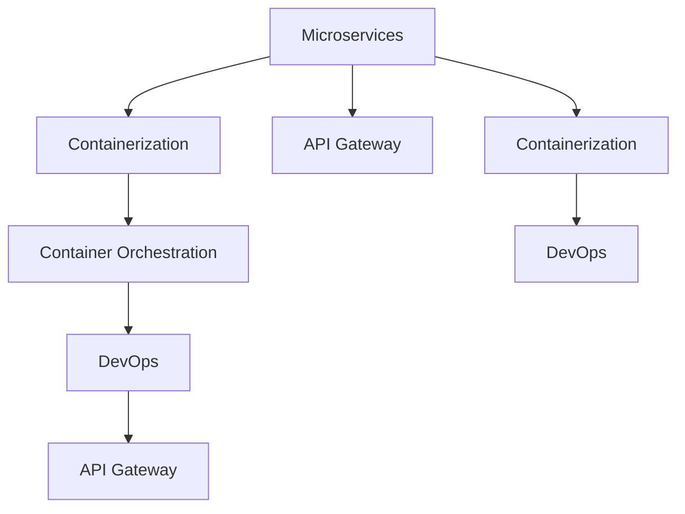

                 

# 云原生架构：微服务、容器与Kubernetes

> 关键词：云原生,微服务,容器,容器编排,微服务架构,DevOps,持续集成,持续部署,API网关

## 1. 背景介绍

随着数字化转型的深入，企业对于信息系统的需求变得日趋复杂和多样化，传统的单体架构已经难以满足现代应用的性能、扩展性和灵活性要求。云原生技术应运而生，通过微服务、容器和Kubernetes等组件构建可伸缩、高性能、高可用、弹性运维的系统，满足了现代应用的发展需要。

云原生技术是众多先进架构理念和工具的集成，包括DevOps、持续集成/持续部署(CI/CD)、容器化、微服务架构等。这些技术不仅简化了应用开发和部署流程，提高了系统的可靠性、灵活性和效率，还推动了业务模式的创新和转型，成为了现代IT架构的核心组成部分。

本文将详细介绍云原生架构中的微服务、容器和Kubernetes等关键技术，探讨其在实际应用中的实现方法和优化策略。

## 2. 核心概念与联系

### 2.1 核心概念概述

为更好地理解云原生架构，本节将介绍几个关键核心概念及其相互关系：

- **微服务(Microservices)**：将应用拆分为多个小服务，每个服务独立运行、独立部署、独立扩展，降低系统复杂度，提升开发效率和灵活性。

- **容器化(Containerization)**：将应用及其依赖打包在容器中，保证应用在任意环境中一致性运行，方便部署和扩展。

- **容器编排(Container Orchestration)**：通过编排工具自动化管理容器化应用，实现自动化部署、扩展、监控和调度。

- **DevOps(DevOps)**：融合开发和运维，通过自动化流程和持续集成/持续部署(CI/CD)提升软件交付效率和质量。

- **API网关(API Gateway)**：提供一个统一的入口，对外部服务进行路由、认证、限流和缓存等操作，提高系统可用性和安全性。

这些核心概念通过互相结合，形成了一个完整的云原生架构体系，帮助企业构建高效、灵活、可靠的系统。

### 2.2 核心概念原理和架构的 Mermaid 流程图



## 3. 核心算法原理 & 具体操作步骤

### 3.1 算法原理概述

云原生架构的核心在于通过微服务、容器和Kubernetes等组件，实现应用的自动化部署、扩展和管理。其核心原理包括以下几点：

- **微服务拆分**：将复杂的应用拆分为多个小服务，每个服务独立运行，方便开发、测试和部署。
- **容器化封装**：将应用和依赖打包到容器中，保证在不同环境中一致性运行。
- **容器编排管理**：通过容器编排工具自动化管理容器化应用，实现动态扩展和调度。
- **DevOps自动化**：通过持续集成/持续部署流程，实现代码自动化构建、测试、部署和发布。
- **API网关统一管理**：提供一个统一的入口，对外部服务进行路由、认证、限流和缓存等操作。

### 3.2 算法步骤详解

云原生架构的构建一般包括以下几个关键步骤：

**Step 1: 应用拆分与微服务设计**

- 将原有单体应用按照业务功能拆分为多个微服务。
- 定义微服务的边界、接口、依赖关系等，确保各个微服务可以独立运行、扩展和部署。

**Step 2: 应用容器化**

- 将每个微服务打包到Docker或Kubernetes容器，并编写容器镜像构建脚本。
- 配置容器的运行环境和依赖，确保容器在任意环境中一致性运行。

**Step 3: 容器编排与部署**

- 使用Kubernetes等容器编排工具管理容器化应用。
- 定义容器的资源需求、调度策略和扩缩容规则。
- 创建容器编排的Deployment和Service资源，实现应用的自动化部署和扩展。

**Step 4: DevOps自动化**

- 搭建CI/CD流水线，实现代码的自动化构建、测试和部署。
- 配置自动化测试工具，确保代码质量和功能稳定。
- 使用持续集成平台，自动化发布和管理应用。

**Step 5: API网关统一管理**

- 搭建API网关，提供一个统一的入口，管理所有外部服务。
- 实现服务的路由、限流、认证和缓存等操作，提高系统可用性和安全性。

**Step 6: 监控和日志**

- 部署监控和日志系统，实时监控应用的运行状态和性能指标。
- 配置告警规则，及时发现和解决系统问题。

### 3.3 算法优缺点

云原生架构具有以下优点：

- **提升开发效率**：微服务拆分使得开发更加敏捷，各服务独立部署，互不影响。
- **增强系统灵活性**：通过容器化封装和容器编排，实现应用的快速扩展和部署。
- **提升系统可靠性**：微服务架构通过分布式设计，减少单点故障，提高系统的可用性和健壮性。
- **优化运维成本**：自动化流程和DevOps工具，减少人为干预，降低运维成本。
- **改进用户体验**：API网关统一管理所有服务，提供稳定的API接口，提升用户体验。

然而，云原生架构也存在一些缺点：

- **系统复杂性增加**：微服务拆分和分布式设计，增加了系统的复杂性和维护难度。
- **性能损失**：容器化封装和网络通信开销，可能导致一定的性能损失。
- **资源消耗大**：容器编排和管理，需要额外的计算和存储资源。
- **学习成本高**：新技术的引入，增加了学习成本和适应难度。

### 3.4 算法应用领域

云原生架构广泛应用于多个领域，包括但不限于：

- **金融科技**：提升交易系统的性能和稳定性，降低系统风险。
- **电商零售**：支持高并发、低延迟的交易和物流系统，提升用户体验。
- **医疗健康**：构建可靠、高效的医疗信息系统，保障患者安全和隐私。
- **智慧城市**：通过实时数据处理和决策支持，提升城市管理效率和响应速度。
- **游戏娱乐**：实现高效、稳定的在线游戏和直播平台，提升用户粘性和满意度。

## 4. 数学模型和公式 & 详细讲解 & 举例说明

### 4.1 数学模型构建

云原生架构中的核心算法主要是基于容器编排和DevOps流程的自动化实现。下面以Kubernetes为例，构建其核心数学模型。

假设系统中有N个容器需要管理，每个容器需要配置CPU、内存、磁盘等资源。设每个容器所需的资源分别为CPU_i、内存_i、磁盘_i。

定义资源限制向量R=(CPU1, CPU2,...,CPU_i, CPU_i+1,...,CPU_N)，容量限制向量C=(CPU1, CPU2,...,CPU_i, CPU_i+1,...,CPU_N)。则系统的资源限制为：

$$
R \leq C
$$

Kubernetes通过调度器(Scheduler)分配资源，确保每个容器的资源需求不超过容量限制，同时最大化资源的利用率。

### 4.2 公式推导过程

以一个简单的资源分配问题为例，假设系统中有3个容器需要分配CPU资源，每个容器所需的CPU分别为1、2、3。定义CPU资源容量为10。

设调度器为容器的分配顺序为容器1、容器2、容器3。根据Kubernetes的调度策略，计算每个容器的分配结果：

- 容器1分配1个CPU，剩余容量9。
- 容器2分配2个CPU，剩余容量7。
- 容器3分配3个CPU，分配失败。

可见，当前的资源分配策略并未充分利用系统容量，存在资源浪费。

### 4.3 案例分析与讲解

以下是一个Kubernetes资源分配的案例分析。假设系统中有4个容器需要分配CPU和内存资源，每个容器所需的资源分别为：

- 容器1：CPU 2、内存 4GB
- 容器2：CPU 4、内存 8GB
- 容器3：CPU 2、内存 2GB
- 容器4：CPU 1、内存 2GB

定义资源限制向量R=(2,4,2,1)，容量限制向量C=(10,16,10,5)。

通过Kubernetes调度器进行资源分配，计算结果如下：

- 容器1分配2个CPU，内存4GB，剩余容量8，内存6GB。
- 容器2分配4个CPU，内存8GB，分配成功。
- 容器3分配2个CPU，内存2GB，剩余容量6，内存4GB。
- 容器4分配1个CPU，内存2GB，分配成功。

最终，系统资源得到充分利用，且未超过容量限制。

## 5. 项目实践：代码实例和详细解释说明

### 5.1 开发环境搭建

在进行云原生架构实践前，我们需要准备好开发环境。以下是使用Kubernetes搭建云原生架构的基本流程：

1. 安装Kubernetes集群。可以通过Kubernetes Minikube或公共云平台如AWS、GCP等搭建Kubernetes集群。

2. 安装Docker。从Docker官网下载并安装Docker，方便后续容器化部署。

3. 安装Helm。从Helm官网下载并安装Helm，方便后续的Kubernetes应用管理。

4. 安装GitLab。搭建GitLab作为CI/CD流水线的代码托管平台。

5. 配置CI/CD流水线。使用Jenkins、GitLab CI等工具，搭建自动化构建、测试和部署流水线。

完成上述步骤后，即可在Kubernetes环境中进行云原生架构的实践。

### 5.2 源代码详细实现

这里以一个简单的微服务示例，演示如何在Kubernetes中构建和部署微服务应用。

首先，创建一个Dockerfile文件，定义微服务的构建步骤：

```dockerfile
FROM python:3.7-slim
WORKDIR /app
COPY requirements.txt ./
RUN pip install -r requirements.txt
COPY . .
CMD ["python", "app.py"]
```

然后，创建一个Docker镜像，并进行本地测试：

```bash
docker build -t myapp .
docker run -p 8000:8000 myapp
```

接着，编写Kubernetes的Deployment和Service资源配置文件：

```yaml
apiVersion: apps/v1
kind: Deployment
metadata:
  name: myapp-deployment
spec:
  replicas: 3
  selector:
    matchLabels:
      app: myapp
  template:
    metadata:
      labels:
        app: myapp
    spec:
      containers:
      - name: myapp
        image: myapp:latest
        ports:
        - containerPort: 8000
---
apiVersion: v1
kind: Service
metadata:
  name: myapp-service
spec:
  selector:
    app: myapp
  ports:
  - port: 8000
    targetPort: 8000
```

最后，在Kubernetes集群中创建Deployment和Service资源，并进行测试：

```bash
kubectl apply -f deployment.yaml
kubectl apply -f service.yaml
kubectl get pods
kubectl get services
```

### 5.3 代码解读与分析

让我们再详细解读一下关键代码的实现细节：

**Dockerfile**：
- 从Python 3.7基础镜像开始构建。
- 设置工作目录和工作空间。
- 安装依赖库，并拷贝应用代码到容器中。
- 设置启动命令，运行应用。

**Deployment配置文件**：
- 定义Deployment的metadata和spec。
- 定义replicas，指定容器数量。
- 定义selector和template，指定容器的标签和定义。
- 定义容器的镜像、端口和环境变量等。

**Service配置文件**：
- 定义Service的metadata和spec。
- 定义selector和ports，指定服务的标签和端口。

**部署测试**：
- 使用kubectl命令，将配置文件应用到Kubernetes集群中。
- 使用kubectl命令，获取容器和服务的运行状态。

可以看到，通过Kubernetes工具，微服务的部署和扩展变得非常简单，开发者可以专注于应用的开发和测试。

### 5.4 运行结果展示

运行上述代码，即可在Kubernetes集群中成功创建并启动微服务应用。可以通过访问Service的暴露端口，访问微服务的API接口，验证应用是否正常运行。

## 6. 实际应用场景

### 6.1 金融科技

云原生架构在金融科技领域得到了广泛应用，提升了交易系统的性能和稳定性，降低了系统风险。例如，某银行通过微服务拆分，将交易、清算、结算等核心业务拆分为多个独立服务，提高了系统的可扩展性和可靠性。

在容器编排方面，银行使用Kubernetes进行容器化部署和资源管理，实现了交易系统的自动扩缩容和负载均衡。同时，通过API网关统一管理所有外部服务，提升了系统可用性和安全性。

### 6.2 电商零售

云原生架构在电商零售领域的应用，提高了交易和物流系统的性能和稳定性。例如，某电商平台通过微服务拆分，将订单处理、库存管理、物流跟踪等核心业务拆分为多个独立服务，提高了系统的可扩展性和稳定性。

在容器编排方面，平台使用Kubernetes进行容器化部署和资源管理，实现了交易系统的自动扩缩容和负载均衡。同时，通过API网关统一管理所有外部服务，提升了系统可用性和安全性。

### 6.3 医疗健康

云原生架构在医疗健康领域的应用，构建了可靠、高效的医疗信息系统。例如，某医院通过微服务拆分，将医生、护士、患者等角色拆分为多个独立服务，提高了系统的可扩展性和稳定性。

在容器编排方面，医院使用Kubernetes进行容器化部署和资源管理，实现了医疗系统的自动扩缩容和负载均衡。同时，通过API网关统一管理所有外部服务，提升了系统可用性和安全性。

### 6.4 智慧城市

云原生架构在智慧城市领域的应用，通过实时数据处理和决策支持，提升了城市管理效率和响应速度。例如，某城市通过微服务拆分，将交通管理、环保监测、公共安全等核心业务拆分为多个独立服务，提高了系统的可扩展性和稳定性。

在容器编排方面，城市使用Kubernetes进行容器化部署和资源管理，实现了城市系统的自动扩缩容和负载均衡。同时，通过API网关统一管理所有外部服务，提升了系统可用性和安全性。

## 7. 工具和资源推荐

### 7.1 学习资源推荐

为了帮助开发者系统掌握云原生架构的技术基础和实践技巧，这里推荐一些优质的学习资源：

1. **《Kubernetes权威指南》**：由Kubernetes官方团队撰写，全面介绍了Kubernetes的原理、设计、使用和最佳实践，是学习Kubernetes的权威指南。

2. **《微服务架构设计与实现》**：介绍了微服务架构的设计原则和实现方法，帮助开发者构建高效、灵活的系统。

3. **《Docker入门与实践》**：介绍了Docker的基本概念和实践方法，帮助开发者实现容器的自动化构建、部署和管理。

4. **《DevOps实践指南》**：介绍了DevOps的基本理念、工具和流程，帮助开发者实现自动化流程和持续集成/持续部署。

5. **《API网关原理与实践》**：介绍了API网关的基本概念和实现方法，帮助开发者实现统一管理和安全认证。

通过对这些资源的学习实践，相信你一定能够快速掌握云原生架构的精髓，并用于解决实际的IT问题。

### 7.2 开发工具推荐

高效的开发离不开优秀的工具支持。以下是几款用于云原生架构开发的常用工具：

1. **Kubernetes**：开源的容器编排系统，通过自动化管理容器化应用，实现动态扩展和调度。

2. **Docker**：开源的容器化平台，方便应用和依赖的打包和部署。

3. **Helm**：Kubernetes的应用管理工具，通过包管理和安装，简化Kubernetes的部署和管理。

4. **Jenkins**：开源的持续集成/持续部署工具，自动化构建、测试和部署。

5. **GitLab**：开源的代码托管平台，提供CI/CD流水线和团队协作功能。

6. **Prometheus**：开源的监控系统，实时监控应用的运行状态和性能指标。

7. **ELK Stack**：开源的日志管理系统，集中管理日志数据，提供实时查询和分析功能。

合理利用这些工具，可以显著提升云原生架构的开发效率，加快创新迭代的步伐。

### 7.3 相关论文推荐

云原生架构的发展得益于学界的持续研究。以下是几篇奠基性的相关论文，推荐阅读：

1. **《A Note on the Use of Containers》**：提出了容器的概念，奠定了容器化技术的基础。

2. **《The Kubernetes API》**：介绍了Kubernetes的API设计，详细说明了如何使用API进行容器编排和管理。

3. **《A Practical Introduction to DevOps》**：介绍了DevOps的基本理念和实践方法，帮助开发者实现自动化流程和持续集成/持续部署。

4. **《Microservices Architecture》**：介绍了微服务架构的设计原则和实现方法，帮助开发者构建高效、灵活的系统。

5. **《API Gateway Design and Implementation》**：介绍了API网关的基本概念和实现方法，帮助开发者实现统一管理和安全认证。

这些论文代表了大数据和云原生架构的发展脉络。通过学习这些前沿成果，可以帮助研究者把握学科前进方向，激发更多的创新灵感。

## 8. 总结：未来发展趋势与挑战

### 8.1 总结

本文对云原生架构中的微服务、容器和Kubernetes等关键技术进行了全面系统的介绍。首先阐述了云原生架构的背景和意义，明确了其提升开发效率、增强系统灵活性、提升系统可靠性和优化运维成本等优势。其次，从原理到实践，详细讲解了微服务拆分、容器化封装、容器编排、DevOps自动化、API网关统一管理等核心步骤，给出了云原生架构实践的完整代码实例。同时，本文还探讨了云原生架构在金融科技、电商零售、医疗健康、智慧城市等多个领域的应用前景，展示了云原生架构的巨大潜力。

通过本文的系统梳理，可以看到，云原生架构通过微服务拆分、容器化封装和容器编排，实现了应用的自动化部署、扩展和管理。这些技术不仅简化了应用开发和部署流程，提高了系统的可靠性、灵活性和效率，还推动了业务模式的创新和转型，成为了现代IT架构的核心组成部分。

### 8.2 未来发展趋势

展望未来，云原生架构将呈现以下几个发展趋势：

1. **微服务拆分深入**：随着应用的复杂性增加，微服务的拆分将更加细致和灵活，实现更细粒度的服务粒度划分。

2. **容器编排自动化**：通过Kubernetes等容器编排工具，自动化管理容器化应用，实现更高效的资源利用和部署。

3. **DevOps持续优化**：通过持续集成/持续部署流程，实现更高效的软件交付和管理。

4. **API网关多协议支持**：通过API网关统一管理多协议服务，提高系统的可用性和安全性。

5. **跨云协同管理**：通过云原生平台，实现跨云环境的应用部署和管理。

6. **边缘计算与云原生融合**：通过边缘计算技术，提高云原生架构的响应速度和实时性。

这些趋势将进一步提升云原生架构的性能和扩展性，推动其在更多领域的应用。

### 8.3 面临的挑战

尽管云原生架构已经取得了显著成就，但在迈向更加智能化、普适化应用的过程中，它仍面临诸多挑战：

1. **系统复杂性增加**：微服务拆分和分布式设计，增加了系统的复杂性和维护难度。

2. **性能损失**：容器化封装和网络通信开销，可能导致一定的性能损失。

3. **资源消耗大**：容器编排和管理，需要额外的计算和存储资源。

4. **学习成本高**：新技术的引入，增加了学习成本和适应难度。

5. **安全问题**：微服务的分布式设计和API网关的管理，带来了安全风险和挑战。

6. **标准化不足**：云原生架构的标准化工作仍在不断推进，需要更多的行业标准和规范。

这些挑战需要通过技术创新和规范化管理来解决，才能使云原生架构进一步落地应用。

### 8.4 研究展望

面向未来，云原生架构的研究方向包括：

1. **多云协同管理**：实现跨云环境的应用部署和管理，提升应用的灵活性和扩展性。

2. **边缘计算与云原生融合**：通过边缘计算技术，提高云原生架构的响应速度和实时性。

3. **微服务治理与监控**：通过微服务治理工具，提高微服务的可用性和可管理性。

4. **DevOps流程优化**：通过自动化流程和持续集成/持续部署，实现更高效的软件交付和管理。

5. **API网关多协议支持**：通过API网关统一管理多协议服务，提高系统的可用性和安全性。

6. **标准化与规范化**：推动云原生架构的标准化和规范化工作，提升应用的互操作性和可移植性。

这些研究方向将进一步提升云原生架构的性能和扩展性，推动其在更多领域的应用。

## 9. 附录：常见问题与解答

**Q1：云原生架构是否适用于所有应用？**

A: 云原生架构适用于大多数现代应用，特别是那些需要高可用性、高扩展性、高可靠性的应用。但一些传统的单体应用，特别是数据密集型应用，可能需要更复杂的架构设计和部署方法。

**Q2：云原生架构的学习难度大吗？**

A: 云原生架构的学习难度较高，需要掌握微服务、容器化、容器编排、DevOps等多方面的技术。但随着技术的不断成熟和社区的支持，学习资源和工具也越来越丰富，入门门槛正在逐步降低。

**Q3：云原生架构的部署成本高吗？**

A: 云原生架构的部署成本较高，需要搭建和维护Kubernetes集群、Docker镜像等基础设施。但通过自动化流程和DevOps工具，可以降低运维成本，提高系统的稳定性和可靠性。

**Q4：云原生架构的安全问题如何解决？**

A: 云原生架构的安全问题需要通过多层次的安全防护机制来解决。包括微服务的认证和授权、API网关的限流和日志审计等。同时，需要定期进行安全评估和漏洞修复，确保系统的安全性。

**Q5：云原生架构的性能问题如何解决？**

A: 云原生架构的性能问题可以通过优化微服务拆分、容器编排、网络通信等方面来解决。包括合理分配资源、优化容器镜像、使用高效的调度策略等。同时，需要定期进行性能测试和调优，确保系统的性能和稳定性。

通过本文的系统梳理，可以看到，云原生架构通过微服务拆分、容器化封装和容器编排，实现了应用的自动化部署、扩展和管理。这些技术不仅简化了应用开发和部署流程，提高了系统的可靠性、灵活性和效率，还推动了业务模式的创新和转型，成为了现代IT架构的核心组成部分。未来，伴随云原生技术的不断演进，云原生架构必将在更多领域得到应用，推动数字化转型的进程。

---

作者：禅与计算机程序设计艺术 / Zen and the Art of Computer Programming

