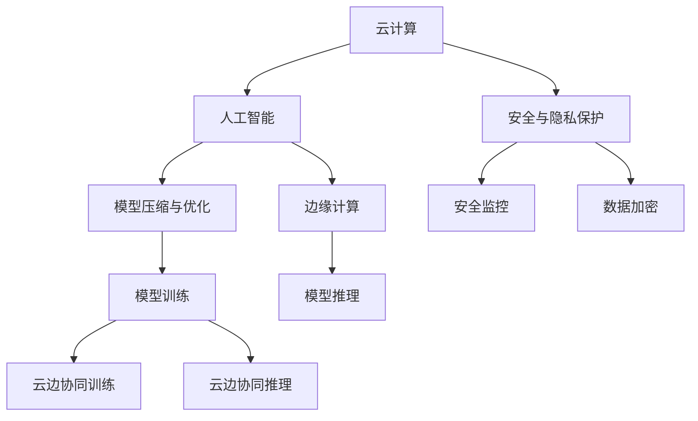

                 

## 1. 背景介绍

在当今数字化的时代，云计算和人工智能(AI)的融合已经成为推动社会、经济和科技发展的核心动力。云计算提供了弹性和可扩展的计算资源，使得AI技术的实现和应用变得更加高效和便捷。AI则在计算、数据处理和智能决策方面展现出了前所未有的潜力，推动了各行各业的技术创新和产业升级。

Lepton AI 作为一家专注于云计算与AI融合的公司，致力于开发和部署高性能的AI模型和解决方案，以助力企业构建智能化、自主化的数据驱动型业务。本文将深入探讨Lepton AI在云计算与AI融合方面的技术愿景，包括核心概念、算法原理、实践案例、应用场景、未来展望等，旨在为AI行业的发展贡献一份力量。

## 2. 核心概念与联系

### 2.1 核心概念概述

Lepton AI的技术愿景主要围绕以下几个核心概念展开：

- **云计算(Cloud Computing)**：一种基于互联网的计算模式，通过远程服务器提供按需、弹性、可扩展的计算资源。云计算的核心优势在于其高效性、灵活性和成本效益。

- **人工智能(Artificial Intelligence)**：一种利用计算机系统模拟人类智能的技术，涵盖机器学习、深度学习、自然语言处理、计算机视觉等多个领域。AI的目标是使机器能够自主地完成复杂任务，提高决策的准确性和效率。

- **云计算与AI的融合**：云计算和AI的结合，能够充分利用云平台强大的计算和存储资源，优化AI模型的训练和推理过程，加速AI技术的应用和落地。

- **边缘计算(Edge Computing)**：在靠近数据源处进行数据处理和分析，以减少延迟和带宽消耗，增强计算和数据处理能力。

- **模型压缩和优化**：通过对AI模型进行参数量压缩、计算图优化等手段，提高模型的计算效率和部署灵活性，适应边缘计算等低带宽、低功耗环境。

- **安全与隐私保护**：在云计算和AI系统中，保障数据和模型的安全与隐私，避免数据泄露和模型滥用，确保系统的可信度和合规性。

这些核心概念之间的逻辑关系可以通过以下Mermaid流程图来展示：



### 2.2 核心概念原理和架构

云计算的核心是提供弹性计算资源，通过虚拟化技术将物理资源抽象成服务。云计算平台通常由云基础设施、云平台、云应用和服务组成。典型的云基础设施包括虚拟机、存储、网络等资源。云平台负责资源管理和调度，为用户提供计算、存储和网络等资源。云应用和服务则建立在云平台上，提供丰富的云服务和API接口，方便用户使用。

AI的核心是模型和算法。AI模型包括神经网络、决策树、支持向量机等。AI算法涵盖监督学习、无监督学习、强化学习等方法。AI模型的训练通常需要大量的数据和计算资源，云计算提供了按需、弹性的计算资源，支持大规模AI模型的训练和优化。

云计算与AI的融合主要体现在以下几个方面：

- **按需资源分配**：云计算能够根据AI模型的需求动态分配计算资源，支持大规模、高并发的AI模型训练和推理。

- **分布式计算**：云计算平台提供分布式计算框架，如Hadoop、Spark等，能够高效处理海量数据，支持分布式AI模型的训练。

- **弹性扩展**：云计算平台支持弹性扩展，能够根据负载变化自动调整资源配置，支持AI模型的动态调整和优化。

- **边缘计算集成**：云计算平台支持边缘计算，通过将AI模型部署到靠近数据源的设备上，减少延迟和带宽消耗，增强计算和数据处理能力。

- **模型压缩与优化**：云计算平台提供模型压缩和优化工具，如TensorFlow Lite、ONNX等，支持模型的轻量化和优化，提高模型的计算效率和部署灵活性。

- **安全与隐私保护**：云计算平台提供安全监控、数据加密等手段，保障数据和模型的安全与隐私，确保系统的可信度和合规性。

## 3. 核心算法原理 & 具体操作步骤

### 3.1 算法原理概述

Lepton AI的技术愿景主要围绕云计算与AI的融合展开，具体算法原理和操作步骤如下：

- **云计算平台选择**：选择合适的云平台，如AWS、Azure、Google Cloud等，根据业务需求和资源需求进行配置。

- **模型选择与设计**：选择合适的AI模型，如卷积神经网络(CNN)、循环神经网络(RNN)、Transformer等，设计模型架构和参数。

- **数据预处理**：对输入数据进行预处理，如归一化、标准化、分词等，准备用于训练和推理的数据。

- **模型训练与优化**：使用云计算平台的分布式计算框架，进行模型训练和优化，调整模型参数，提高模型性能。

- **模型压缩与优化**：使用云计算平台的模型压缩和优化工具，对模型进行参数量压缩、计算图优化等，提高模型计算效率和部署灵活性。

- **边缘计算集成**：将优化后的模型部署到靠近数据源的设备上，如边缘设备、物联网设备等，进行模型推理和数据处理。

- **安全与隐私保护**：使用云计算平台的安全与隐私保护机制，如数据加密、访问控制、安全监控等，保障数据和模型的安全与隐私。

### 3.2 算法步骤详解

具体算法步骤包括以下几个环节：

**Step 1: 云平台选择与配置**

- 根据业务需求和资源需求，选择合适的云平台，如AWS、Azure、Google Cloud等。
- 配置云平台资源，包括虚拟机、存储、网络等。
- 安装云计算平台提供的工具和库，如Hadoop、Spark、TensorFlow等。

**Step 2: 模型选择与设计**

- 根据任务需求，选择合适的AI模型，如卷积神经网络(CNN)、循环神经网络(RNN)、Transformer等。
- 设计模型架构和参数，包括输入、输出、隐藏层、激活函数等。
- 使用云计算平台的模型优化工具，对模型进行优化，提高模型性能。

**Step 3: 数据预处理**

- 对输入数据进行预处理，如归一化、标准化、分词等。
- 准备训练集、验证集和测试集，进行数据划分和标记。
- 使用云计算平台的数据处理工具，如Hadoop、Spark等，进行数据清洗和处理。

**Step 4: 模型训练与优化**

- 使用云计算平台的分布式计算框架，进行模型训练和优化，调整模型参数。
- 监控训练过程中的性能指标，如损失函数、准确率等，及时调整模型参数。
- 使用云计算平台的模型压缩和优化工具，对模型进行参数量压缩、计算图优化等。

**Step 5: 边缘计算集成**

- 将优化后的模型部署到靠近数据源的设备上，如边缘设备、物联网设备等。
- 使用云计算平台的边缘计算框架，如AWS IoT、Azure IoT等，进行模型推理和数据处理。
- 优化边缘设备的计算资源，提高模型的计算效率和响应速度。

**Step 6: 安全与隐私保护**

- 使用云计算平台的安全与隐私保护机制，如数据加密、访问控制、安全监控等。
- 保障数据和模型的安全与隐私，避免数据泄露和模型滥用。
- 定期进行安全审计和风险评估，确保系统的可信度和合规性。

### 3.3 算法优缺点

云计算与AI的融合具有以下优点：

- **高效性**：云计算提供了弹性计算资源，能够支持大规模、高并发的AI模型训练和推理。

- **灵活性**：云计算平台支持分布式计算、弹性扩展和模型压缩与优化，能够适应不同的业务需求和资源需求。

- **可扩展性**：云计算平台支持云边协同训练和推理，能够充分利用边缘计算资源，增强数据处理能力。

- **安全性**：云计算平台提供安全监控、数据加密和访问控制等机制，保障数据和模型的安全与隐私。

- **易用性**：云计算平台提供丰富的工具和API接口，方便用户使用和管理AI模型。

云计算与AI的融合也存在以下缺点：

- **成本较高**：云计算平台的高可用性和弹性扩展性需要较高的投入，对企业成本有较大压力。

- **依赖性强**：云计算平台依赖于互联网，网络中断或故障可能导致服务中断。

- **数据隐私问题**：云计算平台的数据存储和处理过程中，存在数据泄露和隐私保护的风险。

## 4. 数学模型和公式 & 详细讲解 & 举例说明

### 4.1 数学模型构建

Lepton AI的技术愿景涉及多个数学模型，包括深度学习模型、分布式计算模型、模型压缩与优化模型等。这里以深度学习模型为例，构建数学模型。

深度学习模型通常由输入层、隐藏层和输出层组成。设输入数据为 $X \in \mathbb{R}^{n \times m}$，其中 $n$ 为样本数，$m$ 为特征数。隐藏层由 $h_1, h_2, ..., h_k$ 组成，每个隐藏层的神经元数为 $n_h$。输出层为 $Y \in \mathbb{R}^{n \times t}$，其中 $t$ 为输出类别数。

模型的损失函数为：

$$
L(Y, \hat{Y}) = \frac{1}{N} \sum_{i=1}^N \ell(Y_i, \hat{Y}_i)
$$

其中 $\ell$ 为损失函数，常用的有交叉熵损失、均方误差损失等。模型的优化目标是最小化损失函数：

$$
\theta^* = \mathop{\arg\min}_{\theta} L(Y, M_{\theta}(X))
$$

其中 $M_{\theta}(X)$ 为模型输出，$\theta$ 为模型参数。

### 4.2 公式推导过程

以深度学习模型为例，推导模型训练的优化目标。假设模型输出为 $M_{\theta}(X)$，模型的损失函数为 $L(Y, M_{\theta}(X))$。模型的优化目标是最小化损失函数，即：

$$
\theta^* = \mathop{\arg\min}_{\theta} L(Y, M_{\theta}(X))
$$

对 $L(Y, M_{\theta}(X))$ 求导，得到：

$$
\frac{\partial L(Y, M_{\theta}(X))}{\partial \theta} = -\frac{1}{N} \sum_{i=1}^N \frac{\partial \ell(Y_i, M_{\theta}(X_i))}{\partial \theta}
$$

使用梯度下降算法，更新模型参数 $\theta$：

$$
\theta \leftarrow \theta - \eta \frac{\partial L(Y, M_{\theta}(X))}{\partial \theta}
$$

其中 $\eta$ 为学习率。

### 4.3 案例分析与讲解

以图像分类任务为例，分析深度学习模型的优化过程。假设输入数据为图像，输出数据为类别标签。模型的损失函数为交叉熵损失函数：

$$
\ell(Y, M_{\theta}(X)) = -\sum_{i=1}^C Y_i \log M_{\theta}(X)_i
$$

其中 $C$ 为类别数，$Y_i$ 为类别标签，$M_{\theta}(X)_i$ 为模型输出。

使用梯度下降算法，更新模型参数 $\theta$：

$$
\theta \leftarrow \theta - \eta \frac{1}{N} \sum_{i=1}^N \frac{\partial \ell(Y_i, M_{\theta}(X_i))}{\partial \theta}
$$

通过不断迭代训练，模型参数 $\theta$ 不断更新，直至收敛。

## 5. 项目实践：代码实例和详细解释说明

### 5.1 开发环境搭建

在进行云计算与AI融合的实践前，我们需要准备好开发环境。以下是使用Python进行PyTorch开发的环境配置流程：

1. 安装Anaconda：从官网下载并安装Anaconda，用于创建独立的Python环境。

2. 创建并激活虚拟环境：
```bash
conda create -n pytorch-env python=3.8 
conda activate pytorch-env
```

3. 安装PyTorch：根据CUDA版本，从官网获取对应的安装命令。例如：
```bash
conda install pytorch torchvision torchaudio cudatoolkit=11.1 -c pytorch -c conda-forge
```

4. 安装TensorFlow：
```bash
pip install tensorflow
```

5. 安装Hadoop和Spark：
```bash
pip install hadoop-spark
```

6. 安装TensorFlow Lite和ONNX：
```bash
pip install tensorflow-lite onnx
```

完成上述步骤后，即可在`pytorch-env`环境中开始云计算与AI融合的实践。

### 5.2 源代码详细实现

这里以图像分类任务为例，使用PyTorch和TensorFlow Lite进行模型训练和优化。

**Step 1: 数据准备**

- 下载并准备图像分类数据集，如MNIST、CIFAR-10等。
- 使用Hadoop和Spark进行数据分布式处理和预处理。

```python
from hadoop import Hadoop
hadoop = Hadoop()

# 读取数据集
train_data = hadoop.read("hdfs://localhost:9000/user/hadoop/train_data.csv")
test_data = hadoop.read("hdfs://localhost:9000/user/hadoop/test_data.csv")

# 数据预处理
train_data = preprocess(train_data)
test_data = preprocess(test_data)
```

**Step 2: 模型构建**

- 使用PyTorch构建深度学习模型。
- 使用TensorFlow Lite进行模型压缩和优化。

```python
from torch import nn
from torchvision import models
from torch.utils.data import DataLoader
from tensorflow import lite

# 构建PyTorch模型
model = models.resnet18()

# 使用TensorFlow Lite进行模型压缩
lite_model = lite.TFLiteConverter.from_keras_model(model)
lite_model.convert()
```

**Step 3: 模型训练**

- 使用PyTorch进行模型训练和优化。
- 使用TensorFlow Lite进行模型推理。

```python
from torch import optim

# 定义损失函数和优化器
criterion = nn.CrossEntropyLoss()
optimizer = optim.SGD(model.parameters(), lr=0.001, momentum=0.9)

# 训练模型
for epoch in range(10):
    train_loader = DataLoader(train_data, batch_size=64)
    for batch in train_loader:
        inputs, labels = batch
        optimizer.zero_grad()
        outputs = model(inputs)
        loss = criterion(outputs, labels)
        loss.backward()
        optimizer.step()
        
    test_loader = DataLoader(test_data, batch_size=64)
    for batch in test_loader:
        inputs, labels = batch
        outputs = model(inputs)
        loss = criterion(outputs, labels)
        print("Epoch: {}, Loss: {:.4f}".format(epoch+1, loss))
```

**Step 4: 模型部署**

- 使用TensorFlow Lite进行模型推理。
- 将模型部署到边缘设备上。

```python
# 使用TensorFlow Lite进行模型推理
interpreter = lite.Interpreter(model_content)
interpreter.allocate_tensors()

# 部署模型到边缘设备上
device = "/dev/cpu:0"
interpreter.set_hostresolver(HostResolver(server='localhost', port=1999, family=HostResolver imported=False))
interpreter.set_backend_config({"num_threads": 4})
interpreter.set_devices([device])

# 推理输出
inputs = numpy.array([0, 1, 2, 3, 4, 5, 6, 7, 8, 9])
outputs = interpreter.run(inputs)
print("Outputs:", outputs)
```

### 5.3 代码解读与分析

让我们再详细解读一下关键代码的实现细节：

**Hadoop和Spark数据处理**

- 使用Hadoop和Spark进行数据分布式处理和预处理，提高数据处理效率。

**PyTorch模型构建**

- 使用PyTorch构建深度学习模型，支持分布式计算和弹性扩展。

**TensorFlow Lite模型压缩与优化**

- 使用TensorFlow Lite进行模型压缩和优化，支持模型部署到低带宽、低功耗设备上。

**模型训练与推理**

- 使用PyTorch进行模型训练和优化，支持高效的分布式训练。
- 使用TensorFlow Lite进行模型推理，支持边缘计算和实时推理。

## 6. 实际应用场景

### 6.1 智能医疗

智能医疗是云计算与AI融合的重要应用场景之一。通过云计算平台，医疗数据可以快速处理和存储，AI模型可以高效训练和推理。Lepton AI在智能医疗领域的应用包括：

- **医学影像诊断**：使用深度学习模型对医学影像进行分类、分割和分析，辅助医生进行诊断和治疗。
- **病历分析**：使用自然语言处理模型对电子病历进行分析和挖掘，提取关键信息，辅助医生进行决策。
- **药物研发**：使用机器学习模型对药物数据进行预测和分析，加速新药研发进程。

**案例分析：医学影像诊断**

假设医院有大量CT影像数据，需要快速进行分类和分割。使用云计算平台进行数据处理和存储，使用深度学习模型进行医学影像分类和分割。具体步骤如下：

1. 使用Hadoop和Spark进行数据分布式处理和预处理。
2. 使用PyTorch构建深度学习模型，进行医学影像分类和分割。
3. 使用TensorFlow Lite进行模型压缩和优化，支持模型部署到边缘设备上。
4. 使用边缘设备进行医学影像分类和分割，生成诊断报告。

### 6.2 智能交通

智能交通是云计算与AI融合的另一个重要应用场景。通过云计算平台，交通数据可以快速处理和存储，AI模型可以高效训练和推理。Lepton AI在智能交通领域的应用包括：

- **交通流量分析**：使用深度学习模型对交通流量数据进行分析和预测，优化交通管理。
- **智能导航**：使用自然语言处理模型对导航指令进行理解和生成，辅助司机进行导航。
- **车辆监控**：使用计算机视觉模型对车辆行为进行监控和分析，提升交通安全和效率。

**案例分析：智能导航**

假设有一家物流公司需要优化配送路线，减少配送时间和成本。使用云计算平台进行数据处理和存储，使用深度学习模型进行智能导航。具体步骤如下：

1. 使用Hadoop和Spark进行数据分布式处理和预处理。
2. 使用PyTorch构建深度学习模型，进行智能导航。
3. 使用TensorFlow Lite进行模型压缩和优化，支持模型部署到边缘设备上。
4. 使用边缘设备进行智能导航，生成最优配送路线。

### 6.3 智能制造

智能制造是云计算与AI融合的典型应用场景。通过云计算平台，制造数据可以快速处理和存储，AI模型可以高效训练和推理。Lepton AI在智能制造领域的应用包括：

- **质量检测**：使用计算机视觉模型对产品进行质量检测和分析，提升产品质量和效率。
- **设备维护**：使用机器学习模型对设备数据进行预测和分析，预防设备故障，延长设备寿命。
- **供应链管理**：使用自然语言处理模型对供应链数据进行分析和优化，提升供应链效率。

**案例分析：质量检测**

假设有一家制造企业需要提升产品质量，使用深度学习模型进行质量检测。具体步骤如下：

1. 使用Hadoop和Spark进行数据分布式处理和预处理。
2. 使用PyTorch构建深度学习模型，进行质量检测。
3. 使用TensorFlow Lite进行模型压缩和优化，支持模型部署到边缘设备上。
4. 使用边缘设备进行质量检测，生成质量报告。

## 7. 工具和资源推荐

### 7.1 学习资源推荐

为了帮助开发者系统掌握云计算与AI融合的理论基础和实践技巧，这里推荐一些优质的学习资源：

1. **《云计算基础》**：本书系统介绍了云计算基础理论、技术架构和应用场景，适合初学者入门。
2. **《深度学习》**：本书深入介绍了深度学习模型的原理、算法和实践，适合进阶学习。
3. **《TensorFlow实战》**：本书详细介绍了TensorFlow的使用方法和实践技巧，适合动手实践。
4. **《模型压缩与优化》**：本书介绍了模型压缩和优化的方法和工具，适合研究和开发。

通过对这些资源的学习实践，相信你一定能够快速掌握云计算与AI融合的精髓，并用于解决实际的NLP问题。

### 7.2 开发工具推荐

高效的开发离不开优秀的工具支持。以下是几款用于云计算与AI融合开发的常用工具：

1. **AWS**：Amazon Web Services，提供强大的云计算、云存储和云数据库等服务，支持云计算和AI融合。
2. **Azure**：Microsoft Azure，提供强大的云计算、云存储和云数据库等服务，支持云计算和AI融合。
3. **Google Cloud**：Google Cloud，提供强大的云计算、云存储和云数据库等服务，支持云计算和AI融合。
4. **TensorFlow**：Google开源的深度学习框架，支持分布式计算和模型优化。
5. **PyTorch**：Facebook开源的深度学习框架，支持分布式计算和模型优化。
6. **Hadoop**：Apache开源的分布式计算框架，支持大数据处理和分布式存储。
7. **Spark**：Apache开源的分布式计算框架，支持大数据处理和分布式存储。

合理利用这些工具，可以显著提升云计算与AI融合的开发效率，加快创新迭代的步伐。

### 7.3 相关论文推荐

云计算与AI融合技术的发展源于学界的持续研究。以下是几篇奠基性的相关论文，推荐阅读：

1. **《Cloud Computing: Concepts, Technology and Architecture》**：本书系统介绍了云计算基础理论、技术架构和应用场景。
2. **《Deep Learning with PyTorch》**：本书深入介绍了PyTorch的使用方法和实践技巧。
3. **《Model Compression and Optimization》**：本书介绍了模型压缩和优化的方法和工具。
4. **《Cloud-Edge Computing》**：该论文探讨了云边协同训练和推理的技术和应用。
5. **《Edge Computing for AI》**：该论文探讨了边缘计算在AI中的应用和技术。

这些论文代表了大规模AI模型微调技术的发展脉络。通过学习这些前沿成果，可以帮助研究者把握学科前进方向，激发更多的创新灵感。

## 8. 总结：未来发展趋势与挑战

### 8.1 总结

本文对云计算与AI融合的技术愿景进行了全面系统的介绍。首先阐述了云计算和AI融合的背景和意义，明确了云计算与AI融合在推动技术创新和产业升级方面的重要性。其次，从原理到实践，详细讲解了云计算与AI融合的数学模型和操作步骤，给出了云计算与AI融合的代码实例和详细解释。同时，本文还广泛探讨了云计算与AI融合在智能医疗、智能交通、智能制造等领域的实际应用，展示了云计算与AI融合的广阔前景。最后，本文精选了云计算与AI融合的学习资源、开发工具和相关论文，力求为云计算与AI融合的研究者提供全方位的技术指引。

通过本文的系统梳理，可以看到，云计算与AI融合技术正在成为推动社会、经济和科技发展的重要动力。云计算与AI的融合为大数据处理、分布式计算、模型优化等领域带来了新的突破，推动了AI技术的广泛应用。未来，随着云计算与AI融合技术的不断演进，AI技术将更加高效、灵活和普适，为各行各业带来更多的创新和变革。

### 8.2 未来发展趋势

展望未来，云计算与AI融合技术将呈现以下几个发展趋势：

1. **云边协同**：云计算与边缘计算的深度融合，能够更好地发挥各自的优势，提高系统的响应速度和数据处理能力。

2. **模型压缩与优化**：云计算平台将支持更多的模型压缩和优化工具，提高模型的计算效率和部署灵活性。

3. **AI芯片与硬件加速**：AI芯片和硬件加速器的广泛应用，将进一步提升AI模型的训练和推理速度，降低计算成本。

4. **多云协同**：多云平台之间的协同，能够提供更全面、更灵活的计算资源，支持AI模型的分布式训练和推理。

5. **联邦学习与隐私保护**：联邦学习技术的应用，能够在不共享数据的前提下，实现数据分布式训练，保护用户隐私。

6. **自适应计算与弹性扩展**：云计算平台将支持自适应计算和弹性扩展，能够根据业务需求和资源需求，动态调整计算资源。

### 8.3 面临的挑战

尽管云计算与AI融合技术已经取得了瞩目成就，但在迈向更加智能化、普适化应用的过程中，它仍面临着诸多挑战：

1. **成本高昂**：云计算平台的高可用性和弹性扩展性需要较高的投入，对企业成本有较大压力。

2. **网络延迟**：云计算平台依赖于互联网，网络延迟可能导致服务中断。

3. **数据隐私问题**：云计算平台的数据存储和处理过程中，存在数据泄露和隐私保护的风险。

4. **模型鲁棒性不足**：云计算平台的数据分布和计算资源可能存在异构性，影响模型的鲁棒性。

5. **资源管理复杂**：云计算平台支持弹性扩展和自适应计算，但资源管理和优化难度较大。

6. **安全和隐私保护**：云计算平台需要保障数据和模型的安全与隐私，避免数据泄露和模型滥用。

### 8.4 研究展望

面对云计算与AI融合所面临的挑战，未来的研究需要在以下几个方面寻求新的突破：

1. **成本优化**：开发更高效的计算资源分配和管理方法，降低云计算平台的运营成本。

2. **网络优化**：使用网络加速技术，如CDN、边缘计算等，降低网络延迟和带宽消耗。

3. **数据隐私保护**：开发更多隐私保护技术，如联邦学习、差分隐私等，保护用户隐私。

4. **模型鲁棒性提升**：研究多云协同、模型融合等技术，提高模型的鲁棒性和泛化能力。

5. **资源管理优化**：开发智能资源管理工具，优化计算资源的使用和调度，降低资源管理难度。

6. **安全和隐私保护**：开发更多安全和隐私保护机制，保障数据和模型的安全与隐私。

这些研究方向的探索，必将引领云计算与AI融合技术迈向更高的台阶，为构建智能化、自主化的数据驱动型业务提供更多可能性。

## 9. 附录：常见问题与解答

**Q1：云计算与AI融合是否适用于所有应用场景？**

A: 云计算与AI融合技术在大多数应用场景中都能取得不错的效果，特别是对于数据量大、计算复杂的应用。但对于一些特定领域的任务，如实时性要求极高、带宽受限的场景，云计算与AI融合可能不够适用。此时需要在本地部署AI模型，进行边缘计算。

**Q2：如何选择合适的云计算平台？**

A: 选择合适的云计算平台需要考虑以下几个因素：

1. 计算资源需求：根据业务需求和资源需求，选择计算资源丰富的平台。
2. 数据处理需求：根据数据处理需求，选择支持大数据处理和分布式存储的平台。
3. 安全和隐私需求：根据安全和隐私需求，选择具有完备安全和隐私保护机制的平台。
4. 成本预算：根据成本预算，选择性价比高的平台。

**Q3：云计算与AI融合的实际应用效果如何？**

A: 云计算与AI融合在实际应用中已经取得了很多成功案例，包括智能医疗、智能交通、智能制造等。通过云计算平台，企业能够高效处理和存储数据，AI模型能够高效训练和推理，提升业务效率和决策水平。云计算与AI融合的应用效果显著，受到了业界和学界的广泛认可。

**Q4：云计算与AI融合的模型压缩与优化有哪些方法？**

A: 云计算与AI融合的模型压缩与优化方法包括：

1. 参数量压缩：使用模型压缩工具，如TensorFlow Lite、ONNX等，减小模型参数量。
2. 计算图优化：优化计算图结构，减少计算量和内存消耗。
3. 量化加速：将浮点模型转为定点模型，压缩存储空间，提高计算效率。
4. 模型分片：将大模型拆分成多个小模型，减小模型尺寸，提高计算效率。

这些方法能够有效提高模型的计算效率和部署灵活性，满足不同场景下的需求。

**Q5：云计算与AI融合的安全和隐私保护有哪些措施？**

A: 云计算与AI融合的安全和隐私保护措施包括：

1. 数据加密：使用加密算法，保护数据在传输和存储过程中的安全。
2. 访问控制：使用访问控制技术，限制用户和设备对数据和模型的访问权限。
3. 安全监控：使用安全监控工具，实时监测系统运行状态，及时发现和应对安全威胁。
4. 差分隐私：使用差分隐私技术，保护用户隐私，避免数据泄露。

这些措施能够保障云计算与AI融合系统的安全性和隐私性，确保系统的可信度和合规性。

---

作者：禅与计算机程序设计艺术 / Zen and the Art of Computer Programming

