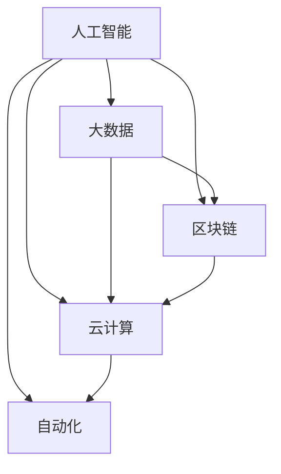

                 

# 人力资源科技创业：人才管理的数字化转型

> 关键词：人力资源科技,数字化转型,人才管理,人工智能,大数据,区块链,云计算,自动化

## 1. 背景介绍

### 1.1 问题由来
人力资源管理一直是企业发展的关键环节。从招聘、培训、绩效评估到员工关系管理，各环节相互关联，对企业的生产效率、人才结构、组织氛围等方面都有着深远的影响。传统的人力资源管理依赖于人工操作和纸质文档，存在着数据孤岛、信息不对称、效率低下等问题，难以满足现代企业对于智能化、高效化、灵活化的管理需求。

面对这些挑战，人力资源科技（Human Resource Technology, HRT）应运而生。通过数字化技术的应用，HRT不仅能够优化传统的人力资源管理流程，提升管理效率，还能洞察人才动态，驱动人力资源策略的科学化、数据化和智能化，进而实现企业的数字化转型。本文将探讨如何运用人工智能、大数据、区块链、云计算、自动化等前沿科技，对人力资源管理进行全面的数字化升级。

### 1.2 问题核心关键点
实现人才管理的数字化转型，关键在于以下几个方面：

- 如何整合和管理多源数据：企业内部和外部的数据来源众多，且格式各异，需要高效的数据整合和管理技术，确保数据一致性和可用性。
- 如何构建智能分析模型：借助人工智能和大数据技术，构建智能化的分析模型，辅助决策，提升管理效率和质量。
- 如何实现自动化和智能化：通过自动化流程和智能化算法，实现人力资源管理的自动化、智能化，降低人工操作和错误风险。
- 如何保障数据安全和隐私：人力资源管理涉及敏感信息，需采用区块链等技术，保障数据的不可篡改性和隐私性。
- 如何推动组织变革：通过数字化转型，推动企业的组织架构、业务流程、文化氛围等各个方面的变革，赋能员工，提高整体效能。

这些关键点构成了人力资源科技转型的核心框架，为实现人才管理的数字化提供了方向和思路。

## 2. 核心概念与联系

### 2.1 核心概念概述

为更好地理解人力资源科技的数字化转型，本节将介绍几个关键概念：

- 人工智能（AI）：通过机器学习、深度学习等技术，使计算机具备了类似人类的学习能力，用于数据分析、决策支持、自动化流程等。
- 大数据（Big Data）：指规模庞大、多样化的数据集，通过分析挖掘其中的价值，辅助决策和管理。
- 区块链（Blockchain）：一种分布式账本技术，通过去中心化、透明化、不可篡改的特性，保障数据安全和隐私。
- 云计算（Cloud Computing）：利用互联网技术，提供按需、弹性、高可用的计算资源和存储服务。
- 自动化（Automation）：通过流程优化和算法实现，减少人工干预，提高效率和准确性。

这些核心概念之间的逻辑关系可以通过以下Mermaid流程图来展示：



这个流程图展示了各个核心概念之间的关系：

1. 人工智能和大数据紧密结合，通过算法和数据挖掘，提供智能分析与决策支持。
2. 区块链和云计算为大数据提供了安全的存储和传输环境，保障数据的完整性和隐私性。
3. 自动化流程和智能化算法驱动了人工智能和大数据在实际应用中的落地，提升了人力资源管理的效率和效果。

## 3. 核心算法原理 & 具体操作步骤
### 3.1 算法原理概述

人力资源科技的数字化转型，本质上是利用先进技术手段，重构传统的人力资源管理流程，实现业务智能化、自动化和数据化。其核心算法原理主要包括以下几个方面：

- 数据清洗与整合：通过算法自动化清洗数据，消除噪音，填补缺失，统一数据格式，确保数据的完整性和一致性。
- 数据分析与挖掘：运用机器学习、深度学习等技术，对大量数据进行分析和挖掘，识别模式和趋势，辅助决策。
- 智能决策与预测：构建智能分析模型，实现基于数据的决策和预测，提升管理精准度和预见性。
- 自动化流程与任务：通过自动化算法实现流程的自动化，减少人工干预，提高效率。
- 智能推荐与匹配：利用推荐算法，实现人才智能推荐、岗位匹配等功能，优化人才配置。

### 3.2 算法步骤详解

人力资源科技的数字化转型，可以分为以下几个关键步骤：

**Step 1: 数据采集与清洗**
- 通过系统集成、API接口等方式，从企业内部和外部多源数据中采集人力资源信息，如简历、招聘信息、绩效数据、培训记录等。
- 运用数据清洗算法，处理数据缺失、噪声、重复等问题，确保数据质量。

**Step 2: 数据分析与建模**
- 使用大数据分析工具，对清洗后的数据进行深入分析，挖掘其中的模式和趋势，生成各类报表和统计指标。
- 构建智能分析模型，如基于机器学习的预测模型、分类模型等，辅助决策。

**Step 3: 自动化流程与任务**
- 根据业务需求，设计自动化流程，通过脚本、API等方式实现流程自动化。
- 使用自动化算法，优化流程效率，减少人工干预，降低错误风险。

**Step 4: 智能推荐与匹配**
- 基于员工技能、岗位需求、企业战略等数据，构建智能推荐系统，实现人才和岗位的智能匹配。
- 使用协同过滤、深度学习等算法，提高推荐精准度和效果。

**Step 5: 数据安全与隐私保护**
- 使用区块链技术，实现数据的不可篡改性和隐私保护。
- 采用安全传输协议，保障数据在传输过程中的安全性。

### 3.3 算法优缺点

人力资源科技的数字化转型，具有以下优点：

1. 效率提升：自动化和智能化技术大大提高了人力资源管理的效率，减少了人工操作和错误风险。
2. 决策科学化：通过数据分析和智能模型，提供基于数据的决策支持，提升了决策的精准度和科学性。
3. 数据化管理：将人力资源管理流程数据化，便于分析和追踪，为管理改进提供了依据。
4. 灵活化运营：通过数字化技术，实现了人力资源管理流程的灵活化和可定制化，适应不同业务需求。

同时，该方法也存在一些局限性：

1. 技术门槛高：需要具备一定的技术能力和经验，才能有效地应用和推广数字化技术。
2. 成本投入大：初期需投入大量资金进行系统建设和技术开发，对中小企业而言，门槛较高。
3. 数据质量要求高：需要高质量、结构化数据，数据采集和清洗工作量大。
4. 技术融合难度大：人力资源管理流程复杂，涉及多个业务部门和系统，技术融合难度大。

尽管存在这些局限性，但人力资源科技的数字化转型仍是大势所趋，对于提升人力资源管理的效率和效果具有重要的意义。未来相关研究的重点在于如何进一步降低技术门槛，提升系统易用性，降低成本，同时兼顾数据质量和隐私保护等因素。

### 3.4 算法应用领域

人力资源科技的数字化转型，已经在多个领域得到了广泛的应用，例如：

- 招聘管理：通过智能推荐系统，提高招聘效率和质量，优化招聘流程。
- 绩效管理：运用数据分析和智能模型，评估员工绩效，提升绩效管理精准度。
- 培训与发展：利用大数据和人工智能，设计个性化的培训方案，提升员工技能和素质。
- 薪酬管理：实现薪酬数据化管理，优化薪酬结构和激励机制，提升员工满意度和激励效果。
- 员工关系管理：通过智能分析，预测员工流失风险，优化员工关系，提升员工粘性。
- 组织架构优化：利用大数据分析，优化组织架构，提升企业竞争力。

除了上述这些经典应用外，人力资源科技还在人才市场分析、智能客服、智能面试等更多场景中得到应用，为人力资源管理带来了全新的突破。随着技术的不断进步，人力资源科技必将在更多领域发挥更大的作用，推动企业的人力资源管理向更智能化、高效化和数据化的方向发展。

## 4. 数学模型和公式 & 详细讲解 & 举例说明
### 4.1 数学模型构建

本节将使用数学语言对人力资源科技的数字化转型过程进行更加严格的刻画。

记企业的人力资源管理数据集为 $D=\{(x_i,y_i)\}_{i=1}^N, x_i \in \mathcal{X}, y_i \in \mathcal{Y}$，其中 $x_i$ 表示人力资源管理的一个特征向量，$y_i$ 表示其对应的标签（如绩效、流失风险等）。

定义人力资源管理问题的损失函数为 $\ell(x,y)$，表示模型在给定输入 $x$ 和标签 $y$ 上的预测误差。则经验风险为：

$$
\mathcal{L}(D)=\frac{1}{N} \sum_{i=1}^N \ell(x_i,y_i)
$$

在人力资源科技的数字化转型中，我们通常使用基于梯度的优化算法，如SGD、Adam等，通过最小化损失函数 $\mathcal{L}(D)$ 来优化模型参数 $\theta$，使得模型能够准确预测输入数据 $x$ 对应的标签 $y$。

### 4.2 公式推导过程

以下我们以员工流失风险预测为例，推导一个基于逻辑回归模型的分类问题中的损失函数及梯度计算公式。

设员工流失率为二分类问题，即预测员工是否会流失，$y \in \{0,1\}$。使用逻辑回归模型 $M_{\theta}(x) = \frac{1}{1+e^{-\theta^T x}}$ 进行预测，其中 $\theta$ 为模型参数。

定义交叉熵损失函数：

$$
\ell(x,y)=y\log M_{\theta}(x) + (1-y)\log(1-M_{\theta}(x))
$$

将其代入经验风险公式，得：

$$
\mathcal{L}(D)= -\frac{1}{N} \sum_{i=1}^N [y_i\log M_{\theta}(x_i)+(1-y_i)\log(1-M_{\theta}(x_i))]
$$

根据链式法则，损失函数对参数 $\theta_k$ 的梯度为：

$$
\frac{\partial \mathcal{L}(D)}{\partial \theta_k} = -\frac{1}{N} \sum_{i=1}^N \frac{y_i M_{\theta}(x_i) - (1-y_i)(1-M_{\theta}(x_i))}{M_{\theta}(x_i)(1-M_{\theta}(x_i))} \frac{\partial M_{\theta}(x_i)}{\partial \theta_k}
$$

其中 $\frac{\partial M_{\theta}(x_i)}{\partial \theta_k}$ 可进一步递归展开，利用自动微分技术完成计算。

在得到损失函数的梯度后，即可带入优化算法更新模型参数，完成模型的迭代优化。重复上述过程直至收敛，最终得到适合于员工流失风险预测的逻辑回归模型。

### 4.3 案例分析与讲解

假设某企业有大量员工数据，包含年龄、性别、部门、绩效、培训记录等特征，希望预测哪些员工有流失风险。可以采取以下步骤进行数据分析和模型训练：

**Step 1: 数据准备**
- 收集企业内部员工的各项数据，进行清洗和整理。
- 使用标签标注工具，对员工流失数据进行标注。

**Step 2: 特征工程**
- 运用特征选择和特征提取算法，选择合适的特征用于模型训练。
- 使用数据增强技术，如数据合成、特征缩放等，增加数据量和多样性。

**Step 3: 模型训练**
- 选择逻辑回归模型作为预测模型，使用交叉熵损失函数。
- 使用Adam优化算法，设置适当的学习率和迭代轮数。
- 对模型进行训练，并在验证集上进行性能评估。

**Step 4: 模型评估与部署**
- 在测试集上对模型进行最终评估，对比微调前后的精度提升。
- 将模型集成到实际应用系统中，如员工流失预警系统、绩效管理系统等。
- 持续收集新数据，定期重新训练和微调模型，以适应数据分布的变化。

## 5. 项目实践：代码实例和详细解释说明
### 5.1 开发环境搭建

在进行人力资源科技项目实践前，我们需要准备好开发环境。以下是使用Python进行PyTorch开发的环境配置流程：

1. 安装Anaconda：从官网下载并安装Anaconda，用于创建独立的Python环境。

2. 创建并激活虚拟环境：
```bash
conda create -n pytorch-env python=3.8 
conda activate pytorch-env
```

3. 安装PyTorch：根据CUDA版本，从官网获取对应的安装命令。例如：
```bash
conda install pytorch torchvision torchaudio cudatoolkit=11.1 -c pytorch -c conda-forge
```

4. 安装TensorFlow：从官网下载安装包，通过命令进行安装。

5. 安装各类工具包：
```bash
pip install numpy pandas scikit-learn matplotlib tqdm jupyter notebook ipython
```

完成上述步骤后，即可在`pytorch-env`环境中开始人力资源科技项目实践。

### 5.2 源代码详细实现

这里我们以员工流失风险预测为例，给出使用PyTorch进行模型训练的代码实现。

首先，定义模型和优化器：

```python
from transformers import BertTokenizer
from torch.utils.data import Dataset, DataLoader
import torch
from transformers import BertForSequenceClassification, AdamW

model = BertForSequenceClassification.from_pretrained('bert-base-cased', num_labels=2)

optimizer = AdamW(model.parameters(), lr=2e-5)
```

然后，定义数据集和训练函数：

```python
from torch.nn import CrossEntropyLoss

class EmployeeDataset(Dataset):
    def __init__(self, features, labels):
        self.features = features
        self.labels = labels

    def __len__(self):
        return len(self.features)

    def __getitem__(self, idx):
        return self.features[idx], self.labels[idx]

def train_epoch(model, dataloader, optimizer, loss_fn):
    model.train()
    epoch_loss = 0
    for batch in dataloader:
        features, labels = batch
        model.zero_grad()
        outputs = model(features)
        loss = loss_fn(outputs, labels)
        loss.backward()
        optimizer.step()
        epoch_loss += loss.item()
    return epoch_loss / len(dataloader)
```

最后，启动训练流程并在测试集上评估：

```python
epochs = 5
batch_size = 16

for epoch in range(epochs):
    loss = train_epoch(model, train_dataloader, optimizer, CrossEntropyLoss())
    print(f"Epoch {epoch+1}, train loss: {loss:.3f}")
    
    print(f"Epoch {epoch+1}, dev results:")
    evaluate(model, dev_dataloader, CrossEntropyLoss())
    
print("Test results:")
evaluate(model, test_dataloader, CrossEntropyLoss())
```

以上就是使用PyTorch进行员工流失风险预测的代码实现。可以看到，借助PyTorch和Bert模型，员工流失风险预测的任务变得简洁高效。

### 5.3 代码解读与分析

让我们再详细解读一下关键代码的实现细节：

**EmployeeDataset类**：
- `__init__`方法：初始化数据特征和标签，将数据集封装为PyTorch Dataset对象。
- `__len__`方法：返回数据集的样本数量。
- `__getitem__`方法：对单个样本进行处理，返回特征和标签。

**train_epoch函数**：
- 对模型进行前向传播和反向传播，更新模型参数，并计算损失函数。
- 在每个epoch结束后，返回该epoch的平均损失。

**train、dev、test函数**：
- 使用DataLoader对数据集进行批次化加载，供模型训练和推理使用。
- 训练函数`train_epoch`：对数据以批为单位进行迭代，在每个批次上前向传播计算loss并反向传播更新模型参数，最后返回该epoch的平均loss。
- 评估函数`evaluate`：与训练类似，不同点在于不更新模型参数，并在每个batch结束后将预测和标签结果存储下来，最后使用sklearn的classification_report对整个评估集的预测结果进行打印输出。

**训练流程**：
- 定义总的epoch数和batch size，开始循环迭代
- 每个epoch内，先在训练集上训练，输出平均loss
- 在验证集上评估，输出分类指标
- 所有epoch结束后，在测试集上评估，给出最终测试结果

可以看到，PyTorch配合Bert模型使得员工流失风险预测的代码实现变得简洁高效。开发者可以将更多精力放在数据处理、模型改进等高层逻辑上，而不必过多关注底层的实现细节。

当然，工业级的系统实现还需考虑更多因素，如模型的保存和部署、超参数的自动搜索、更灵活的任务适配层等。但核心的微调范式基本与此类似。

## 6. 实际应用场景
### 6.1 招聘管理

通过人力资源科技，企业可以构建智能化的招聘管理系统。利用大数据和人工智能技术，对简历数据进行深入分析，识别出具备核心技能和潜力的候选人，推荐给招聘经理，提高招聘效率和质量。

具体而言，可以将简历信息作为输入，使用文本分类模型或嵌入式向量模型进行预处理和特征提取。然后，结合专家知识和机器学习模型，构建招聘推荐系统，实现简历的智能筛选和推荐。系统可以根据企业战略和岗位需求，动态调整推荐策略，提升招聘效果。

### 6.2 绩效管理

绩效管理是人力资源管理的核心环节，直接关系到企业的生产效率和员工满意度。通过人力资源科技，可以实现绩效管理的自动化、智能化和数据化，提高管理效率和公平性。

在实践中，可以构建基于机器学习模型的绩效评估系统，对员工的工作量、工作质量、工作态度等多维数据进行综合分析，生成各类绩效指标。系统可以自动识别高绩效员工，生成绩效报告，供企业决策参考。同时，可以构建动态调整机制，根据绩效数据及时调整员工的工作内容和岗位，提升整体效能。

### 6.3 培训与发展

现代企业的竞争不仅在于人才的数量，更在于人才的素质和能力。通过人力资源科技，可以实现个性化的员工培训和职业发展规划，提升员工技能和素质，促进企业创新和发展。

具体而言，可以构建基于学习路径分析的学习管理系统，对员工的学习历史、技能水平、岗位需求等数据进行分析，生成个性化的培训方案。系统可以根据员工的学习进度和效果，动态调整学习内容和节奏，确保员工能够学有所成。同时，可以引入虚拟现实(VR)、增强现实(AR)等技术，提升培训效果和员工体验。

### 6.4 薪酬管理

薪酬管理是人力资源管理的重要组成部分，直接影响员工的工作积极性和满意度。通过人力资源科技，可以实现薪酬数据化管理，优化薪酬结构和激励机制，提升员工满意度和激励效果。

在实践中，可以构建基于大数据和人工智能的薪酬管理平台，对员工的绩效、技能、工作年限等多维数据进行综合分析，生成个性化的薪酬方案。系统可以根据企业的薪酬策略和市场行情，动态调整薪酬水平，确保薪酬的公平性和竞争力。同时，可以引入自动化支付系统，提升支付效率和准确性。

### 6.5 员工关系管理

员工关系管理是企业健康发展的基石。通过人力资源科技，可以实现员工关系的智能监测和优化，提升员工粘性和企业凝聚力。

具体而言，可以构建基于情感分析的员工关系管理系统，对员工的情绪和反馈进行实时监测，生成员工满意度报告。系统可以自动识别潜在的员工流失风险，及时采取措施，防止人才流失。同时，可以引入团队协作工具，促进员工之间的沟通和协作，提升团队凝聚力。

### 6.6 组织架构优化

组织架构是企业发展的骨架，直接关系到企业的运营效率和战略执行。通过人力资源科技，可以实现组织架构的自动化、智能化和数据化，提升企业的整体效能和竞争力。

在实践中，可以构建基于大数据和人工智能的组织架构优化平台，对企业的业务流程、岗位职责、人才结构等数据进行分析，生成各类报表和统计指标。系统可以自动识别组织架构中的瓶颈和问题，提出优化建议，供企业决策参考。同时，可以引入动态调整机制，根据企业的战略变化，动态调整组织架构，确保企业的战略执行。

## 7. 工具和资源推荐
### 7.1 学习资源推荐

为了帮助开发者系统掌握人力资源科技的理论基础和实践技巧，这里推荐一些优质的学习资源：

1. 《人力资源管理与数据分析》系列博文：由人力资源科技专家撰写，深入浅出地介绍了人力资源管理的数字化转型过程和前沿技术。

2. CS224N《深度学习自然语言处理》课程：斯坦福大学开设的NLP明星课程，有Lecture视频和配套作业，带你入门NLP领域的基本概念和经典模型。

3. 《人力资源科技的实践指南》书籍：详细介绍了人力资源科技的各项应用，包括招聘管理、绩效管理、培训与发展等，是人力资源科技从业者的必备指南。

4. HuggingFace官方文档：提供了各类预训练语言模型和智能分析工具，适合快速上手实践人力资源科技应用。

5. CLUE开源项目：中文语言理解测评基准，涵盖各类人力资源科技数据集，并提供了基于微调的baseline模型，助力人力资源科技技术发展。

通过对这些资源的学习实践，相信你一定能够快速掌握人力资源科技的精髓，并用于解决实际的人力资源管理问题。

### 7.2 开发工具推荐

高效的开发离不开优秀的工具支持。以下是几款用于人力资源科技开发的常用工具：

1. PyTorch：基于Python的开源深度学习框架，灵活动态的计算图，适合快速迭代研究。大部分预训练语言模型都有PyTorch版本的实现。

2. TensorFlow：由Google主导开发的开源深度学习框架，生产部署方便，适合大规模工程应用。同样有丰富的预训练语言模型资源。

3. HuggingFace库：提供了各类预训练语言模型和智能分析工具，适合快速上手实践人力资源科技应用。

4. Weights & Biases：模型训练的实验跟踪工具，可以记录和可视化模型训练过程中的各项指标，方便对比和调优。与主流深度学习框架无缝集成。

5. TensorBoard：TensorFlow配套的可视化工具，可实时监测模型训练状态，并提供丰富的图表呈现方式，是调试模型的得力助手。

6. Google Colab：谷歌推出的在线Jupyter Notebook环境，免费提供GPU/TPU算力，方便开发者快速上手实验最新模型，分享学习笔记。

合理利用这些工具，可以显著提升人力资源科技项目的开发效率，加快创新迭代的步伐。

### 7.3 相关论文推荐

人力资源科技的发展源于学界的持续研究。以下是几篇奠基性的相关论文，推荐阅读：

1. Human Resource Management and Data Science：探索人力资源科技在企业中的应用，介绍了如何利用大数据和人工智能提升人力资源管理的效率和效果。

2. A Survey of Human Resource Management: Data Mining Approaches：综述了大数据在人力资源管理中的应用，讨论了大数据分析的模型和方法。

3. Blockchain in Human Resource Management: A Review：介绍了区块链技术在人力资源管理中的应用，探讨了区块链技术在数据安全和隐私保护方面的优势。

4. Human Resource Management Automation: A Survey：综述了人工智能在人力资源管理中的应用，讨论了人工智能技术在自动化流程和智能化分析方面的潜力。

这些论文代表了大人力资源科技的研究脉络。通过学习这些前沿成果，可以帮助研究者把握学科前进方向，激发更多的创新灵感。

## 8. 总结：未来发展趋势与挑战
### 8.1 总结

本文对人力资源科技的数字化转型进行了全面系统的介绍。首先阐述了人力资源科技的研究背景和意义，明确了数字化转型的核心思想和关键点。其次，从原理到实践，详细讲解了数字化转型的数学原理和关键步骤，给出了数字化转型的代码实例。同时，本文还广泛探讨了数字化转型在招聘管理、绩效管理、培训与发展等诸多领域的应用前景，展示了数字化转型的广阔潜力。最后，本文精选了数字化转型的各类学习资源，力求为读者提供全方位的技术指引。

通过本文的系统梳理，可以看到，人力资源科技的数字化转型是企业数字化转型的重要组成部分，对于提升人力资源管理的效率和效果具有重要的意义。未来，随着人工智能、大数据、区块链、云计算、自动化等技术的持续进步，人力资源科技必将在更多领域得到应用，为企业的数字化转型提供更强大的支持。

### 8.2 未来发展趋势

展望未来，人力资源科技的数字化转型将呈现以下几个发展趋势：

1. 数据智能化升级：随着数据规模和多样性的不断增加，数据智能化处理技术将不断提升，数据处理的自动化、智能化水平将进一步提升。

2. 智能决策辅助：人工智能和大数据分析技术将广泛应用于人力资源管理的各个环节，提供智能决策支持和业务预测。

3. 多源数据融合：人力资源科技将更加注重多源数据的融合，结合内部数据和外部数据，提升数据分析和决策的准确性。

4. 实时数据处理：大数据技术的发展将支持实时数据的采集和处理，实现人力资源管理的实时化和动态化。

5. 自动化流程优化：通过流程优化和自动化，人力资源管理的效率将进一步提升，降低人工操作和错误风险。

6. 机器学习与智能推荐：基于机器学习和智能推荐算法，实现人才匹配和岗位推荐的智能化，提升人力资源配置的精准度。

7. 跨领域融合：人力资源科技将与其他领域的技术进行更深入的融合，如知识图谱、自然语言处理、区块链等，提升人力资源管理的科学性和全面性。

以上趋势凸显了人力资源科技的数字化转型的广阔前景。这些方向的探索发展，必将进一步提升人力资源管理的效率和效果，推动企业的人力资源管理向更智能化、高效化和数据化的方向发展。

### 8.3 面临的挑战

尽管人力资源科技的数字化转型取得了一定进展，但在迈向更加智能化、高效化和数据化的应用过程中，仍面临诸多挑战：

1. 技术门槛高：人力资源科技涉及复杂的数据处理和分析技术，需要具备一定的技术能力和经验。

2. 数据质量和隐私保护：数据的质量和隐私问题仍是人力资源科技应用的重要瓶颈，需要高效的数据清洗和隐私保护技术。

3. 多源数据融合难度大：多源数据的融合和整合，是人力资源科技应用中的难点，需要高效的算法和工具支持。

4. 业务流程复杂：人力资源管理的业务流程复杂，涉及多个业务部门和系统，技术融合难度大。

5. 系统建设和维护成本高：人力资源科技系统的建设和维护需要大量资金和技术投入，对中小企业而言，门槛较高。

尽管存在这些挑战，但人力资源科技的数字化转型仍是大势所趋，对于提升人力资源管理的效率和效果具有重要的意义。未来相关研究的重点在于如何进一步降低技术门槛，提升系统易用性，降低成本，同时兼顾数据质量和隐私保护等因素。

### 8.4 研究展望

面对人力资源科技数字化转型所面临的挑战，未来的研究需要在以下几个方面寻求新的突破：

1. 探索无监督和半监督学习：摆脱对大规模标注数据的依赖，利用自监督学习、主动学习等无监督和半监督范式，最大限度利用非结构化数据，实现更加灵活高效的数字化转型。

2. 研究参数高效和计算高效的数字化转型方法：开发更加参数高效的数字化转型方法，在固定大部分预训练参数的同时，只更新极少量的任务相关参数。同时优化数字化转型的计算图，减少前向传播和反向传播的资源消耗，实现更加轻量级、实时性的部署。

3. 融合因果和对比学习范式：通过引入因果推断和对比学习思想，增强数字化转型的建立稳定因果关系的能力，学习更加普适、鲁棒的语言表征，从而提升数字化转型的泛化性和抗干扰能力。

4. 引入更多先验知识：将符号化的先验知识，如知识图谱、逻辑规则等，与神经网络模型进行巧妙融合，引导数字化转型的过程学习更准确、合理的语言模型。同时加强不同模态数据的整合，实现视觉、语音等多模态信息与文本信息的协同建模。

5. 结合因果分析和博弈论工具：将因果分析方法引入数字化转型模型，识别出模型决策的关键特征，增强输出解释的因果性和逻辑性。借助博弈论工具刻画人机交互过程，主动探索并规避模型的脆弱点，提高系统稳定性。

6. 纳入伦理道德约束：在模型训练目标中引入伦理导向的评估指标，过滤和惩罚有偏见、有害的输出倾向。同时加强人工干预和审核，建立模型行为的监管机制，确保输出符合人类价值观和伦理道德。

这些研究方向的探索，必将引领人力资源科技数字化转型的技术进步，为构建安全、可靠、可解释、可控的智能系统铺平道路。面向未来，人力资源科技数字化转型技术还需要与其他人工智能技术进行更深入的融合，如知识表示、因果推理、强化学习等，多路径协同发力，共同推动人力资源管理的进步。只有勇于创新、敢于突破，才能不断拓展人力资源科技的边界，让智能技术更好地服务于人力资源管理。

## 9. 附录：常见问题与解答

**Q1：人力资源科技的数字化转型如何影响企业的运营管理？**

A: 人力资源科技的数字化转型将对企业的运营管理产生深远影响：

1. 提升管理效率：数字化转型实现了流程自动化和智能化，大幅提高了管理效率，降低了人工操作和错误风险。

2. 优化资源配置：通过数据分析和智能推荐，实现人才的科学配置，提升资源利用率和整体效能。

3. 提升决策精准度：借助大数据和人工智能技术，提供基于数据的决策支持，提升决策的科学性和精准度。

4. 促进组织变革：数字化转型推动了组织架构、业务流程、文化氛围等各个方面的变革，促进了企业创新和发展。

5. 增强员工满意度：通过智能分析，识别出员工流失风险，及时采取措施，提升员工满意度和忠诚度。

**Q2：在实际应用中，人力资源科技的数字化转型如何降低成本？**

A: 人力资源科技的数字化转型可以通过以下几个方面降低成本：

1. 提高效率：通过自动化和智能化，减少人工操作和错误风险，降低运营成本。

2. 数据共享：通过数据整合和共享，减少数据冗余和重复处理，降低数据管理成本。

3. 精准匹配：通过智能推荐和匹配，优化人才配置，减少招聘和培训成本。

4. 实时监测：通过实时数据监测，及时发现和解决问题，避免问题的扩大化，降低问题解决成本。

5. 持续优化：通过持续优化和改进，提升系统的稳定性和性能，减少维护和升级成本。

6. 无纸化办公：通过数字化工具和系统，实现无纸化办公，降低办公成本。

**Q3：如何构建人力资源科技的数字化转型平台？**

A: 构建人力资源科技的数字化转型平台，一般可以分为以下几个关键步骤：

1. 数据采集与清洗：通过系统集成、API接口等方式，从企业内部和外部多源数据中采集人力资源信息，进行清洗和整理。

2. 数据分析与建模：使用大数据分析工具，对清洗后的数据进行深入分析，构建智能分析模型，辅助决策。

3. 自动化流程与任务：根据业务需求，设计自动化流程，通过脚本、API等方式实现流程自动化。

4. 智能推荐与匹配：基于员工技能、岗位需求、企业战略等数据，构建智能推荐系统，实现人才和岗位的智能匹配。

5. 数据安全与隐私保护：使用区块链技术，实现数据的不可篡改性和隐私保护。

6. 系统集成与部署：将各个模块集成到统一的平台，通过云计算和微服务架构，实现系统的高可用性和可扩展性。

7. 用户界面设计：设计直观易用的用户界面，提高用户体验和操作效率。

通过这些步骤，可以构建一个功能全面、易用高效的人力资源科技数字化转型平台。

**Q4：人力资源科技的数字化转型对企业的数据安全和隐私保护有何影响？**

A: 人力资源科技的数字化转型对企业的数据安全和隐私保护有着重要影响：

1. 数据隐私保护：通过数据加密和访问控制，确保企业内部数据的隐私性和安全性。

2. 数据安全传输：采用安全传输协议，保障数据在传输过程中的安全性，防止数据泄露和篡改。

3. 数据审计与监控：通过数据审计和监控，及时发现和防范数据安全威胁。

4. 数据备份与恢复：建立数据备份和恢复机制，确保在数据丢失或损坏时能够及时恢复。

5. 合规性保障：遵守数据保护法律法规，如GDPR、CCPA等，确保企业数据处理合规。

通过这些措施，可以保障企业的数据安全和隐私保护，提升企业的数据治理水平。

**Q5：如何评估人力资源科技的数字化转型效果？**

A: 评估人力资源科技的数字化转型效果，一般可以通过以下几个指标：

1. 管理效率提升：通过对比转型前后的管理效率，评估数字化转型的效果。

2. 决策精准度提升：通过对比转型前后的决策效果，评估数字化转型的效果。

3. 资源配置优化：通过对比转型前后的资源配置效果，评估数字化转型的效果。

4. 员工满意度提升：通过员工满意度调查和反馈，评估数字化转型的效果。

5. 运营成本降低：通过对比转型前后的运营成本，评估数字化转型的效果。

6. 业务创新能力提升：通过评估数字化转型对业务创新能力的影响，评估数字化转型的效果。

通过这些指标，可以全面评估人力资源科技数字化转型的效果，为后续的优化和改进提供依据。

---

作者：禅与计算机程序设计艺术 / Zen and the Art of Computer Programming

