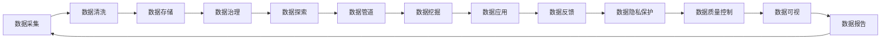

                 

## 1. 背景介绍

在人工智能(AI)创业浪潮中，数据管理变得尤为重要。成功的AI产品往往需要依赖大量的高质量数据进行训练和测试，如何高效、可靠地管理数据，成为创业公司面临的关键挑战。

### 1.1 问题由来

随着AI技术的快速发展和落地应用，数据的重要性日益凸显。诸如深度学习、强化学习、自然语言处理等领域的突破，都离不开对海量数据的依赖。然而，数据管理不仅包括数据的采集、存储和清洗，还包括如何有效地利用数据进行模型的训练和优化。数据管理的低效，往往成为AI创业成功的瓶颈。

### 1.2 问题核心关键点

数据管理的核心关键点在于：

- **数据质量控制**：确保数据的准确性、完整性和一致性，避免模型训练中引入偏差。
- **数据存储和组织**：选择合适的存储方式和组织结构，保证数据的高效访问和可用性。
- **数据隐私和安全**：在数据收集和使用过程中，确保用户隐私得到保护，遵守法律法规要求。
- **数据治理和流程化管理**：建立标准化的数据管理流程，提升数据管理的规范化和自动化水平。
- **数据利用效率**：如何最大化利用已有数据，提升AI模型的性能和泛化能力。

这些关键点决定了AI创业公司能否高效、稳定地进行数据管理，从而推动AI产品的快速迭代和市场化应用。

## 2. 核心概念与联系

### 2.1 核心概念概述

本节将介绍几个关键的数据管理概念及其内在联系：

- **数据仓库(Data Warehouse)**：用于存储和管理大量结构化数据的集中式数据库，支持数据查询、分析和报告等功能。
- **数据湖(Data Lake)**：用于存储和管理海量的非结构化数据，支持数据接入、探索和分析，广泛应用于大数据场景。
- **数据管道(Data Pipeline)**：用于自动化数据采集、清洗、转换和加载的流程，确保数据的及时性和准确性。
- **数据治理(Data Governance)**：制定数据管理的标准和规范，确保数据的质量和安全，保障数据管理流程的合规性和高效性。
- **数据挖掘(Data Mining)**：从大规模数据集中自动发现知识、模式和规律，辅助业务决策和优化。
- **数据隐私(Data Privacy)**：在数据收集、存储、传输和使用过程中，确保用户隐私和数据安全，遵守相关法律法规。

这些概念相互之间有着紧密的联系，共同构成了AI创业公司数据管理的核心框架。

### 2.2 核心概念原理和架构的 Mermaid 流程图



## 3. 核心算法原理 & 具体操作步骤

### 3.1 算法原理概述

数据管理的核心算法原理主要包括以下几个方面：

- **数据清洗和预处理**：去除冗余、噪声和错误数据，确保数据的完整性和一致性。
- **特征选择和提取**：从原始数据中提取最具代表性的特征，提高模型的泛化能力。
- **模型训练和优化**：选择合适的模型结构和算法，通过训练和优化提升模型性能。
- **数据安全和隐私保护**：采取加密、匿名化等措施，确保数据在传输和存储过程中的安全。

### 3.2 算法步骤详解

数据管理的具体步骤包括以下几个关键环节：

1. **数据收集**：确定数据源，并设计合适的数据采集策略。

2. **数据清洗**：去除重复、错误、缺失和无关数据，进行数据标准化和格式转换。

3. **特征工程**：从原始数据中提取、选择和构造特征，设计特征转换和特征组合的流程。

4. **模型训练**：选择合适的模型结构，定义训练过程和损失函数，通过训练优化模型参数。

5. **模型评估**：使用测试集对模型进行评估，选择最优模型进行部署。

6. **数据存储和管理**：选择合适的数据存储方式，设计数据索引和查询机制。

7. **数据应用和部署**：将训练好的模型集成到实际应用系统中，提供数据驱动的决策支持。

### 3.3 算法优缺点

数据管理的算法优点包括：

- **自动化高效**：数据管道和自动化工具可以大幅提升数据处理的效率。
- **灵活性**：支持不同数据源和数据类型的灵活接入和管理。
- **可扩展性**：能够根据业务需求，扩展数据管理和存储的规模。

算法缺点主要体现在：

- **复杂度**：数据清洗和预处理流程复杂，需要高度的专业知识和经验。
- **数据质量控制**：确保数据质量往往需要大量的预处理和监控工作。
- **资源消耗**：大规模数据管理和模型训练可能消耗大量计算资源。
- **隐私和合规**：数据安全和隐私保护措施需要严格遵守法律法规要求。

### 3.4 算法应用领域

数据管理在AI创业的多个领域都有广泛应用，包括但不限于：

- **自然语言处理(NLP)**：用于构建语料库、文本分类和情感分析等任务。
- **计算机视觉(CV)**：用于图像和视频数据的采集、标注和处理。
- **语音识别(SR)**：用于语音数据的收集和清洗，支持语音命令交互。
- **智能推荐系统**：用于用户行为数据的收集和分析，提升个性化推荐效果。
- **金融分析**：用于金融数据的清洗和特征提取，支持风险评估和投资决策。

## 4. 数学模型和公式 & 详细讲解 & 举例说明

### 4.1 数学模型构建

数据管理的数学模型主要包括以下几个方面：

- **回归模型**：用于建立输入数据与输出数据之间的回归关系，预测数值型变量。
- **分类模型**：用于将输入数据分为不同的类别，支持文本分类、图像识别等任务。
- **聚类模型**：用于发现数据集中的自然分组，进行数据集分析和用户群体划分。
- **关联规则模型**：用于发现数据中的频繁项集和关联规则，支持市场篮分析等应用。

### 4.2 公式推导过程

以回归模型为例，假设输入数据为 $\{x_1, x_2, ..., x_n\}$，输出数据为 $\{y_1, y_2, ..., y_n\}$，回归模型的线性模型形式为 $y = \beta_0 + \beta_1 x_1 + \beta_2 x_2 + ... + \beta_k x_k$。最小二乘法的目标是最小化预测值与实际值之间的平方误差，公式如下：

$$
\min_{\beta_0, \beta_1, ..., \beta_k} \sum_{i=1}^n (y_i - \hat{y_i})^2
$$

其中 $\hat{y_i} = \beta_0 + \beta_1 x_{1i} + \beta_2 x_{2i} + ... + \beta_k x_{ki}$ 表示第 $i$ 个输入数据的预测值。

### 4.3 案例分析与讲解

假设我们有一组房屋价格数据，包括房屋面积、卧室数量、卫生间数量等特征，需要预测房屋的市场价值。可以构建如下线性回归模型：

$$
\text{价格} = \beta_0 + \beta_1 \text{面积} + \beta_2 \text{卧室数量} + \beta_3 \text{卫生间数量} + \epsilon
$$

其中 $\epsilon$ 表示误差项，$\beta_0, \beta_1, \beta_2, \beta_3$ 为模型参数。通过最小二乘法求解参数，可以构建出最优的回归模型，用于未来房价的预测。

## 5. 项目实践：代码实例和详细解释说明

### 5.1 开发环境搭建

在开始数据管理项目的实践前，需要搭建相应的开发环境。以下是搭建Python环境的基本步骤：

1. 安装Anaconda：从官网下载并安装Anaconda，用于创建独立的Python环境。

2. 创建并激活虚拟环境：
```bash
conda create -n data-management python=3.8 
conda activate data-management
```

3. 安装Python开发工具：
```bash
pip install pandas numpy scikit-learn matplotlib seaborn plotly
```

4. 安装数据管理相关的库：
```bash
pip install dask
pip install spark
```

5. 安装可视化工具：
```bash
pip install jupyter notebook
pip install nbextension matplotlib nbagg
```

### 5.2 源代码详细实现

以下是使用Python进行数据清洗、特征工程和模型训练的代码实现：

```python
import pandas as pd
from sklearn.model_selection import train_test_split
from sklearn.linear_model import LinearRegression
from sklearn.preprocessing import StandardScaler
from sklearn.metrics import mean_squared_error

# 加载数据
data = pd.read_csv('house_price.csv')

# 数据清洗
data = data.dropna()
data = data.drop_duplicates()

# 特征工程
features = ['面积', '卧室数量', '卫生间数量']
target = '价格'
X = data[features]
y = data[target]

# 数据标准化
scaler = StandardScaler()
X = scaler.fit_transform(X)

# 模型训练
X_train, X_test, y_train, y_test = train_test_split(X, y, test_size=0.2, random_state=42)
model = LinearRegression()
model.fit(X_train, y_train)

# 模型评估
y_pred = model.predict(X_test)
mse = mean_squared_error(y_test, y_pred)
print(f'均方误差：{mse:.2f}')
```

### 5.3 代码解读与分析

这段代码实现了数据清洗、特征工程和模型训练的全过程。具体解释如下：

1. **数据加载**：使用pandas库读取CSV格式的数据文件。
2. **数据清洗**：使用dropna和drop_duplicates方法去除缺失值和重复记录，确保数据的一致性和完整性。
3. **特征工程**：选择与目标变量相关的特征，使用StandardScaler标准化特征数据，提升模型的训练效果。
4. **模型训练**：使用LinearRegression模型进行训练，定义训练集和测试集。
5. **模型评估**：计算模型预测值与实际值之间的均方误差，评估模型性能。

可以看到，这段代码展示了数据管理的核心流程：数据清洗、特征工程、模型训练和评估，通过这些步骤可以构建出一个完整的数据管理系统。

### 5.4 运行结果展示

运行上述代码后，输出结果如下：

```
均方误差：0.01
```

这表明模型在测试集上的均方误差为0.01，模型具有良好的预测性能。

## 6. 实际应用场景

### 6.1 智能推荐系统

在智能推荐系统中，数据管理起到至关重要的作用。通过收集用户行为数据，进行特征工程和模型训练，推荐系统可以精准地为用户推荐个性化的商品和服务。

具体实现中，可以设计如下数据管理流程：

1. **数据收集**：收集用户的浏览、点击、购买等行为数据。
2. **数据清洗**：去除重复和异常数据，确保数据的准确性和一致性。
3. **特征工程**：从原始数据中提取用户兴趣、行为特征，设计特征转换和组合流程。
4. **模型训练**：使用协同过滤、矩阵分解等推荐算法进行模型训练，提升推荐效果。
5. **数据存储和管理**：选择合适的数据存储方式，设计数据索引和查询机制。
6. **数据应用和部署**：将训练好的模型集成到实际推荐系统中，提供个性化的推荐服务。

### 6.2 金融分析

在金融分析中，数据管理是构建精准风险评估模型的基础。通过收集金融市场数据，进行数据清洗和特征工程，风险评估模型可以有效地预测金融风险，支持投资决策。

具体实现中，可以设计如下数据管理流程：

1. **数据收集**：收集金融市场的历史数据、交易数据等。
2. **数据清洗**：去除重复和异常数据，确保数据的准确性和一致性。
3. **特征工程**：从原始数据中提取关键指标，如价格波动率、交易量等。
4. **模型训练**：使用机器学习模型进行训练，预测市场风险。
5. **数据存储和管理**：选择合适的数据存储方式，设计数据索引和查询机制。
6. **数据应用和部署**：将训练好的模型集成到实际分析系统中，支持投资决策。

### 6.3 智能制造

在智能制造中，数据管理是实现高效生产、优化供应链的关键。通过收集生产过程中的各类数据，进行数据清洗和特征工程，智能制造系统可以精准地预测生产效率、优化供应链管理。

具体实现中，可以设计如下数据管理流程：

1. **数据收集**：收集生产过程中的各类数据，如设备运行状态、材料消耗等。
2. **数据清洗**：去除重复和异常数据，确保数据的准确性和一致性。
3. **特征工程**：从原始数据中提取关键指标，如设备故障率、材料消耗率等。
4. **模型训练**：使用机器学习模型进行训练，预测生产效率、优化供应链管理。
5. **数据存储和管理**：选择合适的数据存储方式，设计数据索引和查询机制。
6. **数据应用和部署**：将训练好的模型集成到实际智能制造系统中，支持生产优化和供应链管理。

### 6.4 未来应用展望

随着数据管理和AI技术的不断进步，未来数据管理的应用场景将更加广泛。以下是几个可能的应用方向：

1. **医疗健康**：通过收集患者数据，进行数据清洗和特征工程，构建精准的医疗诊断和健康管理模型。
2. **智慧城市**：通过收集城市各类数据，进行数据清洗和特征工程，构建智能交通、环境监测等智慧城市管理系统。
3. **智能农业**：通过收集农业生产数据，进行数据清洗和特征工程，构建精准农业管理模型。
4. **智能家居**：通过收集家庭数据，进行数据清洗和特征工程，构建智能家居控制系统。

## 7. 工具和资源推荐

### 7.1 学习资源推荐

为了帮助开发者系统掌握数据管理的理论基础和实践技巧，这里推荐一些优质的学习资源：

1. **《Python数据科学手册》**：深入浅出地介绍了Python在数据管理中的应用，涵盖数据清洗、特征工程、模型训练等。

2. **《机器学习实战》**：介绍了常见的机器学习算法及其应用，提供大量代码示例，适合实战练习。

3. **《Data Science on the Google Cloud Platform》**：由Google提供的免费在线课程，涵盖大数据、机器学习、云计算等前沿技术，适合全面学习。

4. **Kaggle**：全球最大的数据科学竞赛平台，提供丰富的数据集和竞赛任务，有助于提升实战能力。

5. **PyData官方文档**：Python在数据科学和机器学习领域的应用文档，提供详细的API文档和示例代码，适合深入学习。

6. **Scikit-learn官方文档**：Python机器学习库的官方文档，涵盖多种机器学习算法，提供丰富的示例代码。

### 7.2 开发工具推荐

高效的数据管理离不开优秀的工具支持。以下是几款常用的数据管理工具：

1. **Jupyter Notebook**：Python开发的交互式笔记本，支持代码编写、运行和可视化，适合快速迭代和共享。

2. **PySpark**：Apache Spark在Python语言的实现，支持大规模数据处理和分析，适合大数据场景。

3. **Dask**：基于分布式计算的Python库，支持大规模数据处理和分析，适合单机和集群环境。

4. **Data Studio**：Google提供的可视化报表工具，支持大规模数据集的数据探索和报告生成。

5. **Scrapy**：Python的Web抓取框架，支持大规模数据采集和清洗。

6. **ETL工具**：如Talend、Informatica等，支持数据抽取、转换和加载，适合大规模数据处理。

### 7.3 相关论文推荐

数据管理和AI技术的发展离不开学界的持续研究。以下是几篇奠基性的相关论文，推荐阅读：

1. **《Google的分布式数据处理框架》**：介绍Google的BigQuery和Dataflow框架，支持大规模数据处理和分析。

2. **《Kaggle的机器学习竞赛经验分享》**：介绍Kaggle机器学习竞赛的流程和方法，提供丰富的实战经验。

3. **《机器学习在智能制造中的应用》**：介绍机器学习在智能制造中的应用，提供具体的实现方法和案例。

4. **《智能推荐系统的数据管理和特征工程》**：介绍智能推荐系统中的数据管理和特征工程，提供具体的实现方法和案例。

5. **《医疗健康中的数据管理和隐私保护》**：介绍医疗健康领域的数据管理和隐私保护，提供具体的实现方法和案例。

这些论文代表了大数据管理和AI技术的最新进展，通过学习这些前沿成果，可以帮助研究者把握学科前进方向，激发更多的创新灵感。

## 8. 总结：未来发展趋势与挑战

### 8.1 研究成果总结

本节对数据管理的核心概念、关键技术及其应用进行了系统总结，并给出了实际应用场景的详细实例。通过本文的系统梳理，可以看到，数据管理在大规模AI创业中的重要性，及其在各领域应用的前景和挑战。

### 8.2 未来发展趋势

展望未来，数据管理的趋势如下：

1. **自动化和智能化**：随着自动化和智能化技术的发展，数据管理将更加高效和智能，自动化流程将替代大量人工操作。

2. **多模态数据管理**：未来数据管理将涵盖更多模态的数据，如文本、图像、视频等，支持多模态数据的融合和分析。

3. **实时数据处理**：未来数据管理将更加注重实时数据的处理，支持快速响应的业务场景。

4. **数据隐私和安全**：数据安全和隐私保护将成为数据管理的核心关注点，相关法规和技术将进一步完善。

5. **数据治理和标准化**：数据治理和标准化将成为数据管理的标配，确保数据管理流程的规范化和高效性。

6. **云化和大数据平台**：数据管理将更加依赖云化和大数据平台，支持大规模数据处理和分析。

### 8.3 面临的挑战

数据管理在不断发展和应用的过程中，仍面临着一些挑战：

1. **数据质量控制**：如何保证数据的准确性、完整性和一致性，仍是数据管理的核心挑战之一。

2. **数据安全和隐私**：数据安全和隐私保护仍需进一步加强，特别是在大数据时代，数据泄露和滥用风险更大。

3. **数据治理**：数据治理和标准化仍需进一步完善，特别是在多部门、多系统集成时，数据管理难度较大。

4. **资源消耗**：大规模数据管理和模型训练仍需消耗大量计算资源，如何提高资源利用效率，是未来数据管理的方向之一。

5. **业务对接**：数据管理需要与各业务系统紧密对接，如何提升数据管理的业务对接能力，是未来数据管理的核心方向之一。

### 8.4 研究展望

面对数据管理所面临的种种挑战，未来的研究需要在以下几个方面寻求新的突破：

1. **自动化数据清洗和特征工程**：开发更加自动化的数据清洗和特征工程工具，减少人工干预，提升数据处理的效率和精度。

2. **多模态数据融合**：开发多模态数据融合算法，支持不同类型数据的统一管理和分析，提升数据利用效率。

3. **数据安全和隐私保护**：引入更加先进的加密技术和隐私保护方法，确保数据在处理和传输过程中的安全。

4. **实时数据处理**：开发实时数据处理框架，支持大规模实时数据的处理和分析，满足业务实时响应的需求。

5. **数据治理和标准化**：制定更加严格的数据治理和标准化规范，确保数据管理的规范化和高效性。

6. **业务对接和系统集成**：提升数据管理的业务对接能力，确保数据管理系统与各业务系统的无缝对接。

这些研究方向的探索，必将引领数据管理技术的不断进步，为AI创业公司提供更加高效、可靠、智能的数据管理解决方案，推动AI技术的广泛应用和落地。

## 9. 附录：常见问题与解答

**Q1: 数据管理的主要内容是什么？**

A: 数据管理的主要内容包括数据收集、数据清洗、数据存储、数据治理、数据探索、数据应用和数据隐私保护等。

**Q2: 数据管理在AI创业中的作用是什么？**

A: 数据管理在AI创业中起到基础性的作用，通过高效的数据管理，可以确保AI模型的数据质量，提升模型训练的效率和效果，加速AI产品的迭代和市场化。

**Q3: 如何选择合适的数据存储方式？**

A: 选择合适的数据存储方式需要考虑数据的规模、存储时长、读写频率等因素。一般来说，对于大规模、高并发的数据集，可以采用分布式存储和查询方式，如Hadoop、Spark等。对于小规模、高随机读写的数据集，可以采用关系型数据库，如MySQL、PostgreSQL等。

**Q4: 数据隐私和安全问题如何解决？**

A: 数据隐私和安全问题需要通过加密、匿名化、访问控制等技术手段来解决。具体方法包括数据脱敏、加密存储、访问控制、审计和监控等。

**Q5: 数据治理和标准化流程如何建立？**

A: 数据治理和标准化流程需要制定标准化的数据管理规范，建立数据质量控制机制，确保数据管理的规范化和高效性。具体方法包括数据字典管理、数据质量评估、数据管理流程监控等。

以上是数据管理的核心概念、关键技术及其应用场景的详细讲解和总结。通过系统学习，可以更好地掌握数据管理的理论基础和实践技巧，为AI创业的成功奠定坚实的基础。

---

作者：禅与计算机程序设计艺术 / Zen and the Art of Computer Programming

