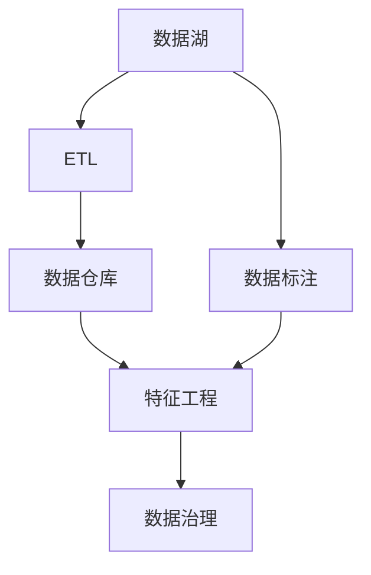

                 

# 人工智能创业数据管理的策略与方法解析

## 1. 背景介绍

### 1.1 问题由来
随着人工智能技术的飞速发展，越来越多的初创企业在探索利用AI进行商业化应用。然而，数据管理问题常常成为AI创业的绊脚石。高质量数据不仅难以获取，而且管理和处理过程中需要复杂的技术手段和策略。缺乏数据管理能力的AI创业项目，往往难以将算法优势转化为实际的用户价值和商业收益。

### 1.2 问题核心关键点
数据管理在AI创业中占据核心地位。它的核心在于：如何通过数据获取、存储、清洗、标注、特征工程等手段，构建高质量的数据集，支持机器学习模型的训练和优化。以下是数据管理的关键点：

- **数据获取**：如何高效、合规地获取所需数据，避免侵犯隐私和法律风险。
- **数据存储**：如何以高效、可扩展的方式存储数据，便于后续处理和分析。
- **数据清洗**：如何消除噪声、处理缺失值，保证数据质量。
- **数据标注**：如何准确、经济地为数据打上标签，提供机器学习所需的有监督信息。
- **特征工程**：如何设计合适的特征，提取关键信息，提升模型效果。

## 2. 核心概念与联系

### 2.1 核心概念概述

为理解AI创业中的数据管理策略，本节将介绍几个关键概念：

- **数据湖(Data Lake)**：一种大型的分布式存储架构，可以存储海量的结构化和非结构化数据，支持数据集成、分析和探索。
- **数据仓库(Data Warehouse)**：一种专门用于数据分析的集中式数据存储系统，支持数据查询和报告生成。
- **ETL(Extract, Transform, Load)**：一种数据处理流程，用于从不同数据源抽取、转换和加载数据到目标数据存储系统。
- **数据标注(Data Annotation)**：为数据打上标签，用于训练机器学习模型的过程。
- **特征工程(Feature Engineering)**：通过选择、变换和构造特征，提升数据的质量和模型的性能。
- **数据治理(Data Governance)**：通过建立数据标准、政策和流程，确保数据质量和合规性。

这些概念之间的逻辑关系可以通过以下Mermaid流程图来展示：



这个流程图展示了数据湖、数据仓库、ETL流程、数据标注、特征工程、数据治理之间的关系：

1. 数据湖是整个数据管理的基础，通过ETL流程从不同数据源提取数据。
2. 数据标注在数据仓库中为数据打上标签，供机器学习模型使用。
3. 特征工程在数据仓库中对数据进行处理，提取特征。
4. 数据治理在数据管理全流程中确保数据质量和合规性。

## 3. 核心算法原理 & 具体操作步骤
### 3.1 算法原理概述

AI创业中的数据管理，本质上是一种面向AI应用的数据处理和分析过程。其核心算法原理包括：

- **数据集成与清洗**：通过ETL流程，将分散在多个数据源的数据整合，并通过清洗去除噪声、处理缺失值等操作，保证数据质量。
- **特征选择与提取**：选择合适的特征，并进行特征工程，如归一化、降维、特征交叉等，以提升模型效果。
- **数据标注与标记**：为数据打上标签，生成有监督信息，用于训练机器学习模型。
- **模型训练与优化**：利用标注好的数据集训练机器学习模型，并通过超参数调优等手段提升模型性能。

### 3.2 算法步骤详解

以下是对AI创业中数据管理的主要步骤详解：

**Step 1: 数据收集**
- 收集所需的数据源，确保数据覆盖完整性和代表性。
- 检查数据源的访问权限，确保合法合规。

**Step 2: 数据清洗**
- 清洗数据中的噪声、缺失值、重复记录等。
- 对清洗后的数据进行抽样检查，确保清洗质量。

**Step 3: 数据标注**
- 对数据打上标签，生成有监督信息。
- 使用众包平台或内部标注团队完成数据标注任务。

**Step 4: 特征工程**
- 选择合适的特征，提取关键信息。
- 进行特征归一化、降维、特征交叉等操作。

**Step 5: 模型训练**
- 将清洗标注后的数据集用于训练机器学习模型。
- 通过交叉验证等手段调优模型超参数，提升模型效果。

**Step 6: 模型评估与部署**
- 在测试集上评估模型性能，如准确率、召回率、F1-score等。
- 将训练好的模型部署到实际应用环境中，进行上线监控和迭代优化。

### 3.3 算法优缺点

AI创业中的数据管理算法，有以下优点：

1. **效率高**：通过ETL流程和特征工程，可以批量处理大量数据，提升数据处理速度。
2. **质量高**：清洗和标注过程确保数据质量，特征工程提升特征相关性，提升模型效果。
3. **成本低**：自动化的数据处理流程减少了人工干预，降低了数据管理成本。
4. **可扩展性强**：数据湖和数据仓库等技术，支持大规模数据存储和处理，适应业务发展需要。

同时，该算法也存在以下局限性：

1. **数据隐私风险**：数据标注和处理过程中可能泄露敏感信息，存在隐私风险。
2. **标注成本高**：高质量数据标注需要人工参与，成本较高。
3. **数据多样性处理**：处理来自不同数据源、不同格式的数据时，可能面临数据格式不一致的问题。
4. **标注一致性问题**：标注过程中可能存在标注不一致的问题，影响数据质量。

## 4. 数学模型和公式 & 详细讲解 & 举例说明

### 4.1 数学模型构建

数据管理算法中，常用的数学模型包括回归模型、分类模型、聚类模型等。这里以回归模型为例，说明数据管理中的数学模型构建过程。

假设有一个线性回归模型，形式如下：

$$
y = w_0 + w_1 x_1 + w_2 x_2 + \cdots + w_n x_n + \epsilon
$$

其中 $y$ 为输出变量，$x_1, x_2, \cdots, x_n$ 为输入特征，$w_0, w_1, \cdots, w_n$ 为模型参数，$\epsilon$ 为误差项。

### 4.2 公式推导过程

在线性回归模型的最小二乘法中，目标是最小化预测值与实际值之间的平方误差和：

$$
J(w) = \frac{1}{2N} \sum_{i=1}^N (y_i - \hat{y}_i)^2
$$

其中 $N$ 为样本数量，$\hat{y}_i$ 为模型对样本 $i$ 的预测值。

对 $J(w)$ 求导，并令导数为0，得到模型的参数估计值为：

$$
w_j = \frac{\sum_{i=1}^N x_{ij}(y_i - \bar{y})}{\sum_{i=1}^N x_{ij}^2}, \quad j=1,2,\cdots,n
$$

其中 $\bar{y}$ 为样本 $y$ 的均值。

### 4.3 案例分析与讲解

以电商平台的用户行为预测为例，假设需要预测用户的购买概率，可以使用线性回归模型。具体步骤如下：

1. **数据收集**：收集用户的行为数据，如浏览次数、停留时间、购买次数等。
2. **数据清洗**：清洗数据中的异常值和噪声，确保数据质量。
3. **特征工程**：选择相关性高的特征，如浏览次数、停留时间等，并进行归一化处理。
4. **模型训练**：使用清洗和处理后的数据，训练线性回归模型，得到模型参数。
5. **模型评估**：在测试集上评估模型性能，如准确率、召回率等。
6. **模型部署**：将训练好的模型部署到实际应用中，用于用户行为预测。

## 5. 项目实践：代码实例和详细解释说明

### 5.1 开发环境搭建

在进行数据管理实践前，我们需要准备好开发环境。以下是使用Python进行Pandas和Scikit-Learn开发的完整环境配置流程：

1. 安装Anaconda：从官网下载并安装Anaconda，用于创建独立的Python环境。

2. 创建并激活虚拟环境：
```bash
conda create -n data-management python=3.8 
conda activate data-management
```

3. 安装Pandas和Scikit-Learn：
```bash
conda install pandas scikit-learn
```

4. 安装各类工具包：
```bash
pip install numpy matplotlib seaborn sklearn
```

完成上述步骤后，即可在`data-management`环境中开始数据管理实践。

### 5.2 源代码详细实现

下面以电商用户行为预测为例，给出使用Pandas和Scikit-Learn进行数据管理的PyTorch代码实现。

```python
import pandas as pd
import numpy as np
from sklearn.model_selection import train_test_split
from sklearn.linear_model import LinearRegression
from sklearn.metrics import mean_squared_error, r2_score

# 加载数据集
df = pd.read_csv('user_behavior.csv')

# 数据清洗
df.dropna(inplace=True)  # 删除缺失值
df = df.drop(['id'], axis=1)  # 删除不相关列

# 特征工程
X = df[['browsing_time', '停留时间']]  # 选择相关特征
y = df['purchase']  # 选择目标变量

# 数据分割
X_train, X_test, y_train, y_test = train_test_split(X, y, test_size=0.2, random_state=42)

# 模型训练
model = LinearRegression()
model.fit(X_train, y_train)

# 模型评估
y_pred = model.predict(X_test)
mse = mean_squared_error(y_test, y_pred)
r2 = r2_score(y_test, y_pred)
print(f"MSE: {mse:.2f}, R^2: {r2:.2f}")
```

### 5.3 代码解读与分析

让我们再详细解读一下关键代码的实现细节：

**数据加载与清洗**：
- `pd.read_csv`：使用Pandas库加载CSV格式的数据集。
- `df.dropna`：删除数据中的缺失值，确保数据完整性。
- `df.drop`：删除不相关列，提高特征相关性。

**特征工程**：
- 选择相关性高的特征，如`browsing_time`和`停留时间`，提取关键信息。
- 使用`train_test_split`将数据集分割为训练集和测试集。

**模型训练**：
- 创建线性回归模型，并使用`fit`方法在训练集上训练模型。

**模型评估**：
- 使用`mean_squared_error`计算模型预测与真实值之间的均方误差。
- 使用`r2_score`计算模型的决定系数，评估模型拟合效果。

以上代码实现了电商用户行为预测的数据管理流程，通过数据清洗、特征选择和模型训练，最终得到了用户购买概率的预测结果。

## 6. 实际应用场景

### 6.1 电商平台推荐系统

在电商平台中，基于用户行为数据的推荐系统可以显著提升用户体验和转化率。推荐系统通过分析用户的浏览、购买等行为数据，推荐用户可能感兴趣的商品。

在技术实现上，可以收集用户的行为数据，对其进行数据清洗、特征工程和模型训练，得到用户行为与商品之间的推荐模型。在推荐引擎中，输入用户的行为数据，调用模型进行预测，得到推荐结果。

### 6.2 金融风控系统

金融风控系统通过分析用户的交易数据，识别潜在的风险用户，避免欺诈行为。系统通过对用户的历史交易行为进行分析，预测其未来行为，判断是否存在欺诈风险。

在技术实现上，可以收集用户的交易数据，对其进行数据清洗、特征工程和模型训练，得到用户行为与欺诈风险之间的预测模型。在风控系统内部，输入用户的行为数据，调用模型进行预测，判断用户是否存在欺诈风险。

### 6.3 医疗健康预测系统

在医疗健康领域，预测系统通过分析患者的医疗数据，预测其患病风险，辅助医生进行诊断。系统通过对患者的医疗记录进行分析，预测其是否存在某种疾病，并给出相应的治疗建议。

在技术实现上，可以收集患者的医疗数据，对其进行数据清洗、特征工程和模型训练，得到患者医疗数据与患病风险之间的预测模型。在预测系统中，输入患者的医疗数据，调用模型进行预测，判断其是否存在某种疾病。

### 6.4 未来应用展望

随着AI技术的不断发展和数据的日益丰富，数据管理技术将在更多领域得到应用，为各行各业带来变革性影响。

在智慧城市治理中，数据管理系统可以实时监测和分析城市运行状态，提供数据支持，提升城市管理的智能化水平。

在智能交通系统中，数据管理系统可以收集和分析交通数据，优化交通流量，提升出行效率。

在智能制造领域，数据管理系统可以收集和分析生产数据，优化生产流程，提升生产效率和质量。

总之，数据管理技术将在各个行业领域发挥越来越重要的作用，为AI应用提供强有力的数据支撑，推动社会的数字化转型和智能化升级。

## 7. 工具和资源推荐

### 7.1 学习资源推荐

为了帮助开发者系统掌握数据管理的技术基础和实践技巧，这里推荐一些优质的学习资源：

1. 《Python数据科学手册》：一本全面的Python数据科学入门书籍，涵盖数据清洗、特征工程、模型训练等基础概念和实战技巧。
2. 《机器学习实战》：一本实战导向的机器学习书籍，详细介绍了各种机器学习算法和数据管理策略。
3. 《Scikit-Learn官方文档》：Scikit-Learn库的官方文档，提供了丰富的教程和样例代码，是学习数据管理的必备资料。
4. Kaggle平台：一个数据科学竞赛平台，提供大量公开数据集和竞赛项目，实战性强，适合提升数据管理能力。
5. Coursera平台：提供机器学习、数据科学等课程，由斯坦福大学、密歇根大学等名校教授授课，内容权威，适合系统学习。

通过对这些资源的学习实践，相信你一定能够快速掌握数据管理的技术精髓，并用于解决实际的数据处理问题。

### 7.2 开发工具推荐

高效的数据管理离不开优秀的工具支持。以下是几款用于数据管理开发的常用工具：

1. Pandas：基于Python的数据处理库，提供数据清洗、数据转换、数据合并等操作，是数据管理中不可或缺的工具。
2. Scikit-Learn：基于Python的机器学习库，提供丰富的模型训练和评估工具，支持多种数据管理任务。
3. Apache Spark：一个分布式计算框架，支持大规模数据处理和分析，适用于大数据管理需求。
4. Apache Hadoop：一个分布式数据存储和处理平台，支持海量数据的存储和管理。
5. Google BigQuery：一个云数据仓库，支持PB级数据的存储和查询，适合大规模数据管理需求。

合理利用这些工具，可以显著提升数据管理的效率和质量，加快业务数据的处理速度和准确性。

### 7.3 相关论文推荐

数据管理技术的发展源于学界的持续研究。以下是几篇奠基性的相关论文，推荐阅读：

1. "Data Management for Data Mining"（《数据管理在数据挖掘中的应用》）：详细介绍了数据管理在数据挖掘中的重要性。
2. "Data Cleaning: A Review"（《数据清洗：综述》）：综述了数据清洗技术的现状和未来发展方向。
3. "Feature Selection Techniques for Data Mining"（《特征选择技术在数据挖掘中的应用》）：介绍了特征选择和特征工程的技术方法和应用场景。
4. "Big Data Data Management"（《大数据管理》）：介绍了大数据管理的技术框架和方法。
5. "Machine Learning for Data Management"（《数据管理中的机器学习》）：综述了机器学习在数据管理中的应用。

这些论文代表了大数据管理技术的发展脉络。通过学习这些前沿成果，可以帮助研究者把握学科前进方向，激发更多的创新灵感。

## 8. 总结：未来发展趋势与挑战

### 8.1 总结

本文对AI创业中的数据管理策略进行了全面系统的介绍。首先阐述了数据管理在AI创业中的重要性，明确了数据管理在获取、存储、清洗、标注、特征工程等环节的关键作用。其次，从原理到实践，详细讲解了数据管理的数学模型和操作步骤，提供了数据管理实践的完整代码实例。同时，本文还广泛探讨了数据管理技术在电商平台推荐、金融风控、医疗健康等领域的实际应用，展示了数据管理技术的广泛应用前景。此外，本文精选了数据管理技术的各类学习资源，力求为读者提供全方位的技术指引。

通过本文的系统梳理，可以看到，数据管理技术在AI创业中占据核心地位，其重要性不言而喻。数据管理能力的提升，将极大地推动AI技术在各行业的落地应用，为业务发展提供强大的数据支撑。

### 8.2 未来发展趋势

展望未来，数据管理技术将呈现以下几个发展趋势：

1. **自动化程度提高**：未来数据管理将更多采用自动化工具和流程，降低人工干预，提高数据处理效率。
2. **数据治理加强**：数据治理将成为数据管理的重要组成部分，通过建立数据标准和政策，保障数据质量和合规性。
3. **数据融合与互操作性增强**：不同来源、不同格式的数据将更加容易融合和互操作，提升数据管理效果。
4. **实时数据处理能力提升**：实时数据处理技术将逐步普及，支持快速响应用户需求。
5. **云计算和分布式存储技术的应用**：云计算和分布式存储技术将为大规模数据管理提供支持，降低数据管理成本。

以上趋势凸显了数据管理技术的广阔前景。这些方向的探索发展，必将进一步提升数据管理的效率和质量，为AI应用提供更坚实的数据基础。

### 8.3 面临的挑战

尽管数据管理技术已经取得了显著成果，但在迈向更加智能化、普适化应用的过程中，它仍面临诸多挑战：

1. **数据隐私和安全**：数据管理过程中可能涉及敏感信息，存在隐私和安全风险。如何保护数据隐私，防止数据泄露，是数据管理的重要挑战。
2. **数据标注成本高**：高质量数据标注需要人工参与，成本较高。如何降低标注成本，提高数据标注效率，是数据管理的重要课题。
3. **数据一致性和可靠性**：数据管理过程中可能存在数据不一致和可靠性问题，影响数据质量。如何提高数据一致性和可靠性，保障数据质量，是数据管理的重要目标。
4. **数据治理复杂性**：数据治理需要建立数据标准和政策，涉及多部门协调，操作复杂。如何简化数据治理流程，提高治理效率，是数据管理的重要方向。
5. **数据实时处理能力不足**：实时数据处理技术尚未普及，难以支持快速响应用户需求。如何提升实时数据处理能力，提高响应速度，是数据管理的重要挑战。

## 9. 附录：常见问题与解答

**Q1：数据管理在AI创业中为何如此重要？**

A: 数据管理在AI创业中占据核心地位，其重要性主要体现在以下几个方面：
1. 数据是AI模型的基础，数据质量直接影响模型效果。
2. 数据管理能够保证数据的质量、一致性和可靠性，保障模型训练和推理的正确性。
3. 数据管理能够降低数据获取和处理的成本，提高数据处理的效率和准确性。

**Q2：如何提高数据标注的效率和质量？**

A: 提高数据标注的效率和质量，可以从以下几个方面入手：
1. 使用众包平台或内部标注团队完成数据标注任务，降低标注成本。
2. 引入自动化标注工具，如TextBlob、Spacy等，提高标注效率。
3. 对标注团队进行培训，提高标注质量。
4. 引入多标注策略，如多轮标注、一致性检查等，提升标注一致性。

**Q3：如何进行数据清洗和预处理？**

A: 数据清洗和预处理是数据管理的重要环节，可以从以下几个方面进行：
1. 删除缺失值和异常值，保证数据完整性和一致性。
2. 对数据进行归一化、标准化处理，提升数据相关性。
3. 去除重复记录，保证数据唯一性。
4. 对文本数据进行分词、去除停用词等处理，提高特征提取效果。

**Q4：如何选择合适的特征工程方法？**

A: 选择合适的特征工程方法，需要根据具体任务和数据特点进行综合考虑：
1. 选择与任务相关的特征，提升模型效果。
2. 进行特征归一化、降维等处理，提高特征相关性。
3. 引入特征交叉和特征组合，提取更高级别的信息。
4. 使用特征选择算法，选择最相关的特征，提升模型效果。

**Q5：如何在数据管理中保障数据隐私和安全？**

A: 保障数据隐私和安全，可以从以下几个方面进行：
1. 对敏感数据进行脱敏处理，防止数据泄露。
2. 建立数据访问控制机制，限制数据访问权限。
3. 使用加密技术，保护数据存储和传输安全。
4. 定期进行数据审计和监控，防止数据泄露。

这些常见问题的解答，希望能帮助你在数据管理实践中更好地应对挑战，提升数据管理能力。

---

作者：禅与计算机程序设计艺术 / Zen and the Art of Computer Programming

