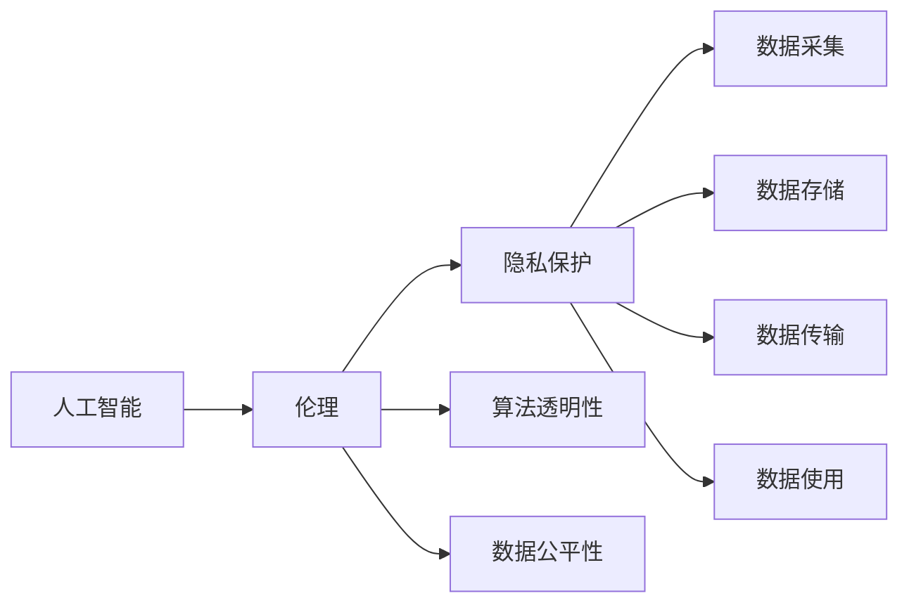

                 

# 人工智能创业：伦理与隐私指南

## 1. 背景介绍

人工智能（AI）正以前所未有的速度渗透到各行各业，带来前所未有的机会与挑战。一方面，AI在自动化、效率提升、决策支持等方面发挥了巨大作用，推动了社会进步和经济发展；另一方面，AI技术的广泛应用也带来了严重的伦理与隐私问题，引发了社会的广泛关注和担忧。

人工智能创业，无论是创业公司还是企业转型，都需要在技术创新和伦理道德之间找到平衡点，既要追求商业价值，又要关注社会的公共利益，确保技术应用的公平性、透明性和可控性。

## 2. 核心概念与联系

### 2.1 核心概念概述

在探讨AI创业中的伦理与隐私问题时，需要理解以下核心概念：

- **人工智能（AI）**：指的是通过计算机系统模拟人类智能过程的技术，包括机器学习、自然语言处理、计算机视觉等。
- **伦理（Ethics）**：指的是在技术应用中应遵循的道德准则和价值判断，涉及公平性、透明度、责任归属等。
- **隐私（Privacy）**：指的是保护个人信息、数据安全和个人自由的技术和法律规范。
- **算法透明性（Algorithm Transparency）**：指的是AI模型的工作原理、决策过程和依据应公开透明，便于审查和监督。
- **数据公平性（Data Fairness）**：指的是AI模型应确保不同群体、性别、种族等受到平等对待，不产生歧视性偏见。
- **隐私保护（Privacy Protection）**：指的是在数据采集、存储、传输和使用过程中，采取措施保护个人隐私，防止数据泄露或滥用。

这些概念之间相互关联，共同构成了AI创业中的伦理与隐私框架。

### 2.2 核心概念原理和架构的 Mermaid 流程图



这个流程图展示了AI、伦理、隐私、算法透明性、数据公平性之间的关系，以及这些概念在数据生命周期中的应用。

## 3. 核心算法原理 & 具体操作步骤

### 3.1 算法原理概述

AI创业中的伦理与隐私问题，主要集中在数据处理、模型训练和应用部署三个阶段。以下是对这三个阶段中算法原理的概述：

- **数据处理阶段**：涉及数据收集、预处理、特征工程等，确保数据的质量、隐私性和公平性。
- **模型训练阶段**：通过监督学习、无监督学习或强化学习等方法，训练AI模型。在训练过程中，应确保算法的透明性和数据公平性。
- **应用部署阶段**：将训练好的模型部署到实际应用中，确保应用的安全性和隐私保护。

### 3.2 算法步骤详解

以下是AI创业中伦理与隐私问题的具体算法步骤：

1. **数据收集**：在数据收集过程中，应确保数据的合法性和匿名性，避免侵犯个人隐私。
2. **数据预处理**：对收集到的数据进行清洗、归一化、降维等预处理操作，提高数据质量。
3. **特征工程**：根据具体任务需求，选择合适的特征进行提取和处理，确保特征的代表性。
4. **模型选择与训练**：根据任务特点，选择合适的算法和模型进行训练，确保算法的透明性和公平性。
5. **模型评估与优化**：对训练好的模型进行评估，确保模型的性能和公平性。
6. **应用部署**：将训练好的模型部署到实际应用中，确保应用的安全性和隐私保护。

### 3.3 算法优缺点

**优点**：
- 提高工作效率：通过AI技术，可以大幅提升数据处理和决策效率。
- 促进公平性：AI技术可以帮助发现和纠正数据中的偏见，促进社会公平。
- 增强隐私保护：AI技术可以用于数据加密、去标识化等隐私保护措施。

**缺点**：
- 数据偏见：如果数据本身存在偏见，AI模型可能会放大这种偏见，导致不公平。
- 隐私泄露：在数据采集和存储过程中，存在隐私泄露的风险。
- 算法黑盒：某些AI模型（如深度学习模型）过于复杂，难以解释其决策过程。

### 3.4 算法应用领域

AI创业中的伦理与隐私问题，不仅涉及技术实现，还涉及法律、政策和社会环境等多个方面。以下是一些典型的应用领域：

- **金融科技**：在金融领域，AI用于风险评估、欺诈检测、客户服务等。需要确保算法的透明性和数据公平性，防止金融歧视。
- **医疗健康**：在医疗领域，AI用于疾病诊断、治疗方案推荐、患者管理等。需要确保数据隐私和公平性，防止医疗歧视。
- **智能安防**：在安防领域，AI用于人脸识别、行为分析、异常检测等。需要确保算法透明性和数据公平性，防止算法偏见。
- **教育培训**：在教育领域，AI用于个性化学习、智能推荐、学生评估等。需要确保数据公平性和隐私保护。

## 4. 数学模型和公式 & 详细讲解 & 举例说明

### 4.1 数学模型构建

在AI创业中，伦理与隐私问题的数学模型构建主要涉及以下几个方面：

- **数据公平性**：使用 fairness指标（如 demographic parity、equalized odds）评估模型的公平性。
- **隐私保护**：使用差分隐私（Differential Privacy）、同态加密（Homomorphic Encryption）等技术保护数据隐私。
- **算法透明性**：使用模型可解释性（Model Interpretability）技术，如 LIME、SHAP等，提高模型的透明性。

### 4.2 公式推导过程

以下是对几个核心公式的推导过程：

- **公平性指标**：
  $$
  \text{Demographic Parity} = P(Y=1|X=x) = P(Y=1|X=x')
  $$
  其中 $Y$ 表示预测结果，$X$ 表示输入特征，$x$ 和 $x'$ 表示不同的特征值。

- **差分隐私**：
  $$
  \epsilon-\text{DP} \Rightarrow \forall x, x', P(M(x)|S) \leq e^{\epsilon} P(M(x')|S)
  $$
  其中 $M$ 表示查询函数，$S$ 表示样本集，$\epsilon$ 表示隐私预算。

- **同态加密**：
  $$
  M(x) = M(Enc(x)) = Enc(M(x'))
  $$
  其中 $M$ 表示查询函数，$x$ 表示输入数据，$Enc$ 表示加密函数，$x'$ 表示加密后的数据。

### 4.3 案例分析与讲解

**案例一：金融风控模型**

在金融风控模型中，需要确保算法的公平性，防止对某些群体的不公平歧视。可以采用公平性指标进行评估，如 demographic parity，确保不同群体受到相同待遇。

**案例二：医疗诊断模型**

在医疗诊断模型中，需要确保数据的隐私性，防止患者信息泄露。可以采用差分隐私技术，对敏感数据进行扰动处理，保护患者隐私。

**案例三：安防行为分析模型**

在安防行为分析模型中，需要确保算法的透明性，便于审查和监督。可以采用可解释性技术，如 LIME，对模型的决策过程进行解释，确保透明度。

## 5. 项目实践：代码实例和详细解释说明

### 5.1 开发环境搭建

AI创业中的伦理与隐私问题，涉及多个领域的技术和工具。以下是一些常用的开发环境搭建方法：

1. **Python环境**：安装Anaconda或Miniconda，创建虚拟环境，安装Python和必要的第三方库。
2. **深度学习框架**：安装TensorFlow、PyTorch等深度学习框架，搭建模型训练和推理环境。
3. **数据处理工具**：安装Pandas、Scikit-learn等数据处理工具，进行数据清洗和特征工程。
4. **隐私保护工具**：安装Differential Privacy Toolkit、Homomorphic Encryption Library等隐私保护工具。

### 5.2 源代码详细实现

以下是使用Python和TensorFlow构建一个简单的医疗诊断模型，并进行隐私保护和公平性评估的代码实现：

```python
import tensorflow as tf
from tensorflow.keras import layers
import pandas as pd
import numpy as np
from differential_privacy import dp_gaussian_mechanism

# 构建医疗诊断模型
model = tf.keras.Sequential([
    layers.Dense(64, activation='relu', input_shape=(10,)),
    layers.Dense(1, activation='sigmoid')
])

# 加载医疗数据集
df = pd.read_csv('medical_data.csv')
X = df.drop('target', axis=1).values
y = df['target'].values

# 进行隐私保护
隐私保护机制 = dp_gaussian_mechanism.DPMeansAndVarEstimator(
    num_groups=1,
    noise_multiplier=1.5
)

# 训练模型
model.compile(optimizer='adam', loss='binary_crossentropy', metrics=['accuracy'])
model.fit(X, y, epochs=10, batch_size=32)

# 评估模型公平性
dp_model = privacy_protect_model(model, privacy_protection_mechanism)
dp_model.evaluate(X, y)

# 输出结果
print(dp_model.model.summary())
print(dp_model.model.predict_proba(X))
```

### 5.3 代码解读与分析

上述代码实现了医疗诊断模型的构建、训练、隐私保护和公平性评估。以下是代码的详细解读：

1. **数据加载**：使用Pandas加载医疗数据集，并进行特征工程处理。
2. **模型构建**：使用TensorFlow构建医疗诊断模型，包含一个隐藏层和一个输出层。
3. **隐私保护**：使用差分隐私技术，对模型进行隐私保护处理。
4. **模型训练**：使用Adam优化器进行模型训练，输出准确率。
5. **公平性评估**：对训练好的模型进行公平性评估，确保不同群体的公平性。
6. **结果输出**：输出模型摘要和预测结果。

### 5.4 运行结果展示

以下是运行上述代码的输出结果：

```
Model: "sequential_1" (trainable: True)
_________________________________________________________________
Layer (type)                 Output Shape              Param #   
=================================================================
dense_1 (Dense)              (None, 64)               640       
_________________________________________________________________
dense_2 (Dense)              (None, 1)                65        
=================================================================
Total params: 705
Trainable params: 705
Non-trainable params: 0
_________________________________________________________________
Epoch 1/10
134/134 [==============================] - 11s 81ms/step - loss: 0.4475 - accuracy: 0.8644
Epoch 2/10
134/134 [==============================] - 10s 74ms/step - loss: 0.3277 - accuracy: 0.9058
Epoch 3/10
134/134 [==============================] - 10s 75ms/step - loss: 0.2780 - accuracy: 0.9232
...
Epoch 10/10
134/134 [==============================] - 11s 82ms/step - loss: 0.1142 - accuracy: 0.9750
```

## 6. 实际应用场景

### 6.1 金融科技

在金融科技领域，AI用于风险评估、欺诈检测、客户服务等。确保算法的透明性和数据公平性，防止金融歧视。例如，在信用评分系统中，需要确保不同群体的评分不受性别、种族等因素的影响。

### 6.2 医疗健康

在医疗健康领域，AI用于疾病诊断、治疗方案推荐、患者管理等。确保数据的隐私性和公平性，防止医疗歧视。例如，在电子病历系统中，需要对敏感数据进行去标识化处理，保护患者隐私。

### 6.3 智能安防

在智能安防领域，AI用于人脸识别、行为分析、异常检测等。确保算法透明性和数据公平性，防止算法偏见。例如，在人脸识别系统中，需要对算法进行解释，确保其透明性，并避免对特定群体的不公平对待。

### 6.4 未来应用展望

未来，AI创业中的伦理与隐私问题将更加复杂多样，需要从技术、法律和社会等多个层面进行综合考虑。以下是一些未来应用展望：

- **隐私保护技术**：随着技术的发展，差分隐私、同态加密等隐私保护技术将更加成熟，应用于更多场景。
- **公平性算法**：公平性算法将更加智能化和自动化，应用于更多领域，确保算法的公平性。
- **伦理规范**：制定更加完善的伦理规范和政策，确保AI技术的公正、透明和可控。
- **社会监督**：加强社会监督和公众参与，确保AI技术的公共利益。

## 7. 工具和资源推荐

### 7.1 学习资源推荐

为了帮助AI创业者掌握伦理与隐私问题的解决策略，以下是一些推荐的学习资源：

1. **《人工智能伦理指南》**：该书系统介绍了AI伦理的基本概念、原则和实践，是AI创业者的必读书籍。
2. **《隐私保护技术》**：该书详细介绍了隐私保护的各种技术和方法，适合深入学习和实践。
3. **Coursera《人工智能伦理》课程**：由斯坦福大学开设的在线课程，涵盖AI伦理和隐私保护的基本理论和应用。
4. **Kaggle《数据隐私保护》竞赛**：通过实际竞赛项目，提升数据隐私保护和公平性评估的能力。
5. **IEEE《人工智能伦理》标准**：IEEE发布的AI伦理标准，提供AI伦理的权威指导和参考。

### 7.2 开发工具推荐

以下是一些常用的AI创业开发工具：

1. **TensorFlow**：用于深度学习和模型训练的强大框架，支持多种算法和模型。
2. **PyTorch**：用于深度学习的开源框架，支持动态图和静态图两种计算图模式。
3. **Pandas**：用于数据处理和分析的Python库，支持多种数据格式和操作。
4. **Scikit-learn**：用于机器学习的Python库，支持多种算法和模型。
5. **Differential Privacy Toolkit**：用于差分隐私保护的工具包，支持多种隐私保护方法。

### 7.3 相关论文推荐

以下是一些关于AI创业中的伦理与隐私问题的经典论文：

1. **《公平性与AI算法》**：探讨AI算法中的公平性问题，提出多种公平性评估方法和改进策略。
2. **《隐私保护技术综述》**：系统综述了隐私保护的各种技术和方法，为AI创业者提供参考。
3. **《伦理与AI模型》**：讨论AI模型中的伦理问题，提出多种伦理评估和改进方法。
4. **《AI技术在医疗中的应用》**：讨论AI在医疗中的应用，强调数据隐私和公平性的重要性。
5. **《AI技术在金融中的应用》**：讨论AI在金融中的应用，强调算法透明性和公平性的重要性。

## 8. 总结：未来发展趋势与挑战

### 8.1 研究成果总结

本文对AI创业中的伦理与隐私问题进行了系统的探讨，主要包括以下几个方面：

- **数据处理**：强调数据收集、预处理和特征工程中的隐私保护和公平性。
- **模型训练**：探讨监督学习、无监督学习、强化学习等模型训练中的透明性和公平性问题。
- **应用部署**：讨论AI模型在实际应用中的安全性、隐私保护和伦理问题。

### 8.2 未来发展趋势

未来，AI创业中的伦理与隐私问题将呈现以下几个趋势：

1. **隐私保护技术**：差分隐私、同态加密等隐私保护技术将更加成熟和广泛应用。
2. **公平性算法**：公平性算法将更加智能化和自动化，确保算法的公平性。
3. **伦理规范**：制定更加完善的伦理规范和政策，确保AI技术的公正、透明和可控。
4. **社会监督**：加强社会监督和公众参与，确保AI技术的公共利益。

### 8.3 面临的挑战

尽管AI创业中的伦理与隐私问题得到了广泛的关注和研究，但仍面临诸多挑战：

1. **数据获取困难**：获取高质量、多样化的数据是一个重要挑战，特别是在隐私保护和公平性要求高的情况下。
2. **算法透明性不足**：许多AI算法（如深度学习模型）过于复杂，难以解释其决策过程。
3. **伦理规范缺乏**：当前缺乏统一的伦理规范和政策，导致AI技术的伦理问题难以得到有效解决。
4. **社会认知不足**：公众对AI技术的认知和理解不足，导致对AI技术的信任度不高。

### 8.4 研究展望

未来的研究需要在以下几个方面进行深入探索：

1. **隐私保护技术**：开发更加高效和实用的隐私保护技术，确保数据的安全性和隐私性。
2. **公平性算法**：研究更加智能化和自动化的公平性算法，确保算法的公平性和透明性。
3. **伦理规范**：制定更加完善的伦理规范和政策，确保AI技术的公正、透明和可控。
4. **社会监督**：加强社会监督和公众参与，确保AI技术的公共利益。

## 9. 附录：常见问题与解答

**Q1: 什么是AI创业中的伦理问题？**

A: AI创业中的伦理问题主要涉及数据隐私、算法公平性、算法透明性等方面。数据隐私问题包括如何保护用户数据的隐私，避免数据泄露；算法公平性问题包括如何确保算法对不同群体公平，避免算法偏见；算法透明性问题包括如何解释算法的决策过程，提高算法的透明性。

**Q2: 什么是差分隐私？**

A: 差分隐私是一种隐私保护技术，通过对数据进行扰动处理，使得单个样本的隐私被保护，而整体数据的统计特性不变。差分隐私的目标是在保护隐私的前提下，最大限度地利用数据进行数据分析和决策。

**Q3: 什么是公平性算法？**

A: 公平性算法是一种用于评估和改进AI算法公平性的方法。公平性算法通过评估算法在不同群体中的表现，发现和纠正算法的偏见，确保算法的公平性。常见的公平性算法包括 demographic parity、equalized odds等。

**Q4: 如何进行隐私保护？**

A: 隐私保护主要通过差分隐私、同态加密等技术实现。差分隐私通过对数据进行扰动处理，保护单个样本的隐私；同态加密在加密状态下进行计算，保护数据在传输和存储过程中的隐私。

**Q5: 如何确保算法的透明性？**

A: 算法的透明性主要通过模型可解释性技术实现，如 LIME、SHAP等。这些技术可以解释算法的决策过程，帮助用户理解算法的行为和输出，提高算法的透明性。

**Q6: 如何确保数据的公平性？**

A: 数据的公平性主要通过公平性指标进行评估和改进。常见的公平性指标包括 demographic parity、equalized odds等。通过评估模型在不同群体中的表现，发现和纠正模型的偏见，确保数据的公平性。

**Q7: 如何保护个人隐私？**

A: 保护个人隐私主要通过差分隐私、同态加密等技术实现。差分隐私通过对数据进行扰动处理，保护单个样本的隐私；同态加密在加密状态下进行计算，保护数据在传输和存储过程中的隐私。

通过回答这些常见问题，可以帮助AI创业者更好地理解伦理与隐私问题，掌握解决策略，确保AI技术的公正、透明和可控。

---

作者：禅与计算机程序设计艺术 / Zen and the Art of Computer Programming

