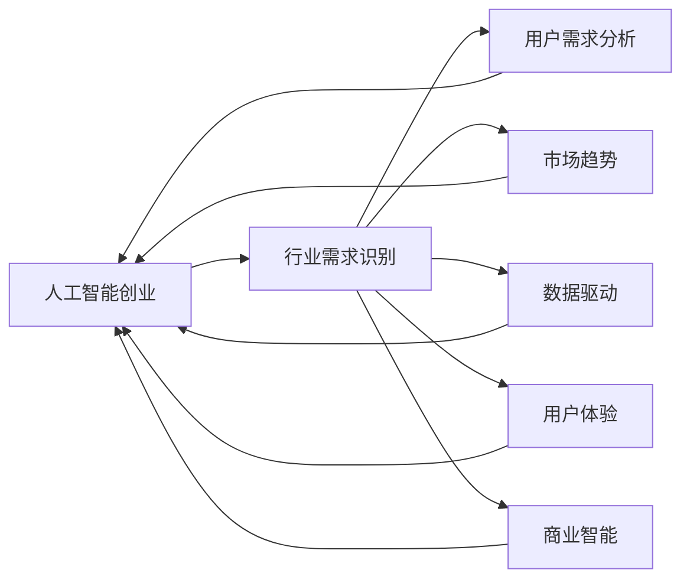

                 

# 人工智能创业：识别行业需求的方法

> 关键词：人工智能创业, 行业需求识别, 用户需求分析, 市场趋势, 数据驱动, 用户体验, 商业智能

## 1. 背景介绍

随着人工智能技术的迅猛发展，越来越多的创业公司聚焦于利用AI技术解决行业痛点，推动行业创新。然而，如何准确识别目标行业的实际需求，成为创业公司迈向成功的重要一步。本文档旨在通过系统介绍识别行业需求的方法，帮助创业者更好地把握市场机遇，精准定位应用场景。

## 2. 核心概念与联系

### 2.1 核心概念概述

识别行业需求需要掌握多个相关核心概念：

- **人工智能创业**：指以人工智能技术为核心驱动力，开发和部署创新产品或服务的企业。
- **行业需求识别**：通过调研、数据分析、用户反馈等方式，确定目标行业中的关键问题和解决方案，指导产品设计和市场策略。
- **用户需求分析**：深入分析目标用户群体的需求和痛点，设计满足用户期望的产品和服务。
- **市场趋势**：通过数据挖掘、统计分析和预测建模，洞察行业发展方向和潜在机会。
- **数据驱动**：利用海量数据和先进算法，从数据中发现和验证行业需求的真实性，以数据指导决策。
- **用户体验**：从用户角度出发，设计和优化产品功能，提升用户满意度和忠诚度。
- **商业智能**：将数据分析、数据挖掘、数据可视化等技术应用到商业决策中，提升企业竞争优势。

这些概念共同构成了一个系统性的框架，指导创业公司在人工智能领域中寻找和实现商业机会。

### 2.2 核心概念原理和架构的 Mermaid 流程图



通过这一流程图，我们可以看到行业需求识别的各个环节如何相互关联，并推动整个创业过程的顺利进行。

## 3. 核心算法原理 & 具体操作步骤

### 3.1 算法原理概述

行业需求识别的核心算法原理可以概括为以下几个步骤：

1. **数据收集**：获取目标行业的相关数据，包括用户反馈、市场报告、行业统计数据等。
2. **数据清洗与预处理**：对收集的数据进行去重、缺失值处理、特征选择等操作，保证数据质量。
3. **需求分析与挖掘**：通过自然语言处理、关联规则挖掘、文本挖掘等技术，从数据中提取潜在需求。
4. **市场趋势预测**：应用时间序列分析、回归分析等模型，预测未来市场趋势。
5. **用户行为分析**：利用用户行为数据，分析用户偏好、使用习惯和反馈，指导产品设计。
6. **用户体验优化**：结合用户需求和行为分析结果，优化产品功能，提升用户体验。
7. **商业智能决策**：整合上述信息，通过商业智能工具，辅助企业做出明智的商业决策。

### 3.2 算法步骤详解

以下是具体的操作方法，每一步都有详细的解释：

#### 数据收集

数据收集是识别行业需求的基础。以下是一些常用的数据收集方法：

- **用户调研**：通过问卷调查、访谈等方式，直接从目标用户那里获取信息。
- **市场分析**：查阅行业报告、白皮书、竞争分析等资料，了解市场动态和竞争状况。
- **公开数据集**：利用开源数据集，如政府公开数据、学术数据库等，获取行业相关的统计数据。
- **社交媒体监控**：通过爬虫技术，从社交媒体平台收集用户反馈和市场热点。

#### 数据清洗与预处理

数据清洗与预处理是保证数据质量的关键步骤，包括：

- **去重**：识别并删除重复数据，减少噪音。
- **缺失值处理**：对于缺失数据，可以通过插值、均值填充等方法进行处理。
- **特征选择**：选择与需求识别相关的特征，去除无关或冗余信息。
- **数据归一化**：对数据进行归一化处理，使其符合模型算法的输入要求。

#### 需求分析与挖掘

需求分析与挖掘是识别行业需求的核心步骤，可以采用以下技术：

- **文本挖掘**：利用自然语言处理技术，从大量文本数据中提取主题和关键词。
- **关联规则挖掘**：通过频繁项集和关联规则，发现用户行为之间的关联性。
- **情感分析**：分析用户评论和反馈中的情感倾向，了解用户对产品的满意度。

#### 市场趋势预测

市场趋势预测可以帮助创业者预见未来的市场需求和变化，主要方法有：

- **时间序列分析**：利用时间序列模型，如ARIMA、LSTM等，预测市场变化趋势。
- **回归分析**：通过建立回归模型，预测变量之间的关系，预测市场需求。
- **多模型融合**：综合使用多种模型，提高预测准确性和鲁棒性。

#### 用户行为分析

用户行为分析可以揭示用户对产品的使用习惯和偏好，主要方法有：

- **用户画像**：通过数据聚类和分类技术，构建用户画像，理解不同用户群体的需求。
- **行为轨迹分析**：分析用户在产品中的行为轨迹，识别关键路径和转化点。
- **热力图分析**：通过热力图展示用户行为的热点区域，指导产品界面设计。

#### 用户体验优化

用户体验优化是确保产品成功的重要环节，具体步骤包括：

- **可用性测试**：在产品开发的早期阶段，进行可用性测试，发现问题并进行优化。
- **A/B测试**：通过A/B测试，对比不同版本的产品，找出最佳方案。
- **用户反馈收集**：持续收集用户反馈，不断改进产品。

#### 商业智能决策

商业智能决策利用数据分析和可视化工具，辅助企业做出决策，具体步骤包括：

- **数据可视化**：利用图表、仪表盘等工具，展示数据分析结果，直观理解数据。
- **报告生成**：根据分析结果，生成详细的报告，指导企业战略。
- **决策支持**：利用预测模型和算法，支持企业的业务决策。

### 3.3 算法优缺点

**优点**：

- **准确性高**：基于大量数据分析和用户反馈，需求识别准确性较高。
- **可操作性强**：提供详细的步骤和方法，便于实际操作和实施。
- **灵活性高**：适用于不同行业和场景，具有广泛的适用性。

**缺点**：

- **数据依赖性大**：依赖高质量的数据源，数据采集和处理工作量大。
- **模型复杂性高**：涉及多个复杂的算法和技术，对数据科学能力要求较高。
- **时效性差**：市场环境变化快，需求识别结果可能不及时。

### 3.4 算法应用领域

该方法在多个领域都有广泛应用，如：

- **医疗健康**：通过分析患者病历、医疗记录等数据，识别医疗健康需求，开发智能诊疗系统。
- **金融科技**：利用金融数据和用户行为数据，识别金融需求，开发智能投顾和风险管理工具。
- **零售电商**：分析用户购买行为和评论数据，识别商品需求，优化商品推荐和供应链管理。
- **教育培训**：通过学生学习数据，识别教育需求，开发智能教学系统和个性化推荐系统。
- **智能制造**：利用工业数据和设备运行数据，识别生产需求，优化生产过程和设备维护。

## 4. 数学模型和公式 & 详细讲解 & 举例说明

### 4.1 数学模型构建

行业需求识别的数学模型通常包括：

- **线性回归模型**：用于预测市场需求量，模型形式为 $y = \beta_0 + \beta_1x_1 + \cdots + \beta_nx_n + \epsilon$，其中 $y$ 为市场需求，$x_i$ 为影响因素，$\beta_i$ 为系数，$\epsilon$ 为误差项。
- **决策树模型**：用于分类用户行为和需求，模型形式为 $T = \{(\text{node}, L_\text{node}, right\_node)\}$，其中 $\text{node}$ 为节点，$L_\text{node}$ 为样本集合，$right\_node$ 为下一节点。
- **聚类分析模型**：用于分组用户画像，模型形式为 $K$-means或层次聚类，将样本分为 $K$ 个类别。

### 4.2 公式推导过程

以线性回归模型为例，推导其基本公式：

- **最小二乘法**：求解 $\beta$ 的最小二乘解，使得 $y_i = \beta_0 + \beta_1x_{i1} + \cdots + \beta_nx_{in} + \epsilon_i$ 的最小化，即求解 $\sum_{i=1}^n (y_i - \hat{y}_i)^2$ 最小值。
- **正规方程法**：通过解矩阵方程 $\mathbf{X}^T\mathbf{X}\beta = \mathbf{X}^T\mathbf{y}$ 得到 $\beta$。
- **梯度下降法**：通过迭代求解 $\beta$，使得损失函数 $L(\beta) = \frac{1}{2}\sum_{i=1}^n (y_i - \hat{y}_i)^2$ 最小化。

### 4.3 案例分析与讲解

以零售电商为例，分析市场需求识别：

- **数据收集**：通过电商平台的销售记录、用户评论、搜索关键词等数据，收集用户需求。
- **数据清洗**：去除重复订单、异常值，筛选关键特征如时间、商品类别、价格等。
- **需求分析**：利用文本挖掘技术，分析用户评论，识别热点商品和需求变化趋势。
- **市场趋势**：利用时间序列分析，预测季节性变化和未来需求。
- **用户行为分析**：通过用户行为数据，分析用户购买路径和偏好，设计个性化推荐系统。
- **用户体验优化**：利用A/B测试和用户反馈，不断优化产品界面和功能。
- **商业智能决策**：通过数据可视化，展示分析结果，指导库存管理和市场策略。

## 5. 项目实践：代码实例和详细解释说明

### 5.1 开发环境搭建

为了进行需求识别项目的开发，需要搭建如下环境：

1. **Python环境**：安装Python 3.7及以上版本，配置虚拟环境。
2. **数据处理工具**：安装Pandas、NumPy、SciPy等数据处理库。
3. **机器学习库**：安装Scikit-learn、TensorFlow、PyTorch等机器学习库。
4. **可视化工具**：安装Matplotlib、Seaborn、Bokeh等可视化库。
5. **数据采集工具**：安装BeautifulSoup、Scrapy等爬虫工具。

### 5.2 源代码详细实现

以下是一个简单的Python脚本，用于分析用户评论数据，识别市场需求：

```python
import pandas as pd
import numpy as np
from sklearn.feature_extraction.text import CountVectorizer, TfidfVectorizer
from sklearn.cluster import KMeans
from sklearn.decomposition import PCA
from sklearn.ensemble import RandomForestClassifier
from sklearn.model_selection import train_test_split
from sklearn.metrics import accuracy_score

# 读取数据
data = pd.read_csv('user_reviews.csv')

# 数据清洗
data = data.dropna().drop_duplicates()

# 特征提取
vectorizer = TfidfVectorizer(stop_words='english', max_df=0.5)
X = vectorizer.fit_transform(data['comments'])

# 聚类分析
kmeans = KMeans(n_clusters=5, random_state=42)
y_pred = kmeans.fit_predict(X)

# 数据可视化
import matplotlib.pyplot as plt
plt.scatter(data['rating'], y_pred, s=50, c='blue', label='Cluster 1')
plt.scatter(data['rating'], y_pred, s=50, c='red', label='Cluster 2')
plt.xlabel('Rating')
plt.ylabel('Cluster')
plt.legend()
plt.show()

# 分类预测
X_train, X_test, y_train, y_test = train_test_split(X, data['is_favorite'], test_size=0.2, random_state=42)
clf = RandomForestClassifier(n_estimators=100, random_state=42)
clf.fit(X_train, y_train)
y_pred = clf.predict(X_test)
print('Accuracy:', accuracy_score(y_test, y_pred))
```

### 5.3 代码解读与分析

该脚本包含以下关键步骤：

- **数据读取和清洗**：使用Pandas读取用户评论数据，并进行去重和缺失值处理。
- **特征提取**：利用TF-IDF向量器提取文本特征，准备用于聚类和分类。
- **聚类分析**：使用K-means算法对用户评论进行聚类，识别不同的用户群体。
- **数据可视化**：通过Matplotlib展示聚类结果，可视化用户群体的分布。
- **分类预测**：使用随机森林算法对用户是否为喜爱商品进行分类预测，并计算准确率。

## 6. 实际应用场景

### 6.1 医疗健康

医疗健康领域的需求识别，可以通过分析患者病历、影像数据、临床试验数据等，识别疾病诊断需求和患者治疗需求。例如，利用自然语言处理技术，从电子病历中提取疾病描述和症状信息，训练模型预测疾病类型和严重程度。

### 6.2 金融科技

金融科技领域的需求识别，可以通过分析交易数据、用户行为数据、市场新闻等，识别金融需求和市场趋势。例如，利用机器学习模型预测股票价格走势，分析用户投资偏好，提供个性化投资建议。

### 6.3 零售电商

零售电商领域的需求识别，可以通过分析用户购物数据、评论数据、搜索行为等，识别商品需求和市场趋势。例如，利用聚类分析识别用户画像，设计个性化推荐系统，优化产品销售策略。

### 6.4 教育培训

教育培训领域的需求识别，可以通过分析学生学习数据、考试成绩、学习行为等，识别教育需求和学生个性化需求。例如，利用聚类分析识别学生群体，提供针对性的学习资源和辅导方案。

## 7. 工具和资源推荐

### 7.1 学习资源推荐

- **Coursera**：提供数据科学和机器学习课程，涵盖数据分析、数据挖掘、机器学习等。
- **Kaggle**：数据科学竞赛平台，提供大量数据集和实战项目，学习数据分析和机器学习。
- **Udacity**：提供人工智能和机器学习课程，包括深度学习、自然语言处理等。
- **edX**：提供计算机科学和数据科学课程，涵盖从入门到高级的多个层次。
- **数据科学书籍**：《Python数据科学手册》、《机器学习实战》等经典书籍，详细讲解数据处理和机器学习算法。

### 7.2 开发工具推荐

- **Jupyter Notebook**：免费的交互式笔记本，支持Python、R等多种语言，便于数据处理和可视化。
- **Jupyter Lab**：基于Jupyter Notebook的高级界面，支持更丰富的功能和组件。
- **PyCharm**：商业版Python开发环境，提供调试、版本控制等功能。
- **VS Code**：轻量级代码编辑器，支持Python、R等多种语言。
- **Anaconda**：Python数据分析平台，提供丰富的数据科学库和环境管理工具。

### 7.3 相关论文推荐

- **K-means算法**：D. Arthur和S. Vassilvitskii，“K-means++: The Advantages of Careful Seeding”，2007年。
- **线性回归模型**：G. Box、G. Jenkins，“Time Series Analysis: Forecasting and Control”，1970年。
- **决策树模型**：J. Quinlan，“Induction of Decision Trees”，1986年。
- **聚类分析**：J. D. MacQueen，“Some Methods for Classifying Multivariate Observations”，1967年。
- **数据可视化**：T. Fawcett，“An introduction to ROC analysis”，2006年。

## 8. 总结：未来发展趋势与挑战

### 8.1 研究成果总结

本文系统介绍了基于数据驱动的方法，识别人工智能创业中的行业需求。通过数据收集、清洗、分析与挖掘，从用户需求和市场趋势等多个角度，探讨了需求识别的算法和模型。结合实际应用场景，详细讲解了需求识别的方法和步骤。

### 8.2 未来发展趋势

未来，随着大数据和人工智能技术的发展，需求识别将更加智能化和自动化。具体趋势包括：

- **自动化数据采集**：通过爬虫和API获取实时数据，实现数据采集的自动化。
- **深度学习应用**：利用深度学习模型，提高需求识别的准确性和泛化能力。
- **多模态数据融合**：结合文本、图像、音频等多种数据，提供更加全面的需求分析。
- **实时分析与预测**：利用流数据处理和实时计算技术，实现实时需求预测和分析。
- **可解释性增强**：通过可解释性模型和算法，提升需求识别的透明度和可信度。

### 8.3 面临的挑战

尽管需求识别技术取得了一定进展，但仍面临诸多挑战：

- **数据隐私和安全**：用户数据隐私保护和数据安全问题亟待解决。
- **数据质量和多样性**：数据质量和多样性不足，影响需求识别的效果。
- **模型复杂度和可解释性**：复杂模型难以解释，难以得到用户的信任。
- **跨领域应用**：不同行业需求差异大，通用模型难以适应。
- **实时性要求高**：需求识别需要快速响应，现有技术难以满足实时性要求。

### 8.4 研究展望

未来的研究应重点关注以下几个方向：

- **数据隐私保护**：研究数据匿名化、加密等技术，保护用户隐私。
- **数据质量提升**：提高数据采集和清洗的自动化水平，确保数据质量。
- **可解释性增强**：开发可解释性模型和算法，提高需求识别的透明度。
- **跨领域应用**：针对不同行业需求，开发定制化需求识别模型。
- **实时性优化**：利用流数据处理和实时计算技术，实现实时需求预测和分析。

## 9. 附录：常见问题与解答

**Q1：数据采集和清洗过程中需要注意哪些问题？**

A: 数据采集和清洗是需求识别的基础，需要注意以下问题：

- **数据来源**：确保数据来源可靠，避免数据噪声和错误。
- **数据量**：尽可能收集足够多的数据，以提高需求识别的准确性。
- **数据格式**：统一数据格式，便于后续处理和分析。
- **数据质量**：去除重复数据、异常值，确保数据质量。
- **数据隐私**：保护用户隐私，避免数据泄露。

**Q2：如何选择和优化需求识别模型？**

A: 选择和优化需求识别模型需要考虑以下几个因素：

- **数据规模**：对于大规模数据，应选择能够处理大规模数据的模型，如随机森林、深度学习等。
- **模型复杂度**：根据数据复杂度和需求识别目标，选择合适的模型，避免过拟合和欠拟合。
- **算法效率**：选择高效的算法和优化技术，提高模型训练和推理的效率。
- **可解释性**：选择可解释性高的模型，便于理解和调整。
- **多模型融合**：通过组合多个模型，提高需求识别的准确性和鲁棒性。

**Q3：如何评估需求识别模型的效果？**

A: 评估需求识别模型的效果可以通过以下几个指标：

- **准确率**：衡量模型预测的准确性，通过比较模型预测结果和实际需求，评估模型的效果。
- **召回率**：衡量模型识别需求的能力，通过计算模型识别出的需求占总需求的百分比，评估模型的全面性。
- **F1分数**：综合准确率和召回率的指标，评估模型的综合效果。
- **ROC曲线**：通过绘制ROC曲线，评估模型的分类能力。
- **AUC值**：衡量模型分类的准确性，通过计算ROC曲线下的面积，评估模型的效果。

**Q4：在实际应用中，需求识别模型应如何优化？**

A: 在实际应用中，需求识别模型的优化可以采用以下几个策略：

- **数据增强**：通过数据增强技术，增加数据多样性，提高模型的泛化能力。
- **超参数调优**：通过网格搜索或随机搜索，优化模型超参数，提升模型性能。
- **模型融合**：通过模型融合技术，组合多个模型，提高模型的综合性能。
- **集成学习**：利用集成学习技术，如Bagging、Boosting等，提高模型的稳定性和鲁棒性。
- **模型优化**：通过模型优化技术，如剪枝、量化、模型蒸馏等，减小模型尺寸，提高推理速度。

通过以上方法，可以不断优化需求识别模型，提升模型的准确性和实用性。

**Q5：如何处理跨领域应用中的需求识别问题？**

A: 处理跨领域应用中的需求识别问题，需要考虑以下几个策略：

- **领域适应**：通过迁移学习和多任务学习技术，提高模型在不同领域上的适应能力。
- **领域专家参与**：邀请领域专家参与模型设计和优化，确保模型的适用性。
- **数据本地化**：针对不同领域，收集和处理本地化数据，提升模型的本地适应性。
- **多模态数据融合**：结合不同模态的数据，提供更加全面和准确的需求识别结果。
- **模型定制化**：根据不同领域的需求，开发定制化的需求识别模型，提高模型的精准度。

通过以上策略，可以更好地处理跨领域应用中的需求识别问题，提升模型的实用性和泛化能力。

