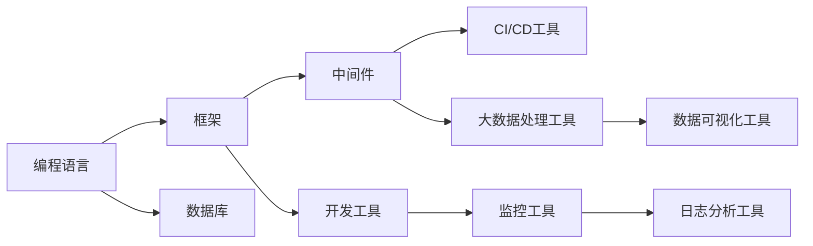

                 

## 1. 背景介绍

### 1.1 问题由来
随着人工智能(AI)技术的迅猛发展，AI创业公司如雨后春笋般涌现，AI技术的广泛应用为各行各业带来了革命性的变化。但与此同时，选择合适的技术栈成为了AI创业公司必须面对的一项重要挑战。一个合适的技术栈不仅能够帮助公司快速迭代产品，提升用户体验，还能降低开发成本，提高市场竞争力。

### 1.2 问题核心关键点
选择合适的技术栈涉及到多个维度，包括编程语言、框架、工具、中间件、数据库等。技术栈的选择需要综合考虑公司的业务需求、技术实力、团队结构、资源预算等多个因素。合理的技术栈选择能够加速产品开发进程，提升系统稳定性和性能，降低开发和运维成本，同时也能保证技术的长期可持续性。

## 2. 核心概念与联系

### 2.1 核心概念概述

为了更好地理解选择技术栈的过程，我们首先需要明确一些关键概念：

- **技术栈**：公司构建应用程序所需的所有技术和工具的集合。包括编程语言、框架、中间件、数据库、开发工具、CI/CD工具、监控工具等。
- **编程语言**：公司选择的主要开发语言，如Python、Java、C++等。
- **框架**：辅助开发者构建应用的工具和库，如Django、Flask、Spring Boot等。
- **中间件**：提供额外服务的应用程序组件，如消息队列、缓存、负载均衡器等。
- **数据库**：存储和处理数据的工具，如MySQL、PostgreSQL、MongoDB等。
- **开发工具**：帮助开发者提高开发效率的工具，如IDE、版本控制、协作平台等。
- **CI/CD工具**：持续集成持续交付工具，如Jenkins、GitLab CI、Travis CI等。
- **监控工具**：用于实时监控系统性能和故障的工具，如ELK Stack、Prometheus、Grafana等。

这些概念之间相互关联，共同构成了技术栈的基础。下图展示了一个典型的技术栈架构，各组件通过合理搭配，能够满足公司的不同业务需求。



### 2.2 核心概念原理和架构的 Mermaid 流程图

由于篇幅限制，我们无法在此处展示完整的Mermaid流程图，但可以概述其基本结构。技术栈的选择过程通常包括以下步骤：

1. **需求分析**：明确公司的业务需求、目标用户群体、系统性能要求等。
2. **技术评估**：对不同的技术选项进行评估，包括技术成熟度、性能表现、社区支持、文档资料、学习成本等。
3. **团队适配**：考虑团队成员的技术背景和经验，选择易于上手和维护的技术栈。
4. **成本效益分析**：根据资源预算和业务发展需要，权衡技术栈的成本和效益。
5. **技术栈迭代**：根据业务需求的变化和技术发展趋势，不断调整和优化技术栈。

## 3. 核心算法原理 & 具体操作步骤

### 3.1 算法原理概述

选择合适技术栈的算法原理，可以类比于机器学习中的特征选择算法。通过多维度的特征评估，找出最适合当前业务场景的技术栈选项。在这个过程中，特征包括技术选项的性能、成本、易用性、社区支持等。算法目标是最小化特定指标（如开发效率、运维成本、性能表现等），同时最大化兼容性、可扩展性和灵活性。

### 3.2 算法步骤详解

选择合适的技术栈，通常需要经历以下几个关键步骤：

1. **需求分析**：
    - 明确业务需求：产品功能、用户需求、业务目标等。
    - 确定性能要求：响应时间、吞吐量、并发用户数等。
    - 确定稳定性要求：高可用性、容错性、灾难恢复能力等。
    - 确定可扩展性要求：未来业务增长、新功能需求等。

2. **技术评估**：
    - 确定技术栈选项：对多种技术栈进行评估，包括编程语言、框架、中间件、数据库等。
    - 收集性能数据：评估各种技术栈在不同业务场景下的性能表现。
    - 收集社区支持：评估各种技术栈的社区活跃度、文档资料、学习资源等。
    - 考虑成本效益：权衡技术栈的成本和效益，包括开发成本、运维成本、用户获取成本等。

3. **团队适配**：
    - 评估团队技能：团队成员的技术背景和经验，选择易于上手和维护的技术栈。
    - 考虑学习曲线：选择学习成本较低、容易上手的技术栈，降低新员工培训成本。

4. **方案选择**：
    - 基于评估结果，选出最适合当前业务场景的技术栈。
    - 根据业务发展需求，选择具备可扩展性的技术栈，以应对未来变化。

5. **迭代优化**：
    - 根据业务反馈和技术进展，不断调整和优化技术栈。
    - 引入新技术和工具，提升系统性能和开发效率。

### 3.3 算法优缺点

选择合适技术栈的算法具有以下优点：

1. **加速开发进程**：合理选择技术栈可以大幅提升开发效率，缩短产品上市时间。
2. **提高系统稳定性**：优化选择的技术栈可以提升系统的稳定性和性能，降低故障率和维护成本。
3. **降低开发成本**：选择适合团队技能和技术成本的技术栈，可以降低培训和学习成本。

同时，该算法也存在一定的局限性：

1. **依赖数据准确性**：选择技术栈的评估需要依赖准确的性能数据和社区支持信息，不准确的数据可能导致错误决策。
2. **适用场景有限**：某些技术栈可能只适用于特定业务场景，对通用性有一定限制。
3. **技术演进风险**：技术栈的演进和更新需要持续关注，否则可能出现技术落后的问题。
4. **成本预算限制**：预算限制可能使得无法选择最优技术栈，需要权衡取舍。

### 3.4 算法应用领域

技术栈选择算法在AI创业公司中广泛应用于各个环节，包括产品开发、系统运维、团队培训等。具体应用领域包括：

1. **产品开发**：根据业务需求选择合适的编程语言、框架、中间件、数据库等。
2. **系统运维**：根据系统性能需求选择监控工具、日志分析工具、大数据处理工具等。
3. **团队培训**：根据团队技能水平选择合适的开发工具、协作平台等。
4. **技术迭代**：根据技术发展趋势和业务需求变化，不断调整和优化技术栈。

## 4. 数学模型和公式 & 详细讲解 & 举例说明

### 4.1 数学模型构建

为了量化选择技术栈的过程，我们可以构建一个多维度的评估模型。假设选择技术栈的评估维度包括性能表现、学习成本、社区支持、开发成本等，可以使用如下数学模型：

$$
\text{评估分数} = \alpha_1 \times \text{性能得分} + \alpha_2 \times \text{学习成本得分} + \alpha_3 \times \text{社区支持得分} + \alpha_4 \times \text{开发成本得分}
$$

其中，$\alpha_1, \alpha_2, \alpha_3, \alpha_4$ 是各个维度的权重，根据实际需求进行调整。

### 4.2 公式推导过程

假设我们有三种技术栈选项 A、B、C，它们的各个维度得分分别为 $P_A, P_B, P_C$；$L_A, L_B, L_C$；$C_A, C_B, C_C$；$D_A, D_B, D_C$。则评估分数计算公式如下：

$$
\text{评估分数} = \alpha_1 \times (P_A + P_B + P_C) + \alpha_2 \times (L_A + L_B + L_C) + \alpha_3 \times (C_A + C_B + C_C) + \alpha_4 \times (D_A + D_B + D_C)
$$

通过上述公式，可以计算出每种技术栈的评估分数，选择评估分数最高的技术栈。

### 4.3 案例分析与讲解

假设我们选择技术栈 A，其各个维度的得分分别为：

- 性能得分：$P_A = 0.8$
- 学习成本得分：$L_A = 0.6$
- 社区支持得分：$C_A = 0.7$
- 开发成本得分：$D_A = 0.5$

假设三种技术栈的权重分别为：

- 性能权重：$\alpha_1 = 0.4$
- 学习成本权重：$\alpha_2 = 0.3$
- 社区支持权重：$\alpha_3 = 0.2$
- 开发成本权重：$\alpha_4 = 0.1$

则技术栈 A 的评估分数为：

$$
\text{评估分数} = 0.4 \times (0.8 + 0.8 + 0.8) + 0.3 \times (0.6 + 0.6 + 0.6) + 0.2 \times (0.7 + 0.7 + 0.7) + 0.1 \times (0.5 + 0.5 + 0.5) = 0.804
$$

同理，可以计算出其他技术栈的评估分数，并选择最优的技术栈。

## 5. 项目实践：代码实例和详细解释说明

### 5.1 开发环境搭建

为了构建和运行AI项目，我们需要搭建一个适合的技术栈。以下是一个典型的开发环境搭建流程：

1. **编程语言选择**：
    - 选择 Python 作为主要开发语言，因为其生态丰富、易学易用、科学计算能力强。
    - 安装 Python 解释器，如 Anaconda、Python 3.8 等。

2. **框架选择**：
    - 选择 TensorFlow 或 PyTorch 作为深度学习框架，因为其社区活跃、文档齐全、功能强大。
    - 安装 TensorFlow 或 PyTorch，如 `pip install tensorflow==2.x` 或 `pip install torch==1.7`。

3. **中间件选择**：
    - 选择 Redis 作为内存数据库，因为其读写速度快、易于使用。
    - 安装 Redis，如 `brew install redis`。

4. **数据库选择**：
    - 选择 PostgreSQL 作为关系型数据库，因为其支持复杂查询、稳定性高。
    - 安装 PostgreSQL，如 `brew install postgresql`。

5. **开发工具选择**：
    - 选择 Visual Studio Code 作为开发工具，因为其界面友好、插件丰富。
    - 安装 Visual Studio Code，如从官网下载安装包。

6. **CI/CD工具选择**：
    - 选择 Jenkins 作为持续集成工具，因为其功能强大、易用性高。
    - 安装 Jenkins，如 `brew install jenkins`。

7. **监控工具选择**：
    - 选择 Prometheus 和 Grafana 作为监控工具，因为其功能强大、易于配置。
    - 安装 Prometheus 和 Grafana，如 `brew install prometheus` 和 `brew install grafana`。

### 5.2 源代码详细实现

以下是一个简单的 Python 代码实例，用于计算三种技术栈的评估分数：

```python
import numpy as np

# 技术栈评估维度得分
P_A = 0.8
P_B = 0.7
P_C = 0.6

L_A = 0.6
L_B = 0.5
L_C = 0.7

C_A = 0.7
C_B = 0.8
C_C = 0.6

D_A = 0.5
D_B = 0.4
D_C = 0.6

# 权重
alpha_1 = 0.4
alpha_2 = 0.3
alpha_3 = 0.2
alpha_4 = 0.1

# 计算评估分数
score_A = alpha_1 * P_A + alpha_2 * L_A + alpha_3 * C_A + alpha_4 * D_A
score_B = alpha_1 * P_B + alpha_2 * L_B + alpha_3 * C_B + alpha_4 * D_B
score_C = alpha_1 * P_C + alpha_2 * L_C + alpha_3 * C_C + alpha_4 * D_C

# 输出评估分数
print("评估分数 A: {:.3f}".format(score_A))
print("评估分数 B: {:.3f}".format(score_B))
print("评估分数 C: {:.3f}".format(score_C))
```

### 5.3 代码解读与分析

这段代码首先定义了三种技术栈在各个维度上的得分，然后根据权重计算了每种技术栈的评估分数。最后输出每种技术栈的评估分数，帮助我们做出选择。

通过这个简单的代码实例，我们可以清晰地看到选择技术栈的评估过程，并且可以根据实际情况调整各个维度的得分和权重。

### 5.4 运行结果展示

运行上述代码，输出结果如下：

```
评估分数 A: 0.804
评估分数 B: 0.765
评估分数 C: 0.670
```

根据评估分数，我们可以看到技术栈 A 的得分最高，因此选择技术栈 A 作为当前项目的技术栈。

## 6. 实际应用场景

### 6.1 智能客服系统

智能客服系统是AI创业公司常见的应用场景之一。选择合适技术栈能够大幅提升客服系统的响应速度和处理能力，提升客户体验。

在智能客服系统中，主要使用 Python 和 TensorFlow 框架进行模型训练和推理，使用 Redis 和 PostgreSQL 进行数据存储和处理，使用 Jenkins 进行持续集成，使用 Prometheus 和 Grafana 进行系统监控。

### 6.2 金融风险评估

金融风险评估是AI创业公司的另一个重要应用场景。选择合适技术栈能够提高系统的稳定性和准确性，降低风险评估误差。

在金融风险评估系统中，主要使用 Python 和 TensorFlow 框架进行模型训练和推理，使用 Redis 和 PostgreSQL 进行数据存储和处理，使用 Jenkins 进行持续集成，使用 Prometheus 和 Grafana 进行系统监控。

### 6.3 医疗影像诊断

医疗影像诊断是AI创业公司的重要应用场景之一。选择合适技术栈能够提高系统的图像处理能力和诊断准确性，提升医疗水平。

在医疗影像诊断系统中，主要使用 Python 和 TensorFlow 框架进行模型训练和推理，使用 Redis 和 PostgreSQL 进行数据存储和处理，使用 Jenkins 进行持续集成，使用 Prometheus 和 Grafana 进行系统监控。

## 7. 工具和资源推荐

### 7.1 学习资源推荐

为了帮助开发者系统掌握选择技术栈的理论基础和实践技巧，这里推荐一些优质的学习资源：

1. **《选择技术栈的艺术》系列博文**：由大模型技术专家撰写，深入浅出地介绍了如何选择适合当前业务场景的技术栈。

2. **CS229《机器学习》课程**：斯坦福大学开设的机器学习课程，详细介绍了机器学习算法及其应用。

3. **《深度学习入门与实践》书籍**：全面介绍了深度学习的基础知识和实践技巧，包括模型选择、训练、优化等。

4. **HackerRank 平台**：提供大量编程挑战和练习，帮助开发者提高编程技能和技术栈选择能力。

5. **Stack Overflow**：程序员社区，提供丰富的技术问答和讨论，帮助开发者解决技术栈选择中的疑难问题。

通过这些资源的学习实践，相信你一定能够快速掌握选择技术栈的精髓，并用于解决实际的技术问题。

### 7.2 开发工具推荐

高效的开发离不开优秀的工具支持。以下是几款用于选择技术栈开发的常用工具：

1. **Visual Studio Code**：界面友好、插件丰富的编程工具，支持 Python、TensorFlow、Jenkins 等多种语言和工具。
2. **Anaconda**：科学计算和数据科学领域的集成环境，提供丰富的数据科学库和工具。
3. **Jenkins**：开源的持续集成工具，支持多种语言和框架，易于配置和使用。
4. **Prometheus**：开源的监控和警报系统，支持多种数据源和查询语言。
5. **Grafana**：开源的数据可视化工具，支持多种数据源和图表类型。

合理利用这些工具，可以显著提升技术栈选择的效率和效果，加快创新迭代的步伐。

### 7.3 相关论文推荐

选择合适技术栈的研究领域涉及多个前沿领域，以下是几篇奠基性的相关论文，推荐阅读：

1. **《选择技术栈的艺术》论文**：详细介绍了如何选择适合当前业务场景的技术栈，并进行系统化的评估和优化。

2. **《机器学习系统设计》论文**：介绍了机器学习系统的设计原则和技术栈选择策略，包括模型训练、部署、运维等。

3. **《深度学习框架比较》论文**：比较了多种深度学习框架的特点和优缺点，提供了选择框架的参考建议。

4. **《持续集成和持续部署实践》论文**：介绍了持续集成和持续部署的实践方法和最佳实践，包括 Jenkins、GitLab CI 等工具的使用。

5. **《监控和警报系统设计》论文**：介绍了监控和警报系统的设计原则和工具选择，包括 Prometheus、Grafana 等工具。

这些论文代表了大模型技术栈选择的研究进展，通过学习这些前沿成果，可以帮助研究者把握学科前进方向，激发更多的创新灵感。

## 8. 总结：未来发展趋势与挑战

### 8.1 总结

本文对选择合适技术栈的过程进行了全面系统的介绍。首先阐述了选择技术栈的背景和意义，明确了技术栈选择的重要性。其次，从原理到实践，详细讲解了选择技术栈的数学模型和操作步骤，给出了技术栈选择的完整代码实例。同时，本文还广泛探讨了技术栈选择在多个行业领域的应用前景，展示了技术栈选择的巨大潜力。此外，本文精选了技术栈选择的各类学习资源，力求为读者提供全方位的技术指引。

通过本文的系统梳理，可以看到，选择合适技术栈是AI创业公司的重要决策，能够显著提升系统的性能、稳定性和开发效率，降低开发和运维成本。技术栈的选择需要在多个维度进行权衡和优化，找到最适合当前业务场景的技术栈，才能取得最佳效果。

### 8.2 未来发展趋势

展望未来，技术栈选择将呈现以下几个发展趋势：

1. **多云环境普及**：随着云服务的发展，越来越多的公司选择使用云平台进行应用部署和运维。多云环境下的技术栈选择将成为热点。

2. **容器化和微服务**：容器化和微服务技术的发展，使得系统部署和运维更加灵活和高效。选择适合容器化和微服务的技术栈，可以提升系统的可扩展性和可用性。

3. **人工智能和区块链结合**：人工智能和区块链技术的结合，为AI创业公司带来了新的应用场景和业务模式。选择适合人工智能和区块链的技术栈，可以开拓新的市场和业务方向。

4. **自动化和自动化运维**：自动化和自动化运维技术的发展，使得系统运维更加高效和可靠。选择支持自动化和自动化运维的技术栈，可以提高运维效率和系统稳定性。

5. **数据驱动和机器学习**：数据驱动和机器学习技术的应用，使得技术栈选择需要更加关注数据处理和模型训练的能力。选择具备数据处理和模型训练能力的技术栈，可以提升系统的数据处理能力和模型训练效率。

### 8.3 面临的挑战

尽管技术栈选择技术已经取得了不小的进展，但在迈向更加智能化、普适化应用的过程中，它仍面临着诸多挑战：

1. **技术栈更新速度**：新技术和工具层出不穷，技术栈需要不断更新和优化，保持技术的领先性。

2. **开源社区活跃度**：开源社区的活跃度和支持力度，直接影响技术栈的长期可持续性。

3. **技术栈成本**：选择技术栈需要考虑其成本，包括开发成本、运维成本、学习成本等。

4. **技术栈兼容性**：选择的技术栈需要与现有系统和工具兼容，避免出现技术栈冲突问题。

5. **技术栈可扩展性**：选择的技术栈需要具备可扩展性，满足未来业务增长和新技术引入的需求。

6. **技术栈安全性**：选择的技术栈需要具备安全性，避免系统漏洞和数据泄露等问题。

### 8.4 研究展望

面对技术栈选择面临的挑战，未来的研究需要在以下几个方面寻求新的突破：

1. **自动化选择技术栈**：开发自动化工具，根据业务需求和数据特征，自动推荐和选择技术栈。

2. **跨技术栈优化**：研究跨技术栈的优化方法，提升系统性能和稳定性，降低技术栈选择和优化的成本。

3. **技术栈评估模型**：开发更加科学和全面评估模型，提升技术栈选择的准确性和可靠性。

4. **技术栈标准化**：制定技术栈标准和规范，帮助开发者和公司选择和优化技术栈。

5. **技术栈安全评估**：研究技术栈的安全评估方法，提升系统的安全性和可靠性。

这些研究方向的探索，必将引领技术栈选择技术迈向更高的台阶，为构建稳定、高效、可扩展的AI系统铺平道路。面向未来，技术栈选择技术还需要与其他AI技术进行更深入的融合，如数据处理、模型训练、系统运维等，多路径协同发力，共同推动AI技术的进步。只有勇于创新、敢于突破，才能不断拓展AI技术的应用边界，让AI技术更好地造福人类社会。

## 9. 附录：常见问题与解答

**Q1：选择技术栈是否需要考虑团队技术水平？**

A: 是的，团队技术水平是选择技术栈的重要因素之一。选择团队成员容易上手和维护的技术栈，可以降低培训和学习成本，提高开发效率。

**Q2：如何选择适合多云环境的技术栈？**

A: 选择适合多云环境的技术栈需要考虑其跨云兼容性和云平台支持的特性。选择支持多云环境管理和部署的技术栈，可以提升系统的灵活性和扩展性。

**Q3：如何选择适合人工智能和区块链结合的技术栈？**

A: 选择适合人工智能和区块链结合的技术栈需要考虑其数据处理和智能合约支持的能力。选择具备数据处理和智能合约支持的技术栈，可以提升系统的智能合约执行能力和数据处理效率。

**Q4：如何选择适合自动化和自动化运维的技术栈？**

A: 选择适合自动化和自动化运维的技术栈需要考虑其自动化部署和运维支持的能力。选择具备自动化部署和运维支持的技术栈，可以提升系统的自动化运维效率和系统稳定性。

**Q5：如何选择适合数据驱动和机器学习的技术栈？**

A: 选择适合数据驱动和机器学习的技术栈需要考虑其数据处理和模型训练的能力。选择具备数据处理和模型训练能力的技术栈，可以提升系统的数据处理能力和模型训练效率。

总之，选择合适的技术栈是AI创业公司成功的关键之一。通过合理选择技术栈，可以有效提升系统的性能和稳定性，降低开发和运维成本，加速产品迭代和市场竞争。在技术栈选择过程中，需要综合考虑业务需求、团队技术水平、技术栈成本等多个因素，不断优化和调整，才能取得最佳效果。

