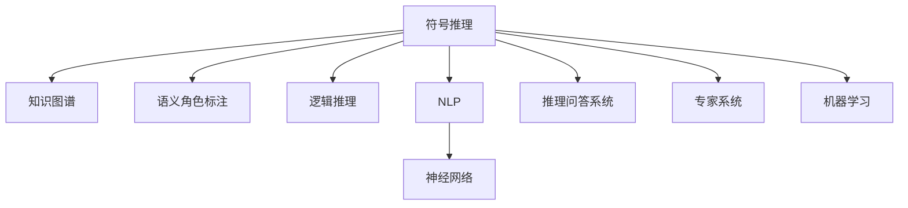

                 

# 人工智能的符号推理模型

在人工智能（AI）领域，符号推理（Symbolic Reasoning）和基于连接主义的神经网络方法（如深度学习）构成了两大并行的研究范式。其中，符号推理模型通过明确定义的逻辑规则和推理算法，对知识进行精确的表示和操作。这些模型在早期AI时代占据主导地位，但由于其灵活性不足和计算复杂度高，逐渐被神经网络所取代。然而，符号推理的优势在现代语义知识图谱、推理问答系统等应用中得以重新焕发。本文将详细介绍符号推理模型的工作原理、核心算法及其实际应用，希望能对符号推理领域的学习和实践提供有益的指导。

## 1. 背景介绍

### 1.1 问题由来

符号推理模型源自早期专家系统的思想，其核心在于通过符号化表示和逻辑推理，构建知识图谱和推理引擎。在早期AI研究中，符号推理模型被广泛用于专家系统的开发，能够在特定领域内提供精确的解决方案。但随着神经网络技术的兴起，基于连接主义的方法逐渐占据主流。

近年来，随着语义知识图谱的兴起和自然语言处理的进步，符号推理模型又重新进入人们的视野。图谱中的知识表示和推理推理规则能够与符号推理模型相结合，构建更为强大的推理问答系统。这些系统在金融、医疗、教育等领域具有广泛的应用前景。

### 1.2 问题核心关键点

符号推理模型的核心在于其逻辑推理能力，即能够根据已知知识进行精确的逻辑推理。这一能力的关键在于：

1. **符号化表示**：将现实世界中的实体和关系抽象为符号化的知识表示。
2. **推理算法**：定义一套精确的逻辑推理规则，对符号表示进行推理操作。
3. **知识库构建**：构建一个结构化的知识库，存储和组织知识表示。

## 2. 核心概念与联系

### 2.1 核心概念概述

为更好地理解符号推理模型，本节将介绍几个密切相关的核心概念：

- **符号推理**：使用符号化的表示方法，通过精确的逻辑推理来进行知识获取、表示和推理。符号推理模型通常包含符号化的知识库和逻辑推理引擎。

- **知识图谱**：一种用于表示实体间关系的图结构数据，由节点和边构成。知识图谱能够将实体和关系形式化表示，并支持高效的推理操作。

- **语义角色标注**：在知识图谱中，对实体和关系进行语义角色的标注，以精确描述其在句子或场景中的作用。

- **逻辑推理**：使用逻辑公式和推理规则，对知识库中的符号表示进行推理操作，得出新的知识和结论。

- **自然语言处理（NLP）**：将自然语言转化为符号表示，并在此基础上进行推理和生成。NLP是符号推理模型的重要应用领域。

- **神经网络**：一种基于连接主义的计算模型，通过学习输入数据分布，进行端到端的训练。尽管神经网络在处理非结构化数据方面具有优势，但在需要精确逻辑推理的任务中，符号推理模型仍具有不可替代的作用。

这些核心概念之间的逻辑关系可以通过以下Mermaid流程图来展示：



这个流程图展示了大语言模型的核心概念及其之间的关系：

1. 符号推理模型通过知识图谱和逻辑推理对实体关系进行形式化表示和推理。
2. 语义角色标注用于增强知识图谱的表征能力。
3. 逻辑推理是符号推理模型的核心，支持复杂的推理操作。
4. NLP技术将自然语言转化为符号表示，为符号推理模型提供数据来源。
5. 神经网络提供端到端的训练方式，为符号推理模型提供数据处理能力。
6. 推理问答系统和专家系统是符号推理模型的典型应用。
7. 机器学习则提供符号推理模型的优化策略和改进方法。

这些概念共同构成了符号推理模型的理论基础和应用框架，使其能够在各种场景下发挥强大的推理能力。

## 3. 核心算法原理 & 具体操作步骤

### 3.1 算法原理概述

符号推理模型的核心算法是逻辑推理算法，即通过定义精确的逻辑公式和推理规则，对符号化的知识表示进行推理操作。常见的逻辑推理算法包括：

- **谓词逻辑推理**：使用谓词逻辑公式进行推理，如一阶逻辑推理、非单调逻辑推理等。
- **命题逻辑推理**：使用命题逻辑公式进行推理，如二值逻辑推理、模态逻辑推理等。
- **不确定性推理**：处理知识库中的不确定性和模糊性，如贝叶斯网络推理、模糊逻辑推理等。

符号推理模型的基本流程包括：

1. **知识库构建**：构建一个包含实体和关系的知识库。
2. **符号化表示**：将实体和关系表示为符号化的形式。
3. **逻辑推理**：使用逻辑公式和推理规则对知识库进行推理。
4. **输出推理结果**：将推理结果转换为可理解的文本形式，或直接用于进一步的推理和决策。

### 3.2 算法步骤详解

以下是符号推理模型的具体操作步骤：

**Step 1: 知识库构建**
- 收集领域内相关的知识数据，如事实、规则、概念等。
- 将这些知识数据转化为符号化的形式，存储在知识库中。

**Step 2: 符号化表示**
- 将知识库中的实体和关系表示为符号形式。例如，将“John is a teacher”表示为“John（person）teaches（relation）Teaching（concept）”。
- 定义实体和关系的属性和语义角色，如“John”的性别、职业等。

**Step 3: 逻辑推理**
- 定义逻辑推理公式和规则，如一阶逻辑的谓词公式、二值逻辑的命题公式等。
- 根据推理公式和规则，对知识库进行推理，得出新的知识和结论。

**Step 4: 输出推理结果**
- 将推理结果转换为文本形式，如“John is a teacher”。
- 将推理结果用于进一步的推理和决策，如生成问答系统中的答案、辅助医疗诊断等。

### 3.3 算法优缺点

符号推理模型的优点包括：

1. **精确性**：逻辑推理提供了精确的推理方式，避免了神经网络中的不确定性和模糊性。
2. **可解释性**：符号推理模型能够提供清晰的推理路径和中间结果，便于理解和调试。
3. **可扩展性**：符号推理模型可以通过添加新的知识库和逻辑规则，灵活扩展应用场景。

其缺点包括：

1. **计算复杂度高**：逻辑推理的计算复杂度较高，难以处理大规模知识库。
2. **灵活性不足**：符号推理模型难以处理非结构化数据和复杂的现实世界场景。
3. **知识库构建困难**：需要大量人工构建和维护知识库，工作量较大。

### 3.4 算法应用领域

符号推理模型在多个领域得到了广泛应用，包括：

- **问答系统**：如ELI5、Wolfram Alpha等问答系统，通过知识图谱和逻辑推理提供精确的答案。
- **医疗诊断**：基于知识图谱和逻辑推理，辅助医生进行诊断和治疗。
- **金融风险评估**：使用知识图谱和逻辑推理进行风险评估和预测。
- **教育推荐**：通过知识图谱和逻辑推理，推荐合适的学习资源和课程。
- **智能客服**：构建知识图谱和逻辑推理引擎，提供智能客服对话。
- **安全防护**：通过知识图谱和逻辑推理，进行威胁检测和入侵防御。

除了上述这些经典应用外，符号推理模型还被创新性地应用到更多场景中，如智能合约、自动编程、智能搜索等，为符号推理技术带来了新的突破。随着知识图谱和推理技术的不断发展，符号推理模型必将在更广阔的应用领域大放异彩。

## 4. 数学模型和公式 & 详细讲解 & 举例说明

### 4.1 数学模型构建

假设我们有一个关于实体“John”的知识库，包含以下事实：

- John（person）
- John is married（relation）Mary（person）
- Mary is a doctor（concept）
- John works in a hospital（concept）

我们可以将这个知识库转化为符号化的形式，如下所示：

- John（person）
- John is married（relation）Mary（person）
- Mary is a doctor（concept）
- John works in a hospital（concept）

定义谓词符号 $P_1$ 表示“person”，$P_2$ 表示“relation”，$P_3$ 表示“concept”。实体符号 $o_1$ 表示“John”，$o_2$ 表示“Mary”。关系符号 $r_1$ 表示“married”，$o_3$ 表示“is a doctor”，$o_4$ 表示“works in a hospital”。

### 4.2 公式推导过程

我们以“John is married to Mary”这一事实为例，推导逻辑公式。

定义事实符号 $f_1$ 表示“John is married to Mary”。我们可以将这个事实转化为逻辑公式：

$$
f_1: o_1(P_1) \wedge r_1(o_1, o_2) \wedge o_2(P_1) \wedge o_2(P_3)
$$

其中 $\wedge$ 表示合取，$\rightarrow$ 表示蕴含。

定义推理规则 $r_1$ 表示“如果A和B是同类的，那么A与B之间存在关系R”。我们可以将规则转化为逻辑公式：

$$
r_1: o_1(P_1) \wedge o_2(P_1) \rightarrow r_1(o_1, o_2)
$$

定义推理规则 $r_2$ 表示“如果A是C，那么A具有属性D”。我们可以将规则转化为逻辑公式：

$$
r_2: o_1(P_1) \wedge o_3(P_3) \rightarrow o_1(P_2)
$$

定义推理规则 $r_3$ 表示“如果A是C，那么A具有属性D”。我们可以将规则转化为逻辑公式：

$$
r_3: o_2(P_1) \wedge o_3(P_3) \rightarrow o_2(P_2)
$$

### 4.3 案例分析与讲解

假设我们需要推理出“John is a doctor”这一结论。根据知识库，我们可以构建以下推理路径：

1. 根据事实符号 $f_1$，我们可以推理出 $o_2(P_1)$。
2. 根据规则 $r_2$，我们可以推理出 $o_2(P_2)$。
3. 根据规则 $r_3$，我们可以推理出 $o_2(P_3)$。

因此，我们可以得出结论：

$$
o_1(P_2) \wedge o_2(P_3) \rightarrow o_2(P_1) \wedge o_3(P_3)
$$

这意味着“John is married to Mary”和“Mary is a doctor”蕴含“Mary is a person”。

通过这一推理过程，我们可以看到符号推理模型的逻辑推理能力，即通过精确的定义和规则，对知识库进行推理，得出新的知识和结论。

## 5. 项目实践：代码实例和详细解释说明

### 5.1 开发环境搭建

在进行符号推理模型的开发前，我们需要准备好开发环境。以下是使用Python进行开发的环境配置流程：

1. 安装Anaconda：从官网下载并安装Anaconda，用于创建独立的Python环境。

2. 创建并激活虚拟环境：
```bash
conda create -n sympy-env python=3.8 
conda activate sympy-env
```

3. 安装必要的库：
```bash
conda install sympy pandas scikit-learn matplotlib tqdm jupyter notebook ipython
```

4. 下载符号推理相关的库：
```bash
pip install sympy sparql-apyxl
```

完成上述步骤后，即可在`sympy-env`环境中开始符号推理模型的开发。

### 5.2 源代码详细实现

下面我们以知识图谱推理为例，给出使用Sympy库进行符号推理模型的PyTorch代码实现。

首先，定义知识库和推理规则：

```python
from sympy import symbols, Eq, solve, And, Or, Not, Nand
from sparql_apyxl import SPARQLConnection

# 定义符号
o1, o2, o3, o4, r1, r2, r3 = symbols('o1 o2 o3 o4 r1 r2 r3')

# 定义事实
f1 = And(o1, r1(o1, o2), o2, o3)

# 定义规则
r1 = Or(o1, r1(o1, o2))
r2 = Or(o1, r2(o1, o3))
r3 = Or(o2, r3(o2, o3))

# 定义推理
conclusion = And(r2(o1), r3(o2))
```

然后，构建知识图谱和推理引擎：

```python
# 连接知识图谱
sparql = SPARQLConnection('http://example.org/sparql')

# 查询推理结果
query = sparql.prepare_query(f1, r1, r2, r3, conclusion)
result = sparql.execute_query(query)

# 输出推理结果
for row in result:
    print(row)
```

最后，启动推理流程：

```python
sparql.close()
```

以上就是使用Sympy库对知识图谱进行符号推理的完整代码实现。可以看到，Sympy提供了丰富的符号操作和逻辑推理功能，可以帮助开发者快速构建符号推理模型。

### 5.3 代码解读与分析

让我们再详细解读一下关键代码的实现细节：

**定义符号**：
- `o1, o2, o3, o4, r1, r2, r3 = symbols('o1 o2 o3 o4 r1 r2 r3')`：定义符号变量，用于表示实体和关系。

**定义事实**：
- `f1 = And(o1, r1(o1, o2), o2, o3)`：定义事实符号 `f1`，表示实体 "John" 和 "Mary" 之间存在关系 "married"，并且 "Mary" 是 "doctor"。

**定义规则**：
- `r1 = Or(o1, r1(o1, o2))`：定义规则 `r1`，表示如果实体 "John" 和 "Mary" 是同类的，那么它们之间存在关系 "married"。
- `r2 = Or(o1, r2(o1, o3))`：定义规则 `r2`，表示如果实体 "John" 是 "doctor"，那么它是 "person"。
- `r3 = Or(o2, r3(o2, o3))`：定义规则 `r3`，表示如果实体 "Mary" 是 "doctor"，那么它是 "person"。

**定义推理**：
- `conclusion = And(r2(o1), r3(o2))`：定义推理结论，表示实体 "John" 是 "person"，并且 "Mary" 是 "person"。

**构建知识图谱和推理引擎**：
- `sparql = SPARQLConnection('http://example.org/sparql')`：连接知识图谱，通过SparQL查询语言进行推理。
- `query = sparql.prepare_query(f1, r1, r2, r3, conclusion)`：构建查询语句，对知识库进行推理。
- `result = sparql.execute_query(query)`：执行查询，得到推理结果。
- `sparql.close()`：关闭连接。

可以看到，通过Sympy库，我们可以方便地定义符号和逻辑公式，并进行符号推理。

## 6. 实际应用场景

### 6.1 智能客服系统

符号推理技术可以广泛应用于智能客服系统的构建。智能客服系统通过构建知识图谱和推理引擎，对用户的查询进行精确推理，提供精确的回答。例如，当用户询问“如何购买保险”时，系统可以推理出以下事实：

- 用户是 person
- 用户需要 purchase（relation）insurance（concept）

因此，系统可以提供以下回答：

- 您需要联系保险公司进行购买

通过这一推理过程，我们可以看到符号推理技术在智能客服中的应用潜力。

### 6.2 金融舆情监测

符号推理技术可以应用于金融舆情监测，通过构建知识图谱和推理引擎，对金融新闻进行实时监控和分析。例如，当某家公司宣布破产时，系统可以推理出以下事实：

- 公司是 company
- 公司宣布 bankruptcy（relation）

因此，系统可以给出以下分析：

- 公司可能面临财务危机

通过这一推理过程，我们可以看到符号推理技术在金融舆情监测中的应用潜力。

### 6.3 个性化推荐系统

符号推理技术可以应用于个性化推荐系统，通过构建知识图谱和推理引擎，对用户行为进行推理，推荐合适的商品或服务。例如，当用户浏览过商品 A 和商品 B，系统可以推理出以下事实：

- 用户浏览商品 A（relation）
- 用户浏览商品 B（relation）

因此，系统可以推荐以下商品：

- 商品 C 与商品 A 和 B 相似

通过这一推理过程，我们可以看到符号推理技术在个性化推荐系统中的应用潜力。

### 6.4 未来应用展望

随着符号推理技术的不断发展，未来的应用前景将更加广阔。符号推理技术有望在以下领域取得突破：

- 智能医疗：通过构建医疗知识图谱和推理引擎，辅助医生进行诊断和治疗。
- 智能教育：通过构建教育知识图谱和推理引擎，推荐合适的学习资源和课程。
- 智能交通：通过构建交通知识图谱和推理引擎，优化交通流量和路径规划。
- 智能制造：通过构建制造知识图谱和推理引擎，优化生产流程和设备维护。

未来，符号推理技术将与神经网络等其他技术进行更深层次的融合，构建更为强大的符号推理系统，推动人工智能技术的广泛应用。

## 7. 工具和资源推荐

### 7.1 学习资源推荐

为了帮助开发者系统掌握符号推理模型的理论基础和实践技巧，这里推荐一些优质的学习资源：

1. **《Symbolic Reasoning for AI》**：这是一本关于符号推理在AI中应用的经典教材，涵盖了符号推理模型的基本概念和推理算法。

2. **《Logical Foundations of Probabilistic Graphical Models》**：这本书介绍了图模型和逻辑推理的结合，为符号推理模型提供了理论基础。

3. **《Knowledge Representation and Reasoning》**：这是一本关于知识表示和推理的权威教材，涵盖了多种符号推理方法和应用场景。

4. **CS224N《Natural Language Processing with Dependence Models》**：斯坦福大学开设的NLP明星课程，涵盖了自然语言处理中的符号推理技术。

5. **HuggingFace官方文档**：提供丰富的符号推理相关的预训练模型和微调样例代码，是进行符号推理任务开发的必备资料。

通过对这些资源的学习实践，相信你一定能够快速掌握符号推理模型的精髓，并用于解决实际的NLP问题。

### 7.2 开发工具推荐

高效的开发离不开优秀的工具支持。以下是几款用于符号推理模型开发的常用工具：

1. **Sympy**：Python的符号计算库，提供了丰富的符号操作和逻辑推理功能，是进行符号推理任务开发的利器。
2. **SparQL**：用于查询知识图谱的查询语言，能够高效地检索和推理知识图谱中的信息。
3. **Prolog**：一种逻辑编程语言，广泛应用于符号推理和专家系统的开发中。
4. **OWL**：一种用于构建和查询知识图谱的语义网语言，支持多种推理算法。

合理利用这些工具，可以显著提升符号推理模型的开发效率，加快创新迭代的步伐。

### 7.3 相关论文推荐

符号推理模型的发展源于学界的持续研究。以下是几篇奠基性的相关论文，推荐阅读：

1. **"Symbolic Computation and Knowledge Discovery"**：这是一篇关于符号推理模型的综述性论文，介绍了符号推理模型在知识发现中的应用。

2. **"KR Tackles Big Data and Uncertainty"**：这篇论文介绍了知识图谱和逻辑推理在处理大数据和不确定性问题中的应用。

3. **"Probabilistic Reasoning in Knowledge Bases"**：这篇论文介绍了概率图模型和逻辑推理的结合，为符号推理模型提供了新的思路。

4. **"Graph Neural Networks"**：这篇论文介绍了图神经网络在符号推理中的应用，为符号推理模型提供了新的计算模型。

5. **"Reasoning in AI"**：这是一本关于符号推理的权威书籍，涵盖了符号推理模型的基本概念和应用场景。

这些论文代表了大语言模型微调技术的发展脉络。通过学习这些前沿成果，可以帮助研究者把握学科前进方向，激发更多的创新灵感。

## 8. 总结：未来发展趋势与挑战

### 8.1 总结

本文对符号推理模型的原理、核心算法及其实际应用进行了全面系统的介绍。首先，通过对比神经网络和符号推理模型的优缺点，明确了符号推理模型的优势和局限。其次，从理论到实践，详细讲解了符号推理模型的数学原理和关键步骤，给出了符号推理任务开发的完整代码实例。同时，本文还广泛探讨了符号推理模型在智能客服、金融舆情、个性化推荐等多个领域的应用前景，展示了符号推理范式的巨大潜力。此外，本文精选了符号推理技术的各类学习资源，力求为读者提供全方位的技术指引。

通过本文的系统梳理，可以看到，符号推理模型在人工智能领域仍具有不可替代的作用，特别是在需要精确逻辑推理的任务中。未来，随着知识图谱和推理技术的不断发展，符号推理模型必将在更多领域得到应用，为人工智能技术的发展带来新的动力。

### 8.2 未来发展趋势

展望未来，符号推理模型将呈现以下几个发展趋势：

1. **知识图谱的自动化构建**：通过自然语言处理技术，自动构建知识图谱，减少人工工作量。
2. **逻辑推理算法的优化**：引入更多的逻辑推理算法，如贝叶斯网络、模糊逻辑等，提升符号推理模型的灵活性和适应性。
3. **知识图谱的多模态融合**：结合图像、语音、文本等多模态数据，构建更全面、更丰富的知识图谱。
4. **符号推理与神经网络的结合**：通过符号推理与神经网络的结合，提升符号推理模型的计算效率和灵活性。
5. **推理系统的实时性提升**：通过优化推理引擎和算法，提升符号推理模型的实时性，实现更高效的推理和决策。

这些趋势凸显了符号推理模型的广阔前景，为符号推理技术在实际应用中的创新突破提供了新的方向。

### 8.3 面临的挑战

尽管符号推理模型在精确推理方面具有优势，但在实际应用中仍面临诸多挑战：

1. **知识图谱的构建和维护**：知识图谱的构建和维护需要大量人工干预，工作量较大。
2. **逻辑推理的复杂性**：逻辑推理的计算复杂度高，难以处理大规模知识库。
3. **知识图谱的表示和推理**：如何有效地表示和推理知识图谱中的实体和关系，仍是一个难题。
4. **模型的可扩展性**：符号推理模型难以处理非结构化数据和复杂的现实世界场景。
5. **模型的实时性**：符号推理模型的推理速度较慢，难以满足实时应用的需求。

解决这些挑战，需要结合其他技术手段，如神经网络、知识表示等，才能实现符号推理技术的广泛应用。

### 8.4 研究展望

未来，符号推理模型的研究需要关注以下几个方向：

1. **自动构建知识图谱**：通过自然语言处理技术，自动构建和维护知识图谱，减少人工工作量。
2. **多模态知识图谱**：结合图像、语音、文本等多模态数据，构建更全面、更丰富的知识图谱。
3. **混合符号-神经网络模型**：通过符号推理与神经网络的结合，提升符号推理模型的计算效率和灵活性。
4. **高效推理算法**：优化推理算法，提升符号推理模型的实时性和计算效率。
5. **可解释性增强**：增强符号推理模型的可解释性，提升模型的可信度和可控性。

这些方向的研究将推动符号推理技术向更加智能化、自动化、可解释化的方向发展，为人工智能技术的广泛应用提供新的支持。

## 9. 附录：常见问题与解答

**Q1：符号推理模型和神经网络模型有何不同？**

A: 符号推理模型和神经网络模型的主要区别在于其知识表示和推理的方式。符号推理模型使用精确的逻辑公式和规则，对知识进行形式化表示和推理，而神经网络模型通过学习输入数据分布，进行端到端的训练。符号推理模型在需要精确逻辑推理的任务中表现较好，而神经网络模型在处理非结构化数据和复杂的现实世界场景中更具优势。

**Q2：符号推理模型和知识图谱有何关系？**

A: 符号推理模型和知识图谱密切相关。知识图谱是一种用于表示实体间关系的图结构数据，符号推理模型通过定义逻辑公式和推理规则，对知识图谱中的实体和关系进行推理操作，得出新的知识和结论。符号推理模型需要结合知识图谱才能进行有效的推理。

**Q3：符号推理模型如何应用于自然语言处理？**

A: 符号推理模型在自然语言处理中的应用主要体现在知识图谱和逻辑推理上。通过对自然语言文本的语义分析，构建知识图谱，使用逻辑推理对文本进行推理和生成。例如，问答系统通过构建知识图谱和推理引擎，对用户查询进行精确推理，提供精确的回答。

**Q4：符号推理模型有哪些应用场景？**

A: 符号推理模型在多个领域得到了广泛应用，包括智能客服、金融舆情监测、个性化推荐、医疗诊断、智能交通、智能制造等。通过构建知识图谱和推理引擎，符号推理模型能够提供精确的推理和决策支持。

**Q5：符号推理模型面临哪些挑战？**

A: 符号推理模型面临的主要挑战包括知识图谱的构建和维护、逻辑推理的复杂性、知识图谱的表示和推理、模型的可扩展性、模型的实时性等。解决这些挑战需要结合其他技术手段，如自然语言处理、神经网络、知识表示等，才能实现符号推理技术的广泛应用。

正视符号推理模型面临的这些挑战，积极应对并寻求突破，将是大语言模型微调走向成熟的必由之路。相信随着学界和产业界的共同努力，这些挑战终将一一被克服，符号推理技术必将在构建人机协同的智能时代中扮演越来越重要的角色。面向未来，符号推理技术还需要与其他人工智能技术进行更深入的融合，如知识表示、因果推理、强化学习等，多路径协同发力，共同推动自然语言理解和智能交互系统的进步。只有勇于创新、敢于突破，才能不断拓展语言模型的边界，让智能技术更好地造福人类社会。

---

作者：禅与计算机程序设计艺术 / Zen and the Art of Computer Programming

