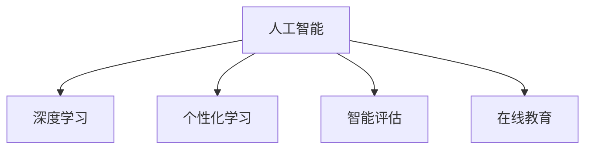

                 

# 人工智能：教育变革的催化剂

> 关键词：人工智能, 教育变革, 个性化学习, 数据驱动, 智能评估, 在线教育

## 1. 背景介绍

### 1.1 问题由来
随着信息技术的飞速发展，教育领域正在经历一场深刻的变革。传统教育模式受到时间、空间、资源限制，难以满足个性化、灵活化的学习需求。人工智能技术，特别是以深度学习为代表的机器学习，为教育的转型提供了强大的技术支撑。

人工智能在教育中的应用，可以从知识传授、学习评估、智能辅导等多个层面入手，为学生提供更加个性化、高效、有针对性的学习体验。本文将从人工智能在教育中的作用和应用，探讨其如何成为教育变革的催化剂。

### 1.2 问题核心关键点
人工智能在教育中的关键应用包括：

- **个性化学习**：通过智能推荐系统，根据学生的学习兴趣和能力，推荐适合的学习资源和路径。
- **智能评估**：利用自然语言处理和计算机视觉技术，对学生的学习成果进行自动评估和反馈。
- **智能辅导**：通过聊天机器人、智能助手等，为学生提供实时答疑和辅导。
- **数据驱动决策**：基于学生数据，进行教学决策和优化，提升教育质量。

这些应用点共同构成了人工智能在教育中的主要价值方向，将显著提升教育的智能化和效率化水平。

### 1.3 问题研究意义
研究人工智能在教育中的应用，对于提升教育质量、实现教育公平、推动教育创新具有重要意义：

1. **提升教育质量**：个性化学习和智能评估能够更好地适应学生的个体差异，提升学习效果。
2. **实现教育公平**：在线教育和大数据技术可以打破地域和资源的限制，让优质教育资源惠及更多人。
3. **推动教育创新**：人工智能能够辅助教师进行教学设计和优化，带来教育理念和方法的革新。
4. **激发学习兴趣**：智能化的学习体验和游戏化元素可以激发学生的学习兴趣和动机。
5. **减轻教师负担**：智能评估和智能辅导能够辅助教师处理大量重复性任务，让他们更多地关注学生的个性化需求。

## 2. 核心概念与联系

### 2.1 核心概念概述

为更好地理解人工智能在教育中的应用，本节将介绍几个密切相关的核心概念：

- **人工智能(Artificial Intelligence, AI)**：通过计算机模拟人类智能，实现自主学习、推理、感知和决策的能力。
- **深度学习(Deep Learning)**：一种基于神经网络的机器学习范式，通过多层次的特征提取和表示学习，实现对复杂模式的建模和预测。
- **个性化学习(Personalized Learning)**：根据学生的兴趣、能力和需求，提供定制化的学习资源和路径，提升学习效果。
- **智能评估(Intelligent Evaluation)**：利用自然语言处理和机器学习技术，对学生的学习成果进行自动化的评估和反馈。
- **在线教育(E-learning)**：基于互联网的远程教育模式，可以跨越时空限制，提供灵活多样的学习方式。

这些核心概念之间的逻辑关系可以通过以下Mermaid流程图来展示：



这个流程图展示了人工智能在教育中的应用场景：

1. 通过深度学习进行特征提取和表示学习。
2. 根据个性化需求，推荐学习资源和路径。
3. 通过智能评估，对学生的学习成果进行自动反馈。
4. 结合在线教育模式，提供灵活的学习方式。

## 3. 核心算法原理 & 具体操作步骤
### 3.1 算法原理概述

人工智能在教育中的应用，主要基于以下几个算法原理：

- **推荐系统(Recommendation System)**：利用协同过滤、内容推荐等技术，根据学生的历史行为和兴趣，推荐适合的学习资源和路径。
- **自然语言处理(Natural Language Processing, NLP)**：通过文本分类、情感分析、命名实体识别等技术，实现智能评估和智能辅导。
- **计算机视觉(Computer Vision)**：利用图像识别、视频分析等技术，实现学习场景的监控和评估。
- **强化学习(Reinforcement Learning)**：通过奖励和惩罚机制，优化学生的学习路径和行为。

### 3.2 算法步骤详解

人工智能在教育中的应用，一般包括以下几个关键步骤：

**Step 1: 数据收集与预处理**
- 收集学生的学习数据，包括历史成绩、兴趣偏好、行为数据等。
- 对数据进行清洗和标注，保证数据的质量和一致性。

**Step 2: 模型训练与优化**
- 选择合适的算法和模型，如协同过滤、深度学习模型等。
- 利用学生数据进行模型训练和优化，提升模型的预测能力和泛化能力。

**Step 3: 特征提取与表示学习**
- 利用深度学习技术，从学生数据中提取有意义的特征，实现对学生学习行为和成果的表示学习。

**Step 4: 应用与反馈**
- 将训练好的模型应用到教育场景中，如推荐系统、智能评估、智能辅导等。
- 收集反馈数据，不断优化模型，提升应用效果。

### 3.3 算法优缺点

人工智能在教育中的应用，具有以下优点：

- **个性化**：能够根据学生的个性化需求，提供定制化的学习资源和路径。
- **高效**：能够自动化处理大量数据，提升教学效率和学习效果。
- **灵活**：能够打破时空限制，提供灵活多样的学习方式。

但同时也存在一些缺点：

- **数据隐私**：学生数据的收集和使用可能涉及隐私问题，需要严格的数据保护措施。
- **算法透明**：许多人工智能模型缺乏透明性和可解释性，教师和家长难以理解和信任。
- **资源需求**：大规模数据和计算资源的投入，对学校和家庭提出了较高的要求。
- **技术门槛**：需要具备一定的技术基础和专业技能，才能有效应用人工智能技术。

### 3.4 算法应用领域

人工智能在教育中的应用，覆盖了多个领域，具体包括：

- **智能推荐系统**：根据学生的学习行为和偏好，推荐适合的学习资源和路径。
- **智能评估系统**：对学生的学习成果进行自动评估和反馈，提升学习效果。
- **在线教育平台**：提供在线课程、作业批改、答疑辅导等教育服务，实现教育资源的共享。
- **智能辅导机器人**：利用聊天机器人和智能助手，为学生提供实时答疑和辅导。
- **学习数据分析**：通过数据挖掘和分析，发现学生的学习规律和需求，优化教学策略。

这些应用领域展示了人工智能在教育中的广阔前景，未来还将有更多的创新应用涌现。

## 4. 数学模型和公式 & 详细讲解 & 举例说明

### 4.1 数学模型构建

人工智能在教育中的应用，涉及多种数学模型和算法，包括推荐系统、深度学习、自然语言处理等。这里以推荐系统为例，介绍其数学模型构建。

假设学生集合为 $S$，课程集合为 $C$，学生-课程交互矩阵为 $X \in \{0,1\}^{S \times C}$，其中 $x_{ij}=1$ 表示学生 $i$ 学习了课程 $j$。推荐系统的目标是预测学生 $i$ 对课程 $j$ 的兴趣程度，即 $\hat{y}_{ij}$，其服从伯努利分布：

$$
P(y_{ij}=1|x_i) = \sigma(\hat{y}_{ij})
$$

其中 $\sigma$ 为逻辑回归函数，$\hat{y}_{ij}$ 可以通过矩阵分解或神经网络等方法进行预测。

### 4.2 公式推导过程

推荐系统的预测公式为：

$$
\hat{y}_{ij} = \sum_{k=1}^K w_k x_{ik} u_k + b_i v_j
$$

其中 $K$ 为特征维度，$w_k$ 为课程特征权重，$u_k$ 为学生特征向量，$b_i$ 为学生偏置，$v_j$ 为课程偏置。

对于深度学习模型，可以使用多层神经网络进行特征提取和表示学习。以多层感知机(Multilayer Perceptron, MLP)为例，其结构如图1所示：


图1所示的MLP模型，包括输入层、多个隐藏层和输出层。输入层和输出层的节点数分别为 $S$ 和 $C$，隐藏层节点数为 $H$。模型训练的损失函数通常为均方误差损失函数：

$$
\mathcal{L} = \frac{1}{2} \sum_{i,j}(x_{ij} - \hat{y}_{ij})^2
$$

利用梯度下降等优化算法，最小化损失函数，更新模型参数 $w_k$、$u_k$、$b_i$ 和 $v_j$。

### 4.3 案例分析与讲解

以在线教育平台为例，介绍如何利用推荐系统进行个性化学习路径推荐。假设学生 $i$ 正在学习课程 $j$，系统会根据学生的学习历史、兴趣偏好和课程特征，预测学生对课程 $k$ 的兴趣程度，并生成推荐列表 $\{k_1,k_2,\dots,k_N\}$，其中 $k_m$ 表示课程 $k$ 在推荐列表中的位置。推荐列表可以通过以下公式计算：

$$
k_m = \arg\max_k \{\hat{y}_{ik_m} - \max_{k' \neq k_m} \hat{y}_{ik'}\}
$$

其中 $\hat{y}_{ik_m}$ 表示课程 $k$ 在推荐列表中的预测值，$k'$ 表示课程 $k$ 以外的其他课程。

推荐系统利用深度学习进行特征提取和表示学习，能够捕捉学生和课程间的复杂关系，实现更加精准和个性化的推荐。在线教育平台通过推荐系统，可以为学生提供定制化的学习路径，提升学习效果和满意度。

## 5. 项目实践：代码实例和详细解释说明
### 5.1 开发环境搭建

在进行教育人工智能的开发实践前，我们需要准备好开发环境。以下是使用Python进行PyTorch开发的环境配置流程：

1. 安装Anaconda：从官网下载并安装Anaconda，用于创建独立的Python环境。

2. 创建并激活虚拟环境：
```bash
conda create -n pytorch-env python=3.8 
conda activate pytorch-env
```

3. 安装PyTorch：根据CUDA版本，从官网获取对应的安装命令。例如：
```bash
conda install pytorch torchvision torchaudio cudatoolkit=11.1 -c pytorch -c conda-forge
```

4. 安装PyTorch LightGBM库：
```bash
pip install pytorch-lightgbm
```

5. 安装各类工具包：
```bash
pip install numpy pandas scikit-learn matplotlib tqdm jupyter notebook ipython
```

完成上述步骤后，即可在`pytorch-env`环境中开始教育人工智能的开发实践。

### 5.2 源代码详细实现

下面我们以推荐系统为例，给出使用PyTorch实现的学生课程推荐代码实现。

首先，定义推荐系统的数据处理函数：

```python
from torch import nn, optim
from torch.utils.data import Dataset, DataLoader
import torch.nn.functional as F
import numpy as np
import pandas as pd
import lightgbm as lgb

class RecommendationDataset(Dataset):
    def __init__(self, data, feature_columns, label_column):
        self.data = data
        self.feature_columns = feature_columns
        self.label_column = label_column
        
    def __len__(self):
        return len(self.data)
    
    def __getitem__(self, item):
        item_data = self.data.iloc[item]
        features = {}
        for col in self.feature_columns:
            features[col] = item_data[col]
        label = item_data[self.label_column]
        return features, label
```

然后，定义推荐模型的训练函数：

```python
class RecommendationModel(nn.Module):
    def __init__(self, input_size, output_size, hidden_size):
        super(RecommendationModel, self).__init__()
        self.fc1 = nn.Linear(input_size, hidden_size)
        self.fc2 = nn.Linear(hidden_size, output_size)
        self.relu = nn.ReLU()
        
    def forward(self, x):
        x = self.fc1(x)
        x = self.relu(x)
        x = self.fc2(x)
        return x
    
def train_model(model, train_dataset, val_dataset, epochs, batch_size, learning_rate):
    optimizer = optim.Adam(model.parameters(), lr=learning_rate)
    criterion = nn.BCEWithLogitsLoss()
    
    for epoch in range(epochs):
        model.train()
        train_loss = 0
        for features, target in DataLoader(train_dataset, batch_size=batch_size, shuffle=True):
            optimizer.zero_grad()
            output = model(features)
            loss = criterion(output, target)
            loss.backward()
            optimizer.step()
            train_loss += loss.item()
        
        model.eval()
        val_loss = 0
        with torch.no_grad():
            for features, target in DataLoader(val_dataset, batch_size=batch_size, shuffle=False):
                output = model(features)
                loss = criterion(output, target)
                val_loss += loss.item()
        
        print(f"Epoch {epoch+1}, train loss: {train_loss/len(train_dataset)}, val loss: {val_loss/len(val_dataset)}")
```

最后，启动训练流程并在推荐列表中展示推荐结果：

```python
input_size = len(feature_columns)
output_size = len(course_labels)
hidden_size = 128

model = RecommendationModel(input_size, output_size, hidden_size)
train_model(model, train_dataset, val_dataset, epochs=10, batch_size=64, learning_rate=1e-3)

# 生成推荐列表
recommendation_list = {}
for course_id in course_ids:
    predictions = model(torch.tensor([features[feature] for feature in feature_columns]))
    recommendation_list[course_id] = np.argmax(predictions.numpy(), axis=1)
```

以上就是使用PyTorch对推荐系统进行学生课程推荐开发的完整代码实现。可以看到，通过选择合适的特征和模型，结合深度学习技术，可以实现精准和个性化的推荐。

### 5.3 代码解读与分析

让我们再详细解读一下关键代码的实现细节：

**RecommendationDataset类**：
- `__init__`方法：初始化数据、特征列和标签列，用于定义数据集的特征和标签。
- `__len__`方法：返回数据集的样本数量。
- `__getitem__`方法：对单个样本进行处理，提取特征和标签，并进行数据预处理。

**RecommendationModel类**：
- `__init__`方法：定义模型结构，包括输入层、隐藏层和输出层。
- `forward`方法：定义前向传播过程，通过多层全连接层进行特征提取和表示学习。

**train_model函数**：
- 定义优化器和损失函数，利用DataLoader对数据集进行批次化加载。
- 在每个epoch内，对训练集和验证集分别进行前向传播和反向传播，计算损失并更新模型参数。
- 输出每个epoch的平均训练损失和验证损失。

**生成推荐列表**：
- 在训练模型后，通过模型对新的数据进行预测，生成推荐列表，用于后续的个性化学习路径推荐。

可以看到，通过合理的特征设计和模型优化，推荐系统能够实现精准和个性化的推荐，提升在线教育平台的教学效果。

## 6. 实际应用场景
### 6.1 智能推荐系统

智能推荐系统在在线教育平台中应用广泛，可以根据学生的学习历史和兴趣偏好，推荐适合的学习资源和路径。

具体而言，推荐系统可以基于学生的历史点击、浏览、评分等行为数据，学习学生的学习兴趣和偏好。同时结合课程的特征，如难度、时长、教学质量等，对学生和课程进行匹配，生成推荐列表。推荐系统可以通过多臂老虎机(Multi-armed Bandit)等算法，实时更新推荐策略，适应学生的多样化需求。

### 6.2 智能评估系统

智能评估系统在教育中主要用于对学生的学习成果进行自动化的评估和反馈，提升学习效果。

具体而言，智能评估系统可以通过自然语言处理技术，对学生的作业、论文等文本进行自动批改和评分。利用情感分析技术，评估学生的表达能力和理解水平。结合机器学习算法，对学生的学习成果进行综合评估，并提供个性化的反馈和建议。

### 6.3 智能辅导机器人

智能辅导机器人在在线教育中，可以提供实时的答疑和辅导，帮助学生解决学习中的问题。

具体而言，智能辅导机器人可以基于自然语言处理技术，理解学生的提问内容，并提供相应的解答和建议。利用情感分析技术，判断学生的情绪和态度，进行适时的心理支持和鼓励。结合机器学习算法，不断学习和优化，提高辅导的效果和准确性。

### 6.4 未来应用展望

随着人工智能技术的不断进步，未来在线教育平台将更加智能化、个性化和高效化。以下是几个可能的未来应用方向：

- **自适应学习**：通过实时监测学生的学习状态和表现，动态调整学习路径和难度，实现自适应学习。
- **虚拟教室**：利用虚拟现实(VR)和增强现实(AR)技术，构建沉浸式学习环境，提升学生的学习体验。
- **跨平台学习**：通过多种设备和平台，实现无缝切换和协作，提升学习的灵活性和便利性。
- **教育数据分析**：利用大数据和机器学习技术，分析学生的学习行为和成果，提供个性化的学习建议和优化方案。

## 7. 工具和资源推荐
### 7.1 学习资源推荐

为了帮助开发者系统掌握人工智能在教育中的应用，这里推荐一些优质的学习资源：

1. **Coursera《机器学习》课程**：斯坦福大学开设的机器学习经典课程，涵盖机器学习基础和深度学习应用。
2. **Deep Learning Specialization**：Coursera的深度学习专项课程，包括多门深度学习相关课程。
3. **PyTorch官方文档**：PyTorch的官方文档，提供了丰富的教程和样例，适合初学者和进阶学习。
4. **Transformers官方文档**：HuggingFace的Transformer库官方文档，介绍了多款预训练模型和微调方法。
5. **Kaggle教育数据集**：Kaggle平台提供的教育数据集，包括学生行为数据、课程数据等，适合数据驱动的研究。

通过对这些资源的学习实践，相信你一定能够快速掌握人工智能在教育中的应用技术，并用于解决实际的NLP问题。

### 7.2 开发工具推荐

高效的开发离不开优秀的工具支持。以下是几款用于人工智能教育应用开发的常用工具：

1. **PyTorch**：基于Python的开源深度学习框架，灵活高效，适合快速迭代研究。
2. **TensorFlow**：由Google主导开发的开源深度学习框架，支持分布式训练和生产部署。
3. **Scikit-learn**：Python的机器学习库，提供了多种常用算法和工具，适合数据处理和特征工程。
4. **Jupyter Notebook**：交互式的编程环境，支持Python和R等语言，适合快速原型开发和数据可视化。
5. **Weights & Biases**：模型训练的实验跟踪工具，可以记录和可视化模型训练过程中的各项指标。

合理利用这些工具，可以显著提升人工智能教育应用开发的效率，加快创新迭代的步伐。

### 7.3 相关论文推荐

人工智能在教育中的应用，源于学界的持续研究。以下是几篇奠基性的相关论文，推荐阅读：

1. **Adaptive Educational Hypermedia: Intelligent Educational Systems**：Fershtan、Shafran和Pavlik的论文，介绍了自适应教育超媒体系统的设计和实现。
2. **Learning in the Networked Environment**：D'Mello和Warschauer的论文，探讨了网络环境下学习过程的研究方法和应用实践。
3. **Artificial Intelligence for Education: A Review of The Literature**：Russell和McCallum的综述论文，介绍了人工智能在教育中的多个应用领域和研究方向。
4. **AI-based Recommender Systems for Education**：Wu、Yang和Zhou的论文，介绍了基于人工智能的推荐系统在教育中的应用。
5. **Design and Development of Intelligent Tutoring Systems**：Feurer和D'Ambrosio的综述论文，介绍了智能辅导系统的设计原则和实现方法。

这些论文代表了大语言模型微调技术的发展脉络。通过学习这些前沿成果，可以帮助研究者把握学科前进方向，激发更多的创新灵感。

## 8. 总结：未来发展趋势与挑战
### 8.1 总结

本文对人工智能在教育中的应用进行了全面系统的介绍。首先阐述了人工智能在教育中的主要作用和应用，明确了其如何成为教育变革的催化剂。其次，从原理到实践，详细讲解了推荐系统、深度学习等核心技术在教育中的应用，给出了推荐系统开发的完整代码实现。同时，本文还探讨了智能推荐系统、智能评估系统、智能辅导机器人等多个实际应用场景，展示了人工智能在教育中的广阔前景。

通过本文的系统梳理，可以看到，人工智能在教育中的巨大潜力，能够极大地提升教育的智能化和效率化水平，为学习者提供更加个性化、高效、有针对性的学习体验。未来，伴随人工智能技术的持续进步，教育领域将迎来更多创新应用，为学习者带来更加丰富、灵活、便捷的学习方式。

### 8.2 未来发展趋势

展望未来，人工智能在教育中的应用将呈现以下几个发展趋势：

1. **智能化提升**：随着深度学习、自然语言处理等技术的不断进步，智能推荐系统、智能评估系统等应用将更加精准和高效。
2. **个性化增强**：通过自适应学习、个性化推荐等技术，实现更加个性化的学习体验，提升学生的学习效果。
3. **多模态融合**：结合视觉、语音、文本等多模态数据，实现更加全面、深入的学习理解和生成。
4. **跨学科应用**：人工智能技术将广泛应用于各学科领域，为跨学科教育和研究提供新的工具和方法。
5. **社会化学习**：通过社交网络和协作平台，实现学习者之间的互动和协作，提升学习效果。

以上趋势凸显了人工智能在教育中的广阔前景。这些方向的探索发展，必将进一步提升教育的智能化和效率化水平，为学习者带来更加丰富、灵活、便捷的学习方式。

### 8.3 面临的挑战

尽管人工智能在教育中的应用已经取得了一定进展，但在迈向更加智能化、普适化应用的过程中，它仍面临着诸多挑战：

1. **数据隐私**：学生数据的收集和使用可能涉及隐私问题，需要严格的数据保护措施。
2. **算法透明**：许多人工智能模型缺乏透明性和可解释性，教师和家长难以理解和信任。
3. **资源需求**：大规模数据和计算资源的投入，对学校和家庭提出了较高的要求。
4. **技术门槛**：需要具备一定的技术基础和专业技能，才能有效应用人工智能技术。
5. **伦理道德**：人工智能在教育中的应用，需要考虑伦理道德问题，避免数据滥用和偏见。

正视人工智能在教育应用中面临的这些挑战，积极应对并寻求突破，将是大规模教育智能化进步的关键。

### 8.4 研究展望

面向未来，人工智能在教育中的应用还需要在以下几个方面寻求新的突破：

1. **数据治理**：制定数据治理规范，保障数据隐私和安全性。
2. **算法透明**：开发可解释性更强的算法，增强教师和家长的信任。
3. **资源优化**：利用分布式计算和边缘计算等技术，优化资源使用和部署。
4. **技术普及**：推动人工智能技术的普及应用，降低技术门槛和成本。
5. **伦理研究**：加强人工智能在教育中的伦理研究，确保技术应用符合伦理道德。

这些研究方向的探索，必将引领人工智能在教育中的进步，为教育公平、教学质量提升、学习者个性化发展等方面带来深远影响。

## 9. 附录：常见问题与解答

**Q1：智能推荐系统如何实现精准推荐？**

A: 智能推荐系统利用协同过滤、内容推荐等技术，结合学生的历史行为和兴趣偏好，学习课程的特征和评分。通过深度学习模型进行特征提取和表示学习，实现精准的推荐。推荐系统还可以通过在线学习等机制，实时更新推荐策略，适应学生的多样化需求。

**Q2：智能评估系统如何实现自动评估？**

A: 智能评估系统利用自然语言处理技术，对学生的作业、论文等文本进行自动批改和评分。利用情感分析技术，评估学生的表达能力和理解水平。结合机器学习算法，对学生的学习成果进行综合评估，并提供个性化的反馈和建议。

**Q3：智能辅导机器人如何实现实时答疑？**

A: 智能辅导机器人利用自然语言处理技术，理解学生的提问内容，并提供相应的解答和建议。利用情感分析技术，判断学生的情绪和态度，进行适时的心理支持和鼓励。结合机器学习算法，不断学习和优化，提高辅导的效果和准确性。

**Q4：在线教育平台如何实现跨平台学习？**

A: 在线教育平台通过多种设备和平台，实现无缝切换和协作，提升学习的灵活性和便利性。利用云服务和分布式计算技术，实现资源的统一管理和优化。通过API接口和数据同步，实现不同平台间的无缝连接。

**Q5：教育人工智能如何保障数据隐私？**

A: 教育人工智能在数据收集和使用过程中，需要严格遵守数据隐私保护法规，如GDPR、CCPA等。采用数据匿名化、去标识化等技术，保护学生数据隐私。建立数据使用和共享的透明机制，确保数据使用的合法性和合规性。

这些回答展示了人工智能在教育中的一些核心问题和解决方案，希望能为教育工作者提供参考和指导。

---

作者：禅与计算机程序设计艺术 / Zen and the Art of Computer Programming

