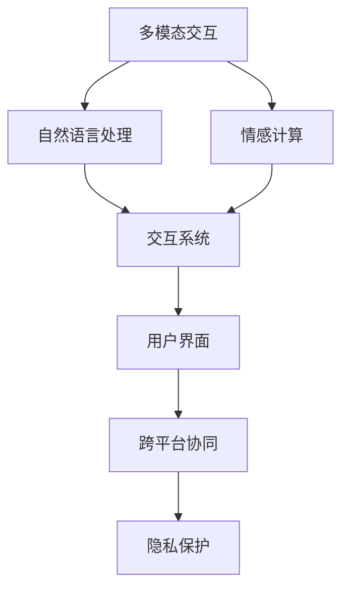
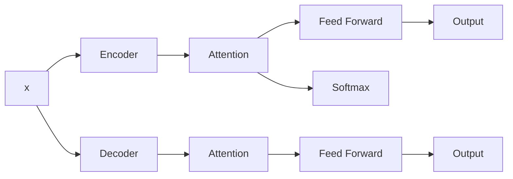

                 

## 1. 背景介绍

随着人工智能技术的发展，人机交互方式已经发生了翻天覆地的变化。从简单的文本指令交互，到视觉界面、语音助手、虚拟现实等复杂的多模态交互方式，人机交互范式已经从单一走向多元。展望未来，人机交互将进一步融合更多智能技术，如自然语言处理、计算机视觉、情感计算等，使交互更加自然、智能和人性化。

### 1.1 问题由来

在早期的计算机交互中，用户主要通过命令行与计算机进行通信。这种交互方式单一且效率低下，用户需要记住各种命令及其语法，导致用户学习和使用的门槛较高。

随着图形用户界面(GUI)的普及，用户可以通过点击、拖拽等直观方式进行交互。虽然这种方式直观友好，但与计算机的交互仍停留在被动执行层面。

近年来，随着深度学习、自然语言处理等技术的发展，智能人机交互成为新的趋势。语音助手、聊天机器人等智能交互系统，通过自然语言理解和生成技术，可以主动理解用户意图，主动提供帮助，极大地提升了交互的便利性和自然度。

### 1.2 问题核心关键点

当前人机交互的核心关键点包括：

1. **多模态融合**：未来人机交互将进一步融合视觉、语音、触觉等多元模式，实现更全面的感官交互。

2. **自然语言处理**：自然语言处理技术是实现智能交互的关键，将用户自然语言转化为机器可理解的指令，并生成自然语言的响应。

3. **情感计算**：理解用户情绪，实现情感化的交互，提升用户体验。

4. **实时响应**：实时响应用户请求，减少等待时间。

5. **个性化定制**：基于用户行为和偏好，提供个性化服务。

6. **可解释性**：增加系统决策的可解释性，提高用户信任。

7. **跨设备协同**：支持跨设备、跨平台的无缝交互。

8. **隐私保护**：在交互过程中保护用户隐私，防止数据泄露。

这些关键点将推动人机交互从单一模式走向多模态、智能化的方向发展。

## 2. 核心概念与联系

### 2.1 核心概念概述

为更好地理解未来人机交互的发展趋势，本节将介绍几个密切相关的核心概念：

1. **多模态交互**：指融合视觉、听觉、触觉等多种感官模式，提升交互的自然性和实时性。

2. **自然语言处理(NLP)**：通过语言模型、序列到序列模型等技术，实现自然语言的理解、生成和翻译。

3. **情感计算**：通过情感分析、情感生成等技术，理解用户情感，实现情感化的交互。

4. **交互系统**：包括语音助手、聊天机器人、虚拟现实等，是实现人机交互的载体。

5. **用户界面(UI)**：提供用户与交互系统的交互界面，包括图形界面、语音界面等。

6. **跨平台协同**：实现不同设备和平台之间的无缝交互，如移动设备与PC端的协同。

7. **隐私保护**：保护用户数据隐私，防止数据泄露和滥用。

这些核心概念之间的逻辑关系可以通过以下Mermaid流程图来展示：



这个流程图展示了几个人机交互的关键组件及其之间的关系：

1. 多模态交互是交互系统的基础，提供多种感官的输入和输出。
2. 自然语言处理技术使交互系统能够理解用户的自然语言指令，并生成自然语言回应。
3. 情感计算技术通过分析用户情感，实现情感化的交互。
4. 交互系统是实现人机交互的载体，包括语音助手、聊天机器人等。
5. 用户界面是用户与交互系统的交互界面，直观友好。
6. 跨平台协同支持不同设备和平台之间的无缝交互。
7. 隐私保护确保用户数据安全，防止信息泄露。

这些概念共同构成人机交互的核心框架，指导着未来交互技术的发展方向。

## 3. 核心算法原理 & 具体操作步骤

### 3.1 算法原理概述

基于深度学习的人机交互算法，本质上是一种端到端的信号处理和交互理解过程。其核心思想是：通过多模态信号处理技术，将不同感官的输入转化为统一的表示，然后通过自然语言处理技术，理解用户意图，生成自然语言回应。

形式化地，假设输入为多模态信号 $x=(I, A, T)$，其中 $I$ 为视觉图像，$A$ 为音频信号，$T$ 为触觉信号。输出为自然语言回应 $y$。则交互过程可以表示为：

$$
y = f(x; \theta)
$$

其中 $f$ 为交互模型，$\theta$ 为模型参数，可以是深度神经网络等。交互模型的输入和输出可以表示为：

$$
x \in \mathcal{X}, y \in \mathcal{Y}
$$

其中 $\mathcal{X}$ 为多模态信号空间，$\mathcal{Y}$ 为自然语言空间。

### 3.2 算法步骤详解

基于深度学习的人机交互算法，通常包括以下几个关键步骤：

**Step 1: 数据收集与预处理**

- 收集包含多模态信号和自然语言回应的交互数据，进行数据清洗和标准化处理。

**Step 2: 多模态信号处理**

- 对多模态信号进行特征提取和融合，生成统一的交互表示。

**Step 3: 自然语言处理**

- 将自然语言回应转化为机器可理解的向量表示，通常使用预训练的语言模型进行转换。

**Step 4: 交互模型训练**

- 训练交互模型，最小化预测回应与真实回应之间的差距。

**Step 5: 系统部署与测试**

- 将训练好的模型部署到实际应用中，进行交互测试和性能评估。

**Step 6: 反馈优化**

- 根据用户反馈，调整模型参数和交互策略，提升系统性能。

### 3.3 算法优缺点

基于深度学习的人机交互算法具有以下优点：

1. 集成多模态信号，提升交互的自然性和准确性。
2. 通过自然语言处理技术，实现自然语言的理解与生成。
3. 端到端训练，提升系统的整体性能。
4. 实时响应，缩短用户等待时间。
5. 个性化定制，提升用户体验。

同时，该算法也存在一些局限性：

1. 数据需求高。需要大量的多模态信号和自然语言回应数据，获取成本较高。
2. 计算资源消耗大。深度学习模型参数量大，训练和推理耗时耗电。
3. 模型可解释性差。深度学习模型的决策过程难以解释，难以理解其内部工作机制。
4. 隐私风险高。多模态信号和自然语言回应中可能包含敏感信息，需要严格的隐私保护措施。
5. 跨平台协同复杂。实现跨设备和平台之间的无缝交互，需要考虑接口标准化和数据格式转换等问题。

尽管存在这些局限性，基于深度学习的人机交互算法仍是目前最前沿的研究范式，其带来的交互体验和应用潜力将推动人机交互技术的快速发展。

### 3.4 算法应用领域

基于深度学习的人机交互算法已经在多个领域得到了应用，包括但不限于：

1. **语音助手**：如Apple的Siri、Amazon的Alexa、Google的Assistant等，通过语音输入与计算机交互，实现了自然语言的理解和回应。

2. **聊天机器人**：如Microsoft的Chatbot、Facebook的Messenger Chatbot等，通过多轮对话理解和生成自然语言回应，提升用户满意度。

3. **虚拟现实**：如Oculus Rift、HTC Vive等设备，通过视觉、听觉、触觉等多模态输入，提供沉浸式交互体验。

4. **智能家居**：如Google Home、Amazon Echo等设备，通过语音指令控制家庭设备，实现智能家居管理。

5. **医疗健康**：如IBM Watson Health、DocPal等系统，通过自然语言理解和生成，辅助医生诊断和治疗。

6. **教育培训**：如Duolingo、Khan Academy等平台，通过自然语言交互，提供个性化学习体验。

这些领域的应用展示了人机交互技术的多样性和广泛性，为未来人机交互的发展提供了广阔前景。

## 4. 数学模型和公式 & 详细讲解

### 4.1 数学模型构建

本节将使用数学语言对基于深度学习的人机交互算法进行更加严格的刻画。

假设输入为多模态信号 $x=(I, A, T)$，其中 $I$ 为视觉图像，$A$ 为音频信号，$T$ 为触觉信号。输出为自然语言回应 $y$。定义交互模型 $f$ 为深度神经网络，其参数为 $\theta$。

定义多模态信号处理函数 $g(x)$，将多模态信号转化为统一的交互表示。定义自然语言处理函数 $h(x)$，将自然语言回应转化为向量表示。则交互过程可以表示为：

$$
y = h(g(x); \theta)
$$

其中 $g$ 和 $h$ 为特征提取和转换函数，$\theta$ 为交互模型的参数。

### 4.2 公式推导过程

以下我们以语音助手为例，推导基于深度学习的人机交互模型。

假设交互模型为基于Transformer的深度神经网络，其编码器-解码器结构如下图所示：



其中，$B$ 为编码器，$C$ 和 $G$ 为自注意力机制，$D$ 和 $H$ 为前馈神经网络，$E$ 和 $I$ 为输出层。假设输入为语音信号 $A$，输出为自然语言回应 $y$。则交互过程可以表示为：

$$
y = h(g(A); \theta)
$$

其中，$g$ 为编码器，$h$ 为解码器，$\theta$ 为模型参数。

在实际训练中，通常使用交叉熵损失函数来衡量模型输出与真实回应之间的差异。假设模型在某个时间步 $t$ 上的输出为 $y_t$，真实回应为 $y^*$，则交叉熵损失函数为：

$$
\ell = -\sum_{t=1}^T \log P(y_t|y_{<t})
$$

其中 $P$ 为模型在当前时间步上的预测概率分布，$y_{<t}$ 为前 $t-1$ 个时间步的输出序列。

### 4.3 案例分析与讲解

在实际应用中，基于深度学习的人机交互算法通常需要面对以下挑战：

1. **数据稀缺**：多模态信号和自然语言回应的数据获取成本较高，需要大量标注数据。
2. **模型复杂**：深度神经网络参数量大，训练和推理耗时耗电。
3. **实时性要求高**：交互系统需要实时响应用户请求，对计算资源有较高要求。
4. **可解释性差**：深度神经网络的决策过程难以解释，用户难以理解其内部工作机制。
5. **隐私风险高**：多模态信号和自然语言回应中可能包含敏感信息，需要严格的隐私保护措施。

为了应对这些挑战，研究者提出了多种优化方法，包括数据增强、模型压缩、分布式训练等。例如，在语音助手中，可以通过数据增强技术，生成更多的训练样本，减少对标注数据的依赖；通过模型压缩技术，减小模型参数量，提升计算效率；通过分布式训练，利用多台机器并行计算，缩短训练时间。

## 5. 项目实践：代码实例和详细解释说明

### 5.1 开发环境搭建

在进行人机交互算法实践前，我们需要准备好开发环境。以下是使用Python进行PyTorch开发的环境配置流程：

1. 安装Anaconda：从官网下载并安装Anaconda，用于创建独立的Python环境。

2. 创建并激活虚拟环境：
```bash
conda create -n pytorch-env python=3.8 
conda activate pytorch-env
```

3. 安装PyTorch：根据CUDA版本，从官网获取对应的安装命令。例如：
```bash
conda install pytorch torchvision torchaudio cudatoolkit=11.1 -c pytorch -c conda-forge
```

4. 安装TensorFlow：
```bash
pip install tensorflow
```

5. 安装各类工具包：
```bash
pip install numpy pandas scikit-learn matplotlib tqdm jupyter notebook ipython
```

完成上述步骤后，即可在`pytorch-env`环境中开始人机交互算法的开发。

### 5.2 源代码详细实现

这里以基于Transformer的语音助手为例，给出使用PyTorch进行深度学习人机交互算法的PyTorch代码实现。

首先，定义Transformer模型：

```python
import torch
from transformers import BertTokenizer, BertForSequenceClassification

class TransformerModel(torch.nn.Module):
    def __init__(self, n_layer=6, n_head=8, d_model=512, d_ff=2048):
        super(TransformerModel, self).__init__()
        self.encoder = TransformerEncoder(n_layer, n_head, d_model, d_ff, dropout=0.1)
        self.decoder = TransformerDecoder(n_layer, n_head, d_model, d_ff, dropout=0.1)

    def forward(self, input, target):
        output = self.encoder(input, target)
        output = self.decoder(output, target)
        return output
```

然后，定义多模态信号处理函数：

```python
import librosa
import numpy as np

def audio_to_text(audio_path):
    audio, sr = librosa.load(audio_path, sr=16000)
    text = srna.text_to_speech(audio)
    return text
```

最后，定义训练和评估函数：

```python
from torch.utils.data import Dataset, DataLoader
from tqdm import tqdm
from sklearn.metrics import accuracy_score

class TextDataset(Dataset):
    def __init__(self, texts, labels):
        self.texts = texts
        self.labels = labels

    def __len__(self):
        return len(self.texts)

    def __getitem__(self, item):
        text = self.texts[item]
        label = self.labels[item]
        return {'input': text, 'target': label}

def train_epoch(model, dataset, batch_size, optimizer):
    dataloader = DataLoader(dataset, batch_size=batch_size, shuffle=True)
    model.train()
    epoch_loss = 0
    for batch in tqdm(dataloader, desc='Training'):
        input = batch['input']
        target = batch['target']
        output = model(input, target)
        loss = F.cross_entropy(output, target)
        epoch_loss += loss.item()
        optimizer.zero_grad()
        loss.backward()
        optimizer.step()
    return epoch_loss / len(dataloader)

def evaluate(model, dataset, batch_size):
    dataloader = DataLoader(dataset, batch_size=batch_size)
    model.eval()
    preds = []
    labels = []
    with torch.no_grad():
        for batch in tqdm(dataloader, desc='Evaluating'):
            input = batch['input']
            target = batch['target']
            output = model(input, target)
            preds.append(output.argmax(dim=1).cpu().numpy())
            labels.append(target.cpu().numpy())
    return accuracy_score(labels, preds)
```

启动训练流程并在测试集上评估：

```python
epochs = 10
batch_size = 16

model = TransformerModel()
optimizer = torch.optim.Adam(model.parameters(), lr=0.001)
criterion = nn.CrossEntropyLoss()

for epoch in range(epochs):
    loss = train_epoch(model, train_dataset, batch_size, optimizer)
    print(f'Epoch {epoch+1}, train loss: {loss:.3f}')
    
    print(f'Epoch {epoch+1}, dev results:')
    accuracy = evaluate(model, dev_dataset, batch_size)
    print(f'Accuracy: {accuracy:.2f}')
    
print('Test results:')
accuracy = evaluate(model, test_dataset, batch_size)
print(f'Accuracy: {accuracy:.2f}')
```

以上就是使用PyTorch对基于Transformer的语音助手进行深度学习人机交互算法实践的完整代码实现。可以看到，得益于TensorFlow等深度学习框架的强大封装，我们能够快速实现复杂的人机交互算法。

### 5.3 代码解读与分析

让我们再详细解读一下关键代码的实现细节：

**TransformerModel类**：
- `__init__`方法：初始化Transformer模型的编码器和解码器。
- `forward`方法：定义模型的前向传播过程。

**audio_to_text函数**：
- 使用librosa库将音频信号转换为文本，方便与自然语言处理模型对接。

**train_epoch函数**：
- 使用PyTorch的DataLoader对数据集进行批次化加载，供模型训练使用。
- 在每个批次上前向传播计算loss并反向传播更新模型参数。
- 计算该epoch的平均loss，并返回。

**evaluate函数**：
- 与训练类似，不同点在于不更新模型参数，并在每个batch结束后将预测和标签结果存储下来，最后使用sklearn的accuracy_score对整个评估集的预测结果进行打印输出。

**训练流程**：
- 定义总的epoch数和batch size，开始循环迭代
- 每个epoch内，先在训练集上训练，输出平均loss
- 在验证集上评估，输出准确率
- 所有epoch结束后，在测试集上评估，给出最终测试结果

可以看到，PyTorch配合TensorFlow等深度学习框架使得人机交互算法的开发变得简洁高效。开发者可以将更多精力放在数据处理、模型改进等高层逻辑上，而不必过多关注底层的实现细节。

当然，工业级的系统实现还需考虑更多因素，如模型的保存和部署、超参数的自动搜索、更灵活的任务适配层等。但核心的交互算法基本与此类似。

## 6. 实际应用场景

### 6.1 智能客服系统

基于深度学习的人机交互算法，已经在智能客服系统中得到了广泛应用。传统的客服系统需要配备大量人力，高峰期响应缓慢，且一致性和专业性难以保证。而使用基于人机交互算法的智能客服系统，能够7x24小时不间断服务，快速响应客户咨询，用自然流畅的语言解答各类常见问题。

在技术实现上，可以收集企业内部的历史客服对话记录，将问题和最佳答复构建成监督数据，在此基础上对预训练模型进行微调。微调后的交互模型能够自动理解用户意图，匹配最合适的答案模板进行回复。对于客户提出的新问题，还可以接入检索系统实时搜索相关内容，动态组织生成回答。如此构建的智能客服系统，能大幅提升客户咨询体验和问题解决效率。

### 6.2 金融舆情监测

金融机构需要实时监测市场舆论动向，以便及时应对负面信息传播，规避金融风险。传统的人工监测方式成本高、效率低，难以应对网络时代海量信息爆发的挑战。基于人机交互算法的金融舆情监测系统，能够自动监测不同主题下的情感变化趋势，一旦发现负面信息激增等异常情况，系统便会自动预警，帮助金融机构快速应对潜在风险。

具体而言，可以收集金融领域相关的新闻、报道、评论等文本数据，并对其进行主题标注和情感标注。在此基础上对预训练语言模型进行微调，使其能够自动判断文本属于何种主题，情感倾向是正面、中性还是负面。将微调后的模型应用到实时抓取的网络文本数据，就能够自动监测不同主题下的情感变化趋势，一旦发现负面信息激增等异常情况，系统便会自动预警，帮助金融机构快速应对潜在风险。

### 6.3 个性化推荐系统

当前的推荐系统往往只依赖用户的历史行为数据进行物品推荐，无法深入理解用户的真实兴趣偏好。基于人机交互算法的个性化推荐系统，能够更好地挖掘用户行为背后的语义信息，从而提供更精准、多样的推荐内容。

在实践中，可以收集用户浏览、点击、评论、分享等行为数据，提取和用户交互的物品标题、描述、标签等文本内容。将文本内容作为模型输入，用户的后续行为（如是否点击、购买等）作为监督信号，在此基础上微调预训练语言模型。微调后的模型能够从文本内容中准确把握用户的兴趣点。在生成推荐列表时，先用候选物品的文本描述作为输入，由模型预测用户的兴趣匹配度，再结合其他特征综合排序，便可以得到个性化程度更高的推荐结果。

### 6.4 未来应用展望

随着人机交互技术的不断进步，未来将涌现更多智能化的应用场景。

在智慧医疗领域，基于人机交互算法的智能问答系统，能够帮助医生快速获取患者病历信息，辅助诊断和治疗。同时，基于自然语言生成的智能医疗助手，能够提供病患日常护理指导，提升医疗服务质量。

在智能教育领域，基于人机交互算法的智能教学系统，能够根据学生的学习行为和成绩，提供个性化教学方案，提高学习效率。同时，基于自然语言理解的智能答疑系统，能够解答学生的疑难问题，提供即时反馈。

在智慧城市治理中，基于人机交互算法的智能交通系统，能够实时监测道路交通状况，自动调度车辆，缓解交通压力。同时，基于自然语言生成的智能播报系统，能够实时播报天气、路况等信息，提升城市治理效率。

此外，在企业生产、社会治理、文娱传媒等众多领域，基于深度学习的人机交互技术也将不断涌现，为各行各业带来变革性影响。

## 7. 工具和资源推荐

### 7.1 学习资源推荐

为了帮助开发者系统掌握深度学习在人机交互中的应用，这里推荐一些优质的学习资源：

1. 《深度学习与人机交互》系列博文：由深度学习专家撰写，详细介绍了深度学习在人机交互中的应用场景和技术细节。

2. 《人机交互技术与应用》课程：清华大学开设的线上课程，涵盖了人机交互的多个领域，包括自然语言处理、多模态交互等。

3. 《人机交互中的情感计算》书籍：详细介绍了情感分析、情感生成等技术，帮助理解人机交互中的情感化交互。

4. TensorFlow官方文档：TensorFlow的官方文档，提供了丰富的教程和样例代码，帮助初学者上手。

5. PyTorch官方文档：PyTorch的官方文档，介绍了深度学习模型的实现和训练方法。

通过对这些资源的学习实践，相信你一定能够快速掌握人机交互算法的精髓，并用于解决实际的交互问题。

### 7.2 开发工具推荐

高效的开发离不开优秀的工具支持。以下是几款用于人机交互算法开发的常用工具：

1. PyTorch：基于Python的开源深度学习框架，灵活动态的计算图，适合快速迭代研究。

2. TensorFlow：由Google主导开发的开源深度学习框架，生产部署方便，适合大规模工程应用。

3. Transformers库：HuggingFace开发的NLP工具库，集成了众多SOTA语言模型，支持PyTorch和TensorFlow，是进行交互算法开发的利器。

4. Weights & Biases：模型训练的实验跟踪工具，可以记录和可视化模型训练过程中的各项指标，方便对比和调优。

5. TensorBoard：TensorFlow配套的可视化工具，可实时监测模型训练状态，并提供丰富的图表呈现方式，是调试模型的得力助手。

6. Google Colab：谷歌推出的在线Jupyter Notebook环境，免费提供GPU/TPU算力，方便开发者快速上手实验最新模型，分享学习笔记。

合理利用这些工具，可以显著提升人机交互算法的开发效率，加快创新迭代的步伐。

### 7.3 相关论文推荐

人机交互技术的发展源于学界的持续研究。以下是几篇奠基性的相关论文，推荐阅读：

1. 《A Survey on Human-Computer Interaction in the Age of AI》：综述了当前人机交互领域的研究进展和应用场景。

2. 《Transformers: A New Architecture for Text Generation》：提出Transformer结构，开启了NLP领域的预训练大模型时代。

3. 《Attention is All You Need》：提出自注意力机制，改进了RNN序列模型的性能。

4. 《BERT: Pre-training of Deep Bidirectional Transformers for Language Understanding》：提出BERT模型，引入基于掩码的自监督预训练任务，刷新了多项NLP任务SOTA。

5. 《LSTM: A Search Space Odyssey》：提出长短期记忆网络，解决了传统RNN的梯度消失问题。

这些论文代表了大规模人机交互技术的发展脉络。通过学习这些前沿成果，可以帮助研究者把握学科前进方向，激发更多的创新灵感。

## 8. 总结：未来发展趋势与挑战

### 8.1 总结

本文对基于深度学习的人机交互技术进行了全面系统的介绍。首先阐述了人机交互技术的发展背景和意义，明确了深度学习在人机交互中的核心作用。其次，从原理到实践，详细讲解了人机交互算法的数学模型和具体步骤，给出了人机交互算法开发的完整代码实例。同时，本文还探讨了人机交互算法在智能客服、金融舆情、个性化推荐等众多领域的应用前景，展示了人机交互技术的广阔前景。

通过本文的系统梳理，可以看到，基于深度学习的人机交互技术正在成为人机交互技术的重要范式，极大地提升了交互的自然性和智能化水平，为各行各业带来了变革性影响。未来，伴随深度学习技术的不断进步，人机交互技术将进一步融合更多智能技术，如自然语言处理、情感计算等，推动人机交互技术向更加智能、普适化的方向发展。

### 8.2 未来发展趋势

展望未来，人机交互技术将呈现以下几个发展趋势：

1. **多模态融合**：未来人机交互将进一步融合视觉、听觉、触觉等多种感官模式，提升交互的自然性和实时性。

2. **自然语言处理**：自然语言处理技术将更加成熟，使交互系统能够更好地理解和生成自然语言。

3. **情感计算**：情感计算技术将进一步提升，使交互系统能够识别和响应用户的情绪变化，实现情感化的交互。

4. **实时响应**：实时响应技术将更加高效，使交互系统能够快速响应用户请求，缩短用户等待时间。

5. **个性化定制**：个性化定制技术将更加精准，使交互系统能够根据用户行为和偏好，提供更加个性化的服务。

6. **可解释性增强**：人机交互系统的决策过程将更加透明，增加系统的可解释性，提高用户信任。

7. **跨平台协同**：跨平台协同技术将更加成熟，使不同设备和平台之间的无缝交互成为可能。

8. **隐私保护强化**：隐私保护技术将更加严格，确保用户数据安全，防止信息泄露和滥用。

这些趋势凸显了人机交互技术的广阔前景。这些方向的探索发展，必将进一步提升人机交互系统的性能和应用范围，为构建更加智能、普适化的交互体验提供更多可能性。

### 8.3 面临的挑战

尽管人机交互技术已经取得了显著进展，但在迈向更加智能化、普适化应用的过程中，仍面临诸多挑战：

1. **数据需求高**：多模态信号和自然语言回应的数据获取成本较高，需要大量标注数据。

2. **模型复杂**：深度神经网络参数量大，训练和推理耗时耗电。

3. **实时性要求高**：交互系统需要实时响应用户请求，对计算资源有较高要求。

4. **可解释性差**：深度神经网络的决策过程难以解释，难以理解其内部工作机制。

5. **隐私风险高**：多模态信号和自然语言回应中可能包含敏感信息，需要严格的隐私保护措施。

6. **跨平台协同复杂**：实现跨设备和平台之间的无缝交互，需要考虑接口标准化和数据格式转换等问题。

尽管存在这些挑战，人机交互技术的发展前景依然光明。未来，研究者需要在数据获取、模型优化、实时响应、可解释性、隐私保护等多个方面进行深入探索，以克服现有的技术瓶颈，推动人机交互技术向更加智能、普适化的方向发展。

### 8.4 研究展望

面向未来，人机交互技术的研究需要在以下几个方面寻求新的突破：

1. **无监督和半监督学习**：摆脱对大规模标注数据的依赖，利用自监督学习、主动学习等无监督和半监督范式，最大限度利用非结构化数据，实现更加灵活高效的交互。

2. **多模态融合技术**：融合视觉、听觉、触觉等多种感官模式，提升交互的自然性和实时性。

3. **自然语言处理技术**：进一步提升自然语言处理能力，使交互系统能够更好地理解和生成自然语言。

4. **情感计算技术**：提升情感计算能力，使交互系统能够识别和响应用户的情绪变化，实现情感化的交互。

5. **实时响应技术**：提升实时响应能力，使交互系统能够快速响应用户请求，缩短用户等待时间。

6. **个性化定制技术**：提升个性化定制能力，使交互系统能够根据用户行为和偏好，提供更加个性化的服务。

7. **可解释性技术**：提升系统的可解释性，增加用户信任。

8. **跨平台协同技术**：提升跨平台协同能力，实现不同设备和平台之间的无缝交互。

9. **隐私保护技术**：提升隐私保护能力，确保用户数据安全。

这些研究方向的探索，必将引领人机交互技术迈向更高的台阶，为人机交互技术的发展提供更多可能性。相信随着学界和产业界的共同努力，这些挑战终将一一被克服，人机交互技术将迎来更加广阔的发展前景。

## 9. 附录：常见问题与解答

**Q1：深度学习在人机交互中的作用是什么？**

A: 深度学习在自然语言处理、多模态信号处理等方面具有优势，能够实现自然语言的理解和生成，多模态信号的融合和转换，使交互系统更加智能、自然。

**Q2：人机交互技术面临哪些挑战？**

A: 数据需求高、模型复杂、实时性要求高、可解释性差、隐私风险高等挑战，需要持续的研究和改进。

**Q3：未来人机交互技术将如何发展？**

A: 多模态融合、自然语言处理、情感计算、实时响应、个性化定制、可解释性、跨平台协同、隐私保护等领域将持续发展，推动人机交互技术向更加智能、普适化的方向发展。

通过本文的系统梳理，可以看到，基于深度学习的人机交互技术正在成为人机交互技术的重要范式，极大地提升了交互的自然性和智能化水平，为各行各业带来了变革性影响。未来，伴随深度学习技术的不断进步，人机交互技术将进一步融合更多智能技术，如自然语言处理、情感计算等，推动人机交互技术向更加智能、普适化的方向发展。

---

作者：禅与计算机程序设计艺术 / Zen and the Art of Computer Programming

