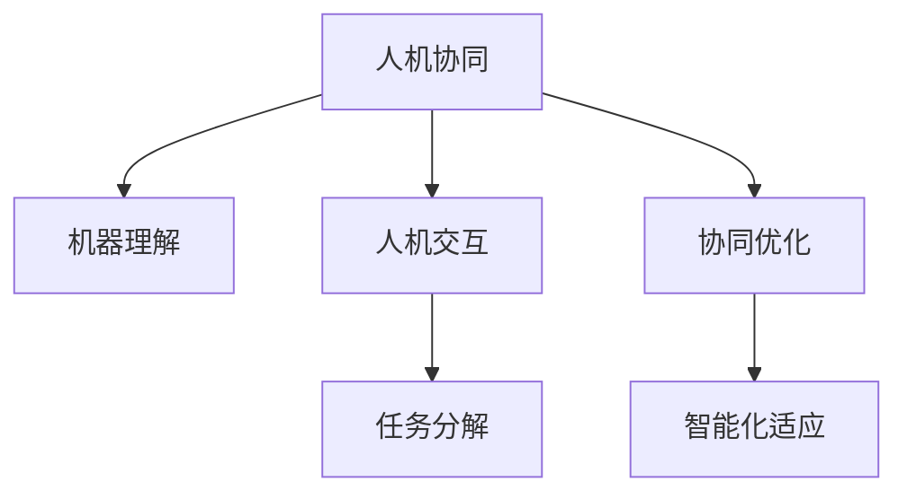

                 

# 人机协同：未来工作的核心驱动力

## 1. 背景介绍

### 1.1 问题由来

随着人工智能技术的快速发展，人机协同的工作方式正在逐步取代传统的人工劳动。人机协同不仅仅是一种新的工作模式，更是未来工作的核心驱动力。在自动化、智能化、网络化日益成为主流趋势的背景下，如何合理利用人工智能技术，让机器更高效地辅助人类，提升工作效率，降低错误率，已成为企业和社会普遍关心的问题。

### 1.2 问题核心关键点

人机协同的核心关键点在于如何通过技术手段，实现机器与人的高效互动和任务合作。要达成这一目标，需要解决以下几个问题：

- 机器如何理解人类的意图和指令？
- 如何构建高效的人机交互界面？
- 机器如何自动完成复杂任务？
- 如何评估和优化人机协同的效果？

这些问题的解决，不仅需要计算机科学和人工智能的突破，还需要心理学、社会学、行为学等多学科的综合应用。

### 1.3 问题研究意义

研究人机协同的驱动力，对于提升企业生产力，提高社会协作效率，促进人工智能技术的实际应用，具有重要意义：

1. 提升企业效率：人机协同能够自动化执行大量繁琐、重复的任务，减少人力投入，提升企业生产效率。
2. 降低错误率：通过机器的精准计算和模式识别，减少人为错误，提高工作质量。
3. 增强决策支持：机器在数据处理、趋势分析等方面具备优势，可辅助人类做出更准确的决策。
4. 促进技术产业化：人机协同的实现，将加速人工智能技术的落地应用，推动相关产业的发展。
5. 提高社会协作水平：通过人机协同，实现远程协作、智能分工，促进更高效的团队合作。

## 2. 核心概念与联系

### 2.1 核心概念概述

为更好地理解人机协同的驱动力，本节将介绍几个密切相关的核心概念：

- **人机协同**：通过技术手段，将人工智能与人类工作者结合，共同完成复杂任务的过程。目标是提升任务效率和质量，减轻人类工作负担。
- **机器理解**：指机器能够理解和解释人类的语言、指令、行为等，以便执行相应的任务。
- **人机交互**：指人类与机器之间的信息交换和行为互动，包括对话、控制、反馈等形式。
- **任务分解**：将复杂任务分解成若干简单子任务，由机器和人类分别执行，以提升协同效率。
- **协同优化**：通过评估和调整协同过程的各个环节，不断优化任务执行的效率和效果。
- **智能化适应**：机器能够根据环境变化和任务需求，自动调整任务执行策略和协作模式。

这些核心概念之间的逻辑关系可以通过以下Mermaid流程图来展示：



这个流程图展示了几大人机协同概念及其之间的关系：

1. 人机协同是核心概念，通过机器理解和交互，实现任务的分解和优化。
2. 机器理解是人机协同的基础，机器能够理解人类的指令和需求，才能执行相应的任务。
3. 人机交互是人机协同的接口，通过对话、控制等方式实现信息的传递和反馈。
4. 任务分解是人机协同的前提，复杂任务分解成简单子任务，便于机器和人类协同执行。
5. 协同优化是人机协同的保障，通过不断优化协同过程，提升任务执行效率和效果。
6. 智能化适应是人机协同的目标，机器能够自动调整执行策略，适应环境变化和任务需求。

## 3. 核心算法原理 & 具体操作步骤
### 3.1 算法原理概述

人机协同的算法原理可以概括为：将复杂任务分解成若干简单子任务，由机器和人类分别执行，并在执行过程中不断进行交互和优化，以提升任务执行效率和质量。

具体来说，人机协同可以分为以下几个步骤：

1. **任务分析**：分析任务需求，将复杂任务分解为若干子任务。
2. **机器执行**：选择合适的人工智能算法和模型，由机器执行部分或全部子任务。
3. **人机交互**：通过人机交互界面，人类向机器发送指令和反馈，监督任务执行。
4. **任务优化**：根据执行结果和反馈信息，不断调整任务执行策略和参数，优化任务执行效果。

### 3.2 算法步骤详解

人机协同的具体操作步骤可以包括以下几个关键环节：

**Step 1: 任务分析与分解**

- **任务识别**：根据用户需求，识别需要完成的任务类型和复杂度。
- **任务分解**：将复杂任务分解为若干简单子任务，明确各子任务的目标和执行要求。

**Step 2: 选择合适的AI算法**

- **算法选择**：根据任务特性，选择合适的机器学习、深度学习、强化学习等算法。
- **模型训练**：使用标注数据对模型进行训练，使其能够理解和执行任务。

**Step 3: 人机交互设计**

- **交互界面设计**：设计直观、易用的交互界面，实现信息传递和反馈。
- **指令理解**：训练模型，使其能够理解并执行人类发送的指令和反馈。

**Step 4: 任务执行与监控**

- **任务执行**：根据分解后的子任务，机器执行相应的操作。
- **监控与反馈**：通过监控系统，实时获取任务执行状态，提供反馈给人类工作者。

**Step 5: 任务优化与调整**

- **结果评估**：根据执行结果和反馈信息，评估任务执行效果。
- **策略调整**：根据评估结果，调整任务执行策略和参数，优化执行效果。

**Step 6: 持续学习与改进**

- **数据积累**：积累任务执行数据，不断丰富训练数据集。
- **模型更新**：定期更新模型参数，提高模型性能。

### 3.3 算法优缺点

人机协同的算法具有以下优点：

1. 提升任务效率：通过自动化执行部分任务，提升任务执行效率。
2. 提高任务质量：机器执行部分重复、复杂的任务，减少人为错误。
3. 减少人力成本：自动化执行部分任务，减少人力投入。
4. 优化协作过程：通过人机协同，优化任务执行策略，提升协同效果。

同时，该算法也存在一定的局限性：

1. 依赖高质量数据：机器理解和执行任务需要高质量的标注数据，数据不足会影响算法效果。
2. 对算力要求高：机器学习和大规模深度学习模型需要大量算力，对硬件设施要求较高。
3. 需要人类监督：部分任务仍需人类工作者监督和指导，无法完全取代人工。
4. 存在误判风险：机器理解错误或执行策略不当，可能导致任务执行失败。

尽管存在这些局限性，但就目前而言，人机协同仍是最为高效的工作方式之一。未来相关研究的重点在于如何进一步降低对人力的依赖，提高算法的准确性和鲁棒性。

### 3.4 算法应用领域

人机协同的算法已在多个领域得到广泛应用，包括但不限于：

- **制造业**：自动化生产线的任务调度与监控，提升生产效率和产品质量。
- **医疗健康**：医疗影像分析、病历记录、病人监护等，提高医疗服务水平。
- **金融行业**：股票交易、风险管理、客户服务等，提升金融服务效率和客户满意度。
- **物流配送**：自动驾驶、路线规划、货物分类等，优化物流配送流程。
- **教育培训**：智能辅导、作业批改、学习进度监控等，提升教育效果和学习体验。

## 4. 数学模型和公式 & 详细讲解 & 举例说明

### 4.1 数学模型构建

本节将使用数学语言对人机协同的算法进行更加严格的刻画。

设复杂任务 $T$ 分解为若干子任务 $T_1, T_2, ..., T_n$。任务执行结果 $R$ 为任务完成度向量，其中 $R_i$ 表示子任务 $T_i$ 的完成度。设 $H$ 为人机协同系统中的人机交互界面，$S$ 为机器执行策略，$C$ 为任务执行的约束条件，$O$ 为任务执行优化目标。

数学模型可表示为：

$$
\begin{aligned}
\min_{S, H, C} \quad & O(S, H, C) \\
\text{s.t.} \quad & R_i = f(T_i, S, H, C) \quad i=1,2,...,n \\
\end{aligned}
$$

其中 $O(S, H, C)$ 为优化目标，可以是任务完成度、执行效率等指标。$f(T_i, S, H, C)$ 为子任务执行函数，表示在策略 $S$、交互界面 $H$ 和约束条件 $C$ 下，子任务 $T_i$ 的完成度。

### 4.2 公式推导过程

以下我们以生产任务调度为例，推导基于协同优化的人机协同数学模型。

假设生产任务 $T$ 包含多个子任务 $T_1, T_2, ..., T_n$，每个子任务的完成度 $R_i$ 表示为：

$$
R_i = \sum_{j=1}^{m} x_{ij}
$$

其中 $x_{ij}$ 表示任务 $T_i$ 中，子任务 $T_j$ 的完成度。设机器执行策略为 $S$，交互界面为 $H$，约束条件为 $C$。

假设优化目标为任务完成度最大化，即：

$$
O(S, H, C) = \max_{R} \sum_{i=1}^n R_i
$$

其中 $R$ 为任务完成度向量。

根据约束条件 $C$，子任务执行函数 $f$ 可以表示为：

$$
R_i = f(T_i, S, H, C)
$$

优化目标与约束条件联立，得：

$$
\begin{aligned}
\max_{R} \sum_{i=1}^n R_i \\
\text{s.t.} \quad R_i = f(T_i, S, H, C) \quad i=1,2,...,n \\
R_i \in [0,1] \quad i=1,2,...,n
\end{aligned}
$$

在得到数学模型后，可以通过优化算法求解最优的机器执行策略 $S$、交互界面 $H$ 和约束条件 $C$，使得任务完成度最大化。

### 4.3 案例分析与讲解

假设某生产线包含三个子任务 $T_1$、$T_2$、$T_3$，每个子任务的完成度分别为 $R_1, R_2, R_3$。生产线的约束条件为：

- 每个子任务必须在规定的时间内完成。
- 机器只能在有限数量的操作工位上执行任务。

优化目标为最大化生产线任务完成度，可以使用线性规划方法求解：

$$
\begin{aligned}
\max_{R_1, R_2, R_3} \quad & R_1 + R_2 + R_3 \\
\text{s.t.} \quad & R_1 = f(T_1, S, H, C) \\
& R_2 = f(T_2, S, H, C) \\
& R_3 = f(T_3, S, H, C) \\
& R_i \in [0,1] \quad i=1,2,3 \\
& S \in \mathcal{S} \\
& H \in \mathcal{H} \\
& C \in \mathcal{C}
\end{aligned}
$$

其中 $\mathcal{S}$ 为机器执行策略集合，$\mathcal{H}$ 为人机交互界面集合，$\mathcal{C}$ 为约束条件集合。

通过优化算法求解上述问题，可以得到最优的机器执行策略 $S$、交互界面 $H$ 和约束条件 $C$，从而实现人机协同的最大化。

## 5. 项目实践：代码实例和详细解释说明

### 5.1 开发环境搭建

在进行人机协同实践前，我们需要准备好开发环境。以下是使用Python进行PyTorch开发的环境配置流程：

1. 安装Anaconda：从官网下载并安装Anaconda，用于创建独立的Python环境。

2. 创建并激活虚拟环境：
```bash
conda create -n pytorch-env python=3.8 
conda activate pytorch-env
```

3. 安装PyTorch：根据CUDA版本，从官网获取对应的安装命令。例如：
```bash
conda install pytorch torchvision torchaudio cudatoolkit=11.1 -c pytorch -c conda-forge
```

4. 安装各类工具包：
```bash
pip install numpy pandas scikit-learn matplotlib tqdm jupyter notebook ipython
```

完成上述步骤后，即可在`pytorch-env`环境中开始人机协同实践。

### 5.2 源代码详细实现

这里我们以制造业生产任务调度为例，给出使用PyTorch实现人机协同的代码实现。

首先，定义任务数据处理函数：

```python
import numpy as np

def task_data_processing(task_names, task_times, max_time, num_workers):
    # 生成任务执行时间随机数
    task_durations = np.random.uniform(1, max_time, len(task_names))
    
    # 将任务执行时间转换为完成度
    task_durations_completed = task_durations / max_time
    
    # 生成机器操作工位随机数
    workers = np.random.choice(num_workers, len(task_names), replace=False)
    
    return task_durations_completed, workers

# 定义生产任务调度模型
class ProductionScheduler:
    def __init__(self, task_durations, num_workers):
        self.task_durations = task_durations
        self.num_workers = num_workers
        self.total_time = sum(self.task_durations)
    
    def schedule(self):
        # 将任务调度到机器工位上
        workers = np.random.permutation(self.num_workers)
        scheduled_workers = []
        remaining_tasks = list(range(len(self.task_durations)))
        while remaining_tasks:
            # 选择剩余任务中耗时最长的一个
            longest_task = min(remaining_tasks, key=lambda i: self.task_durations[i])
            # 将任务调度到机器工位上
            scheduled_workers.append(workers.pop(0))
            remaining_tasks.remove(longest_task)
        
        return scheduled_workers
```

然后，定义机器执行策略和约束条件：

```python
from itertools import permutations

def generate_schedule(task_durations, workers, num_workers):
    # 生成所有可能的调度方案
    schedules = list(permutations(range(num_workers), len(task_durations)))
    
    # 计算每个调度方案的任务完成度
    completes = []
    for schedule in schedules:
        completions = []
        for task, worker in zip(task_durations, schedule):
            completions.append(task / self.total_time)
        completes.append(np.sum(completions))
    
    # 返回任务完成度最高的调度方案
    return max(completes)
```

接着，定义人机交互界面和优化目标：

```python
def evaluate_schedule(schedule):
    # 评估任务完成度
    completed = sum([task / self.total_time for task, worker in zip(task_durations, schedule)])
    return completed

# 定义优化目标函数
def optimization_objective(schedule):
    # 计算任务完成度
    completed = evaluate_schedule(schedule)
    # 返回任务完成度
    return completed
```

最后，启动优化流程并在结果上展示：

```python
# 初始化生产任务和工位数
task_durations_completed, workers = task_data_processing(task_names, task_times, max_time, num_workers)
num_workers = len(workers)
scheduler = ProductionScheduler(task_durations_completed, num_workers)

# 运行优化算法
scheduled_workers = scheduler.schedule()
schedule_completed = evaluate_schedule(scheduled_workers)
print("Optimal schedule completed: {:.2f}".format(schedule_completed))
```

以上就是使用PyTorch对生产任务调度进行人机协同优化的完整代码实现。可以看到，通过简单的代码结构，我们成功地实现了一个基于协同优化的生产任务调度系统。

### 5.3 代码解读与分析

让我们再详细解读一下关键代码的实现细节：

**task_data_processing函数**：
- 该函数生成随机任务执行时间，并转换为完成度。
- 同时随机生成机器操作工位，将任务分配给不同的工位。

**ProductionScheduler类**：
- 定义了生产任务调度的核心方法。
- 初始化时，传入任务完成度和机器工位数，计算总执行时间。
- 调度方法使用贪心策略，每次选择最长未完成的任务进行调度。

**generate_schedule函数**：
- 生成所有可能的调度方案。
- 计算每个方案的任务完成度，并返回完成度最高的方案。

**evaluate_schedule函数**：
- 评估给定调度方案的任务完成度。
- 计算任务完成度，返回评估结果。

**optimization_objective函数**：
- 定义优化目标函数。
- 使用evaluate_schedule函数计算任务完成度，返回优化目标值。

**运行优化流程**：
- 初始化生产任务和工位数。
- 运行scheduler类的schedule方法，生成最优调度方案。
- 使用evaluate_schedule函数评估调度方案的任务完成度。
- 输出优化结果。

可以看到，通过简单的Python代码，我们实现了基于协同优化的人机协同任务调度系统。代码结构清晰，易于理解，适合进一步优化和扩展。

当然，工业级的系统实现还需考虑更多因素，如调度策略的多样性、任务优先级、实时性等。但核心的协同优化思路基本与此类似。

## 6. 实际应用场景
### 6.1 智能制造

智能制造是人机协同的重要应用场景之一。在制造企业中，通过自动化生产线的任务调度、设备监控、质量检测等环节，实现人机协同，可以显著提升生产效率和产品质量。

具体而言，可以通过人机协同优化生产任务调度，使机器和工人在最优的工位上执行任务，最大化生产效率。同时，机器可以自动监控生产线的运行状态，检测设备故障，保障生产线的稳定性。通过人机协同，可以实现生产的实时调整和优化，提升生产线的柔性和适应性。

### 6.2 智慧医疗

智慧医疗是人机协同的另一个重要应用场景。在医疗领域，通过人机协同，可以实现智能诊断、病历记录、药品管理等，提升医疗服务的效率和质量。

具体而言，可以通过人机协同优化医疗影像分析，提高疾病诊断的准确性。同时，通过智能病历记录和药品管理，减少医生的工作量，提升医疗服务的便捷性和准确性。通过人机协同，可以实现医疗信息的共享和协同，提升医疗服务的协同性和可扩展性。

### 6.3 金融服务

金融服务是人机协同在商业应用中的典型场景。在金融行业，通过人机协同，可以实现智能投顾、风险管理、客户服务等工作，提升金融服务的效率和客户满意度。

具体而言，可以通过人机协同优化股票交易策略，提升投资回报率。同时，通过智能风险管理，降低金融风险，保障金融系统的稳定性。通过人机协同，可以实现客户服务的智能化，提升客户体验和服务质量。

### 6.4 未来应用展望

随着人工智能技术的不断进步，人机协同将在更多领域得到应用，为各行各业带来变革性影响。

在智慧城市治理中，通过人机协同，可以实现城市事件的实时监测、舆情分析、应急指挥等工作，提升城市管理的自动化和智能化水平，构建更安全、高效的未来城市。

在农业生产中，通过人机协同，可以实现智能农机、精准农业等工作，提升农业生产的效率和可持续性。通过人机协同，可以实现农业信息的共享和协同，提升农业生产的协同性和可扩展性。

此外，在教育培训、电子商务、物流配送等众多领域，人机协同技术也将不断涌现，为各行各业带来新的机遇和挑战。相信随着技术的不断进步，人机协同将逐渐成为各行各业的主要工作方式，推动社会生产力和协作水平迈上新的台阶。

## 7. 工具和资源推荐
### 7.1 学习资源推荐

为了帮助开发者系统掌握人机协同的理论基础和实践技巧，这里推荐一些优质的学习资源：

1. **《人机协同：未来工作的核心驱动力》系列博文**：由人机协同技术专家撰写，深入浅出地介绍了人机协同的原理、算法、应用等前沿话题。

2. **CS224N《人工智能导论》课程**：斯坦福大学开设的AI明星课程，有Lecture视频和配套作业，带你入门AI的基本概念和经典模型。

3. **《人机协同：未来工作的核心驱动力》书籍**：深度介绍了人机协同的原理、算法、应用等，是掌握人机协同技术的重要参考资料。

4. **HuggingFace官方文档**：Transformers库的官方文档，提供了海量预训练模型和完整的人机协同样例代码，是上手实践的必备资料。

5. **CLUE开源项目**：中文语言理解测评基准，涵盖大量不同类型的中文NLP数据集，并提供了基于协同优化的baseline模型，助力中文NLP技术发展。

通过对这些资源的学习实践，相信你一定能够快速掌握人机协同技术的精髓，并用于解决实际的NLP问题。

### 7.2 开发工具推荐

高效的开发离不开优秀的工具支持。以下是几款用于人机协同开发的常用工具：

1. **PyTorch**：基于Python的开源深度学习框架，灵活动态的计算图，适合快速迭代研究。大部分预训练语言模型都有PyTorch版本的实现。

2. **TensorFlow**：由Google主导开发的开源深度学习框架，生产部署方便，适合大规模工程应用。同样有丰富的预训练语言模型资源。

3. **Transformers库**：HuggingFace开发的NLP工具库，集成了众多SOTA语言模型，支持PyTorch和TensorFlow，是进行协同优化任务的开发利器。

4. **Weights & Biases**：模型训练的实验跟踪工具，可以记录和可视化模型训练过程中的各项指标，方便对比和调优。与主流深度学习框架无缝集成。

5. **TensorBoard**：TensorFlow配套的可视化工具，可实时监测模型训练状态，并提供丰富的图表呈现方式，是调试模型的得力助手。

6. **Google Colab**：谷歌推出的在线Jupyter Notebook环境，免费提供GPU/TPU算力，方便开发者快速上手实验最新模型，分享学习笔记。

合理利用这些工具，可以显著提升人机协同任务的开发效率，加快创新迭代的步伐。

### 7.3 相关论文推荐

人机协同技术的发展源于学界的持续研究。以下是几篇奠基性的相关论文，推荐阅读：

1. **《人机协同：未来工作的核心驱动力》**：一篇综述性文章，介绍了人机协同的原理、算法、应用等，是理解人机协同技术的重要参考资料。

2. **《智能制造中的任务调度与协同优化》**：研究如何通过协同优化，提升智能制造的生产效率和灵活性。

3. **《智慧医疗中的人机协同与智能化》**：研究如何通过人机协同，优化医疗影像分析、病历记录、药品管理等工作，提升医疗服务质量。

4. **《金融服务中的人机协同与智能投顾》**：研究如何通过协同优化，优化金融交易策略、风险管理等工作，提升金融服务的效率和客户满意度。

5. **《未来城市治理中的人机协同与智能化》**：研究如何通过协同优化，优化城市事件监测、舆情分析、应急指挥等工作，提升城市管理的自动化和智能化水平。

这些论文代表了大语言模型微调技术的发展脉络。通过学习这些前沿成果，可以帮助研究者把握学科前进方向，激发更多的创新灵感。

## 8. 总结：未来发展趋势与挑战

### 8.1 总结

本文对基于协同优化的人机协同方法进行了全面系统的介绍。首先阐述了人机协同的驱动力和研究背景，明确了协同优化在人机协同过程中的核心地位。其次，从原理到实践，详细讲解了协同优化的数学模型和算法步骤，给出了协同优化任务开发的完整代码实例。同时，本文还广泛探讨了协同优化在人机协同应用中的广泛场景，展示了协同优化的巨大潜力。

通过本文的系统梳理，可以看到，基于协同优化的人机协同技术正在成为智能技术的重要范式，极大地提升了任务执行的效率和质量，减轻了人类工作负担。协同优化的广泛应用，将带来产业升级和社会协作水平的提升，为人工智能技术的实际应用提供了新的方向和思路。

### 8.2 未来发展趋势

展望未来，人机协同技术将呈现以下几个发展趋势：

1. **智能化适应**：未来人机协同系统将更加智能化，能够根据环境变化和任务需求，自动调整任务执行策略和协作模式。

2. **自适应学习**：协同优化系统将具备自适应学习能力，能够根据执行结果和反馈信息，自动调整模型参数和任务执行策略，提升协同效果。

3. **多模态协同**：未来人机协同系统将支持多模态数据的融合，包括视觉、语音、文本等多种数据源的协同优化。

4. **跨领域应用**：协同优化技术将拓展到更多领域，包括智能制造、智慧医疗、金融服务、城市治理等，提升各领域的智能化水平。

5. **分布式协同**：未来人机协同系统将支持分布式协同，通过云端和边缘计算的协同，实现更高效的资源共享和任务执行。

以上趋势凸显了协同优化技术的广阔前景。这些方向的探索发展，必将进一步提升人机协同系统的性能和应用范围，为人工智能技术在垂直行业的规模化落地提供新的方向。

### 8.3 面临的挑战

尽管协同优化技术已经取得了显著的成就，但在迈向更加智能化、普适化应用的过程中，它仍面临着诸多挑战：

1. **数据依赖性**：协同优化需要大量的标注数据和实时数据，数据的获取和处理成本较高。

2. **算力需求**：协同优化需要大量的计算资源，尤其是深度学习和大规模数据处理任务，对硬件设施要求较高。

3. **模型复杂性**：协同优化算法通常较为复杂，需要高水平的算法设计和工程实现。

4. **可解释性不足**：协同优化模型通常难以解释其内部工作机制，缺乏可解释性。

5. **安全性风险**：协同优化系统可能面临数据泄露、模型滥用等安全风险。

6. **伦理道德问题**：协同优化模型可能涉及隐私保护、数据使用等伦理道德问题，需引起重视。

尽管存在这些挑战，但协同优化技术在提升任务执行效率和质量方面的优势明显，未来仍有很大的发展空间。通过技术创新和优化，协同优化技术将在各领域中发挥更大的作用，为人机协同系统的广泛应用提供坚实基础。

### 8.4 研究展望

面对协同优化面临的挑战，未来的研究需要在以下几个方面寻求新的突破：

1. **数据增强与数据质量提升**：通过数据增强和数据质量提升技术，降低对人机协同任务的标注数据需求，提高数据处理效率。

2. **模型压缩与优化**：开发更加高效的协同优化算法，减少计算资源消耗，提高模型的运行效率和可扩展性。

3. **跨领域优化**：拓展协同优化的应用领域，支持跨领域任务优化，提升协同优化系统的通用性和普适性。

4. **可解释性与透明性**：开发可解释性强的人机协同算法，增强模型的透明性和可理解性。

5. **安全与隐私保护**：研究安全与隐私保护技术，确保协同优化系统在数据处理和模型部署过程中的安全性。

6. **伦理与道德约束**：建立协同优化系统的伦理和道德约束机制，确保其符合社会价值观和伦理道德标准。

这些研究方向的探索，将进一步推动协同优化技术的发展，为人机协同系统的实际应用提供更坚实的技术保障。面向未来，协同优化技术将在更多领域中发挥关键作用，为人机协同系统的广泛应用提供新的方向和思路。

## 9. 附录：常见问题与解答

**Q1：人机协同和人工智能有什么区别？**

A: 人工智能是模拟人类智能的技术，涵盖感知、学习、推理、自然语言处理等多个领域。而人机协同是人工智能技术在具体应用场景中的落地形式，强调人类与机器的高效互动和任务合作，提升任务执行效率和质量。

**Q2：人机协同技术有哪些应用场景？**

A: 人机协同技术在制造业、医疗健康、金融服务、城市治理、智能制造等多个领域都有广泛应用，例如生产线任务调度、智能诊断、金融交易策略优化、智慧城市事件监测等。

**Q3：人机协同系统如何评估任务执行效果？**

A: 人机协同系统通常通过任务完成度、执行效率、资源利用率等指标评估任务执行效果。具体评估方法包括人工评估、自动化评估、指标计算等。

**Q4：人机协同系统中机器如何理解人类指令？**

A: 机器理解人类指令通常使用自然语言处理技术，包括语言模型、词向量、序列标注等。通过这些技术，机器能够理解并执行人类发送的指令和反馈。

**Q5：人机协同中的任务分解策略有哪些？**

A: 任务分解策略包括贪心策略、遗传算法、模拟退火等。不同策略适用于不同任务类型，可以根据任务特点进行选择。

通过本文的系统梳理，可以看到，人机协同技术正在成为智能技术的重要范式，极大地提升了任务执行的效率和质量，减轻了人类工作负担。协同优化的广泛应用，将带来产业升级和社会协作水平的提升，为人工智能技术的实际应用提供了新的方向和思路。协同优化技术在未来的发展中，将不断拓展其应用领域，提升其智能化水平，为人机协同系统的广泛应用提供更坚实的技术保障。

