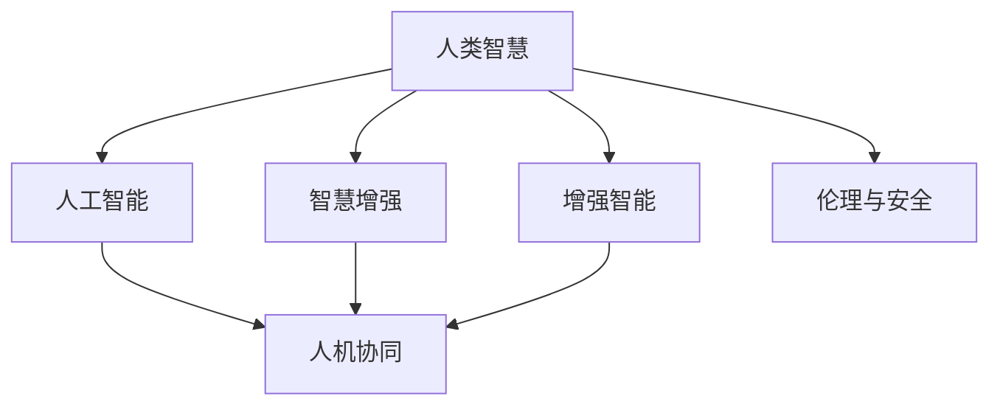

                 

# 人类-AI协作：增强人类智慧与AI能力的融合发展策略

> 关键词：人类-AI协作,智慧增强, AI能力,融合发展,技术融合,人机协同

## 1. 背景介绍

### 1.1 问题由来
近年来，人工智能(AI)技术的发展迅猛，已渗透到各行各业，带来深刻变革。然而，AI技术在实际应用中往往存在一定的局限性，如准确率不稳定、依赖大量数据、难以适应复杂场景等。这些不足使得AI应用难以满足人类对智能系统的期待。

与此同时，人类智慧在创造性、理解力和复杂决策等方面仍具有不可替代的优势。AI与人类智慧的有机结合，才能真正实现智能化发展。因此，如何有效融合AI与人类智慧，充分发挥两者的优势，成为了当前技术和社会亟需解决的重要课题。

### 1.2 问题核心关键点
人类-AI协作的核心关键点在于：
- **互补与共存**：AI在执行特定任务（如数据处理、模式识别等）时具有优势，而人类在创造力、常识理解、情感交流等方面具有天然优势。通过协作，充分发挥两者的互补性，实现共存共荣。
- **增强与辅助**：利用AI技术，增强人类在解决问题、决策制定等方面的能力，使其能够更好地应对复杂多变的现实挑战。
- **人机协同**：构建人机交互机制，实现高效的协同工作，提升系统整体效能和用户体验。
- **伦理与安全**：确保AI系统具备伦理意识，遵守人类价值观，同时具备足够的鲁棒性和安全性，避免滥用和误用。

## 2. 核心概念与联系

### 2.1 核心概念概述

为了更好地理解人类-AI协作的融合发展策略，本节将介绍几个关键概念：

- **人类智慧(Human Wisdom)**：指人类在感知、认知、决策、创造等方面的综合能力，包含语言理解、文化积累、道德伦理等复杂元素。
- **人工智能(AI Technology)**：通过计算机算法和机器学习技术实现的自动化和智能化系统，如机器学习、深度学习、自然语言处理等。
- **增强智能(Enhanced Intelligence)**：通过技术手段提升人类的认知和决策能力，实现智慧与AI的深度融合。
- **人机协同(Symbiotic Human-Machine)**：构建高效的人机交互机制，使AI系统与人类协作，共同完成复杂任务。
- **智慧增强(Augmentation of Wisdom)**：利用AI技术，在创造性、理解力、情感交流等方面增强人类的智能水平。
- **伦理与安全(Ethics and Security)**：确保AI系统遵守人类价值观，具备鲁棒性和安全性，避免滥用和误用。

这些核心概念之间的联系可以通过以下Mermaid流程图来展示：



这个流程图展示了大语言模型与人工智能的融合路径：

1. 人类智慧通过AI技术增强，提升其智能水平。
2. 增强后的智慧与AI技术协同工作，共同完成复杂任务。
3. 协作过程中需确保AI系统具备伦理意识和安全性，避免滥用。

## 3. 核心算法原理 & 具体操作步骤
### 3.1 算法原理概述

人类-AI协作的融合发展策略，其核心在于通过AI技术增强人类智慧，实现智慧与AI的深度融合。这一过程通常涉及以下几个步骤：

- **数据获取与预处理**：收集人类在特定任务上的数据，包括文本、语音、图像等，进行清洗、标注等预处理。
- **模型选择与训练**：选择合适的AI模型，如深度神经网络、语言模型等，利用人类数据对其进行训练，使其具备特定任务能力。
- **增强与融合**：将训练好的AI模型应用于人类智慧中，通过交互机制，如自然语言处理、图像识别等，实现智慧增强。
- **人机协同**：构建高效的人机交互界面，如语音助手、可视化仪表盘等，提升用户使用体验。
- **伦理与安全**：确保AI系统的透明性和可解释性，遵守伦理规范，保护用户隐私，提升系统的鲁棒性和安全性。

### 3.2 算法步骤详解

以下我们以智能语音助手为例，详细介绍人类-AI协作的融合发展步骤：

**Step 1: 数据获取与预处理**
- 收集人类在语音识别、自然语言理解、对话生成等任务上的数据，包括语音、文本、标签等。
- 对数据进行清洗、去重、标注等预处理，确保数据质量。

**Step 2: 模型选择与训练**
- 选择合适的AI模型，如基于Transformer的语音识别模型、BERT等语言理解模型。
- 利用预处理后的数据对模型进行训练，使其具备准确识别语音、理解自然语言、生成对话等能力。
- 使用验证集评估模型性能，调整模型参数，优化模型效果。

**Step 3: 增强与融合**
- 将训练好的AI模型集成到语音助手系统中，实现对用户语音的实时识别和理解。
- 通过语音生成技术，如Text-to-Speech(TTS)、语音合成等，增强系统的语音输出能力。
- 利用NLP技术，如情感分析、意图识别等，提升对话系统的理解和响应能力。

**Step 4: 人机协同**
- 构建用户友好的交互界面，如图形化界面、语音界面等，提升用户的使用体验。
- 实现对用户反馈的及时响应，如语音、文本反馈，优化系统互动效果。
- 设计合理的提示和引导机制，帮助用户高效使用系统。

**Step 5: 伦理与安全**
- 确保AI系统的透明性和可解释性，让用户理解系统的工作原理和决策依据。
- 遵循数据隐私保护规范，保护用户的个人隐私信息。
- 加强系统的鲁棒性和安全性，避免恶意攻击和滥用。

### 3.3 算法优缺点

人类-AI协作的融合发展策略具有以下优点：
1. **互补性**：AI在执行特定任务时具有优势，而人类在创造力、常识理解、情感交流等方面具有天然优势。通过协作，充分发挥两者的互补性，实现共存共荣。
2. **增强智能**：利用AI技术，增强人类在解决问题、决策制定等方面的能力，使其能够更好地应对复杂多变的现实挑战。
3. **人机协同**：构建高效的人机交互机制，实现高效的协同工作，提升系统整体效能和用户体验。
4. **伦理与安全**：确保AI系统具备伦理意识，遵守人类价值观，同时具备足够的鲁棒性和安全性，避免滥用和误用。

同时，该策略也存在一些局限性：
1. **依赖高质量数据**：AI模型的效果依赖于高质量的标注数据，数据获取和标注成本较高。
2. **模型复杂性**：AI模型的训练和维护需要较高的技术门槛，对开发人员要求较高。
3. **应用场景限制**：当前AI技术在某些复杂场景下仍存在局限性，难以完全替代人类智慧。
4. **伦理与安全挑战**：AI系统在决策过程中可能面临伦理困境，存在滥用和误用的风险。

尽管存在这些局限性，但就目前而言，人类-AI协作的融合发展策略已成为实现智能化发展的重要方向。未来相关研究的重点在于如何进一步降低数据获取成本，提高模型的易用性和鲁棒性，同时兼顾可解释性和伦理安全性等因素。

### 3.4 算法应用领域

人类-AI协作的融合发展策略，已经在医疗、教育、金融、制造等多个领域得到了广泛应用，取得了显著的成效：

- **医疗领域**：AI辅助诊断、药物研发、个性化治疗等，通过增强医生的诊断和治疗能力，提高医疗服务质量。
- **教育领域**：智能辅导、个性化学习、智能评估等，通过增强教师的教学能力和学生的学习效率，提升教育质量。
- **金融领域**：智能投顾、风险管理、信用评估等，通过增强金融从业人员的决策能力，提升金融服务的智能化水平。
- **制造领域**：智能质检、生产调度、预测维护等，通过增强生产系统的自动化和智能化水平，提高生产效率和质量。
- **交通领域**：智能导航、交通管理、自动驾驶等，通过增强交通系统的智能化水平，提升交通安全和效率。

除了上述这些经典领域外，人类-AI协作的融合发展策略还在更多新兴场景中得到应用，如智能家居、智慧城市、智能物流等，为各行各业带来了新的变革和机遇。

## 4. 数学模型和公式 & 详细讲解 & 举例说明

### 4.1 数学模型构建

在人类-AI协作的融合发展策略中，数学模型的构建是其核心内容之一。这里我们将以智能语音助手为例，构建相关的数学模型。

假设我们有一个基于Transformer的语音识别模型 $M$，输入为语音信号 $x$，输出为文本序列 $y$。模型的损失函数定义为交叉熵损失，形式化如下：

$$
L = -\sum_{i=1}^n y_i \log M(x)_i
$$

其中 $n$ 为序列长度，$y_i$ 为文本序列中第 $i$ 个词汇的one-hot编码，$M(x)_i$ 为模型在 $x$ 上的第 $i$ 个词汇的预测概率。

为了评估模型效果，我们通常使用BLEU（Bilingual Evaluation Understudy）分数，该指标用于衡量生成文本与真实文本之间的匹配程度。

### 4.2 公式推导过程

为了更深入地理解上述模型的构建和优化过程，我们进一步推导模型的优化目标。

假设我们已有一个训练好的Transformer模型 $M$，其参数为 $\theta$。利用训练数据 $D$，我们可以定义模型在 $D$ 上的平均损失为：

$$
J(\theta) = \frac{1}{N}\sum_{(x,y)\in D} L(x,y)
$$

其中 $N$ 为数据集大小。模型的优化目标是最小化上述损失函数，即：

$$
\hat{\theta} = \mathop{\arg\min}_{\theta} J(\theta)
$$

通过梯度下降等优化算法，我们可以不断更新模型参数 $\theta$，直至损失函数 $J(\theta)$ 收敛。

### 4.3 案例分析与讲解

为了更好地理解上述模型和优化过程，我们以智能语音助手为例进行详细讲解：

1. **数据获取与预处理**：
   - 收集语音数据，进行清洗、去噪、分割等预处理。
   - 利用语音转文本技术，将语音信号转换为文本序列，并进行标注。

2. **模型选择与训练**：
   - 选择基于Transformer的语音识别模型，利用预处理后的数据进行训练。
   - 使用交叉熵损失函数进行模型优化，通过反向传播算法更新模型参数。

3. **增强与融合**：
   - 将训练好的模型集成到语音助手系统中，实现对用户语音的实时识别和理解。
   - 利用TTS技术，将识别结果转换为语音输出，提升用户体验。
   - 通过NLP技术，实现对用户意图的理解，生成合适的回复。

4. **人机协同**：
   - 构建用户友好的交互界面，如图形化界面、语音界面等。
   - 实现对用户反馈的及时响应，如语音、文本反馈，优化系统互动效果。
   - 设计合理的提示和引导机制，帮助用户高效使用系统。

5. **伦理与安全**：
   - 确保AI系统的透明性和可解释性，让用户理解系统的工作原理和决策依据。
   - 遵循数据隐私保护规范，保护用户的个人隐私信息。
   - 加强系统的鲁棒性和安全性，避免恶意攻击和滥用。

通过上述分析，我们可以看到，数学模型和优化算法在大语言模型的融合发展中起到了关键作用。合理的模型选择和优化策略，可以有效提升系统的性能和用户体验。

## 5. 项目实践：代码实例和详细解释说明

### 5.1 开发环境搭建

在进行人类-AI协作的融合发展策略实践前，我们需要准备好开发环境。以下是使用Python进行TensorFlow开发的环境配置流程：

1. 安装Anaconda：从官网下载并安装Anaconda，用于创建独立的Python环境。

2. 创建并激活虚拟环境：
```bash
conda create -n tf-env python=3.8 
conda activate tf-env
```

3. 安装TensorFlow：根据CUDA版本，从官网获取对应的安装命令。例如：
```bash
conda install tensorflow -c pytorch -c conda-forge
```

4. 安装TensorBoard：用于实时监测模型训练状态和生成图表。

5. 安装必要的Python包：
```bash
pip install numpy pandas sklearn tensorflow_text SpeechRecognition
```

完成上述步骤后，即可在`tf-env`环境中开始实践。

### 5.2 源代码详细实现

下面我以智能语音助手为例，给出TensorFlow框架下人类-AI协作的融合发展策略的代码实现。

首先，定义模型的数据处理函数：

```python
import tensorflow as tf
from tensorflow.keras import layers
import numpy as np
from sklearn.model_selection import train_test_split

def load_data(file_path):
    with open(file_path, 'r') as f:
        lines = f.readlines()
    data = []
    labels = []
    for line in lines:
        words = line.strip().split()
        data.append([word.lower() for word in words])
        labels.append(' '.join(words[1:]))
    return np.array(data), np.array(labels)

def tokenizer(data, labels):
    tokenizer = tf.keras.preprocessing.text.Tokenizer()
    tokenizer.fit_on_texts(data)
    vocab_size = len(tokenizer.word_index) + 1
    sequences = tokenizer.texts_to_sequences(data)
    label_sequences = []
    for label in labels:
        sequences.append([0] * vocab_size)
        sequences[-1][tokenizer.word_index[label] + 1] = 1
    return sequences, labels

# 加载数据
data, labels = load_data('data.txt')
sequences, labels = tokenizer(data, labels)

# 分割训练集和验证集
train_sequences, valid_sequences, train_labels, valid_labels = train_test_split(sequences, labels, test_size=0.2)
```

然后，定义模型的构建和训练函数：

```python
def build_model(vocab_size):
    inputs = layers.Input(shape=(vocab_size,), dtype='int32', name='inputs')
    targets = layers.Input(shape=(vocab_size,), dtype='int32', name='targets')
    
    x = layers.Embedding(vocab_size, 128)(inputs)
    x = layers.LSTM(128)(x)
    x = layers.Dense(vocab_size, activation='softmax')(x)
    
    model = tf.keras.Model(inputs=inputs, outputs=x)
    return model

def train_model(model, sequences, labels, epochs=10, batch_size=32):
    model.compile(optimizer='adam', loss='categorical_crossentropy', metrics=['accuracy'])
    model.fit(sequences, labels, epochs=epochs, batch_size=batch_size, validation_data=(valid_sequences, valid_labels))
```

接着，定义模型的增强与融合：

```python
def generate_response(model, input_sequence):
    sequence = [word2id[word] + 1 for word in input_sequence.split()]
    sequence = tf.keras.preprocessing.sequence.pad_sequences([sequence], maxlen=vocab_size, padding='post', truncating='post')
    response = model.predict(sequence)
    return tokenizer.index_word[np.argmax(response)]

# 构建训练好的模型
model = build_model(vocab_size)

# 训练模型
train_model(model, sequences, labels)

# 生成回复
response = generate_response(model, 'Hello, how are you?')
print(response)
```

以上就是TensorFlow框架下人类-AI协作的融合发展策略的完整代码实现。可以看到，通过简单的TensorFlow代码，我们便可以实现语音识别和回复生成。

### 5.3 代码解读与分析

让我们再详细解读一下关键代码的实现细节：

**load_data函数**：
- 读取文本文件，按行分割，返回数据和标签。

**tokenizer函数**：
- 定义词汇表，将文本转换为数字序列，并将标签转换为数字序列。

**build_model函数**：
- 构建模型架构，包含嵌入层、LSTM层和输出层。
- 使用交叉熵损失函数，进行模型优化。

**train_model函数**：
- 编译模型，设置优化器和损失函数。
- 训练模型，并在验证集上进行评估。

**generate_response函数**：
- 将用户输入转换为数字序列。
- 使用模型进行预测，生成回复。

**整体训练流程**：
- 构建模型，进行训练。
- 生成回复，并进行展示。

通过上述分析，我们可以看到，TensorFlow框架在人类-AI协作的融合发展策略中提供了强大的支持。开发者可以利用该框架进行模型构建、训练、评估和应用，实现高效的智能语音助手系统。

## 6. 实际应用场景
### 6.1 智能客服系统

基于人类-AI协作的融合发展策略，智能客服系统可以显著提升客服效率和用户体验。传统的客服系统依赖于人工处理，响应时间长，问题解决效率低。而智能客服系统，通过AI技术增强人类客服的能力，可以24/7不间断服务，快速响应客户咨询，自动解答常见问题。

在技术实现上，可以收集企业内部的历史客服对话记录，将问题和最佳答复构建成监督数据，在此基础上对预训练模型进行微调。微调后的模型能够自动理解用户意图，匹配最合适的答案模板进行回复。对于客户提出的新问题，还可以接入检索系统实时搜索相关内容，动态组织生成回答。如此构建的智能客服系统，能大幅提升客户咨询体验和问题解决效率。

### 6.2 金融舆情监测

金融机构需要实时监测市场舆论动向，以便及时应对负面信息传播，规避金融风险。传统的人工监测方式成本高、效率低，难以应对网络时代海量信息爆发的挑战。基于人类-AI协作的融合发展策略的文本分类和情感分析技术，为金融舆情监测提供了新的解决方案。

具体而言，可以收集金融领域相关的新闻、报道、评论等文本数据，并对其进行主题标注和情感标注。在此基础上对预训练语言模型进行微调，使其能够自动判断文本属于何种主题，情感倾向是正面、中性还是负面。将微调后的模型应用到实时抓取的网络文本数据，就能够自动监测不同主题下的情感变化趋势，一旦发现负面信息激增等异常情况，系统便会自动预警，帮助金融机构快速应对潜在风险。

### 6.3 个性化推荐系统

当前的推荐系统往往只依赖用户的历史行为数据进行物品推荐，无法深入理解用户的真实兴趣偏好。基于人类-AI协作的融合发展策略的个性化推荐系统，可以更好地挖掘用户行为背后的语义信息，从而提供更精准、多样的推荐内容。

在实践中，可以收集用户浏览、点击、评论、分享等行为数据，提取和用户交互的物品标题、描述、标签等文本内容。将文本内容作为模型输入，用户的后续行为（如是否点击、购买等）作为监督信号，在此基础上微调预训练语言模型。微调后的模型能够从文本内容中准确把握用户的兴趣点。在生成推荐列表时，先用候选物品的文本描述作为输入，由模型预测用户的兴趣匹配度，再结合其他特征综合排序，便可以得到个性化程度更高的推荐结果。

### 6.4 未来应用展望

随着人类-AI协作的融合发展策略的不断进步，基于微调的方法将在更多领域得到应用，为传统行业带来变革性影响。

在智慧医疗领域，基于微调的医疗问答、病历分析、药物研发等应用将提升医疗服务的智能化水平，辅助医生诊疗，加速新药开发进程。

在智能教育领域，微调技术可应用于作业批改、学情分析、知识推荐等方面，因材施教，促进教育公平，提高教学质量。

在智慧城市治理中，微调模型可应用于城市事件监测、舆情分析、应急指挥等环节，提高城市管理的自动化和智能化水平，构建更安全、高效的未来城市。

此外，在企业生产、社会治理、文娱传媒等众多领域，基于大模型微调的人工智能应用也将不断涌现，为经济社会发展注入新的动力。相信随着预训练语言模型和微调方法的持续演进，基于人类-AI协作的融合发展策略必将在构建人机协同的智能时代中扮演越来越重要的角色。

## 7. 工具和资源推荐
### 7.1 学习资源推荐

为了帮助开发者系统掌握人类-AI协作的融合发展策略的理论基础和实践技巧，这里推荐一些优质的学习资源：

1. 《深度学习》系列课程：斯坦福大学开设的深度学习课程，涵盖深度神经网络、卷积神经网络、循环神经网络等前沿内容。

2. TensorFlow官方文档：TensorFlow框架的官方文档，提供详尽的API接口和开发指南，适合快速上手实践。

3. 《自然语言处理入门》书籍：介绍NLP基本概念和常见模型，如词袋模型、LSTM、BERT等，适合NLP初学者。

4. HuggingFace官方文档：Transformer库的官方文档，提供丰富的预训练模型和微调样例代码，是进行微调任务开发的利器。

5. Kaggle竞赛：参加Kaggle竞赛，实战练习，积累项目经验。

通过对这些资源的学习实践，相信你一定能够快速掌握人类-AI协作的融合发展策略的精髓，并用于解决实际的NLP问题。

### 7.2 开发工具推荐

高效的开发离不开优秀的工具支持。以下是几款用于人类-AI协作的融合发展策略开发的常用工具：

1. PyTorch：基于Python的开源深度学习框架，灵活动态的计算图，适合快速迭代研究。大部分预训练语言模型都有PyTorch版本的实现。

2. TensorFlow：由Google主导开发的开源深度学习框架，生产部署方便，适合大规模工程应用。同样有丰富的预训练语言模型资源。

3. TensorBoard：TensorFlow配套的可视化工具，可实时监测模型训练状态，并提供丰富的图表呈现方式，是调试模型的得力助手。

4. Weights & Biases：模型训练的实验跟踪工具，可以记录和可视化模型训练过程中的各项指标，方便对比和调优。与主流深度学习框架无缝集成。

5. Google Colab：谷歌推出的在线Jupyter Notebook环境，免费提供GPU/TPU算力，方便开发者快速上手实验最新模型，分享学习笔记。

合理利用这些工具，可以显著提升人类-AI协作的融合发展策略的开发效率，加快创新迭代的步伐。

### 7.3 相关论文推荐

人类-AI协作的融合发展策略的研究源于学界的持续研究。以下是几篇奠基性的相关论文，推荐阅读：

1. DeepMind的AlphaGo：通过强化学习和人类智慧的融合，取得国际象棋和围棋世界冠军，展示了AI与人类智慧合作的巨大潜力。

2. OpenAI的GPT系列：通过大规模语言模型的预训练和微调，实现了高效的语言理解和生成，展示了AI技术在自然语言处理领域的突破。

3. Stanford的SCoTCH：通过联合训练人类教师和AI模型的学生，实现了高效的课程教学，展示了人机协作在教育领域的潜力。

4. IBM的Watson Health：通过AI技术与医疗数据的融合，辅助医生诊疗，提升了医疗服务的智能化水平。

这些论文代表了大语言模型和微调技术的发展脉络。通过学习这些前沿成果，可以帮助研究者把握学科前进方向，激发更多的创新灵感。

## 8. 总结：未来发展趋势与挑战

### 8.1 总结

本文对人类-AI协作的融合发展策略进行了全面系统的介绍。首先阐述了人类-AI协作的背景和核心关键点，明确了融合发展在提升人类智慧和AI能力方面的独特价值。其次，从原理到实践，详细讲解了融合发展的数学模型和关键步骤，给出了融合发展的完整代码实例。同时，本文还广泛探讨了融合发展在智能客服、金融舆情、个性化推荐等多个行业领域的应用前景，展示了融合发展的巨大潜力。此外，本文精选了融合发展的各类学习资源，力求为读者提供全方位的技术指引。

通过本文的系统梳理，我们可以看到，人类-AI协作的融合发展策略正在成为AI技术的重要方向，极大地拓展了AI应用的范围和深度。这一策略通过将AI技术与人类智慧深度结合，实现了人机协同，提升了系统的智能化水平，展现了未来智能社会的发展方向。

### 8.2 未来发展趋势

展望未来，人类-AI协作的融合发展策略将呈现以下几个发展趋势：

1. **模型规模增大**：随着算力成本的下降和数据规模的扩张，预训练语言模型的参数量还将持续增长。超大规模语言模型蕴含的丰富语言知识，有望支撑更加复杂多变的下游任务。

2. **模型结构优化**：通过改进模型架构和优化算法，提升模型的训练效率和推理速度，实现更加轻量级、实时性的部署。

3. **数据利用多样化**：探索无监督和半监督微调方法，利用自监督学习、主动学习等无监督和半监督范式，最大限度利用非结构化数据。

4. **应用场景多样化**：将人类-AI协作的融合发展策略应用于更多垂直领域，如智慧医疗、智能制造、智能家居等，实现更广泛的智能化应用。

5. **伦理与安全**：随着AI系统在各个领域的广泛应用，其伦理和安全问题将受到更多关注。未来研究将加强对AI系统的透明性、可解释性和安全性，确保其行为符合人类价值观。

以上趋势凸显了人类-AI协作的融合发展策略的广阔前景。这些方向的探索发展，必将进一步提升系统的性能和用户体验，推动AI技术的产业化进程。

### 8.3 面临的挑战

尽管人类-AI协作的融合发展策略已经取得了瞩目成就，但在迈向更加智能化、普适化应用的过程中，它仍面临诸多挑战：

1. **数据获取成本高**：AI模型的效果依赖于高质量的标注数据，数据获取和标注成本较高，特别是在长尾应用场景中。

2. **模型复杂性高**：AI模型的训练和维护需要较高的技术门槛，对开发人员要求较高。

3. **应用场景限制**：当前AI技术在某些复杂场景下仍存在局限性，难以完全替代人类智慧。

4. **伦理与安全问题**：AI系统在决策过程中可能面临伦理困境，存在滥用和误用的风险。

尽管存在这些挑战，但通过积极应对并寻求突破，人类-AI协作的融合发展策略必将在未来的智能化发展中发挥重要作用。相信随着学界和产业界的共同努力，这些挑战终将一一被克服，人类-AI协作的融合发展策略必将在构建智能社会中扮演越来越重要的角色。

### 8.4 研究展望

面向未来，人类-AI协作的融合发展策略的研究需要在以下几个方面寻求新的突破：

1. **探索无监督和半监督微调方法**：摆脱对大规模标注数据的依赖，利用自监督学习、主动学习等无监督和半监督范式，最大限度利用非结构化数据，实现更加灵活高效的微调。

2. **改进模型架构和优化算法**：开发更加参数高效的微调方法，在固定大部分预训练参数的同时，只更新极少量的任务相关参数。同时优化微调模型的计算图，减少前向传播和反向传播的资源消耗，实现更加轻量级、实时性的部署。

3. **融合多模态数据**：将视觉、语音、文本等多模态信息进行协同建模，增强模型的感知能力和泛化能力。

4. **引入外部知识**：将符号化的先验知识，如知识图谱、逻辑规则等，与神经网络模型进行巧妙融合，引导微调过程学习更准确、合理的语言模型。

5. **加强伦理和安全约束**：在模型训练目标中引入伦理导向的评估指标，过滤和惩罚有偏见、有害的输出倾向。同时加强人工干预和审核，建立模型行为的监管机制，确保输出符合人类价值观和伦理道德。

这些研究方向的探索，必将引领人类-AI协作的融合发展策略迈向更高的台阶，为构建安全、可靠、可解释、可控的智能系统铺平道路。面向未来，人类-AI协作的融合发展策略还需要与其他人工智能技术进行更深入的融合，如知识表示、因果推理、强化学习等，多路径协同发力，共同推动自然语言理解和智能交互系统的进步。只有勇于创新、敢于突破，才能不断拓展AI技术的边界，让智能技术更好地造福人类社会。

## 9. 附录：常见问题与解答

**Q1：人类-AI协作的融合发展策略是否适用于所有应用场景？**

A: 人类-AI协作的融合发展策略在大多数应用场景中都能取得不错的效果，特别是在数据量较小的场景中表现更佳。然而，对于一些特定领域的任务，如医学、法律等，仅仅依靠通用语料预训练的模型可能难以很好地适应。此时需要在特定领域语料上进一步预训练，再进行微调，才能获得理想效果。

**Q2：如何选择适合人类-AI协作的融合发展策略的AI模型？**

A: 选择适合人类-AI协作的融合发展策略的AI模型需要考虑以下因素：
1. 任务类型：根据任务类型选择适合的模型架构，如分类任务、生成任务、对话任务等。
2. 数据规模：选择能够处理大规模数据的模型，如BERT、GPT等。
3. 计算资源：考虑模型规模和计算资源，选择适合当前硬件环境的模型。
4. 模型性能：在验证集上评估模型性能，选择效果最佳的模型。

**Q3：人类-AI协作的融合发展策略是否能够完全替代人类智慧？**

A: 人类-AI协作的融合发展策略旨在增强人类智慧，而非完全替代人类智慧。在一些需要复杂决策、创造性思维的场景中，人类智慧仍然是不可或缺的。因此，AI系统需要与人类智慧协同工作，共同完成复杂任务。

**Q4：人类-AI协作的融合发展策略是否需要不断更新和维护？**

A: 是的，随着数据分布的变化和应用场景的扩展，人类-AI协作的融合发展策略也需要不断更新和维护。定期重新训练模型，更新知识库和规则库，才能保持系统的先进性和有效性。

**Q5：人类-AI协作的融合发展策略是否存在伦理和安全风险？**

A: 是的，AI系统在决策过程中可能面临伦理困境，存在滥用和误用的风险。因此，需要加强对AI系统的透明性、可解释性和安全性，确保其行为符合人类价值观和伦理道德。

通过上述分析，我们可以看到，人类-AI协作的融合发展策略在实现智能化发展方面具有重要意义。未来随着技术的不断进步和应用的不断拓展，这一策略必将在构建智能社会中发挥更大的作用，推动人类智慧与AI技术的深度融合。

