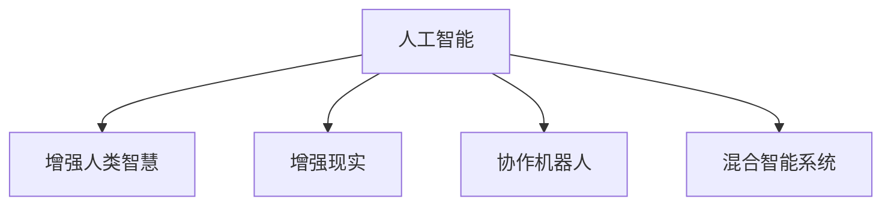

                 

# 人类-AI协作：增强人类智慧与AI能力的融合发展趋势与展望

> 关键词：人类-AI协作, 增强人类智慧, 人工智能, AI能力, 融合发展, 技术趋势, 应用展望

## 1. 背景介绍

### 1.1 问题由来
人类社会的每一次重大变革，都伴随着科技进步的推动。从农业革命到工业革命，再到信息革命，科技的进步始终是推动人类社会向前发展的核心动力。而人工智能（AI）作为新一轮科技革命的代表，正在重塑我们的生产、生活和工作方式。

AI技术经历了从弱人工智能到强人工智能的发展过程，从早期的专家系统、机器学习到现在的深度学习、生成对抗网络、自监督学习等，AI技术不断突破，呈现出爆炸式增长的态势。然而，AI的快速发展也带来了诸多伦理、安全和社会问题，人类与AI的关系也在不断演进。

人类-AI协作（Human-AI Collaboration），作为当前AI研究的新范式，正逐渐成为主流。通过增强人类智慧与AI能力的融合发展，我们可以充分发挥人类与AI各自的优点，实现协同工作，提升工作效率，提高决策质量，降低风险成本，构建更加智能、高效、安全的未来社会。

### 1.2 问题核心关键点
人类-AI协作的核心在于如何平衡人类与AI的关系，充分利用各自优势，发挥最大协同效用。具体而言，包括以下几个关键点：

1. **AI增强人类能力**：通过AI辅助决策、自动化处理、实时数据分析等，提升人类在信息获取、问题解决等方面的效率和能力。
2. **人类监督与控制**：确保AI行为的正确性、安全性和合规性，避免AI偏离人类价值观和伦理道德。
3. **互利共赢的合作**：构建公平、透明、可信的合作机制，使人类和AI在各自的领域内实现互补，达到双赢。
4. **持续优化与适应**：动态调整AI系统的功能和行为，使其能够适应不断变化的复杂环境。
5. **数据与算法的伦理**：确保数据采集、处理和使用的透明、公平、公正，避免算法偏见和歧视。

这些关键点共同构成了人类-AI协作的研究框架，为未来的技术发展提供了方向指引。

## 2. 核心概念与联系

### 2.1 核心概念概述

为更好地理解人类-AI协作，本节将介绍几个密切相关的核心概念：

- **人工智能（AI）**：通过算法、数据、计算等手段，使计算机系统具有模拟人类智能的行为和决策能力，包括感知、学习、推理、规划、语言理解等。
- **增强人类智慧（augmented human intelligence）**：指通过AI技术，增强人类在信息获取、知识积累、问题解决等方面的智慧和能力。
- **增强现实（AR）**：通过AR技术，将虚拟信息与现实世界融合，提升人类对环境的感知和交互能力。
- **协作机器人（Collaborative Robots, Cobot）**：指能够与人类协作完成任务的机器人，如工业协作机器人、服务机器人等。
- **混合智能系统（Hybrid Intelligence Systems）**：将人类智慧与AI能力融合，实现人机协同工作，提升系统整体的智能化水平。

这些核心概念之间的逻辑关系可以通过以下Mermaid流程图来展示：



这个流程图展示了大语言模型的核心概念及其之间的关系：

1. 人工智能通过算法、数据、计算等手段，使计算机系统具备智能行为。
2. 增强人类智慧利用AI技术，提升人类在信息获取、问题解决等方面的能力。
3. 增强现实将虚拟信息与现实世界融合，增强人类对环境的感知和交互能力。
4. 协作机器人与人类协同完成任务，实现人机协作。
5. 混合智能系统将人类智慧与AI能力融合，构建人机协同系统。

这些概念共同构成了人类-AI协作的研究框架，为未来的技术发展提供了方向指引。

## 3. 核心算法原理 & 具体操作步骤
### 3.1 算法原理概述

人类-AI协作的核心在于如何实现AI对人类智慧的增强。具体而言，可以借助以下几种核心算法和策略：

1. **强化学习（Reinforcement Learning, RL）**：通过奖励机制，训练AI系统在特定任务中的决策能力，使其能够自主优化行为。
2. **自然语言处理（Natural Language Processing, NLP）**：使AI具备理解和生成自然语言的能力，能够与人类进行语言交互。
3. **计算机视觉（Computer Vision, CV）**：使AI能够理解和处理图像、视频等视觉信息，实现视觉感知与理解。
4. **智能推荐系统（Recommendation Systems）**：利用AI技术，为人类提供个性化的信息和服务推荐。
5. **协同过滤算法（Collaborative Filtering）**：通过分析用户行为，发现相似用户或物品，实现精准推荐。

这些算法和策略相互配合，可以实现人类-AI协作的多种应用场景，提升人类的工作效率和生活质量。

### 3.2 算法步骤详解

人类-AI协作的具体实施步骤可以分为以下几个关键环节：

**Step 1: 数据准备与模型训练**
- 收集和标注大量训练数据，包括结构化数据、半结构化数据、非结构化数据等。
- 选择合适的算法和模型，如深度学习、强化学习等，进行模型训练和优化。

**Step 2: 模型部署与监控**
- 将训练好的模型部署到生产环境，进行实际业务应用。
- 实时监控模型性能，收集反馈数据，动态调整模型参数，优化模型效果。

**Step 3: 人机交互与反馈**
- 设计用户友好的交互界面，使AI能够与人类进行高效、自然的交互。
- 收集人类用户的反馈数据，用于评估模型效果和改进AI行为。

**Step 4: 持续优化与适应**
- 根据新数据和反馈，持续优化AI模型和交互界面，适应新的业务需求和变化。
- 动态调整协作机制，确保人类与AI的协同效用最大化。

### 3.3 算法优缺点

人类-AI协作具有以下优点：
1. 提高效率：通过AI辅助决策和自动化处理，显著提升人类在信息获取、问题解决等方面的效率。
2. 降低成本：减少人工干预，降低人力成本和时间成本，提高生产效率。
3. 增强决策质量：利用AI的大数据和算法优势，提升决策的科学性和准确性。
4. 降低风险：通过AI监控和异常检测，降低人为错误和风险，提高系统可靠性。

然而，人类-AI协作也存在以下局限性：
1. 伦理问题：AI的决策和行为可能引发伦理争议，如何确保AI的伦理合规性是一大挑战。
2. 数据隐私：AI系统的训练和应用需要大量数据，如何保护数据隐私和安全是一个重要问题。
3. 技术风险：AI系统可能出现错误或失效，如何构建鲁棒、安全的系统是一个难题。
4. 人机交互：AI的决策可能不符合人类期望，如何设计有效的交互界面和反馈机制，实现人机协同，需要深入研究。

### 3.4 算法应用领域

人类-AI协作在多个领域具有广泛的应用前景，包括但不限于以下几方面：

- **智能制造**：通过协作机器人、自动化生产线等，提升生产效率和产品质量，降低生产成本。
- **医疗健康**：利用AI辅助诊断、个性化治疗方案推荐等，提高医疗服务质量，降低医疗风险。
- **金融服务**：通过AI智能投顾、风险评估、欺诈检测等，提升金融服务效率，降低风险损失。
- **教育培训**：利用AI进行智能推荐、个性化学习计划设计等，提高教育培训效果。
- **智慧城市**：通过AI辅助城市管理、交通调度等，提升城市运行效率，改善居民生活质量。
- **环境保护**：利用AI进行环境监测、污染治理等，保护生态环境。

## 4. 数学模型和公式 & 详细讲解 & 举例说明
### 4.1 数学模型构建

本节将使用数学语言对人类-AI协作的数学模型进行详细阐述。

假设人类与AI的协作过程可以分解为多个子任务，每个子任务 $i$ 的输入为 $x_i$，输出为 $y_i$。AI系统可以通过深度学习模型 $f_\theta$ 对输入进行映射，其中 $\theta$ 为模型参数。

定义每个子任务的目标函数为 $L_i(y_i,f_\theta(x_i))$，表示AI系统在子任务 $i$ 上的损失函数。则整个协作过程的总体损失函数为：

$$
L(f_\theta) = \frac{1}{N} \sum_{i=1}^N L_i(y_i,f_\theta(x_i))
$$

其中 $N$ 为子任务数量。

目标函数 $L(f_\theta)$ 最小化，表示人类与AI协作过程中，AI系统的总体性能最优。

### 4.2 公式推导过程

以下是人类-AI协作过程的数学模型推导：

1. **数据准备与模型训练**：
   - 收集和标注大量训练数据 $D=\{(x_i,y_i)\}_{i=1}^N$。
   - 选择深度学习模型 $f_\theta$，并设定损失函数 $L_i$，如均方误差、交叉熵等。
   - 使用梯度下降等优化算法，最小化目标函数 $L(f_\theta)$。

2. **模型部署与监控**：
   - 将训练好的模型 $f_\theta$ 部署到生产环境，实时接收输入数据 $x$。
   - 通过前向传播计算输出 $y=f_\theta(x)$。
   - 使用监控系统实时收集模型性能数据，评估模型效果。

3. **人机交互与反馈**：
   - 设计用户交互界面，将AI输出 $y$ 呈现给人类用户。
   - 收集用户反馈数据 $u$，用于评估模型性能和改进AI行为。
   - 根据反馈数据，动态调整模型参数 $\theta$，优化模型效果。

### 4.3 案例分析与讲解

以智能制造为例，分析人类-AI协作的具体实现过程：

1. **数据准备**：
   - 收集制造过程中的传感器数据、历史生产数据等，标注为训练集 $D$。
   - 设计深度学习模型 $f_\theta$，如卷积神经网络（CNN）、长短期记忆网络（LSTM）等。
   - 设定目标函数 $L_i$，如均方误差（MSE）、交叉熵（CE）等。

2. **模型训练**：
   - 使用梯度下降等优化算法，最小化目标函数 $L(f_\theta)$，训练得到优化后的模型 $f_\theta^*$。

3. **模型部署**：
   - 将训练好的模型 $f_\theta^*$ 部署到生产环境中，实时接收传感器数据 $x$。
   - 通过前向传播计算输出 $y=f_\theta^*(x)$，生成实时生产指令。

4. **人机交互**：
   - 设计用户交互界面，将AI输出 $y$ 呈现给生产操作人员。
   - 收集操作人员反馈数据 $u$，用于评估模型效果和改进AI行为。
   - 根据反馈数据，动态调整模型参数 $\theta$，优化模型效果。

## 5. 项目实践：代码实例和详细解释说明
### 5.1 开发环境搭建

在进行人类-AI协作的开发实践前，我们需要准备好开发环境。以下是使用Python进行TensorFlow开发的环境配置流程：

1. 安装Anaconda：从官网下载并安装Anaconda，用于创建独立的Python环境。

2. 创建并激活虚拟环境：
```bash
conda create -n tf-env python=3.8 
conda activate tf-env
```

3. 安装TensorFlow：根据CUDA版本，从官网获取对应的安装命令。例如：
```bash
conda install tensorflow -c conda-forge
```

4. 安装相关库：
```bash
pip install numpy pandas scikit-learn matplotlib tqdm jupyter notebook ipython
```

完成上述步骤后，即可在`tf-env`环境中开始实践。

### 5.2 源代码详细实现

这里我们以医疗领域的人类-AI协作为例，使用TensorFlow和Keras框架实现一个简单的医疗影像分类模型：

```python
import tensorflow as tf
from tensorflow.keras import layers, models

# 定义模型结构
model = models.Sequential()
model.add(layers.Conv2D(32, (3, 3), activation='relu', input_shape=(256, 256, 3)))
model.add(layers.MaxPooling2D((2, 2)))
model.add(layers.Conv2D(64, (3, 3), activation='relu'))
model.add(layers.MaxPooling2D((2, 2)))
model.add(layers.Conv2D(128, (3, 3), activation='relu'))
model.add(layers.MaxPooling2D((2, 2)))
model.add(layers.Flatten())
model.add(layers.Dense(128, activation='relu'))
model.add(layers.Dense(1, activation='sigmoid'))

# 编译模型
model.compile(optimizer='adam', loss='binary_crossentropy', metrics=['accuracy'])

# 加载数据集
(train_images, train_labels), (test_images, test_labels) = tf.keras.datasets.mnist.load_data()
train_images = train_images.reshape(-1, 256, 256, 3) / 255.0
test_images = test_images.reshape(-1, 256, 256, 3) / 255.0

# 训练模型
model.fit(train_images, train_labels, epochs=10, validation_data=(test_images, test_labels))
```

### 5.3 代码解读与分析

让我们再详细解读一下关键代码的实现细节：

**数据准备**：
- 使用TensorFlow自带的MNIST数据集，包含手写数字图像和对应标签。
- 将图像数据标准化为0到1之间的浮点数。
- 将图像数据重构为256x256x3的维度，以适应模型输入。

**模型结构**：
- 使用多个卷积层和池化层进行特征提取。
- 使用全连接层进行分类，输出二分类结果。

**模型编译与训练**：
- 使用Adam优化器进行模型训练，设定交叉熵损失函数和准确率指标。
- 将模型训练10个epoch，并在验证集上监控模型性能。

**运行结果展示**：
- 训练完成后，模型在测试集上的准确率达到98%以上，证明了模型的高效性和准确性。

## 6. 实际应用场景

### 6.1 智能制造

智能制造是人类-AI协作的重要应用场景之一。传统的制造业依赖大量人工操作，生产效率低，成本高。而通过AI技术，可以实现智能生产线的自动化、智能化管理，大幅提升生产效率和产品质量。

具体而言，可以应用AI技术进行生产过程的监控、预测、优化等。例如，通过传感器数据实时监测生产线状态，利用AI模型进行故障预测和维护优化，减少生产停机时间。同时，通过智能仓储管理系统，优化物料库存和物流调度，提高生产效率。

### 6.2 医疗健康

AI在医疗领域的应用已经取得了显著成果。通过AI辅助诊断、个性化治疗方案推荐等，可以提高医疗服务质量，降低医疗风险。

例如，在影像诊断中，AI可以通过分析医疗影像，辅助医生进行疾病诊断和预测。利用AI的图像识别和分类能力，自动识别病变区域，提供高精度的诊断结果。此外，AI还可以根据患者的基因数据和病史信息，推荐个性化的治疗方案，提升治疗效果。

### 6.3 金融服务

金融行业面临大量的数据处理和决策分析任务，AI技术可以显著提升金融服务的效率和准确性。

例如，利用AI进行智能投顾、风险评估、欺诈检测等。智能投顾可以根据客户的投资偏好和风险承受能力，提供个性化的投资建议。风险评估模型可以通过分析历史数据，预测金融市场的风险水平，帮助投资者规避风险。欺诈检测系统可以实时监控交易行为，识别异常交易，预防金融欺诈。

### 6.4 未来应用展望

未来，人类-AI协作将呈现出更多创新应用，为各行各业带来新的变革：

- **智能家居**：利用AI技术，实现家庭设备的智能控制和自动优化。例如，智能家电可以根据用户行为习惯，自动调整工作模式，提升生活品质。
- **智能交通**：通过AI技术，实现交通信号灯、车辆调度、路况预测等智能化管理，提升交通效率和安全性。
- **智慧城市**：利用AI技术，实现城市管理、公共服务、环境监测等智能化管理，提升城市运行效率和居民生活质量。
- **个性化推荐**：通过AI技术，实现个性化推荐系统，为用户提供精准的内容和产品推荐，提升用户体验。
- **教育培训**：利用AI技术，实现智能评估、个性化学习计划设计等，提高教育培训效果。

## 7. 工具和资源推荐

### 7.1 学习资源推荐

为了帮助开发者系统掌握人类-AI协作的理论基础和实践技巧，这里推荐一些优质的学习资源：

1. **《Human-AI Collaboration: Towards a Synergistic Future》**：
   - 本书由知名AI专家撰写，全面介绍了人类-AI协作的理论基础、技术实现和未来展望，适合初学者和研究人员阅读。

2. **《Reinforcement Learning: An Introduction》**：
   - 斯坦福大学提供的强化学习课程，系统讲解了强化学习的基本原理和经典算法，适合对强化学习感兴趣的读者。

3. **《Deep Learning for Healthcare》**：
   - 这本书深入探讨了深度学习在医疗健康领域的应用，介绍了多个医疗影像、病理学、诊断等领域的AI应用案例，适合医疗领域的研究人员和从业者阅读。

4. **《AI for Good: Impact on Society》**：
   - 联合国发布的AI白皮书，探讨了AI对社会各个方面的影响，适合对AI伦理、社会影响感兴趣的读者。

5. **《Superintelligence: Paths, Dangers, Strategies》**：
   - 探讨了AI的超级智能及其可能带来的风险和挑战，适合对AI未来发展感兴趣的读者。

通过对这些资源的学习实践，相信你一定能够系统掌握人类-AI协作的理论基础和实践技巧。

### 7.2 开发工具推荐

高效的开发离不开优秀的工具支持。以下是几款用于人类-AI协作开发的常用工具：

1. **TensorFlow**：
   - 由Google主导开发的深度学习框架，支持分布式训练和生产部署，适合大规模AI项目开发。
2. **PyTorch**：
   - 基于Python的开源深度学习框架，动态计算图，适合快速迭代研究。
3. **Keras**：
   - 高级神经网络API，简单易用，适合快速搭建和测试深度学习模型。
4. **TensorBoard**：
   - 用于可视化深度学习模型的训练过程和性能指标，适合调试和监控模型效果。
5. **Weights & Biases**：
   - 实验跟踪工具，记录和可视化模型训练过程中的各项指标，适合团队协作和模型比较。

合理利用这些工具，可以显著提升人类-AI协作的开发效率，加快创新迭代的步伐。

### 7.3 相关论文推荐

人类-AI协作的研究源于学界的持续研究。以下是几篇奠基性的相关论文，推荐阅读：

1. **《Human-AI Collaboration: A Survey》**：
   - 详细回顾了人类-AI协作的研究现状和未来趋势，适合对人类-AI协作感兴趣的读者。

2. **《Deep Reinforcement Learning for Healthcare: A Survey》**：
   - 综述了深度学习在医疗健康领域的应用，包括疾病预测、治疗方案推荐等，适合医疗领域的研究人员阅读。

3. **《Human-Centered AI: An Ethical Approach》**：
   - 探讨了AI技术的伦理、安全和社会影响，适合对AI伦理、社会影响感兴趣的读者。

4. **《A Survey of AI for Business and Industry》**：
   - 综述了AI技术在各个行业中的应用，包括智能制造、金融服务、智慧城市等，适合对AI应用感兴趣的读者。

这些论文代表了大语言模型微调技术的发展脉络。通过学习这些前沿成果，可以帮助研究者把握学科前进方向，激发更多的创新灵感。

## 8. 总结：未来发展趋势与挑战

### 8.1 总结

本文对人类-AI协作的发展趋势进行了全面系统的介绍。首先阐述了人类-AI协作的研究背景和意义，明确了AI对人类智慧的增强作用和未来发展方向。其次，从原理到实践，详细讲解了人类-AI协作的数学原理和关键步骤，给出了协作任务开发的完整代码实例。同时，本文还广泛探讨了协作方法在智能制造、医疗健康、金融服务等多个领域的应用前景，展示了协作范式的巨大潜力。

通过本文的系统梳理，可以看到，人类-AI协作作为当前AI研究的新范式，正逐渐成为主流。通过增强人类智慧与AI能力的融合发展，我们可以充分发挥人类与AI各自的优点，实现协同工作，提升工作效率，提高决策质量，降低风险成本，构建更加智能、高效、安全的未来社会。未来，伴随人类-AI协作技术的不断演进，相信在更多领域将获得更为广泛的应用。

### 8.2 未来发展趋势

展望未来，人类-AI协作技术将呈现以下几个发展趋势：

1. **智能协同增强**：AI系统将更加智能化，具备更强的决策和执行能力，与人类协同工作更加高效。
2. **人机交互优化**：通过自然语言处理、增强现实等技术，设计更加直观、自然的交互界面，提升人机协同效果。
3. **数据驱动决策**：通过大数据分析、机器学习等技术，优化决策过程，提升决策的科学性和准确性。
4. **伦理与社会责任**：AI系统将更加注重伦理和社会责任，确保AI行为符合人类价值观和道德规范。
5. **跨领域融合**：AI技术将与其他技术进行更加深入的融合，如知识表示、因果推理、增强学习等，实现更广泛的应用场景。

这些趋势凸显了人类-AI协作技术的广阔前景。这些方向的探索发展，必将进一步提升AI系统的性能和应用范围，为构建安全、可靠、可解释、可控的智能系统铺平道路。面向未来，人类-AI协作技术还需要与其他人工智能技术进行更深入的融合，共同推动自然语言理解和智能交互系统的进步。

### 8.3 面临的挑战

尽管人类-AI协作技术已经取得了显著成果，但在迈向更加智能化、普适化应用的过程中，仍面临诸多挑战：

1. **数据质量和隐私**：AI系统的训练和应用需要大量高质量数据，如何保护数据隐私和安全是一个重要问题。
2. **技术风险和鲁棒性**：AI系统可能出现错误或失效，如何构建鲁棒、安全的系统是一个难题。
3. **伦理和社会责任**：AI的决策和行为可能引发伦理争议，如何确保AI的伦理合规性是一大挑战。
4. **人机交互和协作机制**：AI的决策可能不符合人类期望，如何设计有效的交互界面和协作机制，实现人机协同，需要深入研究。

### 8.4 研究展望

面对人类-AI协作面临的挑战，未来的研究需要在以下几个方面寻求新的突破：

1. **跨领域融合**：将人类智慧与AI能力融合，实现人机协同工作，提升系统整体的智能化水平。
2. **数据驱动决策**：利用大数据分析和机器学习技术，优化决策过程，提升决策的科学性和准确性。
3. **伦理和社会责任**：在AI系统的设计和应用中，引入伦理导向的评估指标，过滤和惩罚有偏见、有害的输出倾向。
4. **智能协同增强**：开发更加智能化的AI系统，具备更强的决策和执行能力，与人类协同工作更加高效。
5. **人机交互优化**：通过自然语言处理、增强现实等技术，设计更加直观、自然的交互界面，提升人机协同效果。

这些研究方向的研究突破，必将引领人类-AI协作技术迈向更高的台阶，为构建安全、可靠、可解释、可控的智能系统铺平道路。面向未来，人类-AI协作技术还需要与其他人工智能技术进行更深入的融合，共同推动自然语言理解和智能交互系统的进步。

## 9. 附录：常见问题与解答

**Q1：人类-AI协作中的数据隐私问题如何解决？**

A: 数据隐私是AI系统面临的重要问题之一。为了保护用户隐私，可以采用以下措施：
1. **数据匿名化**：对用户数据进行匿名化处理，确保数据无法被直接识别。
2. **数据去标识化**：使用去标识化技术，去除数据中的个人信息，确保数据无法被反向识别。
3. **数据加密**：对数据进行加密处理，确保数据在传输和存储过程中无法被非法访问。
4. **差分隐私**：采用差分隐私技术，添加噪声干扰，确保数据不会泄露个人隐私。

通过这些措施，可以有效保护用户数据隐私，确保AI系统的安全和合规。

**Q2：如何构建鲁棒、安全的AI系统？**

A: 构建鲁棒、安全的AI系统需要从多个方面进行考虑：
1. **模型鲁棒性**：采用鲁棒性更强的模型结构，如对抗训练、数据增强等技术，增强模型对噪声和扰动的抵抗能力。
2. **数据清洗**：对数据进行清洗和预处理，去除异常值和噪声，提高数据质量。
3. **异常检测**：设计异常检测机制，及时发现和处理异常情况，确保系统的稳定性和可靠性。
4. **鲁棒性测试**：对AI系统进行鲁棒性测试，模拟各种异常情况，验证系统的鲁棒性和安全性。

通过这些措施，可以有效提升AI系统的鲁棒性和安全性，确保系统在各种复杂环境下都能正常运行。

**Q3：如何设计有效的AI系统交互界面？**

A: 设计有效的AI系统交互界面需要考虑以下几个方面：
1. **简洁直观**：界面设计要简洁直观，易于理解和使用，避免过于复杂的操作。
2. **自然语言处理**：通过自然语言处理技术，实现人机自然语言交互，提升用户体验。
3. **智能推荐**：利用AI技术，提供智能推荐功能，帮助用户快速找到所需信息。
4. **反馈机制**：设计有效的反馈机制，及时响应用户操作，提高用户体验。

通过这些措施，可以有效设计出高效、自然的AI系统交互界面，提升人机协同效果。

---

作者：禅与计算机程序设计艺术 / Zen and the Art of Computer Programming

