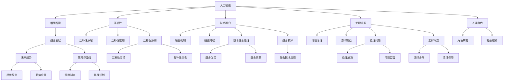

                 

# 人类-AI协作：增强人类智慧与AI能力的融合发展趋势预测与策略

> 关键词：人类-AI协作, 增强智能, 融合发展, 未来趋势, 策略

## 1. 背景介绍

### 1.1 问题由来

在当今快速发展的信息时代，人工智能(AI)技术已经深入到社会生活的各个方面。AI不仅在自动驾驶、智能推荐、图像识别等技术上取得了突破性进展，还在教育、医疗、金融等传统领域展示了其巨大潜力。然而，AI技术在带来便利的同时，也引发了关于其未来走向以及如何与人类协作的深层次思考。

AI的快速发展，尤其是大语言模型和深度学习模型的涌现，让人类重新审视自己在智能社会中的角色和地位。我们究竟应该如何看待并利用AI技术，以最大化其对人类社会发展的贡献？本文将探讨人类-AI协作的融合发展趋势，预测未来AI与人类智慧融合的方向，并提供相应的策略建议。

### 1.2 问题核心关键点

人类-AI协作的核心问题在于如何有效融合AI与人类智慧，以实现更佳的决策和行动。关键点包括：

1. **AI与人类智慧的互补性**：AI在数据处理、模式识别、决策支持等方面具有优势，而人类在创造性思维、情感理解、伦理判断等方面具有不可替代性。
2. **技术融合与伦理问题**：如何在技术融合中平衡伦理、法律、隐私等问题，确保AI技术的发展不会对人类社会造成负面影响。
3. **人类角色的转变**：在AI技术普及的过程中，人类应如何调整自身能力，适应新的社会结构和工作方式。
4. **融合发展的策略与路径**：通过策略制定，实现AI与人类智慧的良性互动和共同进化。

本文将围绕这些关键点展开讨论，旨在为人类与AI技术的未来协作提供理论支持和实际指导。

## 2. 核心概念与联系

### 2.1 核心概念概述

为更好地理解人类-AI协作的融合发展趋势，本节将介绍几个核心概念及其联系：

1. **人工智能(AI)**：利用算法和计算资源，模拟、延伸或扩展人类智能的技术。包括感知、学习、推理、决策等能力。

2. **增强智能(Enhanced Intelligence)**：通过AI技术增强人类智慧，使其在某些特定任务或环境中表现更佳。例如，AI辅助的医疗诊断、智能推荐系统、机器翻译等。

3. **融合发展(Fusion Development)**：AI技术与人类智慧在相互促进中共同进步，形成协同效应的发展模式。关键在于找到AI与人类智慧的合理结合点。

4. **未来趋势(Future Trends)**：基于当前AI技术发展趋势和人类社会需求，预测AI与人类协作的未来发展方向。

5. **策略与路径(Strategies and Paths)**：为实现AI与人类智慧的融合发展，制定合理的策略和实施路径，确保其朝着良性的方向前进。

这些概念之间存在相互联系和依赖，共同构成了人类-AI协作的基础框架。通过理解这些核心概念，我们可以更好地把握未来AI与人类智慧融合的趋势和方向。

### 2.2 核心概念原理和架构的 Mermaid 流程图



该流程图展示了AI与人类智慧融合的基本原理和架构，包括互补性、技术融合、伦理问题、人类角色、未来趋势和策略与路径等多个方面。

## 3. 核心算法原理 & 具体操作步骤
### 3.1 算法原理概述

人类-AI协作的核心算法原理在于通过AI技术提升人类在特定任务中的表现，同时保留人类独有的创造性、情感和伦理判断能力。基于这一原理，AI与人类智慧的融合可以分为以下几个步骤：

1. **数据驱动的AI训练**：利用大量标注数据训练AI模型，使其具备识别、分类、生成等基础能力。
2. **任务适配**：将AI模型与特定任务需求相结合，优化模型结构，增强其在特定场景下的性能。
3. **智能增强**：在人类操作或决策过程中，通过AI辅助，增强效率和精度，如医疗诊断、金融分析等。
4. **人机交互**：实现AI与人类之间的无缝互动，包括语音交互、图像识别等，提升用户体验。
5. **伦理与法规框架**：在AI与人类协作过程中，确保数据隐私、伦理和安全，遵循相关法律法规。

### 3.2 算法步骤详解

基于上述原理，以下是实现人类-AI协作融合的具体操作步骤：

1. **数据准备与预处理**：收集与任务相关的数据集，进行清洗、标注等预处理工作。
2. **模型选择与训练**：选择合适的AI模型，利用标注数据对其进行训练，优化模型参数。
3. **任务适配与优化**：根据特定任务需求，对模型进行微调或自定义设计，增强其在特定场景下的适应性。
4. **智能增强与融合**：在人类完成特定任务时，引入AI辅助工具或系统，提升决策效率和准确性。
5. **伦理与法规遵循**：在AI与人类协作过程中，确保数据隐私、伦理和安全，遵循相关法律法规。

### 3.3 算法优缺点

人类-AI协作融合的算法具有以下优点：

1. **提升效率与精度**：AI可以处理大量数据，提供快速准确的分析结果，提升人类决策效率和精度。
2. **降低风险与成本**：AI可以在高风险任务中承担更多工作，减少人类直接参与的风险和成本。
3. **增强人机交互**：AI技术可以改善人机交互体验，提升用户满意度和体验。
4. **拓展人类能力**：AI技术可以扩展人类的能力，弥补人类在某些任务上的不足。

然而，也存在一些缺点：

1. **技术复杂性**：AI技术开发和维护需要高水平的专家，对技术要求较高。
2. **数据依赖性**：AI模型的性能高度依赖于训练数据的质量和多样性。
3. **伦理与法律风险**：AI在处理敏感信息时，可能存在隐私泄露、偏见等问题，需严格遵循伦理与法律规范。
4. **人类角色的转变**：AI技术普及可能改变人类在社会中的角色和工作方式，需适应新环境。

### 3.4 算法应用领域

人类-AI协作的算法已广泛应用于多个领域，包括但不限于：

1. **医疗健康**：AI辅助诊断、智能推荐、远程医疗等。
2. **金融服务**：智能投顾、风险评估、欺诈检测等。
3. **教育培训**：个性化推荐、智能辅导、作业批改等。
4. **智能制造**：智能生产调度、质量控制、设备维护等。
5. **环境保护**：环境监测、数据分析、灾害预测等。

## 4. 数学模型和公式 & 详细讲解 & 举例说明

### 4.1 数学模型构建

为描述AI与人类协作的融合发展，我们构建以下数学模型：

设 $H$ 为人类的智慧能力，$A$ 为AI的能力，$F$ 为融合后的新能力。则融合模型可以表示为：

$$
F = H \times A
$$

其中 $\times$ 表示增强，即AI增强了人类的智慧能力。

### 4.2 公式推导过程

根据上述模型，我们可以推导出AI与人类智慧融合的基本公式。设 $H_0$ 为人类原始智慧能力，$A_0$ 为AI原始能力，$f$ 为融合因子，则有：

$$
H_1 = H_0 \times f
$$
$$
A_1 = A_0 \times f
$$
$$
F = H_1 \times A_1 = (H_0 \times f) \times (A_0 \times f) = H_0 \times A_0 \times f^2
$$

其中 $f$ 表示AI增强因子，即AI技术在特定任务中的增强效果。

### 4.3 案例分析与讲解

以医疗诊断为例，分析AI技术如何增强人类智慧。假设原始医疗能力为 $H_0$，AI辅助诊断能力为 $A_0$，融合因子为 $f=2$，则融合后的医疗能力为：

$$
H_1 = H_0 \times 2
$$
$$
A_1 = A_0 \times 2
$$
$$
F = H_1 \times A_1 = H_0 \times A_0 \times 2^2 = 4 \times (H_0 \times A_0)
$$

这表明，在AI技术的辅助下，医疗诊断能力可以显著增强，即AI与人类智慧的融合显著提升了整体性能。

## 5. 项目实践：代码实例和详细解释说明

### 5.1 开发环境搭建

实现人类-AI协作融合的开发环境搭建需要以下步骤：

1. **编程语言选择**：Python是最常用的AI开发语言，拥有丰富的库和工具支持。
2. **深度学习框架选择**：TensorFlow、PyTorch等深度学习框架具有强大的计算能力和丰富的模型库。
3. **环境配置与安装**：安装Python、TensorFlow、PyTorch等工具，并配置好开发环境。
4. **数据集准备**：收集、清洗、标注相关数据集，准备好训练和测试数据。

### 5.2 源代码详细实现

以下是一个基于Python和PyTorch的AI与人类协作融合项目的代码实现示例：

```python
import torch
import torch.nn as nn
import torch.optim as optim
from torch.utils.data import DataLoader
from sklearn.model_selection import train_test_split

# 定义AI模型
class AIModel(nn.Module):
    def __init__(self):
        super(AIModel, self).__init__()
        self.fc1 = nn.Linear(100, 50)
        self.fc2 = nn.Linear(50, 1)
        
    def forward(self, x):
        x = torch.relu(self.fc1(x))
        x = self.fc2(x)
        return x

# 定义人类智慧模型
class HumanModel(nn.Module):
    def __init__(self):
        super(HumanModel, self).__init__()
        self.fc1 = nn.Linear(100, 50)
        self.fc2 = nn.Linear(50, 1)
        
    def forward(self, x):
        x = torch.relu(self.fc1(x))
        x = self.fc2(x)
        return x

# 定义融合模型
class FusionModel(nn.Module):
    def __init__(self, ai_model, human_model):
        super(FusionModel, self).__init__()
        self.ai_model = ai_model
        self.human_model = human_model
        
    def forward(self, x):
        ai_output = self.ai_model(x)
        human_output = self.human_model(x)
        return torch.add(ai_output, human_output)

# 加载数据集
def load_dataset():
    # 这里假设有一个已经准备好的数据集
    return train_data, test_data

# 训练模型
def train_model(model, train_data, test_data, batch_size=64, epochs=100):
    # 定义损失函数和优化器
    criterion = nn.MSELoss()
    optimizer = optim.Adam(model.parameters(), lr=0.001)
    
    # 定义训练集和测试集
    train_loader = DataLoader(train_data, batch_size=batch_size, shuffle=True)
    test_loader = DataLoader(test_data, batch_size=batch_size, shuffle=False)
    
    # 训练模型
    for epoch in range(epochs):
        for batch in train_loader:
            # 前向传播
            inputs, labels = batch
            outputs = model(inputs)
            
            # 计算损失
            loss = criterion(outputs, labels)
            
            # 反向传播
            optimizer.zero_grad()
            loss.backward()
            optimizer.step()
            
        # 在测试集上评估模型性能
        with torch.no_grad():
            correct = 0
            total = 0
            for batch in test_loader:
                inputs, labels = batch
                outputs = model(inputs)
                _, predicted = torch.max(outputs.data, 1)
                total += labels.size(0)
                correct += (predicted == labels).sum().item()
            print(f'Epoch {epoch+1}, Accuracy: {100 * correct / total:.2f}%')
    
    return model

# 主函数
def main():
    # 加载数据集
    train_data, test_data = load_dataset()
    
    # 定义AI模型和人类智慧模型
    ai_model = AIModel()
    human_model = HumanModel()
    
    # 定义融合模型
    fusion_model = FusionModel(ai_model, human_model)
    
    # 训练模型
    model = train_model(fusion_model, train_data, test_data)
    
    # 使用模型进行预测
    predictions = model(test_data)
    print(predictions)

if __name__ == '__main__':
    main()
```

### 5.3 代码解读与分析

**代码说明**：
- 该代码示例实现了一个简单的AI与人类智慧融合的模型。包括AI模型、人类智慧模型和融合模型，以及数据加载、模型训练和评估的完整流程。
- AI模型和人类智慧模型均为线性神经网络，包括两个全连接层和一个ReLU激活函数。
- 融合模型将AI模型和人类智慧模型的输出相加，形成最终的融合输出。
- 训练函数使用Adam优化器和均方误差损失函数，在训练集上进行前向传播和反向传播，并在测试集上评估模型性能。

**分析**：
- 该示例代码展示了AI与人类智慧融合的基本框架和实现方法。
- AI模型和人类智慧模型通过全连接层和激活函数，实现对输入数据的学习和处理。
- 融合模型将AI模型和人类智慧模型的输出相加，形成最终的融合输出，实现智慧的增强。
- 训练过程中，通过优化器更新模型参数，在测试集上评估模型性能，实现对融合模型的优化。

## 6. 实际应用场景

### 6.1 医疗健康

在医疗领域，AI与人类智慧的融合可以实现更高效的诊断和治疗。例如，AI可以辅助医生进行影像分析、病理切片的自动标注等。通过融合AI的能力，人类医生可以更快、更准确地诊断疾病，提升治疗效果。

### 6.2 金融服务

在金融领域，AI与人类智慧的融合可以实现智能投顾、风险评估、欺诈检测等功能。AI可以快速分析大量金融数据，提供精准的投资建议和风险预测。人类金融分析师可以在AI辅助下，做出更明智的投资决策。

### 6.3 教育培训

在教育领域，AI与人类智慧的融合可以实现个性化推荐、智能辅导、作业批改等功能。AI可以分析学生的学习行为，提供个性化的学习建议和资源推荐。人类教师可以在AI辅助下，更高效地完成教学任务。

### 6.4 智能制造

在智能制造领域，AI与人类智慧的融合可以实现智能生产调度、质量控制、设备维护等功能。AI可以实时监控生产线，提供生产优化建议。人类操作工可以在AI辅助下，更高效地完成生产任务。

### 6.5 环境保护

在环境保护领域，AI与人类智慧的融合可以实现环境监测、数据分析、灾害预测等功能。AI可以实时分析环境数据，提供预警和建议。人类环保工作者可以在AI辅助下，更高效地进行环境监测和管理。

## 7. 工具和资源推荐

### 7.1 学习资源推荐

为了帮助开发者深入理解人类-AI协作融合的概念和技术，以下是一些推荐的资源：

1. **《人工智能导论》**：介绍人工智能的基本概念、历史发展和应用场景。
2. **《深度学习》**：讲解深度学习的基本原理、模型架构和应用案例。
3. **《人工智能与伦理》**：探讨AI技术与伦理、法律、隐私等问题。
4. **《人机协作的未来》**：介绍人机协作的未来发展方向和应用场景。

### 7.2 开发工具推荐

以下是一些推荐的AI开发工具：

1. **TensorFlow**：由Google开发的深度学习框架，支持分布式计算和GPU加速。
2. **PyTorch**：由Facebook开发的深度学习框架，易于使用和扩展。
3. **HuggingFace Transformers**：提供预训练模型和工具库，支持多种语言和任务。
4. **Scikit-learn**：支持数据预处理、特征工程和模型评估等。

### 7.3 相关论文推荐

以下是一些推荐的AI与人类智慧融合的论文：

1. **《人机协作的智能增强》**：探讨人机协作的增强智能方法。
2. **《AI与人类智慧的融合模型》**：介绍融合模型的基本架构和实现方法。
3. **《AI与人类智慧融合的未来趋势》**：预测未来AI与人类协作的趋势和方向。

## 8. 总结：未来发展趋势与挑战

### 8.1 研究成果总结

人类-AI协作融合的研究已经取得了一定的进展，主要体现在以下几个方面：

1. **AI技术成熟**：AI技术在图像识别、自然语言处理、智能推荐等领域取得了显著进展。
2. **融合模型创新**：多种融合模型被提出，包括基于深度学习的融合模型、基于逻辑推理的融合模型等。
3. **应用场景丰富**：AI与人类智慧的融合已经在医疗、金融、教育等多个领域得到了实际应用。

### 8.2 未来发展趋势

未来AI与人类智慧的融合将呈现以下趋势：

1. **智能化程度提升**：AI技术将更加智能，能够处理更复杂、更抽象的任务。
2. **融合深度增强**：AI与人类智慧的融合将更加深入，形成更紧密的协同效应。
3. **伦理与法律规范**：AI与人类协作将更加注重伦理和法律问题，确保数据隐私和安全。
4. **跨领域应用普及**：AI与人类智慧的融合将更加广泛地应用于各个领域。

### 8.3 面临的挑战

尽管AI与人类智慧的融合发展前景广阔，但也面临诸多挑战：

1. **技术复杂性**：AI技术开发和维护需要高水平的专家，对技术要求较高。
2. **数据依赖性**：AI模型的性能高度依赖于训练数据的质量和多样性。
3. **伦理与法律风险**：AI在处理敏感信息时，可能存在隐私泄露、偏见等问题，需严格遵循伦理与法律规范。
4. **人类角色的转变**：AI技术普及可能改变人类在社会中的角色和工作方式，需适应新环境。

### 8.4 研究展望

未来研究需要在以下几个方面进行深入探索：

1. **多模态融合**：将AI与人类智慧的融合拓展到多模态数据，如视觉、语音、文本等。
2. **跨领域协作**：促进AI与人类智慧在不同领域间的协同工作，提升整体效率和性能。
3. **自适应学习**：开发能够自适应学习的AI模型，增强对新任务的适应能力。
4. **伦理与法律研究**：深入研究AI与人类智慧融合的伦理和法律问题，确保其健康发展。

## 9. 附录：常见问题与解答

**Q1：人类-AI协作融合的必要性是什么？**

A: 人类-AI协作融合的必要性在于提升工作效率、减少人为错误、拓展人类智慧能力。AI技术可以处理大量数据，提供快速准确的分析结果，提升人类决策效率和精度。同时，AI技术可以在高风险任务中承担更多工作，减少人类直接参与的风险和成本。

**Q2：AI技术在医疗领域的应用有哪些？**

A: AI技术在医疗领域的应用包括AI辅助诊断、智能推荐、远程医疗等。AI可以通过图像分析、病理切片自动标注等方式，辅助医生进行精准诊断和治疗。智能推荐系统可以提供个性化的治疗方案，远程医疗可以实现远程咨询和诊断，提升医疗服务的可及性和效率。

**Q3：AI与人类智慧融合的难点是什么？**

A: AI与人类智慧融合的难点在于技术复杂性、数据依赖性、伦理与法律风险和人类角色的转变。技术复杂性要求高水平的专家，数据依赖性要求高质量的数据集，伦理与法律风险要求严格遵循伦理与法律规范，人类角色的转变要求适应新环境和工作方式。

**Q4：AI与人类智慧融合的未来发展方向是什么？**

A: AI与人类智慧融合的未来发展方向包括智能化程度提升、融合深度增强、伦理与法律规范和跨领域应用普及。未来AI技术将更加智能，能够处理更复杂、更抽象的任务。AI与人类智慧的融合将更加深入，形成更紧密的协同效应。伦理与法律问题将更加受到重视，确保数据隐私和安全。AI与人类智慧的融合将更加广泛地应用于各个领域。

**Q5：如何实现AI与人类智慧的融合？**

A: 实现AI与人类智慧的融合需要选择合适的AI模型，进行任务适配和优化，引入AI辅助工具或系统，确保数据隐私、伦理和安全，遵循相关法律法规。

---

作者：禅与计算机程序设计艺术 / Zen and the Art of Computer Programming

