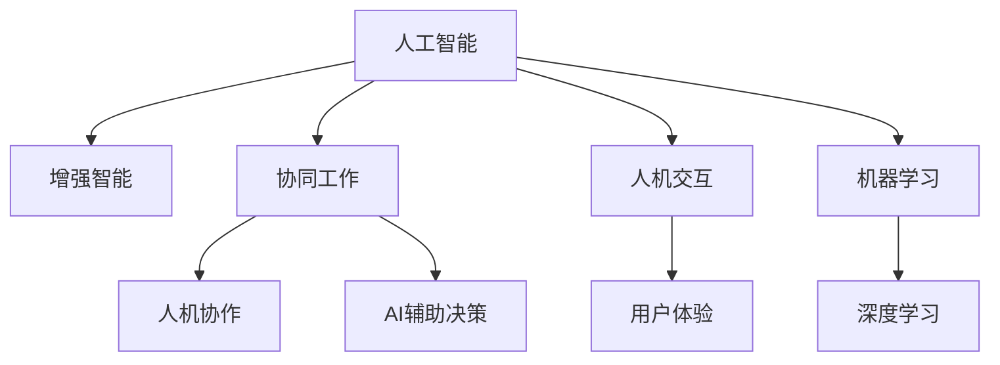

                 

# 人类-AI协作：增强人类智慧与AI能力的融合发展趋势预测分析机遇挑战机遇趋势分析预测

## 1. 背景介绍

### 1.1 问题由来
随着人工智能(AI)技术的迅猛发展，人类与AI的协作已经成为推动社会进步的重要力量。AI不仅仅是工具和技术的集成，更是人类智慧与机器智能的深度融合。这种融合不仅带来了生产力的大幅提升，也在根本上改变了人类的工作和生活方式。

当前，AI技术在医疗、教育、金融、制造、交通等领域广泛应用，显著提高了各行业的效率和精度。然而，AI技术在快速发展的同时，也面临着诸多挑战，如伦理、安全、可解释性等问题，这些问题需要在人类与AI协作的框架下得到解决。

本文旨在深入分析人类-AI协作的未来发展趋势，探讨其中的机遇与挑战，为各行业的从业者提供策略性的参考，促进AI技术与人类智慧的良性互动与融合。

### 1.2 问题核心关键点
本文聚焦于人类-AI协作的三个核心问题：

1. **增强人类智慧**：如何利用AI技术，特别是自然语言处理(NLP)、计算机视觉、机器人等技术，增强人类在决策、沟通、协作等方面的智慧。
2. **提升AI能力**：如何通过人类的知识、经验、价值观等，提升AI模型的精确性、鲁棒性和可解释性。
3. **融合发展趋势**：探讨AI技术与人类智慧融合的长期趋势，预测未来技术走向。

通过分析这些问题，本文将揭示人类-AI协作的未来发展路径，以及实现这一路径的机遇和挑战。

## 2. 核心概念与联系

### 2.1 核心概念概述

为更好地理解人类-AI协作的未来发展，本节将介绍几个密切相关的核心概念：

- **人工智能(AI)**：模拟人类智能的计算系统，包括知识表示、推理、学习、规划、自然语言处理等技术。
- **增强智能(Enhanced Intelligence)**：通过AI技术增强人类在特定任务上的智能水平，如智能助手、机器翻译、智能推荐等。
- **协同工作(Cooperative Work)**：人类与AI协同完成任务的过程，如人机协作、AI辅助决策、人机交互等。
- **人机交互(Human-Computer Interaction, HCI)**：人类与计算机系统之间的信息交流方式，旨在提高用户效率和满意度。
- **机器学习(Machine Learning, ML)**：通过数据驱动的方式，使计算机系统具备自适应、自学习的能力。
- **深度学习(Deep Learning)**：机器学习的一个分支，使用多层神经网络来模拟复杂的数据处理任务。

这些核心概念之间的逻辑关系可以通过以下Mermaid流程图来展示：



这个流程图展示了一些核心概念之间的联系：

1. 人工智能是增强智能、协同工作和深度学习的底层基础。
2. 增强智能和协同工作通过人机交互和用户体验提升用户满意度。
3. 机器学习和深度学习为增强智能和协同工作提供技术支持。

## 3. 核心算法原理 & 具体操作步骤

### 3.1 算法原理概述

人类-AI协作的核心在于通过AI技术增强人类智慧和提升AI能力，最终实现二者的有机融合。以下是一些核心算法和操作步骤：

- **增强智能算法**：如自然语言处理(NLP)中的词嵌入、文本分类、命名实体识别、机器翻译等算法，旨在从文本中提取和分析信息，增强人类在理解和处理信息方面的能力。
- **协同工作算法**：如强化学习(RL)、协同过滤、游戏树搜索等算法，旨在模拟人类的决策过程，提高AI在协作任务中的表现。
- **深度学习框架**：如TensorFlow、PyTorch等，提供高效的神经网络模型训练和推理功能，支持AI能力的提升。
- **协同工作界面设计**：如人机交互界面(UI/UX)设计、自然语言生成(NLG)等技术，提升人机协作的效率和用户体验。

### 3.2 算法步骤详解

人类-AI协作的具体操作步骤包括以下几个关键步骤：

1. **需求分析**：根据具体任务，明确人类与AI协作的需求和目标。例如，在医疗领域，可能需要AI辅助诊断和治疗方案推荐。
2. **数据准备**：收集和准备训练数据，确保数据的质量和多样性。数据来源可以是公开数据集、行业数据等。
3. **模型选择与训练**：根据任务需求，选择合适的AI模型，使用数据集对其进行训练。例如，使用预训练的语言模型(BERT、GPT等)进行微调，或者从头训练新的模型。
4. **模型部署与评估**：将训练好的模型部署到实际应用场景中，进行性能测试和用户反馈收集，不断优化模型。
5. **反馈与迭代**：根据用户反馈和实际应用效果，持续改进模型和协作流程，提高人类-AI协作的效率和效果。

### 3.3 算法优缺点

人类-AI协作的算法具有以下优点：

- **提升效率**：AI技术能够高效处理大量数据和复杂任务，显著提升人类工作效率。
- **增强智能**：AI技术通过学习和分析数据，可以辅助人类做出更准确的决策。
- **减少错误**：AI技术的鲁棒性和精确性，可以减少人为错误和失误。

同时，这些算法也存在一些缺点：

- **数据依赖**：AI技术的效果高度依赖于数据的质量和数量，数据获取成本较高。
- **解释性不足**：AI模型往往是"黑盒"，难以解释其内部工作机制。
- **伦理问题**：AI技术的决策过程可能存在偏见和歧视，需要关注伦理和公平性问题。
- **安全性问题**：AI技术可能存在安全漏洞，如数据泄露、攻击等。

尽管存在这些局限性，但人类-AI协作的算法仍是大势所趋，通过不断改进和优化，这些缺点可以逐步克服。

### 3.4 算法应用领域

人类-AI协作的算法已经在多个领域得到了广泛应用，例如：

- **医疗领域**：AI辅助诊断、治疗方案推荐、患者监护等。
- **教育领域**：智能辅导、个性化推荐、学习效果评估等。
- **金融领域**：风险评估、交易预测、欺诈检测等。
- **制造业**：质量控制、设备维护、供应链管理等。
- **交通领域**：自动驾驶、交通流量优化、智能交通管理等。

此外，在零售、农业、公共安全、智慧城市等领域，人类-AI协作也正在发挥着越来越重要的作用。随着AI技术的不断进步，未来这些应用领域将进一步拓展，带来更多机遇和挑战。

## 4. 数学模型和公式 & 详细讲解

### 4.1 数学模型构建

为了更深入地理解人类-AI协作的算法，本文将使用数学语言对其中的核心模型进行构建。

假设有一个数据集 $D=\{(x_i,y_i)\}_{i=1}^N$，其中 $x_i$ 为输入数据，$y_i$ 为对应的输出标签。我们希望训练一个AI模型 $f$，使其能够将输入数据映射到输出标签。

定义模型 $f$ 在数据样本 $(x,y)$ 上的损失函数为 $\ell(f(x),y)$，则在数据集 $D$ 上的经验风险为：

$$
\mathcal{L}(f) = \frac{1}{N} \sum_{i=1}^N \ell(f(x_i),y_i)
$$

微调的优化目标是最小化经验风险，即找到最优模型参数：

$$
f^* = \mathop{\arg\min}_{f} \mathcal{L}(f)
$$

在实践中，我们通常使用基于梯度的优化算法（如SGD、Adam等）来近似求解上述最优化问题。设 $\eta$ 为学习率，$\lambda$ 为正则化系数，则模型参数的更新公式为：

$$
f \leftarrow f - \eta \nabla_{f}\mathcal{L}(f) - \eta\lambda f
$$

其中 $\nabla_{f}\mathcal{L}(f)$ 为损失函数对模型 $f$ 的梯度，可通过反向传播算法高效计算。

### 4.2 公式推导过程

以下是深度学习中常见的激活函数ReLU的推导过程，用于说明模型训练的基本步骤：

$$
f(x) = \max(0, x)
$$

其中 $x$ 为输入数据，$f(x)$ 为输出。其导数公式为：

$$
f'(x) = 
\begin{cases}
1, & \text{if } x > 0 \\
0, & \text{if } x \leq 0
\end{cases}
$$

通过链式法则，可推导出梯度公式为：

$$
\nabla_{f} \mathcal{L}(f) = \sum_{i=1}^N \frac{\partial \ell(f(x_i),y_i)}{\partial f(x_i)}
$$

其中 $\frac{\partial \ell(f(x_i),y_i)}{\partial f(x_i)}$ 表示对模型输出 $f(x_i)$ 的梯度。通过反向传播算法，可以高效计算这些梯度，并根据梯度下降等优化算法更新模型参数。

### 4.3 案例分析与讲解

以下以图像识别为例，展示深度学习模型的训练过程。假设有一个图像分类任务，数据集 $D=\{(x_i,y_i)\}_{i=1}^N$，其中 $x_i$ 为图像数据，$y_i$ 为对应的分类标签。

1. **数据预处理**：将图像数据转换为模型接受的格式，如归一化、缩放到指定尺寸等。
2. **模型初始化**：选择一个合适的神经网络结构，初始化权重和偏置。
3. **前向传播**：将图像数据输入模型，计算输出。
4. **计算损失**：计算模型输出与真实标签之间的差异，即损失函数。
5. **反向传播**：通过链式法则，计算损失对每个权重和偏置的梯度。
6. **权重更新**：根据梯度下降算法，更新模型的权重和偏置。
7. **迭代训练**：重复上述步骤，直至模型收敛或达到预设的迭代次数。

通过这种训练过程，模型能够逐步学习图像的特征表示，并在新图像数据上进行有效的分类。

## 5. 项目实践：代码实例和详细解释说明

### 5.1 开发环境搭建

在进行人类-AI协作的项目实践前，我们需要准备好开发环境。以下是使用Python进行深度学习开发的常见环境配置流程：

1. 安装Anaconda：从官网下载并安装Anaconda，用于创建独立的Python环境。

2. 创建并激活虚拟环境：
```bash
conda create -n pytorch-env python=3.8 
conda activate pytorch-env
```

3. 安装PyTorch：根据CUDA版本，从官网获取对应的安装命令。例如：
```bash
conda install pytorch torchvision torchaudio cudatoolkit=11.1 -c pytorch -c conda-forge
```

4. 安装TensorFlow：
```bash
pip install tensorflow
```

5. 安装各类工具包：
```bash
pip install numpy pandas scikit-learn matplotlib tqdm jupyter notebook ipython
```

完成上述步骤后，即可在`pytorch-env`环境中开始项目实践。

### 5.2 源代码详细实现

下面以图像识别为例，展示使用TensorFlow对卷积神经网络(CNN)进行训练的代码实现。

首先，定义数据集和模型：

```python
import tensorflow as tf
from tensorflow import keras

# 加载数据集
(x_train, y_train), (x_test, y_test) = keras.datasets.cifar10.load_data()

# 数据预处理
x_train = x_train / 255.0
x_test = x_test / 255.0

# 定义模型
model = keras.Sequential([
    keras.layers.Conv2D(32, (3, 3), activation='relu', input_shape=(32, 32, 3)),
    keras.layers.MaxPooling2D((2, 2)),
    keras.layers.Flatten(),
    keras.layers.Dense(10, activation='softmax')
])

# 定义损失函数和优化器
loss_fn = keras.losses.SparseCategoricalCrossentropy(from_logits=True)
optimizer = keras.optimizers.Adam(learning_rate=0.001)

# 编译模型
model.compile(optimizer=optimizer,
              loss=loss_fn,
              metrics=['accuracy'])
```

然后，执行模型训练和评估：

```python
# 模型训练
epochs = 10
model.fit(x_train, y_train, epochs=epochs, validation_data=(x_test, y_test))

# 模型评估
test_loss, test_acc = model.evaluate(x_test, y_test)
print(f'Test accuracy: {test_acc}')
```

以上代码展示了TensorFlow对CNN进行图像识别的基本流程，包括数据加载、模型定义、模型编译、模型训练和评估等步骤。

### 5.3 代码解读与分析

让我们再详细解读一下关键代码的实现细节：

- **数据预处理**：将图像数据归一化到[0,1]之间，以适应模型的训练。
- **模型定义**：构建了一个简单的卷积神经网络，包含卷积层、池化层和全连接层，用于对图像进行分类。
- **损失函数和优化器**：选择了交叉熵损失函数和Adam优化器，用于计算损失和更新模型参数。
- **模型编译**：将模型、损失函数和优化器组合起来，形成完整的训练流程。
- **模型训练**：使用训练集进行模型训练，并在验证集上进行性能评估。
- **模型评估**：在测试集上评估模型性能，输出测试精度。

可以看到，TensorFlow提供了丰富的API和工具，使得深度学习模型的实现变得简洁高效。开发者可以将更多精力放在模型设计、数据处理和业务逻辑上，而不必过多关注底层的实现细节。

当然，工业级的系统实现还需考虑更多因素，如模型的保存和部署、超参数的自动搜索、更灵活的任务适配层等。但核心的训练流程基本与此类似。

## 6. 实际应用场景

### 6.1 医疗领域

在医疗领域，人类-AI协作的应用场景非常广泛。例如：

1. **智能诊断系统**：利用深度学习模型对医学影像、病历等数据进行分析，辅助医生进行疾病诊断和治疗方案推荐。
2. **患者监护系统**：通过监控设备和传感器数据，AI系统可以实时分析患者的生命体征，及时发现异常情况并报警。
3. **药物研发**：利用AI技术分析大量文献和实验数据，预测新药的效果和副作用，加速药物研发进程。

### 6.2 教育领域

在教育领域，人类-AI协作的应用场景包括：

1. **智能辅导系统**：AI系统可以分析学生的学习行为和成绩，提供个性化的学习建议和辅导。
2. **在线教育平台**：通过自然语言处理和机器学习技术，智能推荐学习资源和课程，提升学习效果。
3. **自动化评估系统**：利用自然语言处理技术，对学生的作业和考试进行自动评分和反馈，减轻教师负担。

### 6.3 金融领域

在金融领域，人类-AI协作的应用场景包括：

1. **风险评估系统**：利用AI技术分析金融市场数据，预测股票、债券等资产的价格波动，辅助投资决策。
2. **欺诈检测系统**：通过深度学习模型分析交易数据，识别和预防金融欺诈行为。
3. **客户服务系统**：利用聊天机器人和自然语言生成技术，自动处理客户咨询和投诉，提升客户满意度。

### 6.4 未来应用展望

随着人类-AI协作技术的不断发展，未来将出现更多创新的应用场景，例如：

1. **人机协作制造**：在工业制造中，AI系统可以辅助机器人进行精确操作和质量检测，提升生产效率和质量。
2. **智慧城市管理**：利用AI技术优化交通、能源、环境等城市管理领域，提升城市运行效率和居民生活质量。
3. **虚拟助手**：通过AI技术，开发更加智能和人性化的虚拟助手，如智能家居、智能客服等，提升用户体验。

## 7. 工具和资源推荐

### 7.1 学习资源推荐

为了帮助开发者系统掌握人类-AI协作的理论基础和实践技巧，这里推荐一些优质的学习资源：

1. 《深度学习》书籍：Ian Goodfellow等著，全面介绍了深度学习的基本概念和算法。
2. 《人工智能基础》课程：由斯坦福大学开设，涵盖深度学习、强化学习、自然语言处理等内容。
3. 《人工智能导论》课程：由麻省理工学院开设，介绍了AI技术的多种应用场景和前沿技术。
4. 《自然语言处理综论》书籍：Daniel Jurafsky和James H. Martin著，涵盖了自然语言处理的各个方面。
5. 《TensorFlow官方文档》：官方文档提供了完整的TensorFlow API参考和案例教程，适合初学者和进阶开发者。

通过对这些资源的学习实践，相信你一定能够快速掌握人类-AI协作的精髓，并用于解决实际的NLP问题。

### 7.2 开发工具推荐

高效的开发离不开优秀的工具支持。以下是几款用于人类-AI协作开发的常用工具：

1. PyTorch：基于Python的开源深度学习框架，灵活动态的计算图，适合快速迭代研究。
2. TensorFlow：由Google主导开发的开源深度学习框架，生产部署方便，适合大规模工程应用。
3. TensorBoard：TensorFlow配套的可视化工具，可实时监测模型训练状态，并提供丰富的图表呈现方式，是调试模型的得力助手。
4. Weights & Biases：模型训练的实验跟踪工具，可以记录和可视化模型训练过程中的各项指标，方便对比和调优。
5. Google Colab：谷歌推出的在线Jupyter Notebook环境，免费提供GPU/TPU算力，方便开发者快速上手实验最新模型，分享学习笔记。

合理利用这些工具，可以显著提升人类-AI协作任务的开发效率，加快创新迭代的步伐。

### 7.3 相关论文推荐

人类-AI协作的发展源于学界的持续研究。以下是几篇奠基性的相关论文，推荐阅读：

1. "A Survey of Reinforcement Learning for Robotics: Toward the Next Decade"： survey了强化学习在机器人控制中的应用。
2. "Deep Learning for Medical Decision Support"：综述了深度学习在医疗决策支持中的应用。
3. "Transfer Learning: A Survey and Selected Results"：综述了迁移学习在计算机视觉、自然语言处理等领域的应用。
4. "Reinforcement Learning for Health Care Systems: A Survey"：综述了强化学习在健康护理系统中的应用。
5. "AI for Medical Image Analysis"：综述了AI技术在医疗影像分析中的应用。

这些论文代表了大语言模型微调技术的发展脉络。通过学习这些前沿成果，可以帮助研究者把握学科前进方向，激发更多的创新灵感。

## 8. 总结：未来发展趋势与挑战

### 8.1 总结

本文对人类-AI协作的未来发展趋势进行了全面系统的介绍。首先阐述了人类-AI协作的研究背景和意义，明确了增强人类智慧与提升AI能力在技术发展中的重要性。其次，从原理到实践，详细讲解了人类-AI协作的核心算法和具体操作步骤，给出了实践案例和代码实现。同时，本文还广泛探讨了人类-AI协作在医疗、教育、金融等多个领域的应用前景，展示了其广阔的发展空间。

通过本文的系统梳理，可以看到，人类-AI协作已经成为推动社会进步的重要力量，其融合发展趋势是不可逆转的。未来，伴随技术的不断演进，人类与AI的协作将更加紧密，为社会带来更多的创新和变革。

### 8.2 未来发展趋势

展望未来，人类-AI协作将呈现以下几个发展趋势：

1. **深度融合**：人类与AI的协作将更加紧密，AI技术将深度融入人类的工作流程中，提升人类智慧和效率。
2. **多模态融合**：未来AI系统将具备跨模态信息处理能力，能够融合视觉、语音、文本等多种数据形式。
3. **自适应学习**：AI系统将具备自适应学习能力，能够根据环境变化和任务需求进行动态调整。
4. **普适化**：AI系统将具备普适性，能够适应各种行业和应用场景，提升其应用价值。
5. **伦理与隐私保护**：未来AI系统将更加注重伦理和隐私保护，确保其应用的安全性和公平性。

以上趋势凸显了人类-AI协作的广阔前景。这些方向的探索发展，必将进一步提升AI技术与人类智慧的良性互动与融合，为构建更加智能的未来社会奠定基础。

### 8.3 面临的挑战

尽管人类-AI协作技术已经取得了瞩目成就，但在迈向更加智能化、普适化应用的过程中，它仍面临着诸多挑战：

1. **数据隐私和安全**：如何在数据获取和使用过程中保护用户隐私，防止数据泄露和滥用。
2. **模型透明性与解释性**：如何让AI系统具备透明性和解释性，使其决策过程可被理解和监督。
3. **伦理和公平性**：如何在AI系统设计中引入伦理和公平性，防止偏见和歧视。
4. **系统可靠性与鲁棒性**：如何提高AI系统的可靠性和鲁棒性，避免系统崩溃和故障。
5. **社会接受度**：如何在社会中推广AI技术，获得用户和社会的信任和接受。

这些挑战需要在技术和社会层面共同努力，才能逐步克服。只有解决这些挑战，才能真正实现人类-AI协作的长期发展。

### 8.4 研究展望

面对人类-AI协作面临的挑战，未来的研究需要在以下几个方面寻求新的突破：

1. **隐私保护技术**：开发更加高效和安全的隐私保护技术，如差分隐私、联邦学习等，确保数据安全。
2. **模型透明性**：引入可解释性模型，如LIME、SHAP等，提高AI系统的透明性和可解释性。
3. **伦理框架**：建立AI系统设计的伦理框架，确保其设计和应用符合社会价值观。
4. **鲁棒性提升**：引入鲁棒性增强技术，如对抗训练、鲁棒特征学习等，提高系统的鲁棒性。
5. **社会接受度提升**：通过教育和宣传，提升社会对AI技术的理解和接受度。

这些研究方向的探索，必将引领人类-AI协作技术的进一步发展，为构建更加智能的未来社会提供新的动力。总之，人类-AI协作需要技术和社会共同努力，才能真正实现其在各个领域的应用和普及。

## 9. 附录：常见问题与解答

**Q1：人类-AI协作的算法是否适用于所有应用场景？**

A: 人类-AI协作的算法适用于大多数应用场景，特别是需要复杂数据处理和决策支持的任务。例如，医疗、金融、制造等领域，可以通过AI技术提升效率和精确性。但对于一些特定场景，如金融交易高频操作、实时音频处理等，仍需要结合具体的业务需求进行算法优化和改进。

**Q2：如何在人类-AI协作中保证数据隐私和安全？**

A: 数据隐私和安全是AI系统设计中需要重点关注的问题。以下是一些常见策略：
1. 数据匿名化：对数据进行匿名化处理，确保个人隐私不被泄露。
2. 差分隐私：在数据处理过程中引入噪声，防止数据集被重识别。
3. 联邦学习：在分布式环境中进行模型训练，确保数据不离开本地设备。
4. 访问控制：设置严格的访问权限，防止未经授权的访问和操作。
5. 加密存储：采用加密存储技术，防止数据在传输和存储过程中被窃取。

通过这些策略，可以有效地保护数据隐私和安全。

**Q3：如何提升AI系统的透明性和可解释性？**

A: AI系统的透明性和可解释性是当前研究的热点。以下是一些常见方法：
1. 可解释模型：使用可解释性模型，如决策树、线性回归等，能够直观解释模型的决策过程。
2. 特征可视化：通过特征可视化技术，展示模型学习到的关键特征和权重。
3. 模型解释工具：引入如LIME、SHAP等模型解释工具，对模型的决策过程进行解释和可视化。
4. 知识图谱：构建知识图谱，将AI系统的决策过程与领域知识结合，增强系统的可解释性。

这些方法可以有效提升AI系统的透明性和可解释性，帮助用户理解和信任AI系统。

**Q4：如何在AI系统设计中引入伦理和公平性？**

A: 伦理和公平性是AI系统设计中需要重点关注的问题。以下是一些常见策略：
1. 数据清洗：在数据采集和预处理阶段，过滤掉可能带有偏见的数据。
2. 模型公平性评估：在模型训练过程中，引入公平性评估指标，防止模型输出偏见。
3. 透明决策流程：设计透明的决策流程，确保AI系统的决策过程公开透明。
4. 人工干预和审核：引入人工干预和审核机制，对AI系统的决策进行监督和修正。
5. 伦理框架制定：制定伦理框架和规范，确保AI系统设计和应用符合社会价值观。

通过这些策略，可以在AI系统设计中引入伦理和公平性，防止偏见和歧视。

**Q5：如何在AI系统中实现自适应学习？**

A: 自适应学习是AI系统未来发展的重要方向。以下是一些常见方法：
1. 在线学习：在实际应用中，不断收集新的数据，对模型进行在线更新。
2. 增量学习：在模型训练过程中，不断加入新的数据，进行增量更新。
3. 主动学习：根据数据的重要性和不确定性，选择最有价值的数据进行学习。
4. 自监督学习：利用未标注数据进行自监督学习，提高模型的泛化能力。
5. 强化学习：通过奖励和惩罚机制，训练模型进行自适应学习。

这些方法可以有效提升AI系统的自适应学习能力，使其能够在不断变化的环境中保持高效和精确。

**Q6：如何在AI系统中实现多模态融合？**

A: 多模态融合是未来AI系统的重要方向。以下是一些常见方法：
1. 融合框架设计：设计多模态融合框架，将不同模态的数据进行整合和处理。
2. 多模态特征提取：提取不同模态的数据特征，进行特征融合。
3. 多模态训练算法：引入多模态训练算法，提高模型对多模态数据的处理能力。
4. 多模态推理模型：设计多模态推理模型，对多模态数据进行推理和决策。
5. 多模态评估指标：设计多模态评估指标，对多模态融合的效果进行评估和优化。

这些方法可以有效提升AI系统的多模态融合能力，使其能够处理和分析多种数据形式。

总之，人类-AI协作技术需要在技术和社会层面共同努力，才能真正实现其在各个领域的应用和普及。未来，伴随技术的不断演进，人类与AI的协作将更加紧密，为社会带来更多的创新和变革。

