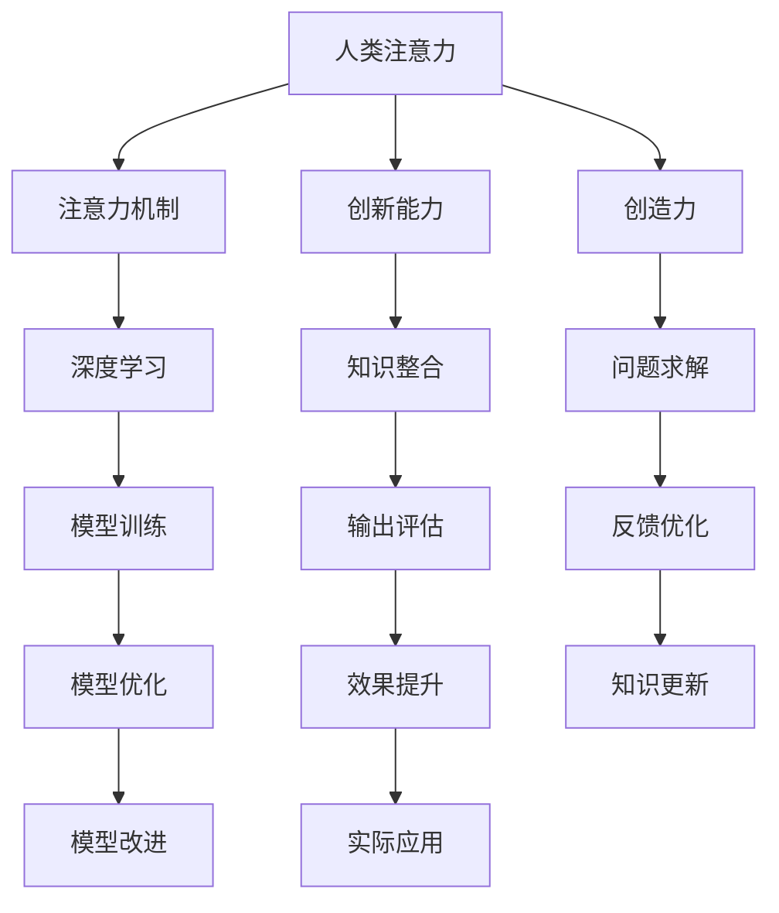

                 

# 人类注意力增强：提升创新能力和创造力训练

> 关键词：人类注意力,注意力机制,创新能力,创造力,认知神经科学,深度学习

## 1. 背景介绍

### 1.1 问题由来
近年来，人工智能在各个领域取得了显著进展，其背后重要的推动力之一是人类注意力机制的深度挖掘和应用。注意力机制不仅在深度学习中发挥了重要作用，更是认知神经科学和心理学研究的焦点。本文将围绕人类注意力机制的增强，探讨其如何提升个体的创新能力和创造力。

### 1.2 问题核心关键点
本文旨在探讨人类注意力增强的机制和策略，并探讨其对创新能力和创造力提升的潜在影响。核心问题点包括：
- 人类注意力的神经科学基础是什么？
- 注意力增强在认知过程中如何发挥作用？
- 创新能力和创造力与注意力的关系是什么？
- 哪些技术手段能够增强人类注意力？
- 注意力增强对创新和创造力提升的实际效果如何？

## 2. 核心概念与联系

### 2.1 核心概念概述

为更好地理解人类注意力增强对创新和创造力的影响，本节将介绍几个核心概念：

- 人类注意力（Human Attention）：指个体在特定时刻对外部刺激或内部思维的集中注意过程。注意力增强旨在提高个体的注意广度、集中度、分配效率等方面。

- 注意力机制（Attention Mechanism）：指在深度学习模型中用于对输入数据进行选择、聚焦的算法。常见的注意力机制包括自注意力机制（Self-Attention）和双向注意力机制（Bi-Attention）等。

- 创新能力（Innovation Capacity）：指个体创造新颖产品、思想、方法的能力。其形成涉及多个认知过程的协同作用。

- 创造力（Creativity）：指个体进行创造性思维，产生独特、有用解决方案的能力。创造力是创新能力的重要组成部分。

- 认知神经科学（Cognitive Neuroscience）：研究人类认知过程的神经机制，揭示认知与大脑功能的关系。

- 深度学习（Deep Learning）：一种基于多层神经网络的学习范式，常用于图像识别、自然语言处理等任务。

这些核心概念之间的逻辑关系可以通过以下Mermaid流程图来展示：



这个流程图展示了一系列核心概念及其之间的关系：

1. 人类注意力是认知过程的基础，通过注意力机制进行信息处理。
2. 注意力增强可提升创新能力和创造力，涉及知识整合和问题求解。
3. 深度学习模型可通过训练强化注意力机制，提升模型性能。
4. 模型优化和效果提升是实际应用中的关键环节。

## 3. 核心算法原理 & 具体操作步骤
### 3.1 算法原理概述

人类注意力增强的主要目标是提升个体在特定任务上的注意力广度、集中度和分配效率。这可以通过多种算法实现，包括深度学习中的注意力机制训练、认知神经科学中的注意力训练等。

### 3.2 算法步骤详解

以下将以深度学习中的注意力机制为例，详细讲解人类注意力增强的具体步骤：

**Step 1: 数据准备**
- 收集与注意力相关的数据集，如视觉注意力数据、语言注意力数据等。
- 对数据进行预处理，包括归一化、标准化等。

**Step 2: 模型选择**
- 选择或设计适合的深度学习模型，如卷积神经网络（CNN）、循环神经网络（RNN）、Transformer等。
- 在模型中引入注意力机制，如自注意力机制、双向注意力机制等。

**Step 3: 模型训练**
- 使用收集的数据对模型进行训练，不断调整模型参数以优化注意力机制。
- 在训练过程中，使用注意力损失函数（如交叉熵损失）来指导模型的优化。

**Step 4: 效果评估**
- 在训练完成后，使用测试集评估模型在特定任务上的表现。
- 评估指标包括注意力分配的合理性、任务完成的准确性等。

**Step 5: 实际应用**
- 将训练好的模型应用于实际任务中，如文本生成、图像识别等。
- 实时监测模型的注意力分配情况，不断优化模型参数。

### 3.3 算法优缺点

人类注意力增强的深度学习算法具有以下优点：
1. 高度可控性：通过调整模型参数，可以精确控制注意力分配策略，提升特定任务的性能。
2. 可扩展性：能够处理大规模数据集，适用于多个领域的应用。
3. 可解释性：通过注意力权重图，可以直观理解模型注意力分配的情况，便于调试和优化。

同时，该算法也存在一些局限性：
1. 对数据质量要求高：注意力训练需要高质量、多样化的数据集，数据收集和处理成本较高。
2. 计算复杂度高：注意力机制的计算复杂度较高，对硬件要求较高。
3. 泛化能力有限：模型在特定任务上的效果较好，但跨领域泛化能力有待提高。

### 3.4 算法应用领域

人类注意力增强的深度学习算法已在多个领域得到了广泛应用，例如：

- 文本生成：通过引入注意力机制，深度学习模型能够更好地捕捉文本语义关系，生成更加连贯和语义丰富的文本。
- 图像识别：在图像识别任务中，注意力机制能够帮助模型聚焦于关键区域，提升识别精度。
- 自然语言处理：在语言理解、翻译、对话生成等任务中，注意力机制能够提高模型对输入序列的关注度，增强理解能力。
- 音乐生成：在音乐生成任务中，注意力机制能够帮助模型更好地捕捉旋律变化和节奏特点，生成更具表现力的音乐作品。

## 4. 数学模型和公式 & 详细讲解 & 举例说明

### 4.1 数学模型构建

本节将使用数学语言对人类注意力增强的深度学习算法进行严格刻画。

记输入数据为 $X$，输出数据为 $Y$，模型参数为 $\theta$。假设模型为深度学习神经网络，包含 $n$ 层，每层包含 $m$ 个神经元。模型的目标是最小化预测输出与真实输出之间的误差，即：

$$
\min_{\theta} \mathcal{L}(Y,\hat{Y})
$$

其中 $\hat{Y} = f_{\theta}(X)$ 为模型对输入数据的预测输出，$f_{\theta}$ 表示模型前向传播过程。

### 4.2 公式推导过程

以自注意力机制为例，推导注意力损失函数的计算公式。

假设输入数据 $X$ 的长度为 $T$，模型中第 $i$ 个神经元对输入数据 $X$ 的注意力权重为 $a_i$。自注意力机制的目标是计算每个神经元对输入数据的注意力权重，公式如下：

$$
a_i = \frac{\exp(\mathrm{scores}_i)}{\sum_{j=1}^T \exp(\mathrm{scores}_j)}
$$

其中 $\mathrm{scores}_i = \mathrm{scores}_i(X) = W^Q X_i Q W^K K_i$，$Q$ 和 $K$ 为可学习的矩阵，$W^Q$ 和 $W^K$ 为可学习的权重矩阵。

注意力损失函数为：

$$
\mathcal{L}_{\mathrm{attention}} = -\frac{1}{N} \sum_{i=1}^N \sum_{j=1}^T \log\left(a_{ij}\right)
$$

在训练过程中，通过对损失函数进行反向传播，调整权重矩阵 $W^Q$、$W^K$ 和权重 $W^V$ 来优化模型。

### 4.3 案例分析与讲解

以机器翻译为例，解释注意力机制在翻译任务中的作用。

在机器翻译中，输入序列为源语言句子，输出序列为目标语言句子。注意力机制能够帮助模型在每个翻译步骤中，聚焦于源语言句子中的关键部分，从而生成更加准确的翻译结果。

具体而言，模型在每一步计算注意力权重 $a_{ij}$，并根据权重对源语言句子中的不同位置进行加权平均，得到源语言句子中每个词的表示，并将其与目标语言句子中当前词的表示进行拼接。通过这种方式，模型能够捕捉源语言句子中的上下文信息，生成更准确的翻译结果。

## 5. 项目实践：代码实例和详细解释说明
### 5.1 开发环境搭建

在进行注意力增强的深度学习项目实践前，我们需要准备好开发环境。以下是使用Python进行TensorFlow开发的环境配置流程：

1. 安装Anaconda：从官网下载并安装Anaconda，用于创建独立的Python环境。

2. 创建并激活虚拟环境：
```bash
conda create -n tf-env python=3.8 
conda activate tf-env
```

3. 安装TensorFlow：根据CUDA版本，从官网获取对应的安装命令。例如：
```bash
conda install tensorflow==2.6
```

4. 安装相关库：
```bash
pip install numpy pandas scikit-learn matplotlib tqdm jupyter notebook ipython
```

完成上述步骤后，即可在`tf-env`环境中开始注意力增强的深度学习项目实践。

### 5.2 源代码详细实现

这里我们以文本生成任务为例，给出使用TensorFlow进行注意力增强的深度学习模型训练的代码实现。

首先，定义文本生成任务的数据处理函数：

```python
import tensorflow as tf
from tensorflow.keras.preprocessing.text import Tokenizer
from tensorflow.keras.preprocessing.sequence import pad_sequences

tokenizer = Tokenizer()
tokenizer.fit_on_texts(texts)
sequences = tokenizer.texts_to_sequences(texts)
padded_sequences = pad_sequences(sequences, maxlen=max_len, padding='post')

# 定义标签生成函数
def generate_labels(sequences, labels):
    new_labels = []
    for seq, label in zip(sequences, labels):
        label_seq = []
        for i in range(len(seq) - 1):
            label_seq.append(int(label[i:i+1]))
        new_labels.append(label_seq)
    return new_labels
```

然后，定义注意力增强的深度学习模型：

```python
from tensorflow.keras.layers import Input, Embedding, LSTM, Dense, Dropout
from tensorflow.keras.models import Model

input_tensor = Input(shape=(max_len,))

# 编码器
encoder_lstm = LSTM(units=128, return_sequences=True, recurrent_dropout=0.2)
encoder_lstm = Dropout(0.2)(encoder_lstm(input_tensor))
encoder_output = encoder_lstm(output_shape=(max_len, 128))

# 注意力机制
attention = tf.keras.layers.Attention()([encoder_output, encoder_output])

# 解码器
decoder_lstm = LSTM(units=128, return_sequences=True, recurrent_dropout=0.2)
decoder_lstm = Dropout(0.2)(decoder_lstm(attention))
decoder_output = decoder_lstm(output_shape=(max_len, 128))

# 输出层
output = Dense(units=tokenizer.num_words, activation='softmax')(decoder_output)

# 定义模型
model = Model(inputs=input_tensor, outputs=output)

# 定义损失函数和优化器
model.compile(loss='categorical_crossentropy', optimizer='adam')
```

接着，定义训练和评估函数：

```python
from tensorflow.keras.callbacks import EarlyStopping

def train(model, X_train, y_train, batch_size, epochs):
    history = model.fit(X_train, y_train, batch_size=batch_size, epochs=epochs, callbacks=[EarlyStopping(patience=5)])

def evaluate(model, X_test, y_test, batch_size):
    test_loss = model.evaluate(X_test, y_test, batch_size=batch_size)
    return test_loss
```

最后，启动训练流程并在测试集上评估：

```python
epochs = 50
batch_size = 32

X_train, y_train, X_test, y_test = train_test_split(X_train, y_train, test_size=0.2, random_state=42)

for epoch in range(epochs):
    loss = train(model, X_train, y_train, batch_size, 1)
    print(f'Epoch {epoch+1}, training loss: {loss:.3f}')
    
print(f'Epoch {epochs}, validation loss: {evaluate(model, X_test, y_test, batch_size):.3f}')
```

以上就是使用TensorFlow进行注意力增强的深度学习模型训练的完整代码实现。可以看到，TensorFlow提供了丰富的深度学习库和组件，使得模型训练和优化过程变得简洁高效。

### 5.3 代码解读与分析

让我们再详细解读一下关键代码的实现细节：

**文本生成任务数据处理**：
- 使用 `Tokenizer` 类对文本数据进行分词，生成词向量序列。
- 对词向量序列进行填充，使其长度一致，并定义标签生成函数，将标签序列转换为向量形式。

**注意力增强深度学习模型**：
- 使用 `Input` 类定义输入张量。
- 构建编码器，使用 LSTM 层进行文本编码，并使用注意力机制捕捉关键信息。
- 构建解码器，使用 LSTM 层进行文本生成。
- 使用 `Dense` 层将解码器的输出映射到词汇表的大小，得到概率分布。
- 构建深度学习模型，并使用 `compile` 方法定义损失函数和优化器。

**训练和评估函数**：
- 使用 `EarlyStopping` 回调函数避免过拟合。
- 在训练过程中，使用 `fit` 方法进行模型训练。
- 在测试过程中，使用 `evaluate` 方法评估模型性能。

**训练流程**：
- 定义训练轮数和批处理大小。
- 划分训练集和测试集。
- 循环迭代，在每个 epoch 内进行模型训练，输出训练损失。
- 在所有 epoch 结束后，输出测试集上的模型性能。

可以看到，TensorFlow提供了丰富的组件和接口，使得注意力增强的深度学习模型训练变得简洁高效。开发者可以将更多精力放在模型改进和实验调参上，而不必过多关注底层的实现细节。

当然，工业级的系统实现还需考虑更多因素，如模型的保存和部署、超参数的自动搜索、更灵活的任务适配层等。但核心的注意力增强范式基本与此类似。

## 6. 实际应用场景
### 6.1 创新型创业公司

注意力增强的深度学习技术可以广泛应用于创新型创业公司中，提升员工的创新能力和创造力。创新型创业公司需要快速响应市场变化，不断推出新的产品和服务。

在实践中，可以收集公司的历史项目数据和员工的工作记录，结合注意力增强的深度学习模型进行员工能力评估。通过模型识别出具有高创新潜力的员工，为其提供更多的资源和机会，促进公司整体创新能力的提升。

### 6.2 广告创意设计

广告创意设计是营销的重要环节，需要不断创新和突破。注意力增强的深度学习技术可以用于广告创意的设计和优化。

通过将广告文本和图片输入注意力增强模型，模型能够识别出关键元素和重要信息，生成更加精准和吸引人的广告创意。同时，模型还能根据用户行为和反馈，不断调整创意策略，提升广告效果。

### 6.3 游戏设计

游戏设计需要创意和想象力的不断涌现，才能保持玩家的持续兴趣和参与度。注意力增强的深度学习技术可以用于游戏设计的各个环节。

在游戏开发过程中，可以使用模型生成创意文本、音乐、图像等，帮助设计师快速实现设计思路。在游戏运行过程中，模型还能根据玩家行为进行动态调整，提升游戏体验和参与度。

### 6.4 未来应用展望

随着深度学习技术的不断进步，注意力增强的深度学习技术将得到更广泛的应用，为各个领域带来变革性影响。

在智慧医疗领域，注意力增强的深度学习技术可以用于医疗诊断、药物研发等，提升医疗服务的智能化水平，加速新药开发进程。

在智能教育领域，注意力增强的深度学习技术可以用于教育资源的推荐、学生能力的评估，因材施教，促进教育公平，提高教学质量。

在智慧城市治理中，注意力增强的深度学习技术可以用于城市事件监测、舆情分析、应急指挥等环节，提高城市管理的自动化和智能化水平，构建更安全、高效的未来城市。

此外，在企业生产、社会治理、文娱传媒等众多领域，注意力增强的深度学习技术也将不断涌现，为传统行业数字化转型升级提供新的技术路径。

## 7. 工具和资源推荐
### 7.1 学习资源推荐

为了帮助开发者系统掌握注意力增强的深度学习技术，这里推荐一些优质的学习资源：

1. 《深度学习》系列书籍：由深度学习领域的知名学者撰写，全面介绍了深度学习的基本概念、算法和应用。
2. CS231n《卷积神经网络》课程：斯坦福大学开设的计算机视觉明星课程，涵盖卷积神经网络的各个方面，包括注意力机制。
3. CS224n《自然语言处理》课程：斯坦福大学开设的自然语言处理明星课程，涵盖了深度学习在自然语言处理中的应用，包括注意力机制。
4. 《Attention is All You Need》论文：Transformer原论文，详细介绍了注意力机制的原理和应用。
5. TensorFlow官方文档：TensorFlow的官方文档，提供了完整的深度学习开发教程，包括注意力机制的实现。

通过对这些资源的学习实践，相信你一定能够快速掌握注意力增强的深度学习技术，并用于解决实际的创新和创造力提升问题。

### 7.2 开发工具推荐

高效的开发离不开优秀的工具支持。以下是几款用于注意力增强的深度学习项目开发的常用工具：

1. TensorFlow：由Google主导开发的深度学习框架，生产部署方便，适合大规模工程应用。
2. PyTorch：基于Python的开源深度学习框架，灵活动态的计算图，适合快速迭代研究。
3. Weights & Biases：模型训练的实验跟踪工具，可以记录和可视化模型训练过程中的各项指标，方便对比和调优。
4. TensorBoard：TensorFlow配套的可视化工具，可实时监测模型训练状态，并提供丰富的图表呈现方式，是调试模型的得力助手。

合理利用这些工具，可以显著提升注意力增强的深度学习项目开发效率，加快创新迭代的步伐。

### 7.3 相关论文推荐

深度学习技术的快速发展，离不开学界的持续研究。以下是几篇奠基性的相关论文，推荐阅读：

1. Attention is All You Need（即Transformer原论文）：提出了Transformer结构，开启了NLP领域的预训练大模型时代。
2. Transformer-XL: Attentive Language Models beyond a Fixed-Length Context（Transformer-XL论文）：提出了长序列注意力机制，解决了传统注意力机制的计算瓶颈。
3. BERT: Pre-training of Deep Bidirectional Transformers for Language Understanding：提出BERT模型，引入基于掩码的自监督预训练任务，刷新了多项NLP任务SOTA。
4. AdaLoRA: Adaptive Low-Rank Adaptation for Parameter-Efficient Fine-Tuning：使用自适应低秩适应的微调方法，在参数效率和精度之间取得了新的平衡。
5. Accelerating Proximal Policy Optimization by Stable Normalization（ Accelerated Proximal Policy Optimization论文）：提出了一种加速深度强化学习的稳定归一化方法，进一步提升了深度学习模型的训练效率。

这些论文代表了大语言模型微调技术的发展脉络。通过学习这些前沿成果，可以帮助研究者把握学科前进方向，激发更多的创新灵感。

## 8. 总结：未来发展趋势与挑战
### 8.1 研究成果总结

本文对注意力增强的深度学习技术进行了全面系统的介绍。首先阐述了注意力增强技术的研究背景和意义，明确了其在提升创新能力和创造力方面的独特价值。其次，从原理到实践，详细讲解了注意力增强的深度学习算法的核心步骤，给出了模型训练的完整代码实例。同时，本文还广泛探讨了注意力增强技术在创新型创业公司、广告创意设计、游戏设计等多个行业领域的应用前景，展示了注意力增强技术的巨大潜力。最后，本文精选了注意力增强技术的各类学习资源，力求为读者提供全方位的技术指引。

通过本文的系统梳理，可以看到，注意力增强的深度学习技术正在成为人工智能领域的重要范式，极大地拓展了深度学习模型的应用边界，催生了更多的落地场景。

### 8.2 未来发展趋势

展望未来，注意力增强的深度学习技术将呈现以下几个发展趋势：

1. 模型规模持续增大。随着算力成本的下降和数据规模的扩张，深度学习模型的参数量还将持续增长。超大规模深度学习模型蕴含的丰富语言知识，有望支撑更加复杂多变的创新和创造力提升。

2. 注意力增强技术日趋多样。除了传统的自注意力机制外，未来会涌现更多注意力增强方法，如双向注意力机制、自适应注意力机制等，在提升特定任务性能的同时，进一步优化注意力分配。

3. 持续学习成为常态。随着数据分布的不断变化，深度学习模型也需要持续学习新知识以保持性能。如何在不遗忘原有知识的同时，高效吸收新样本信息，将成为重要的研究课题。

4. 标注样本需求降低。受启发于提示学习(Prompt-based Learning)的思路，未来的注意力增强方法将更好地利用深度学习模型的语言理解能力，通过更加巧妙的任务描述，在更少的标注样本上也能实现理想的注意力增强效果。

5. 模型通用性增强。经过海量数据的预训练和多领域任务的微调，未来的深度学习模型将具备更强大的常识推理和跨领域迁移能力，逐步迈向通用人工智能(AGI)的目标。

以上趋势凸显了深度学习技术的广阔前景。这些方向的探索发展，必将进一步提升人工智能系统的性能和应用范围，为人类认知智能的进化带来深远影响。

### 8.3 面临的挑战

尽管深度学习技术已经取得了显著成就，但在迈向更加智能化、普适化应用的过程中，其仍面临诸多挑战：

1. 标注成本瓶颈。虽然注意力增强技术在标注数据需求方面有所降低，但对于长尾应用场景，仍然难以获得充足的高质量标注数据，成为制约注意力增强技术性能的瓶颈。如何进一步降低深度学习模型对标注样本的依赖，将是一大难题。

2. 模型鲁棒性不足。当前深度学习模型面对域外数据时，泛化性能往往大打折扣。对于测试样本的微小扰动，模型也容易发生波动。如何提高深度学习模型的鲁棒性，避免灾难性遗忘，还需要更多理论和实践的积累。

3. 推理效率有待提高。深度学习模型虽然精度高，但在实际部署时往往面临推理速度慢、内存占用大等效率问题。如何在保证性能的同时，简化模型结构，提升推理速度，优化资源占用，将是重要的优化方向。

4. 可解释性亟需加强。当前深度学习模型更像是"黑盒"系统，难以解释其内部工作机制和决策逻辑。对于医疗、金融等高风险应用，算法的可解释性和可审计性尤为重要。如何赋予深度学习模型更强的可解释性，将是亟待攻克的难题。

5. 安全性有待保障。深度学习模型难免会学习到有偏见、有害的信息，通过注意力增强传递到下游任务，产生误导性、歧视性的输出，给实际应用带来安全隐患。如何从数据和算法层面消除模型偏见，避免恶意用途，确保输出的安全性，也将是重要的研究课题。

6. 知识整合能力不足。现有的深度学习模型往往局限于任务内数据，难以灵活吸收和运用更广泛的先验知识。如何让注意力增强过程更好地与外部知识库、规则库等专家知识结合，形成更加全面、准确的信息整合能力，还有很大的想象空间。

正视深度学习技术面临的这些挑战，积极应对并寻求突破，将是大语言模型微调走向成熟的必由之路。相信随着学界和产业界的共同努力，这些挑战终将一一被克服，深度学习技术必将在构建安全、可靠、可解释、可控的智能系统铺平道路。

### 8.4 研究展望

面对深度学习技术面临的种种挑战，未来的研究需要在以下几个方面寻求新的突破：

1. 探索无监督和半监督注意力增强方法。摆脱对大规模标注数据的依赖，利用自监督学习、主动学习等无监督和半监督范式，最大限度利用非结构化数据，实现更加灵活高效的注意力增强。

2. 研究持续学习的注意力增强方法。开发更加高效的持续学习算法，使深度学习模型能够不断更新知识，同时保持原有能力。

3. 引入更多先验知识。将符号化的先验知识，如知识图谱、逻辑规则等，与深度学习模型进行巧妙融合，引导注意力增强过程学习更准确、合理的语言模型。

4. 结合因果分析和博弈论工具。将因果分析方法引入深度学习模型，识别出模型决策的关键特征，增强输出解释的因果性和逻辑性。借助博弈论工具刻画人机交互过程，主动探索并规避模型的脆弱点，提高系统稳定性。

5. 纳入伦理道德约束。在模型训练目标中引入伦理导向的评估指标，过滤和惩罚有偏见、有害的输出倾向。同时加强人工干预和审核，建立模型行为的监管机制，确保输出符合人类价值观和伦理道德。

这些研究方向的探索，必将引领深度学习技术迈向更高的台阶，为构建安全、可靠、可解释、可控的智能系统铺平道路。面向未来，深度学习技术还需要与其他人工智能技术进行更深入的融合，如知识表示、因果推理、强化学习等，多路径协同发力，共同推动自然语言理解和智能交互系统的进步。只有勇于创新、敢于突破，才能不断拓展深度学习模型的边界，让智能技术更好地造福人类社会。

## 9. 附录：常见问题与解答

**Q1：注意力增强对创新能力和创造力的提升效果如何？**

A: 注意力增强的深度学习技术能够提升个体的创新能力和创造力。通过增强注意力的广度、集中度和分配效率，模型能够更好地捕捉和处理信息，提升问题解决和创意生成的能力。例如，在文本生成任务中，注意力增强的深度学习模型能够生成更加连贯和语义丰富的文本，提升文本创意的质量。在创新型创业公司中，注意力增强的深度学习技术可以用于员工能力的评估和提升，促进公司整体创新能力的提升。

**Q2：注意力增强的深度学习模型对数据质量要求高，如何缓解这一问题？**

A: 缓解注意力增强的深度学习模型对数据质量要求高的瓶颈，需要从数据收集和数据预处理两个方面进行优化。首先，可以通过数据增强的方法扩充数据集，引入更多的多样性和噪声，提高模型的鲁棒性。其次，可以使用数据清洗和预处理技术，去除噪声和冗余数据，提升数据质量。同时，还可以引入半监督学习和自监督学习技术，利用无标签数据进行预训练，降低对标注数据的需求。

**Q3：注意力增强的深度学习模型在推理过程中，如何避免计算瓶颈？**

A: 注意力增强的深度学习模型在推理过程中，可能会面临计算瓶颈。为缓解这一问题，可以采用以下方法：

1. 模型裁剪：去除不必要的层和参数，减小模型尺寸，加快推理速度。

2. 量化加速：将浮点模型转为定点模型，压缩存储空间，提高计算效率。

3. 模型并行：采用多GPU、多TPU等硬件资源，并行计算，加速推理过程。

4. 模型压缩：采用稀疏化、剪枝等方法，压缩模型参数，减少计算量和内存消耗。

5. 近似计算：使用近似计算方法，如量化、压缩感知等，减少计算量和存储空间。

这些方法可以结合使用，显著提高注意力增强的深度学习模型的推理效率，提升实际应用的效果。

**Q4：注意力增强的深度学习模型在实际应用中，如何保证模型的安全性？**

A: 在实际应用中，保证注意力增强的深度学习模型的安全性，需要从数据和算法两个方面进行考虑：

1. 数据层面：通过数据清洗和预处理技术，去除噪声和恶意数据，避免模型学习到有害信息。同时，需要对数据进行标注和分类，标记敏感和有害数据，避免模型对这些数据进行训练。

2. 算法层面：引入伦理导向的评估指标，过滤和惩罚有偏见、有害的输出倾向。使用对抗样本训练等技术，提高模型的鲁棒性和安全性。加强人工干预和审核，建立模型行为的监管机制，确保输出符合人类价值观和伦理道德。

通过这些措施，可以有效保障注意力增强的深度学习模型的安全性，避免有害信息的输出。

**Q5：注意力增强的深度学习模型在实际应用中，如何提高模型的可解释性？**

A: 提高注意力增强的深度学习模型的可解释性，可以从以下几个方面进行：

1. 可视化解释：使用可视化技术，如注意力权重图、特征重要性图等，展示模型的注意力分配和特征提取过程，帮助用户理解模型的决策逻辑。

2. 规则解释：结合领域知识和专家经验，构建解释规则，解释模型的输出结果。例如，在医疗诊断中，可以根据专家的诊断规则，解释模型的诊断结果。

3. 对比分析：使用对比分析技术，比较模型的不同输出结果，帮助用户理解模型的优缺点。例如，在产品推荐中，可以展示不同推荐结果的对比，解释模型的选择依据。

4. 用户反馈：通过用户反馈，不断调整模型参数和训练策略，优化模型性能和可解释性。例如，在游戏设计中，可以收集玩家反馈，调整模型参数，提高游戏体验。

通过这些方法，可以有效提高注意力增强的深度学习模型的可解释性，让用户理解和信任模型的输出结果。

---

作者：禅与计算机程序设计艺术 / Zen and the Art of Computer Programming

