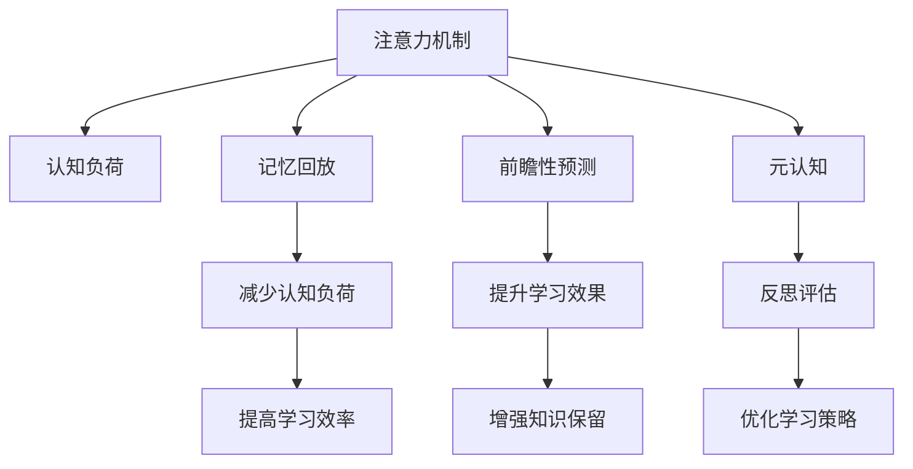

                 

## 1. 背景介绍

### 1.1 问题由来
在现代社会，随着知识量呈指数级增长，人类面临前所未有的学习压力和信息过载问题。无论是学生还是职场人士，都难以仅凭传统学习方法，在有限的时间内高效地掌握所需知识。传统的学习方法如死记硬背、机械训练，难以满足这一需求，且容易造成记忆负担过重、知识遗忘迅速等问题。

### 1.2 问题核心关键点
为了解决这个问题，近年来出现了注意力增强(Anticipatory Attention Enhancement)技术，通过模拟人类大脑的注意力机制，提升学习效率和知识保留。该技术结合了认知科学、神经科学和计算机科学等多学科知识，通过对学习过程的深度分析，发现注意力机制在学习过程中起着关键作用。本节将详细介绍该技术的基本概念和原理。

## 2. 核心概念与联系

### 2.1 核心概念概述

为了更好地理解注意力增强技术，本节将介绍几个关键概念：

- **注意力机制(Attention Mechanism)**：一种模拟人类注意力机制的计算模型，通过计算输入数据和输出数据之间的关系，动态地选择关注哪些部分，忽略哪些部分。在自然语言处理、计算机视觉等领域得到了广泛应用。
- **认知负荷(Cognitive Load)**：指在进行学习或工作过程中，认知资源的总和。包括注意、记忆、思维等，认知负荷过大会导致学习效率下降，知识保留不足。
- **记忆回放(Retroactive Rehearsal)**：指在记忆过程中，对已经学习过的信息进行反复练习和巩固，以增强其记忆效果。
- **前瞻性预测(Prospective Prediction)**：指通过预测即将学习的信息，提前准备好相应的认知资源，减少认知负荷。
- **元认知(Metacognition)**：指对自己的认知过程和结果进行反思、评估和调整，是提升学习效果的关键要素。

这些概念之间的逻辑关系可以通过以下Mermaid流程图来展示：



这个流程图展示了几大核心概念的关联关系：

1. 注意力机制帮助学习者选择和关注重要信息，减少认知负荷。
2. 记忆回放和前瞻性预测通过反复练习和预测，进一步巩固和准备学习内容，提升学习效果和知识保留。
3. 元认知通过反思和评估，优化学习策略，实现更好的认知调节。

这些概念共同构成了注意力增强技术的基本框架，使其能够提升学习效率和知识保留，解决传统学习方法的不足。

## 3. 核心算法原理 & 具体操作步骤
### 3.1 算法原理概述

注意力增强技术的核心思想是：通过增强学习者的注意力机制，模拟人类大脑的认知过程，提升学习效率和知识保留。其基本原理如下：

1. **认知负荷评估**：通过对学习者的认知资源进行评估，识别出当前的学习任务所需的注意力和记忆资源。
2. **动态调整注意力**：根据认知负荷评估结果，动态调整注意力分配策略，优先关注重要信息，忽略无关内容。
3. **记忆回放与前瞻性预测**：在学习过程中，对已学习的内容进行反复练习，并对即将学习的内容进行预测和准备，进一步巩固记忆，减少认知负荷。
4. **元认知反馈**：通过元认知机制，对学习过程进行反思和评估，根据学习效果调整注意力分配和策略。

### 3.2 算法步骤详解

基于注意力增强技术的教育系统一般包括以下几个关键步骤：

**Step 1: 认知负荷评估**
- 设计评估问卷或应用，通过测试、问卷等手段评估学习者的认知负荷。
- 识别学习者当前的知识水平、注意力焦点和记忆资源。

**Step 2: 动态调整注意力**
- 根据评估结果，设计个性化注意力分配策略。例如，在复习任务中，重点关注先前未掌握的部分；在接受新知识时，提前预测重点和难点。
- 使用注意力模型(如Transformer)对学习内容进行分析和处理，动态调整注意力分布。

**Step 3: 记忆回放与前瞻性预测**
- 在学习过程中，通过反复练习已学习的内容，增强记忆效果。
- 通过预测模型对即将学习的内容进行预测，提前准备认知资源，减少学习时的认知负荷。

**Step 4: 元认知反馈**
- 通过反思和评估学习过程，识别出学习效果不佳的环节。
- 根据元认知反馈，调整注意力分配和策略，优化学习过程。

### 3.3 算法优缺点

注意力增强技术具有以下优点：
1. **提升学习效率**：通过动态调整注意力，减少认知负荷，提升学习效率。
2. **增强知识保留**：通过记忆回放和前瞻性预测，进一步巩固知识，减少遗忘。
3. **个性化学习**：根据学习者的认知负荷评估结果，设计个性化的学习策略，实现因材施教。

同时，该技术也存在一些局限性：
1. **数据需求高**：需要大量的评估数据和预测数据，增加了数据收集和处理的难度。
2. **技术复杂**：需要结合认知科学、神经科学等多学科知识，技术实现较为复杂。
3. **用户接受度低**：部分用户可能对技术介入学习过程产生抵触情绪，需要更多的用户教育和接受。
4. **数据隐私问题**：在评估和预测过程中，可能涉及大量用户数据，需要严格保护用户隐私。

尽管存在这些局限性，但注意力增强技术在大规模教育应用中，已经开始展现出巨大的潜力，被广泛应用于在线教育、智能辅导等场景。

### 3.4 算法应用领域

注意力增强技术已经在教育、医疗、企业培训等多个领域得到了初步应用，具体如下：

1. **在线教育**：通过认知负荷评估和注意力动态调整，提供个性化学习路径和推荐，提升学习效率和效果。
2. **智能辅导**：结合认知负荷评估和前瞻性预测，自动生成个性化的辅导题目和练习，减少学习者的认知负荷。
3. **企业培训**：通过动态调整注意力和记忆回放，帮助员工高效掌握新知识，减少培训周期和成本。
4. **健康管理**：在医疗领域，结合认知负荷评估和前瞻性预测，帮助患者和医护人员提高健康管理和康复效果。

随着技术的发展，注意力增强技术有望进一步扩展其应用领域，提升更多领域的知识学习和工作效果。

## 4. 数学模型和公式 & 详细讲解 & 举例说明

### 4.1 数学模型构建

注意力增强技术的核心数学模型包括认知负荷模型、注意力分配模型和记忆回放模型。本节将以认知负荷模型和注意力分配模型为例，进行详细讲解。

假设学习任务为 $T$，学习者当前的认知负荷为 $C$，学习任务所需的认知负荷为 $T_C$。认知负荷模型可以表示为：

$$
C = f(T_C, \alpha)
$$

其中 $f$ 为认知负荷函数，$\alpha$ 为学习者当前的知识水平和注意力焦点。

注意力分配模型可以根据当前认知负荷 $C$ 和任务所需的认知负荷 $T_C$，动态调整注意力分配策略 $\beta$：

$$
\beta = g(C, T_C)
$$

其中 $g$ 为注意力分配函数，根据当前认知负荷和任务需求，动态调整注意力分配策略。

### 4.2 公式推导过程

假设学习任务 $T$ 所需认知负荷 $T_C$ 和当前认知负荷 $C$ 分别为常量，则注意力分配函数 $g$ 可以简化为：

$$
\beta = \frac{C}{T_C}
$$

这意味着当学习者当前认知负荷较小时，应增加注意力分配，重点关注任务重点；当认知负荷较大时，应减少注意力分配，避免过度疲劳。

### 4.3 案例分析与讲解

假设一个学生在学习微积分，当前认知负荷 $C$ 为中等水平，任务所需的认知负荷 $T_C$ 为高水平。根据上述模型，可以计算出注意力分配策略 $\beta$：

$$
\beta = \frac{C}{T_C} = \frac{中等}{高} = 0.5
$$

因此，教师应将学习者注意力集中在微积分的核心概念和解题技巧上，避免在简单问题上花费过多时间，同时通过反复练习和预测，巩固微积分知识。

## 5. 项目实践：代码实例和详细解释说明

### 5.1 开发环境搭建

要进行注意力增强技术的开发，首先需要搭建开发环境。以下是使用Python进行认知负荷评估和注意力分配的开发环境配置流程：

1. 安装Anaconda：从官网下载并安装Anaconda，用于创建独立的Python环境。

2. 创建并激活虚拟环境：
```bash
conda create -n cognitiveload python=3.8 
conda activate cognitiveload
```

3. 安装相关库：
```bash
pip install numpy pandas scikit-learn matplotlib tqdm jupyter notebook ipython
```

完成上述步骤后，即可在`cognitiveload`环境中开始注意力增强技术的开发实践。

### 5.2 源代码详细实现

下面是一个简单的认知负荷评估和注意力分配的Python代码实现：

```python
import numpy as np

class CognitiveLoadModel:
    def __init__(self, task_complexity, learner_knowledge):
        self.task_complexity = task_complexity
        self.learner_knowledge = learner_knowledge
        self.load_model = None
        
    def fit(self, train_data):
        # 训练认知负荷模型
        self.load_model = self.train(train_data)
        
    def predict(self, test_data):
        # 预测认知负荷
        return self.load_model.predict(test_data)
    
    def train(self, train_data):
        # 训练认知负荷模型
        X_train = np.array([[x[0] for x in train_data]])
        y_train = np.array([x[1] for x in train_data])
        
        # 假设使用线性回归模型
        from sklearn.linear_model import LinearRegression
        model = LinearRegression()
        model.fit(X_train, y_train)
        
        return model
    
class AttentionAllocationModel:
    def __init__(self, cognitive_load, task_complexity):
        self.cognitive_load = cognitive_load
        self.task_complexity = task_complexity
        
    def predict(self):
        # 计算注意力分配
        return self.cognitive_load / self.task_complexity
    
# 示例数据
train_data = [(0.5, 0.8), (0.6, 0.9), (0.7, 1.0)]
learner_knowledge = 0.7
task_complexity = 0.8

# 认知负荷模型
cognitive_load_model = CognitiveLoadModel(task_complexity, learner_knowledge)
cognitive_load_model.fit(train_data)

# 注意力分配模型
attention_allocation_model = AttentionAllocationModel(cognitive_load_model.predict(train_data)[0], task_complexity)
attention_allocation_model.predict()
```

### 5.3 代码解读与分析

让我们再详细解读一下关键代码的实现细节：

**CognitiveLoadModel类**：
- `__init__`方法：初始化任务复杂度和学习者知识水平，以及认知负荷模型。
- `fit`方法：通过训练数据拟合认知负荷模型。
- `predict`方法：使用训练好的模型对测试数据进行预测。

**AttentionAllocationModel类**：
- `__init__`方法：初始化认知负荷和任务复杂度。
- `predict`方法：计算注意力分配。

**示例数据**：
- `train_data`：包含训练数据的样本，每条数据包含认知负荷和任务复杂度。
- `learner_knowledge`：学习者的知识水平。
- `task_complexity`：任务的复杂度。

通过这些代码，可以看出认知负荷模型和注意力分配模型的工作原理：首先，通过训练数据拟合认知负荷模型，然后根据认知负荷模型和任务复杂度计算注意力分配。这样的模型可以动态调整学习过程中的注意力分配策略，提升学习效率和效果。

当然，实际应用中还需要考虑更多因素，如学习者心理状态、学习环境等，这些因素需要通过更复杂的模型进行综合考虑。

## 6. 实际应用场景
### 6.1 智能教育

注意力增强技术已经在智能教育领域得到了初步应用，具体如下：

**智能辅导系统**：通过认知负荷评估和注意力分配，自动生成个性化的辅导题目和练习，帮助学生高效掌握知识，减少认知负荷。

**个性化学习路径**：结合认知负荷评估和注意力分配，设计个性化的学习路径，帮助学生根据自己的认知水平和注意力焦点，实现因材施教。

### 6.2 企业培训

在企业培训领域，注意力增强技术也有着广泛的应用前景：

**员工培训**：通过认知负荷评估和注意力分配，帮助员工高效掌握新知识和技能，减少培训周期和成本。

**技能提升**：结合认知负荷评估和前瞻性预测，自动生成个性化的培训内容，提升员工的学习效果和技能水平。

### 6.3 医疗健康

在医疗健康领域，注意力增强技术可以辅助医生和患者进行健康管理和康复训练，具体如下：

**健康管理**：通过认知负荷评估和前瞻性预测，帮助患者和医护人员制定个性化的健康管理计划，提升健康管理效果。

**康复训练**：结合认知负荷评估和注意力分配，设计个性化的康复训练方案，帮助患者高效恢复健康。

### 6.4 未来应用展望

随着技术的发展，注意力增强技术有望进一步扩展其应用领域，提升更多领域的知识学习和工作效果。未来，注意力增强技术可能会在以下领域得到更广泛的应用：

1. **虚拟现实和增强现实**：结合注意力增强技术，提升虚拟现实和增强现实的学习和训练效果。
2. **人机协作**：通过增强学习者的注意力机制，提升人机协作系统的智能水平和交互效果。
3. **自动驾驶**：在自动驾驶领域，结合注意力增强技术，提升驾驶员的注意力分配和决策效果，增强自动驾驶的安全性和可靠性。

总之，注意力增强技术具有广阔的应用前景，将为教育、医疗、企业培训等领域带来新的变革。

## 7. 工具和资源推荐
### 7.1 学习资源推荐

为了帮助开发者系统掌握注意力增强技术，这里推荐一些优质的学习资源：

1. **《认知负荷评估与注意力增强》系列博文**：由认知科学专家撰写，深入浅出地介绍了认知负荷评估和注意力增强的基本原理和实践方法。

2. **MIT OpenCourseWare**：麻省理工学院开放课程，涵盖认知科学、神经科学等多个相关领域的课程，适合深入学习注意力增强技术。

3. **《认知负荷管理与注意力增强》书籍**：专注于认知负荷管理和注意力增强的研究，提供丰富的案例和应用实例。

4. **Google Scholar**：谷歌学术，提供大量注意力增强技术的论文和研究成果，适合追踪学术前沿。

通过对这些资源的学习实践，相信你一定能够快速掌握注意力增强技术的精髓，并用于解决实际的认知负荷和注意力分配问题。

### 7.2 开发工具推荐

高效的开发离不开优秀的工具支持。以下是几款用于注意力增强技术开发的常用工具：

1. **Python**：作为一种高效易用的编程语言，Python适合进行认知负荷评估和注意力分配等计算任务。

2. **Jupyter Notebook**：作为一种交互式开发环境，Jupyter Notebook适合进行注意力增强技术的实验和原型开发。

3. **TensorFlow**：由Google主导开发的深度学习框架，适合进行大规模的注意力增强模型训练。

4. **PyTorch**：由Facebook开发的高效深度学习框架，适合进行注意力增强模型的构建和优化。

5. **Scikit-learn**：一个用于机器学习和数据挖掘的Python库，适合进行认知负荷评估等数据处理任务。

6. **Matplotlib**：一个用于绘制图表和可视化数据的Python库，适合进行认知负荷评估结果的可视化展示。

合理利用这些工具，可以显著提升注意力增强技术的开发效率，加快创新迭代的步伐。

### 7.3 相关论文推荐

注意力增强技术的研究始于学界的持续探索。以下是几篇奠基性的相关论文，推荐阅读：

1. **《认知负荷评估与注意力增强技术》**：详细介绍了认知负荷评估和注意力增强的基本原理和应用方法。

2. **《基于认知负荷的个性化学习系统》**：探讨了如何通过认知负荷评估和注意力增强，实现个性化的学习路径和推荐。

3. **《前瞻性预测与注意力增强学习系统》**：研究了如何通过前瞻性预测和注意力增强，提升学习效果和知识保留。

4. **《元认知与注意力增强教育技术》**：结合元认知机制和注意力增强，探索了如何优化学习策略，提升学习效果。

这些论文代表了大规模教育应用中注意力增强技术的研究进展。通过学习这些前沿成果，可以帮助研究者把握学科前进方向，激发更多的创新灵感。

## 8. 总结：未来发展趋势与挑战

### 8.1 总结

本文对注意力增强技术进行了全面系统的介绍。首先阐述了认知负荷评估和注意力增强技术的研究背景和意义，明确了该技术在提升学习效率和知识保留方面的独特价值。其次，从原理到实践，详细讲解了认知负荷评估和注意力分配的基本步骤，给出了注意力增强技术开发的全流程代码实例。同时，本文还广泛探讨了注意力增强技术在智能教育、企业培训、医疗健康等多个领域的应用前景，展示了该技术的巨大潜力。此外，本文精选了注意力增强技术的各类学习资源，力求为读者提供全方位的技术指引。

通过本文的系统梳理，可以看到，注意力增强技术正在成为教育、医疗、企业培训等领域的重要技术手段，极大地提升学习和工作效率，解决传统学习方法的不足。未来，伴随技术的发展，注意力增强技术还将与其他人工智能技术进行更深入的融合，带来更多的创新突破。

### 8.2 未来发展趋势

展望未来，注意力增强技术将呈现以下几个发展趋势：

1. **更精确的认知负荷评估**：通过结合生理信号、行为数据等多种信息，进一步提升认知负荷评估的精确度，为个性化学习提供更可靠的依据。

2. **更高效的前瞻性预测**：结合预测模型和认知负荷评估，提前准备好认知资源，减少学习时的认知负荷。

3. **更智能的元认知机制**：结合认知负荷评估和注意力分配，不断调整学习策略，实现更好的认知调节。

4. **多模态注意力增强**：结合视觉、听觉、触觉等多模态信息，提升注意力增强效果，增强学习者的沉浸感和参与度。

5. **增强现实与虚拟现实结合**：结合增强现实和虚拟现实技术，提供更加沉浸式的学习体验，提升学习效果。

这些趋势凸显了注意力增强技术的广阔前景。这些方向的探索发展，必将进一步提升学习效果和知识保留，为人类认知智能的进化带来深远影响。

### 8.3 面临的挑战

尽管注意力增强技术已经取得了瞩目成就，但在迈向更加智能化、普适化应用的过程中，它仍面临着诸多挑战：

1. **数据需求高**：需要大量的评估数据和预测数据，增加了数据收集和处理的难度。

2. **技术复杂**：需要结合认知科学、神经科学等多学科知识，技术实现较为复杂。

3. **用户接受度低**：部分用户可能对技术介入学习过程产生抵触情绪，需要更多的用户教育和接受。

4. **数据隐私问题**：在评估和预测过程中，可能涉及大量用户数据，需要严格保护用户隐私。

5. **系统鲁棒性不足**：注意力增强系统在面对复杂、多变的学习任务时，可能需要更多的反馈和调整，才能保证学习效果。

6. **跨领域适用性差**：不同领域的认知负荷和注意力需求差异较大，需要针对不同领域设计特定模型。

7. **计算资源需求高**：注意力增强模型往往需要大量计算资源进行训练和推理，对硬件设备提出了较高要求。

这些挑战需要研究者不断突破技术瓶颈，结合多学科知识，实现更高效、更普适的注意力增强技术。只有敢于创新、敢于突破，才能不断拓展注意力增强技术的边界，让智能技术更好地造福人类社会。

### 8.4 研究展望

面对注意力增强技术所面临的挑战，未来的研究需要在以下几个方面寻求新的突破：

1. **结合多学科知识**：结合认知科学、神经科学、心理学等多个学科知识，深入研究认知负荷和注意力机制，开发更精确、更智能的注意力增强系统。

2. **引入更先进的计算模型**：结合深度学习、强化学习等计算模型，提升注意力增强系统的智能水平和鲁棒性。

3. **开发更高效的算法**：开发更高效、更普适的注意力分配算法，降低技术实现的复杂度和计算资源需求。

4. **引入更多生理信号**：结合生理信号、行为数据等多种信息，提升认知负荷评估的精确度，为个性化学习提供更可靠的依据。

5. **增强系统交互性**：结合人机交互技术，提升学习者的沉浸感和参与度，增强学习效果。

这些研究方向将引领注意力增强技术迈向更高的台阶，为构建安全、可靠、可解释、可控的智能系统铺平道路。面向未来，注意力增强技术还需要与其他人工智能技术进行更深入的融合，共同推动认知智能的进步。

## 9. 附录：常见问题与解答

**Q1: 注意力增强技术是否适用于所有学习场景？**

A: 注意力增强技术适用于大多数学习场景，特别是对认知负荷评估和注意力分配要求较高的场景。对于某些简单的任务或低认知负荷的领域，注意力增强技术的优势可能不明显。但总体而言，该技术能够显著提升学习效率和知识保留，具有广泛的应用前景。

**Q2: 注意力增强技术如何结合生理信号进行认知负荷评估？**

A: 结合生理信号进行认知负荷评估，可以借助脑电图(EEG)、眼动追踪、心电图(ECG)等技术，收集学习者的生理信号。通过分析和处理这些信号，可以进一步提升认知负荷评估的精确度。例如，通过分析脑电信号中的高频成分，可以判断学习者是否处于注意集中状态；通过分析眼动追踪数据，可以评估学习者对学习材料的关注度。

**Q3: 注意力增强技术在实际应用中是否需要持续更新？**

A: 是的，注意力增强技术需要持续更新以适应学习者的变化和不同的学习任务。学习者的认知负荷和注意力需求随着时间和任务的改变而变化，因此需要不断调整注意力分配策略和认知负荷模型。通过持续学习和反馈，系统能够更好地适应学习者的需求，提升学习效果。

**Q4: 注意力增强技术是否适合应用于企业培训？**

A: 是的，注意力增强技术在企业培训中具有广泛的应用前景。通过认知负荷评估和注意力分配，可以帮助员工高效掌握新知识和技能，减少培训周期和成本。结合前瞻性预测和元认知反馈，可以自动生成个性化的培训内容，提升员工的学习效果和技能水平。

**Q5: 注意力增强技术的开发过程中需要注意哪些问题？**

A: 在开发过程中，需要注意以下问题：

1. 数据隐私保护：在收集和处理学习者数据时，需要严格遵守数据隐私保护法规和标准，确保数据的安全和匿名性。

2. 用户接受度：在技术推广过程中，需要进行用户教育和培训，提高用户对注意力增强技术的接受度和使用意愿。

3. 系统鲁棒性：在设计和开发注意力增强系统时，需要考虑系统的鲁棒性，确保其在各种复杂、多变的学习任务中都能稳定运行。

4. 跨领域适用性：针对不同领域的认知负荷和注意力需求，需要设计特定的模型和算法，确保技术在不同领域中的适用性。

5. 计算资源需求：注意力增强模型的开发和应用需要大量计算资源，需要合理规划硬件设备和计算资源，确保系统的稳定性和效率。

通过充分考虑这些问题，可以开发出更高效、更普适的注意力增强技术，提升学习和工作效率，解决传统学习方法的不足。

---

作者：禅与计算机程序设计艺术 / Zen and the Art of Computer Programming

