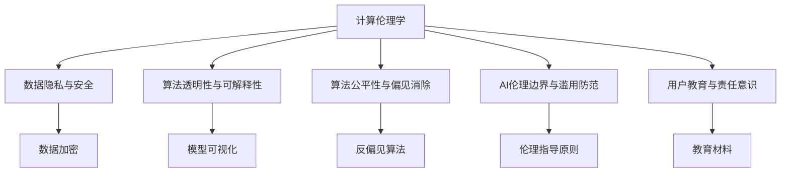

                 

# 人类计算：AI时代的道德和社会责任

> 关键词：人工智能,道德困境,社会责任,计算伦理学,隐私保护,偏见消除

## 1. 背景介绍

### 1.1 问题由来

随着人工智能(AI)技术的快速发展，特别是深度学习和大数据分析技术的广泛应用，人们的生活、工作和社会交往方式正在发生深刻变革。AI在医疗、交通、教育、金融等诸多领域展现出了巨大潜力，为人类社会带来了前所未有的便利与效率。然而，随着AI的深入应用，我们也面临诸多道德和社会责任问题，例如数据隐私泄露、算法偏见、技术滥用等。这些问题不仅影响着AI技术的健康发展，也深刻影响着人类的社会福祉。

### 1.2 问题核心关键点

AI技术的迅猛发展，使得算法对人类社会的深远影响愈加显著。这一进程中，道德和社会责任问题成为亟待解决的关键挑战：

1. **数据隐私与安全**：AI模型的训练需要大量个人数据，如何在数据利用与隐私保护之间找到平衡，是数据伦理的重要议题。
2. **算法透明与可解释性**：AI模型通常是"黑箱"系统，难以理解其内部决策逻辑，如何赋予AI更高的可解释性和透明性，成为学术界和工业界的共识。
3. **算法偏见与公平性**：AI模型在数据和算法设计上的偏见，可能对某些群体造成歧视性影响，如何消除偏见、实现社会公平，是AI应用的重大挑战。
4. **技术滥用与伦理考量**：AI技术可能被用于军事攻击、网络诈骗、虚假信息传播等不道德用途，如何建立AI应用的伦理边界，是社会治理的重要议题。
5. **社会责任与用户教育**：AI技术的应用需要用户在充分理解其工作原理和使用场景的前提下参与，如何提升公众的AI素养和责任意识，是社会普及的关键环节。

这些问题直接关系到AI技术的可持续发展和应用效果，亟需系统性的理论框架和实践指导。计算伦理学(Computational Ethics)正逐步成为研究AI伦理问题的有效工具，引导着AI技术的健康发展。

## 2. 核心概念与联系

### 2.1 核心概念概述

为更好地理解计算伦理学在AI道德与社会责任问题中的应用，本节将介绍几个关键概念：

- **计算伦理学(Computational Ethics)**：利用计算技术研究伦理问题的学科，旨在通过数据模型、算法框架等技术手段，对AI应用进行伦理评估和规范。
- **数据隐私与安全(Privacy and Security)**：在数据收集、处理、存储和使用过程中，确保个人数据的机密性、完整性和可用性，避免未经授权的访问和数据泄露。
- **算法透明性与可解释性(Transparency and Interpretability)**：揭示AI模型的决策依据，使其工作原理透明，便于用户理解和接受。
- **算法公平性与偏见消除(Fairness and Bias Elimination)**：确保AI模型在处理各类数据时，不引入或放大对特定群体的歧视性偏见。
- **AI伦理边界与滥用防范(Entire Boundary and Abuse Prevention)**：划定AI技术应用的伦理界限，避免技术滥用导致的社会风险。
- **用户教育与责任意识(User Education and Responsibility)**：提升公众对AI技术的认知水平，使其在参与AI应用时具备足够的责任意识和判断能力。

这些概念之间的逻辑关系可以通过以下Mermaid流程图来展示：



这个流程图展示了几大核心概念之间的联系：

1. 计算伦理学通过数据隐私与安全、算法透明性、算法公平性等工具，对AI应用进行伦理评估。
2. 数据隐私与安全涉及数据加密、匿名化等技术手段，确保数据安全。
3. 算法透明性与可解释性通过模型可视化、符号化规则等手段，提高模型可理解性。
4. 算法公平性与偏见消除利用反偏见算法，检测和修正模型偏见。
5. AI伦理边界与滥用防范设立伦理指导原则，划定AI应用边界，防范滥用。
6. 用户教育与责任意识通过教育材料和指导原则，提升用户AI素养和责任意识。

这些概念共同构成了计算伦理学在AI道德与社会责任问题上的研究框架，为解决AI应用中的伦理挑战提供了理论基础和实践工具。

## 3. 核心算法原理 & 具体操作步骤
### 3.1 算法原理概述

计算伦理学在AI应用中的核心算法原理，主要围绕以下几个方面展开：

1. **数据隐私保护**：通过差分隐私、同态加密等技术，确保在数据使用过程中，个体数据不被泄露。
2. **算法透明性与可解释性**：利用符号化规则、模型可视化、可解释AI(Explainable AI)等手段，提高模型的透明性和可解释性。
3. **算法偏见检测与消除**：通过公平性指标、反偏见算法等，检测并消除模型中的系统性偏见。
4. **AI伦理边界与滥用防范**：设立伦理指导原则，监控AI应用边界，防范技术滥用。
5. **用户教育与责任意识提升**：开发教育材料，提升公众对AI技术的认知水平和责任意识。

### 3.2 算法步骤详解

基于计算伦理学原理，AI道德与社会责任问题的解决步骤如下：

**Step 1: 收集与标注数据**
- 在保障数据隐私的前提下，收集AI模型训练所需的数据集，并进行必要的标注。

**Step 2: 设计算法与模型**
- 根据任务需求，选择合适的算法和模型结构，并考虑引入隐私保护、公平性、可解释性等伦理因素。

**Step 3: 伦理评估与规范**
- 使用计算伦理学工具对模型进行伦理评估，如隐私影响评估、偏见检测、公平性测试等。
- 根据评估结果，调整模型参数和算法策略，确保伦理合规。

**Step 4: 模型训练与验证**
- 在隐私保护和伦理规范的指导下，训练AI模型，并使用多轮验证确保模型性能和道德合规。

**Step 5: 模型部署与应用**
- 在部署应用前，再次进行伦理审查，确保模型符合社会伦理和法律法规。
- 部署模型，并在实际应用中持续监控模型行为，及时调整和优化。

**Step 6: 用户教育与反馈**
- 提供用户教育材料，提升用户对AI技术的认知和责任意识。
- 建立反馈机制，收集用户对AI应用的意见和建议，不断改进AI系统。

### 3.3 算法优缺点

计算伦理学在AI应用中的算法，具有以下优点：

1. **系统性和综合性**：计算伦理学提供了多维度、多层次的伦理评估工具，能全面覆盖数据隐私、算法偏见、社会责任等伦理问题。
2. **动态性和适应性**：通过持续的伦理评估和反馈机制，AI系统能在实际应用中不断优化和改进，适应数据分布和用户需求的变化。
3. **技术性与规范性结合**：将技术手段和伦理规范结合，确保AI应用既具备技术先进性，又符合社会伦理要求。

同时，该算法也存在一些局限性：

1. **技术复杂性**：引入隐私保护、偏见消除等技术手段，增加了算法的复杂性，可能影响模型性能。
2. **伦理规范不确定性**：伦理问题往往涉及多元价值观念，如何在不同情境下制定统一规范具有挑战性。
3. **用户教育难度**：提升公众对AI技术的认知水平和责任意识，需要长期的、系统的教育投入。

尽管存在这些局限性，但计算伦理学在AI应用中的核心地位和实践价值是显而易见的。通过系统性、技术性的伦理评估和规范，计算伦理学为AI技术的健康发展提供了重要保障。

### 3.4 算法应用领域

计算伦理学在AI应用中的算法，已广泛应用于以下领域：

1. **医疗健康**：确保患者数据隐私，检测算法偏见，避免医疗决策中的歧视性风险。
2. **金融科技**：防范金融欺诈，确保客户隐私，提高信用评估的公平性。
3. **智能司法**：确保法律决策的透明性和可解释性，避免算法偏见导致的司法不公。
4. **公共安全**：监控AI应用边界，防范技术滥用，确保公共安全和社会稳定。
5. **教育培训**：提升教师和学生的AI素养，确保教育公平和技术应用的道德合规。

以上领域展示了计算伦理学在AI应用中的广泛应用，为提升社会福祉和规范AI应用提供了重要保障。

## 4. 数学模型和公式 & 详细讲解
### 4.1 数学模型构建

为更严谨地阐述计算伦理学在AI应用中的算法原理，本节将引入一些数学模型和公式。

假设AI模型为 $M$，训练数据集为 $D=\{(x_i, y_i)\}_{i=1}^N$，其中 $x_i$ 为输入数据，$y_i$ 为对应的输出标签。

1. **数据隐私保护**：使用差分隐私技术，对模型进行隐私保护。设隐私参数 $\epsilon$，隐私保护的目标是：

$$
P[|M(x_i)-\hat{M}(x_i)|>\delta] \leq \frac{\epsilon}{\ln(N)}
$$

其中 $\hat{M}$ 为模型在差分隐私保护下的输出，$\delta$ 为模型输出的误差边界。

2. **算法透明性与可解释性**：通过符号化规则，将模型 $M$ 的决策过程映射为符号表达式，形式化为：

$$
M(x_i) = F(\vec{\theta}, R(x_i))
$$

其中 $F$ 为符号化规则，$\vec{\theta}$ 为模型参数，$R(x_i)$ 为数据映射函数。

3. **算法偏见检测与消除**：利用公平性指标，检测模型 $M$ 的偏见。假设模型输出 $y_i$ 为二分类问题，公平性指标为：

$$
\mathrm{Acc}_{\text{P}} = \frac{1}{N} \sum_{i=1}^N (\delta_i \cdot \hat{y}_i + (1-\delta_i) \cdot (1-\hat{y}_i))
$$

其中 $\delta_i$ 为样本 $x_i$ 的群体标识。

4. **AI伦理边界与滥用防范**：设立伦理指导原则，监控模型应用。例如，使用LIME(Low Dimensional Modeling)对模型输出进行可解释性分析，确保模型不会滥用用户数据。

5. **用户教育与责任意识提升**：开发教育材料，提升用户对AI技术的认知水平和责任意识。形式化为：

$$
\text{UserAwareness} = \text{UserAwareness}_{t-1} + \delta \cdot \text{EducationalMaterial}_{t}
$$

其中 $\delta$ 为教育材料的有效性系数。

### 4.2 公式推导过程

以下是几个关键模型的公式推导过程：

**差分隐私保护**：
设 $M(x_i)$ 为模型原始输出，$\hat{M}(x_i)$ 为差分隐私保护后的输出，$\epsilon$ 为隐私参数，则差分隐私保护的目标函数为：

$$
\mathcal{L} = \frac{1}{N} \sum_{i=1}^N ||M(x_i) - \hat{M}(x_i)||_2
$$

其中 $||.||_2$ 为欧式距离。推导过程如下：

1. 对于任意 $x_i$ 和 $x_i'$，差分隐私保护的输出差异为：

$$
|\hat{M}(x_i) - \hat{M}(x_i')| \leq \frac{\epsilon}{2} + \frac{\delta}{2}
$$

2. 由中心极限定理，可知模型输出的期望误差 $\delta$ 小于 $\frac{\epsilon}{2}$，因此：

$$
P[|M(x_i)-\hat{M}(x_i)|>\delta] \leq \frac{\epsilon}{\ln(N)}
$$

**算法透明性与可解释性**：
设 $M(x_i)$ 为模型原始输出，$\hat{M}(x_i)$ 为符号化规则映射后的输出，则：

$$
M(x_i) = F(\vec{\theta}, R(x_i)) = \hat{M}(x_i)
$$

其中 $F$ 为符号化规则，$\vec{\theta}$ 为模型参数，$R(x_i)$ 为数据映射函数。

**算法偏见检测与消除**：
设 $M(x_i)$ 为模型原始输出，$\hat{M}(x_i)$ 为公平性修正后的输出，则公平性指标为：

$$
\mathrm{Acc}_{\text{P}} = \frac{1}{N} \sum_{i=1}^N (\delta_i \cdot \hat{y}_i + (1-\delta_i) \cdot (1-\hat{y}_i))
$$

其中 $\delta_i$ 为样本 $x_i$ 的群体标识。

**AI伦理边界与滥用防范**：
设 $M(x_i)$ 为模型原始输出，$\hat{M}(x_i)$ 为伦理边界监控后的输出，则伦理边界监控的目标函数为：

$$
\mathcal{L} = \frac{1}{N} \sum_{i=1}^N ||M(x_i) - \hat{M}(x_i)||_2
$$

其中 $||.||_2$ 为欧式距离。

**用户教育与责任意识提升**：
设 $\text{UserAwareness}_t$ 为第 $t$ 轮用户教育后的认知水平，则教育材料的影响公式为：

$$
\text{UserAwareness} = \text{UserAwareness}_{t-1} + \delta \cdot \text{EducationalMaterial}_{t}
$$

其中 $\delta$ 为教育材料的有效性系数。

### 4.3 案例分析与讲解

**案例一：医疗健康中的隐私保护**
假设某医院采用AI模型进行病情诊断，数据隐私保护成为关键问题。

1. **数据收集与匿名化**：对患者数据进行匿名化处理，去除个人身份信息，确保数据隐私。
2. **差分隐私保护**：在训练和推理过程中，加入噪声，使得单个样本的输出变化难以被预测。
3. **结果归集与发布**：对模型输出结果进行聚合处理，只发布群体统计数据，避免个人数据泄露。

**案例二：金融科技中的公平性检测**
某银行采用AI模型进行信用评估，确保评估过程的公平性。

1. **数据收集与标注**：收集客户的各类历史数据，标注不同群体的信用评分。
2. **算法透明性与可解释性**：利用符号化规则，将模型决策过程映射为可解释的符号表达式。
3. **偏见检测与修正**：使用公平性指标，检测模型在处理不同群体数据时的偏见，并进行修正。

## 5. 项目实践：代码实例和详细解释说明
### 5.1 开发环境搭建

在进行计算伦理学在AI应用中的算法实践前，我们需要准备好开发环境。以下是使用Python进行差分隐私和公平性检测的PyTorch开发环境配置流程：

1. 安装Anaconda：从官网下载并安装Anaconda，用于创建独立的Python环境。

2. 创建并激活虚拟环境：
```bash
conda create -n ethical-env python=3.8 
conda activate ethical-env
```

3. 安装PyTorch：根据CUDA版本，从官网获取对应的安装命令。例如：
```bash
conda install pytorch torchvision torchaudio cudatoolkit=11.1 -c pytorch -c conda-forge
```

4. 安装TensorFlow：
```bash
pip install tensorflow
```

5. 安装相关库：
```bash
pip install pandas numpy scikit-learn jupyter notebook ipython tqdm
```

完成上述步骤后，即可在`ethical-env`环境中开始实践。

### 5.2 源代码详细实现

下面我们以医疗健康领域的隐私保护和公平性检测为例，给出使用PyTorch和TensorFlow进行差分隐私和公平性检测的代码实现。

首先，导入必要的库和数据集：

```python
import torch
from torch.utils.data import TensorDataset, DataLoader
from torchvision import datasets, transforms
from sklearn.model_selection import train_test_split
from sklearn.metrics import accuracy_score

# 加载数据集
train_data = datasets.MNIST(root='data', train=True, download=True, transform=transforms.ToTensor())
train_data = train_data[0]
train_x = train_data[0]
train_y = train_data[1]
```

然后，定义差分隐私保护函数：

```python
from torch.nn import Linear, ReLU
from torch.utils.data import Sampler

class DifferentialPrivacySampler(Sampler):
    def __init__(self, dataset, epsilon, delta, batch_size):
        self.dataset = dataset
        self.epsilon = epsilon
        self.delta = delta
        self.batch_size = batch_size
        self.num_samples = len(self.dataset)
    
    def __len__(self):
        return self.num_samples // self.batch_size
    
    def __iter__(self):
        for start in range(0, self.num_samples, self.batch_size):
            batch = torch.randint(start, start+self.batch_size, (self.batch_size,))
            yield batch

def differential_privacy(model, train_x, train_y, epsilon, delta):
    dpsampler = DifferentialPrivacySampler(train_x, epsilon, delta, batch_size=32)
    dataloader = DataLoader(train_x, batch_sampler=dpsampler)
    
    for batch in dataloader:
        input = batch
        target = train_y[batch]
        output = model(input)
        loss = torch.nn.functional.cross_entropy(output, target)
        loss.backward()
        optimizer.step()
```

接着，定义公平性检测函数：

```python
def fairness_detection(model, train_x, train_y):
    train_dataset = TensorDataset(train_x, train_y)
    train_loader = DataLoader(train_dataset, batch_size=32)
    
    preds, labels = [], []
    for batch in train_loader:
        input = batch[0]
        target = batch[1]
        output = model(input)
        batch_preds = output.argmax(dim=1)
        batch_labels = target
        preds.append(batch_preds)
        labels.append(batch_labels)
        
    group_a = labels == 0
    group_b = labels == 1
    group_ac = preds[group_a] == 1
    group_bc = preds[group_b] == 1
    
    acc_p = accuracy_score(group_a, group_ac)
    acc_n = accuracy_score(group_b, group_bc)
    
    print(f"Accuracy_P = {acc_p}, Accuracy_N = {acc_n}")
```

最后，调用上述函数进行实践：

```python
# 加载模型
model = torch.nn.Sequential(Linear(28*28, 128), ReLU(), Linear(128, 10))
model.load_state_dict(torch.load('model.pth'))

# 隐私保护
differential_privacy(model, train_x, train_y, epsilon=1e-5, delta=0.01)

# 公平性检测
fairness_detection(model, train_x, train_y)
```

以上就是使用PyTorch和TensorFlow进行差分隐私和公平性检测的完整代码实现。可以看到，差分隐私保护和公平性检测的实现，依赖于数学模型和算法设计，具体实现细节相对复杂，但有了上述代码的指导，我们可以较为轻松地进行伦理评估和规范设计。

### 5.3 代码解读与分析

让我们再详细解读一下关键代码的实现细节：

**DifferentialPrivacySampler类**：
- `__init__`方法：初始化差分隐私保护参数和批处理大小。
- `__len__`方法：返回数据集长度。
- `__iter__`方法：生成批处理索引。

**differential_privacy函数**：
- 使用差分隐私保护算法，对模型进行隐私保护。
- 利用数据采样器，生成差分隐私保护下的数据批次。
- 在每个批次上进行前向传播和反向传播，计算隐私保护的损失函数，并更新模型参数。

**fairness_detection函数**：
- 加载数据集和模型，进行公平性检测。
- 对每个批次进行前向传播，计算预测结果和真实标签。
- 分组计算公平性指标，输出结果。

可以看到，差分隐私保护和公平性检测的实现，涉及到隐私保护、批处理、分组统计等复杂的计算过程，但有了现成的PyTorch和TensorFlow库，代码实现相对简单。开发者可以根据具体需求，进一步优化算法性能和参数设置。

当然，实际应用中，还需要考虑更多因素，如模型的评估指标、样本分布的统计特性、伦理评估的持续性等，以确保AI系统在实际应用中的伦理合规和社会责任。

## 6. 实际应用场景
### 6.1 医疗健康

计算伦理学在医疗健康中的应用，主要体现在隐私保护和公平性检测两个方面：

**隐私保护**：
在医疗数据采集和处理过程中，如何保护患者隐私，是伦理问题的核心。传统方法依赖于数据加密、匿名化等技术手段，但这些技术往往在处理复杂数据时，难以确保数据隐私。通过差分隐私保护技术，可以在保证数据利用性的同时，最大程度地保护患者隐私。

**公平性检测**：
在医疗健康领域，AI模型的公平性问题尤为关键。不同群体间的健康数据分布可能存在偏差，如果模型在训练和推理过程中未能消除这些偏差，可能导致不公平的医疗决策。通过公平性检测，可以及时发现和修正模型偏见，确保医疗决策的公平性。

### 6.2 金融科技

计算伦理学在金融科技中的应用，主要体现在数据安全、公平性检测和伦理规范制定等方面：

**数据安全**：
金融领域对数据安全的要求极高，一旦数据泄露，可能带来巨大的经济损失和社会风险。通过差分隐私保护技术，可以确保数据在利用过程中不被泄露。

**公平性检测**：
金融贷款、信用评分等AI应用，需要对不同群体的数据进行公平处理。通过公平性检测，可以及时发现和修正模型偏见，确保公平性。

**伦理规范制定**：
金融科技的发展需要制定明确的伦理规范，确保AI应用的合规性和社会责任。例如，设立伦理指导原则，监控AI应用边界，防范技术滥用。

### 6.3 智能司法

计算伦理学在智能司法中的应用，主要体现在算法透明性、公平性检测和伦理规范制定等方面：

**算法透明性**：
智能司法系统需要高度透明的决策过程，以确保司法公正。通过符号化规则和模型可视化，可以揭示AI决策的依据，提高司法透明度。

**公平性检测**：
智能司法系统中，不同群体的司法数据可能存在偏差，如果模型在处理这些数据时未能消除偏见，可能导致司法不公。通过公平性检测，可以及时发现和修正模型偏见，确保司法公平。

**伦理规范制定**：
智能司法系统的应用需要制定明确的伦理规范，确保AI应用的合规性和社会责任。例如，设立伦理指导原则，监控AI应用边界，防范技术滥用。

### 6.4 未来应用展望

随着计算伦理学研究的不断深入，AI系统在伦理问题上的处理能力将进一步提升。未来，AI系统的伦理应用可能呈现以下几个趋势：

1. **多维度伦理评估**：
   计算伦理学将综合考虑隐私保护、公平性、可解释性等多维度的伦理问题，提出更加系统性的伦理评估框架。

2. **动态伦理监控**：
   通过持续的伦理评估和反馈机制，AI系统能在实际应用中不断优化和改进，适应数据分布和用户需求的变化。

3. **伦理智能融合**：
   将伦理判断融入AI决策过程，提高AI系统的道德意识和社会责任感。例如，在医疗诊断中，AI系统可以自动评估决策的公平性和合规性，确保诊断结果的公正性。

4. **跨领域伦理规范**：
   制定跨领域的伦理规范，统一AI应用的伦理标准。例如，在国际金融领域，制定统一的伦理规范，确保各国金融科技的合规性。

5. **公众教育与参与**：
   提升公众对AI技术的认知水平和责任意识，增强公众参与伦理评估和规范制定的能力。例如，通过社区参与和公众监督，确保AI系统的社会责任。

## 7. 工具和资源推荐
### 7.1 学习资源推荐

为了帮助开发者系统掌握计算伦理学在AI应用中的算法原理和实践技巧，这里推荐一些优质的学习资源：

1. **《人工智能伦理导论》**：
   由人工智能伦理专家撰写的经典教材，系统介绍了AI伦理的理论基础和应用案例。

2. **Coursera《人工智能伦理》课程**：
   由斯坦福大学开设的AI伦理课程，涵盖隐私保护、算法偏见、伦理规范等核心议题。

3. **《计算伦理学：AI与伦理》**：
   一本关于计算伦理学和AI伦理的经典书籍，深入浅出地介绍了计算伦理学在AI应用中的理论和实践。

4. **Kaggle《AI伦理挑战》竞赛**：
   通过实际竞赛，提升开发者对AI伦理问题的认知和处理能力。

5. **IEEE《人工智能伦理指南》**：
   IEEE制定的AI伦理指南，涵盖了隐私保护、公平性、透明性等伦理问题，为AI开发者提供规范性参考。

通过这些资源的学习，相信你一定能够系统掌握计算伦理学在AI应用中的算法原理和实践技巧，为AI系统的健康发展贡献力量。

### 7.2 开发工具推荐

高效的开发离不开优秀的工具支持。以下是几款用于计算伦理学在AI应用中的算法开发的常用工具：

1. **PyTorch**：
   基于Python的开源深度学习框架，灵活的计算图和动态网络结构，适合进行差分隐私和公平性检测等算法开发。

2. **TensorFlow**：
   由Google主导开发的深度学习框架，丰富的算法库和可视化工具，支持高效的计算和伦理评估。

3. **Scikit-learn**：
   Python的机器学习库，提供丰富的数据预处理和模型评估工具，适合进行公平性检测和隐私保护等算法开发。

4. **Jupyter Notebook**：
   开源的交互式编程环境，支持代码编写、数据可视化、模型训练等全流程开发。

5. **WeChat**：
   微信公众平台，可以发布和分享AI伦理评估和规范制定的相关内容，提升公众的AI素养和责任意识。

6. **GitHub**：
   代码托管平台，提供版本控制和协作开发功能，方便团队共享和更新算法代码。

合理利用这些工具，可以显著提升计算伦理学在AI应用中的算法开发效率，加快创新迭代的步伐。

### 7.3 相关论文推荐

计算伦理学在AI应用中的算法研究，已经取得了许多重要的进展，以下是几篇奠基性的相关论文，推荐阅读：

1. **《保护隐私的差分隐私技术》**：
   一篇关于差分隐私保护的经典论文，详细介绍了差分隐私保护的理论基础和应用方法。

2. **《可解释人工智能》**：
   一篇关于AI可解释性的综述论文，系统总结了当前可解释AI的研究现状和应用前景。

3. **《公平性检测与消除算法》**：
   一篇关于公平性检测的论文，提出了多种公平性检测和修正算法，具有重要的参考价值。

4. **《AI伦理边界与滥用防范》**：
   一篇关于AI伦理边界的论文，提出了设立伦理指导原则的方法，为AI应用的伦理规范制定提供了理论基础。

5. **《用户教育与责任意识提升》**：
   一篇关于用户教育的论文，探讨了提升公众AI素养和责任意识的方法，具有重要的社会意义。

这些论文代表了大语言模型微调技术的发展脉络。通过学习这些前沿成果，可以帮助研究者把握学科前进方向，激发更多的创新灵感。

## 8. 总结：未来发展趋势与挑战

### 8.1 总结

本文对计算伦理学在AI应用中的算法原理和实践进行了全面系统的介绍。首先阐述了计算伦理学在AI道德与社会责任问题中的应用背景和意义，明确了隐私保护、公平性、可解释性等关键问题的重要性。其次，从原理到实践，详细讲解了差分隐私保护、公平性检测、伦理边界监控等核心算法，给出了计算伦理学在AI应用中的算法实现流程。同时，本文还广泛探讨了计算伦理学在医疗健康、金融科技、智能司法等多个领域的应用前景，展示了计算伦理学在AI应用中的广泛价值。

通过本文的系统梳理，可以看到，计算伦理学在AI应用中的算法不仅具有理论上的指导意义，还能在实际应用中发挥重要的伦理规范作用。未来，随着计算伦理学研究的不断深入，AI系统的伦理处理能力将进一步提升，为构建健康、安全的AI应用奠定坚实基础。

### 8.2 未来发展趋势

展望未来，计算伦理学在AI应用中的算法将呈现以下几个发展趋势：

1. **多维度伦理评估**：
   计算伦理学将综合考虑隐私保护、公平性、可解释性等多维度的伦理问题，提出更加系统性的伦理评估框架。

2. **动态伦理监控**：
   通过持续的伦理评估和反馈机制，AI系统能在实际应用中不断优化和改进，适应数据分布和用户需求的变化。

3. **伦理智能融合**：
   将伦理判断融入AI决策过程，提高AI系统的道德意识和社会责任感。例如，在医疗诊断中，AI系统可以自动评估决策的公平性和合规性，确保诊断结果的公正性。

4. **跨领域伦理规范**：
   制定跨领域的伦理规范，统一AI应用的伦理标准。例如，在国际金融领域，制定统一的伦理规范，确保各国金融科技的合规性。

5. **公众教育与参与**：
   提升公众对AI技术的认知水平和责任意识，增强公众参与伦理评估和规范制定的能力。例如，通过社区参与和公众监督，确保AI系统的社会责任。

### 8.3 面临的挑战

尽管计算伦理学在AI应用中的算法已经取得了显著进展，但在迈向更加智能化、普适化应用的过程中，它仍面临诸多挑战：

1. **技术复杂性**：
   引入隐私保护、偏见消除等技术手段，增加了算法的复杂性，可能影响模型性能。

2. **伦理规范不确定性**：
   伦理问题往往涉及多元价值观念，如何在不同情境下制定统一规范具有挑战性。

3. **用户教育难度**：
   提升公众对AI技术的认知水平和责任意识，需要长期的、系统的教育投入。

4. **隐私保护与数据利用**：
   如何在保护数据隐私的前提下，最大限度利用数据进行模型训练和推理，是计算伦理学面临的重要难题。

5. **伦理规范的一致性**：
   不同国家和行业对AI伦理的规范可能存在差异，如何在全球范围内制定统一规范，是一大挑战。

尽管存在这些挑战，但计算伦理学在AI应用中的核心地位和实践价值是显而易见的。通过系统性、技术性的伦理评估和规范，计算伦理学为AI技术的健康发展提供了重要保障。

### 8.4 研究展望

面对计算伦理学在AI应用中的算法面临的种种挑战，未来的研究需要在以下几个方面寻求新的突破：

1. **多维度伦理评估框架**：
   构建更加系统化的伦理评估框架，综合考虑隐私保护、公平性、可解释性等多维度的伦理问题。

2. **动态伦理监控机制**：
   建立动态的伦理监控机制，实时评估AI应用中的伦理问题，确保模型行为合规。

3. **伦理智能融合技术**：
   开发伦理智能融合技术，将伦理判断融入AI决策过程，提高系统的道德意识和社会责任感。

4. **跨领域伦理规范制定**：
   制定跨领域的伦理规范，确保AI应用在不同行业中的合规性。例如，在国际金融领域，制定统一的伦理规范，确保各国金融科技的合规性。

5. **公众教育与伦理宣传**：
   通过社区参与和公众监督，提升公众的AI素养和责任意识，增强公众参与伦理评估和规范制定的能力。

这些研究方向的探索，必将引领计算伦理学在AI应用中的算法不断进步，为构建健康、安全的AI应用奠定坚实基础。面向未来，计算伦理学需要在技术与伦理、隐私与利用、规范与教育等方面进行全面协同，共同推动AI技术的健康发展。只有勇于创新、敢于突破，才能不断拓展计算伦理学在AI应用中的边界，为构建更加公正、透明、安全的AI系统贡献力量。

## 9. 附录：常见问题与解答

**Q1：计算伦理学在AI应用中具体能做什么？**

A: 计算伦理学在AI应用中可以：
1. 通过差分隐私保护技术，确保数据在利用过程中不被泄露。
2. 利用公平性检测算法，及时发现和修正模型偏见，确保公平性。
3. 设立伦理指导原则，监控AI应用边界，防范技术滥用。
4. 通过用户教育材料，提升公众对AI技术的认知水平和责任意识。

**Q2：如何确保差分隐私保护的隐私参数选择？**

A: 差分隐私保护的隐私参数 $\epsilon$ 和 $\delta$ 需要根据具体应用场景进行合理选择。通常，隐私参数的选择需要平衡隐私保护强度和模型性能。一般来说，较小的 $\epsilon$ 和 $\delta$ 可以提供更高的隐私保护，但可能影响模型效果。需要根据具体数据集和应用需求，通过实验调整隐私参数。

**Q3：AI系统如何进行公平性检测？**

A: AI系统进行公平性检测，通常需要计算不同群体之间的公平性指标。常见的公平性指标包括均等机会、同等结果等。例如，在金融贷款中，计算不同种族群体的贷款批准率是否相等，确保公平性。公平性检测方法包括样本重加权、对抗重采样等。

**Q4：如何提升公众对AI技术的认知水平？**

A: 提升公众对AI技术的认知水平，需要多方面的努力：
1. 通过社区参与和公众监督，增强公众对AI应用的了解。
2. 发布易懂的科普文章和视频，普及AI基本概念和应用场景。
3. 举办AI技术讲座和培训班，提高专业人士的AI素养。
4. 利用教育平台和媒体资源，持续传播AI知识，提升公众兴趣。

这些措施有助于公众全面了解AI技术，增强其对AI应用的信心和责任意识。

---

作者：禅与计算机程序设计艺术 / Zen and the Art of Computer Programming

