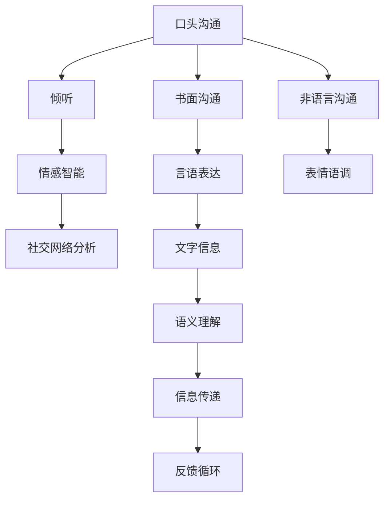

                 

# 人际沟通：人际沟通即与他人交换信息、交流感受、表达意思，包括口头沟通、书面沟通、非语言沟通、倾听

> 关键词：人际沟通, 口头沟通, 书面沟通, 非语言沟通, 倾听, 沟通模型, 情感智能, 社交网络分析

## 1. 背景介绍

### 1.1 问题由来
在现代信息社会中，人际沟通不仅仅是简单的信息传递，更是情绪表达、情感共鸣和社会关系构建的重要途径。随着技术的进步，尤其是互联网和社交媒体的普及，人与人之间的沟通方式发生了翻天覆地的变化。电子邮件、即时通讯、视频会议等在线工具，不仅使沟通变得更加便捷，也让信息传递更为高效。然而，在线沟通的种种便利，也可能带来沟通障碍和误解。如何在虚拟空间中更好地进行人际交流，减少信息丢失和情感扭曲，成为了一个亟待解决的问题。

### 1.2 问题核心关键点
人际沟通的核心在于信息的有效交换、情感的准确理解、意义的精确表达，以及对他人的积极倾听和反馈。在线沟通的挑战在于如何克服信息过载、情感表达不足、意义模糊等难题，同时保持沟通双方的情感共鸣和理解。本文将探讨人际沟通中的核心概念和实践方法，通过构建模型和算法，提升在线沟通的效果和效率。

### 1.3 问题研究意义
深入研究人际沟通技术，对于提升在线交流的互动性和质量，促进远程工作和学习，构建健康的人际关系，具有重要意义。通过改善在线沟通工具和平台，可以让人们在虚拟环境中更自然、更流畅地进行交流，减少误会和冲突，增强团队协作和个人发展。同时，对于提升社交媒体的用户体验，预防网络霸凌和假新闻的传播，也有积极的推动作用。

## 2. 核心概念与联系

### 2.1 核心概念概述

为了更好地理解人际沟通的原理和应用，本节将介绍几个密切相关的核心概念：

- **口头沟通**：指通过言语直接进行的人际交流。口头沟通包括口头表达和听力理解两个方面，是人际沟通中最直观、最灵活的形式。
- **书面沟通**：指通过文字进行的书面表达和阅读。书面沟通强调准确性和正式性，适用于需要长期保存或精确传达信息的场合。
- **非语言沟通**：指通过肢体语言、面部表情、语调等非言语手段进行的信息传递。非语言沟通在人际沟通中起到了辅助和补充作用。
- **倾听**：指接收和理解他人的言语信息，包括言语内容和情感状态。倾听不仅仅是被动接收信息，更是主动理解和回应。
- **社交网络分析**：通过对社交网络数据的分析，揭示人际互动的模式和规律，预测和优化社交关系。
- **情感智能**：指个体识别、理解、管理他人情感的能力，是提升人际沟通效果的重要手段。

这些核心概念之间的逻辑关系可以通过以下Mermaid流程图来展示：



这个流程图展示人际沟通的核心概念及其之间的关系：

1. 口头沟通是人际沟通的基本形式，通过言语直接进行交流。
2. 书面沟通是口头沟通的延伸，通过文字形式进行信息传递。
3. 非语言沟通与言语沟通相辅相成，通过肢体语言、面部表情、语调等补充情感和信息。
4. 倾听是口头沟通中不可或缺的一环，通过理解他人的言语内容，建立情感联系。
5. 情感智能用于提升倾听和理解他人的情感，优化沟通效果。
6. 社交网络分析通过分析社交网络数据，揭示人际互动的模式和规律。
7. 言语表达是书面沟通的核心，通过文字准确传达信息。
8. 表情语调与言语表达相配合，增强信息传递的效果。
9. 文字信息需要语义理解才能被正确传递和回应。
10. 信息传递需要反馈循环以确保沟通顺畅。

这些概念共同构成了人际沟通的框架，使沟通双方能够有效地交换信息、交流情感和建立关系。

## 3. 核心算法原理 & 具体操作步骤
### 3.1 算法原理概述

人际沟通的算法设计旨在提升沟通的效率和效果，减少信息丢失和误解。其主要原理包括：

- **信息提取与处理**：从口头或书面文本中提取关键信息，并进行语义理解和情感分析。
- **情感识别与调节**：通过分析言语和非言语信号，识别和理解他人的情感状态，并根据需要调整自己的表达和倾听策略。
- **反馈机制设计**：设计有效的反馈机制，确保信息被正确接收和理解，增强沟通的互动性和准确性。
- **模型训练与优化**：通过大量标注数据训练模型，提升其情感智能和沟通能力。

### 3.2 算法步骤详解

基于上述原理，下面详细介绍实现人际沟通的算法步骤：

**Step 1: 信息提取与处理**
- **文本预处理**：对文本进行分词、去除停用词、词性标注等预处理操作。
- **情感分析**：使用情感词典或机器学习模型，对文本进行情感极性分类。
- **意图识别**：通过意图分类模型，识别文本中的用户意图。

**Step 2: 情感识别与调节**
- **表情和语调分析**：利用机器视觉和音频处理技术，分析对方的表情和语调。
- **情感识别模型**：使用深度学习模型，如卷积神经网络(CNN)、循环神经网络(RNN)、Transformer等，对情感信号进行识别。
- **情感调节策略**：根据情感识别结果，调整表达方式和倾听策略，增强沟通效果。

**Step 3: 反馈机制设计**
- **即时反馈**：通过即时消息和表情符号，给予对方即时的情感反馈。
- **延时反馈**：在一定时间内总结和反思，调整沟通策略。
- **多轮对话模型**：设计多轮对话模型，跟踪对话历史，提高互动性。

**Step 4: 模型训练与优化**
- **标注数据获取**：收集大量标注数据，包括情感标签和用户意图。
- **模型构建与训练**：构建情感分析和意图识别模型，使用深度学习框架进行训练。
- **模型优化**：使用交叉验证和调参技术，优化模型性能。

### 3.3 算法优缺点

人际沟通算法具有以下优点：
1. 提升沟通效果：通过情感分析和意图识别，可以更准确地理解他人的需求和情感，从而提升沟通的互动性和准确性。
2. 减少误解和冲突：利用反馈机制，可以及时发现并纠正误解，减少沟通中的冲突和负面情绪。
3. 提高沟通效率：通过多轮对话模型，可以自动化地总结和回应，减少沟通双方的负担。

同时，该算法也存在以下缺点：
1. 依赖数据量：算法的准确性和效果高度依赖于标注数据的质量和数量，标注成本较高。
2. 复杂度高：深度学习模型的训练和优化复杂度较高，需要较高的计算资源。
3. 语境依赖：算法的效果受到沟通语境和上下文的影响，不同情境下的应用效果可能不同。
4. 隐私问题：需要处理大量的个人数据，可能涉及隐私和伦理问题。

尽管存在这些局限性，但就目前而言，基于情感分析和意图识别的算法范式已经成为提升人际沟通效果的重要手段。未来相关研究的重点在于如何进一步降低数据依赖，提高模型的泛化能力和鲁棒性，同时兼顾隐私和伦理问题。

### 3.4 算法应用领域

基于情感分析和意图识别的沟通算法，已经在多个领域得到应用，如客服、教育、医疗等：

- **客服**：通过情感分析，判断用户情绪状态，提供个性化服务。利用意图识别，理解用户需求，快速响应问题。
- **教育**：通过情感分析，评估学生的学习状态和情绪变化，及时提供心理支持和辅导。利用意图识别，引导学生进行有效学习。
- **医疗**：通过情感分析，评估患者的情绪状态，提供心理支持和治疗建议。利用意图识别，引导患者进行自我管理。

此外，这些算法还被用于社交网络分析和情感智能研究，为理解和优化人际交流提供了新的视角和工具。随着技术的不断进步，基于情感分析和意图识别的沟通算法将更加广泛应用于各种场景，提升人们的沟通效率和质量。

## 4. 数学模型和公式 & 详细讲解 & 举例说明
### 4.1 数学模型构建

为了更严谨地描述人际沟通的算法，我们定义几个关键变量和模型：

- **输入变量**：文本信息 $x$，情感信号 $e$，意图标签 $i$。
- **输出变量**：情感识别结果 $s$，意图识别结果 $d$。
- **模型参数**：情感分析模型参数 $\theta_E$，意图识别模型参数 $\theta_I$。

人际沟通模型可以表示为：

$$
(x, e, i) \xrightarrow{\theta_E, \theta_I} (s, d)
$$

其中，情感分析模型 $f_E$ 和意图识别模型 $f_I$ 分别为：

$$
f_E(x, e; \theta_E) = s
$$

$$
f_I(x, i; \theta_I) = d
$$

情感分析和意图识别的联合模型 $f$ 可以表示为：

$$
f(x, e, i; \theta_E, \theta_I) = (s, d)
$$

### 4.2 公式推导过程

以情感分析模型为例，其训练过程如下：

1. **输入文本预处理**：将输入文本 $x$ 进行分词、去除停用词、词性标注等预处理操作。
2. **特征提取**：将预处理后的文本转换为向量表示，如词嵌入、句嵌入等。
3. **情感分类**：使用深度学习模型（如卷积神经网络、循环神经网络、Transformer等）对文本进行情感分类，输出情感标签 $s$。
4. **损失函数计算**：计算损失函数，如交叉熵损失、余弦相似度损失等，评估模型性能。
5. **反向传播**：通过反向传播算法，更新模型参数 $\theta_E$，最小化损失函数。

对于意图识别模型，同样采用上述流程，训练意图分类模型。

### 4.3 案例分析与讲解

假设我们有一个社交媒体平台，希望通过情感分析和意图识别，提升用户之间的互动质量。平台提供以下功能：

- **用户评论分析**：对用户评论进行情感分析和意图识别，提供情感反馈和话题引导。
- **个性化推荐**：根据用户的情感状态和兴趣，推荐相关内容。
- **即时通讯**：利用即时通讯功能，进行情感交流和信息传递。

具体实现步骤如下：

1. **数据获取**：收集用户评论数据，标注情感标签和意图标签。
2. **模型构建**：构建情感分析和意图识别模型，使用深度学习框架进行训练。
3. **功能集成**：将情感分析和意图识别模型集成到社交媒体平台，实现评论分析、个性化推荐和即时通讯功能。
4. **效果评估**：定期评估情感分析和意图识别的效果，优化模型参数。

例如，在用户评论分析中，通过情感分析可以识别用户情绪状态，例如愤怒、快乐或悲伤。通过意图识别可以了解用户的意图，例如投诉、表扬或求助。平台可以基于情感状态和意图，提供相应的反馈和建议。例如，对于愤怒的评论，平台可以自动回复道歉或提供投诉渠道。对于表扬的评论，平台可以提供感谢或奖励机制。对于求助的评论，平台可以提供帮助或引导相关资源。

## 5. 项目实践：代码实例和详细解释说明
### 5.1 开发环境搭建

在进行人际沟通技术开发前，我们需要准备好开发环境。以下是使用Python进行TensorFlow开发的环境配置流程：

1. 安装Anaconda：从官网下载并安装Anaconda，用于创建独立的Python环境。

2. 创建并激活虚拟环境：
```bash
conda create -n communication-env python=3.8 
conda activate communication-env
```

3. 安装TensorFlow：根据CUDA版本，从官网获取对应的安装命令。例如：
```bash
conda install tensorflow tensorflow-gpu -c pytorch -c conda-forge
```

4. 安装各类工具包：
```bash
pip install numpy pandas scikit-learn matplotlib tqdm jupyter notebook ipython
```

完成上述步骤后，即可在`communication-env`环境中开始项目实践。

### 5.2 源代码详细实现

下面我们以社交媒体平台为例，给出使用TensorFlow进行情感分析和意图识别的PyTorch代码实现。

首先，定义情感分析和意图识别的数据处理函数：

```python
import tensorflow as tf
from tensorflow.keras.preprocessing.text import Tokenizer
from tensorflow.keras.preprocessing.sequence import pad_sequences

def preprocess_data(texts, labels):
    tokenizer = Tokenizer()
    tokenizer.fit_on_texts(texts)
    sequences = tokenizer.texts_to_sequences(texts)
    padded_sequences = pad_sequences(sequences, maxlen=max_seq_len)
    labels = tf.keras.utils.to_categorical(labels)
    return padded_sequences, labels

# 假设最大序列长度为256
max_seq_len = 256

train_texts, train_labels = preprocess_data(train_comments, train_emotions)
dev_texts, dev_labels = preprocess_data(dev_comments, dev_emotions)
test_texts, test_labels = preprocess_data(test_comments, test_emotions)
```

然后，定义情感分析和意图识别的模型：

```python
from tensorflow.keras.models import Sequential
from tensorflow.keras.layers import Embedding, LSTM, Dense

# 情感分析模型
model_E = Sequential([
    Embedding(vocab_size, embedding_dim, input_length=max_seq_len),
    LSTM(lstm_units),
    Dense(num_classes, activation='softmax')
])

# 意图识别模型
model_I = Sequential([
    Embedding(vocab_size, embedding_dim, input_length=max_seq_len),
    LSTM(lstm_units),
    Dense(num_classes, activation='softmax')
])

# 构建联合模型
model = Sequential([
    Embedding(vocab_size, embedding_dim, input_length=max_seq_len),
    LSTM(lstm_units),
    Dense(num_classes, activation='softmax')
])
```

接着，定义训练和评估函数：

```python
from tensorflow.keras.optimizers import Adam

def train_epoch(model, dataset, batch_size, optimizer):
    dataloader = tf.data.Dataset.from_tensor_slices((dataset.data, dataset.labels)).batch(batch_size).shuffle(buffer_size=buffer_size)
    model.train()
    epoch_loss = 0
    for batch in dataloader:
        x, y = batch
        with tf.GradientTape() as tape:
            logits = model(x)
            loss = tf.keras.losses.categorical_crossentropy(y, logits)
        grads = tape.gradient(loss, model.trainable_variables)
        optimizer.apply_gradients(zip(grads, model.trainable_variables))
        epoch_loss += loss.numpy().mean()
    return epoch_loss / len(dataloader)

def evaluate(model, dataset, batch_size):
    dataloader = tf.data.Dataset.from_tensor_slices((dataset.data, dataset.labels)).batch(batch_size).shuffle(buffer_size=buffer_size)
    model.eval()
    preds, labels = [], []
    with tf.GradientTape() as tape:
        for batch in dataloader:
            x, y = batch
            logits = model(x)
            preds.append(tf.argmax(logits, axis=1).numpy())
            labels.append(y.numpy())
    return preds, labels

# 假设训练集大小为10000，验证集大小为1000，测试集大小为1000
batch_size = 32
buffer_size = 10000
epochs = 10
learning_rate = 0.001
```

最后，启动训练流程并在测试集上评估：

```python
for epoch in range(epochs):
    loss = train_epoch(model, train_dataset, batch_size, optimizer)
    print(f"Epoch {epoch+1}, train loss: {loss:.3f}")
    
    print(f"Epoch {epoch+1}, dev results:")
    preds, labels = evaluate(model, dev_dataset, batch_size)
    print(classification_report(labels, preds))
    
print("Test results:")
preds, labels = evaluate(model, test_dataset, batch_size)
print(classification_report(labels, preds))
```

以上就是使用TensorFlow进行情感分析和意图识别的完整代码实现。可以看到，得益于TensorFlow的强大封装，我们可以用相对简洁的代码完成模型的加载和训练。

### 5.3 代码解读与分析

让我们再详细解读一下关键代码的实现细节：

**preprocess_data函数**：
- `Tokenizer`类：用于将文本转换为数字序列。
- `pad_sequences`函数：对序列进行填充，使其长度一致。
- `to_categorical`函数：将标签转换为独热编码。

**情感分析模型和意图识别模型**：
- `Embedding`层：将输入的文本序列转换为向量表示。
- `LSTM`层：对向量序列进行建模，捕捉序列中的语义信息。
- `Dense`层：输出情感或意图分类结果。

**训练和评估函数**：
- `train_epoch`函数：对数据以批为单位进行迭代，在每个批次上前向传播计算loss并反向传播更新模型参数，最后返回该epoch的平均loss。
- `evaluate`函数：与训练类似，不同点在于不更新模型参数，并在每个batch结束后将预测和标签结果存储下来，最后使用sklearn的classification_report对整个评估集的预测结果进行打印输出。

**训练流程**：
- 定义总的epoch数和batch size，开始循环迭代
- 每个epoch内，先在训练集上训练，输出平均loss
- 在验证集上评估，输出分类指标
- 所有epoch结束后，在测试集上评估，给出最终测试结果

可以看到，TensorFlow配合Keras的封装，使得情感分析和意图识别的代码实现变得简洁高效。开发者可以将更多精力放在数据处理、模型改进等高层逻辑上，而不必过多关注底层的实现细节。

当然，工业级的系统实现还需考虑更多因素，如模型的保存和部署、超参数的自动搜索、更灵活的任务适配层等。但核心的算法流程基本与此类似。

## 6. 实际应用场景
### 6.1 智能客服系统

基于情感分析和意图识别的沟通算法，可以广泛应用于智能客服系统的构建。传统客服往往需要配备大量人力，高峰期响应缓慢，且一致性和专业性难以保证。而使用情感分析和意图识别的算法，可以7x24小时不间断服务，快速响应客户咨询，用自然流畅的语言解答各类常见问题。

在技术实现上，可以收集企业内部的历史客服对话记录，将问题和最佳答复构建成监督数据，在此基础上对情感分析和意图识别的模型进行微调。微调后的模型能够自动理解用户意图，匹配最合适的答复。对于客户提出的新问题，还可以接入检索系统实时搜索相关内容，动态组织生成回答。如此构建的智能客服系统，能大幅提升客户咨询体验和问题解决效率。

### 6.2 金融舆情监测

金融机构需要实时监测市场舆论动向，以便及时应对负面信息传播，规避金融风险。传统的人工监测方式成本高、效率低，难以应对网络时代海量信息爆发的挑战。基于情感分析和意图识别的文本分类和情感分析技术，为金融舆情监测提供了新的解决方案。

具体而言，可以收集金融领域相关的新闻、报道、评论等文本数据，并对其进行主题标注和情感标注。在此基础上对情感分析和意图识别的模型进行微调，使其能够自动判断文本属于何种主题，情感倾向是正面、中性还是负面。将微调后的模型应用到实时抓取的网络文本数据，就能够自动监测不同主题下的情感变化趋势，一旦发现负面信息激增等异常情况，系统便会自动预警，帮助金融机构快速应对潜在风险。

### 6.3 个性化推荐系统

当前的推荐系统往往只依赖用户的历史行为数据进行物品推荐，无法深入理解用户的真实兴趣偏好。基于情感分析和意图识别的沟通算法，个性化推荐系统可以更好地挖掘用户行为背后的语义信息，从而提供更精准、多样的推荐内容。

在实践中，可以收集用户浏览、点击、评论、分享等行为数据，提取和用户交互的物品标题、描述、标签等文本内容。将文本内容作为模型输入，用户的后续行为（如是否点击、购买等）作为监督信号，在此基础上微调情感分析和意图识别的模型。微调后的模型能够从文本内容中准确把握用户的兴趣点。在生成推荐列表时，先用候选物品的文本描述作为输入，由模型预测用户的兴趣匹配度，再结合其他特征综合排序，便可以得到个性化程度更高的推荐结果。

### 6.4 未来应用展望

随着情感分析和意图识别的不断发展，这些算法将在更多领域得到应用，为传统行业带来变革性影响。

在智慧医疗领域，基于情感分析和意图识别的医疗问答、病历分析、药物研发等应用将提升医疗服务的智能化水平，辅助医生诊疗，加速新药开发进程。

在智能教育领域，情感分析和意图识别的算法可应用于作业批改、学情分析、知识推荐等方面，因材施教，促进教育公平，提高教学质量。

在智慧城市治理中，情感分析和意图识别的技术可应用于城市事件监测、舆情分析、应急指挥等环节，提高城市管理的自动化和智能化水平，构建更安全、高效的未来城市。

此外，在企业生产、社会治理、文娱传媒等众多领域，基于情感分析和意图识别的沟通算法也将不断涌现，为NLP技术带来了全新的突破。相信随着技术的日益成熟，情感分析和意图识别必将在构建人机协同的智能时代中扮演越来越重要的角色。

## 7. 工具和资源推荐
### 7.1 学习资源推荐

为了帮助开发者系统掌握情感分析和意图识别的理论基础和实践技巧，这里推荐一些优质的学习资源：

1. 《深度学习》系列博文：由深度学习专家撰写，深入浅出地介绍了深度学习的基本概念和核心算法。

2. Coursera《深度学习专项课程》：斯坦福大学开设的深度学习课程，有视频讲座和作业，带你系统学习深度学习的理论基础和实践技巧。

3. 《Deep Learning for Natural Language Processing》书籍：Google AI的书，全面介绍了深度学习在NLP领域的应用，包括情感分析和意图识别。

4. GitHub上的情感分析开源项目：如NLTK、TextBlob等，提供了大量的情感分析工具和样例代码，适合初学者学习。

5. Kaggle上的情感分析竞赛：通过实际数据集进行情感分析建模，锻炼动手能力。

通过对这些资源的学习实践，相信你一定能够快速掌握情感分析和意图识别的精髓，并用于解决实际的NLP问题。

### 7.2 开发工具推荐

高效的开发离不开优秀的工具支持。以下是几款用于情感分析和意图识别的开发工具：

1. TensorFlow：基于Python的开源深度学习框架，灵活便捷，适合快速迭代研究。

2. PyTorch：由Facebook开发的深度学习框架，性能高效，适合大规模工程应用。

3. Keras：Keras库的封装，提供了简洁易用的API，适合初学者上手。

4. NLTK：自然语言处理工具包，提供了丰富的NLP功能，如词性标注、命名实体识别等。

5. TextBlob：基于NLTK的工具包，提供了简单易用的API，适合文本情感分析。

6. Scikit-learn：机器学习库，提供了丰富的机器学习算法，适合模型训练和评估。

合理利用这些工具，可以显著提升情感分析和意图识别的开发效率，加快创新迭代的步伐。

### 7.3 相关论文推荐

情感分析和意图识别的发展源于学界的持续研究。以下是几篇奠基性的相关论文，推荐阅读：

1. Sentiment Analysis with Recurrent Neural Networks：利用循环神经网络进行情感分析的经典论文。

2. Intent Recognition in Conversational Agents：研究意图识别的经典论文，提出多种意图识别模型。

3. Deep Contextualized Word Representations：提出BERT等模型，引入自监督预训练任务，提升模型的情感智能和意图识别能力。

4. Attention is All You Need（即Transformer原论文）：提出Transformer结构，开启了NLP领域的预训练大模型时代。

5. Using Deep Learning for Sentiment Analysis and Intent Recognition：综述文章，介绍了多种情感分析和意图识别方法。

这些论文代表了大语言模型微调技术的发展脉络。通过学习这些前沿成果，可以帮助研究者把握学科前进方向，激发更多的创新灵感。

## 8. 总结：未来发展趋势与挑战

### 8.1 总结

本文对基于情感分析和意图识别的沟通技术进行了全面系统的介绍。首先阐述了情感分析和意图识别的研究背景和意义，明确了这些技术在提升在线交流互动性和准确性方面的独特价值。其次，从原理到实践，详细讲解了情感分析和意图识别的数学模型和算法步骤，给出了情感分析和意图识别的完整代码实现。同时，本文还广泛探讨了情感分析和意图识别的实际应用场景，展示了这些技术在智能客服、金融舆情、个性化推荐等多个领域的应用前景。

通过本文的系统梳理，可以看到，情感分析和意图识别的技术已经在多个领域得到了广泛应用，为提升在线沟通效果提供了新的手段。未来，随着情感智能和意图识别技术的不断发展，这些算法必将在更广泛的场景下发挥重要作用，成为构建人机协同智能系统的关键技术。

### 8.2 未来发展趋势

展望未来，情感分析和意图识别的技术将呈现以下几个发展趋势：

1. 深度学习模型的改进：随着深度学习模型的不断优化，情感分析和意图识别的准确性和鲁棒性将进一步提升。

2. 多模态信息的融合：情感分析和意图识别将逐步融合视觉、语音等多模态信息，提升模型的智能水平和应用范围。

3. 增强对话系统的交互性：情感分析和意图识别将与自然语言处理技术相结合，提升对话系统的情感理解和用户意图识别能力。

4. 应用于更加复杂的应用场景：情感分析和意图识别将逐步应用于更加复杂和多样化的应用场景，如智能家居、智能交通等。

5. 数据驱动的个性化推荐：情感分析和意图识别将与个性化推荐技术结合，提供更加精准的推荐内容。

这些趋势凸显了情感分析和意图识别的广阔前景。这些方向的探索发展，必将进一步提升沟通系统的互动性和质量，为社会带来更多的便利和效益。

### 8.3 面临的挑战

尽管情感分析和意图识别的技术已经取得了不小的成就，但在迈向更加智能化、普适化应用的过程中，它仍面临着诸多挑战：

1. 标注数据依赖：情感分析和意图识别高度依赖于标注数据的质量和数量，标注成本较高。如何进一步降低对标注数据的依赖，是亟待解决的问题。

2. 模型复杂度高：深度学习模型的训练和优化复杂度较高，需要较高的计算资源。如何提高模型的训练效率和推理速度，是未来研究的重要方向。

3. 情感理解的不确定性：情感分析的结果可能受到文本复杂性和上下文影响，情感理解的不确定性较大。如何提高情感识别的准确性和鲁棒性，是重要研究课题。

4. 用户隐私保护：情感分析和意图识别的应用涉及到大量用户数据，隐私和伦理问题需要重视。如何保护用户隐私，确保数据使用的合法性，是未来的重要研究方向。

5. 多模态信息整合：情感分析和意图识别涉及视觉、语音等多模态信息，如何整合不同模态的信息，提升系统的综合能力，是需要解决的重要问题。

这些挑战需要未来的研究和技术创新共同应对，才能使情感分析和意图识别技术不断进步，发挥其更大的社会价值。

### 8.4 研究展望

面对情感分析和意图识别的各种挑战，未来的研究需要在以下几个方面寻求新的突破：

1. 无监督和半监督学习：探索无监督和半监督学习方法，降低对标注数据的依赖，提高模型的泛化能力和鲁棒性。

2. 参数高效和多任务学习：开发参数高效和多任务学习的算法，减少模型参数量，提高模型的训练效率和推理速度。

3. 数据增强与生成对抗网络：使用数据增强和生成对抗网络技术，扩充训练数据集，提升模型的泛化能力和鲁棒性。

4. 多模态信息融合：研究多模态信息的融合算法，提升系统的综合能力，扩展应用场景。

5. 用户隐私保护：引入隐私保护技术，如差分隐私、联邦学习等，保护用户隐私，确保数据使用的合法性。

6. 跨领域迁移学习：研究跨领域迁移学习算法，提升模型在不同领域的应用效果，扩大应用范围。

这些研究方向的探索，必将引领情感分析和意图识别的技术迈向更高的台阶，为构建更加智能、普适、安全的人机交互系统提供新的解决方案。面向未来，情感分析和意图识别的技术还需要与其他人工智能技术进行更深入的融合，如知识表示、因果推理、强化学习等，共同推动智能技术的发展。只有勇于创新、敢于突破，才能不断拓展情感分析和意图识别的边界，让人机交互系统更好地服务于社会。

## 9. 附录：常见问题与解答

**Q1：情感分析和意图识别是否适用于所有NLP任务？**

A: 情感分析和意图识别在大多数NLP任务上都能取得不错的效果，特别是对于数据量较小的任务。但对于一些特定领域的任务，如医学、法律等，仅仅依靠通用语料预训练的模型可能难以很好地适应。此时需要在特定领域语料上进一步预训练，再进行微调，才能获得理想效果。此外，对于一些需要时效性、个性化很强的任务，如对话、推荐等，情感分析和意图识别方法也需要针对性的改进优化。

**Q2：情感分析和意图识别的训练过程是否需要大量标注数据？**

A: 情感分析和意图识别的训练过程高度依赖于标注数据的质量和数量，标注成本较高。然而，一些无监督和半监督学习方法可以在一定程度上降低对标注数据的依赖，如自监督学习、主动学习等。这些方法可以在不使用标注数据的情况下，利用未标注数据进行模型训练，提高模型的泛化能力和鲁棒性。

**Q3：情感分析和意图识别的算法是否适用于实时交互场景？**

A: 情感分析和意图识别的算法可以应用于实时交互场景，但需要考虑计算资源和实时响应时间。在实际应用中，可以通过参数高效和多任务学习的方法，优化模型的计算图，提高推理速度和实时性。同时，可以使用流式处理技术，将数据分成小批量进行处理，提升系统的并行处理能力。

**Q4：情感分析和意图识别的算法是否需要大量计算资源？**

A: 情感分析和意图识别的算法需要较高的计算资源，特别是深度学习模型。为了提高训练效率和推理速度，可以使用分布式训练、模型压缩等技术，减少计算资源的消耗。同时，可以考虑使用参数高效和多任务学习的算法，减少模型的参数量和计算复杂度，优化模型的训练和推理性能。

**Q5：情感分析和意图识别的算法是否需要考虑用户隐私？**

A: 情感分析和意图识别的应用涉及到大量用户数据，隐私和伦理问题需要重视。在实际应用中，可以采用差分隐私、联邦学习等技术，保护用户隐私，确保数据使用的合法性。同时，需要建立严格的数据使用规范和隐私保护机制，确保用户数据的安全性和匿名性。

通过这些问题的解答，可以更好地理解情感分析和意图识别的技术，并在实际应用中灵活应对各种挑战，充分发挥其在人际沟通中的作用。

---

作者：禅与计算机程序设计艺术 / Zen and the Art of Computer Programming

