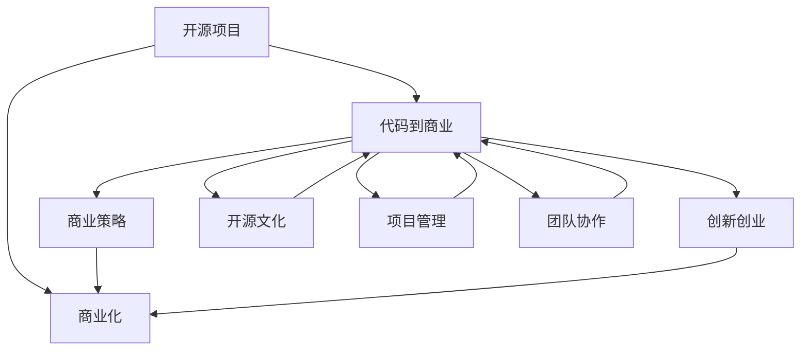

                 

# 从代码到商业：将开源项目转化为盈利企业

> 关键词：开源项目,盈利企业,代码到商业,技术转移,商业化策略,创新创业

## 1. 背景介绍

### 1.1 问题由来
随着开源软件运动和互联网技术的发展，越来越多的创新项目涌现出来。这些项目往往由一群志同道合的开发者共同创建，旨在解决实际问题或提供新功能。然而，将这些项目从代码转化为盈利企业，实现商业化，是一个复杂且充满挑战的过程。

### 1.2 问题核心关键点
成功将开源项目商业化的关键在于：理解开源文化，找到目标市场，制定有效的商业策略，以及高效的项目管理和团队协作。这不仅需要深厚的技术背景，还需要敏锐的市场洞察力和商业智慧。

### 1.3 问题研究意义
将开源项目商业化，不仅可以为开发者和贡献者带来经济收益，还能推动技术进步，促进产业发展。通过商业化，开源项目能够获得更强的社区支持、更高的用户参与度，以及更大的市场影响力。

## 2. 核心概念与联系

### 2.1 核心概念概述

为更好地理解开源项目商业化的过程，本节将介绍几个关键概念：

- **开源项目(Open Source Project)**：指在开源许可证下共享代码、文档和开发过程的项目。开源项目由社区驱动，强调开放、透明和共享。

- **盈利企业(Profitable Enterprise)**：指通过提供产品、服务或解决方案，实现稳定收入流，追求股东价值最大化的企业。

- **代码到商业(Coding to Business)**：指将开源代码和创意转化为可盈利的产品、服务或商业模式的过程。这一过程涉及技术、市场、商业策略等多方面的考量。

- **技术转移(Technology Transfer)**：指将科技成果转化为实际应用，实现技术价值的过程。开源项目商业化就是技术转移的重要形式之一。

- **商业化策略(Business Model)**：指企业如何创造价值、传递价值和捕获价值的过程。开源项目商业化需要找到合适的商业模式，实现盈利。

- **创新创业(Entrepreneurship)**：指创业者基于创新理念和商业模式，创立并发展企业的实践过程。开源项目商业化是创新创业的重要组成部分。

- **开源文化(Open Source Culture)**：指以开放、协作、共享为核心的开源社区文化。开源文化强调贡献、共享和协作，对项目的成功商业化至关重要。

- **项目管理和团队协作(Project Management and Team Collaboration)**：指高效组织和管理项目开发，以及团队成员间协作的方法和工具。这些是开源项目商业化的基础。

这些核心概念之间的逻辑关系可以通过以下Mermaid流程图来展示：



这个流程图展示开源项目商业化的核心概念及其之间的关系：

1. 开源项目通过代码共享和社区协作积累技术优势。
2. 开源项目可以基于技术优势探索商业策略，如SaaS、PaaS、SMB等。
3. 创新创业者基于项目特点和市场需求，制定具体的商业模式。
4. 开源文化促进项目的共享和协作，提高项目的吸引力和社区参与度。
5. 项目管理和团队协作是开源项目商业化的基础，需确保项目高效推进。

这些概念共同构成了开源项目商业化的框架，为项目的成功商业化提供了指导。

## 3. 核心算法原理 & 具体操作步骤
### 3.1 算法原理概述

开源项目商业化的核心在于将项目的技术优势转化为商业价值。这一过程涉及多个环节，包括市场调研、需求分析、产品规划、商业策略制定、项目管理等。

开源项目商业化的目标是通过提供有价值的产品、服务或解决方案，满足市场需求，实现盈利。这一目标的实现需要深刻理解目标市场、客户需求、技术优势和商业策略。

### 3.2 算法步骤详解

以下是开源项目商业化的主要操作步骤：

**Step 1: 市场调研与需求分析**
- 收集目标市场的相关信息，包括市场规模、增长趋势、竞争格局等。
- 进行需求调研，了解客户的具体需求和痛点，找出商业化的切入点。

**Step 2: 产品规划与定位**
- 基于市场需求和项目技术特点，设计产品功能和服务模式。
- 明确产品的市场定位，包括目标用户、独特卖点、竞争优势等。

**Step 3: 制定商业策略**
- 选择合适的商业模式，如订阅制、按需付费、SaaS等。
- 制定详细的商业策略，包括定价策略、推广策略、销售渠道等。

**Step 4: 项目管理与团队协作**
- 选择合适的项目管理工具和方法，如Scrum、Kanban等。
- 建立高效的项目管理和团队协作流程，确保项目按时按质交付。

**Step 5: 产品发布与市场推广**
- 开发和测试产品，进行质量保证和安全测试。
- 设计并实施市场推广策略，包括广告、公关、社交媒体等。

**Step 6: 收集反馈与迭代优化**
- 收集用户反馈，分析市场反应，识别改进点。
- 进行产品迭代优化，不断提升产品性能和用户体验。

**Step 7: 评估与调整**
- 定期评估商业策略和市场表现，调整优化策略。
- 监控关键指标，如用户增长、留存率、收入等，确保商业化成功。

### 3.3 算法优缺点

开源项目商业化的主要优点包括：

1. **社区支持**：开源项目通常拥有强大的社区支持，开发者和贡献者愿意为项目的成功贡献力量。
2. **成本优势**：开源项目初期开发成本较低，可以利用已有社区资源快速推进。
3. **快速迭代**：开源项目可以快速迭代，根据市场反馈不断优化产品。
4. **品牌效应**：开源项目通过开源文化的推广，能够建立良好的品牌形象和用户信任。

同时，开源项目商业化也存在一定的局限性：

1. **知识产权问题**：开源项目需要明确知识产权归属，确保商业化的合法性。
2. **商业模式单一**：开源项目通常专注于技术和产品，商业模式的创新和多样化可能受限。
3. **盈利能力挑战**：开源项目商业化需要在盈利和开源之间找到平衡，挑战较大。
4. **市场接受度**：开源项目需要获得市场的认可，可能面临较高的市场接受门槛。

尽管存在这些局限性，但开源项目商业化仍然是当前和未来技术转移的重要方式之一。未来，随着开源文化的普及和技术的发展，开源项目商业化将迎来更多机遇和挑战。

### 3.4 算法应用领域

开源项目商业化在多个领域都有广泛应用，例如：

- **软件开发**：通过开源软件项目，开发者可以提供产品或服务，获得商业收入。如GitHub、OpenStack等。
- **数据平台**：利用开源大数据平台，提供数据分析、存储和处理服务。如Apache Hadoop、Apache Spark等。
- **云计算**：提供基础设施即服务(IaaS)、平台即服务(PaaS)、软件即服务(SaaS)等云服务。如Amazon Web Services、Microsoft Azure等。
- **区块链**：利用开源区块链技术，提供去中心化的应用和解决方案。如Ethereum、Hyperledger等。
- **物联网**：通过开源物联网平台，提供设备管理和数据处理服务。如Apache Kafka、MQTT等。
- **人工智能**：提供开源AI工具和框架，如TensorFlow、PyTorch等。

除了上述这些经典领域，开源项目商业化还在更多新兴领域探索新的应用场景，如自动驾驶、量子计算、生物信息学等，为各行各业带来新的创新突破。

## 4. 数学模型和公式 & 详细讲解  
### 4.1 数学模型构建

在开源项目商业化的过程中，我们可以用数学模型来描述和优化各个环节。以下是一个简化的数学模型框架：

设 $X$ 为市场规模，$Y$ 为项目收益，$C$ 为开发成本，$P$ 为产品定价，$D$ 为市场接受度。则商业化过程可以表示为：

$$
Y = P \times D \times X - C
$$

其中 $P$ 和 $D$ 需要通过市场调研和需求分析来确定，$C$ 需要精确控制和优化，而 $X$ 和 $D$ 则受到多种因素的影响，如市场趋势、竞争对手、客户反馈等。

### 4.2 公式推导过程

为了更直观地理解开源项目商业化的数学模型，以下是一个简化的推导过程：

1. 市场规模 $X$：市场规模为项目可以覆盖的潜在用户数量，通常通过市场调研获得。

2. 项目收益 $Y$：项目收益为产品或服务的收入减去开发和运营成本。

3. 开发成本 $C$：开发成本包括人力、设备、软件、测试等。

4. 产品定价 $P$：产品定价需要考虑市场需求、成本和竞争格局。通常可以通过市场测试和反馈调整定价策略。

5. 市场接受度 $D$：市场接受度指项目在目标市场中的受欢迎程度，可以通过用户调查、市场反馈等评估。

根据上述模型，开源项目商业化的目标是最大化项目收益 $Y$，最小化开发成本 $C$，并确保市场接受度 $D$ 和市场规模 $X$ 的正向增长。

### 4.3 案例分析与讲解

以Apache Hadoop为例，分析其开源项目商业化的过程：

1. **市场调研与需求分析**：Apache Hadoop团队通过调研大数据处理市场，发现大量企业需要高效的分布式数据处理解决方案。

2. **产品规划与定位**：Hadoop团队设计了一个开源分布式文件系统(HDFS)和分布式计算框架(MapReduce)，明确了项目的功能和市场定位。

3. **制定商业策略**：Hadoop项目通过Apache Foundation的免费开源许可证，吸引大量企业和开发者贡献代码。同时，通过Hadoop Enterprise版，向企业提供商业支持和专业服务，实现盈利。

4. **项目管理与团队协作**：Hadoop团队采用了Scrum项目管理方法，定期召开迭代会议，确保项目按时按质交付。

5. **产品发布与市场推广**：Hadoop通过开源社区的推广和商业合作伙伴的参与，成功吸引了大量用户和企业，提高了项目知名度。

6. **收集反馈与迭代优化**：Hadoop团队定期收集用户反馈，进行产品迭代优化，提升用户体验和系统性能。

7. **评估与调整**：Hadoop通过监控关键指标，如用户增长、收入等，不断优化商业策略和市场推广。

Apache Hadoop的成功商业化，展示了开源项目转化为盈利企业的可行性和潜力。

## 5. 项目实践：代码实例和详细解释说明
### 5.1 开发环境搭建

在进行开源项目商业化实践前，我们需要准备好开发环境。以下是使用Python进行开源项目商业化开发的流程：

1. 安装Python：从官网下载安装Python，建议安装最新版本。

2. 安装Python包管理工具：安装pip或conda，用于管理第三方包和虚拟环境。

3. 创建虚拟环境：使用虚拟环境（如venv或conda）来隔离不同项目的依赖和配置。

4. 安装必要包：安装项目开发所需的第三方包，如Flask、Django、SQLAlchemy等。

5. 编写代码：在虚拟环境中编写项目代码，遵循良好的编码规范和开发流程。

6. 测试与调试：通过单元测试、集成测试等手段，确保代码质量和安全。

完成上述步骤后，即可在虚拟环境中进行开源项目的商业化实践。

### 5.2 源代码详细实现

下面以一个开源Web应用为例，给出使用Flask框架进行商业化开发的PyTorch代码实现。

首先，定义Web应用的基本路由和视图函数：

```python
from flask import Flask, request, jsonify

app = Flask(__name__)

@app.route('/', methods=['GET'])
def index():
    return jsonify({'message': 'Welcome to our Flask Web App!'})

@app.route('/api/data', methods=['POST'])
def get_data():
    data = request.json.get('data')
    # 处理和分析数据，返回结果
    return jsonify({'result': process_data(data)})

if __name__ == '__main__':
    app.run(debug=True)
```

然后，定义数据处理函数：

```python
def process_data(data):
    # 对数据进行处理，如数据清洗、特征工程、模型训练等
    # 调用模型进行预测和分析
    return result
```

最后，实现数据库和用户管理模块：

```python
from flask_sqlalchemy import SQLAlchemy

app.config['SQLALCHEMY_DATABASE_URI'] = 'sqlite:///data.db'
db = SQLAlchemy(app)

class User(db.Model):
    id = db.Column(db.Integer, primary_key=True)
    name = db.Column(db.String(50), nullable=False)
    email = db.Column(db.String(120), unique=True, nullable=False)

@app.route('/api/users', methods=['GET'])
def get_users():
    users = User.query.all()
    # 查询所有用户，返回JSON格式的用户信息
    return jsonify([{'id': user.id, 'name': user.name, 'email': user.email} for user in users])

@app.route('/api/users', methods=['POST'])
def add_user():
    data = request.json.get('data')
    # 新增用户，保存到数据库
    user = User(name=data['name'], email=data['email'])
    db.session.add(user)
    db.session.commit()
    return jsonify({'message': 'User added successfully'})
```

完成上述代码后，可以使用Flask启动Web应用，进行商业化部署：

```python
if __name__ == '__main__':
    app.run(debug=True)
```

### 5.3 代码解读与分析

让我们再详细解读一下关键代码的实现细节：

**Flask应用定义**：
- `app = Flask(__name__)`：定义Flask应用实例。
- `@app.route`装饰器：定义Web应用的路由和视图函数。

**数据处理函数**：
- `process_data(data)`：定义数据处理函数，接受输入数据，进行数据清洗、特征工程、模型训练等操作，最终返回处理结果。

**数据库和用户管理**：
- 通过Flask-SQLAlchemy模块定义数据库模型，进行用户管理。
- 使用`@app.route`装饰器定义获取和新增用户的API接口。

通过上述代码，可以构建一个简单的Web应用，提供数据处理和用户管理功能。在实际商业化开发中，需要根据具体需求，进一步扩展功能和优化性能。

## 6. 实际应用场景

### 6.1 智能客服系统

智能客服系统是一种典型的开源项目商业化应用。传统客服依赖人工，成本高、效率低、质量不稳定。通过开源项目，可以构建基于自然语言处理(NLP)的智能客服系统，提供7x24小时不间断服务。

**技术实现**：
- 收集企业内部历史客服对话记录，构建监督数据集。
- 使用开源NLP框架，如NLTK、SpaCy等，进行模型训练和微调。
- 部署模型到Web应用中，提供在线客服聊天功能。

**商业化策略**：
- 采用SaaS模式，按月或按年订阅。
- 提供API接口，支持第三方集成。
- 提供定制化服务，针对特定行业需求优化系统功能。

**用户反馈**：
- 收集用户反馈，不断优化系统性能和用户体验。
- 定期更新模型，适应新的业务场景。

**盈利模式**：
- 订阅费：按月或按年收取订阅费。
- 增值服务：提供高级功能、数据分析服务等。

### 6.2 金融数据分析

金融数据分析是开源项目商业化的另一个典型应用。金融行业对数据处理和分析有高需求，但传统方法成本高、效率低。通过开源项目，可以构建基于大数据和机器学习的金融数据分析平台。

**技术实现**：
- 收集金融领域相关数据，如股票、债券、期货等。
- 使用开源大数据平台，如Hadoop、Spark等，进行数据处理和分析。
- 使用机器学习算法，如随机森林、深度学习等，进行金融预测和风险管理。

**商业化策略**：
- PaaS模式：提供平台即服务，企业无需自行搭建数据处理环境，直接使用平台服务。
- 按需付费：根据使用量计费，降低企业成本。
- 专业支持：提供技术支持和售后服务。

**用户反馈**：
- 收集用户反馈，优化算法和模型。
- 提供数据可视化工具，方便用户理解分析结果。

**盈利模式**：
- PaaS服务费：按月或按年收取服务费。
- 数据分析服务费：根据分析深度和服务质量计费。
- 定制化服务：针对特定需求提供定制化解决方案。

### 6.3 医疗健康平台

医疗健康平台也是开源项目商业化的一个重要应用。医疗健康领域数据量大、需求复杂，通过开源项目，可以构建基于AI的医疗健康平台，提供疾病预测、个性化诊疗等服务。

**技术实现**：
- 收集医疗健康领域数据，如电子病历、基因数据等。
- 使用开源AI框架，如TensorFlow、PyTorch等，进行模型训练和预测。
- 集成医疗健康领域专家知识，如知识图谱、规则库等，提升系统性能。

**商业化策略**：
- SaaS模式：按月或按年订阅。
- 数据共享：提供数据接口，支持第三方应用集成。
- 个性化服务：根据用户需求提供个性化诊疗方案。

**用户反馈**：
- 收集用户反馈，优化算法和模型。
- 提供数据安全保障，保护用户隐私。

**盈利模式**：
- 订阅费：按月或按年收取订阅费。
- 数据服务费：根据数据使用量计费。
- 个性化服务费：根据服务深度和质量计费。

## 7. 工具和资源推荐
### 7.1 学习资源推荐

为了帮助开发者系统掌握开源项目商业化的理论基础和实践技巧，这里推荐一些优质的学习资源：

1. **《Open Source: The Business of Open Source》**：深入探讨开源文化的商业价值和商业化策略，推荐阅读。

2. **Coursera的《Open Source Software: Open Source in Practice》课程**：由知名开源组织Linux Foundation开设的课程，涵盖开源项目商业化的全流程。

3. **《企业开源之路：开源技术在企业中的应用与实践》**：系统介绍开源项目在企业中的应用案例和商业化策略，推荐阅读。

4. **《商业化开源项目：从代码到商业》系列文章**：探讨开源项目商业化的理论和实践，推荐阅读。

5. **《开源商业化：开源项目的商业化和商业开源》白皮书**：提供开源项目商业化的最佳实践和案例分析，推荐阅读。

通过对这些资源的学习实践，相信你一定能够快速掌握开源项目商业化的精髓，并用于解决实际的商业化问题。

### 7.2 开发工具推荐

高效的开发离不开优秀的工具支持。以下是几款用于开源项目商业化开发的常用工具：

1. **GitHub**：全球最大的开源社区，提供代码托管、协作开发和版本控制等服务，是开源项目商业化的重要平台。

2. **JIRA**：项目管理工具，支持敏捷开发、任务跟踪和团队协作，是开源项目商业化的必备工具。

3. **Redmine**：开源项目管理工具，提供任务管理、代码审查、时间跟踪等功能，适合中小型开源项目。

4. **Trello**：简单易用的看板式项目管理工具，适合团队协作和任务追踪，广泛应用于开源项目商业化中。

5. **Slack**：团队沟通工具，提供即时消息、频道和文件共享等功能，方便团队协作和沟通。

6. **Zoom**：视频会议工具，支持多人视频和屏幕共享，适合远程开发和团队协作。

合理利用这些工具，可以显著提升开源项目商业化的开发效率，加快创新迭代的步伐。

### 7.3 相关论文推荐

开源项目商业化涉及技术、市场、商业策略等多方面，以下是几篇相关论文，推荐阅读：

1. **《The Business of Open Source: The Future of IT》**：探讨开源文化的商业价值和未来发展趋势，推荐阅读。

2. **《The Open Source Project as a New Kind of Business》**：分析开源项目的商业化模式和案例，推荐阅读。

3. **《How Open Source Projects Are Changing the World》**：讨论开源项目对全球技术和经济的影响，推荐阅读。

4. **《Open Source Enterprise Software: The Next Wave》**：探讨开源项目在企业中的应用和商业化策略，推荐阅读。

这些论文代表了大规模开源项目商业化的研究方向，为开发者和研究者提供了深入的理论支持和实践案例。

## 8. 总结：未来发展趋势与挑战

### 8.1 研究成果总结

开源项目商业化是当前技术转移和创新创业的重要趋势。通过将开源项目转化为盈利企业，不仅可以实现技术价值最大化，还能促进技术普及和产业升级。

开源项目商业化的成功经验包括：
- 选择合适的商业模式，如SaaS、PaaS、SMB等。
- 根据市场需求和项目特点，制定详细的商业策略。
- 高效的项目管理和团队协作，确保项目按时按质交付。
- 灵活的微调和优化策略，持续提升产品性能和用户体验。

### 8.2 未来发展趋势

展望未来，开源项目商业化将呈现以下几个发展趋势：

1. **商业模式的创新**：开源项目商业化将更加注重模式创新，探索更多元化的盈利方式，如数据服务、定制化解决方案等。

2. **技术生态系统的建设**：开源项目将更多地融入技术生态系统，通过开源社区和合作平台，形成更强的技术协同效应。

3. **全球化扩展**：开源项目商业化将突破地域限制，在全球范围内推广和应用，加速技术的国际化和标准化。

4. **开源与商业的融合**：开源项目将更加强调开源与商业的融合，通过开放源码和商业模式创新，实现商业价值的最大化。

5. **人工智能与商业的结合**：开源项目商业化将更多地融合人工智能技术，提升产品智能化水平，增强市场竞争力。

6. **可持续发展**：开源项目商业化将更加注重可持续发展，通过开源文化和技术创新，实现长期稳定的增长。

以上趋势凸显了开源项目商业化的广阔前景，这些方向的探索发展，必将进一步推动技术进步和产业升级。

### 8.3 面临的挑战

尽管开源项目商业化前景广阔，但在实现过程中仍面临诸多挑战：

1. **市场接受度**：开源项目需要获得市场认可，可能会面临较高的接受门槛。

2. **知识产权问题**：开源项目商业化需要明确知识产权归属，确保商业化的合法性。

3. **盈利模式单一**：开源项目商业化通常依赖订阅费，盈利模式较为单一。

4. **技术更新速度**：开源项目需要不断更新和优化，以适应快速变化的市场需求。

5. **用户体验优化**：开源项目商业化需要关注用户体验，提升产品性能和用户体验。

6. **团队协作难度**：开源项目商业化涉及多团队协作，管理复杂，需要高效的项目管理和团队协作。

尽管存在这些挑战，但开源项目商业化仍然是当前和未来技术转移的重要方式之一。未来，随着开源文化的普及和技术的发展，开源项目商业化将迎来更多机遇和挑战。

### 8.4 研究展望

面向未来，开源项目商业化的研究需要在以下几个方面寻求新的突破：

1. **技术生态系统的构建**：开源项目需要构建强大的技术生态系统，通过开源社区和合作平台，形成更强的技术协同效应。

2. **商业模式创新**：开源项目需要探索更多元化的商业模式，如数据服务、定制化解决方案等。

3. **人工智能与商业的结合**：开源项目需要更多地融合人工智能技术，提升产品智能化水平，增强市场竞争力。

4. **全球化扩展**：开源项目需要突破地域限制，在全球范围内推广和应用，加速技术的国际化和标准化。

5. **可持续发展**：开源项目需要注重可持续发展，通过开源文化和技术创新，实现长期稳定的增长。

这些研究方向的探索，必将引领开源项目商业化技术迈向更高的台阶，为构建安全、可靠、可解释、可控的智能系统铺平道路。面向未来，开源项目商业化需要与其他人工智能技术进行更深入的融合，如知识表示、因果推理、强化学习等，多路径协同发力，共同推动自然语言理解和智能交互系统的进步。只有勇于创新、敢于突破，才能不断拓展开源项目的边界，让智能技术更好地造福人类社会。

## 9. 附录：常见问题与解答

**Q1：开源项目商业化是否适用于所有行业？**

A: 开源项目商业化适用于大多数行业，特别是在大数据、云计算、人工智能等领域有广泛应用。但一些传统行业，如农业、手工业等，可能面临技术接受度和市场规模的挑战。

**Q2：如何选择合适的商业模式？**

A: 选择合适的商业模式需要考虑多个因素，如市场需求、项目特点、技术优势等。常见的商业模式包括SaaS、PaaS、SMB、按需付费等。具体选择需结合项目实际情况进行综合评估。

**Q3：开源项目商业化是否需要大量初期投入？**

A: 开源项目商业化初期投入可能较大，但随着社区发展和用户增长，收益会逐渐增加。合理的商业策略和高效的团队管理，可以最大限度地减少初期投入。

**Q4：开源项目商业化如何保证数据安全？**

A: 开源项目商业化需要制定严格的数据安全策略，如数据加密、权限管理、备份和恢复等。同时，提供数据隐私保护措施，确保用户数据安全。

**Q5：开源项目商业化如何应对市场变化？**

A: 开源项目商业化需要灵活调整商业策略，定期收集市场反馈，进行产品迭代优化。同时，保持技术创新，及时引入新技术和新功能，增强市场竞争力。

这些问题的答案，可以帮助开发者更好地理解和应对开源项目商业化过程中的挑战，实现商业化的成功。

---

作者：禅与计算机程序设计艺术 / Zen and the Art of Computer Programming

