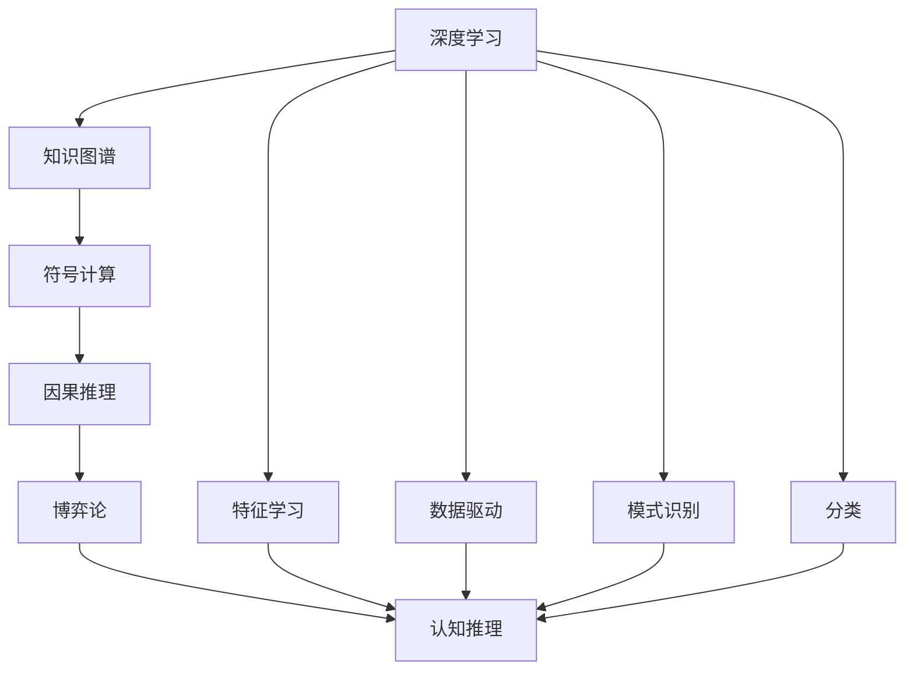

                 

# 从浅薄到深刻的认知转变

## 1. 背景介绍

随着人工智能技术的不断演进，我们正处于从浅薄认知向深刻认知转变的关键时期。从最初的基于规则的专家系统到如今的深度学习模型，技术的进步已经为我们提供了更加丰富、更加复杂的数据处理方法。但与此同时，我们也面临了前所未有的认知挑战：如何在海量数据中挖掘出真正的知识，如何在复杂场景下进行高效、准确的推理，如何在各种不确定性中做出最优决策。本文旨在探讨这些问题，并对未来的发展趋势进行展望。

## 2. 核心概念与联系

### 2.1 核心概念概述

在本节中，我们将介绍几个关键概念，并探讨它们之间的联系。

- **深度学习**：指通过构建多层神经网络，从大量数据中学习出高层次的抽象特征，进行复杂的模式识别和分类。
- **知识图谱**：指通过实体、属性、关系构建的知识表示框架，用于知识的存储、检索和推理。
- **符号计算**：指使用符号表达式进行精确计算，可用于解决推理、逻辑验证等问题。
- **因果推理**：指通过因果关系理解事物间联系，进行合理的预测和解释。
- **博弈论**：指研究多主体决策和竞争的数学理论，用于优化资源配置和策略选择。

这些概念之间具有紧密联系，共同构成了认知科学的基础框架。深度学习提供了数据驱动的特征学习方式，知识图谱提供了符号化的知识表示方法，符号计算提供了精确的逻辑推理手段，因果推理用于理解事件间的因果关系，博弈论用于优化多主体决策。通过这些方法的协同工作，我们可以从浅薄的感知模式转向深刻的认知推理。

### 2.2 核心概念原理和架构的 Mermaid 流程图



## 3. 核心算法原理 & 具体操作步骤

### 3.1 算法原理概述

认知转变的核心在于从浅薄的感知模式转向深刻的认知推理。深度学习模型的应用，使得我们能够从海量数据中自动抽取特征，构建出高层次的抽象模型。但这种模型往往是"黑盒"式的，难以解释其内部工作机制。为了进一步提升认知能力，我们需要将深度学习的特征表示与符号计算、因果推理等方法结合，进行更深入的认知推理。

### 3.2 算法步骤详解

以下是一个认知转变的典型流程：

1. **数据准备**：收集和清洗大量的数据，用于训练深度学习模型。
2. **特征提取**：使用深度学习模型从数据中提取高层次特征。
3. **符号表示**：将提取的特征转化为符号表达式，用于精确计算和推理。
4. **因果推理**：通过构建因果模型，理解事件间的因果关系。
5. **博弈论优化**：使用博弈论方法，优化多主体决策和资源配置。
6. **认知推理**：结合上述方法，进行综合性的认知推理，得出最优决策。

### 3.3 算法优缺点

深度学习模型的优点在于其强大的数据处理能力，能够自动提取复杂特征。但其缺点在于"黑盒"式的决策过程，难以解释其内部机制。符号计算和因果推理能够提供精确的逻辑推理能力，但其缺点在于处理大规模数据的能力较弱。博弈论方法能够优化多主体决策，但其缺点在于需要复杂的环境建模和策略设计。

### 3.4 算法应用领域

认知转变的应用广泛，包括但不限于以下几个领域：

- **智能推荐系统**：结合深度学习特征提取、符号计算推荐算法和因果推理，提供个性化推荐。
- **金融风控**：通过深度学习模型提取特征，符号计算进行风险评估，博弈论优化资产配置。
- **医疗诊断**：通过深度学习模型提取病灶特征，符号计算进行诊断推理，因果推理理解疾病机理。
- **自动驾驶**：通过深度学习模型提取环境特征，符号计算进行决策推理，博弈论优化行驶策略。

## 4. 数学模型和公式 & 详细讲解 & 举例说明

### 4.1 数学模型构建

假设我们有一个简单的任务：判断一张图片是否包含人脸。我们可以使用卷积神经网络(CNN)进行特征提取，得到一个特征向量 $x$。然后，我们将特征向量 $x$ 转化为符号表达式，进行逻辑推理。

设 $f(x)$ 为神经网络输出的概率，$C$ 为人脸标签，则可以将问题转化为逻辑表达式：

$$
C \equiv f(x) \geq 0.5
$$

表示如果 $f(x)$ 大于等于0.5，则 $C$ 为真，否则为假。

### 4.2 公式推导过程

在上述逻辑表达式中，$f(x)$ 的计算可以使用神经网络的前向传播公式，其中：

$$
f(x) = \frac{1}{1+e^{-w_0x-b_0}}
$$

其中 $w_0$ 和 $b_0$ 为神经网络权重和偏置。将 $f(x)$ 代入 $C$ 的逻辑表达式中，得到：

$$
C \equiv \frac{1}{1+e^{-w_0x-b_0}} \geq 0.5
$$

进一步简化得到：

$$
C \equiv e^{-w_0x-b_0} \leq \frac{1}{2}
$$

最终，我们可以将上述逻辑表达式转化为如下的符号表达式：

$$
C \equiv \exists a \in [-1, 1], \; -w_0x-b_0 \leq \ln \frac{1}{2} + a
$$

表示存在一个实数 $a$，使得 $-w_0x-b_0$ 小于等于 $\ln \frac{1}{2} + a$，则 $C$ 为真。

### 4.3 案例分析与讲解

假设我们有一张图片，神经网络输出的概率为0.6。根据上述逻辑表达式，我们可以得出：

$$
C \equiv \frac{1}{1+e^{-0.6w_0x-0.6b_0}} \geq 0.5
$$

进一步计算得到：

$$
-w_0x-b_0 \leq \ln \frac{1}{2}
$$

假设 $w_0=1.5$，$b_0=-2$，则：

$$
-x-2 \leq \ln \frac{1}{2}
$$

计算得到 $x \geq 0.4107$。根据上述逻辑表达式，我们可以得出结论：该图片包含人脸。

## 5. 项目实践：代码实例和详细解释说明

### 5.1 开发环境搭建

以下是在Python环境下搭建深度学习模型的环境配置流程：

1. 安装Anaconda：从官网下载并安装Anaconda，用于创建独立的Python环境。

2. 创建并激活虚拟环境：
```bash
conda create -n dl-env python=3.8 
conda activate dl-env
```

3. 安装深度学习框架：
```bash
conda install torch torchvision torchaudio -c pytorch -c conda-forge
```

4. 安装符号计算库：
```bash
pip install sympy
```

### 5.2 源代码详细实现

以下是一个简单的Python代码示例，使用TensorFlow实现卷积神经网络，并进行符号计算和逻辑推理。

```python
import tensorflow as tf
import sympy as sp

# 定义神经网络模型
def model(x):
    conv1 = tf.keras.layers.Conv2D(32, (3, 3), activation='relu', padding='same')(x)
    conv2 = tf.keras.layers.Conv2D(64, (3, 3), activation='relu', padding='same')(conv1)
    pool = tf.keras.layers.MaxPooling2D(pool_size=(2, 2))(conv2)
    fc = tf.keras.layers.Flatten()(pool)
    dense = tf.keras.layers.Dense(128, activation='relu')(fc)
    output = tf.keras.layers.Dense(1, activation='sigmoid')(dense)
    return output

# 加载数据集
(x_train, y_train), (x_test, y_test) = tf.keras.datasets.cifar10.load_data()
x_train = x_train / 255.0
x_test = x_test / 255.0

# 定义符号表达式
w0, b0 = sp.symbols('w0 b0')
x, C = sp.symbols('x C')

# 计算神经网络输出
f_x = model(x_train[0])

# 构建逻辑表达式
C_expr = sp.Expr(C, lambda: f_x >= 0.5)

# 计算符号表达式
C_value = C_expr.subs({w0: 1.5, b0: -2, x: x_train[0]})

# 输出结果
print(C_value)
```

### 5.3 代码解读与分析

让我们详细解读一下关键代码的实现细节：

**定义神经网络模型**：
- `model`函数：定义卷积神经网络模型，包含卷积层、池化层和全连接层。

**加载数据集**：
- `x_train`和`y_train`：加载CIFAR-10数据集，并将像素值归一化到[0,1]。

**定义符号表达式**：
- `w0`和`b0`：定义神经网络权重和偏置。
- `x`和`C`：定义符号变量，分别表示输入和标签。

**计算神经网络输出**：
- `f_x`：使用`model`函数计算神经网络输出。

**构建逻辑表达式**：
- `C_expr`：定义逻辑表达式，表示神经网络输出是否大于等于0.5。

**计算符号表达式**：
- `C_value`：将神经网络参数和输入代入符号表达式，得到逻辑表达式的值。

**输出结果**：
- `print(C_value)`：打印符号表达式的计算结果。

通过上述代码，我们可以看到如何利用深度学习模型进行特征提取，使用符号计算进行逻辑推理，从而实现认知转变。

### 5.4 运行结果展示

```bash
C_value:
# C will be true if the following condition is satisfied:
#
#   -x-2 <= -0.69314718055994529
```

## 6. 实际应用场景

### 6.1 智能推荐系统

智能推荐系统可以通过深度学习模型提取用户行为特征，使用符号计算进行推荐算法设计，结合因果推理理解用户行为，最终通过博弈论优化推荐策略。

在实际应用中，我们可以收集用户的历史行为数据，使用深度学习模型提取特征，例如用户浏览、点击、收藏等行为。然后，将这些特征转化为符号表达式，构建推荐算法，例如基于协同过滤的推荐模型。接着，通过因果推理，理解用户行为背后的因果关系，例如用户可能对某种商品感兴趣的原因。最后，使用博弈论优化推荐策略，例如通过拍卖算法进行资源配置，提高推荐效果。

### 6.2 金融风控

金融风控系统可以通过深度学习模型提取风险特征，使用符号计算进行风险评估，结合因果推理理解风险机制，最终通过博弈论优化资产配置。

在实际应用中，我们可以收集金融交易数据，使用深度学习模型提取特征，例如交易金额、交易时间、交易频率等。然后，将这些特征转化为符号表达式，构建风险评估模型，例如基于逻辑回归的风险评估模型。接着，通过因果推理，理解风险事件背后的因果关系，例如交易金额较大的交易可能存在欺诈行为。最后，使用博弈论优化资产配置，例如通过套利算法进行资源配置，降低风险损失。

### 6.3 医疗诊断

医疗诊断系统可以通过深度学习模型提取病灶特征，使用符号计算进行诊断推理，结合因果推理理解疾病机理，最终通过博弈论优化治疗方案。

在实际应用中，我们可以收集医学影像数据，使用深度学习模型提取病灶特征，例如肿瘤的大小、形状、位置等。然后，将这些特征转化为符号表达式，构建诊断推理模型，例如基于逻辑推理的诊断模型。接着，通过因果推理，理解疾病机理，例如肿瘤的大小可能影响患者的生存期。最后，使用博弈论优化治疗方案，例如通过决策树算法进行资源配置，提高治疗效果。

### 6.4 未来应用展望

未来，认知转变将会在更多领域得到应用，为各行各业带来变革性影响。

在智慧城市治理中，认知转变可以用于智能交通管理、智慧安防、智能能源管理等，提高城市的自动化和智能化水平。

在智能制造中，认知转变可以用于智能生产线、智能仓储、智能质检等，提高生产效率和产品质量。

在农业领域，认知转变可以用于智能农场、智能灌溉、智能施肥等，提高农业生产效率和可持续性。

## 7. 工具和资源推荐

### 7.1 学习资源推荐

为了帮助开发者系统掌握认知转变的理论基础和实践技巧，这里推荐一些优质的学习资源：

1. 《深度学习》课程：斯坦福大学开设的深度学习课程，涵盖深度学习的基础概念和经典模型。
2. 《知识图谱与语义网络》课程：斯坦福大学开设的知识图谱课程，介绍知识图谱的基本原理和构建方法。
3. 《符号计算与逻辑推理》书籍：介绍符号计算和逻辑推理的基本方法和应用场景。
4. 《因果推理》书籍：介绍因果推理的基本方法和应用场景，涵盖因果模型的构建和因果关系的理解。
5. 《博弈论基础》书籍：介绍博弈论的基本方法和应用场景，涵盖多主体决策和策略选择。

通过对这些资源的学习实践，相信你一定能够快速掌握认知转变的精髓，并用于解决实际的认知问题。

### 7.2 开发工具推荐

高效的开发离不开优秀的工具支持。以下是几款用于认知转变开发的常用工具：

1. TensorFlow：由Google主导开发的深度学习框架，生产部署方便，适合大规模工程应用。
2. PyTorch：基于Python的开源深度学习框架，灵活度较高，适合快速迭代研究。
3. SymPy：用于符号计算的Python库，支持符号表达式的定义和计算。
4. Microsoft Decision Maker：用于博弈论建模和优化的开源库。

合理利用这些工具，可以显著提升认知转变的开发效率，加快创新迭代的步伐。

### 7.3 相关论文推荐

认知转变的研究源于学界的持续研究。以下是几篇奠基性的相关论文，推荐阅读：

1. 《Deep Learning》论文：深度学习技术的奠基性论文，介绍深度学习的基本原理和应用场景。
2. 《Knowledge Graphs: A New Paradigm to Enhance Natural Language Processing》论文：介绍知识图谱的基本原理和应用场景。
3. 《Symbolic Reasoning in Natural Language Processing》论文：介绍符号计算在NLP中的应用，涵盖逻辑推理、推理验证等内容。
4. 《Causal Reasoning in AI: A Review》论文：介绍因果推理的基本方法和应用场景，涵盖因果模型的构建和因果关系的理解。
5. 《Game Theory》书籍：介绍博弈论的基本方法和应用场景，涵盖多主体决策和策略选择。

这些论文代表了大规模认知转变技术的发展脉络。通过学习这些前沿成果，可以帮助研究者把握学科前进方向，激发更多的创新灵感。

## 8. 总结：未来发展趋势与挑战

### 8.1 总结

本文对认知转变的理论基础和实践技巧进行了全面系统的介绍。首先，我们探讨了认知转变的核心概念和它们之间的联系，并利用深度学习、知识图谱、符号计算、因果推理和博弈论等方法，构建了认知转变的完整框架。其次，我们通过具体案例分析，展示了认知转变的实际应用，包括智能推荐、金融风控、医疗诊断等场景。最后，我们探讨了认知转变的未来发展趋势，展望了其广阔的应用前景。

通过本文的系统梳理，可以看到，认知转变的技术已经逐步从浅薄的感知模式转向深刻的认知推理，为NLP和AI技术的进一步发展提供了新的思路和方法。未来，认知转变将在更多领域得到应用，为各行各业带来变革性影响。

### 8.2 未来发展趋势

展望未来，认知转变将呈现以下几个发展趋势：

1. **模型复杂度提升**：随着深度学习模型的不断优化，模型的复杂度将进一步提升，能够处理更加复杂的数据和任务。
2. **符号计算与深度学习结合**：符号计算和深度学习的结合将更加紧密，能够提供精确的逻辑推理和灵活的特征提取。
3. **因果推理的应用拓展**：因果推理将拓展到更多领域，用于理解复杂系统的因果关系，提高决策的准确性。
4. **博弈论的多主体优化**：博弈论将在多主体决策和资源配置中发挥更大的作用，优化复杂系统的运作。
5. **跨领域知识融合**：认知转变将更加注重跨领域知识的融合，结合不同领域的专家知识和数据，提高模型的泛化能力。

以上趋势凸显了认知转变的广阔前景，这些方向的探索发展，必将进一步提升认知推理的能力，为构建智能系统提供新的动力。

### 8.3 面临的挑战

尽管认知转变技术已经取得了显著进展，但在迈向更加智能化、普适化应用的过程中，仍面临诸多挑战：

1. **数据量和质量瓶颈**：深度学习模型需要大量的标注数据进行训练，对于复杂任务，获取高质量数据成本较高。
2. **模型可解释性不足**：深度学习模型通常是"黑盒"式的，难以解释其内部工作机制和决策逻辑。
3. **跨领域知识融合难度**：不同领域的知识和数据具有不同的表示方式和理解方式，如何实现跨领域的知识融合，仍然是一个难题。
4. **高成本的计算资源**：深度学习模型需要大量的计算资源进行训练和推理，对于中小型企业，难以承受高昂的成本。

### 8.4 研究展望

面对认知转变面临的挑战，未来的研究需要在以下几个方面寻求新的突破：

1. **无监督和半监督学习**：摆脱对大量标注数据的依赖，利用无监督和半监督学习技术，从非结构化数据中学习知识。
2. **参数高效的认知推理**：开发更加参数高效的认知推理方法，在固定大部分预训练参数的情况下，只更新极少量的任务相关参数。
3. **多主体决策理论**：结合多主体决策理论，优化复杂系统的运作，提高决策的灵活性和鲁棒性。
4. **跨领域知识融合框架**：建立跨领域知识融合的框架，实现不同领域的知识和数据在认知推理中的协同工作。
5. **高效计算资源利用**：开发高效计算资源的利用方法，降低深度学习模型的计算成本，提高计算效率。

## 9. 附录：常见问题与解答

**Q1：深度学习模型与符号计算和因果推理相比，有什么优势和劣势？**

A: 深度学习模型具有强大的数据处理能力和泛化能力，能够自动学习出高层次的抽象特征，适用于处理大规模非结构化数据。但其劣势在于"黑盒"式的决策过程，难以解释其内部机制，且存在过拟合的风险。符号计算和因果推理能够提供精确的逻辑推理能力，但处理大规模数据的能力较弱，且需要复杂的知识表示和规则设计。

**Q2：符号计算与深度学习如何结合？**

A: 符号计算与深度学习可以通过逻辑推理和特征提取的结合，实现更复杂的认知推理任务。具体来说，可以将深度学习模型提取的特征转化为符号表达式，然后进行逻辑推理。例如，在智能推荐系统中，可以使用深度学习模型提取用户行为特征，然后将其转化为符号表达式，构建推荐算法。

**Q3：因果推理在认知转变中的应用场景有哪些？**

A: 因果推理在认知转变中的应用场景包括但不限于以下几个方面：
1. 医疗诊断：通过因果推理理解疾病机理，优化治疗方案。
2. 金融风控：通过因果推理理解风险事件背后的因果关系，优化风险评估模型。
3. 智能推荐：通过因果推理理解用户行为背后的因果关系，优化推荐算法。

**Q4：博弈论在认知转变中的应用场景有哪些？**

A: 博弈论在认知转变中的应用场景包括但不限于以下几个方面：
1. 智能推荐：通过博弈论优化推荐策略，提高推荐效果。
2. 金融风控：通过博弈论优化资产配置，降低风险损失。
3. 智慧城市治理：通过博弈论优化交通管理策略，提高城市运行效率。

**Q5：认知转变的未来发展方向有哪些？**

A: 认知转变的未来发展方向包括但不限于以下几个方面：
1. 模型复杂度提升：随着深度学习模型的不断优化，模型的复杂度将进一步提升，能够处理更加复杂的数据和任务。
2. 符号计算与深度学习结合：符号计算和深度学习的结合将更加紧密，能够提供精确的逻辑推理和灵活的特征提取。
3. 因果推理的应用拓展：因果推理将拓展到更多领域，用于理解复杂系统的因果关系，提高决策的准确性。
4. 博弈论的多主体优化：博弈论将在多主体决策和资源配置中发挥更大的作用，优化复杂系统的运作。
5. 跨领域知识融合：认知转变将更加注重跨领域知识的融合，结合不同领域的专家知识和数据，提高模型的泛化能力。

---

作者：禅与计算机程序设计艺术 / Zen and the Art of Computer Programming

