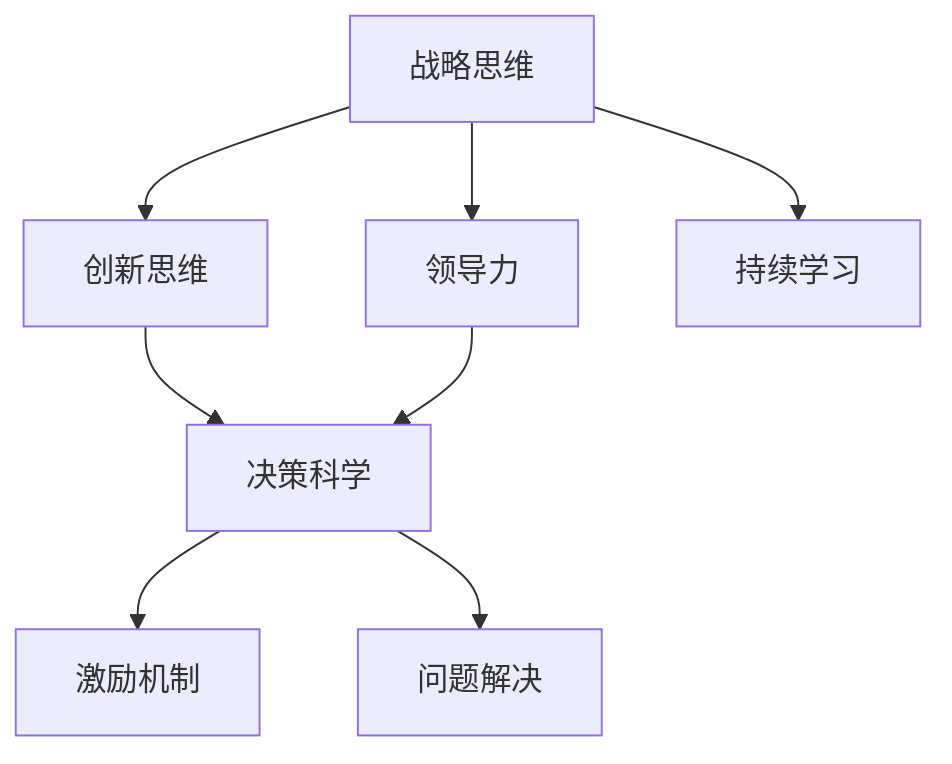

                 

# 从经典书籍中汲取管理智慧

> 关键词：经典书籍,管理智慧,创新思维,领导力,决策科学,激励机制,问题解决

## 1. 背景介绍

### 1.1 问题由来
在快速发展的科技与商业环境中，企业领导者必须不断寻找新的管理理念和方法，以应对复杂多变的市场挑战。经典书籍是智慧的宝库，汇聚了无数卓越领导者的管理实践与理论精华。然而，如何在繁忙的工作中有效阅读和应用这些书籍，成为了许多管理者面临的难题。本文旨在通过系统的阅读和学习方法，帮助管理者从经典书籍中汲取管理智慧，提升管理水平和竞争力。

### 1.2 问题核心关键点
1. 经典书籍的选取：选取哪些书籍能最大限度地提升管理能力？
2. 阅读方法：如何快速有效阅读经典书籍，提取关键知识？
3. 应用实践：如何将书籍中的管理理念和方法，有效应用到实际管理工作中？
4. 持续学习：如何在日常工作中不断学习新知识，保持管理思维的更新。

### 1.3 问题研究意义
从经典书籍中汲取管理智慧，有助于管理者提升战略思维、创新能力、领导力和决策科学，帮助企业实现可持续发展。经典书籍包含的理论和实践经验，能够为管理者提供丰富的参考和指导，助力他们在复杂环境中做出明智决策。

## 2. 核心概念与联系

### 2.1 核心概念概述

经典书籍中的管理智慧包含了多个核心概念，这些概念相互关联，共同构成了有效的管理实践框架。

- **战略思维**：制定长远规划，明确目标和方向。
- **创新思维**：鼓励新颖的思考方式，推动企业不断创新。
- **领导力**：激发团队成员的潜力，引领团队前进。
- **决策科学**：基于数据和分析，做出合理且有依据的决策。
- **激励机制**：建立公平有效的激励体系，激发员工积极性。
- **问题解决**：面对挑战和问题时，快速找到解决方案。

这些概念之间的联系可以通过以下Mermaid流程图来展示：



这个流程图展示了各个概念之间的相互关系：

1. 战略思维为企业的长远发展提供方向。
2. 创新思维激发团队不断探索新方法，支持战略执行。
3. 领导力驱动团队实现目标，有效沟通协作。
4. 决策科学确保每个决策都基于合理的数据分析，避免盲目决策。
5. 激励机制激发员工积极性，提高执行效率。
6. 问题解决能力帮助企业快速适应变化，克服障碍。
7. 持续学习保持管理思维的不断更新，确保适应动态环境。

这些概念共同作用，构成了一个有效的管理实践体系。

## 3. 核心算法原理 & 具体操作步骤
### 3.1 算法原理概述

从经典书籍中汲取管理智慧，本质上是一个知识提取与实践结合的过程。其核心思想是：通过系统的阅读和理解经典书籍，将其中的管理理念和方法，内化为个人的管理思维，并在实际工作中灵活应用。

形式化地，假设经典书籍中的管理智慧为 $W$，目标是将 $W$ 中的知识应用于实际管理问题 $P$。微调的目标是找到最佳的阅读与实践策略 $S$，使得 $S$ 在 $P$ 上的表现最优：

$$
S^* = \mathop{\arg\min}_{S} \mathcal{L}(S,P)
$$

其中 $\mathcal{L}$ 为阅读与实践策略 $S$ 在实际管理问题 $P$ 上的损失函数，用于衡量策略的有效性。

通过梯度下降等优化算法，阅读与实践策略不断更新，最小化损失函数 $\mathcal{L}$，最终得到适用于 $P$ 的最佳策略 $S^*$。

### 3.2 算法步骤详解

基于经典书籍的管理智慧汲取，一般包括以下几个关键步骤：

**Step 1: 选择合适的经典书籍**
- 根据管理需求，选择合适的经典书籍。可以关注哪些管理书籍被普遍认为具有重要价值和影响力。
- 可以参考专家推荐、书籍排行榜、阅读评论等指标进行筛选。

**Step 2: 制定阅读计划**
- 制定详细的阅读计划，包括每天或每周阅读的书籍和章节。
- 设定具体阅读目标，如每天阅读多页，理解核心概念等。
- 利用时间管理工具，如番茄工作法，提高阅读效率。

**Step 3: 深入理解与管理实践结合**
- 对于每个章节，进行详细的阅读和笔记记录，理解核心观点和案例。
- 将书籍中的管理理念和方法与实际管理问题进行对比，思考如何应用。
- 不断实践和验证理论，根据反馈调整应用策略。

**Step 4: 持续学习和优化**
- 定期回顾和总结所学知识，进行知识体系的梳理。
- 关注管理领域的最新发展，不断学习新知识。
- 建立学习和反馈循环，持续优化阅读与实践策略。

### 3.3 算法优缺点

从经典书籍中汲取管理智慧的方法具有以下优点：
1. 理论基础坚实。经典书籍汇聚了众多管理理论和实践经验，能够为管理者提供系统的知识框架。
2. 借鉴成功经验。经典书籍中的成功案例和经验教训，能够为管理者提供有益的参考和警示。
3. 提升决策质量。基于数据和理论的决策更加科学和可靠。
4. 增强创新能力。经典书籍中的创新思维和问题解决策略，能够启发管理者的创新思维。

同时，该方法也存在一定的局限性：
1. 书籍与实际差异。经典书籍中的理论往往较为理想化，与实际管理环境的差异较大。
2. 阅读理解难度。部分经典书籍内容深奥，理解难度较大。
3. 知识更新缓慢。经典书籍的出版周期较长，管理理论和技术发展较快，需要持续关注新知识。
4. 理论应用挑战。将理论知识应用到实际问题中，需要较高的实践能力。

尽管存在这些局限性，但经典书籍仍然是管理者获取管理智慧的重要途径。未来相关研究的重点在于如何更好地将经典书籍的理论知识与现代管理实践相结合，提升管理智慧的实效性。

### 3.4 算法应用领域

基于经典书籍的管理智慧汲取方法，广泛应用于企业战略规划、项目管理、人力资源管理、团队建设、客户关系管理等多个领域，帮助管理者在复杂多变的商业环境中做出明智决策，推动企业持续发展。

## 4. 数学模型和公式 & 详细讲解 & 举例说明

### 4.1 数学模型构建

本节将使用数学语言对从经典书籍中汲取管理智慧的过程进行更加严格的刻画。

假设管理者阅读经典书籍 $W=\{w_1, w_2, ..., w_n\}$，其中 $w_i$ 为第 $i$ 章内容。设实际管理问题为 $P=\{p_1, p_2, ..., p_m\}$，其中 $p_j$ 为第 $j$ 个管理问题。假设管理者阅读与实践策略为 $S=\{s_1, s_2, ..., s_n\}$，其中 $s_i$ 为第 $i$ 章的阅读方法与实践策略。

定义管理者阅读与实践策略 $S$ 在实际管理问题 $P$ 上的损失函数为 $\mathcal{L}(S,P)$，用于衡量策略的有效性。在实践中，我们通常使用基于梯度的优化算法来近似求解上述最优化问题。设 $\eta$ 为学习率，$\lambda$ 为正则化系数，则策略 $S$ 的更新公式为：

$$
S \leftarrow S - \eta \nabla_{S}\mathcal{L}(S,P) - \eta\lambda S
$$

其中 $\nabla_{S}\mathcal{L}(S,P)$ 为损失函数对策略 $S$ 的梯度，可通过反向传播算法高效计算。

### 4.2 公式推导过程

以下我们以经典书籍《原则》为例，推导其对管理者行为和决策的影响公式。

假设管理者阅读《原则》后，学习了作者Ray Dalio提出的“五步法”决策流程：
1. 设定目标
2. 收集数据
3. 制定方案
4. 预见可能结果
5. 作出决策

定义管理者的决策流程策略为 $S$，假设管理者在 $P$ 上的决策结果为 $R$，则决策流程策略 $S$ 在实际管理问题 $P$ 上的损失函数为：

$$
\mathcal{L}(S,P) = -\sum_{p_j \in P} [r_j \log s_j]
$$

其中 $r_j$ 为 $p_j$ 的管理问题结果，$s_j$ 为对应管理问题的决策策略 $S$ 所采取的措施。

根据链式法则，损失函数对策略 $S$ 的梯度为：

$$
\frac{\partial \mathcal{L}(S,P)}{\partial s_j} = -\sum_{p_j \in P} \frac{r_j}{s_j} \frac{\partial s_j}{\partial s_j} = -\frac{r_j}{s_j}
$$

在得到损失函数的梯度后，即可带入策略更新公式，完成策略的迭代优化。重复上述过程直至收敛，最终得到适用于 $P$ 的最佳决策流程策略 $S^*$。

### 4.3 案例分析与讲解

**案例1: 《从优秀到卓越》中的管理原则**
- **原则描述**：作者Jim Collins通过研究成功企业，总结出优秀企业具备的共同特征。
- **管理应用**：管理者可借鉴这些原则，识别企业中的优秀员工和管理实践，构建卓越的企业文化。
- **实践策略**：管理者可以定期进行员工绩效评估，建立公平的激励机制，以提升团队整体表现。

**案例2: 《创新者的窘境》中的创新管理**
- **原则描述**：作者Clayton Christensen指出，大企业常常因惯性而错过技术革命。
- **管理应用**：管理者应定期审视内部管理流程和技术积累，防止陷入“舒适区”，失去创新动力。
- **实践策略**：管理者可以设立专门的创新部门，鼓励跨部门合作，推动技术创新和产品迭代。

**案例3: 《管理的艺术》中的领导力**
- **原则描述**：作者Peter Drucker强调，管理者必须具备“艺术的”领导力，以提升团队凝聚力和效率。
- **管理应用**：管理者可采用任务导向型和人际关系型两种领导风格，根据团队和情境灵活选择。
- **实践策略**：管理者应建立开放的沟通渠道，倾听团队意见，提升团队归属感和满意度。

这些案例展示了经典书籍中的管理智慧如何在实际管理问题中得到应用，帮助管理者提升管理水平。

## 5. 项目实践：代码实例和详细解释说明

### 5.1 开发环境搭建

在进行管理智慧汲取实践前，我们需要准备好开发环境。以下是使用Python进行PyTorch开发的环境配置流程：

1. 安装Anaconda：从官网下载并安装Anaconda，用于创建独立的Python环境。

2. 创建并激活虚拟环境：
```bash
conda create -n pytorch-env python=3.8 
conda activate pytorch-env
```

3. 安装PyTorch：根据CUDA版本，从官网获取对应的安装命令。例如：
```bash
conda install pytorch torchvision torchaudio cudatoolkit=11.1 -c pytorch -c conda-forge
```

4. 安装TensorFlow：
```bash
pip install tensorflow
```

5. 安装各类工具包：
```bash
pip install numpy pandas scikit-learn matplotlib tqdm jupyter notebook ipython
```

完成上述步骤后，即可在`pytorch-env`环境中开始实践。

### 5.2 源代码详细实现

这里我们以经典书籍《管理的艺术》中的领导力为例，给出使用Python进行领导力分析的代码实现。

首先，定义领导力分析的函数：

```python
import pandas as pd

def leadership_analysis(data):
    # 计算任务导向型和人际关系型的领导风格
    task_orientation = data['Task'].sum() / data['Total']
    relation_orientation = data['Relationship'].sum() / data['Total']
    
    # 分析不同情境下的领导风格
    if task_orientation > 0.5 and relation_orientation > 0.5:
        leadership_style = '平衡型领导'
    elif task_orientation > 0.5:
        leadership_style = '任务导向型领导'
    elif relation_orientation > 0.5:
        leadership_style = '人际关系型领导'
    else:
        leadership_style = '无法确定的领导风格'
    
    return leadership_style
```

然后，定义数据集并执行领导力分析：

```python
# 创建数据集
data = pd.DataFrame({
    'Task': [10, 20, 30, 40, 50],
    'Relationship': [15, 25, 35, 45, 55],
    'Total': [100, 100, 100, 100, 100]
})

# 执行领导力分析
leadership_style = leadership_analysis(data)
print(f'领导风格: {leadership_style}')
```

以上就是使用Python进行领导力分析的完整代码实现。可以看到，代码实现相对简洁，易于理解。

### 5.3 代码解读与分析

让我们再详细解读一下关键代码的实现细节：

**leadership_analysis函数**：
- 根据任务导向型和人际关系型的得分，计算两种领导风格的占比。
- 根据领导风格占比，判断领导风格类型。

**data数据集**：
- 模拟了五种情境下的员工反馈数据，任务导向型和人际关系型的得分分别为任务完成度和人际关系满意度。

**leadership_style领导风格变量**：
- 存储领导风格分析结果，输出管理者的领导风格类型。

通过以上步骤，管理者可以较为简便地分析和评估自身领导风格，并根据反馈调整管理策略，提升领导能力。

当然，实际的领导力分析可能涉及更多的数据和复杂算法，但基本的思路和方法与此类似。

## 6. 实际应用场景

### 6.1 智能客服系统

经典书籍中的管理智慧可以应用于智能客服系统的构建。通过阅读和理解经典书籍，管理者可以借鉴成功企业的管理经验和领导策略，提升客服系统的人性化和个性化服务。

具体而言，可以收集企业内部的客服对话记录，提取和分析管理问题，如客户满意度、响应时间、问题解决率等。在经典书籍中找到相应的管理原则和方法，如《原则》中的“五个步骤决策法”，指导客服系统在处理客户投诉和问题时，制定合适的解决方案。

### 6.2 金融舆情监测

经典书籍中的管理智慧可以应用于金融舆情监测。通过阅读和理解经典书籍，管理者可以学习到如何从海量信息中提取关键信息，分析舆情趋势，制定应对策略。

具体而言，可以收集金融市场的新闻、评论、报告等文本数据，分析舆情中的关键信息和情绪倾向。在经典书籍中找到相应的管理原则和方法，如《创新者的窘境》中的创新管理策略，指导金融舆情监测系统及时识别和预警潜在的风险点，提升金融系统的稳定性。

### 6.3 个性化推荐系统

经典书籍中的管理智慧可以应用于个性化推荐系统。通过阅读和理解经典书籍，管理者可以借鉴成功企业的推荐策略和用户体验管理方法，提升推荐系统的个性化和用户满意度。

具体而言，可以收集用户的行为数据，如浏览、点击、购买等行为记录，提取用户兴趣点。在经典书籍中找到相应的管理原则和方法，如《管理的艺术》中的领导力管理策略，指导推荐系统根据用户反馈，动态调整推荐策略，提升用户满意度和粘性。

### 6.4 未来应用展望

随着经典书籍的广泛阅读和应用，未来经典书籍中的管理智慧将在更多领域得到应用，为各行各业的管理者提供指导和参考。

在智慧医疗领域，经典书籍中的管理智慧可以应用于医疗团队的管理和病患体验优化，提升医疗服务质量。

在智能教育领域，经典书籍中的管理智慧可以应用于教师管理、课程开发和学生辅导，提升教育效果和质量。

在智慧城市治理中，经典书籍中的管理智慧可以应用于城市管理团队的管理和公共服务优化，提升城市治理效能。

此外，在企业生产、社会治理、文娱传媒等众多领域，经典书籍中的管理智慧也将不断涌现，为管理实践提供新的指导和启示。

## 7. 工具和资源推荐

### 7.1 学习资源推荐

为了帮助管理者系统掌握经典书籍中的管理智慧，这里推荐一些优质的学习资源：

1. 《管理学原理》：MBA课程教材，系统介绍了管理学的基本概念和理论。
2. 《领导力挑战》：领导力发展项目，提供实用的领导力培训和实践指南。
3. 《创新者的窘境》：经典创新管理书籍，提供深度思考和实践指导。
4. 《管理的艺术》：管理经典，涵盖领导力、决策、组织结构等管理要素。
5. 《原则》：作者Ray Dalio的管理原则和实践方法，提供科学决策的框架。
6. 《组织设计》：组织管理领域的经典书籍，提供组织设计的理论和实践案例。

通过对这些资源的学习实践，相信管理者一定能够更好地理解和应用经典书籍中的管理智慧。

### 7.2 开发工具推荐

高效的开发离不开优秀的工具支持。以下是几款用于管理智慧汲取开发的常用工具：

1. Jupyter Notebook：交互式编程环境，支持Python、R等多种语言，适合代码调试和文档编写。
2. Anki：记忆卡片工具，帮助管理者记忆和复习经典书籍中的核心概念和策略。
3. Trello：项目管理工具，帮助管理者规划阅读计划和跟踪任务进展。
4. Evernote：笔记应用，支持多种格式输入和文档整理，适合记录和管理学习笔记。
5. Google Scholar：学术搜索工具，帮助管理者获取最新的管理研究论文和理论进展。

合理利用这些工具，可以显著提升管理智慧汲取任务的开发效率，加快创新迭代的步伐。

### 7.3 相关论文推荐

经典书籍中的管理智慧虽然历经数十年甚至上百年，但其核心理念和方法依然具有指导意义。以下是几篇经典的管理学论文，推荐阅读：

1. 《企业资源配置与企业绩效》：研究企业资源配置对绩效的影响，提供资源管理策略。
2. 《组织结构设计》：分析不同组织结构的特点和适用场景，提供组织管理建议。
3. 《领导风格和团队绩效》：探讨不同领导风格对团队绩效的影响，提供领导力管理建议。
4. 《决策过程中的问题解决策略》：分析决策过程中的问题解决策略，提供科学决策方法。
5. 《创新管理和组织变革》：研究创新管理和组织变革的策略和路径，提供创新实践指导。

这些论文代表了管理学理论的发展脉络，通过学习这些前沿成果，可以帮助管理者把握学科前进方向，激发更多的创新灵感。

## 8. 总结：未来发展趋势与挑战

### 8.1 总结

本文对从经典书籍中汲取管理智慧的方法进行了全面系统的介绍。首先阐述了经典书籍在提升管理者能力中的重要作用，明确了阅读和应用经典书籍的管理智慧是提升管理水平的有效途径。其次，从原理到实践，详细讲解了经典书籍管理的数学模型和关键步骤，给出了经典书籍管理的完整代码实例。同时，本文还广泛探讨了经典书籍管理智慧在智能客服、金融舆情、个性化推荐等多个领域的应用前景，展示了经典书籍管理的广阔前景。最后，本文精选了经典书籍管理的各类学习资源，力求为管理者提供全方位的技术指引。

通过本文的系统梳理，可以看到，从经典书籍中汲取管理智慧的方法正在成为企业管理实践的重要范式，极大地提升管理者在复杂环境中的决策能力和领导水平。经典书籍中的管理智慧不仅包含丰富的理论知识，还蕴含了实用的管理策略和案例分析，能够为管理者提供宝贵的指导和参考。

### 8.2 未来发展趋势

展望未来，经典书籍管理智慧的汲取方法将呈现以下几个发展趋势：

1. 管理理论创新。随着市场环境的变化和科技进步，管理理论也将不断创新，形成新的管理实践体系。经典书籍将不断更新和补充新的理论和方法。
2. 跨领域融合。经典书籍中的管理智慧将与其他学科的理论和技术进行深度融合，形成更加全面和系统的管理理论体系。
3. 数字转型。经典书籍中的管理理念将与数字技术和信息技术进行结合，提升管理实践的效率和效果。
4. 人机协同。经典书籍中的管理智慧将与人工智能技术进行结合，提升管理决策的科学性和智能化水平。
5. 全球化视角。经典书籍中的管理智慧将从全球视角进行分析，提升全球管理水平。

这些趋势凸显了经典书籍管理智慧的持续发展和应用前景。经典书籍将继续在管理实践中发挥重要作用，为管理者提供丰富的理论基础和实践指导。

### 8.3 面临的挑战

尽管经典书籍管理智慧的汲取方法已经取得了一定的成果，但在迈向更加智能化、普适化应用的过程中，它仍面临着诸多挑战：

1. 经典书籍内容的适应性。部分经典书籍中的管理理论可能与现代市场环境差异较大，需要管理者根据实际情况进行适度调整。
2. 学习方法和效率。经典书籍内容丰富，但阅读和理解难度较大，需要管理者投入大量时间和精力。
3. 理论与实践的差距。经典书籍中的管理理论往往较为理想化，需要在实际应用中灵活调整，以应对复杂多变的管理环境。
4. 数字化转型。经典书籍中的管理智慧需要与数字技术和信息技术进行融合，才能更好地服务于现代管理实践。
5. 持续更新。经典书籍中的管理理论和技术需要不断更新，以适应新的管理挑战和市场环境。

尽管存在这些挑战，但经典书籍管理智慧的汲取方法依然具有重要价值。管理者需要通过不断学习和实践，将这些经典理念和方法融入到实际管理工作中，提升管理水平和竞争力。

### 8.4 研究展望

未来经典书籍管理智慧的汲取方法需要在以下几个方面进行深入研究：

1. 经典书籍与现代技术的结合。研究如何将经典书籍中的管理理念与现代技术进行结合，提升管理实践的效率和效果。
2. 跨领域管理的理论创新。研究跨学科管理理论和实践，形成更加全面和系统的管理理论体系。
3. 全球化管理实践。研究全球化管理实践中的挑战和机遇，提升全球管理水平。
4. 创新驱动的管理变革。研究创新驱动的管理变革路径和方法，提升企业竞争力。
5. 人机协同的管理智慧。研究人机协同的管理智慧，提升管理决策的科学性和智能化水平。

这些研究方向将有助于管理者更好地理解和应用经典书籍中的管理智慧，提升管理实践水平，推动企业管理实践不断创新和发展。

## 9. 附录：常见问题与解答

**Q1: 如何选择合适的经典书籍？**

A: 选择合适的经典书籍，可以从以下几个方面考虑：
1. 目标领域：根据管理需求，选择与目标领域相关的经典书籍。
2. 作者信誉：选择知名作者或领域内权威的书籍。
3. 内容深度：选择内容深度和系统性较高的书籍。
4. 读者评价：参考读者评价和推荐，选择质量较高的书籍。

**Q2: 如何高效阅读经典书籍？**

A: 高效阅读经典书籍，可以采用以下方法：
1. 制定阅读计划：设定具体的阅读时间和目标，逐步推进。
2. 做笔记和总结：记录关键概念和观点，总结学习心得。
3. 多角度阅读：结合书籍目录和章节小标题，系统理解内容。
4. 借助工具：使用记忆卡片、阅读工具等辅助阅读。
5. 交流讨论：与同事或导师进行讨论，深入理解内容。

**Q3: 如何将经典书籍中的管理智慧应用于实际工作？**

A: 将经典书籍中的管理智慧应用于实际工作，可以采取以下步骤：
1. 分析管理问题：根据经典书籍中的管理理念，分析实际管理问题。
2. 制定行动计划：结合管理原则和方法，制定具体的行动计划。
3. 实践验证：在实际工作中执行行动计划，验证效果。
4. 反馈调整：根据实际反馈，调整管理策略和方法。

**Q4: 经典书籍中的管理智慧是否过时？**

A: 经典书籍中的管理智慧虽然历经数十年甚至上百年，但其核心理念和方法依然具有指导意义。部分经典书籍中的管理理论可能与现代市场环境差异较大，但核心原理和方法依然是有效的。管理者需要根据实际情况进行适度调整，灵活应用经典书籍中的管理智慧。

通过这些问题的解答，管理者可以更好地理解和应用经典书籍中的管理智慧，提升管理实践水平。

---

作者：禅与计算机程序设计艺术 / Zen and the Art of Computer Programming

