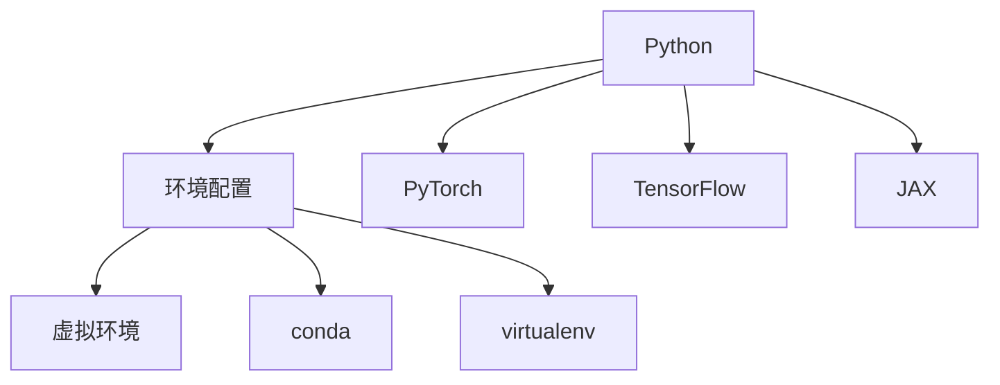

                 

# 从零开始大模型开发与微调：环境搭建1：安装Python

> 关键词：Python安装,环境配置,PyTorch安装,虚拟环境,开发工具推荐

## 1. 背景介绍

### 1.1 问题由来
随着深度学习技术的快速发展，大模型在自然语言处理(Natural Language Processing, NLP)、计算机视觉(Computer Vision, CV)等领域取得了令人瞩目的成果。大模型的训练和微调需要强大的计算资源和专业的开发环境，因此，如何高效搭建开发环境，成为了开发者们的必修课。本系列文章将带领读者一步步从零开始搭建大模型的开发环境，进行模型开发与微调。

## 2. 核心概念与联系

### 2.1 核心概念概述
在搭建大模型开发环境的过程中，涉及几个核心概念：

- **Python**：作为目前最流行的编程语言之一，Python在大模型开发中扮演了重要的角色。其简洁易读、库资源丰富，使得NLP任务开发变得更加高效。
- **环境配置**：大模型开发环境通常需要配置多个库和工具，通过虚拟环境管理，可以避免不同项目之间的依赖冲突，提高开发效率。
- **PyTorch**：作为深度学习领域的主流框架，PyTorch提供了强大的张量计算和动态图功能，支持各类深度学习模型的开发。
- **开发工具推荐**：除了PyTorch，还有许多其他工具和库（如TensorFlow、JAX等），用于加速大模型的开发和部署。

### 2.2 核心概念原理和架构的 Mermaid 流程图(Mermaid 流程节点中不要有括号、逗号等特殊字符)



这个流程图展示了Python、环境配置、虚拟环境、PyTorch、TensorFlow、JAX之间的关系：

1. Python是大模型开发的主要语言。
2. 环境配置包括虚拟环境管理。
3. 虚拟环境用于隔离不同项目的依赖，避免冲突。
4. PyTorch、TensorFlow、JAX是主要的深度学习框架，支持大模型的训练和推理。
5. conda和virtualenv是两个常用的环境管理工具。

## 3. 核心算法原理 & 具体操作步骤

### 3.1 算法原理概述
大模型开发环境搭建的核心在于确保所选框架和库的兼容性，以及开发过程中能够高效使用。

### 3.2 算法步骤详解

#### 3.2.1 安装Python

Python是所有深度学习框架的基础，因此首先需要安装Python。通常建议安装最新版本（截至2023年，建议使用Python 3.9及以上版本）。

**操作步骤**：

1. 访问Python官网（https://www.python.org/）下载最新版本的Python安装包。
2. 根据操作系统选择合适的安装包进行安装。
3. 安装完成后，通过命令行工具验证安装是否成功。

#### 3.2.2 创建虚拟环境

虚拟环境是一种隔离不同项目依赖的方法，有助于避免依赖冲突，提高开发效率。

**操作步骤**：

1. 使用conda或virtualenv创建虚拟环境。
2. 在虚拟环境中安装所需的库和工具。

**示例**：

**使用conda创建虚拟环境**：

```bash
conda create -n myenv python=3.9
conda activate myenv
```

**使用virtualenv创建虚拟环境**：

```bash
virtualenv myenv
source myenv/bin/activate
```

#### 3.2.3 安装PyTorch

PyTorch是大模型开发中最常用的深度学习框架之一，支持动态图和GPU加速，适合NLP任务的开发。

**操作步骤**：

1. 激活虚拟环境。
2. 使用conda或pip安装PyTorch。

**使用conda安装PyTorch**：

```bash
conda install pytorch torchvision torchaudio -c pytorch
```

**使用pip安装PyTorch**：

```bash
pip install torch torchvision torchaudio
```

### 3.3 算法优缺点

#### 3.3.1 优点

1. **易于上手**：Python简单易学，库资源丰富，开发者可以快速上手。
2. **灵活性高**：通过虚拟环境管理，不同项目之间可以独立运行，避免依赖冲突。
3. **功能强大**：PyTorch支持动态图，适合NLP任务的开发和调试。

#### 3.3.2 缺点

1. **安装复杂**：虚拟环境管理和库安装较为繁琐，新手可能容易出错。
2. **性能问题**：某些深度学习任务可能需要高性能硬件支持，如GPU或TPU。

### 3.4 算法应用领域

Python和PyTorch在大模型开发中的应用非常广泛，主要包括以下领域：

1. **自然语言处理(NLP)**：如语言模型、文本分类、机器翻译等任务。
2. **计算机视觉(CV)**：如图像识别、目标检测、图像分割等任务。
3. **强化学习(Reinforcement Learning, RL)**：如自动游戏、机器人控制等任务。
4. **科学计算**：如数据分析、模拟仿真等任务。

## 4. 数学模型和公式 & 详细讲解 & 举例说明

### 4.1 数学模型构建

在搭建大模型开发环境的过程中，数学模型和公式主要用于指导模型的构建和训练。

#### 4.1.1 模型构建

以大模型为例，我们可以基于PyTorch构建以下模型：

```python
import torch
import torch.nn as nn

class MyModel(nn.Module):
    def __init__(self, input_size, hidden_size, output_size):
        super(MyModel, self).__init__()
        self.fc1 = nn.Linear(input_size, hidden_size)
        self.relu = nn.ReLU()
        self.fc2 = nn.Linear(hidden_size, output_size)
    
    def forward(self, x):
        x = self.fc1(x)
        x = self.relu(x)
        x = self.fc2(x)
        return x
```

#### 4.1.2 公式推导过程

在上述模型中，主要涉及以下公式：

1. 线性变换公式：`y = Wx + b`，其中W为权重矩阵，b为偏置向量。
2. ReLU激活函数：`f(x) = max(0, x)`。
3 输出公式：`y = softmax(Wx + b)`。

### 4.2 公式推导过程

1. **线性变换**：

   - 输入：`x`，维度为`[batch_size, input_size]`
   - 权重矩阵：`W`，维度为`[hidden_size, input_size]`
   - 偏置向量：`b`，维度为`[hidden_size]`
   - 输出：`y`，维度为`[batch_size, hidden_size]`

   $$
   y = Wx + b
   $$

2. **ReLU激活**：

   - 输入：`x`，维度为`[batch_size, hidden_size]`
   - 输出：`y`，维度为`[batch_size, hidden_size]`

   $$
   y = f(x) = \max(0, x)
   $$

3. **输出层**：

   - 输入：`y`，维度为`[batch_size, hidden_size]`
   - 权重矩阵：`W`，维度为`[output_size, hidden_size]`
   - 偏置向量：`b`，维度为`[output_size]`
   - 输出：`y`，维度为`[batch_size, output_size]`

   $$
   y = softmax(Wy + b)
   $$

### 4.3 案例分析与讲解

在实际应用中，我们可以通过修改模型的隐藏层数和隐藏单元数，来调整模型的复杂度和性能。例如，增加隐藏层数和隐藏单元数，可以提升模型的表达能力，但也可能增加过拟合的风险。

## 5. 项目实践：代码实例和详细解释说明

### 5.1 开发环境搭建

#### 5.1.1 环境配置

1. **安装Python**：

   - 下载Python安装包并完成安装。
   - 通过命令行验证安装是否成功。

2. **创建虚拟环境**：

   - 使用conda或virtualenv创建虚拟环境。
   - 激活虚拟环境。

**示例**：

**使用conda创建虚拟环境**：

```bash
conda create -n myenv python=3.9
conda activate myenv
```

**使用virtualenv创建虚拟环境**：

```bash
virtualenv myenv
source myenv/bin/activate
```

#### 5.1.2 安装PyTorch

1. 激活虚拟环境。
2. 使用conda或pip安装PyTorch。

**使用conda安装PyTorch**：

```bash
conda install pytorch torchvision torchaudio -c pytorch
```

**使用pip安装PyTorch**：

```bash
pip install torch torchvision torchaudio
```

### 5.2 源代码详细实现

#### 5.2.1 构建模型

```python
import torch
import torch.nn as nn

class MyModel(nn.Module):
    def __init__(self, input_size, hidden_size, output_size):
        super(MyModel, self).__init__()
        self.fc1 = nn.Linear(input_size, hidden_size)
        self.relu = nn.ReLU()
        self.fc2 = nn.Linear(hidden_size, output_size)
    
    def forward(self, x):
        x = self.fc1(x)
        x = self.relu(x)
        x = self.fc2(x)
        return x
```

#### 5.2.2 训练模型

```python
import torch
import torch.nn as nn
import torch.optim as optim

# 定义模型
model = MyModel(input_size, hidden_size, output_size)

# 定义损失函数和优化器
criterion = nn.CrossEntropyLoss()
optimizer = optim.SGD(model.parameters(), lr=0.01)

# 定义训练循环
for epoch in range(num_epochs):
    for batch in data_loader:
        # 前向传播
        outputs = model(batch.x)
        loss = criterion(outputs, batch.y)
        
        # 反向传播
        optimizer.zero_grad()
        loss.backward()
        optimizer.step()
```

### 5.3 代码解读与分析

#### 5.3.1 模型构建

在上述代码中，我们定义了一个简单的神经网络模型，包含两个全连接层和一个ReLU激活函数。其中，`nn.Linear`用于实现线性变换，`nn.ReLU`用于实现ReLU激活，`nn.CrossEntropyLoss`用于计算交叉熵损失。

#### 5.3.2 训练模型

在训练过程中，我们使用了随机梯度下降（SGD）优化器和交叉熵损失函数。通过循环遍历数据集，不断进行前向传播和反向传播，更新模型参数。

### 5.4 运行结果展示

在训练完成后，我们可以通过以下代码评估模型的性能：

```python
# 评估模型
correct = 0
total = 0
with torch.no_grad():
    for batch in data_loader:
        outputs = model(batch.x)
        _, predicted = torch.max(outputs.data, 1)
        total += batch.y.size(0)
        correct += (predicted == batch.y).sum().item()

print('Accuracy of the network on the test images: %d %%' % (100 * correct / total))
```

## 6. 实际应用场景

### 6.1 智能客服系统

智能客服系统是NLP技术的重要应用场景之一。通过使用大模型微调技术，可以构建一个能够理解客户问题的智能客服系统，提供24小时不间断的服务。

### 6.2 金融舆情监测

金融舆情监测是大模型在金融领域的重要应用。通过微调模型，可以实时监测市场舆情，及时发现风险点，帮助金融机构做出决策。

### 6.3 个性化推荐系统

个性化推荐系统利用大模型的预测能力，为用户提供个性化的产品推荐。通过微调模型，可以提升推荐的准确性和多样性。

### 6.4 未来应用展望

未来，大模型微调技术将在更多领域得到应用，如智慧医疗、教育、城市治理等。通过微调，可以构建更加智能化、个性化的应用系统，提升各行各业的运营效率。

## 7. 工具和资源推荐

### 7.1 学习资源推荐

1. **官方文档**：
   - PyTorch官方文档：https://pytorch.org/docs/stable/index.html
   - TensorFlow官方文档：https://www.tensorflow.org/api_docs/python/tf
   - JAX官方文档：https://jax.readthedocs.io/en/latest/index.html

2. **在线课程**：
   - 《深度学习》（吴恩达）：https://www.coursera.org/specializations/deep-learning
   - 《PyTorch深度学习》：https://www.coursera.org/learn/deep-learning-pytorch

3. **书籍推荐**：
   - 《深度学习》（Ian Goodfellow、Yoshua Bengio、Aaron Courville）：https://www.deeplearningbook.org/

### 7.2 开发工具推荐

1. **PyTorch**：
   - 官方文档：https://pytorch.org/docs/stable/index.html
   - 在线教程：https://pytorch.org/tutorials/beginner/deep_learning_60min_blitz.html

2. **TensorFlow**：
   - 官方文档：https://www.tensorflow.org/api_docs/python/tf
   - 在线教程：https://www.tensorflow.org/tutorials

3. **JAX**：
   - 官方文档：https://jax.readthedocs.io/en/latest/index.html
   - 在线教程：https://jax.readthedocs.io/en/latest/notebooks/quickstart.html

### 7.3 相关论文推荐

1. **《Attention is All You Need》**：
   - 论文链接：https://arxiv.org/abs/1706.03762
   - 摘要：介绍Transformer模型，提出了自注意力机制，在自然语言处理任务中取得了突破性进展。

2. **《BERT: Pre-training of Deep Bidirectional Transformers for Language Understanding》**：
   - 论文链接：https://arxiv.org/abs/1810.04805
   - 摘要：提出BERT模型，通过掩码语言模型和下一句预测任务进行预训练，提升了语言理解能力。

3. **《Parameter-Efficient Transfer Learning for NLP》**：
   - 论文链接：https://arxiv.org/abs/1912.12877
   - 摘要：提出 Adapter 等参数高效微调方法，在保持预训练权重不变的前提下，提升微调效率和效果。

## 8. 总结：未来发展趋势与挑战

### 8.1 总结

通过搭建大模型的开发环境，我们能够顺利进行模型的开发与微调。本文介绍了Python的安装、虚拟环境的创建、PyTorch的安装等关键步骤，并给出了具体的代码示例。

### 8.2 未来发展趋势

未来，大模型微调技术将继续发展，主要趋势包括：

1. **更强大的硬件支持**：随着硬件的进步，大模型的规模将进一步扩大，性能也将得到提升。
2. **更高效的学习方法**：如自监督学习、半监督学习等方法将减少对标注数据的依赖。
3. **更广泛的应用场景**：大模型微调技术将在更多领域得到应用，如医疗、教育、城市治理等。
4. **更灵活的模型结构**：通过更灵活的模型结构和训练策略，提升模型的表达能力和泛化能力。

### 8.3 面临的挑战

尽管大模型微调技术取得了一些进展，但仍面临以下挑战：

1. **计算资源成本高**：大模型的训练和微调需要大量计算资源，成本较高。
2. **模型复杂度高**：大规模模型的训练和推理需要更复杂的算法和硬件支持。
3. **模型泛化能力不足**：在大规模数据集上的预训练和微调，可能在特定领域或特定数据上泛化能力不足。
4. **数据隐私和安全问题**：在处理敏感数据时，需要考虑数据隐私和安全问题。

### 8.4 研究展望

为了应对这些挑战，未来需要继续探索和优化大模型微调技术，主要方向包括：

1. **提升模型效率**：通过更高效的训练方法和硬件支持，提升模型训练和推理效率。
2. **改进模型结构**：通过更灵活的模型结构和训练策略，提升模型的表达能力和泛化能力。
3. **增强模型可解释性**：通过更好的模型解释方法，提升模型的可解释性和透明度。
4. **确保数据安全**：通过数据隐私保护和模型安全设计，确保模型的安全性和隐私性。

## 9. 附录：常见问题与解答

**Q1: 在搭建大模型开发环境时，需要注意哪些问题？**

A: 在搭建大模型开发环境时，需要注意以下几点：

1. **环境配置**：确保虚拟环境管理和库安装无误。
2. **硬件资源**：需要足够的GPU/TPU资源支持深度学习模型的训练和推理。
3. **数据准备**：准备足够的标注数据和未标注数据，以进行模型训练和验证。

**Q2: 如何提升大模型的训练效率？**

A: 提升大模型训练效率可以从以下几个方面入手：

1. **使用GPU/TPU**：利用高性能硬件，加速模型的训练。
2. **使用分布式训练**：将模型训练任务分布到多个设备上，并行计算。
3. **优化算法**：使用更高效的优化器，如AdamW、Adafactor等。
4. **模型压缩**：对模型进行剪枝、量化等操作，减少计算资源消耗。

**Q3: 在模型训练过程中，如何选择学习率？**

A: 选择学习率时需要考虑以下几个因素：

1. **初始学习率**：一般建议从小值开始，如0.001。
2. **学习率调度**：可以使用warmup策略，逐渐增加学习率。
3. **动态调整**：根据模型性能，动态调整学习率。

**Q4: 在模型训练过程中，如何避免过拟合？**

A: 避免过拟合可以采用以下几种方法：

1. **正则化**：使用L2正则、Dropout等技术，减少模型复杂度。
2. **数据增强**：对训练数据进行增强，如旋转、裁剪、缩放等。
3. **早停机制**：在验证集上监控模型性能，及时停止训练。

**Q5: 在模型训练过程中，如何评估模型性能？**

A: 评估模型性能可以采用以下几种方法：

1. **准确率**：计算模型在测试集上的分类准确率。
2. **精确率、召回率和F1值**：计算模型在分类任务上的精确率、召回率和F1值。
3. **ROC曲线**：绘制ROC曲线，评估模型在不同阈值下的性能。

**Q6: 在模型训练过程中，如何调整模型参数？**

A: 调整模型参数可以采用以下几种方法：

1. **手动调整**：通过手动调整模型超参数，寻找最优参数组合。
2. **自动搜索**：使用自动搜索算法，如贝叶斯优化、随机搜索等。
3. **模型压缩**：对模型进行剪枝、量化等操作，减少模型参数数量。

---

作者：禅与计算机程序设计艺术 / Zen and the Art of Computer Programming

