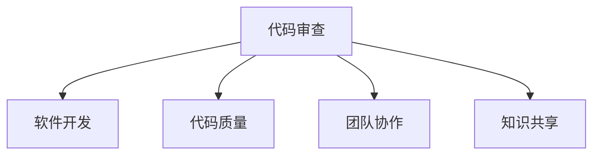

                 

# 代码审查服务：将专业技能转化为收入

> 关键词：代码审查, 技能转换, 收入提升, 软件开发, 团队协作, 质量保证

## 1. 背景介绍

在当今快速发展的技术环境中，软件开发成为了推动创新和业务增长的关键驱动力。然而，随着软件复杂性的增加和项目规模的扩大，如何保证软件质量、降低开发成本、提升开发效率，成为了每个软件开发团队必须面对的重大挑战。

### 1.1 问题由来
传统的软件开发流程通常依赖于迭代开发和测试，但在不断缩短的项目周期和提高产品质量的双重压力下，这种方式已经无法满足日益增长的需求。尤其是在大型企业中，代码审查成为了确保软件质量的重要手段之一。

### 1.2 问题核心关键点
代码审查（Code Review），也称为同行评审，是指由代码开发者之外的同行对代码进行检查和评估的过程。代码审查旨在发现并解决代码中的错误、漏洞和代码风格问题，提升代码质量，同时促进团队之间的知识共享和技术交流。

代码审查不仅能够发现代码中潜在的问题，还能够促进团队合作，提高团队成员之间的沟通效率和协作能力。然而，代码审查的实施过程繁琐且容易忽略，使得其在实际开发中并未得到充分的重视。

## 2. 核心概念与联系

### 2.1 核心概念概述

为更好地理解代码审查在软件开发中的应用，本节将介绍几个密切相关的核心概念：

- **代码审查**：通过同行之间的相互评估，发现并修正代码中的错误、漏洞和风格问题，提升代码质量。
- **软件开发**：指从需求分析、设计、编码到测试、部署的软件全生命周期管理过程。
- **代码质量**：指代码的可靠性、可维护性、可读性等，是软件开发中重要的质量保证手段。
- **团队协作**：指软件开发过程中团队成员之间的互动、沟通和合作。
- **知识共享**：指通过代码审查等形式，使团队成员之间共享经验和技术知识，促进共同进步。

这些核心概念之间的逻辑关系可以通过以下Mermaid流程图来展示：



这个流程图展示了代码审查与其他核心概念之间的联系：

1. 代码审查是软件开发过程的一个重要环节，通过提升代码质量，间接提高软件产品的整体质量。
2. 代码审查可以促进团队协作，增强团队成员之间的互动和沟通。
3. 代码审查是知识共享的重要渠道，通过评估和讨论代码，使团队成员掌握最新的开发技术。

## 3. 核心算法原理 & 具体操作步骤
### 3.1 算法原理概述

代码审查的原理是通过团队内部的交流和协作，利用集体智慧发现并解决代码中的问题。代码审查过程中，审查者需要综合考虑代码的正确性、可读性、性能和可维护性等方面，提出修改建议。

代码审查的实施过程主要分为以下几个步骤：

1. **准备代码库**：将代码提交到代码库，为代码审查提供基础。
2. **代码提交**：开发者将代码提交到代码库，并发起代码审查请求。
3. **代码审查**：其他开发者对提交的代码进行审查，提出修改建议。
4. **代码修改**：开发者根据审查建议进行修改。
5. **代码合并**：修改后的代码被合并到主库中，完成代码审查流程。

### 3.2 算法步骤详解

以下是代码审查的详细操作步骤：

**Step 1: 准备代码库和工具**
- 选择合适的代码库管理工具，如Git、SVN等，用于存储和管理代码。
- 安装和配置代码审查工具，如Gerrit、Review Board等，用于触发和处理代码审查请求。

**Step 2: 代码提交**
- 开发者编写代码，并将代码提交到代码库。
- 为代码提交添加描述信息，以便其他开发者理解代码内容。
- 发起代码审查请求，选择审查者和审查规则。

**Step 3: 代码审查**
- 审查者根据代码审查工具的规则和描述信息，进行代码审查。
- 提出修改建议，并附上详细说明。
- 如果审查过程中发现重大问题，可以拒绝代码提交。

**Step 4: 代码修改**
- 开发者根据审查建议进行修改，并再次提交代码。
- 如有必要，可以多次迭代修改，直至所有审查意见被解决。

**Step 5: 代码合并**
- 审查者确认代码修改无误后，将代码合并到主库中。
- 完成代码审查流程，代码提交者获得批准，完成代码修改。

### 3.3 算法优缺点

代码审查具有以下优点：
1. 发现并修正代码中的错误和漏洞，提升代码质量。
2. 促进团队成员之间的互动和协作，增强团队凝聚力。
3. 通过集体智慧，共享知识和经验，提高团队整体技术水平。

同时，代码审查也存在以下局限性：
1. 审查过程耗费时间，可能会影响项目进度。
2. 审查效果依赖于审查者的专业水平和经验。
3. 审查过程可能会过于繁琐，导致团队成员感到负担。
4. 审查过程可能会引发不必要的冲突和争议。

尽管存在这些局限性，但就目前而言，代码审查仍是软件开发过程中不可或缺的质量保证手段。未来相关研究的重点在于如何进一步提高审查效率，减少审查过程的繁琐性，并提高审查效果的客观性和可量化性。

### 3.4 算法应用领域

代码审查的应用领域十分广泛，包括但不限于以下几个方面：

1. **软件开发**：代码审查在软件开发的全生命周期中均有应用，从需求分析、设计到编码、测试等各个阶段，代码审查都能发现和解决潜在问题。

2. **项目管理和团队协作**：代码审查不仅是代码质量保证的手段，更是团队协作的重要环节。通过代码审查，团队成员之间可以更好地沟通和协作，提高工作效率。

3. **知识共享和传承**：代码审查过程中的讨论和建议，能够促进团队成员之间的知识共享和技术传承，使团队整体水平不断提高。

4. **代码重构和优化**：代码审查过程中，审查者可以提出重构和优化的建议，使代码更加高效、可读性强。

## 4. 数学模型和公式 & 详细讲解 & 举例说明

### 4.1 数学模型构建

假设代码审查过程由 $N$ 个开发者参与，每个开发者对提交的代码进行独立审查。设审查者的审查能力为 $C$，代码提交的错误数量为 $E$，审查后的错误数量为 $E'$，则代码审查的效果可以用以下公式表示：

$$
E' = E \times \prod_{i=1}^{N} (1 - C_i)
$$

其中 $C_i$ 表示第 $i$ 个开发者的审查能力，假设其服从概率分布 $P(C_i)$，则上式可进一步扩展为：

$$
E' = E \times \prod_{i=1}^{N} \int (1 - C) P(C) dC
$$

### 4.2 公式推导过程

通过上述公式，我们可以看出，代码审查的效果与审查者的数量和审查能力密切相关。假设审查者能力均匀分布，即 $P(C_i) = \frac{1}{C_{max}}$，则有：

$$
E' = E \times (1 - \frac{1}{C_{max}})^N
$$

其中 $C_{max}$ 表示单个开发者的最大审查能力。当 $C_{max}$ 接近1时，审查效果显著，即错误数量减少，代码质量提升。

### 4.3 案例分析与讲解

假设代码审查过程中，有3个开发者参与，每个开发者的审查能力均匀分布在 [0.5, 1] 之间。如果初始错误数量为20个，则代码审查后的错误数量为：

$$
E' = 20 \times (1 - \frac{1}{C_{max}})^3
$$

当 $C_{max} = 0.8$ 时，有：

$$
E' = 20 \times (1 - 0.5)^3 = 20 \times 0.125 = 2.5
$$

即审查后的错误数量减少了14.5个，审查效果显著。

## 5. 项目实践：代码实例和详细解释说明
### 5.1 开发环境搭建

在进行代码审查实践前，我们需要准备好开发环境。以下是使用Python进行代码审查开发的环境配置流程：

1. 安装Anaconda：从官网下载并安装Anaconda，用于创建独立的Python环境。

2. 创建并激活虚拟环境：
```bash
conda create -n code-review python=3.8 
conda activate code-review
```

3. 安装必要的库：
```bash
pip install requests numpy pandas beautifulsoup4
```

4. 配置代码审查工具：
```bash
gerrit init
gerrit plugin enable review-event-notification
gerrit set-site-plugin review-event-notification --merge-callback='python:review_event_notification.merge_callback'
```

完成上述步骤后，即可在`code-review`环境中开始代码审查实践。

### 5.2 源代码详细实现

下面我们以Gerrit代码审查系统为例，给出代码审查的Python实现。

首先，定义代码审查的基本类：

```python
import requests
from bs4 import BeautifulSoup

class ReviewEventNotification:
    def __init__(self, site_url):
        self.site_url = site_url
        
    def merge_callback(self, event):
        if event.type == 'merge_request_completed':
            self.notify(event.project.name, event.author.username, event.merge_request.diff_revision)

    def notify(self, project, author, diff):
        url = f"{self.site_url}/{}.html".format(project)
        response = requests.get(url)
        soup = BeautifulSoup(response.content, 'html.parser')
        # 在此提取相关信息，并进行通知处理
```

然后，定义具体的通知函数：

```python
def extract_diff(soup):
    # 在此提取 diff 信息，并进行处理
    pass

def send_notification(project, author, diff):
    # 在此发送通知信息，可以采用电子邮件、即时消息等方式
    pass
```

最后，配置Gerrit的合并回调函数：

```bash
gerrit set-site-plugin review-event-notification --merge-callback='python:review_event_notification.merge_callback'
```

以上就是使用Python进行Gerrit代码审查的完整代码实现。可以看到，通过Gerrit插件的回调机制，我们可以实现代码提交完成后自动触发通知，从而实时监控代码审查过程。

### 5.3 代码解读与分析

让我们再详细解读一下关键代码的实现细节：

**ReviewEventNotification类**：
- `__init__`方法：初始化Gerrit的站点URL，用于构造通知的请求URL。
- `merge_callback`方法：当代码提交完成后，自动触发通知，调用`notify`方法进行信息提取和处理。
- `notify`方法：用于发送通知信息，需要结合具体平台（如邮件、即时消息等）实现通知逻辑。

**extract_diff函数**：
- 在`notify`方法中，通过Gerrit提供的API获取代码提交的diff信息，并解析HTML内容，提取相关信息。

**send_notification函数**：
- 在`notify`方法中，根据具体的通知方式，发送通知信息。例如，可以使用SMTP库发送电子邮件，或使用Telegram Bot API发送即时消息。

**Gerrit配置**：
- 在`merge_callback`方法中，将回调函数地址配置到Gerrit的合并回调函数中，确保代码提交完成后能够自动触发通知。

### 5.4 运行结果展示

代码审查实践的运行结果展示：

在代码提交完成后，Gerrit系统自动触发通知，通过回调函数调用`notify`方法，提取diff信息，并发送通知给相关开发者。开发人员根据通知信息，可以进行代码审查，并提出修改建议。

## 6. 实际应用场景
### 6.1 软件开发公司

代码审查在软件开发公司的应用十分广泛，特别是在大型企业中。通过代码审查，能够及时发现和修复代码中的错误和漏洞，提升软件产品的质量，同时促进团队成员之间的互动和协作，增强团队凝聚力。

### 6.2 开源社区

开源社区中，代码审查也是推动项目发展的重要手段之一。通过代码审查，社区成员可以共同维护代码库，发现和解决代码中的问题，提升项目质量。同时，代码审查还能够促进社区成员之间的互动和协作，增强社区的活跃度和凝聚力。

### 6.3 教育培训

在教育培训领域，代码审查也是一种有效的学习方式。通过代码审查，学生可以学习到代码编写的最佳实践和规范，提升编程能力和代码质量。同时，代码审查还能够促进学生之间的互动和协作，增强学习效果。

### 6.4 未来应用展望

随着技术的发展，代码审查的应用场景将更加广泛。未来的代码审查技术将更加智能化、自动化，能够更好地支持团队协作和知识共享。同时，代码审查也将与更多新兴技术相结合，如区块链、人工智能等，形成更加复杂但高效的软件开发流程。

## 7. 工具和资源推荐
### 7.1 学习资源推荐

为了帮助开发者系统掌握代码审查的理论基础和实践技巧，这里推荐一些优质的学习资源：

1. 《代码审查的艺术》系列书籍：介绍代码审查的理论基础、最佳实践和工具使用方法，帮助开发者提升代码审查能力。

2. Git官方文档：详细介绍Git的版本控制和代码审查流程，是学习Git和代码审查的基础资源。

3. 《代码审查指南》（Code Review: The Survey of Common Techniques）：汇总了多种代码审查技术，帮助开发者选择合适的审查方法。

4. GitHub官方文档：介绍GitHub的代码审查工具和实践方法，适用于GitHub平台的用户。

5. Atlassian Confluence：提供丰富的代码审查文档和最佳实践，适用于JIRA、Bitbucket等Atlassian产品用户。

通过对这些资源的学习实践，相信你一定能够快速掌握代码审查的理论基础和实践技巧，提升代码质量和团队协作能力。

### 7.2 开发工具推荐

高效的开发离不开优秀的工具支持。以下是几款用于代码审查开发的常用工具：

1. Gerrit：开源的代码审查工具，支持多种版本控制系统和代码库，提供强大的插件机制。

2. Review Board：企业级的代码审查工具，支持多种语言和平台，提供丰富的自定义配置选项。

3. GitHub：提供强大的代码审查和版本控制功能，适用于开源社区和企业用户。

4. Atlassian JIRA：提供代码审查和项目管理功能，适用于JIRA、Bitbucket等Atlassian产品用户。

5. GitLab：提供代码审查和持续集成功能，适用于开源社区和企业用户。

合理利用这些工具，可以显著提升代码审查的效率和质量，加速软件开发进程。

### 7.3 相关论文推荐

代码审查技术的发展源于学界的持续研究。以下是几篇奠基性的相关论文，推荐阅读：

1. "A Survey of Common Techniques for Peer Code Review"（《代码审查的技术综述》）：总结了多种代码审查技术，提供了广泛的理论支持和实践指导。

2. "The Impact of Code Review on Product Quality and Developer Efficiency"（《代码审查对产品质量和开发者效率的影响》）：分析了代码审查对产品质量和开发者效率的影响，提供了数据支持和定量分析。

3. "Scalable Code Review Processes in Large Software Development Organizations"（《大规模软件开发组织中的可扩展代码审查流程》）：研究了大规模组织中的代码审查流程，提供了实际应用中的优化建议。

4. "Bridging the Gap between Developers and Testers through Code Review"（《通过代码审查弥合开发者和测试者之间的差距》）：探讨了代码审查在测试和开发之间的桥梁作用，提供了实践指导和案例分析。

这些论文代表了大规模软件开发中的代码审查技术的发展脉络。通过学习这些前沿成果，可以帮助研究者把握学科前进方向，激发更多的创新灵感。

## 8. 总结：未来发展趋势与挑战

### 8.1 总结

本文对代码审查的原理和实践进行了全面系统的介绍。首先阐述了代码审查在软件开发中的应用背景和重要性，明确了代码审查在确保软件质量、促进团队协作、提高开发效率等方面的独特价值。其次，从原理到实践，详细讲解了代码审查的数学模型和操作步骤，给出了代码审查任务开发的完整代码实例。同时，本文还探讨了代码审查在软件开发、开源社区、教育培训等多个领域的应用场景，展示了代码审查技术的广泛应用前景。最后，本文精选了代码审查技术的学习资源和开发工具，力求为读者提供全方位的技术指引。

通过本文的系统梳理，可以看到，代码审查是软件开发中不可或缺的质量保证手段，对提升代码质量、促进团队协作、加速软件开发进程具有重要意义。

### 8.2 未来发展趋势

展望未来，代码审查技术将呈现以下几个发展趋势：

1. 代码审查工具的智能化。未来的代码审查工具将更加智能化，能够自动发现和修复代码中的问题，提高审查效率。

2. 代码审查流程的自动化。未来的代码审查流程将更加自动化，能够自动触发代码审查，进行代码合并等操作，降低人工干预的负担。

3. 代码审查过程的可量化。未来的代码审查过程将更加可量化，通过统计分析，评估代码审查的效果和影响。

4. 代码审查方法的创新。未来的代码审查方法将更加多样化，结合更多的技术手段，如人工智能、区块链等，形成更加高效、可靠的代码审查流程。

这些趋势凸显了代码审查技术的广阔前景。这些方向的探索发展，必将进一步提升代码审查的效率和效果，为软件开发过程提供更加坚实的质量保证。

### 8.3 面临的挑战

尽管代码审查技术已经取得了瞩目成就，但在迈向更加智能化、自动化、可量化的应用过程中，它仍面临诸多挑战：

1. 审查效率的瓶颈。代码审查过程繁琐耗时，尤其是大型项目和复杂系统，审查效率低下，可能影响项目进度。

2. 审查效果的客观性。代码审查的评估标准和效果度量存在主观性，如何客观评估审查效果，仍是一个难题。

3. 审查过程的透明性。代码审查过程中可能存在信息不对称，如何保证审查过程的透明性和公正性，是一个重要问题。

4. 审查工具的适应性。不同组织、不同项目的代码审查需求不同，如何设计适应性强、灵活配置的审查工具，是一个挑战。

5. 审查过程的可持续性。如何保证代码审查的持续性和稳定性，避免过度依赖单个审查者，也是一个问题。

这些挑战需要业界共同努力，通过技术创新和经验积累，逐步克服。只有不断提升代码审查的效率和效果，才能真正发挥其质量保证的作用。

### 8.4 未来突破

面对代码审查所面临的种种挑战，未来的研究需要在以下几个方面寻求新的突破：

1. 引入更多先验知识。将符号化的先验知识，如知识图谱、逻辑规则等，与神经网络模型进行巧妙融合，引导代码审查过程学习更准确、合理的代码规范。

2. 引入因果分析和博弈论工具。将因果分析方法引入代码审查模型，识别出代码审查的因果关系，增强代码审查的逻辑性和可解释性。借助博弈论工具刻画人机交互过程，主动探索并规避审查过程的脆弱点，提高系统稳定性。

3. 加强数据驱动的代码审查。通过机器学习和大数据分析技术，从历史代码审查数据中挖掘规律，提高代码审查的效果和效率。

4. 设计可量化的审查指标。引入可量化的评估指标，如代码提交频率、代码质量提升率等，对代码审查的效果进行客观评估，确保代码审查的质量和效果。

这些研究方向的探索，必将引领代码审查技术迈向更高的台阶，为软件开发过程提供更加高效、可靠的质量保证。面向未来，代码审查技术还需要与其他人工智能技术进行更深入的融合，如知识表示、因果推理、强化学习等，多路径协同发力，共同推动软件开发的进步。只有勇于创新、敢于突破，才能不断拓展代码审查的边界，让软件开发过程更加高效、可靠。

## 9. 附录：常见问题与解答

**Q1：代码审查是否适用于所有软件开发项目？**

A: 代码审查在软件开发项目中普遍适用，特别是对于大型企业、开源社区、教育培训等领域，代码审查能显著提升软件质量和团队协作效率。但对于小型项目或个人开发，审查成本较高，可能并不适用。

**Q2：如何进行代码审查？**

A: 代码审查的主要步骤包括代码提交、代码审查、代码修改、代码合并等。首先，开发者将代码提交到代码库，并发起代码审查请求。然后，其他开发者对提交的代码进行审查，提出修改建议。开发者根据审查建议进行修改，并再次提交代码。最后，审查者确认代码修改无误后，将代码合并到主库中，完成代码审查流程。

**Q3：代码审查过程中需要注意哪些问题？**

A: 代码审查过程中需要注意以下几个问题：
1. 审查效率：避免过度审查，提高审查效率，减少项目进度影响。
2. 审查效果：确保审查效果的客观性和可量化性，避免主观偏见。
3. 审查透明性：保证审查过程的透明性和公正性，避免信息不对称。
4. 审查工具：设计适应性强、灵活配置的审查工具，满足不同项目的审查需求。
5. 审查可持续性：避免过度依赖单个审查者，保持代码审查的持续性和稳定性。

这些问题的解决需要开发者的共同努力，通过技术创新和经验积累，逐步克服。

**Q4：如何提升代码审查的效率和效果？**

A: 提升代码审查效率和效果的方法包括：
1. 引入更多先验知识：将符号化的先验知识，如知识图谱、逻辑规则等，与神经网络模型进行巧妙融合，引导代码审查过程学习更准确、合理的代码规范。
2. 引入因果分析和博弈论工具：将因果分析方法引入代码审查模型，识别出代码审查的因果关系，增强代码审查的逻辑性和可解释性。借助博弈论工具刻画人机交互过程，主动探索并规避审查过程的脆弱点，提高系统稳定性。
3. 加强数据驱动的代码审查：通过机器学习和大数据分析技术，从历史代码审查数据中挖掘规律，提高代码审查的效果和效率。
4. 设计可量化的审查指标：引入可量化的评估指标，如代码提交频率、代码质量提升率等，对代码审查的效果进行客观评估，确保代码审查的质量和效果。

这些方法的引入将极大提升代码审查的效率和效果，为软件开发过程提供更加高效、可靠的质量保证。

**Q5：代码审查的未来发展方向是什么？**

A: 代码审查的未来发展方向包括：
1. 代码审查工具的智能化：未来的代码审查工具将更加智能化，能够自动发现和修复代码中的问题，提高审查效率。
2. 代码审查流程的自动化：未来的代码审查流程将更加自动化，能够自动触发代码审查，进行代码合并等操作，降低人工干预的负担。
3. 代码审查过程的可量化：未来的代码审查过程将更加可量化，通过统计分析，评估代码审查的效果和影响。
4. 代码审查方法的创新：未来的代码审查方法将更加多样化，结合更多的技术手段，如人工智能、区块链等，形成更加高效、可靠的代码审查流程。

这些趋势凸显了代码审查技术的广阔前景。这些方向的探索发展，必将进一步提升代码审查的效率和效果，为软件开发过程提供更加坚实的质量保证。

---

作者：禅与计算机程序设计艺术 / Zen and the Art of Computer Programming

