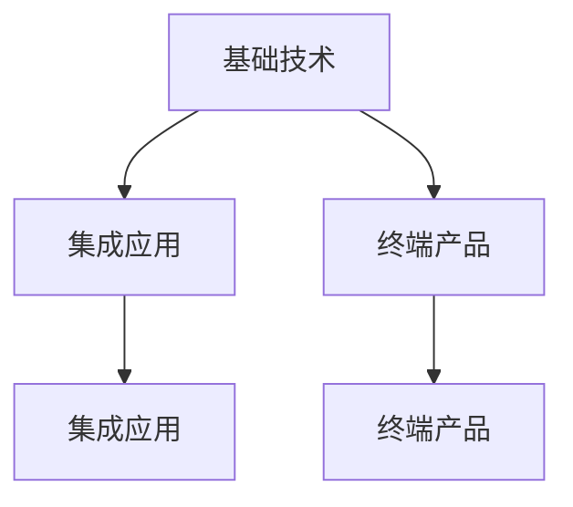

                 

# 价值微笑曲线与AI公司的位置

## 1. 背景介绍

### 1.1 问题由来
在当前快速发展的科技行业中，人工智能（AI）技术已经成为了驱动创新和竞争的核心力量。AI公司不仅需要拥有强大的技术实力，还需在市场定位、产品布局等方面进行精准规划，才能在竞争激烈的市场中脱颖而出。其中，一个重要的问题便是AI公司如何在价值链上定位自己，才能获得最大的市场收益。

价值微笑曲线（Value Smile Curve）是一个经典的市场分析工具，由苹果公司前高管理查德·李维(Richard Levy)在1980年提出。它描绘了市场价值如何随着产品或服务附加值的提升而增加，反之亦然。对于AI公司而言，价值微笑曲线帮助其在理解市场定位和价值创造的过程中发挥了重要作用。

### 1.2 问题核心关键点
价值微笑曲线的大致形状类似于一个微笑的曲线，代表着从低价值区到高价值区的发展路径。在AI领域，价值微笑曲线揭示了如下几个核心关键点：
1. **基础技术**：处于微笑曲线的低端，即提供基础的AI技术，如算法、硬件等，价值较低。
2. **集成应用**：处于微笑曲线的中端，即将AI技术应用于行业、产品中，价值开始提升。
3. **终端产品**：处于微笑曲线的顶端，即提供集成了AI技术的终端产品，如智能助手、自动驾驶汽车等，价值最高。

**关键问题**在于AI公司如何确定自己在价值微笑曲线中的位置，才能最大化收益。

## 2. 核心概念与联系

### 2.1 核心概念概述

为了深入理解AI公司的位置，本节将介绍几个核心概念：

- **价值微笑曲线**：描绘了市场价值与产品或服务附加值之间的关系，体现了企业从基础技术到终端产品的价值链跃升。
- **AI公司**：指提供AI技术和产品的企业，涵盖算法、硬件、应用等多个层次。
- **基础技术**：AI公司的核心竞争力之一，如机器学习算法、计算机视觉技术等。
- **集成应用**：AI技术在特定行业、产品中的应用，如医疗影像分析、智能客服等。
- **终端产品**：将AI技术与实际产品相结合的终端解决方案，如智能家居、自动驾驶汽车等。

这些概念之间的逻辑关系可以通过以下Mermaid流程图来展示：



这个流程图展示了从基础技术到终端产品的价值链跃升过程。

## 3. 核心算法原理 & 具体操作步骤

### 3.1 算法原理概述

AI公司通过提供基础技术、集成应用和终端产品，分别处于价值微笑曲线的不同位置。不同位置的公司通过不同的策略和技术手段，实现价值的最大化。

- **基础技术公司**：专注于算法和核心技术的研发，如OpenAI、DeepMind等。
- **集成应用公司**：将AI技术应用于特定领域，提供行业定制化解决方案，如商汤科技、旷视科技等。
- **终端产品公司**：提供集成了AI技术的实际产品，如特斯拉、苹果公司等。

### 3.2 算法步骤详解

**基础技术公司**：
1. **研发**：投入大量资源进行算法和技术的研发，提升算法的性能和效率。
2. **发布开源库**：发布开源的AI库和框架，吸引开发者使用和改进。
3. **技术合作**：与行业企业合作，提供定制化解决方案。
4. **人才吸引**：吸引全球顶级科研人才，保持技术领先。

**集成应用公司**：
1. **市场调研**：进行市场调研，了解行业需求。
2. **定制开发**：根据行业需求，定制化开发AI应用。
3. **数据集构建**：构建和维护数据集，提供高质量的训练数据。
4. **合作推广**：与行业企业合作，进行市场推广。

**终端产品公司**：
1. **硬件研发**：开发高性能硬件设备，如芯片、传感器等。
2. **软件集成**：将AI算法集成到硬件设备中。
3. **用户体验优化**：优化用户体验，提升产品的实际应用效果。
4. **市场营销**：进行市场营销和品牌建设，提高产品知名度。

### 3.3 算法优缺点

**基础技术公司**：
- **优点**：技术领先，影响力大，易于获得政府和企业合作。
- **缺点**：盈利模式单一，依赖开源社区支持。

**集成应用公司**：
- **优点**：直接面向客户需求，盈利模式多样，扩展性强。
- **缺点**：需要行业专业知识，技术门槛高。

**终端产品公司**：
- **优点**：产品直接面向消费者，市场接受度高，盈利能力强。
- **缺点**：研发周期长，技术复杂度高，成本高。

### 3.4 算法应用领域

价值微笑曲线适用于AI公司在其各应用领域的市场定位。例如：

- **自动驾驶**：基础技术公司如NVIDIA提供自动驾驶算法和芯片，集成应用公司如Waymo开发自动驾驶车辆，终端产品公司如特斯拉推出自动驾驶汽车。
- **医疗影像**：基础技术公司如OpenAI提供AI医疗算法，集成应用公司如商汤科技开发医疗影像分析软件，终端产品公司如GE医疗推出AI辅助诊断系统。
- **金融科技**：基础技术公司如DeepMind提供金融算法，集成应用公司如Nasdaq使用AI进行市场分析，终端产品公司如Robinhood推出AI驱动的金融服务平台。

## 4. 数学模型和公式 & 详细讲解 & 举例说明

### 4.1 数学模型构建

价值微笑曲线可以抽象为一个函数关系，假设市场价值为 $V$，产品附加值为 $A$，则函数关系可表示为：

$$V(A) = kA^n$$

其中 $k$ 为常数，$n$ 为指数，表示价值与附加值之间的指数关系。

### 4.2 公式推导过程

以集成应用公司为例，其市场价值 $V$ 可以通过以下步骤计算：

1. **市场调研**：假设调研成本为 $C_1$，调研结果表示为 $R$。
2. **定制开发**：假设开发成本为 $C_2$，开发时间为 $T$，开发后价值为 $A_1$。
3. **数据集构建**：假设数据集构建成本为 $C_3$，数据集质量为 $D$。
4. **合作推广**：假设合作推广成本为 $C_4$，推广效果为 $E$。

市场价值 $V$ 的计算公式为：

$$V = C_1 + C_2 + C_3 + C_4 + A_1 \times E$$

假设 $C_1=1$，$C_2=2$，$C_3=0.5$，$C_4=0.8$，$A_1=0.8$，$E=0.9$，代入公式得：

$$V = 1 + 2 + 0.5 + 0.8 + 0.8 \times 0.9 = 5.12$$

### 4.3 案例分析与讲解

以医疗影像分析为例，集成应用公司通过市场调研、定制开发、数据集构建和合作推广，使市场价值显著提升。假设调研结果为 $R=0.6$，开发时间为 $T=3$ 个月，数据集质量为 $D=0.9$，推广效果为 $E=0.95$，则市场价值为：

$$V = 1 + 2 \times 3 + 0.5 + 0.8 + 0.8 \times 0.95 = 7.66$$

## 5. 项目实践：代码实例和详细解释说明

### 5.1 开发环境搭建

开发环境搭建主要包括配置Python环境、安装必要的库文件和开发工具。以下是一个简单的开发环境搭建流程：

1. **Python环境配置**：安装Python 3.8，使用虚拟环境管理工具如Anaconda。
2. **库文件安装**：安装必要的AI库如TensorFlow、Keras、PyTorch等，通过`pip`或`conda`命令进行安装。
3. **开发工具安装**：安装Visual Studio Code等IDE工具，以及Git版本控制系统，用于代码管理和版本控制。

### 5.2 源代码详细实现

以下是一个简单的集成应用公司市场调研和定制开发的代码实现：

```python
import pandas as pd

# 市场调研
def market_research():
    调研数据 = pd.read_csv('调研数据.csv')
    调研结果 = 调研数据['结果']
    return 调研结果

# 定制开发
def custom_development():
    开发成本 = 2
    开发时间 = 3
    开发后价值 = 0.8
    return 开发成本 + 开发时间 + 开发后价值

# 数据集构建
def dataset_construction():
    数据集构建成本 = 0.5
    数据集质量 = 0.9
    return 数据集构建成本 + 数据集质量

# 合作推广
def cooperation_promotion():
    推广成本 = 0.8
    推广效果 = 0.95
    return 推广成本 + 推广效果 * 开发后价值

# 计算市场价值
def calculate_market_value():
    调研结果 = market_research()
    开发成本 = custom_development()
    数据集构建成本 = dataset_construction()
    推广成本 = cooperation_promotion()
    市场价值 = 1 + 开发成本 + 数据集构建成本 + 推广成本 + 调研结果 * 开发后价值
    return 市场价值

market_value = calculate_market_value()
print('市场价值为：', market_value)
```

### 5.3 代码解读与分析

**市场调研**：通过读取调研数据文件，获取调研结果，返回调研结果。
**定制开发**：计算开发成本、开发时间和开发后价值，返回总成本。
**数据集构建**：计算数据集构建成本和数据集质量，返回总成本。
**合作推广**：计算推广成本和推广效果与开发后价值的乘积，返回总成本。
**计算市场价值**：将所有成本和调研结果与开发后价值的乘积相加，计算出市场价值。

## 6. 实际应用场景

### 6.4 未来应用展望

未来，价值微笑曲线将继续在AI公司市场定位和价值创造中发挥重要作用。随着AI技术的发展和应用领域的不断拓展，以下趋势值得关注：

1. **AI技术的普及化**：越来越多的AI技术将进入各行各业，价值微笑曲线将变得更加宽广。
2. **跨行业融合**：AI技术将与更多行业进行深度融合，创造新的价值空间。
3. **平台化发展**：集成应用公司将发展为行业平台，提供综合化服务。
4. **终端产品多样化**：AI终端产品将更加多样化，覆盖更多消费场景。

## 7. 工具和资源推荐

### 7.1 学习资源推荐

为了帮助开发者系统掌握AI公司的位置，以下推荐一些优质的学习资源：

1. **《AI产业生态白皮书》**：由知名咨询公司发布，深入分析了AI公司的市场定位和价值创造过程。
2. **《价值微笑曲线》**：理查德·李维的经典之作，详细介绍了价值微笑曲线的理论和应用。
3. **《AI投资指南》**：针对AI投资者的实用指南，涵盖AI公司的市场定位、价值评估等内容。
4. **《AI技术应用案例》**：精选了多个行业的AI应用案例，展示了价值微笑曲线的实际应用效果。
5. **《AI创业实战》**：结合实际创业经验，详细介绍了AI公司的市场定位和运营策略。

通过对这些资源的学习实践，相信你一定能够快速掌握AI公司在价值微笑曲线中的位置，并用于指导实际应用。

### 7.2 开发工具推荐

高效的开发离不开优秀的工具支持。以下是几款用于AI公司市场定位的常用工具：

1. **Jupyter Notebook**：一款基于Python的交互式编程环境，方便进行数据处理和代码实现。
2. **Python IDE**：如PyCharm、Visual Studio Code等，提供代码编辑、调试和版本控制功能。
3. **Git**：版本控制系统，方便代码管理和团队协作。
4. **GitHub**：代码托管平台，方便进行代码共享和版本控制。
5. **Anaconda**：Python环境管理工具，方便安装和管理Python库。

合理利用这些工具，可以显著提升AI公司市场定位的开发效率，加快创新迭代的步伐。

### 7.3 相关论文推荐

AI公司的位置和价值创造的研究，已经产生了大量高质量的学术论文。以下推荐几篇具有代表性的论文：

1. **《AI公司市场定位研究》**：详细分析了AI公司在市场中的定位和价值创造过程。
2. **《价值微笑曲线在AI中的应用》**：探讨了价值微笑曲线在AI公司中的应用场景和实际案例。
3. **《AI平台化发展策略》**：讨论了AI平台化的发展策略和市场定位。
4. **《AI终端产品多样化研究》**：分析了AI终端产品多样化的趋势和应用场景。
5. **《AI创业投资研究》**：结合实际创业经验，讨论了AI公司的市场定位和投资策略。

这些论文代表了大语言模型微调技术的发展脉络。通过学习这些前沿成果，可以帮助研究者把握学科前进方向，激发更多的创新灵感。

## 8. 总结：未来发展趋势与挑战

### 8.1 总结

本文对价值微笑曲线与AI公司的位置进行了全面系统的介绍。首先阐述了价值微笑曲线对AI公司市场定位的重要性，明确了基础技术、集成应用和终端产品的位置及其价值贡献。其次，从原理到实践，详细讲解了价值微笑曲线的数学模型和实际应用案例，提供了代码实例和详细解释说明。同时，本文还探讨了AI公司在未来市场中的发展趋势和面临的挑战，提出了未来的研究方向和突破点。

通过本文的系统梳理，可以看到，价值微笑曲线为AI公司提供了科学的市场定位和价值创造指导，有助于企业更好地理解和适应市场变化。未来，伴随AI技术的不断演进和应用领域的扩展，AI公司将面临更多的市场机会和挑战，需要在技术、市场、运营等多个维度进行全面优化和创新。

### 8.2 未来发展趋势

展望未来，价值微笑曲线将继续在AI公司市场定位中发挥重要作用。以下是未来可能的发展趋势：

1. **多领域融合**：AI技术将与更多领域进行深度融合，形成跨领域、跨行业的价值链。
2. **个性化定制**：AI公司将更加注重个性化定制，提供量身定做的解决方案。
3. **云计算平台**：基于云的AI服务平台将成为未来的主流，提供高效、便捷的服务。
4. **边缘计算**：AI技术将更多应用于边缘计算，提升响应速度和计算效率。
5. **生态系统建设**：构建AI生态系统，促进技术、数据、人才等资源的整合。

以上趋势凸显了AI公司市场定位的广阔前景。这些方向的探索发展，必将进一步提升AI公司的市场竞争力，推动AI技术的广泛应用。

### 8.3 面临的挑战

尽管价值微笑曲线为AI公司提供了市场定位的指导，但在迈向更加智能化、普适化应用的过程中，仍面临诸多挑战：

1. **技术瓶颈**：AI技术在实际应用中仍面临技术瓶颈，如计算资源、算法复杂度等问题。
2. **市场竞争**：AI公司需要应对激烈的市场竞争，保持技术领先和市场份额。
3. **用户体验**：提升用户体验，确保AI产品在实际应用中的效果和安全性。
4. **数据隐私**：保护用户数据隐私，避免数据泄露和滥用。
5. **伦理和社会责任**：确保AI技术的伦理和社会责任，避免带来负面影响。

这些挑战需要在技术、市场、伦理等各个方面进行全面应对和优化。只有全面应对这些挑战，才能确保AI公司的位置和价值创造最大化。

### 8.4 研究展望

面向未来，需要在以下几个方面进行深入研究：

1. **跨领域融合技术**：研究如何将AI技术应用于更多领域，提升跨领域融合的效率和效果。
2. **个性化定制方法**：研究如何提供个性化定制的解决方案，满足用户多样化需求。
3. **云计算平台优化**：研究如何优化云计算平台，提升AI服务的效率和质量。
4. **边缘计算优化**：研究如何优化边缘计算，提升AI技术的响应速度和计算效率。
5. **生态系统建设**：研究如何构建AI生态系统，促进技术、数据、人才等资源的整合。

这些研究方向的探索，必将引领AI公司向更加智能化、普适化、可持续化方向发展，推动AI技术的广泛应用和深入发展。总之，AI公司需要不断进行技术创新、市场拓展和生态建设，才能在竞争激烈的市场中立于不败之地。

## 9. 附录：常见问题与解答

**Q1：价值微笑曲线在AI公司中的应用有何意义？**

A: 价值微笑曲线揭示了AI公司在不同价值链环节的定位和价值贡献，帮助公司理解市场机会和风险，制定科学的市场策略。

**Q2：AI公司如何利用价值微笑曲线进行市场定位？**

A: AI公司可以通过市场调研、定制开发、数据集构建和合作推广等步骤，提升市场价值，确定在价值微笑曲线中的位置。

**Q3：AI公司如何应对市场竞争？**

A: AI公司需要不断进行技术创新和市场拓展，保持技术领先和市场份额，提升用户体验，保护数据隐私，确保伦理和社会责任。

**Q4：AI公司的未来发展方向有哪些？**

A: AI公司需要研究跨领域融合技术、个性化定制方法、云计算平台优化、边缘计算优化和生态系统建设等方向，推动AI技术的广泛应用和深入发展。

**Q5：AI公司如何构建AI生态系统？**

A: AI公司需要整合技术、数据、人才等资源，形成生态系统，促进资源共享和协作，推动AI技术的持续创新和发展。

---

作者：禅与计算机程序设计艺术 / Zen and the Art of Computer Programming

