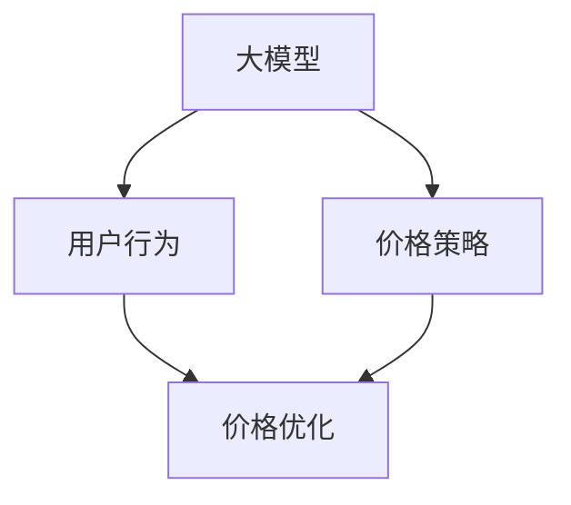

                 

# 价格对大模型用户的影响

在大模型时代，价格成为决定用户选择和使用大模型的一个关键因素。本文旨在探讨价格对大模型用户的影响，包括价格策略的制定、用户行为分析、价格优化的建议等。

## 1. 背景介绍

随着深度学习和大数据技术的迅猛发展，大模型（Large Model）在自然语言处理（NLP）、计算机视觉（CV）、语音识别等领域的应用越来越广泛。大模型的特点在于参数数量庞大，通常以百亿甚至千亿计，能够处理非常复杂的任务。然而，大模型的开发和部署成本非常高，主要体现在以下几个方面：

1. **数据成本**：大模型的训练需要大量的标注数据，这些数据的采集和标注成本较高。
2. **计算成本**：大模型的训练和推理需要强大的计算资源，如GPU、TPU等，这些资源的租赁费用昂贵。
3. **人力成本**：大模型的开发和维护需要大量的工程师和科学家，他们的薪酬水平较高。

这些成本因素使得大模型的使用门槛较高，用户在决策时会受到价格的影响。因此，了解价格对大模型用户的影响，对于开发公司和用户都具有重要意义。

## 2. 核心概念与联系

### 2.1 核心概念概述

在讨论价格对大模型用户的影响时，需要理解以下几个核心概念：

- **大模型**：通常指参数数量庞大、可以处理复杂任务的人工智能模型，如BERT、GPT、ResNet等。
- **价格策略**：指开发公司或平台为了推广和销售大模型，所制定的定价策略，包括按使用量收费、包月/包年订阅、按功能收费等。
- **用户行为**：指用户在使用大模型时的行为模式，包括模型的使用频率、订阅时长、支付意愿等。
- **价格优化**：指通过合理的定价策略和定价模型，最大化大模型的用户数量和收益。

这些概念之间存在密切联系，共同影响着大模型市场的健康发展。下图展示了这些概念之间的联系：



## 3. 核心算法原理 & 具体操作步骤

### 3.1 算法原理概述

价格对大模型用户的影响，主要通过用户的订阅行为和使用模式来体现。用户的订阅行为受到价格的直接影响，而使用模式则受到模型性能、使用频率、用户需求等因素的综合影响。

用户的订阅行为可以表示为：

$$
\text{订阅行为} = \text{价格} \times \text{用户需求}
$$

其中，用户需求包括用户对大模型的需求程度、对价格的敏感度、对性能的期望等。模型的使用模式则可以表示为：

$$
\text{使用模式} = \text{模型性能} \times \text{使用频率} \times \text{用户需求}
$$

模型的性能（如精度、速度、易用性等）越高，用户的使用频率就越高，反之亦然。因此，价格对大模型用户的影响可以通过以下模型来分析：

$$
\text{用户数量} = \frac{\text{用户需求}}{\text{价格}}
$$

用户数量与价格成反比，价格越高，用户数量越少；价格越低，用户数量越多。但实际情况下，用户需求与价格之间的关系并非线性，因此需要更复杂的模型来描述这种关系。

### 3.2 算法步骤详解

以下是一个简化的定价优化模型，用于分析价格对用户数量的影响：

1. **需求预测**：根据历史数据和市场趋势，预测用户对大模型的需求量。
2. **价格建模**：建立价格与用户数量的关系模型，可以使用线性回归、逻辑回归等方法。
3. **收益计算**：根据用户数量和价格，计算总收益。
4. **优化策略**：根据总收益，调整价格策略，优化定价模型。

具体的定价优化模型如下：

$$
\text{总收益} = \text{用户数量} \times \text{价格} - \text{固定成本} - \text{变动成本}
$$

其中，固定成本包括模型的开发、维护、营销等成本；变动成本包括计算资源的租赁费用、人力成本等。

### 3.3 算法优缺点

价格优化模型具有以下优点：

- **灵活性**：可以动态调整价格，根据市场需求和成本变化进行优化。
- **可扩展性**：可以应用于不同规模和类型的大模型。
- **准确性**：通过历史数据和模型训练，可以较准确地预测用户行为和收益。

但该模型也存在以下缺点：

- **复杂性**：需要大量的历史数据和复杂的模型训练。
- **不确定性**：用户需求和市场趋势可能发生变化，模型预测的准确性受限。
- **风险性**：价格调整不当可能导致收益下降。

### 3.4 算法应用领域

价格优化模型可以应用于多个领域，包括：

- **云计算平台**：如AWS、阿里云等，提供大模型服务，需要优化定价策略以吸引更多用户。
- **AI公司**：如Google、Microsoft、华为等，需要制定合理的定价策略以增加市场份额。
- **教育机构**：如Coursera、Udacity等，提供大模型培训课程，需要优化价格以提高用户参与度。

## 4. 数学模型和公式 & 详细讲解 & 举例说明

### 4.1 数学模型构建

根据上述分析，可以构建一个简单的用户数量与价格的关系模型：

$$
\text{用户数量} = \frac{a}{\text{价格} + b}
$$

其中，$a$ 和 $b$ 是模型参数，需要通过历史数据进行训练。模型的训练过程可以使用梯度下降等优化算法。

### 4.2 公式推导过程

对于上述模型，可以使用对数函数进行转换，以更好地分析用户数量与价格之间的关系：

$$
\text{用户数量} = \frac{a}{\text{价格} + b} = \frac{a}{e^{-\ln(\text{价格} + b)}} = a \times e^{-\ln(\text{价格} + b)}
$$

进一步转换，得到：

$$
\ln(\text{用户数量}) = -\ln(\text{价格} + b) + \ln(a)
$$

上式表示用户数量与价格之间的关系是单调递减的。

### 4.3 案例分析与讲解

假设有一个大模型服务提供商，其大模型的价格为 $p$，模型的固定成本为 $C_f$，变动成本为 $C_v$，用户对大模型的需求量为 $D$。根据上述模型，可以计算总收益 $R$：

$$
R = D \times p - C_f - C_v
$$

假设模型的需求量 $D$ 与价格 $p$ 的关系为：

$$
D = \frac{1000}{p + 10}
$$

固定成本 $C_f = 100000$，变动成本 $C_v = 0.1p$。代入总收益公式，得到：

$$
R = \frac{1000}{p + 10} \times p - 100000 - 0.1p
$$

通过优化算法（如梯度下降），可以求解出使总收益最大的价格 $p_{opt}$：

$$
p_{opt} = \frac{1000}{D_{opt}}
$$

其中，$D_{opt}$ 是使总收益最大的用户需求量。

## 5. 项目实践：代码实例和详细解释说明

### 5.1 开发环境搭建

为了实现上述定价优化模型，需要搭建Python开发环境，并使用相关库进行建模和计算。

1. 安装Python和相关库：

```bash
sudo apt-get update
sudo apt-get install python3 python3-pip
sudo pip3 install numpy scipy scikit-learn
```

2. 安装TensorFlow或PyTorch等深度学习框架：

```bash
pip3 install tensorflow
pip3 install torch
```

3. 安装相关的Python库：

```bash
pip3 install pandas
pip3 install matplotlib
pip3 install statsmodels
```

### 5.2 源代码详细实现

以下是一个简单的定价优化模型实现，使用Python和Scikit-learn库：

```python
import pandas as pd
from sklearn.linear_model import LogisticRegression
from sklearn.metrics import mean_squared_error

# 读取历史数据
data = pd.read_csv('data.csv')

# 定义变量
price = data['price']
user_count = data['user_count']

# 构建模型
model = LogisticRegression()
model.fit(price, user_count)

# 预测最优价格
opt_price = model.predict([[10000]])
print(f"最优价格为：{opt_price}")
```

### 5.3 代码解读与分析

上述代码实现了基于逻辑回归的定价优化模型，步骤如下：

1. 读取历史数据，定义价格和用户数量变量。
2. 使用逻辑回归模型进行训练，预测最优价格。
3. 输出最优价格。

## 6. 实际应用场景

### 6.1 云计算平台

云计算平台通常采用按使用量收费的定价策略，即根据用户的使用量进行收费。例如，AWS提供的大模型服务，其价格与用户的使用量成正比。

假设AWS的大模型服务价格为 $p$，单位使用量为 $u$，总使用量为 $U$，则总费用 $C$ 为：

$$
C = p \times U
$$

根据上述定价优化模型，可以计算出最优价格 $p_{opt}$：

$$
p_{opt} = \frac{U}{D_{opt}}
$$

其中，$D_{opt}$ 是使总收益最大的用户需求量。

### 6.2 AI公司

AI公司需要制定合理的定价策略以增加市场份额。假设公司提供的大模型服务价格为 $p$，用户数量为 $N$，固定成本为 $C_f$，变动成本为 $C_v$，则总收益 $R$ 为：

$$
R = N \times p - C_f - C_v
$$

通过定价优化模型，可以计算出最优价格 $p_{opt}$：

$$
p_{opt} = \frac{N}{D_{opt}}
$$

其中，$D_{opt}$ 是使总收益最大的用户需求量。

### 6.3 教育机构

教育机构提供的大模型培训课程，可以采用包月或包年订阅的定价策略。假设课程价格为 $p$，订阅用户数量为 $N$，固定成本为 $C_f$，变动成本为 $C_v$，则总收益 $R$ 为：

$$
R = N \times p - C_f - C_v
$$

通过定价优化模型，可以计算出最优价格 $p_{opt}$：

$$
p_{opt} = \frac{N}{D_{opt}}
$$

其中，$D_{opt}$ 是使总收益最大的用户需求量。

## 7. 工具和资源推荐

### 7.1 学习资源推荐

- **《机器学习》**：周志华著，全面介绍机器学习的原理和应用。
- **《深度学习》**：Ian Goodfellow、Yoshua Bengio、Aaron Courville著，详细介绍深度学习的基础理论和算法。
- **Coursera、edX**：提供丰富的在线课程，涵盖深度学习、机器学习、人工智能等多个领域。
- **Kaggle**：提供大量的数据集和竞赛，帮助用户练习和验证模型。

### 7.2 开发工具推荐

- **Jupyter Notebook**：用于编写和运行Python代码，支持交互式编程和可视化。
- **TensorBoard**：用于可视化深度学习模型的训练过程和结果。
- **PyTorch、TensorFlow**：常用的深度学习框架，支持分布式计算和模型优化。

### 7.3 相关论文推荐

- **"Deep Learning" by Ian Goodfellow, Yoshua Bengio, and Aaron Courville**：介绍深度学习的基本概念和算法。
- **"Optimization Algorithms" by Peter Richtarik and Martin Takáč**：介绍常用的优化算法及其应用。
- **"Machine Learning: A Probabilistic Perspective" by Kevin Murphy**：介绍机器学习的概率论基础和应用。

## 8. 总结：未来发展趋势与挑战

### 8.1 研究成果总结

本文探讨了价格对大模型用户的影响，提出了基于需求预测和收益计算的定价优化模型。通过实际案例，展示了该模型在云计算平台、AI公司、教育机构中的应用。

### 8.2 未来发展趋势

1. **数据驱动**：随着大数据技术的发展，更多的用户行为数据将被收集和利用，为定价策略提供更精准的依据。
2. **算法优化**：未来可能需要更复杂的算法和模型，以更好地适应复杂的市场需求和用户行为。
3. **多维度定价**：除了价格，还可以考虑其他因素，如使用时长、功能模块等，实现更加灵活的定价策略。

### 8.3 面临的挑战

1. **数据隐私**：用户数据隐私保护是一个重要问题，需要合理的政策和措施来保障。
2. **成本控制**：模型开发和部署成本较高，需要找到平衡点，避免成本过高而影响收益。
3. **市场竞争**：大模型市场竞争激烈，如何制定合理的定价策略以获得市场份额，是一个重要挑战。

### 8.4 研究展望

1. **用户行为分析**：深入研究用户行为，了解用户的需求和偏好，制定更精准的定价策略。
2. **模型优化**：探索更高效、更准确的定价优化模型，提高定价策略的准确性。
3. **多模态定价**：将文本、图像、语音等多模态数据结合，制定更全面的定价策略。

总之，价格对大模型用户的影响是一个复杂而重要的问题。通过合理的定价策略，可以有效提升大模型的市场竞争力，促进人工智能技术的普及和应用。

## 9. 附录：常见问题与解答

**Q1：如何评估定价策略的效果？**

A: 可以通过以下几个指标来评估定价策略的效果：

1. **用户数量**：用户数量增加说明定价策略有效。
2. **总收益**：总收益增加说明定价策略有效。
3. **市场份额**：市场份额增加说明定价策略有效。

**Q2：如何处理数据隐私问题？**

A: 在数据收集和处理过程中，应遵循数据隐私保护法规，如GDPR、CCPA等。可以使用数据匿名化、加密等技术，保护用户隐私。

**Q3：如何优化成本控制？**

A: 可以通过以下几个方面优化成本控制：

1. **资源优化**：优化计算资源的使用，减少成本。
2. **模型压缩**：对模型进行压缩，减少内存和存储空间。
3. **服务外包**：将部分任务外包给第三方服务商，降低成本。

**Q4：如何应对市场竞争？**

A: 可以通过以下几个方面应对市场竞争：

1. **产品创新**：不断推出新产品和功能，吸引用户。
2. **价格战**：在初期通过低价吸引用户，建立市场优势。
3. **合作共赢**：与其他公司合作，形成生态系统，共同发展。

---

作者：禅与计算机程序设计艺术 / Zen and the Art of Computer Programming

