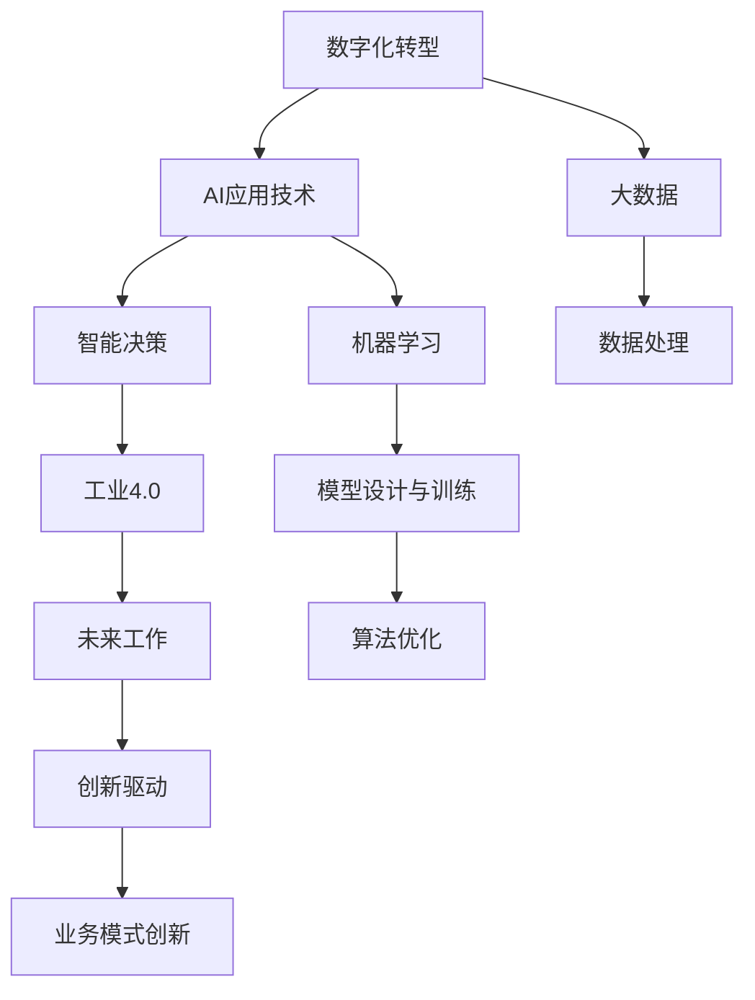

                 

# 企业数字化转型中的AI应用技术

> 关键词：数字化转型,企业,人工智能(AI),AI应用技术,大数据,自动化,机器学习,智能决策,工业4.0,未来工作,创新驱动

## 1. 背景介绍

### 1.1 问题由来
在数字化转型的浪潮下，企业纷纷寻求技术创新以提升竞争力。而人工智能(AI)技术以其强大的数据处理能力和智能化决策能力，成为了数字化转型的核心驱动力。AI的应用范围从简单的自动化流程管理，拓展到复杂的智能决策支持、产品创新等关键业务场景，正在重塑企业的运营模式。

### 1.2 问题核心关键点
企业数字化转型的成功，依赖于AI技术在业务流程、数据处理、智能决策等方面的深度应用。然而，AI应用的复杂性和多样性，使得企业在引入AI时面临诸多挑战。本文将详细探讨AI在企业数字化转型中的应用技术，从数据收集与处理、模型设计与训练、智能决策与自动化等多个角度，深入解析AI技术的实际应用策略。

### 1.3 问题研究意义
深入理解AI在企业数字化转型中的应用技术，对于提升企业的数字化能力、优化运营流程、创新业务模式具有重要意义：

1. **提高运营效率**：通过引入自动化和智能决策系统，企业可以大幅提升业务处理速度，减少人力成本，提高整体运营效率。
2. **优化决策支持**：AI系统可以分析海量数据，提供深度洞察，辅助企业做出更加科学、准确的决策。
3. **增强竞争力**：通过AI技术驱动的创新，企业可以在市场竞争中获得先机，提升产品和服务的差异化水平。
4. **促进数据驱动**：AI技术的应用使得企业能够更好地理解和利用自身和外部数据，实现数据驱动的智能运营。
5. **推动智能制造**：AI在工业4.0中的应用，正在改变制造业的生产方式，提高生产效率和质量。
6. **促进工作转型**：AI技术的应用也促使传统岗位向知识型、创意型方向转型，推动劳动力结构的优化升级。

## 2. 核心概念与联系

### 2.1 核心概念概述

为更好地理解AI在企业数字化转型中的应用技术，本节将介绍几个密切相关的核心概念：

- **数字化转型**：通过引入现代信息技术，重构企业的业务流程、组织结构和商业模式，实现业务数字化、智能化、自动化的过程。
- **人工智能(AI)**：一种通过算法和大数据驱动的智能技术，可以实现语音识别、图像处理、自然语言处理等人类智能行为。
- **大数据**：海量、复杂、多样化的数据集合，为企业提供了丰富的业务洞察和决策依据。
- **机器学习**：一种让机器通过数据学习规律，从而提高决策和预测能力的算法。
- **智能决策**：基于数据分析和AI模型，自动化做出高效、科学的决策。
- **工业4.0**：以互联网、大数据、云计算、AI为核心的新一代工业革命，旨在实现智能化生产。
- **未来工作**：随着AI技术的发展，许多传统岗位将被自动化取代，人类将更多从事创造性工作。
- **创新驱动**：通过技术创新，推动企业商业模式和产品服务的创新发展。

这些核心概念之间的逻辑关系可以通过以下Mermaid流程图来展示：



这个流程图展示了一系列概念之间的逻辑联系：

1. 数字化转型推动了AI技术的应用，使得企业能够利用大数据和机器学习提升决策效率。
2. AI系统通过智能决策支持，推动了工业4.0和未来工作变革。
3. 数据分析、模型设计、算法优化等技术手段，是实现AI应用的基础。
4. 创新驱动促进了企业业务模式和产品服务的创新发展。

## 3. 核心算法原理 & 具体操作步骤
### 3.1 算法原理概述

AI在企业数字化转型中的应用，主要通过以下几个步骤实现：

1. **数据收集与处理**：从内部业务系统和外部网络获取数据，进行清洗、预处理和特征工程，构建训练数据集。
2. **模型设计与训练**：选择合适的AI模型，并使用训练数据集进行模型参数优化，形成可用的AI应用模型。
3. **智能决策与自动化**：将训练好的模型应用于实际业务场景，实现智能决策和自动化流程管理。

### 3.2 算法步骤详解

企业AI应用技术的实施，主要包括以下几个关键步骤：

**Step 1: 数据收集与处理**
- **数据源**：内部业务系统（如ERP、CRM、SCM）和外部网络数据（如社交媒体、公共数据源）。
- **数据清洗**：去除噪声、异常值和冗余数据，确保数据质量。
- **特征工程**：选择合适的特征，并应用数据变换、归一化等技术处理，提升数据表现力。

**Step 2: 模型设计与训练**
- **模型选择**：根据任务需求，选择适合的AI模型，如回归模型、分类模型、聚类模型等。
- **模型优化**：通过交叉验证、正则化、超参数调优等技术，提升模型性能。
- **模型评估**：使用测试集评估模型效果，确保模型泛化能力。

**Step 3: 智能决策与自动化**
- **模型集成**：将训练好的模型集成到企业应用系统中，实现自动化决策和流程管理。
- **系统部署**：在生产环境中部署AI应用，确保系统稳定性和安全性。
- **持续改进**：定期收集反馈数据，进行模型重训练和优化。

### 3.3 算法优缺点

AI在企业数字化转型中的应用，具有以下优点：

1. **效率提升**：自动化流程管理大幅提升业务处理速度，减少人力成本。
2. **决策优化**：基于数据驱动的智能决策系统，提供更加科学、准确的结果。
3. **创新能力**：AI技术驱动的创新，带来新的商业模式和产品服务。
4. **数据驱动**：AI技术的应用，使得企业能够更好地理解和利用自身和外部数据。

然而，AI应用也存在一定的局限性：

1. **数据质量依赖**：AI系统的性能高度依赖数据的质量和完整性，数据质量差可能导致模型失效。
2. **模型复杂性**：一些AI模型需要大量的计算资源和数据支持，可能对企业资源造成压力。
3. **技术门槛高**：AI技术的实施需要专业的数据科学家和工程师，对企业技术能力要求较高。
4. **风险管理**：AI系统可能出现误判或偏差，需要建立相应的风险管理机制。

### 3.4 算法应用领域

AI技术在企业数字化转型中的应用，涵盖多个领域：

- **生产管理**：通过智能制造、预测性维护等技术，提升生产效率和质量。
- **客户服务**：使用智能客服、推荐系统等技术，提升客户体验和服务质量。
- **供应链管理**：通过预测分析、需求优化等技术，提升供应链的灵活性和效率。
- **营销与广告**：使用个性化推荐、广告投放优化等技术，提高营销效果和广告ROI。
- **人力资源管理**：通过智能招聘、员工绩效评估等技术，优化人力资源配置。
- **财务与审计**：使用自动化审计、风险预警等技术，提高财务数据的准确性和审计效率。
- **法律与合规**：使用自然语言处理、信息检索等技术，辅助法律咨询和合规管理。

此外，AI在医疗、教育、物流等诸多领域也有广泛应用，推动了各行业的数字化转型。

## 4. 数学模型和公式 & 详细讲解  
### 4.1 数学模型构建

假设企业有一组历史数据集 $D=\{(x_i,y_i)\}_{i=1}^N$，其中 $x_i$ 为输入特征，$y_i$ 为输出标签。企业希望通过AI模型 $M_{\theta}$，实现从输入特征 $x$ 到输出标签 $y$ 的映射。模型参数 $\theta$ 表示模型结构，可以通过训练数据集 $D$ 进行优化，目标是找到最优参数 $\hat{\theta}$，使得模型在测试集上的预测误差最小化。

### 4.2 公式推导过程

以线性回归模型为例，推导模型训练和预测的公式。假设模型 $M_{\theta}(x)$ 为线性函数：

$$
M_{\theta}(x) = \theta^T x
$$

其中 $\theta$ 为模型参数，$x$ 为输入特征，$y$ 为输出标签。模型的损失函数为均方误差：

$$
L(\theta) = \frac{1}{N} \sum_{i=1}^N (y_i - M_{\theta}(x_i))^2
$$

模型的训练目标是最小化损失函数，即：

$$
\hat{\theta} = \mathop{\arg\min}_{\theta} L(\theta)
$$

根据梯度下降算法，模型的参数更新公式为：

$$
\theta \leftarrow \theta - \eta \nabla_{\theta} L(\theta)
$$

其中 $\eta$ 为学习率，$\nabla_{\theta} L(\theta)$ 为损失函数对参数 $\theta$ 的梯度。

### 4.3 案例分析与讲解

**案例一：预测销售数据**

企业希望通过AI模型预测未来的销售数据。首先，收集历史销售数据，并对其进行预处理。然后，使用线性回归模型对数据进行拟合：

```python
import pandas as pd
from sklearn.linear_model import LinearRegression

# 读取数据
df = pd.read_csv('sales_data.csv')

# 特征工程
X = df[['feature1', 'feature2', 'feature3']]
y = df['sales']

# 训练模型
model = LinearRegression()
model.fit(X, y)

# 预测新数据
new_data = pd.DataFrame({'feature1': [1.2, 3.4, 5.6], 'feature2': [2.3, 4.5, 6.7], 'feature3': [0.1, 0.3, 0.5]})
predictions = model.predict(new_data)
```

在模型训练和预测的过程中，需要注意以下几点：

1. **特征选择**：选择对销售数据影响显著的特征，提升模型的预测能力。
2. **模型调优**：通过交叉验证、正则化等技术，避免过拟合。
3. **数据处理**：进行缺失值处理、异常值检测等，确保数据质量。
4. **模型评估**：使用测试集评估模型性能，选择合适的评价指标（如R²、MAE等）。

**案例二：智能客服**

企业希望通过AI模型实现智能客服，提升客户体验。首先，收集历史客服对话数据，并对其进行标注。然后，使用机器学习模型对数据进行训练：

```python
from sklearn.feature_extraction.text import CountVectorizer
from sklearn.model_selection import train_test_split
from sklearn.naive_bayes import MultinomialNB
from sklearn.metrics import accuracy_score

# 读取数据
df = pd.read_csv('chatlogs.csv')

# 特征工程
vectorizer = CountVectorizer()
X = vectorizer.fit_transform(df['message'])
y = df['label']

# 划分训练集和测试集
X_train, X_test, y_train, y_test = train_test_split(X, y, test_size=0.2)

# 训练模型
clf = MultinomialNB()
clf.fit(X_train, y_train)

# 预测测试集
y_pred = clf.predict(X_test)
accuracy = accuracy_score(y_test, y_pred)
```

在模型训练和预测的过程中，需要注意以下几点：

1. **特征提取**：使用文本向量化技术，将文本数据转化为模型可接受的输入。
2. **模型选择**：选择合适的分类模型（如朴素贝叶斯、逻辑回归等）。
3. **模型评估**：使用准确率、召回率等指标评估模型性能。
4. **模型优化**：通过交叉验证、超参数调优等技术，提升模型效果。

## 5. 项目实践：代码实例和详细解释说明
### 5.1 开发环境搭建

在进行AI项目实践前，我们需要准备好开发环境。以下是使用Python进行TensorFlow和Keras开发的环境配置流程：

1. 安装Anaconda：从官网下载并安装Anaconda，用于创建独立的Python环境。

2. 创建并激活虚拟环境：
```bash
conda create -n tf-env python=3.8 
conda activate tf-env
```

3. 安装TensorFlow：根据CUDA版本，从官网获取对应的安装命令。例如：
```bash
conda install tensorflow -c conda-forge
```

4. 安装Keras：
```bash
pip install keras
```

5. 安装各类工具包：
```bash
pip install numpy pandas scikit-learn matplotlib tqdm jupyter notebook ipython
```

完成上述步骤后，即可在`tf-env`环境中开始AI项目实践。

### 5.2 源代码详细实现

这里我们以预测销售数据为例，给出使用TensorFlow和Keras进行线性回归模型的PyTorch代码实现。

首先，定义模型类：

```python
from tensorflow.keras import Sequential
from tensorflow.keras.layers import Dense

class LinearRegressionModel(Sequential):
    def __init__(self, input_dim):
        super(LinearRegressionModel, self).__init__()
        self.add(Dense(1, input_dim=input_dim))
```

然后，定义数据处理和模型训练函数：

```python
from sklearn.datasets import load_boston
from sklearn.model_selection import train_test_split
from sklearn.metrics import mean_squared_error
from sklearn.preprocessing import StandardScaler

# 加载数据
boston = load_boston()
X, y = boston.data, boston.target

# 数据预处理
scaler = StandardScaler()
X = scaler.fit_transform(X)
X_train, X_test, y_train, y_test = train_test_split(X, y, test_size=0.2)

# 构建模型
model = LinearRegressionModel(input_dim=X_train.shape[1])

# 编译模型
model.compile(loss='mse', optimizer='adam', metrics=['mse'])

# 训练模型
history = model.fit(X_train, y_train, epochs=100, batch_size=32, validation_data=(X_test, y_test))
```

最后，评估模型性能：

```python
# 预测测试集
y_pred = model.predict(X_test)

# 计算误差
mse = mean_squared_error(y_test, y_pred)
print(f"Mean Squared Error: {mse:.3f}")
```

以上就是使用TensorFlow和Keras进行线性回归模型的完整代码实现。可以看到，Keras提供了高度抽象的API，使得模型构建和训练过程更加简单高效。

### 5.3 代码解读与分析

让我们再详细解读一下关键代码的实现细节：

**LinearRegressionModel类**：
- `__init__`方法：初始化模型结构，包括一个全连接层。
- `add`方法：添加神经网络层。

**数据预处理**：
- 使用sklearn的`load_boston`函数加载波士顿房价数据集。
- 对特征数据进行标准化处理，以提升模型的收敛速度。
- 使用`train_test_split`函数将数据集划分为训练集和测试集。

**模型训练**：
- 定义模型架构，包括一个具有1个输出的全连接层。
- 使用Keras的`compile`方法配置模型的损失函数、优化器和评估指标。
- 使用`fit`方法训练模型，记录训练过程中的历史数据。
- 使用`evaluate`方法评估模型性能，计算均方误差。

在实际应用中，还需要对数据预处理、模型构建、训练调参等环节进行优化设计，以进一步提升模型性能。

## 6. 实际应用场景
### 6.1 智能制造

在智能制造领域，AI技术的应用极大地提升了生产效率和产品质量。通过工业4.0技术，企业可以实现预测性维护、智能生产调度、供应链优化等。例如，使用机器学习模型对设备运行数据进行分析，预测设备故障和维护时间，减少停机时间，提高设备利用率。此外，通过AI技术优化生产流程，实现个性化定制和柔性生产，满足市场需求的变化。

### 6.2 智能客服

智能客服系统已经成为许多企业的重要组成部分。通过AI技术，企业可以实现24小时不间断的客户服务，提高客户满意度。例如，使用自然语言处理技术，分析客户输入的文本，识别客户情绪和需求，提供个性化回复。通过智能客服系统的集成，企业可以大大降低人力成本，提升服务质量。

### 6.3 智能推荐

推荐系统在电商、内容平台等领域得到了广泛应用。通过AI技术，企业可以分析用户的浏览、购买、评分等行为数据，推荐个性化的产品和服务。例如，使用协同过滤、内容推荐等技术，提升用户的购物体验和平台粘性。通过推荐系统，企业可以实现精准营销，增加销售额。

### 6.4 智能安全

安全监控和管理是企业运营中的重要环节。通过AI技术，企业可以实现视频监控的智能分析，提升安全管理的效率和准确性。例如，使用目标检测、行为分析等技术，实时监测视频中的异常行为，及时报警。通过智能安全系统的建设，企业可以显著降低安全风险，保障企业财产和员工安全。

### 6.5 智能人力资源管理

人力资源管理是企业运营中的关键环节。通过AI技术，企业可以实现招聘、绩效评估、员工培训等业务的智能化管理。例如，使用自然语言处理技术，分析简历内容，筛选适合的候选人。通过智能招聘系统，企业可以快速找到合适的员工，提升招聘效率。通过员工绩效分析，企业可以识别优秀员工，提供激励措施。

## 7. 工具和资源推荐
### 7.1 学习资源推荐

为了帮助开发者系统掌握AI在企业数字化转型中的应用技术，这里推荐一些优质的学习资源：

1. 《深度学习》系列书籍：由机器学习专家Ian Goodfellow、Yoshua Bengio和Aaron Courville合著，系统介绍了深度学习的基础知识和应用案例。
2. TensorFlow官方文档：提供详尽的API文档和教程，是TensorFlow学习的重要参考资料。
3. Keras官方文档：提供简单易用的API，适合初学者快速上手深度学习模型构建和训练。
4. Coursera《深度学习专项课程》：由斯坦福大学的Andrew Ng教授主讲，系统介绍了深度学习的基本概念和算法。
5. Udacity《深度学习基础》课程：由Coursera和Google合作，介绍了深度学习的基本原理和实践应用。
6. Kaggle数据科学竞赛平台：提供丰富的数据集和竞赛项目，帮助开发者练习AI技术的应用。

通过对这些资源的学习实践，相信你一定能够快速掌握AI在企业数字化转型中的应用技术，并用于解决实际的业务问题。

### 7.2 开发工具推荐

高效的开发离不开优秀的工具支持。以下是几款用于AI项目开发的常用工具：

1. Jupyter Notebook：用于编写、测试和分享Python代码的轻量级开发环境，支持多种编程语言。
2. GitHub：代码托管和版本控制平台，便于团队协作和代码共享。
3. PyCharm：开源的Python IDE，提供丰富的开发工具和调试功能。
4. Visual Studio Code：轻量级但功能强大的代码编辑器，支持多种语言和插件扩展。
5. Docker：容器化技术，方便在不同环境中运行和管理应用程序。
6. TensorBoard：TensorFlow配套的可视化工具，实时监测模型训练状态，提供丰富的图表呈现方式。
7. Keras Tuner：Keras的超参数优化工具，帮助开发者快速找到最优超参数组合。

合理利用这些工具，可以显著提升AI项目开发的效率，加快技术迭代的速度。

### 7.3 相关论文推荐

AI在企业数字化转型中的应用技术，源于学界的持续研究。以下是几篇奠基性的相关论文，推荐阅读：

1. "A Survey of AI Applications in Manufacturing" by Ying Ma et al.：综述了AI在制造业中的应用，包括预测性维护、智能生产调度、质量控制等。
2. "Customer Sentiment Analysis using Natural Language Processing" by Dr. M. Brayshaw：介绍了自然语言处理在客户情感分析中的应用，提升了客户服务质量。
3. "Recommender Systems for E-commerce" by J. Resnick：综述了推荐系统在电商领域的应用，提供了系统的实现方法和技术挑战。
4. "Artificial Intelligence in Security: A Survey" by Y. Hu et al.：综述了AI在安全监控和管理中的应用，包括行为分析、异常检测等。
5. "Machine Learning for Human Resource Management" by B. Gupta：综述了AI在人力资源管理中的应用，包括招聘、绩效评估、员工培训等。

这些论文代表了大规模AI技术在企业数字化转型中的应用脉络。通过学习这些前沿成果，可以帮助研究者把握学科前进方向，激发更多的创新灵感。

## 8. 总结：未来发展趋势与挑战

### 8.1 总结

本文对AI在企业数字化转型中的应用技术进行了全面系统的介绍。首先阐述了数字化转型和AI技术的研究背景和意义，明确了AI技术在提升企业运营效率、优化决策支持、推动业务创新等方面的独特价值。其次，从数据处理、模型训练、智能决策等多个角度，详细讲解了AI技术的实际应用策略。最后，探讨了AI技术在生产管理、智能客服、推荐系统、安全监控、人力资源管理等多个领域的广泛应用。

通过本文的系统梳理，可以看到，AI技术在企业数字化转型中发挥了巨大的推动作用，极大地提升了企业的数字化能力、优化了运营流程、促进了业务创新。未来，伴随AI技术的不断演进，企业数字化转型的深度和广度将进一步拓展，推动企业迈向更加智能化、自动化、个性化的发展方向。

### 8.2 未来发展趋势

展望未来，AI在企业数字化转型中的应用将呈现以下几个发展趋势：

1. **智能制造的深化**：AI技术在制造业中的应用将更加广泛和深入，实现更加精细化的生产管理和智能制造。
2. **智能客服的普及**：智能客服系统将广泛应用于各行业，提升客户服务体验和效率。
3. **推荐系统的个性化**：推荐系统将更加精准和个性化，提升用户购物体验和平台粘性。
4. **安全监控的智能化**：AI技术在安全监控和管理中的应用将更加广泛，提升安全管理的效率和准确性。
5. **人力资源的智能化**：AI技术在人力资源管理中的应用将更加全面和深入，提升招聘、绩效评估、员工培训等业务的智能化水平。
6. **数据驱动的决策**：AI技术将更加注重数据驱动的决策，提升决策的科学性和准确性。
7. **多模态智能应用**：AI技术将融合视觉、语音、文本等多模态数据，实现更加全面和精准的智能应用。

以上趋势凸显了AI技术在企业数字化转型中的广阔前景。这些方向的探索发展，必将进一步推动AI技术在企业中的应用，为企业的智能化转型带来新的突破。

### 8.3 面临的挑战

尽管AI在企业数字化转型中的应用已经取得了显著成效，但在迈向更加智能化、普适化应用的过程中，它仍面临诸多挑战：

1. **数据隐私和安全**：企业需要在数据利用和隐私保护之间找到平衡，确保数据安全。
2. **模型可解释性**：AI模型的决策过程往往缺乏可解释性，难以解释其内部工作机制和决策逻辑。
3. **技术门槛高**：AI技术的实施需要专业的数据科学家和工程师，对企业技术能力要求较高。
4. **技术适配性**：AI技术的应用需要与企业现有的IT架构和技术体系相适配，可能需要一定时间和成本进行技术升级。
5. **业务集成**：AI技术的应用需要与现有业务系统进行集成，可能面临数据格式、接口等技术挑战。
6. **持续优化**：AI技术的应用需要持续优化，避免模型过时和失效，保持系统的稳定性和高性能。

### 8.4 研究展望

面对AI技术在企业数字化转型中面临的挑战，未来的研究需要在以下几个方面寻求新的突破：

1. **数据治理和隐私保护**：建立数据治理机制，保障数据安全和隐私保护。
2. **模型可解释性和透明度**：引入可解释性技术，提升AI模型的透明度和可解释性。
3. **技术标准化**：推动AI技术在企业中的标准化应用，降低技术门槛和适配难度。
4. **多模态数据融合**：推动多模态数据的融合和协同建模，提升AI技术的全面性和精准性。
5. **持续优化和升级**：建立持续优化和升级机制，确保AI系统的稳定性和高性能。

这些研究方向将引领AI技术在企业中的应用，推动AI技术在企业数字化转型中的深度和广度发展，为企业的智能化转型提供有力支撑。总之，AI技术在企业数字化转型中的应用前景广阔，但同时也需要企业和技术研究者共同努力，克服挑战，不断优化和提升AI技术的应用效果。

## 9. 附录：常见问题与解答

**Q1：AI在企业数字化转型中如何应用？**

A: AI在企业数字化转型中的应用主要通过数据处理、模型训练和智能决策三个步骤实现。数据处理环节包括数据收集、清洗和预处理；模型训练环节通过选择合适的AI模型和优化算法，对数据进行训练；智能决策环节将训练好的模型应用于实际业务场景，实现自动化的决策和流程管理。

**Q2：如何选择适合的AI模型？**

A: 选择适合的AI模型需要考虑任务类型、数据量、计算资源等因素。常见模型包括回归模型、分类模型、聚类模型等。对于数据量较大、计算资源充足的场景，可以选择复杂的深度学习模型，如神经网络、卷积神经网络等；对于数据量较小、计算资源有限的场景，可以选择轻量级的模型，如决策树、朴素贝叶斯等。

**Q3：AI在企业数字化转型中面临哪些挑战？**

A: AI在企业数字化转型中面临的主要挑战包括数据隐私和安全、模型可解释性、技术门槛高、技术适配性、业务集成、持续优化等。针对这些挑战，企业需要建立数据治理机制、提升模型透明度、降低技术门槛、推动技术标准化、实现多模态数据融合和持续优化，才能充分发挥AI技术的优势。

**Q4：如何提升AI模型的性能？**

A: 提升AI模型性能的方法包括数据预处理、特征工程、模型调优、超参数调优等。数据预处理环节进行数据清洗和特征选择，提升数据质量；特征工程环节进行数据变换、归一化等，增强模型的泛化能力；模型调优环节通过交叉验证、正则化等技术，避免过拟合；超参数调优环节通过网格搜索、随机搜索等方法，找到最优超参数组合。

**Q5：如何部署和管理AI系统？**

A: 部署和管理AI系统需要考虑系统的稳定性和安全性。部署环节需要选择合适的服务器和部署方式，确保系统能够稳定运行；管理环节需要建立持续优化和升级机制，定期更新模型和数据，保持系统的性能和准确性。

总之，AI技术在企业数字化转型中具有广阔的应用前景，但同时也需要克服诸多挑战。通过不断优化和提升AI技术的应用效果，AI技术将在未来的企业发展中发挥更大的作用。

