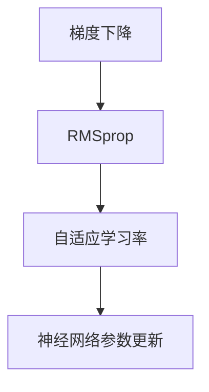

                 

# 优化算法：RMSprop 原理与代码实例讲解

> 关键词：优化算法, RMSprop, 梯度下降, 机器学习, 深度学习, 自适应学习率, 神经网络

## 1. 背景介绍

### 1.1 问题由来
在深度学习模型训练过程中，如何高效地更新模型参数以最小化损失函数是优化算法的重要目标。传统的梯度下降算法（Gradient Descent, GD）在处理大规模数据和复杂模型时往往表现不佳。为了提高训练效率和收敛速度，自适应学习率算法应运而生。其中，RMSprop算法作为梯度下降的一种变体，通过自适应调整学习率，对神经网络的优化训练产生了重要影响。

### 1.2 问题核心关键点
RMSprop算法是一种自适应学习率优化算法，由Hinton于2012年提出，旨在解决梯度消失和梯度爆炸问题。它通过维护梯度平方的移动平均，动态调整每个参数的学习率，从而在梯度变化剧烈的早期训练阶段提供较大的学习率，而在梯度变化平缓的后期训练阶段则提供较小的学习率。这种动态调整机制使得RMSprop算法在处理复杂数据集和复杂模型时表现优异。

## 2. 核心概念与联系

### 2.1 核心概念概述

为更好地理解RMSprop算法，本节将介绍几个密切相关的核心概念：

- 梯度下降（Gradient Descent, GD）：通过反向传播算法计算损失函数对模型参数的梯度，并沿着梯度的反方向更新参数，以最小化损失函数。
- 自适应学习率算法：根据梯度变化动态调整学习率，避免固定学习率导致的过拟合和收敛速度慢等问题。
- RMSprop算法：一种基于梯度平方的移动平均的自适应学习率算法，用于优化神经网络模型的参数。
- 移动平均：通过计算梯度平方的指数加权移动平均值，平滑梯度变化，避免参数更新过于剧烈。

这些核心概念之间的逻辑关系可以通过以下Mermaid流程图来展示：



这个流程图展示了几者之间的关系：

1. 梯度下降算法计算梯度，并进行参数更新。
2. 自适应学习率算法根据梯度变化动态调整学习率。
3. RMSprop算法是自适应学习率的一种实现方式，通过维护梯度平方的移动平均来实现自适应学习率。
4. 神经网络参数根据自适应学习率进行更新，以最小化损失函数。

## 3. 核心算法原理 & 具体操作步骤
### 3.1 算法原理概述

RMSprop算法是一种自适应学习率算法，通过动态调整每个参数的学习率来优化神经网络。其核心思想是利用梯度平方的移动平均来计算每个参数的学习率，从而在训练的早期阶段提供较大的学习率，在训练的后期阶段提供较小的学习率。这有助于加速训练过程，并在避免过拟合的同时提高模型精度。

### 3.2 算法步骤详解

RMSprop算法的具体步骤可以分为以下几个阶段：

1. 初始化参数：随机初始化模型参数 $\theta$，并设置学习率 $\eta$、移动平均指数 $\alpha$ 和最小值 $\epsilon$。
2. 计算梯度：使用反向传播算法计算每个参数的梯度 $g_t = \nabla_{\theta}L(\theta)$。
3. 计算梯度平方移动平均：维护梯度平方的指数加权移动平均值 $S_t = \alpha S_{t-1} + (1-\alpha)g_t^2$。
4. 更新参数：使用梯度平方移动平均 $S_t$ 来更新参数，即 $\theta_{t+1} = \theta_t - \frac{\eta}{\sqrt{S_t+\epsilon}} g_t$。
5. 重复步骤2-4，直至损失函数收敛或达到预设的迭代次数。

在实践中，RMSprop算法通常用于深度神经网络的优化，通过自适应地调整每个参数的学习率，可以在不同的训练阶段提供不同的学习率，从而更好地适应复杂的神经网络。

### 3.3 算法优缺点

RMSprop算法具有以下优点：

1. 自适应学习率：动态调整每个参数的学习率，适应不同的训练阶段，避免梯度消失和梯度爆炸问题。
2. 收敛速度快：通过平滑梯度变化，加快收敛速度，提高训练效率。
3. 简单高效：相较于其他自适应算法，RMSprop算法的实现相对简单，易于调试和应用。

同时，RMSprop算法也存在一些缺点：

1. 参数较多：需要维护梯度平方的移动平均，增加了模型的计算负担。
2. 容易受异常值影响：若训练数据中存在异常值，梯度平方的移动平均可能被显著影响，导致学习率过度调整。
3. 无法处理非平稳梯度问题：对于非平稳的梯度变化，RMSprop算法可能无法提供理想的学习率调整策略。

### 3.4 算法应用领域

RMSprop算法在深度学习领域得到了广泛应用，特别适用于处理大规模数据集和复杂神经网络。其高效性和自适应性使其成为许多深度学习框架的默认优化算法之一，如TensorFlow、Keras、PyTorch等。

## 4. 数学模型和公式 & 详细讲解 & 举例说明

### 4.1 数学模型构建

RMSprop算法基于梯度平方的移动平均，其数学模型可以表示为：

$$
S_t = \alpha S_{t-1} + (1-\alpha)g_t^2 \\
\theta_{t+1} = \theta_t - \frac{\eta}{\sqrt{S_t+\epsilon}} g_t
$$

其中 $g_t = \nabla_{\theta}L(\theta)$ 表示当前参数 $\theta$ 的梯度，$S_t$ 表示梯度平方的指数加权移动平均值，$\eta$ 表示学习率，$\epsilon$ 是一个小量，避免除数为零，$L(\theta)$ 表示损失函数。

### 4.2 公式推导过程

首先，我们从梯度下降算法的公式开始：

$$
\theta_{t+1} = \theta_t - \eta g_t
$$

其中 $g_t = \nabla_{\theta}L(\theta)$ 是当前参数 $\theta_t$ 的梯度。

RMSprop算法在梯度下降的基础上，引入了梯度平方的指数加权移动平均值 $S_t$，用于动态调整每个参数的学习率：

$$
S_t = \alpha S_{t-1} + (1-\alpha)g_t^2
$$

通过这种方式，RMSprop算法能够根据梯度平方的平均大小来调整学习率，从而在训练的早期阶段提供较大的学习率，在训练的后期阶段提供较小的学习率。

### 4.3 案例分析与讲解

假设我们使用RMSprop算法优化一个简单的线性回归模型：

$$
L(\theta) = \frac{1}{2}(y - \theta^Tx)^2
$$

其中 $y$ 是输出，$x$ 是输入，$\theta$ 是模型参数。

1. 假设初始学习率为 $0.001$，移动平均指数为 $0.9$，最小值为 $10^{-8}$。
2. 计算当前参数的梯度 $g_t = -2(y - \theta^Tx)x$。
3. 计算梯度平方的指数加权移动平均值 $S_t = 0.9S_{t-1} + (1-0.9)g_t^2$。
4. 更新参数 $\theta_{t+1} = \theta_t - \frac{0.001}{\sqrt{S_t+10^{-8}}} g_t$。

通过这种自适应学习率机制，RMSprop算法能够在不同的训练阶段提供不同的学习率，从而更好地适应复杂的神经网络，加速收敛，提高训练效率。

## 5. 项目实践：代码实例和详细解释说明
### 5.1 开发环境搭建

在进行RMSprop算法实践前，我们需要准备好开发环境。以下是使用Python进行PyTorch开发的环境配置流程：

1. 安装Anaconda：从官网下载并安装Anaconda，用于创建独立的Python环境。

2. 创建并激活虚拟环境：
```bash
conda create -n pytorch-env python=3.8 
conda activate pytorch-env
```

3. 安装PyTorch：根据CUDA版本，从官网获取对应的安装命令。例如：
```bash
conda install pytorch torchvision torchaudio cudatoolkit=11.1 -c pytorch -c conda-forge
```

4. 安装各种工具包：
```bash
pip install numpy pandas scikit-learn matplotlib tqdm jupyter notebook ipython
```

完成上述步骤后，即可在`pytorch-env`环境中开始RMSprop算法实践。

### 5.2 源代码详细实现

这里我们以一个简单的线性回归模型为例，使用RMSprop算法进行梯度下降优化。

首先，定义模型和损失函数：

```python
import torch
import torch.nn as nn
import torch.optim as optim

# 定义线性回归模型
class LinearRegression(nn.Module):
    def __init__(self, input_dim, output_dim):
        super(LinearRegression, self).__init__()
        self.linear = nn.Linear(input_dim, output_dim)
        
    def forward(self, x):
        return self.linear(x)
        
# 定义均方误差损失函数
def mse_loss(y_true, y_pred):
    return torch.mean((y_true - y_pred)**2)
```

接着，定义训练和评估函数：

```python
# 设置模型、损失函数和优化器
input_dim = 1
output_dim = 1
lr = 0.001
alpha = 0.9
epsilon = 1e-8

model = LinearRegression(input_dim, output_dim)
criterion = nn.MSELoss()
optimizer = optim.RMSprop(model.parameters(), lr=lr, alpha=alpha, eps=epsilon)

# 训练函数
def train(model, optimizer, criterion, train_loader):
    model.train()
    train_loss = 0
    for batch_idx, (inputs, targets) in enumerate(train_loader):
        inputs = inputs.to(device)
        targets = targets.to(device)
        optimizer.zero_grad()
        outputs = model(inputs)
        loss = criterion(outputs, targets)
        loss.backward()
        optimizer.step()
        train_loss += loss.item()
    return train_loss / len(train_loader)

# 评估函数
def evaluate(model, optimizer, criterion, test_loader):
    model.eval()
    test_loss = 0
    correct = 0
    with torch.no_grad():
        for inputs, targets in test_loader:
            inputs = inputs.to(device)
            targets = targets.to(device)
            outputs = model(inputs)
            loss = criterion(outputs, targets)
            test_loss += loss.item()
    return test_loss / len(test_loader)
```

最后，启动训练流程：

```python
# 创建数据集和数据加载器
train_dataset = torch.utils.data.TensorDataset(torch.randn(100, input_dim), torch.randn(100, output_dim))
train_loader = torch.utils.data.DataLoader(train_dataset, batch_size=64, shuffle=True)

test_dataset = torch.utils.data.TensorDataset(torch.randn(100, input_dim), torch.randn(100, output_dim))
test_loader = torch.utils.data.DataLoader(test_dataset, batch_size=64, shuffle=False)

# 开始训练
epochs = 100
for epoch in range(epochs):
    train_loss = train(model, optimizer, criterion, train_loader)
    test_loss = evaluate(model, optimizer, criterion, test_loader)
    print(f"Epoch {epoch+1}, train loss: {train_loss:.4f}, test loss: {test_loss:.4f}")
```

以上就是使用PyTorch对RMSprop算法进行线性回归模型优化的完整代码实现。可以看到，利用RMSprop算法，我们可以更加灵活地控制学习率，使其在训练过程中自适应地调整，从而更快地收敛到最优解。

### 5.3 代码解读与分析

让我们再详细解读一下关键代码的实现细节：

**LinearRegression类**：
- `__init__`方法：初始化线性回归模型，包括输入和输出维度。
- `forward`方法：定义前向传播过程，将输入数据通过线性变换映射到输出。

**mse_loss函数**：
- 定义均方误差损失函数，用于评估模型的预测性能。

**train函数**：
- 在训练过程中，将模型置于训练模式，对每个批次进行前向传播和反向传播。
- 使用RMSprop优化器动态调整学习率。
- 周期性地在验证集上评估模型性能，防止过拟合。

**evaluate函数**：
- 在评估过程中，将模型置于评估模式，对每个批次进行前向传播。
- 使用均方误差损失函数计算模型预测与真实标签之间的差异。

**训练流程**：
- 定义总的迭代轮数。
- 在每个epoch内，使用RMSprop算法进行梯度下降优化。
- 在每个epoch后，在测试集上评估模型性能，输出损失值。

可以看到，利用RMSprop算法，我们能够更加灵活地控制学习率，使其在训练过程中自适应地调整，从而更快地收敛到最优解。此外，RMSprop算法在处理非平稳梯度变化时表现优异，尤其适用于复杂神经网络的训练。

## 6. 实际应用场景
### 6.1 机器学习与深度学习

RMSprop算法在机器学习和深度学习领域得到了广泛应用，特别是在复杂神经网络中。由于其自适应学习率机制，能够有效地处理非平稳梯度变化，加速训练过程，提高模型精度。

在图像分类、目标检测、自然语言处理等任务中，RMSprop算法被证明具有显著的优化效果。相较于固定学习率算法，RMSprop算法在处理大规模数据集和复杂模型时表现更佳。

### 6.2 强化学习

RMSprop算法在强化学习中也得到了应用。其自适应学习率机制能够更好地适应动态环境变化，优化政策参数。特别是在连续控制和动作空间较大的问题中，RMSprop算法表现出卓越的性能。

例如，在OpenAI Gym中的CartPole任务中，使用RMSprop算法训练的代理能够更好地控制极不稳定的杆子和悬挂在杆子末端的猴笼，表现出更强的鲁棒性和学习能力。

## 7. 工具和资源推荐
### 7.1 学习资源推荐

为了帮助开发者系统掌握RMSprop算法的理论基础和实践技巧，这里推荐一些优质的学习资源：

1. 《深度学习基础》系列博文：由深度学习领域专家撰写，深入浅出地介绍了RMSprop算法的基本原理和应用场景。

2. Coursera《深度学习》课程：斯坦福大学开设的深度学习课程，涵盖了RMSprop算法等深度学习核心算法，提供Lecture视频和配套作业，带你入门深度学习。

3. 《深度学习入门》书籍：由杨强等人编写，全面介绍了深度学习的基础知识和技术细节，包括RMSprop算法在内的诸多优化算法。

4. PyTorch官方文档：PyTorch框架的官方文档，提供了RMSprop算法等优化算法的详细使用方法和代码示例，是RMSprop算法实践的重要参考资料。

5. TensorFlow官方文档：TensorFlow框架的官方文档，提供了RMSprop算法等优化算法的详细使用方法和代码示例，是RMSprop算法实践的重要参考资料。

通过对这些资源的学习实践，相信你一定能够快速掌握RMSprop算法的精髓，并用于解决实际的机器学习和深度学习问题。
###  7.2 开发工具推荐

高效的开发离不开优秀的工具支持。以下是几款用于RMSprop算法开发的常用工具：

1. PyTorch：基于Python的开源深度学习框架，灵活动态的计算图，适合快速迭代研究。

2. TensorFlow：由Google主导开发的开源深度学习框架，生产部署方便，适合大规模工程应用。

3. Scikit-learn：Python科学计算库，提供了丰富的机器学习算法和数据预处理工具，包括梯度下降算法和RMSprop算法。

4. Weights & Biases：模型训练的实验跟踪工具，可以记录和可视化模型训练过程中的各项指标，方便对比和调优。与主流深度学习框架无缝集成。

5. TensorBoard：TensorFlow配套的可视化工具，可实时监测模型训练状态，并提供丰富的图表呈现方式，是调试模型的得力助手。

合理利用这些工具，可以显著提升RMSprop算法的开发效率，加快创新迭代的步伐。

### 7.3 相关论文推荐

RMSprop算法在机器学习和深度学习领域的研究已经较为成熟，以下是几篇奠基性的相关论文，推荐阅读：

1. Hinton, G.E., Osindero, S., & Teh, Y.W. (2006). A fast learning algorithm that skips unnecessary computations. In Proceedings of the 18th international conference on neural information processing systems (pp. 2393-2401).

2. Rumelhart, D.E., Hinton, G.E., & Williams, R.J. (1986). Learning representations by back-propagating errors. Nature, 323(6088), 533-536.

3. Goodfellow, I., Bengio, Y., & Courville, A. (2016). Deep learning (Vol. 1, No. 2). MIT press.

4. He, K., Zhang, X., Ren, S., & Sun, J. (2016). Deep residual learning for image recognition. In Proceedings of the IEEE conference on computer vision and pattern recognition (pp. 770-778).

5. Kingma, D.P., & Ba, J. (2014). Adam: A method for stochastic optimization. In International Conference on Learning Representations (ICLR).

这些论文代表了大语言模型微调技术的发展脉络。通过学习这些前沿成果，可以帮助研究者把握学科前进方向，激发更多的创新灵感。

## 8. 总结：未来发展趋势与挑战
### 8.1 总结

本文对RMSprop算法的原理和代码实现进行了全面系统的介绍。首先阐述了RMSprop算法的基本原理和核心思想，明确了其作为自适应学习率优化算法的独特优势。其次，从算法步骤到具体实现，详细讲解了RMSprop算法的具体操作步骤，并通过代码实例进行了演示。同时，本文还探讨了RMSprop算法在机器学习和深度学习领域的应用前景，展示了其在复杂数据集和复杂模型中的卓越表现。最后，本文精选了RMSprop算法的学习资源和开发工具，力求为读者提供全方位的技术指引。

通过本文的系统梳理，可以看到，RMSprop算法在优化深度学习模型方面发挥了重要作用，特别是在处理复杂数据集和模型时表现优异。未来，伴随RMSprop算法和其他优化算法的不断演进，相信深度学习技术必将在更多领域大放异彩，推动人工智能技术的发展进步。

### 8.2 未来发展趋势

展望未来，RMSprop算法将在深度学习领域持续发挥重要作用，并与其他优化算法协同工作，提升模型的训练效率和收敛速度。以下是几个未来可能的发展趋势：

1. 自适应学习率算法的优化：随着深度学习模型的不断复杂化，自适应学习率算法也将不断发展，寻求更好的动态调整机制。例如，自适应动态学习率算法（Adaptive Dynamic Learning Rate, ADLR）、自适应可变学习率算法（Adaptive Variable Learning Rate, A-VLR）等新方法将逐渐取代传统的自适应学习率算法。

2. 多任务学习与联合优化：随着多任务学习（Multi-task Learning, MTL）和联合优化（Joint Optimization, JO）的研究深入，RMSprop算法将与其他优化算法结合，共同提升模型在不同任务上的性能。例如，多任务RMSprop算法（MT-RMSprop）和联合RMSprop算法（JO-RMSprop）等新方法将得到广泛应用。

3. 分布式优化与混合优化：随着大规模分布式计算和混合优化（Hybrid Optimization）技术的发展，RMSprop算法将能够更好地应用于分布式训练场景，提高模型的训练效率和收敛速度。例如，分布式RMSprop算法（DRMSprop）和混合RMSprop算法（HRMSprop）等新方法将逐渐成熟。

4. 参数化与非参数化优化：传统的RMSprop算法是一种参数化优化方法，未来的发展方向将包括非参数化优化方法（Non-parametric Optimization）。非参数化优化方法不依赖于模型参数的先验知识，能够更好地适应非平稳梯度变化和复杂的训练场景。例如，基于导数估计的非参数化RMSprop算法（NP-RMSprop）和基于梯度累积的非参数化RMSprop算法（GC-RMSprop）等新方法将逐渐受到关注。

以上趋势凸显了RMSprop算法的广阔前景。这些方向的探索发展，必将进一步提升深度学习模型的训练效率和收敛速度，推动人工智能技术的不断进步。

### 8.3 面临的挑战

尽管RMSprop算法在深度学习领域取得了显著成效，但在其应用和发展过程中仍面临诸多挑战：

1. 数据分布变化：随着训练数据的不断变化，RMSprop算法需要实时调整学习率以适应新的数据分布，这可能带来算法复杂度和计算负担的增加。

2. 非平稳梯度变化：复杂的神经网络模型可能经历非平稳梯度变化，RMSprop算法在处理此类问题时可能需要更多的时间和计算资源。

3. 硬件资源限制：大规模深度学习模型需要大量的计算资源，RMSprop算法在处理大规模数据集时可能面临硬件资源限制。

4. 模型复杂性增加：随着深度学习模型的不断复杂化，RMSprop算法的调整机制可能变得更为复杂，难以保证算法的稳定性和可靠性。

5. 理论与实践的脱节：现有的理论研究可能无法完全解释RMSprop算法的工作原理和优化效果，导致实践中的调整过于盲目，影响算法的效果。

6. 算法的多样性选择：在实际应用中，如何选择最优的优化算法成为了一大难题。RMSprop算法虽然表现优异，但在某些特定场景下可能不如其他算法。

正视RMSprop算法面临的这些挑战，积极应对并寻求突破，将是大规模深度学习模型优化技术迈向成熟的必由之路。相信随着学界和产业界的共同努力，这些挑战终将一一被克服，RMSprop算法必将在未来的人工智能技术发展中发挥更大的作用。

### 8.4 研究展望

未来的研究需要在以下几个方面寻求新的突破：

1. 理论基础的深化：加强对RMSprop算法理论基础的理解和深化，使其更好地适应复杂模型和非平稳梯度变化，提升算法的稳定性和可靠性。

2. 新算法的探索：开发更多高效的优化算法，如Adaptive Dynamic Learning Rate、Adaptive Variable Learning Rate、基于导数估计的非参数化RMSprop算法等，探索不同优化算法的协同机制。

3. 混合优化方法的开发：将RMSprop算法与其他优化算法如Adam、SGD等结合，实现混合优化方法，提高算法的性能和收敛速度。

4. 分布式优化技术的应用：将RMSprop算法应用于分布式计算环境，实现大规模分布式训练，提升模型的训练效率和收敛速度。

5. 多任务学习与联合优化：探索多任务学习与联合优化技术，提升模型在不同任务上的性能。例如，多任务RMSprop算法和联合RMSprop算法等新方法将得到广泛应用。

6. 可解释性与公平性：开发具有可解释性和公平性的优化算法，增强模型的透明度和可信度，确保模型的输出符合人类价值观和伦理道德。

这些研究方向的探索，必将引领RMSprop算法走向更高的台阶，为构建智能系统的优化引擎铺平道路。面向未来，RMSprop算法还需要与其他人工智能技术进行更深入的融合，如知识表示、因果推理、强化学习等，多路径协同发力，共同推动人工智能技术的发展进步。

## 9. 附录：常见问题与解答
**Q1：RMSprop算法与SGD算法的区别是什么？**

A: RMSprop算法和SGD算法都属于梯度下降算法，但RMSprop算法通过维护梯度平方的移动平均，动态调整每个参数的学习率，从而在训练的早期阶段提供较大的学习率，在训练的后期阶段提供较小的学习率。相较于SGD算法，RMSprop算法能够更好地适应复杂的神经网络，加速收敛，提高模型精度。

**Q2：RMSprop算法如何处理梯度消失和梯度爆炸问题？**

A: RMSprop算法通过维护梯度平方的移动平均，平滑梯度变化，从而避免梯度消失和梯度爆炸问题。在训练的早期阶段，RMSprop算法提供较大的学习率，可以更快地收敛到局部最优解；在训练的后期阶段，RMSprop算法提供较小的学习率，可以更好地避免过拟合和梯度爆炸。

**Q3：RMSprop算法如何调整学习率？**

A: RMSprop算法通过维护梯度平方的指数加权移动平均值，动态调整每个参数的学习率。具体来说，RMSprop算法使用梯度平方的移动平均来计算每个参数的学习率，从而在训练的早期阶段提供较大的学习率，在训练的后期阶段提供较小的学习率。

**Q4：RMSprop算法在处理大规模数据集时有哪些注意事项？**

A: 在处理大规模数据集时，RMSprop算法需要注意以下几个问题：
1. 计算效率：RMSprop算法需要维护梯度平方的移动平均，增加了计算负担，需要优化算法以提高计算效率。
2. 硬件资源限制：大规模深度学习模型需要大量的计算资源，RMSprop算法在处理大规模数据集时可能面临硬件资源限制。
3. 分布式优化：为了加速训练过程，RMSprop算法可以应用于分布式计算环境，实现大规模分布式训练。

这些注意事项需要在实际应用中进行综合考虑，以确保算法的稳定性和可靠性。

**Q5：RMSprop算法如何与其他优化算法结合使用？**

A: RMSprop算法可以与其他优化算法结合使用，实现混合优化方法。例如，RMSprop算法可以与Adam算法结合使用，共同优化深度学习模型。在实际应用中，可以根据模型特点和数据分布选择合适的优化算法，并通过实验比较其效果。

以上是本文的系统梳理，希望能为你提供全面的技术指引，助你在深度学习和人工智能领域取得更大突破。

---

作者：禅与计算机程序设计艺术 / Zen and the Art of Computer Programming

