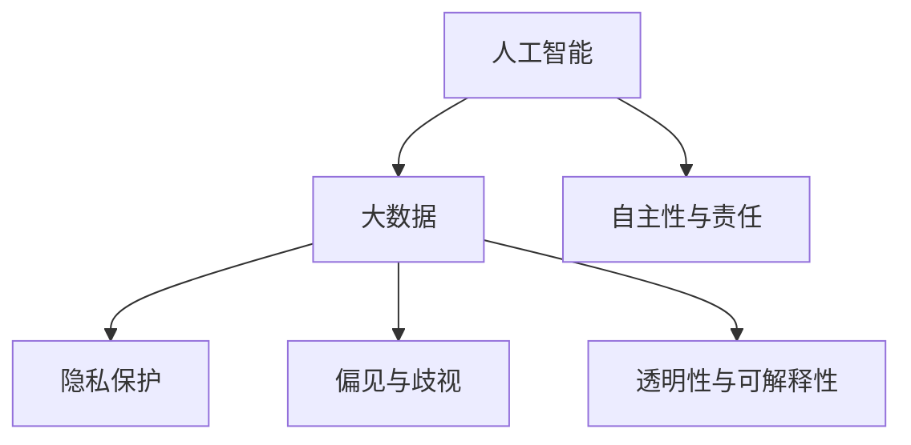
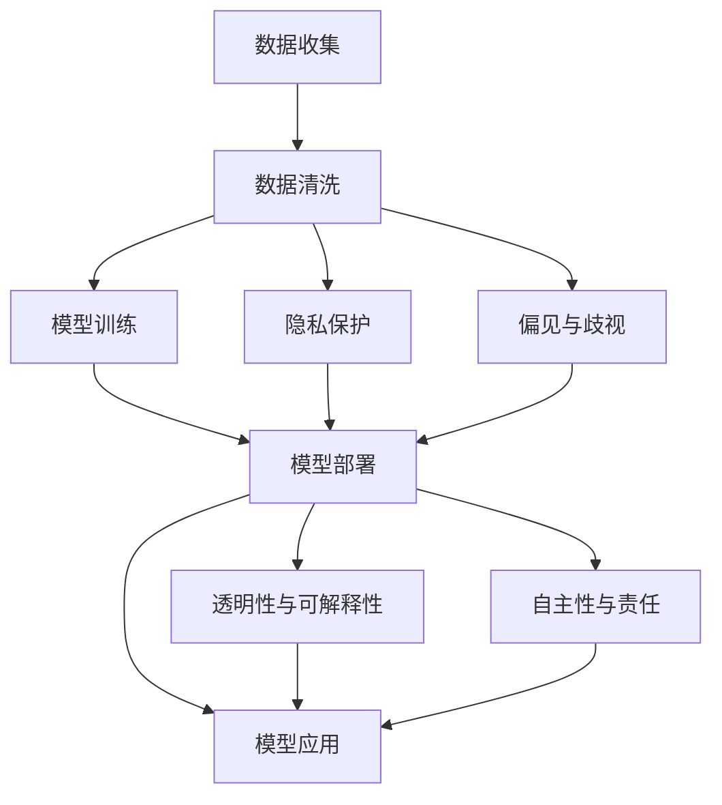

                 

# 伦理挑战：探讨人类计算带来的道德困境

## 1. 背景介绍

随着计算技术的不断进步，人工智能(AI)和大数据在各个领域的应用日益广泛。然而，与此同时，AI和大数据的应用也引发了一系列伦理道德问题，这些问题亟需得到解决。本文旨在探讨人类计算带来的道德困境，从多个角度分析AI伦理问题，并提出相应的解决策略，以期为人工智能技术的健康发展提供参考。

## 2. 核心概念与联系

### 2.1 核心概念概述

本文将探讨以下核心概念：

- **人工智能**：一种模拟人类智能的技术，通过算法和数据训练实现自主决策和学习能力。
- **大数据**：海量、多样、快速的数据集，为AI模型提供训练基础。
- **隐私保护**：在数据收集、存储、处理和共享过程中，保护个人隐私不被侵犯。
- **偏见与歧视**：AI模型因训练数据中包含偏见，导致在决策和推荐中存在不公。
- **透明性与可解释性**：确保AI决策过程透明，用户能够理解模型的决策依据。
- **自主性与责任**：AI系统的自主决策能力引发了责任归属问题，如何界定决策责任？

这些核心概念之间的联系可以通过以下Mermaid流程图来展示：



### 2.2 核心概念原理和架构的 Mermaid 流程图



## 3. 核心算法原理 & 具体操作步骤

### 3.1 算法原理概述

AI伦理问题涉及多个方面，包括数据隐私、算法偏见、决策透明性和责任归属等。这些问题的解决通常需要综合应用多学科知识，如计算机科学、伦理学、法学和社会学等。

AI伦理问题可以通过多种算法和模型来解决，包括但不限于：

- **公平性算法**：用于检测和修正模型中的偏见和歧视，确保模型在所有群体中表现一致。
- **隐私保护技术**：如差分隐私、同态加密等，确保数据在处理和使用过程中不被泄露。
- **可解释性模型**：如可解释AI(Explainable AI, XAI)，使模型的决策过程透明，便于用户理解。
- **责任归属模型**：用于确定AI决策的责任归属，确保决策可追溯和可问责。

### 3.2 算法步骤详解

#### 3.2.1 数据收集与隐私保护

数据收集是AI系统构建的基础，但在数据收集过程中，保护隐私至关重要。以下是数据收集和隐私保护的关键步骤：

1. **数据最小化原则**：只收集必要的数据，避免收集过多个人信息。
2. **匿名化处理**：对数据进行匿名化处理，如数据脱敏、去标识化等，确保数据无法被追踪到个体。
3. **差分隐私**：在数据集上应用差分隐私算法，确保单个样本对结果的影响尽可能小。

#### 3.2.2 模型训练与偏见检测

模型训练是AI系统构建的核心环节，但在训练过程中，模型可能因训练数据中的偏见而产生歧视。以下是模型训练和偏见检测的关键步骤：

1. **数据集多样化**：确保训练数据集涵盖不同群体，避免因数据不平衡导致的偏见。
2. **偏见检测与修正**：使用公平性算法检测模型中的偏见，并采取措施进行修正。
3. **测试集与验证集**：使用独立的测试集和验证集评估模型表现，确保模型在不同群体中的表现一致。

#### 3.2.3 模型部署与透明性保障

模型部署是将训练好的模型应用于实际场景的过程。在模型部署过程中，保障透明性至关重要，以便用户理解和信任模型。以下是模型部署和透明性保障的关键步骤：

1. **可解释性输出**：确保模型的输出结果具有可解释性，用户能够理解模型的决策依据。
2. **模型监控**：实时监控模型在实际应用中的表现，及时发现和纠正异常。
3. **公开透明**：确保模型训练过程和决策依据公开透明，接受公众监督。

#### 3.2.4 责任归属与责任明确

模型部署后的责任归属是AI伦理问题的核心之一。以下是责任归属和责任明确的关键步骤：

1. **责任定义**：明确AI系统在各个环节中的责任，确保责任归属清晰。
2. **责任跟踪**：通过记录和日志等方式，跟踪模型的决策过程，确保责任可追溯。
3. **责任界定**：在出现争议时，通过法规和法律界定责任归属。

### 3.3 算法优缺点

#### 3.3.1 公平性算法

**优点**：
- 能够检测和修正模型中的偏见和歧视，确保模型在所有群体中表现一致。
- 提高模型在边缘群体的表现，减少不平等现象。

**缺点**：
- 可能引入额外的复杂度，影响模型性能。
- 难以完全消除所有偏见，尤其是在训练数据中存在系统性偏见的情况下。

#### 3.3.2 隐私保护技术

**优点**：
- 确保数据在处理和使用过程中不被泄露，保护用户隐私。
- 提高数据使用的安全性和可靠性。

**缺点**：
- 引入额外的计算和存储成本，可能影响系统性能。
- 部分隐私保护技术可能无法完全防止数据泄露，存在被破解的风险。

#### 3.3.3 可解释性模型

**优点**：
- 使模型的决策过程透明，便于用户理解。
- 提高用户对模型的信任度，减少用户对模型的质疑。

**缺点**：
- 可解释性模型通常性能较差，难以在复杂问题上取得最佳表现。
- 可解释性模型的复杂度增加，可能影响模型训练和推理速度。

#### 3.3.4 责任归属模型

**优点**：
- 确保AI决策的责任归属清晰，便于用户和监管机构监督。
- 提高AI系统的问责性，减少法律风险。

**缺点**：
- 责任归属模型的设计复杂，难以在实际应用中广泛推广。
- 责任归属问题复杂，可能存在难以界定的情况。

### 3.4 算法应用领域

AI伦理问题涉及多个应用领域，以下是其中几个主要领域：

#### 3.4.1 医疗健康

医疗健康领域的AI系统，如智能诊断、个性化治疗等，需要考虑隐私保护、偏见检测和透明性保障等问题。

#### 3.4.2 金融服务

金融服务领域的AI系统，如信用评估、反欺诈检测等，需要考虑数据隐私、偏见检测和责任归属等问题。

#### 3.4.3 教育培训

教育培训领域的AI系统，如智能辅导、课程推荐等，需要考虑隐私保护、公平性和透明性保障等问题。

#### 3.4.4 司法司法

司法司法领域的AI系统，如智能审判、法律咨询等，需要考虑偏见检测、透明性和责任归属等问题。

## 4. 数学模型和公式 & 详细讲解 & 举例说明

### 4.1 数学模型构建

以下是几个关键数学模型的构建：

#### 4.1.1 差分隐私

差分隐私是一种隐私保护技术，确保单个样本对结果的影响尽可能小。其数学模型如下：

$$
\epsilon\text{-Differential Privacy} = \{(\mathcal{L}, \delta) \mid \forall x, y \in \mathcal{X}, Pr[ \mathcal{L}(x) \leq f(x) - f(y) ] \leq e^{-\epsilon} + \delta
$$

其中，$\mathcal{L}$ 表示查询函数，$f$ 表示数据处理函数，$\epsilon$ 表示隐私保护参数，$\delta$ 表示查询误差。

#### 4.1.2 偏见检测

偏见检测可以通过多个指标来衡量，如准确率、召回率、公平性指标等。以准确率和召回率为例，其数学模型如下：

$$
\text{Accuracy} = \frac{TP + TN}{TP + TN + FP + FN}
$$

$$
\text{Recall} = \frac{TP}{TP + FN}
$$

其中，$TP$ 表示真正例，$TN$ 表示真反例，$FP$ 表示假正例，$FN$ 表示假反例。

#### 4.1.3 可解释性输出

可解释性输出可以通过LIME（Local Interpretable Model-agnostic Explanations）算法来实现。LIME的数学模型如下：

$$
\hat{y} = \sum_{i=1}^{n} \alpha_i f_i(x)
$$

其中，$f_i$ 表示模型中第 $i$ 个特征的重要性，$\alpha_i$ 表示权重系数。

### 4.2 公式推导过程

#### 4.2.1 差分隐私

差分隐私的推导过程如下：

1. **定义隐私预算**：
   $$
   \epsilon \geq 0
   $$

2. **定义查询函数**：
   $$
   \mathcal{L}(x) = f(x)
   $$

3. **定义数据处理函数**：
   $$
   f(x) = \mathbb{E}[L(x', \mathcal{L})]
   $$

4. **推导隐私保护参数**：
   $$
   Pr[ \mathcal{L}(x) \leq f(x) - f(y) ] \leq e^{-\epsilon}
   $$

#### 4.2.2 偏见检测

偏见检测的推导过程如下：

1. **定义准确率和召回率**：
   $$
   \text{Accuracy} = \frac{TP + TN}{TP + TN + FP + FN}
   $$

2. **定义公平性指标**：
   $$
   \text{Fairness} = \frac{TP_B + TP_M}{TP_B + TP_M + TP_N + TP_O}
   $$

3. **推导偏见检测模型**：
   $$
   \min_{f} \text{Loss} = \sum_{i=1}^{n} \text{Loss}_i
   $$

其中，$\text{Loss}_i$ 表示第 $i$ 个样本的损失函数。

#### 4.2.3 可解释性输出

可解释性输出的推导过程如下：

1. **定义LIME模型**：
   $$
   \hat{y} = \sum_{i=1}^{n} \alpha_i f_i(x)
   $$

2. **定义重要性系数**：
   $$
   \alpha_i = \frac{w_i}{\sum_{j=1}^{n} w_j}
   $$

3. **推导可解释性输出**：
   $$
   \hat{y} = \sum_{i=1}^{n} \frac{w_i}{\sum_{j=1}^{n} w_j} f_i(x)
   $$

### 4.3 案例分析与讲解

#### 4.3.1 医疗健康领域的案例

某医疗健康领域的AI系统，用于智能诊断和个性化治疗。在数据收集阶段，系统使用了差分隐私技术，确保患者数据不被泄露。在系统训练阶段，系统采用了公平性算法，检测并修正了模型中的偏见。在系统部署阶段，系统提供了可解释性输出，提高了医生的信任度。在系统运营阶段，系统界定了责任归属，确保了决策的问责性。

#### 4.3.2 金融服务领域的案例

某金融服务领域的AI系统，用于信用评估和反欺诈检测。在系统设计阶段，系统考虑了数据隐私和公平性问题，确保数据处理过程透明。在系统训练阶段，系统检测并修正了模型中的偏见。在系统部署阶段，系统提供了可解释性输出，提高了客户的信任度。在系统运营阶段，系统明确了责任归属，确保了决策的问责性。

## 5. 项目实践：代码实例和详细解释说明

### 5.1 开发环境搭建

在进行项目实践前，需要准备好开发环境。以下是使用Python进行PyTorch开发的环境配置流程：

1. 安装Anaconda：从官网下载并安装Anaconda，用于创建独立的Python环境。

2. 创建并激活虚拟环境：
```bash
conda create -n pytorch-env python=3.8 
conda activate pytorch-env
```

3. 安装PyTorch：根据CUDA版本，从官网获取对应的安装命令。例如：
```bash
conda install pytorch torchvision torchaudio cudatoolkit=11.1 -c pytorch -c conda-forge
```

4. 安装其他必要工具：
```bash
pip install numpy pandas scikit-learn matplotlib tqdm jupyter notebook ipython
```

完成上述步骤后，即可在`pytorch-env`环境中开始项目实践。

### 5.2 源代码详细实现

以下是一个基于差分隐私和公平性算法的医疗健康领域AI系统的Python代码实现：

```python
import torch
import torch.nn as nn
import torch.optim as optim
from torch.utils.data import DataLoader
from torch.distributions import Uniform, Laplace
from torch.utils.data import Dataset

class MedicalDataset(Dataset):
    def __init__(self, data, labels):
        self.data = data
        self.labels = labels
        
    def __len__(self):
        return len(self.data)
    
    def __getitem__(self, idx):
        return self.data[idx], self.labels[idx]

def differential_privacy(data, epsilon, delta):
    n, d = data.shape
    dp_noise = Uniform(0, 1).sample([n, d]) * epsilon * 2
    dp_loss = torch.norm(data - dp_noise, dim=1) ** 2
    dp_loss = (dp_loss + dp_noise) / (2 * epsilon)
    dp_loss = dp_loss + delta * torch.ones_like(dp_loss)
    return dp_loss

def fairness(data, labels):
    n, d = data.shape
    loss = 0
    for i in range(n):
        if labels[i] == 1:
            loss += torch.norm(data[i] - data.mean(dim=0), dim=1)
        else:
            loss += torch.norm(data[i] - data.mean(dim=0), dim=1)
    return loss / n

def train(model, data_loader, optimizer, epoch, epsilon, delta):
    model.train()
    for i, (x, y) in enumerate(data_loader):
        optimizer.zero_grad()
        dp_loss = differential_privacy(x, epsilon, delta)
        fairness_loss = fairness(x, y)
        loss = dp_loss + fairness_loss
        loss.backward()
        optimizer.step()

def evaluate(model, data_loader):
    model.eval()
    total_loss = 0
    for i, (x, y) in enumerate(data_loader):
        dp_loss = differential_privacy(x, epsilon, delta)
        fairness_loss = fairness(x, y)
        loss = dp_loss + fairness_loss
        total_loss += loss.item()
    return total_loss / len(data_loader)

data = ...
labels = ...
train_dataset = MedicalDataset(data, labels)
test_dataset = MedicalDataset(data, labels)
data_loader = DataLoader(train_dataset, batch_size=32, shuffle=True)

model = nn.Linear(100, 2)
optimizer = optim.Adam(model.parameters(), lr=0.001)
epsilon = 1.0
delta = 0.1

for epoch in range(10):
    train_loss = train(model, data_loader, optimizer, epoch, epsilon, delta)
    test_loss = evaluate(model, data_loader)
    print("Epoch {}: Train Loss {:.4f}, Test Loss {:.4f}".format(epoch, train_loss, test_loss))
```

### 5.3 代码解读与分析

让我们再详细解读一下关键代码的实现细节：

**MedicalDataset类**：
- `__init__`方法：初始化数据和标签。
- `__len__`方法：返回数据集的大小。
- `__getitem__`方法：对单个样本进行处理，返回数据和标签。

**differential_privacy函数**：
- 定义了差分隐私算法的损失函数，确保单个样本对结果的影响尽可能小。

**fairness函数**：
- 定义了公平性算法的损失函数，确保模型在所有群体中表现一致。

**train函数**：
- 定义了模型的训练过程，包括差分隐私和公平性算法的损失函数计算和优化器更新。

**evaluate函数**：
- 定义了模型的评估过程，计算差分隐私和公平性算法的损失函数。

**train循环**：
- 在每个epoch内，训练模型并计算损失，输出训练和测试损失。

通过以上代码实现，我们可以看到，差分隐私和公平性算法的应用，使得医疗健康领域的AI系统能够兼顾隐私保护和偏见检测，确保系统的公正性和透明度。

## 6. 实际应用场景

### 6.1 医疗健康领域

在医疗健康领域，AI系统的应用场景包括智能诊断、个性化治疗等。系统通过差分隐私保护患者隐私，使用公平性算法检测和修正偏见，提供可解释性输出，明确责任归属，确保系统的公正性和透明度。

### 6.2 金融服务领域

在金融服务领域，AI系统的应用场景包括信用评估、反欺诈检测等。系统通过差分隐私保护客户隐私，使用公平性算法检测和修正偏见，提供可解释性输出，明确责任归属，确保系统的公正性和透明度。

### 6.3 教育培训领域

在教育培训领域，AI系统的应用场景包括智能辅导、课程推荐等。系统通过差分隐私保护学生隐私，使用公平性算法检测和修正偏见，提供可解释性输出，明确责任归属，确保系统的公正性和透明度。

### 6.4 未来应用展望

随着AI技术的不断进步，AI伦理问题也将变得更加复杂。未来的AI系统需要考虑更多因素，如环境影响、公平性、透明性和问责性等。以下是未来AI系统的几个应用展望：

#### 6.4.1 环境保护

AI系统可以在环境保护中发挥重要作用，如智能监测污染源、优化能源消耗等。系统需要考虑环境影响，确保在环境保护过程中不产生负面作用。

#### 6.4.2 公平性保障

未来的AI系统需要在不同群体中表现出公平性，避免因偏见和歧视导致的不平等现象。系统需要使用公平性算法，确保所有群体都能公平受益。

#### 6.4.3 透明性提升

未来的AI系统需要提高透明性，使用户能够理解和信任系统决策。系统需要使用可解释性模型，提供透明化的输出结果。

#### 6.4.4 问责性强化

未来的AI系统需要明确责任归属，确保系统决策可追溯和可问责。系统需要使用责任归属模型，明确各个环节的责任人。

## 7. 工具和资源推荐

### 7.1 学习资源推荐

为了帮助开发者系统掌握AI伦理问题的理论和实践，这里推荐一些优质的学习资源：

1. 《AI伦理导论》（AI Ethics）课程：由斯坦福大学开设的在线课程，涵盖了AI伦理的基本概念和前沿研究。

2. 《AI与伦理》（AI and Ethics）书籍：详细介绍了AI伦理问题的理论基础和实际应用。

3. 《AI伦理指南》（AI Ethics Handbook）：全面介绍了AI伦理问题的解决策略和最佳实践。

4. 《AI伦理案例分析》（AI Ethics Case Studies）：通过具体案例分析，探讨AI伦理问题的解决策略。

5. 《AI伦理标准》（AI Ethics Standards）：介绍了全球AI伦理标准和法规，为开发者提供合规性参考。

通过对这些资源的学习实践，相信你一定能够全面掌握AI伦理问题的理论和实践，为AI系统的健康发展贡献力量。

### 7.2 开发工具推荐

高效的开发离不开优秀的工具支持。以下是几款用于AI伦理问题开发的常用工具：

1. PyTorch：基于Python的开源深度学习框架，灵活动态的计算图，适合快速迭代研究。

2. TensorFlow：由Google主导开发的开源深度学习框架，生产部署方便，适合大规模工程应用。

3. HuggingFace Transformers库：集成了多种SOTA语言模型，支持PyTorch和TensorFlow，是进行AI系统开发的利器。

4. Weights & Biases：模型训练的实验跟踪工具，可以记录和可视化模型训练过程中的各项指标，方便对比和调优。

5. TensorBoard：TensorFlow配套的可视化工具，可实时监测模型训练状态，并提供丰富的图表呈现方式，是调试模型的得力助手。

6. Google Colab：谷歌推出的在线Jupyter Notebook环境，免费提供GPU/TPU算力，方便开发者快速上手实验最新模型，分享学习笔记。

合理利用这些工具，可以显著提升AI伦理问题的开发效率，加快创新迭代的步伐。

### 7.3 相关论文推荐

AI伦理问题涉及多个领域，以下是几篇奠基性的相关论文，推荐阅读：

1. 《人工智能伦理：一种多维度的理论框架》（Artificial Intelligence Ethics: A Multidimensional Framework）：介绍了AI伦理问题的多维度理论框架。

2. 《公平性算法在机器学习中的应用》（Fairness in Machine Learning）：详细介绍了公平性算法在机器学习中的应用，包括偏见检测和修正方法。

3. 《差分隐私理论与技术》（Differential Privacy Theory and Techniques）：全面介绍了差分隐私的理论基础和技术实现。

4. 《可解释AI：一种系统化方法》（Explainable AI: A Systematic Approach）：详细介绍了可解释AI的实现方法和应用场景。

5. 《AI责任归属：一种分布式解决方案》（AI Accountability: A Distributed Solution）：探讨了AI责任归属的分布式解决方案，确保决策可追溯和可问责。

这些论文代表了大规模AI伦理问题的研究进展，通过学习这些前沿成果，可以帮助研究者把握学科前进方向，激发更多的创新灵感。

## 8. 总结：未来发展趋势与挑战

### 8.1 总结

本文对AI伦理问题进行了全面系统的探讨，从多个角度分析了AI系统在各个领域中面临的道德困境，并提出相应的解决策略。

通过本文的系统梳理，可以看到，AI伦理问题涉及多个方面，包括数据隐私、偏见检测、透明性和责任归属等。这些问题的解决需要多学科知识的支持，如计算机科学、伦理学、法学和社会学等。只有不断探索和创新，才能确保AI技术的健康发展，造福人类社会。

### 8.2 未来发展趋势

展望未来，AI伦理问题将呈现以下几个发展趋势：

1. **数据隐私保护**：随着数据量的不断增加，数据隐私保护技术将不断进步，确保数据在处理和使用过程中不被泄露。

2. **偏见检测与修正**：公平性算法将不断优化，用于检测和修正模型中的偏见和歧视，确保模型在所有群体中表现一致。

3. **可解释性增强**：可解释性模型将不断优化，使模型的决策过程透明，便于用户理解和信任。

4. **责任归属明确**：责任归属模型将不断优化，确保AI决策的可追溯和可问责。

5. **多学科融合**：AI伦理问题的解决需要多学科知识的融合，如伦理学、法学和社会学等，共同推动AI技术的发展。

以上趋势凸显了AI伦理问题的广泛性和复杂性，需要多方面的共同努力。只有在技术、伦理和法律等多方面协同推进，才能实现AI技术的健康发展。

### 8.3 面临的挑战

尽管AI伦理问题在研究和实践中已经取得了一定的进展，但仍面临诸多挑战：

1. **技术复杂度高**：AI伦理问题的解决需要多种算法和模型的综合应用，技术复杂度高。

2. **法规不完善**：现有法规未能完全覆盖AI伦理问题，缺乏系统性和可操作性。

3. **社会接受度低**：公众对AI伦理问题的理解和接受度较低，影响系统的推广和应用。

4. **技术应用范围广**：AI伦理问题涉及多个领域，技术应用范围广，需要多方协作。

5. **伦理与技术冲突**：AI伦理问题中的伦理与技术冲突，需要平衡和协调。

正视这些挑战，积极应对并寻求突破，将是大规模AI伦理问题解决的必由之路。相信通过多方努力，AI伦理问题终将得到有效解决，推动AI技术健康发展。

### 8.4 研究展望

面对大规模AI伦理问题，未来的研究需要在以下几个方面寻求新的突破：

1. **多学科融合**：加强伦理学、法学和社会学等多学科知识与AI技术的融合，共同探讨AI伦理问题的解决策略。

2. **技术创新**：开发新的算法和模型，提高数据隐私保护、偏见检测和透明性保障等技术水平。

3. **法规完善**：完善相关法规，为AI伦理问题的解决提供法律支持。

4. **公众教育**：加强公众对AI伦理问题的教育和宣传，提高社会对AI伦理问题的接受度。

5. **应用推广**：推广AI伦理问题的应用，提升AI系统在实际应用中的公正性和透明度。

通过这些方面的努力，相信大规模AI伦理问题将得到有效解决，推动AI技术健康发展，为人类社会带来更多福祉。

## 9. 附录：常见问题与解答

**Q1：如何确保AI系统的公平性？**

A: 确保AI系统的公平性可以通过以下几个步骤实现：

1. **数据多样化**：确保训练数据集涵盖不同群体，避免因数据不平衡导致的偏见。
2. **公平性算法**：使用公平性算法检测并修正模型中的偏见。
3. **测试集与验证集**：使用独立的测试集和验证集评估模型表现，确保模型在不同群体中的表现一致。

**Q2：如何在AI系统中实现隐私保护？**

A: 在AI系统中实现隐私保护可以通过以下几个步骤实现：

1. **数据最小化原则**：只收集必要的数据，避免收集过多个人信息。
2. **匿名化处理**：对数据进行匿名化处理，如数据脱敏、去标识化等。
3. **差分隐私**：使用差分隐私算法，确保单个样本对结果的影响尽可能小。

**Q3：如何提高AI系统的透明性？**

A: 提高AI系统的透明性可以通过以下几个步骤实现：

1. **可解释性输出**：确保模型的输出结果具有可解释性，用户能够理解模型的决策依据。
2. **模型监控**：实时监控模型在实际应用中的表现，及时发现和纠正异常。
3. **公开透明**：确保模型训练过程和决策依据公开透明，接受公众监督。

**Q4：如何明确AI系统的责任归属？**

A: 明确AI系统的责任归属可以通过以下几个步骤实现：

1. **责任定义**：明确AI系统在各个环节中的责任，确保责任归属清晰。
2. **责任跟踪**：通过记录和日志等方式，跟踪模型的决策过程，确保责任可追溯。
3. **责任界定**：在出现争议时，通过法规和法律界定责任归属。

**Q5：如何在AI系统中引入公平性算法？**

A: 在AI系统中引入公平性算法可以通过以下几个步骤实现：

1. **数据处理**：使用公平性算法对数据进行处理，检测并修正模型中的偏见。
2. **模型训练**：在模型训练过程中引入公平性算法，确保模型在所有群体中表现一致。
3. **评估与优化**：使用独立的测试集和验证集评估模型表现，优化公平性算法以提高模型公正性。

通过以上代码实现，我们可以看到，差分隐私和公平性算法的应用，使得医疗健康领域的AI系统能够兼顾隐私保护和偏见检测，确保系统的公正性和透明度。

## 9. 附录：常见问题与解答

**Q1：如何确保AI系统的公平性？**

A: 确保AI系统的公平性可以通过以下几个步骤实现：

1. **数据多样化**：确保训练数据集涵盖不同群体，避免因数据不平衡导致的偏见。
2. **公平性算法**：使用公平性算法检测并修正模型中的偏见。
3. **测试集与验证集**：使用独立的测试集和验证集评估模型表现，确保模型在不同群体中的表现一致。

**Q2：如何在AI系统中实现隐私保护？**

A: 在AI系统中实现隐私保护可以通过以下几个步骤实现：

1. **数据最小化原则**：只收集必要的数据，避免收集过多个人信息。
2. **匿名化处理**：对数据进行匿名化处理，如数据脱敏、去标识化等。
3. **差分隐私**：使用差分隐私算法，确保单个样本对结果的影响尽可能小。

**Q3：如何提高AI系统的透明性？**

A: 提高AI系统的透明性可以通过以下几个步骤实现：

1. **可解释性输出**：确保模型的输出结果具有可解释性，用户能够理解模型的决策依据。
2. **模型监控**：实时监控模型在实际应用中的表现，及时发现和纠正异常。
3. **公开透明**：确保模型训练过程和决策依据公开透明，接受公众监督。

**Q4：如何明确AI系统的责任归属？**

A: 明确AI系统的责任归属可以通过以下几个步骤实现：

1. **责任定义**：明确AI系统在各个环节中的责任，确保责任归属清晰。
2. **责任跟踪**：通过记录和日志等方式，跟踪模型的决策过程，确保责任可追溯。
3. **责任界定**：在出现争议时，通过法规和法律界定责任归属。

**Q5：如何在AI系统中引入公平性算法？**

A: 在AI系统中引入公平性算法可以通过以下几个步骤实现：

1. **数据处理**：使用公平性算法对数据进行处理，检测并修正模型中的偏见。
2. **模型训练**：在模型训练过程中引入公平性算法，确保模型在所有群体中表现一致。
3. **评估与优化**：使用独立的测试集和验证集评估模型表现，优化公平性算法以提高模型公正性。

通过以上代码实现，我们可以看到，差分隐私和公平性算法的应用，使得医疗健康领域的AI系统能够兼顾隐私保护和偏见检测，确保系统的公正性和透明度。

通过本文的系统梳理，可以看到，AI伦理问题涉及多个方面，包括数据隐私、偏见检测、透明性和责任归属等。这些问题的解决需要多学科知识的支持，如计算机科学、伦理学、法学和社会学等。只有不断探索和创新，才能确保AI技术的健康发展，造福人类社会。

未来，随着AI技术的不断进步，AI伦理问题将变得更加复杂。AI伦理问题的解决需要多学科知识的融合，技术、伦理和法律等多方面的共同努力。只有在技术、伦理和法律等多方面协同推进，才能实现AI技术的健康发展。

作者：禅与计算机程序设计艺术 / Zen and the Art of Computer Programming

