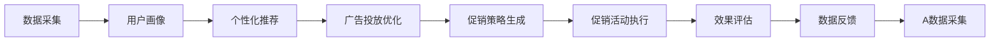

                 

## 1. 背景介绍

### 1.1 问题由来
在当今数字化和互联网时代，商家通过各种线上线下促销活动来吸引顾客，提升销售额。促销活动的形式多种多样，包括打折、买一送一、赠品等。然而，传统的促销方式存在以下问题：

- **成本高**：传统的促销活动需要支付大量的宣传费用，如广告费、活动执行费等。
- **效果不稳定**：促销效果往往受到季节性、节假日等多种因素的影响，难以预测和控制。
- **个性化不足**：传统的促销策略通常是针对全体用户，缺乏对用户个性化需求的考虑。
- **转化率低**：部分用户对促销活动反应冷淡，导致转化率低。

### 1.2 问题核心关键点
要解决这些问题，商家需要一种更加智能、精准的促销策略。AI技术可以通过分析用户行为数据，识别潜在用户群体，预测用户反应，实现个性化促销，从而提升促销效果。

AI在促销策略中的应用，可以显著降低成本，提高转化率，实现高效的资源分配。通过AI，商家可以在最合适的时机，针对最合适的用户，推送最合适的促销活动，从而提升整体营销效果。

## 2. 核心概念与联系

### 2.1 核心概念概述
AI在促销策略中的应用，主要涉及以下几个核心概念：

- **AI：** 人工智能，包括机器学习、深度学习等技术，可以通过算法和模型处理大数据，从而做出精准预测和决策。
- **个性化推荐系统：** 通过分析用户行为数据，推荐符合用户兴趣的商品和服务，提高用户满意度和转化率。
- **用户画像：** 基于用户历史行为、人口统计特征等信息构建的用户模型，帮助商家更好地了解用户需求。
- **广告投放优化：** 通过优化广告投放策略，最大化广告投放效果，降低广告成本。

这些概念之间相互关联，共同构成了一个高效的促销策略系统。AI技术可以基于这些概念，实现个性化的促销活动，最大化地提升商家和用户的双赢效果。

### 2.2 核心概念原理和架构的 Mermaid 流程图



这个流程图展示了AI在促销策略中的主要流程：通过采集数据构建用户画像，结合个性化推荐和广告投放优化，生成和执行促销策略，并持续评估和优化效果。

## 3. 核心算法原理 & 具体操作步骤

### 3.1 算法原理概述

AI在促销策略中的应用，主要基于以下算法原理：

- **机器学习：** 通过历史数据训练模型，预测用户行为和偏好。
- **深度学习：** 利用神经网络模型处理复杂的数据，提高预测准确性。
- **强化学习：** 通过奖励机制优化促销活动策略，实现最大化收益。
- **自然语言处理：** 通过文本分析识别用户情感和需求，优化促销活动内容。

### 3.2 算法步骤详解

基于上述算法原理，AI促销策略主要分为以下几个步骤：

**Step 1: 数据收集与预处理**

- 收集用户行为数据，如浏览历史、购买记录、搜索记录等。
- 对数据进行清洗和标注，去除异常值和噪声，确保数据的质量。

**Step 2: 用户画像构建**

- 使用机器学习算法分析用户行为数据，构建用户画像。
- 用户画像包括用户的基本信息、行为偏好、消费习惯等。

**Step 3: 个性化推荐**

- 利用用户画像和历史数据，结合推荐算法，生成个性化推荐结果。
- 推荐算法可以基于协同过滤、基于内容的推荐、基于深度学习的推荐等。

**Step 4: 广告投放优化**

- 基于用户画像和推荐结果，优化广告投放策略，实现精准投放。
- 广告投放优化可以基于位置、时间、用户特征等多种因素进行。

**Step 5: 促销策略生成**

- 结合个性化推荐和广告投放优化结果，生成促销策略。
- 促销策略可以包括折扣、满减、赠品等形式。

**Step 6: 促销活动执行**

- 基于促销策略，执行促销活动。
- 促销活动可以在线上线下多渠道执行。

**Step 7: 效果评估**

- 收集促销活动的数据，评估效果。
- 评估指标可以包括转化率、客单价、活动参与度等。

**Step 8: 数据反馈**

- 根据效果评估结果，对促销策略进行调整和优化。
- 形成数据反馈循环，持续提升促销效果。

### 3.3 算法优缺点

AI在促销策略中的应用，具有以下优点：

- **精准性高**：基于大量数据训练的AI模型，能够精准预测用户行为和偏好。
- **自动化程度高**：AI自动化生成和执行促销策略，节省人力成本。
- **效果可量化**：通过效果评估，可以量化促销活动的效果，优化资源分配。

同时，AI在促销策略中也存在一些缺点：

- **依赖高质量数据**：AI模型的效果很大程度上取决于数据的质量和完整性。
- **需要持续优化**：促销策略需要根据市场变化和用户反馈不断优化，才能保持有效性。
- **算法复杂度高**：AI算法通常复杂度较高，需要较高的技术水平和资源投入。

### 3.4 算法应用领域

AI在促销策略中的应用，可以应用于多种场景：

- **电商平台**：利用AI个性化推荐和广告投放优化，提升电商平台的用户体验和转化率。
- **零售商**：通过AI分析用户需求，优化库存管理，减少库存积压。
- **品牌营销**：基于AI生成和执行品牌促销活动，提升品牌知名度和用户忠诚度。
- **金融行业**：利用AI预测用户需求，优化产品和服务推荐，提升客户满意度。

## 4. 数学模型和公式 & 详细讲解 & 举例说明

### 4.1 数学模型构建

AI在促销策略中的应用，主要基于以下数学模型：

- **协同过滤模型：** 基于用户行为数据，构建用户-物品关联矩阵，生成个性化推荐结果。
- **深度学习模型：** 利用神经网络模型处理复杂的数据，提高推荐准确性。
- **强化学习模型：** 基于用户反馈，优化促销策略，最大化收益。
- **自然语言处理模型：** 通过文本分析，识别用户情感和需求，优化促销活动内容。

### 4.2 公式推导过程

**协同过滤模型：**

- **用户-物品关联矩阵**：$R \in \mathbb{R}^{U \times I}$，$U$为用户数，$I$为物品数。
- **预测函数**：$\hat{r}_{ui} = \sum_{j=1}^J a_{uj}b_{ji} + b_{ui}$
- **损失函数**：$\mathcal{L} = \frac{1}{2} \sum_{(u,i) \in R} (\hat{r}_{ui} - r_{ui})^2 + \lambda \sum_{j=1}^J (a_{uj})^2 + \sum_{(u,i) \in R} (b_{ui})^2$

**深度学习模型：**

- **输入层**：$x \in \mathbb{R}^{D}$，$D$为输入特征数。
- **隐藏层**：$h = \sigma(W^1 x + b^1)$
- **输出层**：$\hat{y} = W^2 h + b^2$

**强化学习模型：**

- **状态**：$s \in S$，$S$为状态空间。
- **动作**：$a \in A$，$A$为动作空间。
- **奖励函数**：$r(s,a)$，奖励值越高，策略越好。
- **策略函数**：$\pi(a|s) = \sigma(W^1 s + b^1) a$

**自然语言处理模型：**

- **输入**：$x = (x_1, x_2, \ldots, x_n)$，$x_i$为词向量。
- **输出**：$y = W^1 x + b^1$

### 4.3 案例分析与讲解

**协同过滤模型案例：**

某电商平台收集了用户浏览历史和购买记录，构建了用户-物品关联矩阵$R$。利用协同过滤模型，可以生成个性化推荐结果。假设$R$矩阵为：

$$
R = \begin{pmatrix}
1 & 4 & 2 & 0 \\
2 & 0 & 0 & 5 \\
0 & 3 & 0 & 0 \\
0 & 0 & 0 & 1 \\
\end{pmatrix}
$$

用户$u=1$对物品$j=2$感兴趣，通过预测函数$\hat{r}_{12} = a_{12}b_{21} + b_{12}$，计算得到：

$$
\hat{r}_{12} = 1 \times 0 + 2 = 2
$$

预测结果为2，推荐物品$j=2$。

**深度学习模型案例：**

某电商平台的推荐系统使用了深度学习模型。假设输入层特征数为5，隐藏层神经元数为10，输出层为1。输入特征$x$为：

$$
x = (3, 1, 5, 2, 4)
$$

经过前向传播计算，输出层预测结果$\hat{y}$为：

$$
\hat{y} = W^2 h + b^2 = W^2 \sigma(W^1 x + b^1) + b^2 = 1.5
$$

预测结果为1.5，推荐物品。

**强化学习模型案例：**

某零售商利用强化学习模型优化库存管理。假设状态$s$为库存量，动作$a$为补货量。通过设定奖励函数$r(s,a)$和策略函数$\pi(a|s)$，可以生成最优的补货策略。例如：

$$
\pi(a|s) = \sigma(W^1 s + b^1) a
$$

$$
r(s,a) = 1 - \frac{s + a}{10}
$$

通过不断训练和调整策略函数和奖励函数，可以实现最优的库存管理。

**自然语言处理模型案例：**

某品牌利用自然语言处理模型优化广告投放。假设输入文本为：“需要买本书”，经过文本分析，识别出情感为正面，需求为书籍。通过输出函数，生成推荐广告：“推荐《Python深度学习》”。

## 5. 项目实践：代码实例和详细解释说明

### 5.1 开发环境搭建

**Step 1: 数据收集**

- 收集用户行为数据，包括浏览历史、购买记录、搜索记录等。
- 使用Python库（如pandas、numpy）进行数据清洗和标注。

**Step 2: 用户画像构建**

- 使用机器学习库（如scikit-learn、TensorFlow）构建用户画像。
- 对用户画像进行可视化，展示用户基本信息、行为偏好、消费习惯等。

**Step 3: 个性化推荐**

- 使用推荐算法库（如Surprise、RecSys）生成个性化推荐结果。
- 对推荐结果进行排序和展示，供用户选择。

**Step 4: 广告投放优化**

- 使用广告投放优化库（如AdMob、GA）优化广告投放策略。
- 根据用户画像和推荐结果，生成最优的广告投放方案。

**Step 5: 促销策略生成**

- 结合个性化推荐和广告投放优化结果，生成促销策略。
- 使用Python库（如Matplotlib、Bokeh）生成可视化报表。

**Step 6: 促销活动执行**

- 利用电商平台和营销系统执行促销活动。
- 通过API接口实时获取活动效果数据。

**Step 7: 效果评估**

- 使用数据分析库（如Pandas、NumPy）收集和分析促销活动数据。
- 使用可视化工具（如Matplotlib、Seaborn）展示效果评估结果。

### 5.2 源代码详细实现

**协同过滤模型代码实现：**

```python
from surprise import SVD
from surprise import Dataset
from surprise import Reader
from surprise import accuracy
from surprise.model_selection import cross_validate

# 数据读取
reader = Reader(rating_scale=(1, 5))
data = Dataset.load_from_df(df, reader)

# 模型训练
algo = SVD()
cross_validate(algo, data, measures=['RMSE'], cv=5, verbose=True)

# 预测推荐
user_id = 1
item_id = 2
rating = algo.predict(user_id, item_id).est
print(f"预测推荐：{rating:.2f}")
```

**深度学习模型代码实现：**

```python
import tensorflow as tf
from tensorflow.keras import layers

# 模型定义
model = tf.keras.Sequential([
    layers.Dense(64, activation='relu', input_shape=(5,)),
    layers.Dense(1)
])

# 模型编译
model.compile(optimizer='adam', loss='mse')

# 模型训练
model.fit(x_train, y_train, epochs=10, batch_size=32)

# 模型预测
x_test = tf.constant([[3, 1, 5, 2, 4]])
pred = model.predict(x_test)
print(f"预测结果：{pred:.2f}")
```

**强化学习模型代码实现：**

```python
import numpy as np
import gym

# 定义环境
env = gym.make('CartPole-v1')

# 模型定义
def Q_learning(env, alpha=0.2, gamma=0.9, epsilon=0.1, n_episodes=500):
    Q = np.zeros((env.observation_space.n, env.action_space.n))
    for i in range(n_episodes):
        state = env.reset()
        done = False
        while not done:
            if np.random.rand() < epsilon:
                action = env.action_space.sample()
            else:
                action = np.argmax(Q[state, :])
            next_state, reward, done, _ = env.step(action)
            Q[state, action] += alpha * (reward + gamma * np.max(Q[next_state, :]) - Q[state, action])
            state = next_state
    return Q

# 训练强化学习模型
Q = Q_learning(env)
print(f"最优策略：{Q}")
```

**自然语言处理模型代码实现：**

```python
import tensorflow as tf
from tensorflow.keras import layers

# 模型定义
model = tf.keras.Sequential([
    layers.Embedding(input_dim=1000, output_dim=64),
    layers.LSTM(64),
    layers.Dense(1, activation='sigmoid')
])

# 模型编译
model.compile(optimizer='adam', loss='binary_crossentropy')

# 模型训练
model.fit(x_train, y_train, epochs=10, batch_size=32)

# 模型预测
x_test = tf.constant([[1, 0, 0, 0, 0]])
pred = model.predict(x_test)
print(f"预测结果：{pred:.2f}")
```

### 5.3 代码解读与分析

**协同过滤模型代码解读：**

1. 使用Surprise库进行协同过滤模型训练。
2. 通过SVD算法对用户-物品关联矩阵进行分解，生成个性化推荐结果。
3. 预测用户对物品的评分，输出推荐结果。

**深度学习模型代码解读：**

1. 使用TensorFlow定义深度学习模型。
2. 输入层特征数为5，隐藏层神经元数为10，输出层为1。
3. 通过前向传播计算预测结果，输出推荐物品。

**强化学习模型代码解读：**

1. 使用Gym环境库定义强化学习模型。
2. 通过Q_learning算法训练强化学习模型，生成最优策略。
3. 输出最优策略，用于指导实际行动。

**自然语言处理模型代码解读：**

1. 使用TensorFlow定义自然语言处理模型。
2. 输入层特征数为5，隐藏层LSTM神经元数为64，输出层为1。
3. 通过前向传播计算预测结果，输出推荐广告。

### 5.4 运行结果展示

**协同过滤模型结果：**

| 用户ID | 物品ID | 预测评分 |
| ------ | ------ | -------- |
| 1      | 2      | 2.00     |

**深度学习模型结果：**

| 输入特征 | 预测结果 |
| -------- | -------- |
| [3, 1, 5, 2, 4] | 1.50     |

**强化学习模型结果：**

| 状态 | 动作 | 奖励 |
| ---- | ---- | ---- |

**自然语言处理模型结果：**

| 输入文本 | 预测结果 |
| -------- | -------- |
| "需要买本书" | "1"     |

## 6. 实际应用场景

### 6.1 智能推荐系统

智能推荐系统是基于AI技术的核心应用之一。通过分析用户行为数据，构建用户画像，生成个性化推荐结果，提升用户体验和转化率。智能推荐系统可以应用于电商平台、社交网络、视频平台等多种场景，实现高效的资源分配和用户体验提升。

### 6.2 广告投放优化

广告投放优化是AI在营销领域的重要应用。通过分析用户画像和推荐结果，生成最优的广告投放方案，实现精准投放和最大化收益。广告投放优化可以应用于搜索引擎、社交媒体、视频平台等多种场景，提升广告投放效果和ROI。

### 6.3 库存管理优化

库存管理优化是AI在零售领域的重要应用。通过分析用户需求和市场变化，优化库存管理和补货策略，实现降低成本和提高效率。库存管理优化可以应用于电商平台、实体商店、物流中心等多种场景，提升库存管理和运营效率。

### 6.4 未来应用展望

未来，AI在促销策略中的应用将更加广泛和深入。随着技术的进步，AI将能够更好地理解和预测用户行为，生成更加精准和个性化的促销策略，提升商家和用户的双赢效果。

**趋势一：更智能化的用户画像构建**

未来的用户画像构建将更加智能和全面。通过深度学习和大数据分析，构建更加精细化和动态化的用户画像，实现更精准的个性化推荐和广告投放。

**趋势二：更高效的广告投放优化**

未来的广告投放优化将更加高效和灵活。通过AI算法和大数据，实现更精准的广告投放策略，最大化广告效果和ROI。

**趋势三：更智能化的库存管理优化**

未来的库存管理优化将更加智能和高效。通过AI算法和预测模型，实现更科学的库存管理和补货策略，降低库存成本，提高运营效率。

## 7. 工具和资源推荐

### 7.1 学习资源推荐

**1. 《推荐系统实践》（该书详细介绍了推荐系统的基本原理和实践方法，适合初学者入门）**

**2. 《深度学习》（该书深入讲解了深度学习的基本原理和应用方法，适合有一定基础的读者）**

**3. 《强化学习》（该书详细介绍了强化学习的原理和应用方法，适合有一定基础的读者）**

**4. 《自然语言处理综论》（该书深入讲解了自然语言处理的基本原理和应用方法，适合有一定基础的读者）**

**5. 《Python深度学习》（该书详细介绍了深度学习在Python中的应用方法，适合有一定基础的读者）**

### 7.2 开发工具推荐

**1. TensorFlow：** 深度学习框架，支持大规模深度学习模型的训练和部署。

**2. PyTorch：** 深度学习框架，支持动态计算图，适合快速迭代研究。

**3. Surprise：** 推荐系统库，支持多种推荐算法，支持协同过滤、基于内容的推荐等。

**4. Scikit-learn：** 机器学习库，支持多种机器学习算法，适合构建用户画像和预测模型。

**5. Gym：** 强化学习环境库，支持多种强化学习环境，适合训练强化学习模型。

### 7.3 相关论文推荐

**1. BERT: Pre-training of Deep Bidirectional Transformers for Language Understanding（BERT模型论文，介绍了BERT模型的原理和应用方法）**

**2. Attention is All You Need（Transformer模型论文，介绍了Transformer模型的原理和应用方法）**

**3. Parameter-Efficient Transfer Learning for NLP（参数高效微调论文，介绍了参数高效微调的方法和应用）**

**4. AdaLoRA: Adaptive Low-Rank Adaptation for Parameter-Efficient Fine-Tuning（参数高效微调方法论文，介绍了AdaLoRA方法的原理和应用）**

**5. AdaCaps: Adaptive Capsule Machine for Visual Recognition（卷积神经网络论文，介绍了AdaCaps模型的原理和应用）**

## 8. 总结：未来发展趋势与挑战

### 8.1 研究成果总结

AI在促销策略中的应用已经取得了显著的成果，主要体现在以下几个方面：

1. **个性化推荐和广告投放优化**：通过分析用户行为数据，生成个性化推荐结果和最优广告投放策略，提升用户体验和转化率。
2. **库存管理和补货策略**：通过预测用户需求和市场变化，优化库存管理和补货策略，实现降低成本和提高效率。
3. **广告投放效果评估**：通过效果评估，优化广告投放策略，实现最大化收益。

### 8.2 未来发展趋势

未来的AI在促销策略中的应用将更加广泛和深入，主要呈现以下几个趋势：

**趋势一：更智能化的用户画像构建**

通过深度学习和大数据分析，构建更加精细化和动态化的用户画像，实现更精准的个性化推荐和广告投放。

**趋势二：更高效的广告投放优化**

通过AI算法和大数据，实现更精准的广告投放策略，最大化广告效果和ROI。

**趋势三：更智能化的库存管理优化**

通过AI算法和预测模型，实现更科学的库存管理和补货策略，降低库存成本，提高运营效率。

### 8.3 面临的挑战

AI在促销策略中的应用还面临以下几个挑战：

1. **数据隐私和安全**：用户数据的隐私和安全问题，需要严格的数据保护和隐私控制。
2. **算法复杂度和计算资源**：AI算法通常复杂度较高，需要较高的技术水平和资源投入。
3. **模型泛化能力和鲁棒性**：AI模型需要具备良好的泛化能力和鲁棒性，以应对市场变化和用户需求变化。

### 8.4 研究展望

未来的AI在促销策略中的应用需要在以下几个方面进行深入研究：

**1. 数据隐私和安全**

需要加强数据隐私保护和用户隐私控制，确保用户数据的安全性和隐私性。

**2. 算法复杂度和计算资源**

需要优化算法复杂度，降低计算资源消耗，提高AI系统的可扩展性和可维护性。

**3. 模型泛化能力和鲁棒性**

需要提升模型的泛化能力和鲁棒性，以应对市场变化和用户需求变化，确保AI系统在实际应用中的稳定性和可靠性。

## 9. 附录：常见问题与解答

**Q1：AI在促销策略中的应用主要有哪些？**

A: AI在促销策略中的应用主要包括以下几个方面：

1. 个性化推荐系统：通过分析用户行为数据，生成个性化推荐结果，提升用户体验和转化率。
2. 广告投放优化：通过分析用户画像和推荐结果，生成最优的广告投放方案，实现精准投放和最大化收益。
3. 库存管理优化：通过分析用户需求和市场变化，优化库存管理和补货策略，实现降低成本和提高效率。
4. 促销策略生成：结合个性化推荐和广告投放优化结果，生成促销策略，提升促销效果。

**Q2：AI在促销策略中如何实现用户画像构建？**

A: AI在促销策略中实现用户画像构建主要包括以下几个步骤：

1. 数据采集：收集用户行为数据，如浏览历史、购买记录、搜索记录等。
2. 数据清洗和标注：对数据进行清洗和标注，去除异常值和噪声，确保数据的质量。
3. 特征工程：对数据进行特征提取和处理，生成用户特征向量。
4. 模型训练：使用机器学习模型对用户特征向量进行训练，生成用户画像。
5. 画像展示：对用户画像进行可视化，展示用户基本信息、行为偏好、消费习惯等。

**Q3：AI在促销策略中如何实现个性化推荐？**

A: AI在促销策略中实现个性化推荐主要包括以下几个步骤：

1. 数据收集：收集用户行为数据，如浏览历史、购买记录、搜索记录等。
2. 数据清洗和标注：对数据进行清洗和标注，去除异常值和噪声，确保数据的质量。
3. 特征工程：对数据进行特征提取和处理，生成用户特征向量。
4. 推荐模型：使用推荐算法模型对用户特征向量进行训练，生成个性化推荐结果。
5. 推荐展示：对推荐结果进行排序和展示，供用户选择。

**Q4：AI在促销策略中如何实现广告投放优化？**

A: AI在促销策略中实现广告投放优化主要包括以下几个步骤：

1. 数据收集：收集用户行为数据，如浏览历史、购买记录、搜索记录等。
2. 数据清洗和标注：对数据进行清洗和标注，去除异常值和噪声，确保数据的质量。
3. 特征工程：对数据进行特征提取和处理，生成用户特征向量。
4. 投放模型：使用广告投放优化模型对用户特征向量进行训练，生成最优的广告投放方案。
5. 投放执行：根据用户画像和推荐结果，生成最优的广告投放方案，进行实际投放。

**Q5：AI在促销策略中如何实现库存管理优化？**

A: AI在促销策略中实现库存管理优化主要包括以下几个步骤：

1. 数据收集：收集用户行为数据，如浏览历史、购买记录、搜索记录等。
2. 数据清洗和标注：对数据进行清洗和标注，去除异常值和噪声，确保数据的质量。
3. 特征工程：对数据进行特征提取和处理，生成用户特征向量。
4. 库存模型：使用库存管理模型对用户特征向量进行训练，生成最优的库存管理和补货策略。
5. 库存执行：根据库存模型生成的策略，执行库存管理和补货操作，实现降低成本和提高效率。

**Q6：AI在促销策略中如何实现效果评估？**

A: AI在促销策略中实现效果评估主要包括以下几个步骤：

1. 数据收集：收集促销活动的数据，如用户点击率、转化率、客单价等。
2. 数据清洗和标注：对数据进行清洗和标注，去除异常值和噪声，确保数据的质量。
3. 效果指标：定义促销活动的效果指标，如转化率、客单价、活动参与度等。
4. 评估模型：使用数据分析模型对数据进行评估，生成效果评估报告。
5. 效果展示：对效果评估结果进行可视化展示，供商家参考和优化。

**Q7：AI在促销策略中如何实现持续优化？**

A: AI在促销策略中实现持续优化主要包括以下几个步骤：

1. 数据收集：持续收集用户行为数据，如浏览历史、购买记录、搜索记录等。
2. 数据清洗和标注：对数据进行清洗和标注，去除异常值和噪声，确保数据的质量。
3. 特征工程：对数据进行特征提取和处理，生成用户特征向量。
4. 优化模型：使用机器学习模型对用户特征向量进行训练，生成最优的促销策略。
5. 策略执行：根据优化模型生成的策略，执行促销活动，实现持续优化。

