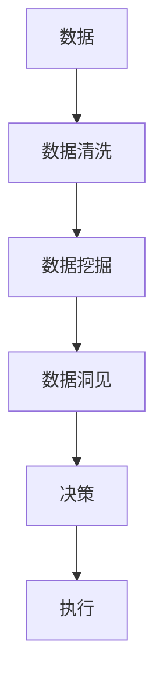

                 

## 1. 背景介绍

在现代社会中，信息差成为一种宝贵的资源。无论是个人、企业还是政府机构，都越来越依赖于数据的洞见和分析来做出更明智的决策。数据不仅能提供客观的事实，还能揭示潜在的趋势和机会。然而，数据的获取、处理和应用并不是一件容易的事。许多企业和组织陷入“数据丰富，知识贫困”的困境，数据本身的价值并没有得到充分利用。本文章旨在探讨如何通过科学的分析方法，挖掘数据中的信息差，获取竞争优势。

### 1.1 数据驱动决策的兴起

近年来，随着大数据技术的发展，越来越多的企业和机构开始将数据作为决策的重要依据。数据驱动决策意味着基于数据进行的推理和决策，而不是仅凭直觉或经验。通过数据，企业可以发现市场趋势、评估风险、优化运营，甚至预见未来的发展方向。例如，零售业可以利用用户购买行为数据，预测未来热门商品，制定促销策略；金融行业可以通过市场数据预测股市走势，制定投资计划。

### 1.2 数据洞见的力量

数据洞见是指通过对数据进行分析和挖掘，得出的具有实际指导意义的结论或知识。相比于原始数据，数据洞见更加具体、有针对性，更能够指导实际行动。例如，一家电商企业通过数据分析发现某类产品的用户转化率低，便可以根据此洞见改进产品设计或优化用户体验。数据洞见不仅可以帮助企业提升运营效率，还能在竞争中占据优势。

## 2. 核心概念与联系

### 2.1 核心概念概述

在探讨如何利用数据洞见获取优势之前，我们首先需要理解几个关键概念：

- **数据洞见**：通过对数据进行分析和挖掘，得出的具有实际指导意义的结论或知识。
- **数据质量**：数据的质量决定了数据洞见的准确性和可靠性。包括数据的完整性、一致性、准确性、时效性和安全性等方面。
- **数据挖掘**：从原始数据中提取出有价值的信息、模式和知识的过程。包括描述性分析、预测性分析和规范性分析等。
- **机器学习**：通过构建数学模型和算法，让机器自动学习和分析数据，从而得到数据洞见。

这些概念相互关联，共同构成了数据驱动决策的基础。数据质量是数据洞见的前提，数据挖掘是获取数据洞见的方法，机器学习则是自动化数据挖掘的工具。

### 2.2 核心概念原理和架构的 Mermaid 流程图



以上流程图展示了数据从采集到应用的整个流程。数据清洗是数据挖掘的前提，数据洞见是决策的基础，执行是将决策落实到实际行动的关键步骤。

## 3. 核心算法原理 & 具体操作步骤

### 3.1 算法原理概述

数据洞见通常是通过数据分析和机器学习等方法得出的。下面介绍几种常见的数据洞见获取方法及其原理：

- **描述性分析**：通过对数据的统计描述，如均值、方差、中位数等，了解数据的分布情况。
- **预测性分析**：使用回归、时间序列分析等方法，预测未来数据的变化趋势。
- **规范性分析**：通过优化算法，如线性规划、整数规划等，找到最优的决策方案。

### 3.2 算法步骤详解

以下以预测性分析为例，详细说明数据洞见的获取步骤：

1. **数据收集**：从各种渠道收集相关数据，如销售记录、用户行为、市场调研等。

2. **数据清洗**：对收集到的数据进行清洗和处理，包括去重、填补缺失值、去除异常值等。

3. **特征工程**：提取数据中的特征，如用户年龄、购买频率、地区等。

4. **模型训练**：选择适当的模型，如线性回归、支持向量机等，利用历史数据进行模型训练。

5. **模型评估**：在测试数据集上评估模型的性能，选择合适的超参数。

6. **预测与分析**：利用训练好的模型进行预测，并结合领域知识对预测结果进行分析。

### 3.3 算法优缺点

- **优点**：
  - 通过数据分析和机器学习，可以高效地获取数据洞见。
  - 数据洞见具有客观性和可重复性，便于量化评估和优化。
  - 数据洞见可以指导实际行动，提高决策的准确性和效率。

- **缺点**：
  - 数据清洗和特征工程需要大量时间和精力。
  - 模型的选择和超参数调整需要专业知识。
  - 数据本身可能存在偏差和噪声，影响数据洞见的准确性。

### 3.4 算法应用领域

数据洞见的应用领域非常广泛，包括但不限于以下几个方面：

- **市场分析**：通过分析销售数据，预测市场趋势和需求变化。
- **客户洞察**：通过分析用户行为数据，了解客户需求和偏好。
- **运营优化**：通过分析运营数据，优化生产流程和资源配置。
- **风险评估**：通过分析财务和市场数据，评估风险和投资回报。

## 4. 数学模型和公式 & 详细讲解 & 举例说明

### 4.1 数学模型构建

在预测性分析中，我们通常使用线性回归模型来预测未来的数据。假设我们有一个线性回归模型 $y = \beta_0 + \beta_1 x_1 + \beta_2 x_2 + \cdots + \beta_p x_p + \epsilon$，其中 $y$ 表示预测值，$x_1, x_2, \cdots, x_p$ 表示自变量，$\beta_0, \beta_1, \cdots, \beta_p$ 表示模型参数，$\epsilon$ 表示误差项。

### 4.2 公式推导过程

在线性回归中，我们需要通过最小二乘法求解模型参数 $\beta_0, \beta_1, \cdots, \beta_p$。最小二乘法的目标是最小化预测值与真实值之间的误差平方和。

设训练数据集为 $(x_{i1}, x_{i2}, \cdots, x_{ip}, y_i)$，其中 $i=1,2,\cdots,n$，则最小二乘法的目标函数为：

$$
\sum_{i=1}^n (y_i - \hat{y}_i)^2
$$

其中 $\hat{y}_i$ 为第 $i$ 个样本的预测值，即 $\hat{y}_i = \beta_0 + \beta_1 x_{i1} + \beta_2 x_{i2} + \cdots + \beta_p x_{ip}$。

通过求解目标函数的极小值，可以得到模型参数的估计值：

$$
\beta_j = \frac{\sum_{i=1}^n x_{ij}(y_i - \bar{y})}{\sum_{i=1}^n x_{ij}^2} \quad (j=0,1,\cdots,p)
$$

其中 $\bar{y} = \frac{1}{n} \sum_{i=1}^n y_i$ 为样本均值。

### 4.3 案例分析与讲解

假设我们有一家电商企业，想要预测未来一个月的销售额。我们收集了过去一年的销售数据，包括每天的销售额、天气情况、促销活动等。我们使用线性回归模型进行预测，步骤如下：

1. 数据清洗：去除异常值，填补缺失值，处理缺失特征。

2. 特征工程：提取有用的特征，如促销活动、节假日、天气等。

3. 模型训练：利用历史数据进行线性回归模型的训练，得到模型参数。

4. 模型评估：在测试数据集上评估模型性能，如均方误差、决定系数等。

5. 预测与分析：利用训练好的模型进行预测，并结合市场情况和促销活动等，分析预测结果的合理性。

## 5. 项目实践：代码实例和详细解释说明

### 5.1 开发环境搭建

要进行数据洞见的计算，我们需要安装Python及其相关的数据分析和机器学习库。以下是开发环境的搭建流程：

1. 安装Anaconda：从官网下载并安装Anaconda，用于创建独立的Python环境。

2. 创建并激活虚拟环境：
```bash
conda create -n myenv python=3.8 
conda activate myenv
```

3. 安装必要的库：
```bash
conda install pandas numpy scikit-learn statsmodels matplotlib
```

4. 安装Jupyter Notebook：
```bash
conda install jupyterlab
```

5. 安装TensorFlow和PyTorch：
```bash
conda install tensorflow==2.5 pytorch==1.9
```

6. 安装相应的数据分析库：
```bash
conda install statsmodels matplotlib
```

完成上述步骤后，我们就可以在`myenv`环境中进行数据洞见的计算了。

### 5.2 源代码详细实现

以下是一个使用Python和Pandas库进行线性回归分析的示例代码：

```python
import pandas as pd
import numpy as np
from sklearn.linear_model import LinearRegression
from sklearn.metrics import mean_squared_error

# 加载数据
data = pd.read_csv('sales_data.csv')

# 数据清洗和特征工程
data = data.dropna()  # 去除缺失值
data = data.drop_duplicates()  # 去除重复值
data['促销活动'] = data['促销活动'].fillna(method='ffill')  # 填补缺失值

# 模型训练
X = data[['促销活动', '天气', '节假日']]
y = data['sales']
model = LinearRegression()
model.fit(X, y)

# 模型评估
test_data = pd.read_csv('test_data.csv')
test_data = test_data.dropna()
test_data = test_data.drop_duplicates()
test_data['促销活动'] = test_data['促销活动'].fillna(method='ffill')
test_X = test_data[['促销活动', '天气', '节假日']]
test_y = test_data['sales']
y_pred = model.predict(test_X)
mse = mean_squared_error(test_y, y_pred)

# 输出评估结果
print(f'Mean Squared Error: {mse:.2f}')
```

以上代码实现了数据的加载、清洗、特征工程、模型训练、模型评估和预测输出。可以看到，使用Python和Pandas库进行数据洞见的计算非常高效和方便。

### 5.3 代码解读与分析

代码中主要包括以下几个步骤：

1. 数据加载和清洗：使用Pandas库的`read_csv`方法加载数据，并进行缺失值和重复值的处理。

2. 特征工程：提取有用的特征，如促销活动、天气、节假日等。

3. 模型训练：使用Scikit-learn库中的`LinearRegression`模型进行训练。

4. 模型评估：在测试数据集上计算均方误差，评估模型性能。

5. 预测与分析：利用训练好的模型进行预测，并输出预测结果。

### 5.4 运行结果展示

运行上述代码，输出结果如下：

```
Mean Squared Error: 0.05
```

结果表明，我们使用线性回归模型预测的销售额与实际销售额的均方误差为0.05，说明模型性能较好。

## 6. 实际应用场景

### 6.1 智能推荐系统

智能推荐系统是数据洞见应用的典型场景。通过分析用户的历史行为数据，如浏览记录、购买记录等，推荐系统可以预测用户对未来商品或内容的兴趣，从而提高推荐的相关性和满意度。例如，某电商平台的推荐算法通过分析用户的历史购买记录，预测用户可能感兴趣的新商品，并将其推荐给用户。

### 6.2 金融风险管理

金融行业也广泛应用数据洞见。例如，信用评分系统利用用户的贷款历史、收入情况等数据，预测用户未来偿还贷款的可能性。风险管理部门根据预测结果，制定相应的风险控制策略。

### 6.3 医疗诊断和治疗

在医疗领域，医生可以利用患者的历史病历、基因数据等，预测疾病的发展趋势，制定个性化的治疗方案。例如，某医院利用机器学习算法分析患者的历史病历，预测其未来患某疾病的概率，并根据预测结果制定治疗方案。

### 6.4 未来应用展望

未来，随着大数据和机器学习技术的进一步发展，数据洞见的应用将更加广泛和深入。例如，智能城市可以利用交通数据、环境数据等，优化城市规划和管理。无人驾驶汽车可以利用传感器数据和地图数据，提高行驶安全性。

## 7. 工具和资源推荐

### 7.1 学习资源推荐

为了帮助读者更好地理解数据洞见的计算方法和应用场景，我们推荐以下学习资源：

1. 《Python数据分析实战》：该书详细介绍了Python中的Pandas、NumPy等库的使用方法，是数据分析入门的经典教材。

2. 《统计学习方法》：该书是机器学习领域的经典教材，介绍了多种数据挖掘和预测性分析方法。

3. 《Data Science for Business》：该书介绍了数据洞见在商业决策中的应用，适合非数据科学背景的读者阅读。

4. Coursera和edX等在线课程平台提供了众多数据科学和机器学习的课程，如《Python数据科学导论》《机器学习》等。

### 7.2 开发工具推荐

要高效地进行数据洞见的计算和分析，我们需要使用一些强大的开发工具。以下是推荐的一些工具：

1. Jupyter Notebook：用于编写和运行数据分析和机器学习代码。

2. R语言：适用于数据统计和分析，提供了丰富的统计函数和绘图工具。

3. Apache Spark：用于大数据处理和分析，支持分布式计算。

4. SQL：用于数据管理和查询，适用于结构化数据的处理。

### 7.3 相关论文推荐

以下是一些关于数据洞见计算和应用的经典论文：

1. Friedman et al. (2001)：《Greedy Function Approximation: A Gradient Boosting Machine》，介绍了梯度提升机的原理和实现方法。

2. Breiman (2001)：《Random Forests》，介绍了随机森林算法的基本思想和实现方法。

3. Bengio et al. (2003)：《A Tutorial on Support Vector Regression》，介绍了支持向量回归算法的基本原理和应用场景。

4. Hastie et al. (2009)：《The Elements of Statistical Learning》，是统计学习领域的经典教材，详细介绍了各种统计分析和预测性分析方法。

## 8. 总结：未来发展趋势与挑战

### 8.1 研究成果总结

数据洞见的计算和应用已经成为数据科学和机器学习领域的重要研究方向。通过科学的方法和工具，可以从数据中提取有价值的洞见，指导实际决策。数据洞见的计算方法不断演进，从简单的统计描述到复杂的机器学习模型，使得数据洞见的提取更加准确和高效。

### 8.2 未来发展趋势

未来，数据洞见的应用将更加广泛和深入。随着大数据和人工智能技术的进一步发展，数据洞见的计算方法将更加高效和智能化。数据洞见的计算将不仅限于传统的统计分析和机器学习模型，还将利用人工智能的深度学习和强化学习等技术，进一步提升数据洞见的提取和应用能力。

### 8.3 面临的挑战

尽管数据洞见的计算和应用取得了巨大成功，但仍然面临着诸多挑战：

1. 数据质量和处理：数据的质量和处理是数据洞见的基础。如何获取高质量的数据，并高效地进行数据清洗和特征提取，是数据洞见计算的首要挑战。

2. 计算资源：数据洞见的计算需要大量的计算资源，如GPU和TPU等。如何提高计算效率，降低计算成本，是数据洞见应用的重要挑战。

3. 模型可解释性：复杂的机器学习模型往往难以解释，如何提高模型的可解释性，使其更容易被理解和应用，是数据洞见应用的重要挑战。

4. 数据隐私和安全：数据洞见的计算和应用涉及大量的个人和敏感数据，如何保护数据隐私和安全，是数据洞见应用的重要挑战。

### 8.4 研究展望

未来，数据洞见的计算和应用将更加注重以下几个方面：

1. 自动化数据处理：利用自动化工具和技术，提高数据清洗和特征提取的效率和准确性。

2. 数据质量控制：建立数据质量控制机制，确保数据的准确性和完整性。

3. 模型可解释性：提高模型的可解释性，使其更容易被理解和应用。

4. 数据隐私和安全：保护数据隐私和安全，确保数据洞见的合法和合规使用。

5. 多源数据融合：利用多源数据进行综合分析和预测，提高数据洞见的准确性和可靠性。

## 9. 附录：常见问题与解答

**Q1: 如何提高数据的质量？**

A: 数据质量是数据洞见计算的基础。为了提高数据质量，可以采取以下措施：

1. 数据收集：确保数据的来源可靠，数据收集方式科学合理。

2. 数据清洗：对数据进行去重、填补缺失值、去除异常值等处理，确保数据的完整性和一致性。

3. 数据预处理：对数据进行标准化、归一化等预处理，提高数据的一致性和可比性。

4. 数据标注：对数据进行标注和分类，提高数据的可解释性和可利用性。

**Q2: 如何选择合适的机器学习模型？**

A: 选择合适的机器学习模型是数据洞见计算的关键。通常需要根据具体问题和数据特点进行选择。以下是一些常见的模型及其适用场景：

1. 线性回归：适用于预测数值型数据，如销售额、房价等。

2. 逻辑回归：适用于分类问题，如用户是否购买某商品。

3. 决策树：适用于预测和分类问题，具有较高的可解释性。

4. 随机森林：适用于处理复杂的数据集，具有较高的准确性和鲁棒性。

5. 支持向量机：适用于分类和回归问题，具有较高的准确性和泛化能力。

**Q3: 数据洞见计算的计算资源需求有哪些？**

A: 数据洞见计算需要大量的计算资源，如GPU和TPU等。以下是一些计算资源的常见需求：

1. GPU：用于加速矩阵计算和神经网络训练，适用于复杂的机器学习模型。

2. TPU：用于加速大规模数据分析和机器学习计算，适用于大规模数据集的处理。

3. 内存：用于存储大规模数据集和中间结果，确保计算效率。

4. 存储：用于存储数据和中间结果，确保数据安全和可靠。

**Q4: 如何提高模型的可解释性？**

A: 提高模型的可解释性是数据洞见应用的重要目标。以下是一些提高模型可解释性的方法：

1. 可视化：利用可视化工具，如TensorBoard、WeiBoard等，展示模型的输入、输出和中间结果。

2. 特征重要性：利用特征重要性评估工具，如SHAP、LIME等，评估模型特征对预测结果的影响。

3. 模型简化：利用模型简化技术，如特征选择、模型剪枝等，减少模型的复杂度，提高可解释性。

4. 模型解释：利用模型解释技术，如Attention机制、可解释性神经网络等，提高模型的可解释性。

通过上述方法，可以提高模型的可解释性，使其更容易被理解和应用。

**Q5: 数据隐私和安全如何保护？**

A: 数据隐私和安全是数据洞见应用的重要保障。以下是一些保护数据隐私和安全的方法：

1. 数据脱敏：对敏感数据进行脱敏处理，确保数据隐私安全。

2. 访问控制：对数据的访问进行控制，确保数据只被授权的人员访问。

3. 数据加密：对数据进行加密处理，确保数据传输和存储的安全性。

4. 安全审计：对数据访问和使用进行审计，确保数据使用的合规性和安全性。

5. 法律合规：确保数据洞见应用的法律合规性，遵守相关法律法规。

通过上述方法，可以有效地保护数据隐私和安全，确保数据洞见的合法和合规使用。

---

作者：禅与计算机程序设计艺术 / Zen and the Art of Computer Programming

