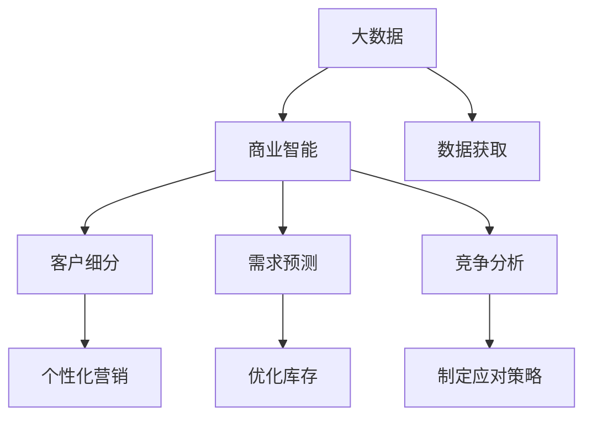

                 

# 信息差的商业市场开发：大数据如何支持市场开发

> 关键词：市场分析，大数据，商业智能，客户细分，需求预测，竞争分析

## 1. 背景介绍

### 1.1 问题由来
在现代商业世界中，信息的获取、处理和利用对企业的竞争力和盈利能力具有至关重要的影响。信息差，即企业与其竞争对手之间的信息不对称，往往是决定市场竞争优势的关键因素。然而，随着市场竞争的日益激烈和数据量的爆炸式增长，传统的市场开发和分析方法已难以应对复杂多变的数据挑战。

大数据技术的兴起，为企业的市场开发提供了新的视角和方法。通过大数据分析，企业可以更全面、更准确地掌握市场信息，从而制定更为科学、有效的市场策略，赢得竞争优势。

### 1.2 问题核心关键点
大数据技术在市场开发中的应用，主要集中在以下几个核心关键点：

- **数据获取**：如何从海量数据中高效获取、清洗和整合有用的市场信息。
- **客户细分**：如何利用大数据对客户进行精准分类，从而实现个性化营销。
- **需求预测**：如何利用大数据模型预测市场需求变化，优化库存和生产计划。
- **竞争分析**：如何通过大数据分析，了解竞争对手的策略和市场表现，制定相应的应对措施。

本文将围绕这些关键点，深入探讨大数据技术在商业市场开发中的应用，以及如何通过数据驱动的方法，提升企业的市场开发效率和效果。

## 2. 核心概念与联系

### 2.1 核心概念概述

为更好地理解大数据在商业市场开发中的应用，本节将介绍几个密切相关的核心概念：

- **大数据**：指大规模、高速、多样化的数据集，通常需要通过分布式计算和存储技术进行高效处理。大数据分析可以帮助企业从海量数据中提取有价值的信息，支持市场开发决策。

- **商业智能(BI)**：指利用大数据和人工智能技术，对企业的市场数据进行分析和挖掘，以提升企业的业务决策水平和市场竞争力。

- **客户细分**：指通过分析客户行为和特征，将市场划分为不同细分市场的过程。客户细分有助于企业实现个性化营销，提高市场开发效率。

- **需求预测**：指利用历史数据和市场趋势，预测未来市场需求的变化，从而指导企业的生产、库存和销售决策。

- **竞争分析**：指通过分析竞争对手的市场策略、产品性能和客户反馈等信息，评估自身竞争优势和劣势，制定应对策略。

这些核心概念之间的逻辑关系可以通过以下Mermaid流程图来展示：



这个流程图展示了大数据在商业市场开发中的核心概念及其之间的关系：

1. 大数据作为主要数据来源，为商业智能提供支撑。
2. 商业智能通过分析客户细分、需求预测和竞争分析，生成有价值的洞察和建议。
3. 客户细分和个性化营销有助于提升市场开发效率。
4. 需求预测和优化库存有助于降低库存成本，提升运营效率。
5. 竞争分析有助于企业识别竞争优势和劣势，制定应对策略。

这些概念共同构成了大数据在商业市场开发中的应用框架，使得企业能够通过数据驱动的方法，更加科学地进行市场开发和决策。

## 3. 核心算法原理 & 具体操作步骤
### 3.1 算法原理概述

大数据在商业市场开发中的应用，主要基于以下几个核心算法原理：

- **聚类算法**：通过分析客户行为和特征，将客户分成不同的细分市场。常用的聚类算法包括K-Means、层次聚类、DBSCAN等。

- **回归分析**：预测市场需求变化的趋势和大小，常用的回归模型包括线性回归、多项式回归、支持向量回归等。

- **分类算法**：分析竞争对手的市场策略和产品性能，识别其市场优势和劣势。常用的分类算法包括决策树、随机森林、支持向量机等。

- **关联规则挖掘**：从客户购买历史数据中发现潜在的关联关系，推荐相关产品或服务。常用的算法包括Apriori、FP-Growth等。

- **时间序列分析**：分析市场需求变化的时间趋势，预测未来市场需求。常用的时间序列模型包括ARIMA、季节性ARIMA等。

这些算法在大数据平台如Hadoop、Spark上高效运行，帮助企业从海量数据中提取有价值的信息，指导市场开发和决策。

### 3.2 算法步骤详解

基于大数据的市场开发一般包括以下几个关键步骤：

**Step 1: 数据采集与处理**

- 利用ETL工具从各个数据源（如销售系统、客户关系管理系统、社交媒体等）采集市场数据。
- 对数据进行清洗、去重、归一化等预处理，确保数据质量。

**Step 2: 数据存储与分析**

- 将清洗后的数据存储在分布式数据库（如Hive、HBase等）中。
- 使用大数据平台（如Spark、Hadoop等）对数据进行分布式分析，生成统计报告和可视化图表。

**Step 3: 客户细分与需求预测**

- 利用聚类算法对客户进行细分，生成客户细分报告。
- 使用回归模型预测市场需求，生成市场需求预测报告。

**Step 4: 竞争分析**

- 利用分类算法对竞争对手进行分类，生成竞争对手分析报告。
- 结合时间序列分析，预测市场需求变化趋势，生成市场趋势报告。

**Step 5: 个性化营销与运营优化**

- 基于客户细分报告，制定个性化营销策略。
- 结合市场需求预测报告和市场趋势报告，优化库存和生产计划。

通过上述步骤，企业可以全面、准确地掌握市场信息，制定科学的市场开发策略，提升市场开发效率和效果。

### 3.3 算法优缺点

大数据在商业市场开发中的应用具有以下优点：

- **全面性**：能够从海量数据中提取有价值的信息，支持更加全面和深入的市场分析。
- **实时性**：通过实时数据采集和分析，能够快速响应市场变化，提升市场开发效率。
- **精准性**：利用先进算法模型，能够提高预测和分类的准确性，优化市场开发策略。

同时，大数据在商业市场开发中也存在一些局限性：

- **数据质量**：市场数据的质量和完整性直接影响分析结果，数据质量差可能导致误导性决策。
- **算法复杂度**：部分算法的计算复杂度高，对硬件和算力要求较高。
- **隐私保护**：市场数据往往涉及敏感信息，如何保护客户隐私和数据安全是重要问题。

尽管存在这些局限性，但就目前而言，大数据技术在商业市场开发中的应用，已经成为主流和有效的市场开发手段。未来相关研究的重点在于如何进一步提高数据质量，降低算法复杂度，加强隐私保护，以更好地服务于市场开发实践。

### 3.4 算法应用领域

大数据在商业市场开发中的应用已经广泛应用于多个领域，例如：

- **零售业**：通过客户细分和需求预测，优化库存和生产计划，提升销售效率和利润率。
- **金融业**：通过竞争分析和风险评估，制定投资和信贷策略，降低风险损失。
- **制造业**：通过需求预测和供应链优化，提升生产效率和产品质量。
- **服务业**：通过客户细分和个性化营销，提升客户满意度和市场占有率。
- **旅游业**：通过市场趋势分析和需求预测，优化旅游产品和服务，提升客户体验。

除了上述这些领域外，大数据技术还被创新性地应用到更多场景中，如智能家居、智慧城市、智能交通等，为各行各业带来新的发展机遇。

## 4. 数学模型和公式 & 详细讲解 & 举例说明

### 4.1 数学模型构建

本节将使用数学语言对大数据在商业市场开发中的应用进行更加严格的刻画。

记市场数据集为 $D=\{(x_i,y_i)\}_{i=1}^N$，其中 $x_i$ 为输入特征向量，$y_i$ 为输出标签。假设大数据分析的目标是预测市场需求，即 $y_i \in \{0,1\}$，其中 $y_i=1$ 表示市场需求存在。

定义回归模型 $f(x;\theta)=\theta_0+\sum_{j=1}^d\theta_jx_{ij}$，其中 $\theta=(\theta_0,\theta_1,\ldots,\theta_d)$ 为模型参数。市场需求预测的损失函数为均方误差损失函数：

$$
L(y_i,f(x_i;\theta)) = \frac{1}{N}\sum_{i=1}^N(y_i-f(x_i;\theta))^2
$$

市场需求预测的目标是最小化损失函数：

$$
\theta^* = \mathop{\arg\min}_{\theta} L(y_i,f(x_i;\theta))
$$

在实践中，我们通常使用梯度下降等优化算法来近似求解上述最优化问题。设 $\eta$ 为学习率，则参数的更新公式为：

$$
\theta \leftarrow \theta - \eta\nabla_{\theta}L(y_i,f(x_i;\theta))
$$

其中 $\nabla_{\theta}L(y_i,f(x_i;\theta))$ 为损失函数对参数 $\theta$ 的梯度，可通过反向传播算法高效计算。

### 4.2 公式推导过程

以下我们以线性回归模型为例，推导市场需求预测的公式。

假设市场需求预测模型为 $f(x;\theta)=\theta_0+\sum_{j=1}^d\theta_jx_{ij}$，其中 $\theta=(\theta_0,\theta_1,\ldots,\theta_d)$ 为模型参数。市场需求预测的损失函数为均方误差损失函数：

$$
L(y_i,f(x_i;\theta)) = \frac{1}{N}\sum_{i=1}^N(y_i-f(x_i;\theta))^2
$$

将 $f(x_i;\theta)$ 代入损失函数，得：

$$
L(y_i,f(x_i;\theta)) = \frac{1}{N}\sum_{i=1}^N(y_i-\theta_0-\sum_{j=1}^d\theta_jx_{ij})^2
$$

对其进行展开，得：

$$
L(y_i,f(x_i;\theta)) = \frac{1}{N}\sum_{i=1}^N(y_i^2-2y_i\theta_0-2y_i\sum_{j=1}^d\theta_jx_{ij}+\theta_0^2+\sum_{j=1}^d\theta_j^2x_{ij}^2)
$$

将上式中的求和项和常数项分离，得：

$$
L(y_i,f(x_i;\theta)) = \frac{1}{N}\sum_{i=1}^N(y_i^2+\theta_0^2+\sum_{j=1}^d\theta_j^2x_{ij}^2)-2\frac{1}{N}\sum_{i=1}^N(y_i\theta_0+y_i\sum_{j=1}^d\theta_jx_{ij})
$$

利用均方误差损失函数的性质，得：

$$
L(y_i,f(x_i;\theta)) = \frac{1}{N}\sum_{i=1}^N(y_i^2+\theta_0^2+\sum_{j=1}^d\theta_j^2x_{ij}^2)-\frac{1}{N}\sum_{i=1}^N(2y_i\theta_0+2y_i\sum_{j=1}^d\theta_jx_{ij})
$$

再利用上式中的对称性，可以进一步简化为：

$$
L(y_i,f(x_i;\theta)) = \frac{1}{N}\sum_{i=1}^N(y_i^2+\theta_0^2+\sum_{j=1}^d\theta_j^2x_{ij}^2)-\frac{1}{N}\sum_{i=1}^N(y_i+\theta_0+\sum_{j=1}^d\theta_jx_{ij})
$$

上述公式即为线性回归模型的损失函数表达式。通过优化该损失函数，可以训练得到市场需求预测模型。

### 4.3 案例分析与讲解

假设某电商企业拥有大量用户购买历史数据，希望通过大数据分析预测某产品的市场需求。具体步骤如下：

**Step 1: 数据采集与处理**

- 从销售系统、客户关系管理系统等数据源采集用户购买历史数据。
- 对数据进行清洗、去重、归一化等预处理，确保数据质量。

**Step 2: 特征工程**

- 选择影响产品市场需求的相关特征，如用户年龄、性别、消费水平、历史购买记录等。
- 对特征进行编码和归一化，如将类别特征转换为独热编码，将数值特征归一化到0-1之间。

**Step 3: 模型训练**

- 使用部分历史数据训练线性回归模型。
- 在训练过程中，使用梯度下降算法更新模型参数，最小化损失函数。

**Step 4: 模型评估与优化**

- 使用剩余历史数据评估模型预测效果。
- 根据评估结果调整模型参数，提高预测精度。

**Step 5: 市场预测**

- 使用训练好的线性回归模型对未来市场需求进行预测。
- 根据预测结果调整库存和生产计划，优化市场开发策略。

通过以上步骤，电商企业能够利用大数据分析预测市场需求，提升市场开发效率和效果。

## 5. 项目实践：代码实例和详细解释说明

### 5.1 开发环境搭建

在进行市场开发项目实践前，我们需要准备好开发环境。以下是使用Python进行Scikit-learn开发的环境配置流程：

1. 安装Anaconda：从官网下载并安装Anaconda，用于创建独立的Python环境。

2. 创建并激活虚拟环境：
```bash
conda create -n market-env python=3.8 
conda activate market-env
```

3. 安装Scikit-learn、Numpy、Pandas等工具包：
```bash
pip install scikit-learn numpy pandas matplotlib seaborn jupyter notebook
```

完成上述步骤后，即可在`market-env`环境中开始市场开发实践。

### 5.2 源代码详细实现

下面我们以市场需求预测项目为例，给出使用Scikit-learn进行线性回归模型训练的Python代码实现。

首先，定义市场需求预测的特征和标签：

```python
import pandas as pd
import numpy as np
from sklearn.model_selection import train_test_split
from sklearn.linear_model import LinearRegression
from sklearn.metrics import mean_squared_error, r2_score

# 读取数据集
data = pd.read_csv('market_data.csv')

# 选择特征和标签
features = ['age', 'gender', 'income', 'purchase_history']
target = 'demand'

# 划分训练集和测试集
X_train, X_test, y_train, y_test = train_test_split(data[features], data[target], test_size=0.2, random_state=42)
```

然后，定义模型训练和评估函数：

```python
def train_model(X_train, y_train):
    # 初始化线性回归模型
    model = LinearRegression()
    # 训练模型
    model.fit(X_train, y_train)
    return model

def evaluate_model(model, X_test, y_test):
    # 评估模型
    y_pred = model.predict(X_test)
    mse = mean_squared_error(y_test, y_pred)
    r2 = r2_score(y_test, y_pred)
    print(f'Mean Squared Error: {mse:.2f}')
    print(f'R-squared: {r2:.2f}')
```

接着，启动市场预测流程：

```python
# 训练模型
model = train_model(X_train, y_train)

# 评估模型
evaluate_model(model, X_test, y_test)

# 预测市场需求
new_data = pd.DataFrame({features: [[30, 'male', 50000, 1000]}, index=['new_customer'])
y_pred = model.predict(new_data[features])
print(f'市场需求预测：{y_pred:.2f}')
```

以上就是使用Scikit-learn进行市场需求预测的完整代码实现。可以看到，Scikit-learn提供了强大的机器学习工具包，可以帮助我们高效地训练和评估回归模型。

### 5.3 代码解读与分析

让我们再详细解读一下关键代码的实现细节：

**特征选择**：
- 选择了影响市场需求的相关特征，如用户年龄、性别、收入水平、历史购买记录等。
- 对特征进行编码和归一化，如将类别特征转换为独热编码，将数值特征归一化到0-1之间。

**模型训练**：
- 使用`train_test_split`函数将数据集划分为训练集和测试集，测试集用于模型评估。
- 使用`LinearRegression`类初始化线性回归模型，并在训练集上调用`fit`方法训练模型。

**模型评估**：
- 使用测试集评估模型预测效果，计算均方误差和R-squared值。
- 根据评估结果输出模型性能指标。

**市场预测**：
- 使用训练好的线性回归模型对新客户的需求进行预测，输出市场需求预测值。

通过以上步骤，电商企业能够利用大数据分析预测市场需求，提升市场开发效率和效果。

## 6. 实际应用场景

### 6.1 智能制造

智能制造是工业4.0的重要组成部分，通过大数据分析，能够优化生产流程，提升生产效率和产品质量。例如，某制造业企业利用大数据分析生产数据和市场数据，预测市场需求变化，从而优化生产计划和库存管理，提高生产效率和库存周转率。

### 6.2 金融风控

金融领域对风险控制的需求非常迫切。通过大数据分析，金融机构能够实时监测市场风险，识别潜在的风险点，及时调整投资策略，降低风险损失。例如，某银行利用大数据分析客户行为数据和市场趋势，预测客户违约风险，从而制定相应的信贷策略，降低贷款损失率。

### 6.3 电子商务

电子商务企业通过大数据分析客户行为数据和市场数据，能够优化营销策略，提升客户满意度和转化率。例如，某电商平台利用大数据分析客户购买行为和市场趋势，预测热门商品和市场需求，从而优化商品推荐和广告投放策略，提高销售转化率和客户满意度。

### 6.4 旅游业

旅游业对市场趋势和需求预测的需求非常强烈。通过大数据分析，旅游企业能够优化旅游产品和服务，提升客户体验。例如，某旅游公司利用大数据分析客户旅游偏好和市场趋势，预测未来旅游需求，从而优化旅游产品和服务设计，提升客户满意度和市场占有率。

## 7. 工具和资源推荐

### 7.1 学习资源推荐

为了帮助开发者系统掌握大数据在商业市场开发中的应用，这里推荐一些优质的学习资源：

1. 《大数据技术与应用》系列课程：由知名大学和机构开设的在线课程，涵盖了大数据技术的各个方面，包括数据采集、处理、分析、可视化等。

2. 《Python数据科学手册》书籍：系统介绍了Python在大数据领域的应用，包括数据清洗、特征工程、模型训练、数据可视化等。

3. Kaggle数据科学竞赛平台：提供大量的真实市场数据和竞赛题目，帮助开发者实践大数据分析技术。

4. Coursera商业智能课程：由知名大学和机构开设的在线课程，涵盖商业智能的各个方面，包括数据仓库、数据挖掘、报表分析等。

5. GitHub大数据项目：收集了大量大数据项目的代码和文档，方便开发者学习和参考。

通过对这些资源的学习实践，相信你一定能够快速掌握大数据在商业市场开发中的应用，并用于解决实际的业务问题。

### 7.2 开发工具推荐

高效的大数据开发离不开优秀的工具支持。以下是几款用于大数据市场开发开发的常用工具：

1. Hadoop：开源分布式计算框架，适合大规模数据处理和存储。

2. Spark：开源大数据处理框架，提供了高效的数据处理和分析能力。

3. Hive：基于Hadoop的数据仓库，提供了数据查询和分析能力。

4. Flink：开源流式计算框架，适合实时数据处理和分析。

5. TensorFlow：由Google主导开发的深度学习框架，生产部署方便，适合大规模工程应用。

6. Amazon EMR：AWS提供的弹性云上大数据处理服务，支持多种大数据框架，方便开发和部署。

合理利用这些工具，可以显著提升大数据市场开发任务的开发效率，加快创新迭代的步伐。

### 7.3 相关论文推荐

大数据在商业市场开发中的应用已经得到了广泛的研究和应用，以下是几篇奠基性的相关论文，推荐阅读：

1. "Large-Scale Parallel Machine Learning with Hadoop"：介绍使用Hadoop进行大规模机器学习的技术和方法。

2. "Apache Spark: Cluster Computing with Working Sets"：介绍使用Spark进行大规模数据处理和分析的技术和应用。

3. "A Framework for Client-Server Collaboration in Big Data Analytics"：介绍使用Spark进行大规模数据协作分析和计算的方法。

4. "A Survey of Big Data Analytics Techniques for Industry"：综述大数据在各个行业中的应用，包括零售、金融、制造等。

5. "Data Mining and Statistical Learning: Concepts and Methods"：综述数据挖掘和统计学习技术的各个方面，包括分类、聚类、回归等。

这些论文代表了大数据在商业市场开发技术的发展脉络。通过学习这些前沿成果，可以帮助研究者把握学科前进方向，激发更多的创新灵感。

## 8. 总结：未来发展趋势与挑战

### 8.1 研究成果总结

本文对大数据在商业市场开发中的应用进行了全面系统的介绍。首先阐述了大数据技术在市场开发中的研究背景和应用前景，明确了市场开发中数据驱动的必要性和可行性。其次，从原理到实践，详细讲解了数据获取、客户细分、需求预测、竞争分析等关键步骤，给出了市场开发任务的完整代码实例。同时，本文还广泛探讨了大数据技术在智能制造、金融风控、电子商务、旅游业等多个行业领域的应用前景，展示了大数据技术在市场开发中的广泛适用性和强大潜力。

通过本文的系统梳理，可以看到，大数据技术在商业市场开发中的应用已经取得了显著成果，成为市场开发的重要工具。未来，伴随大数据技术的不断进步，市场开发将能够实现更加全面、高效、智能的市场分析和决策。

### 8.2 未来发展趋势

展望未来，大数据在商业市场开发中的应用将呈现以下几个发展趋势：

1. **技术智能化**：随着AI和大数据技术的融合，大数据分析将变得更加智能和自动化，能够自动发现数据中的潜在关联和规律。

2. **数据实时化**：通过实时数据采集和分析，能够实时响应市场变化，及时调整市场策略，提升市场开发效率。

3. **模型自适应**：利用自适应算法，能够自动优化模型参数，提高预测和分类的精度，减少人工干预。

4. **数据融合化**：通过多源数据的融合，能够全面、准确地掌握市场信息，支持更加科学的市场开发决策。

5. **隐私保护**：随着数据隐私和安全的重视，如何在保护客户隐私和数据安全的前提下，进行大数据分析，成为未来研究的重要方向。

以上趋势凸显了大数据在商业市场开发技术的发展潜力。这些方向的探索发展，必将进一步提升市场开发的效果和效率，推动商业智能技术迈向更高的台阶。

### 8.3 面临的挑战

尽管大数据在商业市场开发中已经取得了显著成果，但在迈向更加智能化、普适化应用的过程中，它仍面临诸多挑战：

1. **数据质量**：市场数据的质量和完整性直接影响分析结果，数据质量差可能导致误导性决策。

2. **算法复杂度**：部分算法的计算复杂度高，对硬件和算力要求较高。

3. **隐私保护**：市场数据往往涉及敏感信息，如何保护客户隐私和数据安全是重要问题。

4. **技术集成**：如何将大数据技术和业务系统集成，高效实现数据采集、存储、分析和应用，是重要的工程挑战。

尽管存在这些挑战，但大数据技术在商业市场开发中的应用前景广阔，未来的发展潜力巨大。相信伴随技术的不断进步，这些挑战终将一一被克服，大数据在市场开发中必将发挥更大的作用。

### 8.4 研究展望

面对大数据在商业市场开发中面临的挑战，未来的研究需要在以下几个方面寻求新的突破：

1. **提高数据质量**：通过数据清洗、去重、归一化等预处理技术，提高数据质量，减少数据噪声。

2. **降低算法复杂度**：开发更加高效的算法，降低计算复杂度，提高模型训练和推理速度。

3. **加强隐私保护**：通过数据脱敏、差分隐私等技术，保护客户隐私和数据安全。

4. **优化技术集成**：通过数据中台、数据湖等技术，实现数据的高效采集、存储、分析和应用。

5. **开发智能算法**：结合AI技术，开发更加智能的数据分析和预测算法，提高市场开发的效果和效率。

这些研究方向的探索，必将引领大数据在商业市场开发技术迈向更高的台阶，为商业智能技术带来新的突破和创新。面向未来，大数据技术将在市场开发中发挥更大的作用，为各行各业带来新的发展机遇。

## 9. 附录：常见问题与解答

**Q1：大数据在商业市场开发中面临的主要挑战有哪些？**

A: 大数据在商业市场开发中面临的主要挑战包括数据质量、算法复杂度、隐私保护、技术集成等方面。数据质量差可能导致误导性决策；算法复杂度高对硬件和算力要求较高；隐私保护是保护客户隐私和数据安全的重要问题；技术集成是实现数据高效采集、存储、分析和应用的重要工程挑战。

**Q2：大数据在商业市场开发中有哪些实际应用场景？**

A: 大数据在商业市场开发中有很多实际应用场景，如智能制造、金融风控、电子商务、旅游业等。通过大数据分析，能够优化生产流程、提升生产效率和产品质量；实时监测市场风险、识别潜在的风险点，及时调整投资策略，降低风险损失；优化营销策略，提升客户满意度和转化率；优化旅游产品和服务，提升客户体验。

**Q3：如何提高大数据在商业市场开发中的效果？**

A: 要提高大数据在商业市场开发中的效果，可以从以下方面入手：

1. 提高数据质量：通过数据清洗、去重、归一化等预处理技术，提高数据质量，减少数据噪声。

2. 降低算法复杂度：开发更加高效的算法，降低计算复杂度，提高模型训练和推理速度。

3. 加强隐私保护：通过数据脱敏、差分隐私等技术，保护客户隐私和数据安全。

4. 优化技术集成：通过数据中台、数据湖等技术，实现数据的高效采集、存储、分析和应用。

5. 开发智能算法：结合AI技术，开发更加智能的数据分析和预测算法，提高市场开发的效果和效率。

通过以上措施，可以进一步提升大数据在商业市场开发中的效果，帮助企业更加科学地进行市场开发和决策。

---

作者：禅与计算机程序设计艺术 / Zen and the Art of Computer Programming

