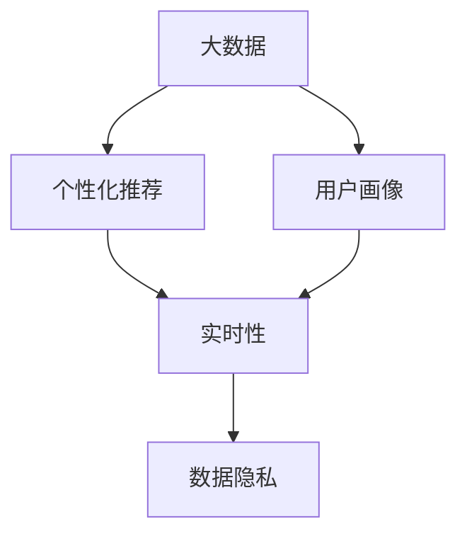

                 

## 1. 背景介绍

在现代商业环境中，信息差（Information Gap）是一个不容忽视的关键因素。信息差，即在营销和服务过程中，商家与客户之间存在的知识不对称现象，直接影响了消费者对商品或服务的认知和满意度。为了弥合这一差距，商家需要深入了解客户需求，提供更贴近个性化的服务，从而提升整体的用户体验和商业价值。

大数据技术的崛起为信息差的个性化服务提供了新的可能性。通过分析海量客户数据，商家可以洞察消费者行为模式、偏好变化和潜在需求，进而实施精准化的服务策略。本文将从核心概念、算法原理、具体操作步骤等多个角度，全面探讨大数据如何助力商业服务个性化，并详细介绍其实现方法和优化技巧。

## 2. 核心概念与联系

### 2.1 核心概念概述

为了更好地理解如何通过大数据提升服务个性化，我们需要首先明确几个关键概念：

- **大数据**：指海量的数据集，包含结构化和非结构化数据，为商业决策提供了坚实的基础。
- **用户画像**：基于用户行为数据和属性信息构建的虚拟人物，用于精准定位用户需求。
- **个性化推荐**：根据用户行为和偏好，提供定制化产品和服务，提升用户满意度和转化率。
- **实时性**：在用户行为发生时，能即时响应并调整推荐内容，实现服务的主动性和即时性。
- **数据隐私**：在数据收集和分析过程中，确保用户信息的合法合规，保护用户隐私。

这些概念通过以下Mermaid流程图展示其联系：



### 2.2 核心概念原理和架构

在构建信息差个性化服务体系时，大数据、用户画像、个性化推荐、实时性和数据隐私这几个概念相互交织，共同构建了从数据采集到服务输出的完整框架。

- **大数据采集与处理**：通过多渠道收集用户数据，包括浏览记录、购买历史、社交媒体互动等，并进行清洗、去重、特征提取等预处理工作，为后续分析奠定基础。
- **用户画像构建**：根据数据特征，对用户进行聚类、标签化，形成多个细粒度的用户画像。用户画像包括基本信息、行为特征、偏好等，为个性化推荐提供依据。
- **个性化推荐系统**：基于用户画像和行为数据，使用协同过滤、内容推荐、深度学习等算法，生成个性化推荐列表。
- **实时性实现**：利用流式处理技术，实时捕捉用户行为，并即时更新推荐结果，确保服务的时效性和相关性。
- **数据隐私保护**：通过差分隐私、联邦学习、匿名化等技术，保护用户数据不被滥用，遵守数据隐私法规。

## 3. 核心算法原理 & 具体操作步骤

### 3.1 算法原理概述

商业服务个性化的核心在于通过分析用户行为和偏好，预测其潜在需求，并实时响应。这一过程通常涉及以下算法原理：

1. **协同过滤（Collaborative Filtering）**：利用用户历史行为数据，寻找类似用户和物品，为用户推荐其可能感兴趣的商品。
2. **内容推荐（Content-Based Filtering）**：分析用户行为数据，提取出用户兴趣的特征，结合物品特征，推荐相关商品。
3. **深度学习推荐**：使用神经网络模型，对用户数据进行更深层次的特征学习和模式提取，提升推荐准确性。
4. **实时推荐引擎**：利用流式计算技术，实时捕捉用户行为，并动态调整推荐内容。

### 3.2 算法步骤详解

基于以上原理，商业服务个性化的大数据技术实施步骤如下：

1. **数据收集**：通过网站、APP、社交媒体等渠道，收集用户行为数据、属性信息和互动记录。
2. **数据清洗与特征提取**：对数据进行去重、去噪、缺失值填补等预处理，并提取关键特征，如浏览时长、购买频率、搜索关键词等。
3. **用户画像构建**：使用K-means、层次聚类等方法，将用户行为数据聚类成多个用户画像。每个画像包含基本信息、行为特征、偏好等。
4. **个性化推荐算法实现**：根据用户画像和行为数据，选择合适的推荐算法，如协同过滤、内容推荐、深度学习等。
5. **实时推荐系统开发**：利用流式处理框架，如Apache Kafka、Apache Flink等，实时捕捉用户行为，动态生成推荐列表。
6. **推荐结果展示与优化**：将推荐结果展示在用户界面，并根据用户反馈和点击行为，持续优化推荐算法和展示效果。

### 3.3 算法优缺点

大数据驱动的个性化推荐系统具有以下优点：

- **高效性**：通过批量计算和并行处理，提升推荐效率。
- **个性化精准**：利用用户画像和行为数据，实现高度个性化的推荐。
- **实时响应**：实现即时推荐，提升用户体验。

然而，该系统也存在一些缺点：

- **数据隐私问题**：在数据收集和处理过程中，可能涉及用户隐私泄露。
- **冷启动问题**：新用户或无历史行为数据的用户，难以进行有效推荐。
- **推荐多样性不足**：过度依赖历史行为数据，可能限制推荐内容的丰富性。
- **推荐偏见**：算法可能引入数据中的偏见，导致不公平的推荐结果。

### 3.4 算法应用领域

个性化推荐系统已经在电商、视频、音乐、新闻等多个领域得到了广泛应用，并取得了显著的商业效果。例如，亚马逊、Netflix等平台利用个性化推荐系统，大幅提升了用户的购物和观看体验。

此外，基于大数据的商业服务个性化还可以应用于以下领域：

- **金融服务**：通过分析用户交易数据，推荐个性化的金融产品和服务，提升客户满意度和忠诚度。
- **健康医疗**：根据用户健康数据和行为模式，推荐个性化的健康建议和医疗方案，改善用户健康管理。
- **旅游服务**：通过分析用户旅游记录和偏好，推荐个性化的旅游目的地和行程安排，提升用户旅行体验。
- **教育服务**：根据用户学习行为和成绩数据，推荐个性化的学习资源和课程，提升学习效果。

## 4. 数学模型和公式 & 详细讲解 & 举例说明

### 4.1 数学模型构建

在个性化推荐系统中，常用的数学模型包括协同过滤、内容推荐和深度学习推荐。

- **协同过滤**：基于用户-物品评分矩阵，推荐相似用户喜欢的物品。公式如下：
$$
\hat{R}_{ui} = \sum_{j=1}^{n}r_{uj}\times a_{ij}
$$
其中 $r_{uj}$ 为用户 $u$ 对物品 $j$ 的评分，$a_{ij}$ 为物品 $i$ 对用户 $j$ 的相似度权重。

- **内容推荐**：根据用户行为数据，提取用户兴趣特征，生成推荐列表。公式如下：
$$
\hat{R}_{ui} = \sum_{j=1}^{n}c_{uij} \times c_{iuj}
$$
其中 $c_{uij}$ 为用户 $u$ 对物品 $i$ 的特征向量表示，$c_{iuj}$ 为物品 $i$ 的特征向量与用户 $u$ 的兴趣特征的相似度。

- **深度学习推荐**：使用神经网络模型对用户行为数据进行特征学习，生成推荐列表。公式如下：
$$
\hat{R}_{ui} = \sigma\left(\sum_{j=1}^{n}w_{uj} \times x_{i,j}\right)
$$
其中 $w_{uj}$ 为神经网络中的权重，$x_{i,j}$ 为物品 $i$ 的特征向量表示。

### 4.2 公式推导过程

以协同过滤算法为例，其核心在于计算用户 $u$ 对物品 $i$ 的预测评分 $\hat{R}_{ui}$。首先，将用户-物品评分矩阵 $R$ 分解为用户特征矩阵 $U$ 和物品特征矩阵 $V$：
$$
R = UV^T
$$
然后，通过计算用户 $u$ 对物品 $j$ 的评分 $r_{uj}$，以及物品 $i$ 对用户 $j$ 的相似度权重 $a_{ij}$，得到物品 $i$ 对用户 $u$ 的预测评分：
$$
\hat{R}_{ui} = \sum_{j=1}^{n}r_{uj}\times a_{ij}
$$

### 4.3 案例分析与讲解

以Netflix个性化推荐系统为例，其使用了基于协同过滤和内容推荐的混合模型。Netflix首先对用户进行聚类，得到多个用户画像。然后，基于每个画像的用户行为数据和评分，计算物品对不同画像的相似度，生成推荐列表。最后，通过实时捕捉用户行为，动态调整推荐结果。

## 5. 项目实践：代码实例和详细解释说明

### 5.1 开发环境搭建

为了进行个性化推荐系统的开发，需要搭建相应的开发环境。以下是使用Python进行PyTorch开发的环境配置流程：

1. 安装Anaconda：从官网下载并安装Anaconda，用于创建独立的Python环境。

2. 创建并激活虚拟环境：
```bash
conda create -n pytorch-env python=3.8 
conda activate pytorch-env
```

3. 安装PyTorch：根据CUDA版本，从官网获取对应的安装命令。例如：
```bash
conda install pytorch torchvision torchaudio cudatoolkit=11.1 -c pytorch -c conda-forge
```

4. 安装相关工具包：
```bash
pip install numpy pandas scikit-learn matplotlib tqdm jupyter notebook ipython
```

完成上述步骤后，即可在`pytorch-env`环境中开始项目实践。

### 5.2 源代码详细实现

下面以内容推荐系统为例，给出使用PyTorch进行内容推荐模型训练的代码实现。

```python
import torch
import torch.nn as nn
from torch.utils.data import DataLoader
from torch.optim import Adam
from sklearn.metrics import mean_squared_error

class UserItemNet(nn.Module):
    def __init__(self, n_users, n_items, n_features, embed_dim=10, hidden_dim=50):
        super(UserItemNet, self).__init__()
        self.user_embed = nn.Embedding(n_users, embed_dim)
        self.item_embed = nn.Embedding(n_items, embed_dim)
        self.linear = nn.Linear(2*embed_dim, hidden_dim)
        self.prediction = nn.Linear(hidden_dim, 1)
        
    def forward(self, user_id, item_id):
        user_emb = self.user_embed(user_id)
        item_emb = self.item_embed(item_id)
        combined = torch.cat([user_emb, item_emb], dim=1)
        hidden = torch.relu(self.linear(combined))
        prediction = self.prediction(hidden)
        return prediction
        
def train_model(model, train_loader, val_loader, n_epochs, batch_size, learning_rate):
    optimizer = Adam(model.parameters(), lr=learning_rate)
    loss_fn = nn.MSELoss()
    
    for epoch in range(n_epochs):
        model.train()
        train_loss = 0
        for user_id, item_id, target in train_loader:
            optimizer.zero_grad()
            pred = model(user_id, item_id)
            loss = loss_fn(pred, target)
            loss.backward()
            optimizer.step()
            train_loss += loss.item()
        train_loss /= len(train_loader.dataset)
        
        model.eval()
        val_loss = 0
        for user_id, item_id, target in val_loader:
            pred = model(user_id, item_id)
            loss = loss_fn(pred, target)
            val_loss += loss.item()
        val_loss /= len(val_loader.dataset)
        
        print(f"Epoch {epoch+1}, Train Loss: {train_loss:.4f}, Val Loss: {val_loss:.4f}")
        
train_loader = DataLoader(train_dataset, batch_size=batch_size, shuffle=True)
val_loader = DataLoader(val_dataset, batch_size=batch_size, shuffle=False)
n_epochs = 100
batch_size = 64
learning_rate = 1e-4

model = UserItemNet(n_users, n_items, n_features)
model.train()
train_model(model, train_loader, val_loader, n_epochs, batch_size, learning_rate)
```

在这个代码示例中，我们构建了一个简单的内容推荐模型，使用了用户-物品的嵌入表示和全连接神经网络。模型训练过程中，使用了均方误差损失函数和Adam优化器。通过调整模型结构和超参数，可以实现不同场景下的个性化推荐。

### 5.3 代码解读与分析

这个内容推荐模型的关键代码如下：

- **UserItemNet类**：定义了内容推荐模型，包括用户嵌入层、物品嵌入层、全连接层和输出层。
- **train_model函数**：实现了模型的训练流程，包括前向传播、损失计算、反向传播和参数更新等步骤。
- **DataLoader**：用于对训练和验证数据集进行批次化处理，方便模型训练和评估。

通过这段代码，我们可以看到，内容推荐模型通过学习用户-物品的特征表示，生成推荐结果，并使用均方误差损失函数进行优化。在训练过程中，模型会自动调整参数，最小化预测误差，提升推荐精度。

## 6. 实际应用场景

### 6.1 电商推荐

电商推荐系统通过分析用户浏览、购买历史和评价，为每个用户生成个性化的商品推荐。推荐列表不仅基于用户历史行为，还考虑到当前市场趋势和热门商品，提升推荐的相关性和多样性。

以亚马逊为例，其推荐系统通过对用户行为数据的分析，为用户推荐相关商品，大大提升了用户的购物体验和转化率。

### 6.2 视频推荐

视频平台如Netflix、YouTube等，通过分析用户观看历史、评分和互动数据，生成个性化的视频推荐列表。推荐系统不仅考虑用户的观看偏好，还加入流行度、热门影片等因素，提高推荐的覆盖面和多样性。

Netflix的推荐系统使用协同过滤和内容推荐相结合的方式，为用户推荐电影、电视剧等视频内容，帮助用户发现新内容，提升平台的用户黏性和留存率。

### 6.3 音乐推荐

音乐平台如Spotify、网易云音乐等，通过分析用户的听歌历史、评分和互动数据，生成个性化的音乐推荐。推荐系统不仅考虑用户的听歌偏好，还加入流行音乐、热门单曲等因素，提高推荐的覆盖面和多样性。

Spotify的推荐系统使用协同过滤和深度学习相结合的方式，为用户推荐歌曲、专辑等音乐内容，帮助用户发现新音乐，提升平台的留存率和用户满意度。

## 7. 工具和资源推荐

### 7.1 学习资源推荐

为了帮助开发者系统掌握个性化推荐技术的理论基础和实践技巧，这里推荐一些优质的学习资源：

1. 《推荐系统实践》系列博文：由推荐系统领域专家撰写，深入浅出地介绍了推荐系统原理、算法、部署等前沿话题。

2. CS463《推荐系统》课程：斯坦福大学开设的推荐系统课程，有Lecture视频和配套作业，带你入门推荐系统领域的基本概念和经典模型。

3. 《深度学习推荐系统：理论、算法与应用》书籍：深度学习推荐系统的经典教材，全面介绍了推荐系统的发展历程和实现方法，适合进阶学习。

4. KDD'19推荐系统竞赛数据集：提供了多种推荐任务的竞赛数据集，包含用户行为数据和评分数据，可用于实践推荐算法。

5. PyTorch Lightning：轻量级深度学习框架，支持快速构建和训练推荐模型，适合初学者快速上手。

通过对这些资源的学习实践，相信你一定能够快速掌握个性化推荐技术的精髓，并用于解决实际的商业问题。

### 7.2 开发工具推荐

高效的开发离不开优秀的工具支持。以下是几款用于个性化推荐系统开发的常用工具：

1. Apache Spark：分布式计算框架，支持大规模数据处理和机器学习算法，适合构建推荐系统的后端计算引擎。

2. Apache Kafka：分布式流处理框架，支持实时数据采集和流式计算，适合实现推荐系统的实时推荐引擎。

3. Hadoop/Spark SQL：分布式数据库，支持大规模数据存储和查询，适合存储和处理推荐系统的大数据。

4. Scikit-learn：Python机器学习库，支持多种推荐算法，如协同过滤、内容推荐、深度学习等，适合快速实现推荐模型。

5. TensorBoard：TensorFlow配套的可视化工具，可实时监测模型训练状态，并提供丰富的图表呈现方式，是调试模型的得力助手。

6. Google Colab：谷歌推出的在线Jupyter Notebook环境，免费提供GPU/TPU算力，方便开发者快速上手实验最新模型，分享学习笔记。

合理利用这些工具，可以显著提升个性化推荐系统的开发效率，加快创新迭代的步伐。

### 7.3 相关论文推荐

个性化推荐技术的发展源于学界的持续研究。以下是几篇奠基性的相关论文，推荐阅读：

1. Implicit Collaborative Filtering: Theory and Algorithms：提出基于隐式反馈的协同过滤算法，解决了显式反馈数据稀疏性问题。

2. Matrix Factorization Techniques for Recommender Systems：介绍矩阵分解算法，用于推荐系统中的低秩分解，提升推荐精度。

3. Deep Collaborative Filtering with Feature Aggregation Network：提出深度协同过滤模型，利用神经网络进行特征学习和模式提取，提升了推荐效果。

4. Factorization Machines with Side Information for Recommender Systems：提出加权因子机模型，将用户特征和物品特征融入协同过滤模型，提升了推荐效果。

5. Attention-Based Recommender Systems：提出基于注意力机制的推荐模型，增强了推荐系统对用户行为特征的捕捉能力。

这些论文代表了个性化推荐技术的发展脉络。通过学习这些前沿成果，可以帮助研究者把握学科前进方向，激发更多的创新灵感。

## 8. 总结：未来发展趋势与挑战

### 8.1 总结

本文对个性化推荐系统进行了全面系统的介绍。首先阐述了信息差个性化服务的重要性和大数据技术的应用价值，明确了个性化推荐系统的核心概念和算法原理。其次，通过实际案例和代码实例，详细讲解了个性化推荐系统的实现方法和优化技巧。

通过本文的系统梳理，可以看到，个性化推荐系统利用大数据技术，通过用户画像和行为分析，实现高度个性化的推荐，显著提升了用户满意度和服务效率。未来，伴随推荐算法的不断进步和推荐系统的广泛应用，个性化推荐技术必将在更多领域发挥重要作用。

### 8.2 未来发展趋势

展望未来，个性化推荐技术将呈现以下几个发展趋势：

1. **多模态推荐**：结合用户的多模态数据（如文本、图像、语音等），提升推荐的丰富性和多样性。

2. **实时推荐系统**：利用流式处理技术，实现实时捕捉用户行为，动态调整推荐内容，提升推荐的时效性和相关性。

3. **深度学习推荐**：通过深度学习模型对用户数据进行更深层次的特征学习和模式提取，提升推荐准确性。

4. **联邦学习**：利用联邦学习技术，在不共享用户数据的情况下，实现跨平台个性化推荐，保护用户隐私。

5. **冷启动问题解决**：通过多臂赌博、深度学习等方法，解决新用户和老用户推荐效果差异的问题。

6. **推荐系统的可解释性**：增强推荐算法的可解释性，帮助用户理解推荐结果的生成过程。

以上趋势凸显了个性化推荐技术的广阔前景。这些方向的探索发展，必将进一步提升个性化推荐系统的性能和应用范围，为构建更加智能的推荐系统铺平道路。

### 8.3 面临的挑战

尽管个性化推荐技术已经取得了显著的成果，但在迈向更加智能化、普适化应用的过程中，仍面临诸多挑战：

1. **数据隐私**：在数据收集和处理过程中，可能涉及用户隐私泄露，需要采取差分隐私、联邦学习等技术加以保护。

2. **冷启动问题**：对于新用户或无历史行为数据的用户，难以进行有效推荐，需要多臂赌博、深度学习等方法解决。

3. **推荐多样性不足**：过度依赖历史行为数据，可能限制推荐内容的丰富性，需要引入多样性约束和推荐机制优化。

4. **推荐公平性**：算法可能引入数据中的偏见，导致不公平的推荐结果，需要引入公平性评估指标和算法优化。

5. **推荐系统可解释性**：推荐算法的可解释性较差，难以解释推荐结果的生成过程，需要引入可解释性技术，提升推荐系统的透明度。

6. **推荐系统鲁棒性**：在对抗样本、攻击等因素下，推荐系统的鲁棒性不足，需要引入鲁棒性测试和优化方法。

这些挑战需要通过技术创新和工程实践，不断改进和优化，才能进一步提升个性化推荐系统的性能和效果。

### 8.4 研究展望

为了解决以上挑战，未来的研究需要在以下几个方面寻求新的突破：

1. **多模态推荐系统**：结合用户的多模态数据，提升推荐的丰富性和多样性。

2. **实时推荐引擎**：利用流式处理技术，实现实时捕捉用户行为，动态调整推荐内容。

3. **深度学习推荐模型**：利用深度学习模型对用户数据进行更深层次的特征学习和模式提取，提升推荐准确性。

4. **联邦学习推荐**：利用联邦学习技术，在不共享用户数据的情况下，实现跨平台个性化推荐。

5. **冷启动问题解决**：通过多臂赌博、深度学习等方法，解决新用户和老用户推荐效果差异的问题。

6. **推荐系统的可解释性**：增强推荐算法的可解释性，帮助用户理解推荐结果的生成过程。

7. **推荐系统的鲁棒性**：引入鲁棒性测试和优化方法，提升推荐系统的鲁棒性。

这些研究方向的探索，必将引领个性化推荐技术迈向更高的台阶，为构建更加智能的推荐系统提供新的技术支持。只有勇于创新、敢于突破，才能不断拓展个性化推荐技术的边界，让推荐系统更好地服务于商业和社会。

## 9. 附录：常见问题与解答

**Q1: 个性化推荐系统如何衡量推荐效果？**

A: 推荐效果的衡量通常使用以下指标：

- **准确率（Precision）**：推荐列表中相关物品的比例。
- **召回率（Recall）**：相关物品在推荐列表中出现的比例。
- **F1分数（F1 Score）**：准确率和召回率的调和平均，综合衡量推荐效果。
- **AUC曲线（Area Under Curve）**：通过ROC曲线评估推荐列表的质量，AUC值越高，推荐效果越好。
- **DCG（Discounted Cumulative Gain）**：考虑物品的排序和点击率，综合衡量推荐列表的价值。
- **NDCG（Normalized Discounted Cumulative Gain）**：DCG除以理想列表的DCG，综合衡量推荐列表的质量。

以上指标通常用于离线评估和在线A/B测试中，帮助优化推荐算法和模型。

**Q2: 个性化推荐系统如何处理新用户和老用户推荐效果差异？**

A: 新用户和老用户推荐效果差异的问题可以通过以下方法解决：

- **多臂赌博算法（Multi-Armed Bandit）**：通过A/B测试，选择最有可能被用户喜欢的物品进行推荐。
- **深度学习推荐模型**：利用用户行为数据和物品特征，通过深度学习模型进行预测，提升新用户的推荐效果。
- **迁移学习**：利用老用户的推荐效果，对新用户进行迁移学习，提升新用户的推荐效果。

这些方法结合使用，可以有效解决冷启动问题，提升个性化推荐系统的性能。

**Q3: 个性化推荐系统如何保护用户隐私？**

A: 保护用户隐私是推荐系统的重要挑战之一，以下是几种常见的隐私保护技术：

- **差分隐私（Differential Privacy）**：通过对数据进行噪声扰动，保护用户隐私。
- **联邦学习（Federated Learning）**：在分布式环境中，不共享用户数据的情况下，实现跨平台个性化推荐。
- **匿名化（Anonymization）**：通过对用户数据进行去标识化处理，保护用户隐私。

通过这些技术的应用，可以在保护用户隐私的同时，提升个性化推荐系统的性能。

**Q4: 个性化推荐系统如何优化推荐算法和模型？**

A: 推荐算法的优化可以通过以下方法实现：

- **特征工程**：提取和构造更多有意义的特征，提升推荐精度。
- **模型选择**：选择合适的推荐算法和模型，如协同过滤、内容推荐、深度学习等。
- **超参数调优**：通过网格搜索、贝叶斯优化等方法，优化模型的超参数，提升推荐效果。
- **集成学习**：结合多个推荐模型，提升推荐的准确性和鲁棒性。

通过不断优化推荐算法和模型，可以显著提升个性化推荐系统的性能和用户体验。

**Q5: 个性化推荐系统如何处理推荐多样性不足的问题？**

A: 推荐多样性不足的问题可以通过以下方法解决：

- **多样化推荐机制**：通过多样性约束和推荐机制优化，提升推荐内容的丰富性。
- **推荐算法改进**：改进协同过滤、内容推荐等算法，引入多样化因素。
- **多维推荐模型**：利用多维推荐模型，提升推荐的多样性和相关性。

这些方法结合使用，可以有效提升推荐系统的多样性，满足用户的多样化需求。

通过本文的系统梳理，可以看到，个性化推荐系统利用大数据技术，通过用户画像和行为分析，实现高度个性化的推荐，显著提升了用户满意度和服务效率。未来，伴随推荐算法的不断进步和推荐系统的广泛应用，个性化推荐技术必将在更多领域发挥重要作用。相信随着技术的日益成熟，个性化推荐系统必将为商业和社会带来更多的创新和价值。

