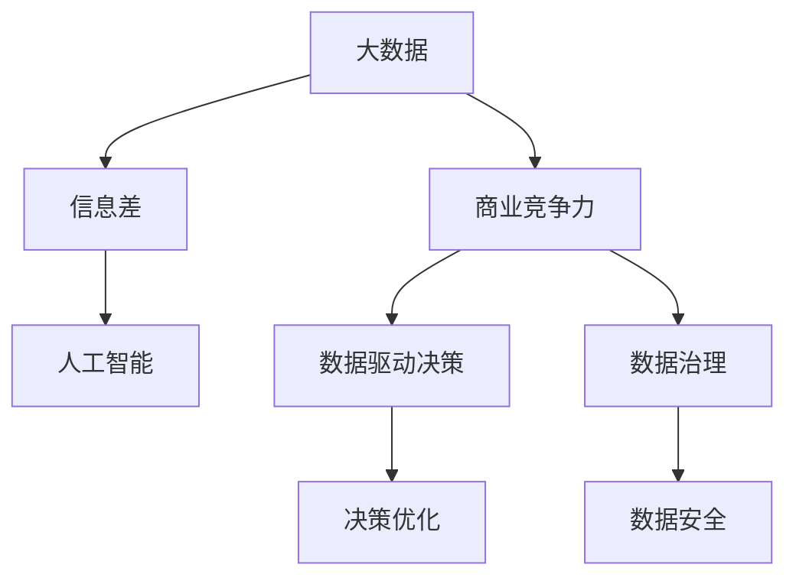

                 

# 信息差的商业竞争优势之源：大数据驱动的竞争力提升

> 关键词：大数据,信息差,商业竞争,人工智能,数据驱动

## 1. 背景介绍

在当今信息爆炸的时代，数据已成为企业决策的重要依据，也是商业竞争的重要资源。信息差（Information Gap），即信息获取、处理和应用中的不对等现象，不仅影响了企业的决策质量，也直接关乎其市场竞争地位。本文章将从数据驱动的视角出发，探讨信息差如何在商业竞争中形成并利用这一信息差，为企业提供竞争优势。

## 2. 核心概念与联系

### 2.1 核心概念概述

为更好地理解大数据如何驱动信息差形成并提升商业竞争力，本节将介绍几个密切相关的核心概念：

- **大数据**：通常指体量庞大、多样、快速生成和可处理的数据集，涵盖了结构化、半结构化和非结构化数据。

- **信息差**：指企业在信息获取、处理和应用中的不对等现象，包括信息不对称、信息孤岛、信息过载等问题。

- **商业竞争力**：企业通过产品、服务、管理等多方面创新和优化，在市场中获取相对竞争优势的能力。

- **人工智能**：通过模拟人类智能过程，实现对数据的感知、理解、学习、推理和决策的技术。

- **数据驱动决策**：利用数据资源进行商业分析和决策，提升决策质量和效率。

- **数据治理**：通过对数据质量、数据隐私、数据安全和数据流通等方面的管理，保障数据资产的价值。

这些概念之间的逻辑关系可以通过以下Mermaid流程图来展示：



这个流程图展示了大数据、信息差、商业竞争力、人工智能、数据驱动决策和数据治理之间的相互关系：

1. 大数据为信息差形成提供了数据基础。
2. 信息差促进企业利用大数据进行差异化竞争。
3. 人工智能在数据处理和应用中起到核心作用。
4. 数据驱动决策和数据治理保障了大数据的价值和合规使用。
5. 数据驱动的决策优化提升企业的商业竞争力。

## 3. 核心算法原理 & 具体操作步骤

### 3.1 算法原理概述

在大数据驱动下，企业通过获取、处理和应用信息差，能够在竞争中获取相对优势。信息差驱动商业竞争力的提升，主要体现在以下几个方面：

- **数据获取**：企业通过获取更多、更及时、更准确的数据，弥补信息差，提升决策质量。
- **数据处理**：利用大数据处理技术，挖掘数据中的模式和趋势，提升决策的准确性和可靠性。
- **数据应用**：通过智能分析和应用，将大数据转化为具体的商业策略和行动，实现竞争优势。

### 3.2 算法步骤详解

基于大数据驱动的信息差利用，以下是具体步骤：

**Step 1: 数据收集与整合**
- 从内部系统、第三方数据提供商、社交媒体等多个渠道收集相关数据。
- 对收集到的数据进行整合和清洗，消除数据孤岛，建立统一的数据视图。

**Step 2: 数据预处理与分析**
- 使用ETL（Extract, Transform, Load）工具对数据进行预处理，包括去重、转换、集成等。
- 利用统计学、机器学习、深度学习等方法进行数据分析，挖掘数据的潜在价值。

**Step 3: 数据应用与决策优化**
- 将分析结果转化为具体的商业策略和行动，如市场细分、产品定价、营销策略等。
- 利用人工智能技术进行实时监控和优化，动态调整决策和行动。

**Step 4: 数据安全与合规**
- 制定数据安全策略，保护数据隐私，防止数据泄露和滥用。
- 遵循相关法律法规，确保数据使用的合规性。

### 3.3 算法优缺点

大数据驱动的信息差利用方法具有以下优点：

- **决策质量提升**：大数据提供的信息丰富且全面，有助于提升决策的准确性和可靠性。
- **竞争优势**：通过差异化数据获取和处理，企业可以在市场竞争中获取优势。
- **实时响应**：大数据处理技术可以实现实时分析，使企业能够快速响应市场变化。

同时，该方法也存在一定的局限性：

- **数据质量**：大数据的质量和一致性直接影响分析结果和决策。
- **技术门槛**：大数据处理和分析需要高级技术人才，存在一定的技术门槛。
- **成本高**：大数据收集、存储和处理需要大量资源和资金投入。
- **隐私风险**：数据收集和处理过程中可能存在隐私泄露的风险。

### 3.4 算法应用领域

大数据驱动的信息差利用方法，在多个领域都有着广泛的应用，例如：

- **零售业**：通过分析消费者购买数据，精准预测需求，优化库存和定价策略。
- **金融业**：利用客户交易数据，进行风险评估和欺诈检测。
- **制造业**：通过设备数据和供应链数据，优化生产计划和物流管理。
- **医疗健康**：利用患者数据和临床数据，提升疾病诊断和治疗效果。
- **政府管理**：通过公共数据，进行城市规划和公共服务优化。

## 4. 数学模型和公式 & 详细讲解 & 举例说明

### 4.1 数学模型构建

在大数据驱动的决策优化中，常用的数学模型包括回归模型、分类模型、聚类模型等。这里以回归模型为例，构建信息差驱动的商业竞争力提升模型。

假设企业面临的市场需求为 $D$，企业可以获取的相关数据集为 $X$，包括市场特征、产品属性、客户行为等。企业希望通过数据驱动的方法，找到最优的决策参数 $θ$，使得实际需求 $D$ 与预测需求 $D_{\hat{y}}$ 的误差最小化。回归模型的目标为：

$$
\min_{\theta} \frac{1}{N} \sum_{i=1}^N (D_i - D_{\hat{y}}(x_i, \theta))^2
$$

其中，$N$ 为样本数量，$x_i$ 为第 $i$ 个样本的特征向量，$D_{\hat{y}}(x_i, \theta)$ 为回归模型的预测结果。

### 4.2 公式推导过程

回归模型的最小二乘解为：

$$
\theta = (X^TX)^{-1}X^TY
$$

其中，$Y$ 为样本的实际需求向量。将上述解代入回归模型，可以得到：

$$
D_{\hat{y}}(x_i, \theta) = X_i^TXθ
$$

将 $\theta$ 代入公式，可得：

$$
D_{\hat{y}}(x_i, \theta) = (X^TX)^{-1}X^TY
$$

通过最小二乘解，企业可以找到最优的决策参数，使得预测需求与实际需求尽量一致，提升决策的准确性和可靠性。

### 4.3 案例分析与讲解

假设某电商平台通过大数据分析，发现不同用户群体对产品的需求存在明显差异。利用回归模型，电商平台可以将用户特征数据（如年龄、性别、消费历史等）作为输入，预测用户对产品的需求量。通过不断优化模型参数，电商平台可以更准确地进行库存管理和个性化推荐，从而提升销售转化率和客户满意度。

## 5. 项目实践：代码实例和详细解释说明

### 5.1 开发环境搭建

在进行数据驱动的决策优化实践前，我们需要准备好开发环境。以下是使用Python进行Pandas、Scikit-Learn、TensorFlow等库的开发环境配置流程：

1. 安装Anaconda：从官网下载并安装Anaconda，用于创建独立的Python环境。

2. 创建并激活虚拟环境：
```bash
conda create -n myenv python=3.7 
conda activate myenv
```

3. 安装依赖库：
```bash
conda install pandas scikit-learn tensorflow
```

4. 安装Jupyter Notebook：
```bash
pip install jupyter notebook
```

完成上述步骤后，即可在`myenv`环境中开始项目实践。

### 5.2 源代码详细实现

以下是使用Pandas和Scikit-Learn库进行回归模型构建和优化的代码实现：

```python
import pandas as pd
from sklearn.linear_model import LinearRegression
from sklearn.metrics import mean_squared_error
import numpy as np

# 加载数据集
data = pd.read_csv('sales_data.csv')

# 特征工程
X = data[['age', 'gender', 'consumption_history']]
y = data['sales']

# 构建线性回归模型
model = LinearRegression()
model.fit(X, y)

# 预测新数据
new_data = pd.DataFrame({'age': [30], 'gender': ['male'], 'consumption_history': [10000]})
predictions = model.predict(new_data)

# 评估模型性能
mse = mean_squared_error(y, predictions)
print(f"Mean Squared Error: {mse}")
```

### 5.3 代码解读与分析

让我们再详细解读一下关键代码的实现细节：

**数据加载与特征工程**：
- 使用Pandas库加载数据集，将数据转化为Pandas DataFrame格式。
- 选择与销售相关的特征数据，包括用户年龄、性别、消费历史等。
- 构建目标变量 $y$，即实际需求。

**模型构建与训练**：
- 使用Scikit-Learn库中的LinearRegression模型构建线性回归模型。
- 通过模型.fit方法，对数据集进行训练，得到最优的回归系数 $\theta$。

**预测与评估**：
- 使用模型.predict方法对新数据进行预测，得到销售预测值。
- 利用均方误差（Mean Squared Error, MSE）评估模型性能，MSE越小表示模型预测结果越准确。

在实际项目中，还需要对模型进行更详细的调参和优化，选择合适的特征、调整模型复杂度、引入正则化等，以确保模型的泛化性能和稳定性。

## 6. 实际应用场景

### 6.1 智能零售

在智能零售领域，大数据驱动的信息差利用可以显著提升企业的竞争力。通过分析消费者的购物习惯、偏好、支付行为等数据，企业可以精准预测市场趋势，优化库存管理和商品布局，提升用户体验和销售转化率。

例如，某连锁超市通过分析历年销售数据和消费者行为数据，发现周末和节假日的销售量显著高于平日。基于这一信息差，超市调整了促销活动和员工排班策略，在销售高峰期增加人员和促销力度，提高了销售额和客户满意度。

### 6.2 金融风险管理

金融行业是数据驱动决策的重要领域。利用大数据和人工智能技术，银行和金融机构可以更有效地识别和管理风险。

例如，某银行利用客户交易数据和外部信用数据，构建了信用评分模型。通过分析客户的交易行为、还款记录等，银行可以更准确地评估客户的信用风险，制定个性化的信贷策略。同时，利用机器学习算法，银行还可以实时监测交易异常，提前预警和防范欺诈行为。

### 6.3 制造业生产优化

在制造业领域，大数据驱动的信息差利用可以优化生产流程，提高生产效率和产品质量。

例如，某汽车制造商通过分析生产设备的数据，实时监测设备的运行状态和维护需求。通过预测性维护，制造商可以在设备故障前进行维修，避免了意外停机和生产延误。同时，利用机器学习算法，制造商还可以优化生产计划和物流管理，提高生产效率和资源利用率。

### 6.4 未来应用展望

随着大数据和人工智能技术的不断进步，信息差驱动的决策优化将在更多领域得到应用，为企业的数字化转型带来新的突破。

在智慧医疗领域，大数据驱动的信息差利用可以提升疾病诊断和治疗效果。通过分析患者的医疗记录和健康数据，医疗机构可以更准确地制定治疗方案，提升医疗服务质量和患者满意度。

在智能交通领域，大数据驱动的信息差利用可以优化交通流量和公共交通管理。通过分析交通数据和用户出行数据，政府和企业可以优化交通信号灯控制、公交线路和站点设置，提升交通效率和用户体验。

在智能制造领域，大数据驱动的信息差利用可以优化供应链管理和生产调度。通过分析供应链数据和市场需求，企业可以更准确地预测市场需求，优化库存管理和生产调度，提升供应链效率和生产灵活性。

## 7. 工具和资源推荐

### 7.1 学习资源推荐

为了帮助开发者系统掌握大数据驱动的决策优化理论基础和实践技巧，这里推荐一些优质的学习资源：

1. 《Python数据科学手册》：由知名数据科学家撰写，详细介绍了Python在数据处理、分析和可视化中的应用。

2. 《数据科学导论》：涵盖了数据采集、数据清洗、特征工程、模型训练等多个环节，适合初学者和进阶者。

3. 《机器学习实战》：通过丰富的实例，介绍了机器学习算法的基本原理和实现方法。

4. Kaggle平台：提供海量数据集和竞赛项目，是实践数据科学和机器学习的绝佳平台。

5. Google Cloud AI 平台：提供强大的云计算资源，支持多种机器学习算法和工具。

通过对这些资源的学习实践，相信你一定能够快速掌握大数据驱动的决策优化方法，并用于解决实际的商业问题。

### 7.2 开发工具推荐

高效的开发离不开优秀的工具支持。以下是几款用于大数据驱动决策优化开发的常用工具：

1. Python语言：Python语言简洁高效，广泛应用于数据科学和机器学习领域，是数据分析和建模的首选语言。

2. Pandas库：Pandas提供了高效的数据处理和分析工具，支持多种数据格式和操作。

3. Scikit-Learn库：Scikit-Learn是Python中最常用的机器学习库，提供了多种回归、分类、聚类等算法。

4. TensorFlow：TensorFlow是由Google开发的深度学习框架，支持大规模分布式训练和模型部署。

5. Jupyter Notebook：Jupyter Notebook是一个交互式的数据科学环境，支持Python代码和数据分析的混合使用。

6. Google Cloud AI平台：Google Cloud AI平台提供了强大的云计算资源，支持多种机器学习算法和工具，是进行大数据分析和大模型训练的理想平台。

合理利用这些工具，可以显著提升大数据驱动的决策优化任务的开发效率，加快创新迭代的步伐。

### 7.3 相关论文推荐

大数据驱动的决策优化技术的发展得益于学界的持续研究。以下是几篇奠基性的相关论文，推荐阅读：

1. 《Data Mining: Concepts and Techniques》：Khardon和Ross编写的数据挖掘经典教材，介绍了多种数据挖掘算法和应用。

2. 《Data-Driven Marketing: How to Make the Most of Your Data》：John Cowles编写的数据驱动营销经典书籍，介绍了利用大数据优化市场营销的实践方法。

3. 《Deep Learning for Intelligent Systems》：Farnoosh Eftekhari编写的深度学习应用书籍，介绍了深度学习在智能系统和决策优化中的应用。

4. 《Big Data: Principles and Best Practices of Scalable Real-Time Data Systems》：Gangadharan Sivakumar编写的大数据系统设计经典书籍，介绍了大数据系统的设计原则和实践方法。

这些论文代表了大数据驱动的决策优化技术的发展脉络。通过学习这些前沿成果，可以帮助研究者把握学科前进方向，激发更多的创新灵感。

## 8. 总结：未来发展趋势与挑战

### 8.1 总结

本文对大数据驱动的决策优化方法进行了全面系统的介绍。首先阐述了信息差在大数据驱动下的形成机制和商业竞争优势，明确了大数据在决策优化中的核心作用。其次，从原理到实践，详细讲解了大数据驱动的决策优化过程，给出了具体的代码实例和解释分析。同时，本文还探讨了大数据驱动决策优化在多个行业领域的应用前景，展示了其广泛的应用潜力。

通过本文的系统梳理，可以看到，大数据驱动的决策优化技术正在成为企业竞争力的重要来源，利用信息差构建的竞争优势不仅能够提升决策质量，还能带来显著的市场优势。未来，伴随大数据和人工智能技术的持续发展，信息差驱动的决策优化必将进入更多企业，推动企业实现数字化转型，提升市场竞争力。

### 8.2 未来发展趋势

展望未来，大数据驱动的决策优化技术将呈现以下几个发展趋势：

1. **数据智能化**：通过引入智能算法和大模型，提升数据处理和分析的自动化程度，减少人工干预，提高决策的快速性和准确性。

2. **实时响应**：利用流数据处理技术，实现数据的实时采集、分析和应用，使企业能够快速响应市场变化。

3. **多源融合**：整合多渠道、多来源的数据，形成统一的数据视图，提升决策的全面性和可靠性。

4. **数据透明**：提高数据的透明度和可解释性，使决策过程更加透明和可信。

5. **人工智能化**：利用深度学习、自然语言处理等技术，提升数据处理和分析的能力，增强决策的智能化和自动化。

6. **业务集成**：将大数据驱动的决策优化技术与企业业务系统进行集成，实现数据驱动的业务优化和创新。

这些趋势展示了大数据驱动的决策优化技术的广阔前景，为企业在未来市场竞争中提供了更多的可能性。

### 8.3 面临的挑战

尽管大数据驱动的决策优化技术已经取得了显著成果，但在实际应用中也面临诸多挑战：

1. **数据质量**：数据的质量和一致性直接影响决策结果，数据清洗和预处理的工作量较大。

2. **技术门槛**：大数据处理和分析需要高级技术人才，存在一定的技术门槛。

3. **数据隐私**：数据收集和处理过程中可能存在隐私泄露的风险，需制定严格的数据隐私保护策略。

4. **数据安全**：数据的存储和传输过程中存在安全风险，需采取多种安全措施保护数据。

5. **计算成本**：大数据处理和分析需要大量的计算资源和存储空间，成本较高。

6. **业务适配**：将大数据驱动的决策优化技术与业务系统集成，需要企业具备一定的技术实力和业务理解能力。

7. **系统复杂性**：数据驱动的决策优化系统通常较为复杂，需要持续维护和优化。

这些挑战需要企业从技术、管理和业务多个层面进行全面优化，才能充分发挥大数据驱动的决策优化技术的价值。

### 8.4 研究展望

面对大数据驱动的决策优化所面临的挑战，未来的研究需要在以下几个方面寻求新的突破：

1. **数据治理**：进一步提升数据质量、数据安全和数据隐私的管理水平，保障数据资产的价值。

2. **智能算法**：研发更高效、更智能的数据处理和分析算法，提高决策的准确性和速度。

3. **跨领域融合**：将大数据驱动的决策优化技术与其他人工智能技术进行更深入的融合，提升系统的综合性能。

4. **业务优化**：将大数据驱动的决策优化技术与业务流程和运营模式进行优化，实现业务创新和效率提升。

5. **数据驱动的商业模式创新**：探索数据驱动的新商业模式，为企业创造新的价值和竞争力。

这些研究方向的探索，必将引领大数据驱动的决策优化技术迈向更高的台阶，为构建人机协同的智能系统铺平道路。面向未来，大数据驱动的决策优化技术还需要与其他人工智能技术进行更深入的融合，多路径协同发力，共同推动企业实现数字化转型，提升市场竞争力。

## 9. 附录：常见问题与解答

**Q1：大数据驱动的决策优化是否适用于所有企业？**

A: 大数据驱动的决策优化在许多企业中都有应用潜力，但并不是所有企业都适合采用。对数据密集型、业务复杂的企业，特别是互联网公司、零售商、金融机构等，大数据驱动的决策优化更能带来显著的竞争优势。但对于一些传统行业，如农业、制造业等，可能需要结合实际业务场景进行定制化优化。

**Q2：大数据驱动的决策优化是否需要大量资金投入？**

A: 大数据驱动的决策优化通常需要一定的资金投入，包括数据采集、存储、处理和分析等环节。但随着技术的发展，开源工具和云服务平台的普及，企业可以通过较低的成本实现数据驱动的决策优化。同时，数据驱动的决策优化带来的市场收益通常远大于初期投入，长期来看具有一定的成本效益。

**Q3：如何提升大数据驱动的决策优化系统的可解释性？**

A: 提升大数据驱动的决策优化系统的可解释性是当前的重要研究方向。常见的提升方法包括：

1. 使用可解释性较高的算法，如决策树、线性回归等。
2. 引入解释模型，如LIME、SHAP等，解释模型的预测结果。
3. 通过特征工程，提取和解释关键特征，提高模型的可解释性。
4. 引入可视化工具，如DataRobot、H2O等，帮助用户理解和解释模型的决策过程。

这些方法可以帮助企业提升大数据驱动的决策优化系统的可解释性，增强决策的透明度和可信度。

**Q4：如何确保大数据驱动的决策优化系统的安全性？**

A: 确保大数据驱动的决策优化系统的安全性是企业需要重点关注的问题。以下是一些常用的安全措施：

1. 数据加密：对数据进行加密存储和传输，防止数据泄露和篡改。
2. 访问控制：通过身份认证、权限控制等手段，保护数据和系统的访问安全。
3. 数据匿名化：对数据进行匿名化处理，保护用户隐私。
4. 安全审计：定期进行安全审计，发现和修复系统漏洞。
5. 安全培训：对员工进行安全培训，提高其安全意识和技能。

通过这些措施，企业可以有效保障大数据驱动的决策优化系统的安全性，防止数据泄露和滥用。

**Q5：大数据驱动的决策优化系统是否需要持续优化？**

A: 大数据驱动的决策优化系统通常需要持续优化，以适应不断变化的市场环境和业务需求。以下是一些常见的优化策略：

1. 数据更新：定期更新数据集，保证数据的实时性和新鲜度。
2. 模型更新：根据业务需求和数据变化，定期更新和优化模型。
3. 业务适配：根据业务变化，调整系统功能和优化策略。
4. 用户反馈：收集用户反馈，不断改进系统功能和用户体验。
5. 技术升级：引入新技术和新工具，提升系统的性能和效率。

通过持续优化，大数据驱动的决策优化系统可以更好地适应业务变化，提升决策的准确性和可靠性。

---

作者：禅与计算机程序设计艺术 / Zen and the Art of Computer Programming

