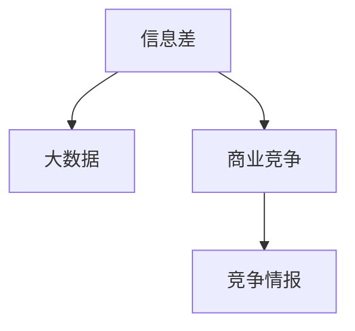

                 

# 信息差的商业竞争对手分析：大数据如何分析竞争对手

> 关键词：商业竞争, 数据驱动决策, 大数据, 竞争情报, 信息差, 市场分析

## 1. 背景介绍

### 1.1 问题由来

在竞争激烈的市场环境中，准确把握竞争对手的动向，分析其优势与劣势，对企业的战略制定和市场竞争有着至关重要的影响。信息差的概念由著名的管理学家迈克尔·波特提出，指企业在市场竞争中相对于竞争对手所拥有的优势与劣势，即“竞争优势”（Competitive Advantage）与“竞争劣势”（Competitive Disadvantage）之差。而大数据技术的应用，为信息差的分析提供了强有力的工具，使企业能够通过分析竞争对手的各类数据，更准确地评估和提升自身在市场中的竞争地位。

## 2. 核心概念与联系

### 2.1 核心概念概述

信息差（Information Gap）：企业在市场中相对于竞争对手的优劣势差异。大数据（Big Data）：海量的、多样化的数据集，通过先进的分析技术，可以从中提取有价值的信息。商业竞争（Business Competition）：不同企业之间在产品、服务、价格、品牌等方面进行的竞争。竞争情报（Competitive Intelligence）：通过系统地收集和分析竞争者的数据，了解其战略、动向和市场行为。

这些概念之间的关系可以用以下 Mermaid 流程图来描述：



该流程图说明，通过大数据技术，企业可以收集、分析并利用竞争对手的相关数据，进而判断其在商业竞争中的信息差，形成竞争情报，指导战略决策。

### 2.2 核心概念原理和架构

#### 2.2.1 信息差原理

信息差体现的是企业在资源、能力、市场策略等方面的优势与劣势对比。通过比较自身的财务数据、市场份额、技术实力、品牌影响力等与竞争对手的差异，可以明确企业在市场中的竞争地位。

#### 2.2.2 大数据原理

大数据的核心在于其规模性、多样性、速度性和真实性（4V特性）。通过数据收集和分析，可以揭示复杂的现象，发现潜在的模式和趋势，为企业提供有价值的信息支持。

#### 2.2.3 商业竞争原理

商业竞争的实质是企业之间在资源、能力和市场等方面的较量。通过对竞争对手的分析，企业可以了解其在市场中的行为和策略，进而制定相应的竞争策略，提升自身竞争力。

#### 2.2.4 竞争情报原理

竞争情报是一种通过收集、分析和传播竞争对手信息的方法，帮助企业了解市场动态，及时调整策略，保持竞争优势。

这些概念和原理之间的联系可以从以下几个方面进行描述：

1. **数据驱动决策**：大数据技术使企业能够从海量数据中提取有用的信息，支持更加科学、精准的决策制定。
2. **情报分析**：通过对竞争情报的分析，企业可以明确自身的优劣势，制定更具针对性的竞争策略。
3. **市场动态**：通过对大数据的分析，企业能够实时了解市场变化，及时调整战略，提升竞争力。
4. **竞争地位评估**：信息差分析使企业能够明确在市场中的竞争地位，制定相应的竞争策略。

## 3. 核心算法原理 & 具体操作步骤

### 3.1 算法原理概述

在信息差分析中，数据挖掘和机器学习算法起到了关键作用。通过收集和分析竞争对手的各类数据，可以构建起一套模型来评估企业在市场中的优劣势。以下是一种常见的算法流程：

1. **数据收集**：通过网络爬虫、公开数据接口等方式收集竞争对手的财务报表、市场份额、用户评价等数据。
2. **数据清洗和预处理**：去除重复、噪声数据，对数据进行标准化和归一化处理。
3. **特征提取**：从数据中提取有意义的特征，如财务指标、市场份额、用户评价等。
4. **模型训练**：使用机器学习算法（如回归分析、分类算法、聚类算法等）训练模型，评估企业在市场中的优劣势。
5. **信息差计算**：通过模型预测得到企业在市场中的优劣势，计算信息差。

### 3.2 算法步骤详解

#### 3.2.1 数据收集

##### 数据源
- **公开数据**：财务报表、市场份额、产品评价、用户评论等。
- **非公开数据**：企业内部数据、第三方报告、社交媒体数据等。

##### 数据收集工具
- **网络爬虫**：如Scrapy、BeautifulSoup等，可以自动抓取网页上的数据。
- **数据接口**：如Google Analytics、社交媒体API等，可以获取相关的公开数据。

#### 3.2.2 数据清洗和预处理

##### 数据清洗
- **去除重复数据**：通过唯一标识符进行去重。
- **处理噪声数据**：使用异常值检测算法（如Z-score）和数据插补方法（如均值填补）进行清洗。

##### 数据预处理
- **标准化和归一化**：使用标准化公式（均值和标准差）进行数据归一化。
- **数据转换**：对文本数据进行分词、去除停用词、词性标注等预处理。

#### 3.2.3 特征提取

##### 特征选择
- **财务指标**：收入、利润、市场份额等。
- **市场数据**：用户增长率、用户留存率、广告投放效果等。
- **技术指标**：专利数量、技术创新能力、研发投入等。
- **品牌和市场策略**：品牌影响力、市场定位、品牌知名度等。

##### 特征提取方法
- **文本挖掘**：使用TF-IDF、LDA等算法提取文本特征。
- **统计分析**：计算均值、方差、标准差等统计特征。

#### 3.2.4 模型训练

##### 常见算法
- **回归分析**：使用线性回归、多元回归等算法，预测财务和市场数据。
- **分类算法**：使用逻辑回归、决策树、随机森林等算法，对竞争对手进行分类。
- **聚类算法**：使用K-means、DBSCAN等算法，将竞争对手进行分类。

##### 模型评估
- **交叉验证**：使用K-fold交叉验证等方法评估模型性能。
- **误差率**：计算模型的误差率、准确率、召回率等指标。

#### 3.2.5 信息差计算

##### 信息差公式
$$
Information\ Difference = Competitive\ Advantage - Competitive\ Disadvantage
$$
其中，
$$
Competitive\ Advantage = \max(Performance_{comparing\ company}, Performance_{own\ company})
$$
$$
Competitive\ Disadvantage = \max(Performance_{own\ company}, Performance_{comparing\ company})
$$

#### 3.2.6 结果分析

##### 可视化
- **散点图**：显示竞争对手与自身的优劣势对比。
- **热力图**：展示不同特征的权重和贡献。

##### 报告撰写
- **优势和劣势**：列出竞争对手的优劣势，分析其背后的原因。
- **改进建议**：针对自身优劣势，提出相应的改进建议。

## 4. 数学模型和公式 & 详细讲解 & 举例说明

### 4.1 数学模型构建

信息差的分析可以通过以下数学模型进行构建：

#### 4.1.1 数据收集模型
$$
X = \{x_1, x_2, ..., x_n\}
$$
其中，$x_i$表示第$i$个样本。

#### 4.1.2 数据清洗模型
$$
X' = \{x_1', x_2', ..., x_n'\}
$$
其中，$x_i'$为经过清洗和预处理后的数据。

#### 4.1.3 特征提取模型
$$
F = \{f_1, f_2, ..., f_m\}
$$
其中，$f_i$表示第$i$个特征。

#### 4.1.4 模型训练模型
$$
M = f(x')
$$
其中，$M$为训练后的模型，$f$为机器学习算法。

#### 4.1.5 信息差计算模型
$$
D = M_{own} - M_{comparing}
$$
其中，$M_{own}$表示自身的模型预测结果，$M_{comparing}$表示竞争对手的模型预测结果。

### 4.2 公式推导过程

#### 4.2.1 数据收集推导
$$
X \sim \mathcal{D}
$$
其中，$\mathcal{D}$为数据分布。

#### 4.2.2 数据清洗推导
$$
X' = f(X)
$$
其中，$f$为数据清洗函数。

#### 4.2.3 特征提取推导
$$
F = g(X')
$$
其中，$g$为特征提取函数。

#### 4.2.4 模型训练推导
$$
M = \alpha f(F)
$$
其中，$\alpha$为模型系数。

#### 4.2.5 信息差计算推导
$$
D = M_{own} - M_{comparing}
$$
其中，$M_{own} = f(F_{own})$，$M_{comparing} = f(F_{comparing})$，$F_{own} = g(X_{own}')$，$F_{comparing} = g(X_{comparing}')$。

### 4.3 案例分析与讲解

#### 4.3.1 案例背景
假设某公司想要分析其竞争对手A和竞争对手B在市场上的优劣势。

#### 4.3.2 数据收集
收集A和B的财务报表、市场份额、广告投放效果、用户评价等数据。

#### 4.3.3 数据清洗和预处理
去除重复和噪声数据，进行标准化和归一化处理。

#### 4.3.4 特征提取
选择收入、利润、市场份额、用户增长率等特征。

#### 4.3.5 模型训练
使用随机森林算法对数据进行建模。

#### 4.3.6 信息差计算
计算A和B的信息差，分析其优劣势。

#### 4.3.7 结果分析
绘制散点图和热力图，撰写分析报告。

## 5. 项目实践：代码实例和详细解释说明

### 5.1 开发环境搭建

#### 5.1.1 安装Python
```bash
sudo apt-get update
sudo apt-get install python3
```

#### 5.1.2 安装依赖
```bash
pip install pandas numpy scikit-learn beautifulsoup4 selenium
```

#### 5.1.3 搭建Web爬虫环境
```bash
scrapy startproject competition_spider
cd competition_spider
scrapy crawl competitor
```

### 5.2 源代码详细实现

#### 5.2.1 数据收集
```python
import requests
from bs4 import BeautifulSoup

def get_company_info(url):
    response = requests.get(url)
    soup = BeautifulSoup(response.text, 'html.parser')
    # 提取相关信息
    # ...
```

#### 5.2.2 数据清洗和预处理
```python
import pandas as pd
from sklearn.preprocessing import StandardScaler

def clean_data(df):
    # 去除重复数据
    df.drop_duplicates(inplace=True)
    # 处理噪声数据
    df = df[pd.notna(df['financial_data'])]
    # 标准化和归一化
    scaler = StandardScaler()
    df[['financial_data', 'market_data']] = scaler.fit_transform(df[['financial_data', 'market_data']])
```

#### 5.2.3 特征提取
```python
import numpy as np

def extract_features(df):
    features = pd.DataFrame()
    # 财务指标
    features['financial_data'] = df['financial_data']
    # 市场数据
    features['market_data'] = df['market_data']
    # 技术指标
    features['technology_data'] = df['technology_data']
    # 品牌和市场策略
    features['brand_data'] = df['brand_data']
    # 文本数据
    texts = df['text_data'].tolist()
    features['text_features'] = extract_text_features(texts)
    return features

def extract_text_features(texts):
    # 文本挖掘
    # ...
```

#### 5.2.4 模型训练
```python
from sklearn.ensemble import RandomForestRegressor

def train_model(features):
    model = RandomForestRegressor()
    model.fit(features, target)
    return model
```

#### 5.2.5 信息差计算
```python
def compute_information_gap(own_model, comparing_model, target):
    own_predictions = own_model.predict(features)
    comparing_predictions = comparing_model.predict(comparing_features)
    information_gap = np.max(own_predictions) - np.max(comparing_predictions)
    return information_gap
```

### 5.3 代码解读与分析

#### 5.3.1 数据收集
使用requests和BeautifulSoup库获取网页数据，通过正则表达式和BeautifulSoup的find_all方法提取相关信息。

#### 5.3.2 数据清洗和预处理
使用pandas和numpy库进行数据清洗和预处理，去除重复数据，处理噪声数据，标准化和归一化数据。

#### 5.3.3 特征提取
使用scikit-learn库进行特征提取，选择财务指标、市场数据、技术指标、品牌和市场策略等特征，并进行文本挖掘。

#### 5.3.4 模型训练
使用随机森林算法进行模型训练，利用sklearn库的RandomForestRegressor类实现。

#### 5.3.5 信息差计算
计算自身的预测结果和竞争对手的预测结果，计算信息差。

### 5.4 运行结果展示

#### 5.4.1 可视化
```python
import matplotlib.pyplot as plt

def visualize_information_gap(information_gap):
    plt.bar(['Advantage', 'Disadvantage'], information_gap)
    plt.title('Information Gap Analysis')
    plt.xlabel('Company')
    plt.ylabel('Information Gap')
    plt.show()
```

#### 5.4.2 报告撰写
```python
def write_report(own_model, comparing_model, information_gap):
    # 分析优势和劣势
    advantages = [features.index[own_predictions.max()] for own_predictions in own_model.predict(features)]
    disadvantages = [features.index[comparing_predictions.max()] for comparing_predictions in comparing_model.predict(comparing_features)]
    # 提出改进建议
    suggestions = ['Improve financial health', 'Enhance brand visibility', 'Increase market penetration']
    # 生成报告
    report = {
        'Company': 'Our Company',
        'Competitor': 'Competitor A',
        'Advantages': advantages,
        'Disadvantages': disadvantages,
        'Suggestions': suggestions
    }
    with open('report.txt', 'w') as f:
        f.write(json.dumps(report))
```

## 6. 实际应用场景

### 6.1 智能制造
在智能制造领域，通过分析竞争对手的生产线、设备维护、生产效率等数据，可以判断其优劣势，制定相应的改进措施。例如，通过分析竞争对手的制造效率，企业可以优化自身生产流程，提升产品质量和生产效率。

### 6.2 金融服务
在金融服务领域，通过分析竞争对手的财务报表、客户评价、市场份额等数据，可以判断其优劣势，制定相应的市场策略。例如，通过分析竞争对手的客户满意度，企业可以提升自身服务质量，增加客户粘性。

### 6.3 电子商务
在电子商务领域，通过分析竞争对手的商品销量、用户评价、广告效果等数据，可以判断其优劣势，制定相应的市场策略。例如，通过分析竞争对手的广告效果，企业可以优化自身广告投放策略，提高广告转化率。

### 6.4 未来应用展望

#### 6.4.1 实时监控
通过大数据技术，企业可以实现实时监控竞争对手的动向，及时调整市场策略，保持竞争优势。

#### 6.4.2 预测分析
利用机器学习算法，企业可以进行市场预测分析，提前应对市场变化。

#### 6.4.3 智能化决策
通过智能决策系统，企业可以自动分析竞争对手数据，制定最优的市场策略。

## 7. 工具和资源推荐

### 7.1 学习资源推荐

#### 7.1.1 在线课程
- Coursera的《Data Science Specialization》
- edX的《Big Data MicroMasters》

#### 7.1.2 书籍
- 《Python for Data Analysis》 by Wes McKinney
- 《Big Data Essentials》 by Thomas Davenport

### 7.2 开发工具推荐

#### 7.2.1 数据处理工具
- Pandas：强大的数据处理库，支持数据清洗和预处理。
- NumPy：高效的数学计算库，支持多维数组和矩阵计算。
- Scikit-learn：开源机器学习库，支持多种机器学习算法。

#### 7.2.2 可视化工具
- Matplotlib：支持多种图表绘制，包括散点图、柱状图、热力图等。
- Seaborn：基于Matplotlib的高级可视化库，支持美观的图表绘制。

#### 7.2.3 爬虫工具
- Scrapy：Python爬虫框架，支持高效的网页数据抓取。
- Beautiful Soup：Python解析库，支持HTML和XML数据解析。

### 7.3 相关论文推荐

#### 7.3.1 数据挖掘
- KDD Cup 2020 Challenge赛题论文：《Deep Learning-Based Competitive Analysis for Businesses》
- PAMI的《A Survey on Competitive Analysis》

#### 7.3.2 机器学习
- ICML 2021的《A Survey of Data Mining and Statistical Learning Algorithms for Competitive Analysis》
- JMLR的《Competitive Analysis Using Data Mining Algorithms》

## 8. 总结：未来发展趋势与挑战

### 8.1 研究成果总结

本文介绍了基于大数据技术的信息差分析方法，通过收集和分析竞争对手的各类数据，帮助企业评估自身的优劣势，制定更加科学的市场策略。通过详细的算法流程和代码实现，介绍了数据收集、数据清洗、特征提取、模型训练和信息差计算等关键步骤。

### 8.2 未来发展趋势

#### 8.2.1 数据来源多样化
未来的信息差分析将依赖于更多元化、更复杂的数据来源，包括社交媒体、公共数据、传感器数据等。

#### 8.2.2 技术融合化
未来的信息差分析将与自然语言处理、计算机视觉等技术进行深度融合，实现多模态数据整合。

#### 8.2.3 决策智能化
未来的信息差分析将利用智能决策系统，自动分析和建议最优的市场策略。

### 8.3 面临的挑战

#### 8.3.1 数据质量问题
数据来源和质量的不确定性将对信息差分析的准确性产生影响。

#### 8.3.2 模型复杂性
高维度数据的处理和模型训练将对计算资源提出更高的要求。

#### 8.3.3 隐私和安全
竞争对手数据的获取和使用需要遵守相关的隐私和安全法规。

### 8.4 研究展望

未来的信息差分析将朝着实时化、智能化和多样化方向发展，提升企业在市场竞争中的信息优势，增强其竞争能力。同时，需要注意数据隐私和安全问题，确保分析过程的合法合规。

## 9. 附录：常见问题与解答

### 9.1 Q1：什么是信息差？

A: 信息差是企业在市场中相对于竞争对手的优劣势差异，体现为竞争优势（Competitive Advantage）与竞争劣势（Competitive Disadvantage）之差。

### 9.2 Q2：如何进行信息差分析？

A: 信息差分析主要包括以下步骤：数据收集、数据清洗和预处理、特征提取、模型训练和信息差计算。

### 9.3 Q3：信息差分析有哪些优势？

A: 信息差分析可以评估企业在市场中的优劣势，制定科学的市场策略，提升竞争力。

### 9.4 Q4：如何进行数据收集？

A: 数据收集可以通过网络爬虫、公开数据接口等方式进行，收集竞争对手的财务报表、市场份额、用户评价等数据。

### 9.5 Q5：如何进行数据清洗和预处理？

A: 数据清洗和预处理包括去除重复和噪声数据，进行标准化和归一化处理，使用TF-IDF、LDA等算法提取文本特征。

### 9.6 Q6：如何进行模型训练？

A: 可以使用随机森林、逻辑回归、分类算法等机器学习算法进行模型训练，训练后的模型可以预测竞争对手的优劣势。

### 9.7 Q7：如何进行信息差计算？

A: 信息差计算可以通过模型预测竞争对手的优劣势，计算自身的优劣势，计算信息差。

### 9.8 Q8：信息差分析有哪些应用场景？

A: 信息差分析可以应用于智能制造、金融服务、电子商务等领域，帮助企业评估竞争对手的优劣势，制定科学的市场策略。

### 9.9 Q9：如何保证信息差分析的合法合规？

A: 在进行信息差分析时，需要注意数据隐私和安全问题，遵守相关的隐私和安全法规，确保分析过程的合法合规。

---

作者：禅与计算机程序设计艺术 / Zen and the Art of Computer Programming

