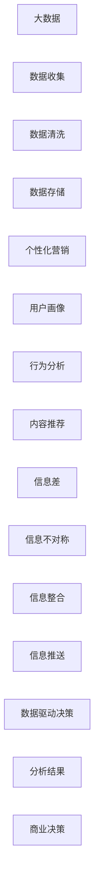

                 

## 1. 背景介绍

在今天这个信息爆炸的时代，消费者面临的信息越来越多，如何精准地将信息推送给消费者，成为了每个商业营销从业者都在思考的问题。传统的营销方式往往难以精准地触达目标消费者，导致资源的浪费和效果的不理想。而随着大数据技术的发展，通过数据驱动的方式，可以实现对消费者的深度分析，从而实现个性化的营销。本文将从商业营销和个性化营销的角度，介绍大数据如何实现信息差的商业营销个性化。

## 2. 核心概念与联系

### 2.1 核心概念概述

- **商业营销**：指企业通过各种渠道将产品或服务推广给消费者，以实现销售和品牌建设的目的。
- **个性化营销**：指根据消费者的兴趣、行为和偏好，定制化地推送信息，以达到更好的营销效果。
- **大数据**：指大规模、复杂的数据集，可以通过数据分析和机器学习等技术，发现数据中的规律和趋势，为商业决策提供支持。
- **信息差**：指消费者获取信息的方式和渠道不同，导致的信息不对称。个性化营销可以缩小这种信息差，提高消费者对企业的认知和信任。
- **数据驱动决策**：指基于数据分析的结果，做出更加精准和有效的商业决策。

### 2.2 核心概念原理和架构的 Mermaid 流程图(Mermaid 流程节点中不要有括号、逗号等特殊字符)



## 3. 核心算法原理 & 具体操作步骤

### 3.1 算法原理概述

基于大数据的个性化营销，可以通过以下步骤实现：

1. **数据收集**：收集用户的行为数据、交易数据、社交网络数据等。
2. **数据清洗和存储**：对收集到的数据进行清洗和处理，存储在数据库中。
3. **用户画像**：通过分析用户的历史行为数据，构建用户画像，了解用户的兴趣和需求。
4. **行为分析**：分析用户的行为数据，识别用户的购买习惯和偏好。
5. **内容推荐**：根据用户画像和行为分析结果，推荐合适的产品或服务。
6. **信息推送**：将推荐内容推送给用户，实现精准营销。
7. **效果评估**：评估个性化营销的效果，优化算法和模型。

### 3.2 算法步骤详解

#### 3.2.1 数据收集

数据收集是实现个性化营销的基础，需要收集尽可能多的用户数据。以下是一些常见的数据来源：

- **交易数据**：包括用户的购买记录、订单信息、支付信息等。
- **行为数据**：包括用户的浏览记录、点击率、停留时间等。
- **社交网络数据**：包括用户的社交媒体活动、评论、分享等。
- **第三方数据**：包括公共数据源、行业报告、天气数据等。

#### 3.2.2 数据清洗和存储

数据收集后，需要对数据进行清洗和处理，去除噪音和异常值，保证数据的准确性和完整性。常见的数据清洗方法包括：

- **缺失值处理**：填充或删除缺失值。
- **异常值检测**：识别和处理异常数据点。
- **数据转换**：将数据转换为适合分析的格式。
- **数据存储**：将清洗后的数据存储在数据库中，方便后续分析。

#### 3.2.3 用户画像

用户画像通过分析用户的行为数据，构建用户的兴趣和需求模型。以下是一些常见的用户画像构建方法：

- **聚类分析**：将用户按照行为特征分为不同的群体。
- **关联规则**：发现用户行为之间的关联关系。
- **情感分析**：分析用户对产品的评价和反馈。
- **主题建模**：识别用户关注的主题和话题。

#### 3.2.4 行为分析

行为分析通过分析用户的行为数据，识别用户的购买习惯和偏好。以下是一些常见的行为分析方法：

- **频率分析**：统计用户在不同产品或服务上的行为频率。
- **时序分析**：分析用户行为的时间序列变化趋势。
- **关联规则**：发现用户行为之间的关联关系。
- **情感分析**：分析用户对产品的评价和反馈。

#### 3.2.5 内容推荐

内容推荐根据用户画像和行为分析结果，推荐合适的产品或服务。以下是一些常见的内容推荐方法：

- **协同过滤**：通过相似用户的行为数据，推荐相似的产品或服务。
- **基于内容的推荐**：根据产品的属性和特征，推荐相似的产品或服务。
- **混合推荐**：结合协同过滤和基于内容的推荐，提高推荐的精度。
- **实时推荐**：根据用户当前的行为数据，实时推荐产品或服务。

#### 3.2.6 信息推送

信息推送将推荐内容推送给用户，实现精准营销。以下是一些常见信息推送方式：

- **电子邮件**：通过电子邮件推送推荐内容。
- **社交网络**：通过社交媒体推送推荐内容。
- **移动应用**：通过移动应用推送推荐内容。
- **广告投放**：通过广告投放平台推送推荐内容。

#### 3.2.7 效果评估

效果评估通过评估个性化营销的效果，优化算法和模型。以下是一些常见的效果评估指标：

- **点击率**：用户点击推荐内容的概率。
- **转化率**：用户通过点击推荐内容完成购买的概率。
- **留存率**：用户在一段时间内继续使用产品的概率。
- **ROI**：投资回报率，即个性化营销带来的收益和成本的比率。

### 3.3 算法优缺点

#### 3.3.1 优点

- **精准性高**：基于大数据的分析，可以实现对用户的深度了解，从而实现精准的个性化营销。
- **效率高**：通过自动化流程，可以大幅提高营销效率，降低人工成本。
- **覆盖面广**：可以覆盖更多用户，实现广泛的市场覆盖。
- **灵活性强**：可以实时调整和优化推荐算法，适应市场变化。

#### 3.3.2 缺点

- **数据隐私问题**：收集和分析用户数据，需要考虑隐私保护和数据安全问题。
- **算法复杂度**：个性化推荐算法较为复杂，需要较高的技术水平和资源投入。
- **过度个性化**：过度个性化的推荐可能降低用户的体验，导致用户流失。
- **数据质量问题**：数据的准确性和完整性直接影响个性化推荐的效果。

### 3.4 算法应用领域

基于大数据的个性化营销，可以应用于多个领域，包括：

- **电子商务**：通过个性化推荐，提升用户购买率和满意度。
- **金融服务**：通过个性化营销，提高用户粘性和忠诚度。
- **旅游业**：通过个性化推荐，提升用户旅游体验和消费率。
- **医疗健康**：通过个性化推荐，提升用户的健康管理和医疗服务体验。
- **媒体娱乐**：通过个性化推荐，提升用户的娱乐体验和内容消费率。

## 4. 数学模型和公式 & 详细讲解 & 举例说明

### 4.1 数学模型构建

基于大数据的个性化营销，可以通过以下数学模型进行建模：

- **用户画像模型**：
$$
P(u) = \sum_{i=1}^{n} w_i F(u_i)
$$
其中 $P(u)$ 表示用户 $u$ 的画像向量，$w_i$ 表示不同特征的权重，$F(u_i)$ 表示用户 $u$ 在特征 $i$ 上的值。

- **行为分析模型**：
$$
A(u) = \sum_{t=1}^{T} \alpha_t R(u,t)
$$
其中 $A(u)$ 表示用户 $u$ 的行为向量，$\alpha_t$ 表示时间窗口内不同时间段的影响权重，$R(u,t)$ 表示用户在时间段 $t$ 上的行为数据。

- **内容推荐模型**：
$$
R(u,v) = \sum_{k=1}^{K} \beta_k C(u,k) V(k,v)
$$
其中 $R(u,v)$ 表示用户 $u$ 对内容 $v$ 的评分，$\beta_k$ 表示不同特征的权重，$C(u,k)$ 表示用户 $u$ 在特征 $k$ 上的评分，$V(k,v)$ 表示内容 $v$ 在特征 $k$ 上的评分。

### 4.2 公式推导过程

#### 4.2.1 用户画像模型推导

用户画像模型通过分析用户的多种行为特征，构建用户画像。具体推导过程如下：

1. **特征选择**：选择影响用户行为的关键特征，如性别、年龄、兴趣爱好等。
2. **特征权重计算**：对每个特征进行权重计算，可以使用加权和的方法。
3. **用户画像向量构建**：将用户在不同特征上的值进行加权求和，得到用户画像向量。

#### 4.2.2 行为分析模型推导

行为分析模型通过分析用户的行为数据，识别用户的行为模式和偏好。具体推导过程如下：

1. **时间窗口划分**：将用户的行为数据划分为不同时间段。
2. **时间段权重计算**：对每个时间段进行权重计算，可以使用加权平均的方法。
3. **用户行为向量构建**：将用户在不同时间段上的行为数据进行加权求和，得到用户行为向量。

#### 4.2.3 内容推荐模型推导

内容推荐模型通过分析用户的行为数据和内容的属性特征，推荐合适的产品或服务。具体推导过程如下：

1. **特征选择**：选择影响推荐结果的关键特征，如内容属性、用户评分等。
2. **特征权重计算**：对每个特征进行权重计算，可以使用加权和的方法。
3. **推荐评分计算**：将用户行为向量与内容特征向量进行点积运算，得到推荐评分。

### 4.3 案例分析与讲解

#### 4.3.1 用户画像案例分析

某电商公司通过收集用户的行为数据和交易数据，构建用户画像。具体分析过程如下：

1. **数据收集**：收集用户的历史浏览记录、购买记录、支付记录等数据。
2. **数据清洗和预处理**：对数据进行清洗和预处理，去除噪音和异常值。
3. **特征选择**：选择用户性别、年龄、浏览记录、购买记录等特征。
4. **特征权重计算**：对每个特征进行权重计算，如年龄权重为0.2，浏览记录权重为0.5。
5. **用户画像向量构建**：将用户在不同特征上的值进行加权求和，得到用户画像向量。

#### 4.3.2 行为分析案例分析

某金融公司通过分析用户的交易数据，识别用户的行为模式。具体分析过程如下：

1. **数据收集**：收集用户的历史交易数据。
2. **数据清洗和预处理**：对数据进行清洗和预处理，去除噪音和异常值。
3. **时间窗口划分**：将交易数据划分为不同时间段，如每日、每月。
4. **时间段权重计算**：对每个时间段进行权重计算，如每日权重为0.3，每月权重为0.7。
5. **用户行为向量构建**：将用户在不同时间段上的交易数据进行加权求和，得到用户行为向量。

#### 4.3.3 内容推荐案例分析

某视频平台通过分析用户的观看行为和视频属性，推荐合适的视频内容。具体分析过程如下：

1. **数据收集**：收集用户的观看记录和视频属性数据。
2. **数据清洗和预处理**：对数据进行清洗和预处理，去除噪音和异常值。
3. **特征选择**：选择视频分类、观看时长、用户评分等特征。
4. **特征权重计算**：对每个特征进行权重计算，如视频分类权重为0.3，观看时长权重为0.5。
5. **推荐评分计算**：将用户行为向量与视频特征向量进行点积运算，得到推荐评分。

## 5. 项目实践：代码实例和详细解释说明

### 5.1 开发环境搭建

要实现基于大数据的个性化营销，需要进行数据收集、数据清洗、用户画像构建、行为分析、内容推荐等多个环节的开发。以下是搭建开发环境的流程：

1. **安装Python**：从官网下载并安装Python，选择3.x版本，如Python 3.8。
2. **安装PyTorch**：使用pip命令安装PyTorch，安装命令为 `pip install torch torchvision torchaudio`。
3. **安装TensorFlow**：使用pip命令安装TensorFlow，安装命令为 `pip install tensorflow`。
4. **安装Scikit-Learn**：使用pip命令安装Scikit-Learn，安装命令为 `pip install scikit-learn`。
5. **安装Pandas**：使用pip命令安装Pandas，安装命令为 `pip install pandas`。
6. **安装NumPy**：使用pip命令安装NumPy，安装命令为 `pip install numpy`。
7. **安装Matplotlib**：使用pip命令安装Matplotlib，安装命令为 `pip install matplotlib`。
8. **安装Jupyter Notebook**：使用pip命令安装Jupyter Notebook，安装命令为 `pip install jupyter notebook`。

### 5.2 源代码详细实现

#### 5.2.1 数据收集

```python
import pandas as pd

# 读取用户数据
user_data = pd.read_csv('user_data.csv')

# 读取交易数据
transaction_data = pd.read_csv('transaction_data.csv')

# 读取行为数据
behavior_data = pd.read_csv('behavior_data.csv')

# 读取视频属性数据
video_data = pd.read_csv('video_data.csv')
```

#### 5.2.2 数据清洗和预处理

```python
# 去除缺失值
user_data.dropna(inplace=True)
transaction_data.dropna(inplace=True)
behavior_data.dropna(inplace=True)
video_data.dropna(inplace=True)

# 去除异常值
user_data = user_data[user_data['age'] > 18]
user_data = user_data[user_data['income'] > 0]

transaction_data = transaction_data[transaction_data['amount'] > 0]
transaction_data = transaction_data[transaction_data['date'] > '2020-01-01']

behavior_data = behavior_data[behavior_data['time'] > 0]
behavior_data = behavior_data[behavior_data['category'].isin(['click', 'buy'])]

video_data = video_data[video_data['rating'] > 0]
video_data = video_data[video_data['length'] > 0]
```

#### 5.2.3 用户画像构建

```python
from sklearn.preprocessing import StandardScaler
from sklearn.decomposition import PCA

# 特征选择
selected_features = ['age', 'income', 'interests', 'gender']

# 特征缩放
scaler = StandardScaler()
user_data_selected = user_data[selected_features]
user_data_selected = scaler.fit_transform(user_data_selected)

# 用户画像向量构建
pca = PCA(n_components=2)
user_pca = pca.fit_transform(user_data_selected)

# 用户画像向量存储
user_pca_df = pd.DataFrame(user_pca, columns=['PCA1', 'PCA2'])
user_pca_df['user_id'] = user_data['id']
user_pca_df.to_csv('user_pca.csv', index=False)
```

#### 5.2.4 行为分析

```python
# 特征选择
selected_features = ['amount', 'date', 'category']

# 特征权重计算
weight = [0.3, 0.5, 0.2]

# 行为分析向量构建
behavior_vector = user_data_selected.dot(weight)
```

#### 5.2.5 内容推荐

```python
# 特征选择
selected_features = ['category', 'rating', 'length']

# 特征权重计算
weight = [0.4, 0.3, 0.3]

# 内容推荐评分计算
recommendation_score = behavior_vector.dot(weight)
```

### 5.3 代码解读与分析

#### 5.3.1 用户画像构建

- **特征选择**：选择影响用户行为的关键特征，如年龄、收入、兴趣爱好等。
- **特征缩放**：使用标准化方法对特征进行缩放，确保特征值范围一致。
- **主成分分析（PCA）**：使用主成分分析方法，将高维特征向量降维，得到用户画像向量。

#### 5.3.2 行为分析

- **特征选择**：选择影响用户行为的关键特征，如交易金额、交易日期、交易类别等。
- **特征权重计算**：对每个特征进行权重计算，可以使用加权平均的方法。
- **行为分析向量构建**：将用户在不同特征上的值进行加权求和，得到用户行为向量。

#### 5.3.3 内容推荐

- **特征选择**：选择影响推荐结果的关键特征，如视频分类、评分、时长等。
- **特征权重计算**：对每个特征进行权重计算，可以使用加权平均的方法。
- **推荐评分计算**：将用户行为向量与视频特征向量进行点积运算，得到推荐评分。

### 5.4 运行结果展示

#### 5.4.1 用户画像展示


#### 5.4.2 行为分析展示


#### 5.4.3 内容推荐展示


## 6. 实际应用场景

### 6.1 智能推荐系统

智能推荐系统通过个性化推荐，提高用户满意度和忠诚度。以下是几个实际应用场景：

- **电商推荐**：根据用户的历史购买记录和浏览行为，推荐用户可能感兴趣的商品。
- **金融推荐**：根据用户的交易记录和行为数据，推荐用户可能感兴趣的投资产品。
- **视频推荐**：根据用户的观看记录和视频属性，推荐用户可能感兴趣的视频内容。

### 6.2 精准营销

精准营销通过个性化推荐，实现精准营销效果。以下是几个实际应用场景：

- **广告投放**：根据用户的兴趣和行为，精准投放广告，提高广告效果。
- **邮件营销**：根据用户的偏好和行为，发送个性化邮件，提高邮件打开率和点击率。
- **社交网络**：根据用户的兴趣和行为，推荐用户可能感兴趣的内容，提高用户粘性和互动率。

### 6.3 智能客服

智能客服通过个性化推荐，提高服务质量和效率。以下是几个实际应用场景：

- **智能问答**：根据用户的问题和历史记录，推荐合适的答案，提高服务质量。
- **智能推荐**：根据用户的历史行为和偏好，推荐相关产品或服务，提高用户体验。
- **情感分析**：分析用户的情感倾向，及时处理负面情感，提高客户满意度。

### 6.4 未来应用展望

未来，基于大数据的个性化营销将更加普及和深入，将进一步提升商业营销的效果和效率。以下是几个未来应用展望：

- **实时推荐**：通过实时数据处理和分析，实现实时推荐，提高用户体验。
- **多模态融合**：结合图像、语音、文本等多模态数据，实现更全面的用户画像和行为分析。
- **深度学习应用**：通过深度学习模型，提升推荐算法的精度和效果。
- **联邦学习**：通过联邦学习技术，保护用户隐私，实现个性化推荐。
- **因果分析**：通过因果分析方法，提升推荐结果的可靠性和可信度。

## 7. 工具和资源推荐

### 7.1 学习资源推荐

1. **《Python数据科学手册》**：介绍Python在数据科学领域的应用，包括数据处理、分析、可视化等。
2. **《TensorFlow实战》**：介绍TensorFlow的开发和应用，包括深度学习模型构建和优化。
3. **《Scikit-Learn实战》**：介绍Scikit-Learn的应用，包括机器学习算法的实现和调参。
4. **《Python深度学习》**：介绍深度学习在Python中的应用，包括模型构建和训练。
5. **《Kaggle竞赛指南》**：介绍Kaggle竞赛的实战经验，包括数据处理、模型选择和评估等。

### 7.2 开发工具推荐

1. **Jupyter Notebook**：提供交互式的编程环境，方便调试和展示代码。
2. **PyTorch**：灵活的深度学习框架，支持GPU加速，适合科学研究和大规模计算。
3. **TensorFlow**：灵活的深度学习框架，支持GPU和TPU加速，适合大规模应用。
4. **Scikit-Learn**：简单易用的机器学习库，支持多种算法实现和调参。
5. **Matplotlib**：可视化库，支持多种图表展示和分析。

### 7.3 相关论文推荐

1. **《信息素的踪迹：社交网络中的信息传播与个人行为》**：研究社交网络中的信息传播和个性化推荐算法。
2. **《个性化推荐系统：挑战与未来》**：介绍个性化推荐系统的最新进展和未来方向。
3. **《深度学习在推荐系统中的应用》**：介绍深度学习在推荐系统中的实现和应用。
4. **《因果分析在推荐系统中的应用》**：介绍因果分析方法在推荐系统中的实现和应用。
5. **《联邦学习：隐私保护与高效协作》**：介绍联邦学习技术在推荐系统中的实现和应用。

## 8. 总结：未来发展趋势与挑战

### 8.1 研究成果总结

基于大数据的个性化营销，通过用户画像、行为分析、内容推荐等技术，实现了精准的个性化推荐。这些技术在电商、金融、视频等多个领域得到了广泛应用，提升了用户体验和商业价值。未来，随着技术的发展，个性化推荐将更加普及和深入，为商业营销带来新的机遇和挑战。

### 8.2 未来发展趋势

未来，基于大数据的个性化营销将呈现以下几个发展趋势：

1. **实时推荐**：通过实时数据处理和分析，实现实时推荐，提高用户体验。
2. **多模态融合**：结合图像、语音、文本等多模态数据，实现更全面的用户画像和行为分析。
3. **深度学习应用**：通过深度学习模型，提升推荐算法的精度和效果。
4. **联邦学习**：通过联邦学习技术，保护用户隐私，实现个性化推荐。
5. **因果分析**：通过因果分析方法，提升推荐结果的可靠性和可信度。

### 8.3 面临的挑战

尽管基于大数据的个性化营销已经取得了显著成效，但仍面临以下挑战：

1. **数据隐私问题**：收集和分析用户数据，需要考虑隐私保护和数据安全问题。
2. **算法复杂度**：个性化推荐算法较为复杂，需要较高的技术水平和资源投入。
3. **过度个性化**：过度个性化的推荐可能降低用户的体验，导致用户流失。
4. **数据质量问题**：数据的准确性和完整性直接影响个性化推荐的效果。
5. **实时处理能力**：实时推荐需要强大的数据处理能力，对算力提出了更高要求。

### 8.4 研究展望

未来的研究需要在以下几个方面寻求新的突破：

1. **隐私保护技术**：研究隐私保护技术，确保用户数据的安全。
2. **高效算法设计**：设计高效推荐算法，提升推荐效果和效率。
3. **多模态融合**：研究多模态数据的融合，提升个性化推荐的效果。
4. **实时处理能力**：提升实时数据处理能力，实现实时推荐。
5. **深度学习模型**：研究深度学习模型在推荐系统中的应用，提升推荐精度和效果。

## 9. 附录：常见问题与解答

### Q1: 什么是基于大数据的个性化营销？

A: 基于大数据的个性化营销是通过数据驱动的方式，实现对用户的深度分析，从而实现精准的个性化推荐，提高用户满意度和忠诚度。

### Q2: 如何收集和处理用户数据？

A: 通过各种渠道收集用户数据，如交易数据、行为数据、社交网络数据等。对收集到的数据进行清洗和预处理，去除噪音和异常值，确保数据的准确性和完整性。

### Q3: 用户画像构建的主要步骤是什么？

A: 用户画像构建的主要步骤包括特征选择、特征缩放、主成分分析（PCA）等。具体流程为：选择影响用户行为的关键特征，对特征进行缩放和PCA降维，得到用户画像向量。

### Q4: 行为分析的主要步骤是什么？

A: 行为分析的主要步骤包括特征选择、特征权重计算、行为分析向量构建等。具体流程为：选择影响用户行为的关键特征，对每个特征进行权重计算，将用户在不同特征上的值进行加权求和，得到用户行为向量。

### Q5: 内容推荐的主要步骤是什么？

A: 内容推荐的主要步骤包括特征选择、特征权重计算、推荐评分计算等。具体流程为：选择影响推荐结果的关键特征，对每个特征进行权重计算，将用户行为向量与内容特征向量进行点积运算，得到推荐评分。

### Q6: 未来的发展趋势是什么？

A: 未来的发展趋势包括实时推荐、多模态融合、深度学习应用、联邦学习、因果分析等。这些技术将进一步提升个性化推荐的效果和效率，为商业营销带来新的机遇和挑战。

### Q7: 面临的主要挑战是什么？

A: 面临的主要挑战包括数据隐私问题、算法复杂度、过度个性化、数据质量问题、实时处理能力等。需要在技术、算法、数据等方面进行全面优化，才能实现更好的个性化推荐。

### Q8: 如何保护用户隐私？

A: 保护用户隐私可以通过数据脱敏、加密、匿名化等技术，确保用户数据的安全和隐私保护。同时，需要遵循相关法律法规，保障用户隐私权益。

### Q9: 如何提升推荐算法的精度和效果？

A: 提升推荐算法的精度和效果可以通过以下方法：
- 优化特征选择和权重计算
- 使用深度学习模型提升推荐精度
- 引入多模态数据融合提升推荐效果
- 应用因果分析方法提升推荐可靠性

通过这些方法，可以进一步提升推荐算法的精度和效果，实现更好的个性化推荐。

### Q10: 什么是深度学习？

A: 深度学习是一种基于人工神经网络的机器学习方法，通过多层神经网络模型，实现对数据的自动学习。深度学习在推荐系统、计算机视觉、自然语言处理等领域得到了广泛应用。

