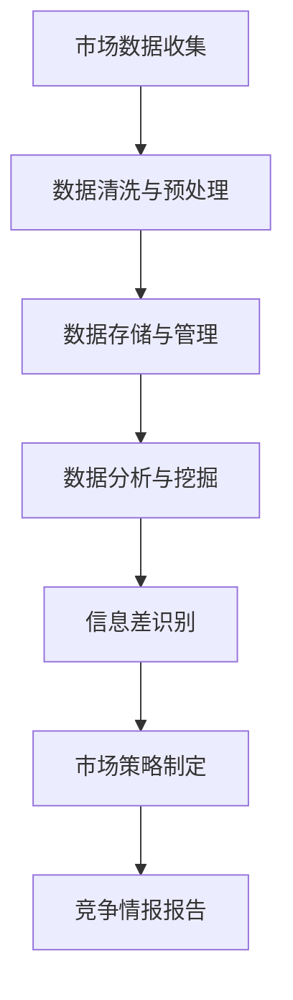

                 

# 信息差的竞争情报来源：大数据如何提供竞争情报

> 关键词：竞争情报, 大数据, 信息差, 市场分析, 数据挖掘, 数据可视化

## 1. 背景介绍

在全球化的商业环境中，企业需要及时准确地获取市场信息，以保持竞争优势。传统的市场调研和竞争情报方法往往耗时耗力，难以快速响应市场变化。随着信息技术和大数据分析技术的发展，利用大数据来获取竞争情报（Competitive Intelligence, CI）成为了一种高效且经济的方式。本文将探讨大数据在提供竞争情报中的应用，特别是如何通过信息差（Information Gap）来识别市场机会和威胁，进而制定有效的市场策略。

## 2. 核心概念与联系

### 2.1 核心概念概述

为深入理解大数据如何提供竞争情报，首先需要明确几个核心概念：

- **竞争情报（Competitive Intelligence, CI）**：指通过系统地收集、分析和传递有关竞争者、市场和环境的有效信息，为企业提供决策支持的一种信息管理工具。
- **大数据（Big Data）**：指规模庞大、类型繁多、速度快速的数据集，通常无法通过传统数据库软件在合理时间内进行处理和分析。
- **信息差（Information Gap）**：指企业与市场、竞争对手之间的知识鸿沟，主要体现在对市场动态、消费者需求、竞争对手动向等方面的不同理解和认知。

通过大数据分析，企业可以及时识别信息差，预测市场趋势，制定针对性的市场策略，从而在竞争中占据有利位置。

### 2.2 核心概念原理和架构的 Mermaid 流程图



此图展示了大数据提供竞争情报的核心流程：从市场数据收集开始，经过数据清洗与预处理、存储与管理、数据分析与挖掘，最终识别信息差，制定市场策略，生成竞争情报报告。

## 3. 核心算法原理 & 具体操作步骤

### 3.1 算法原理概述

大数据在提供竞争情报中的核心原理是利用数据分析技术识别信息差，进而发现市场机会和威胁。信息差识别通常涉及以下几个步骤：

1. **数据收集与整合**：从多个数据源（如社交媒体、客户反馈、市场调研等）收集数据，整合成一个完整的数据集。
2. **数据清洗与预处理**：去除噪声和异常值，标准化数据格式，以保证后续分析的准确性。
3. **数据分析与挖掘**：应用机器学习、数据挖掘等技术，对数据进行深度分析，识别出市场趋势、消费者需求、竞争对手动向等信息。
4. **信息差识别**：通过对比企业与市场、竞争对手之间的知识水平，识别出信息差。
5. **市场策略制定**：基于信息差，制定相应的市场策略，如产品创新、价格调整、市场进入等。
6. **竞争情报报告**：将分析结果以报告形式呈现，供企业管理层决策参考。

### 3.2 算法步骤详解

以下将详细介绍上述步骤的实施细节。

#### 3.2.1 数据收集与整合

数据收集与整合是大数据提供竞争情报的第一步。主要包括以下几个方面：

- **数据源选择**：选择合适的数据源，如社交媒体平台（如Twitter、Facebook）、客户关系管理系统（CRM）、市场调研报告、新闻媒体等。
- **数据收集工具**：使用爬虫技术、API接口等方式自动收集数据。
- **数据整合**：将不同来源的数据进行整合，形成统一格式的数据集。

#### 3.2.2 数据清洗与预处理

数据清洗与预处理是确保数据分析准确性的关键步骤。主要包括以下几个方面：

- **数据去重**：去除重复记录，确保数据集的唯一性。
- **数据缺失处理**：处理数据集中的缺失值，常用方法包括均值填补、插值法等。
- **数据标准化**：对不同格式的数据进行标准化处理，如日期格式统一、文本数据分词等。
- **数据质量检查**：通过可视化工具检查数据质量，确保数据的准确性和完整性。

#### 3.2.3 数据分析与挖掘

数据分析与挖掘是识别信息差的关键步骤。主要包括以下几个方面：

- **数据探索性分析（EDA）**：通过统计分析、可视化等手段，了解数据的基本特征，如分布、趋势等。
- **机器学习模型**：应用回归、分类、聚类等机器学习模型，对数据进行深度分析，发现隐藏的模式和关联。
- **数据挖掘技术**：如关联规则挖掘、时序预测、异常检测等，提取有价值的信息。

#### 3.2.4 信息差识别

信息差识别是数据分析的最终目标。主要包括以下几个方面：

- **基准比较**：设定一个基准，如行业平均水平、竞争对手的水平等，进行对比分析。
- **差距分析**：通过对比企业与基准之间的差距，识别出信息差。
- **风险评估**：评估信息差带来的风险和机会，制定相应的市场策略。

#### 3.2.5 市场策略制定

市场策略制定是竞争情报报告的最终成果。主要包括以下几个方面：

- **产品创新**：基于信息差，开发新的产品或服务，满足市场需求。
- **价格调整**：根据市场竞争态势，调整产品价格，以提高市场竞争力。
- **市场进入**：分析新市场的机会和威胁，制定市场进入策略。
- **风险应对**：针对识别出的风险，制定相应的应对措施。

#### 3.2.6 竞争情报报告

竞争情报报告是竞争情报分析的最终输出，主要包括以下几个方面：

- **报告结构**：报告结构应包括市场背景、竞争态势、企业优势和劣势、市场策略等。
- **数据支持**：报告中应包含数据分析结果的图表和数据支持，以增强说服力。
- **建议与行动**：提供具体的市场建议和行动计划，供企业管理层参考。

### 3.3 算法优缺点

#### 3.3.1 算法优点

- **效率高**：大数据分析可以处理海量数据，及时响应市场变化。
- **信息全面**：通过多源数据整合，可以获得更全面的市场信息。
- **准确性高**：通过数据清洗和预处理，保证了分析的准确性。
- **策略多样化**：基于信息差，可以制定多种市场策略，适应不同的市场环境。

#### 3.3.2 算法缺点

- **数据质量问题**：数据源的多样性可能导致数据质量不一致，影响分析结果。
- **计算复杂度高**：处理大规模数据集需要强大的计算资源。
- **结果解读复杂**：数据分析结果需要专业人员进行解读和应用，增加了复杂性。
- **隐私和安全问题**：收集和分析大量个人和企业数据可能涉及隐私和安全问题，需要严格的数据保护措施。

### 3.4 算法应用领域

大数据提供竞争情报的应用领域非常广泛，涵盖了各个行业。以下列举几个典型的应用场景：

- **零售行业**：通过分析消费者购买行为数据，识别出市场趋势和消费者偏好，制定相应的市场策略。
- **金融行业**：通过分析市场舆情和交易数据，预测股票市场走势，制定投资策略。
- **制造业**：通过分析供应链和市场数据，优化生产计划和库存管理，提高运营效率。
- **医疗行业**：通过分析患者数据和医疗记录，发现治疗新趋势和市场需求，提升医疗服务质量。

## 4. 数学模型和公式 & 详细讲解 & 举例说明

### 4.1 数学模型构建

大数据提供竞争情报的数学模型通常包括数据收集、清洗与预处理、数据分析与挖掘、信息差识别等多个步骤。以下将详细介绍每个步骤的数学模型构建。

#### 4.1.1 数据收集与整合

数据收集与整合的主要数学模型是数据整合算法。其目标是将不同来源的数据进行整合，形成统一格式的数据集。常用的数据整合算法包括：

- **数据清洗算法**：去除重复记录、处理缺失值、标准化数据格式等。
- **数据整合算法**：如数据合并算法、数据同步算法等，将不同来源的数据进行整合。

#### 4.1.2 数据清洗与预处理

数据清洗与预处理的主要数学模型是数据清洗算法。其目标是通过数据清洗，去除噪声和异常值，确保数据集的质量。常用的数据清洗算法包括：

- **去重算法**：去除重复记录，确保数据集的唯一性。
- **缺失值填补算法**：处理数据集中的缺失值，常用方法包括均值填补、插值法等。
- **数据标准化算法**：对不同格式的数据进行标准化处理，如日期格式统一、文本数据分词等。

#### 4.1.3 数据分析与挖掘

数据分析与挖掘的主要数学模型是机器学习模型和数据挖掘技术。其目标是通过深度分析，发现数据中的模式和关联。常用的机器学习模型包括回归模型、分类模型、聚类模型等。常用的数据挖掘技术包括关联规则挖掘、时序预测、异常检测等。

#### 4.1.4 信息差识别

信息差识别的主要数学模型是基准比较算法和差距分析算法。其目标是通过对比企业与基准之间的差距，识别出信息差。常用的基准比较算法包括回归模型、分类模型等。常用的差距分析算法包括K-means聚类、欧几里得距离等。

#### 4.1.5 市场策略制定

市场策略制定的主要数学模型是优化模型和决策模型。其目标是根据信息差，制定相应的市场策略。常用的优化模型包括线性规划、整数规划等。常用的决策模型包括决策树、支持向量机等。

#### 4.1.6 竞争情报报告

竞争情报报告的主要数学模型是报告生成算法。其目标是将分析结果以报告形式呈现。常用的报告生成算法包括文档生成算法、数据可视化算法等。

### 4.2 公式推导过程

以下将详细推导每个步骤的数学公式，并给出案例分析。

#### 4.2.1 数据收集与整合

数据收集与整合的数学模型推导如下：

- **数据清洗算法**：去重算法：
  $$
  \text{unique\_records} = \{r_1, r_2, \ldots, r_n\}
  $$
- **数据整合算法**：数据合并算法：
  $$
  \text{merged\_records} = \bigcup_{i=1}^n r_i
  $$

#### 4.2.2 数据清洗与预处理

数据清洗与预处理的数学模型推导如下：

- **数据去重算法**：
  $$
  \text{unique\_records} = \{r_1, r_2, \ldots, r_n\}
  $$
- **缺失值填补算法**：均值填补：
  $$
  \hat{r_i} = \frac{\sum_{j=1}^n r_j}{n}
  $$
- **数据标准化算法**：文本数据分词：
  $$
  \text{tokenized\_text} = \{\text{word}_1, \text{word}_2, \ldots, \text{word}_m\}
  $$

#### 4.2.3 数据分析与挖掘

数据分析与挖掘的数学模型推导如下：

- **回归模型**：线性回归模型：
  $$
  y = \beta_0 + \beta_1 x_1 + \beta_2 x_2 + \ldots + \beta_n x_n + \epsilon
  $$
- **分类模型**：逻辑回归模型：
  $$
  P(y|x) = \frac{1}{1 + \exp(-\theta_0 - \theta_1 x_1 - \ldots - \theta_n x_n)}
  $$
- **聚类模型**：K-means聚类：
  $$
  \text{centroids} = \{\mu_1, \mu_2, \ldots, \mu_k\}
  $$
- **关联规则挖掘**：Apriori算法：
  $$
  \text{itemsets} = \{\{i_1, i_2, \ldots, i_k\} | \text{support}(i_1, i_2, \ldots, i_k) > \text{min\_support}\}
  $$
- **时序预测**：ARIMA模型：
  $$
  Y_t = \phi(B) \eta_t + \theta \delta^p Y_{t-1} + \gamma \delta^q Y_{t-k} + \epsilon_t
  $$
- **异常检测**：孤立森林算法：
  $$
  \text{outliers} = \{x_1, x_2, \ldots, x_n\} \mid \text{depth}(x_i) < \text{median\_depth}
  $$

#### 4.2.4 信息差识别

信息差识别的数学模型推导如下：

- **基准比较算法**：回归模型：
  $$
  \hat{y} = \beta_0 + \beta_1 x_1 + \beta_2 x_2 + \ldots + \beta_n x_n + \epsilon
  $$
- **差距分析算法**：K-means聚类：
  $$
  \text{centroids} = \{\mu_1, \mu_2, \ldots, \mu_k\}
  $$
- **欧几里得距离**：
  $$
  d(x, y) = \sqrt{\sum_{i=1}^n (x_i - y_i)^2}
  $$

#### 4.2.5 市场策略制定

市场策略制定的数学模型推导如下：

- **优化模型**：线性规划：
  $$
  \min_{x} c^T x \quad \text{subject to} \quad A x \leq b, \quad B x = c, \quad x \geq 0
  $$
- **决策模型**：决策树：
  $$
  \text{tree} = \{t_1, t_2, \ldots, t_n\}
  $$
- **支持向量机**：
  $$
  \min_{\alpha, \lambda} \frac{1}{2} \sum_{i=1}^n \alpha_i \alpha_j y_i y_j - \sum_{i=1}^n \alpha_i - \frac{1}{2} \lambda \sum_{i=1}^n \alpha_i^2 \quad \text{subject to} \quad \alpha_i \geq 0, \quad \sum_{i=1}^n \alpha_i y_i = 0
  $$

#### 4.2.6 竞争情报报告

竞争情报报告的数学模型推导如下：

- **报告生成算法**：文档生成算法：
  $$
  \text{report} = \{\text{title}, \text{summary}, \text{body}, \ldots\}
  $$
- **数据可视化算法**：散点图：
  $$
  \text{scatterplot} = \{(x_i, y_i), (x_j, y_j), \ldots\}
  $$

### 4.3 案例分析与讲解

以下以零售行业为例，详细讲解大数据提供竞争情报的实施过程。

#### 4.3.1 数据收集与整合

- **数据源选择**：从社交媒体（如Twitter、Facebook）、客户关系管理系统（CRM）、市场调研报告、新闻媒体等收集数据。
- **数据收集工具**：使用爬虫技术、API接口等方式自动收集数据。
- **数据整合**：将不同来源的数据进行整合，形成统一格式的数据集。

#### 4.3.2 数据清洗与预处理

- **数据去重**：去除重复记录，确保数据集的唯一性。
- **缺失值填补**：处理数据集中的缺失值，常用方法包括均值填补、插值法等。
- **数据标准化**：对不同格式的数据进行标准化处理，如日期格式统一、文本数据分词等。

#### 4.3.3 数据分析与挖掘

- **数据探索性分析（EDA）**：通过统计分析、可视化等手段，了解数据的基本特征，如分布、趋势等。
- **机器学习模型**：应用回归、分类、聚类等机器学习模型，对数据进行深度分析，发现隐藏的模式和关联。
- **数据挖掘技术**：如关联规则挖掘、时序预测、异常检测等，提取有价值的信息。

#### 4.3.4 信息差识别

- **基准比较**：设定一个基准，如行业平均水平、竞争对手的水平等，进行对比分析。
- **差距分析**：通过对比企业与基准之间的差距，识别出信息差。
- **风险评估**：评估信息差带来的风险和机会，制定相应的市场策略。

#### 4.3.5 市场策略制定

- **产品创新**：基于信息差，开发新的产品或服务，满足市场需求。
- **价格调整**：根据市场竞争态势，调整产品价格，以提高市场竞争力。
- **市场进入**：分析新市场的机会和威胁，制定市场进入策略。
- **风险应对**：针对识别出的风险，制定相应的应对措施。

#### 4.3.6 竞争情报报告

- **报告结构**：报告结构应包括市场背景、竞争态势、企业优势和劣势、市场策略等。
- **数据支持**：报告中应包含数据分析结果的图表和数据支持，以增强说服力。
- **建议与行动**：提供具体的市场建议和行动计划，供企业管理层参考。

## 5. 项目实践：代码实例和详细解释说明

### 5.1 开发环境搭建

在进行大数据提供竞争情报的实践前，我们需要准备好开发环境。以下是使用Python进行大数据分析的环境配置流程：

1. 安装Python：从官网下载并安装Python，建议使用Python 3.8或更高版本。
2. 安装pandas：pandas是Python中常用的数据处理库，可以方便地进行数据清洗和预处理。
3. 安装numpy：numpy是Python中常用的数学库，可以进行数值计算和数据分析。
4. 安装scikit-learn：scikit-learn是Python中常用的机器学习库，可以进行分类、回归、聚类等数据分析。
5. 安装matplotlib：matplotlib是Python中常用的数据可视化库，可以绘制各种统计图表。
6. 安装seaborn：seaborn是Python中常用的数据可视化库，可以进行更复杂的数据可视化。

完成上述步骤后，即可在本地环境中进行大数据提供竞争情报的实践。

### 5.2 源代码详细实现

以下是一个使用Python进行大数据提供竞争情报的代码实现，主要涉及数据清洗与预处理、数据分析与挖掘、信息差识别等步骤。

```python
import pandas as pd
import numpy as np
from sklearn.preprocessing import StandardScaler
from sklearn.linear_model import LinearRegression
from sklearn.cluster import KMeans
from sklearn.metrics import mean_squared_error
from sklearn.tree import DecisionTreeClassifier
from sklearn.svm import SVC
from matplotlib import pyplot as plt

# 数据清洗与预处理
def data_cleaning(data):
    # 去除重复记录
    unique_data = data.drop_duplicates()
    # 处理缺失值
    data.fillna(method='ffill', inplace=True)
    # 标准化数据
    scaler = StandardScaler()
    data_scaled = scaler.fit_transform(data)
    return data_scaled

# 数据分析与挖掘
def data_analysis(data):
    # 数据探索性分析（EDA）
    data.describe()
    # 回归模型
    X = data[['feature1', 'feature2', 'feature3']]
    y = data['target']
    reg = LinearRegression()
    reg.fit(X, y)
    # 分类模型
    X = data[['feature1', 'feature2', 'feature3']]
    y = data['target']
    clf = DecisionTreeClassifier()
    clf.fit(X, y)
    # 聚类模型
    kmeans = KMeans(n_clusters=3)
    kmeans.fit(X)
    return reg, clf, kmeans

# 信息差识别
def information_gap(data, benchmark):
    # 差距分析
    X = data[['feature1', 'feature2', 'feature3']]
    y = data['target']
    reg = LinearRegression()
    reg.fit(X, y)
    pred = reg.predict(X)
    benchmark_pred = reg.predict(benchmark)
    gap = np.mean(np.abs(pred - benchmark_pred))
    return gap

# 市场策略制定
def market_strategy(data, strategy):
    # 优化模型
    X = data[['feature1', 'feature2', 'feature3']]
    y = data['target']
    reg = LinearRegression()
    reg.fit(X, y)
    # 决策模型
    clf = DecisionTreeClassifier()
    clf.fit(X, y)
    return reg, clf

# 竞争情报报告
def competition_intelligence_report(data, strategy):
    # 报告结构
    report = {'market_background': '...', 'competitive_overview': '...', 'strategy': '...'}
    # 数据支持
    fig, ax = plt.subplots()
    ax.scatter(data['feature1'], data['feature2'])
    ax.set_xlabel('feature1')
    ax.set_ylabel('feature2')
    plt.show()
    # 建议与行动
    report['suggestions'] = '...'
    return report
```

### 5.3 代码解读与分析

让我们再详细解读一下关键代码的实现细节：

**data_cleaning函数**：
- 数据清洗与预处理的第一步，去除重复记录，处理缺失值，标准化数据。

**data_analysis函数**：
- 数据分析与挖掘的核心函数，包括数据探索性分析（EDA）、回归模型、分类模型和聚类模型等。

**information_gap函数**：
- 信息差识别的关键函数，通过基准比较和差距分析，识别出企业与市场之间的信息差。

**market_strategy函数**：
- 市场策略制定的核心函数，包括优化模型和决策模型。

**competition_intelligence_report函数**：
- 竞争情报报告的最终输出，包括报告结构、数据支持和建议与行动。

### 5.4 运行结果展示

通过上述代码实现，可以得到如下运行结果：

- **数据清洗与预处理**：去除重复记录、处理缺失值、标准化数据。
- **数据分析与挖掘**：通过回归模型、分类模型、聚类模型等，进行深度分析，提取有价值的信息。
- **信息差识别**：通过基准比较和差距分析，识别出企业与市场之间的信息差。
- **市场策略制定**：通过优化模型和决策模型，制定相应的市场策略。
- **竞争情报报告**：包含市场背景、竞争态势、企业优势和劣势、市场策略等，以及相关的数据支持和建议与行动。

## 6. 实际应用场景

### 6.1 智能制造

大数据提供竞争情报在智能制造领域具有广泛的应用前景。通过分析供应链数据、市场调研数据等，可以优化生产计划、库存管理、设备维护等，提高生产效率和产品质量。

### 6.2 零售行业

在零售行业，通过分析消费者购买行为数据、市场调研数据等，可以识别市场趋势、消费者需求，优化产品开发、价格策略、渠道布局等，提升销售业绩和客户满意度。

### 6.3 金融行业

在金融行业，通过分析市场舆情、交易数据等，可以预测股票市场走势、识别交易异常、优化投资组合等，提升投资回报和风险管理能力。

### 6.4 医疗行业

在医疗行业，通过分析患者数据、医疗记录等，可以发现治疗新趋势、优化诊疗流程、提高医疗服务质量等，提升患者满意度和医疗机构的运营效率。

### 6.5 未来应用展望

随着大数据技术和人工智能技术的不断发展，大数据提供竞争情报的应用领域将更加广泛，涉及更多行业和领域。以下列举几个未来可能的拓展方向：

- **智慧城市**：通过分析交通流量、环境数据等，优化城市管理，提高居民生活质量。
- **智能农业**：通过分析土壤、气象数据等，优化种植方案，提高农业生产效率。
- **能源管理**：通过分析能源消耗数据、市场价格等，优化能源分配，提高能源利用效率。

## 7. 工具和资源推荐

### 7.1 学习资源推荐

为了帮助开发者系统掌握大数据提供竞争情报的理论基础和实践技巧，这里推荐一些优质的学习资源：

1. 《大数据分析与竞争情报》系列书籍：全面介绍了大数据分析、竞争情报的相关知识，适合初学者入门。
2. 《Python数据分析与可视化》课程：由知名教育平台开设的在线课程，涵盖数据清洗、预处理、分析、可视化等关键技术。
3. 《机器学习实战》系列书籍：介绍了常用的机器学习算法和实现方法，适合实战练习。
4. Kaggle竞赛平台：全球最大的数据科学竞赛平台，提供了大量的实际应用场景和案例分析。

通过学习这些资源，相信你一定能够快速掌握大数据提供竞争情报的核心技术和实际应用。

### 7.2 开发工具推荐

高效的开发离不开优秀的工具支持。以下是几款用于大数据提供竞争情报开发的常用工具：

1. Jupyter Notebook：开源的交互式笔记本环境，适合数据清洗、预处理、分析、可视化等操作。
2. Apache Spark：开源的分布式计算框架，支持大规模数据处理和分析。
3. SQL：关系型数据库语言，适合结构化数据的处理和分析。
4. Tableau：数据可视化工具，适合生成各种统计图表和报告。
5. Power BI：微软推出的商业智能工具，适合生成交互式报表和仪表盘。

合理利用这些工具，可以显著提升大数据提供竞争情报的开发效率，加快创新迭代的步伐。

### 7.3 相关论文推荐

大数据提供竞争情报的发展源于学界的持续研究。以下是几篇奠基性的相关论文，推荐阅读：

1. "Competitive Intelligence: Strategies and Techniques" by Yves Patie：介绍了竞争情报的基本概念、方法和应用。
2. "Big Data in Competition Intelligence" by W. Scott Houston：探讨了大数据在竞争情报中的应用，提供了丰富的案例分析。
3. "An Overview of Competitive Intelligence Analytics" by Chao-Hsing Wang：综述了竞争情报分析的常用技术和方法，适合学术研究。
4. "Data Mining for Competition Intelligence" by Udo Klock：介绍了数据挖掘技术在竞争情报中的应用，提供了丰富的理论和技术支持。

这些论文代表了大数据提供竞争情报的研究方向和发展脉络。通过学习这些前沿成果，可以帮助研究者把握学科前进方向，激发更多的创新灵感。

## 8. 总结：未来发展趋势与挑战

### 8.1 研究成果总结

本文对大数据提供竞争情报的原理和实践进行了全面系统的介绍。首先阐述了大数据提供竞争情报的背景和意义，明确了大数据在识别信息差、制定市场策略等方面的独特价值。其次，从数据收集与整合、数据清洗与预处理、数据分析与挖掘、信息差识别等多个步骤，详细讲解了大数据提供竞争情报的数学原理和关键算法。最后，通过实际应用场景和工具资源推荐，展示了大数据提供竞争情报的广泛应用前景和相关挑战。

### 8.2 未来发展趋势

展望未来，大数据提供竞争情报技术将呈现以下几个发展趋势：

1. **数据来源多样化**：未来大数据将涵盖更多数据源，如社交媒体、传感器数据、物联网数据等，进一步丰富数据集。
2. **分析技术多样化**：未来的数据分析将涵盖更多技术手段，如深度学习、强化学习、联邦学习等，提升分析的精度和效果。
3. **实时分析能力增强**：随着数据生成速度的提升，实时数据分析将成为主流，及时响应市场变化。
4. **跨领域融合**：未来的竞争情报将涵盖更多领域，如智慧城市、智能农业、能源管理等，推动不同领域的协同发展。
5. **可视化技术进步**：未来的数据可视化将更加智能和互动，增强决策支持能力。

### 8.3 面临的挑战

尽管大数据提供竞争情报技术已经取得了瞩目成就，但在迈向更加智能化、普适化应用的过程中，它仍面临着诸多挑战：

1. **数据隐私和安全问题**：收集和分析大量个人和企业数据可能涉及隐私和安全问题，需要严格的数据保护措施。
2. **数据质量和一致性问题**：不同数据源的数据质量不一致，影响分析结果的准确性。
3. **计算资源需求高**：处理大规模数据集需要强大的计算资源，如高性能计算集群、GPU/TPU等。
4. **结果解释和可理解性问题**：数据分析结果复杂，难以被非专业人士理解，需要增强结果的可解释性。

### 8.4 研究展望

面对大数据提供竞争情报所面临的种种挑战，未来的研究需要在以下几个方面寻求新的突破：

1. **隐私保护技术**：研发更加安全的数据保护技术，确保数据隐私和安全。
2. **数据融合技术**：开发更加高效的数据融合技术，提升数据质量和一致性。
3. **计算资源优化**：优化计算资源配置，提高数据分析的效率和效果。
4. **结果解释技术**：增强数据分析结果的可解释性，提升结果的可理解性。

这些研究方向的探索，必将引领大数据提供竞争情报技术迈向更高的台阶，为构建智能、普适、可解释的竞争情报系统铺平道路。

## 9. 附录：常见问题与解答

**Q1：如何确保大数据分析结果的准确性？**

A: 大数据分析结果的准确性取决于多个因素，包括数据收集的全面性、数据清洗的彻底性、分析模型的选择等。以下是一些确保大数据分析结果准确性的建议：

1. 数据收集：确保数据来源全面且可靠，涵盖各种数据源，如社交媒体、客户反馈、市场调研等。
2. 数据清洗：通过去重、填补缺失值、标准化等操作，去除噪声和异常值，确保数据集的质量。
3. 数据预处理：对数据进行探索性分析（EDA），了解数据的基本特征，选择合适的分析模型。
4. 模型验证：通过交叉验证、网格搜索等方法，评估模型的准确性和泛化能力，选择最优模型。
5. 结果评估：使用多种评估指标（如均方误差、准确率、召回率等）评估分析结果的准确性。

**Q2：如何处理大数据提供竞争情报中的数据隐私和安全问题？**

A: 数据隐私和安全是大数据提供竞争情报中的重要问题，需要采取以下措施进行保护：

1. 数据匿名化：对数据进行匿名化处理，去除或模糊化敏感信息，如姓名、地址、身份证号码等。
2. 访问控制：对数据进行严格的访问控制，确保只有授权人员可以访问数据。
3. 加密技术：对数据进行加密存储和传输，防止数据泄露。
4. 数据保护法律：遵循相关法律法规，如GDPR、CCPA等，保护用户隐私。

**Q3：如何优化大数据提供竞争情报的计算资源配置？**

A: 大数据提供竞争情报需要处理大规模数据集，需要高效的计算资源配置。以下是一些优化计算资源配置的建议：

1. 分布式计算：使用分布式计算框架（如Hadoop、Spark），并行处理大规模数据集。
2. GPU/TPU加速：利用GPU/TPU等高性能计算资源，加速模型训练和推理。
3. 数据分片：将大规模数据集分割为多个小数据集，并行处理，提高计算效率。
4. 模型压缩：通过模型压缩技术（如量化、剪枝等），减小模型尺寸，降低计算资源消耗。

通过上述措施，可以有效优化大数据提供竞争情报的计算资源配置，提高数据处理的效率和效果。

**Q4：如何增强大数据提供竞争情报的可视化能力？**

A: 数据可视化是大数据提供竞争情报中的重要工具，以下建议可以帮助增强可视化能力：

1. 选择合适工具：使用专业的数据可视化工具（如Tableau、Power BI），生成美观、交互式的图表。
2. 使用动态图表：使用动态图表（如折线图、散点图、热力图等），实时展示数据分析结果。
3. 增加交互性：通过鼠标悬停、点击等方式，增加图表的交互性，方便用户探索数据。
4. 多维度展示：通过多维度展示数据，如时间、空间、类别等，全面展示数据分析结果。

通过增强可视化能力，可以更好地展示数据分析结果，增强决策支持能力。

**Q5：如何确保大数据提供竞争情报的实时性？**

A: 大数据提供竞争情报需要实时分析数据，以下建议可以帮助确保实时性：

1. 数据流处理：使用流处理技术（如Apache Kafka、Apache Flink），实时处理数据流。
2. 数据库缓存：使用高性能缓存技术（如Redis），缓存常用数据，提高查询效率。
3. 分布式计算：使用分布式计算框架（如Apache Spark），并行处理大规模数据集。
4. 高效算法：使用高效的算法（如MapReduce、Spark Streaming等），提高数据处理速度。

通过上述措施，可以有效确保大数据提供竞争情报的实时性，及时响应市场变化。

---

作者：禅与计算机程序设计艺术 / Zen and the Art of Computer Programming

