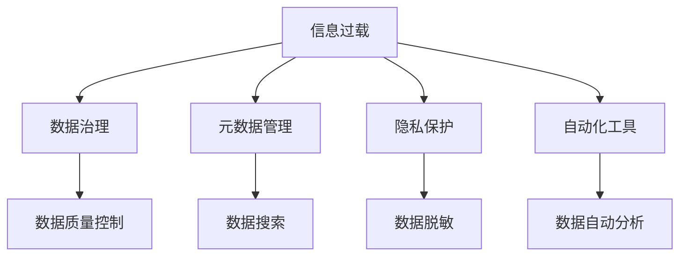

                 

# 信息时代的信息管理策略：如何处理信息过载

> 关键词：信息过载,信息管理,大数据,人工智能,自动化,元数据管理,隐私保护

## 1. 背景介绍

### 1.1 问题由来
随着信息技术的发展，信息总量呈爆炸式增长。各种数据的产生和积累，极大地丰富了人类知识的存储和应用，但也造成了严重的信息过载问题。信息过载不仅使得人们难以有效筛选和利用这些信息，还可能导致认知负担加重，影响决策效率和准确性。

信息过载问题的产生主要源于以下几个方面：
1. **数据量庞大**：社交媒体、电子商务、物联网、传感器网络等新技术的产生，使得数据量呈指数级增长。
2. **数据类型繁多**：文本、图像、视频、音频等多种形式的数据并存，增加了信息处理的复杂度。
3. **数据更新快速**：实时数据流和变化的数据集使得数据更新速度加快，传统的数据管理方法难以应对。

### 1.2 问题核心关键点
如何有效地管理和处理信息过载问题，是当今信息技术领域的一大挑战。核心关键点包括：

- **数据治理**：建立规范的数据管理和治理机制，确保数据质量、安全和合规性。
- **自动化工具**：利用人工智能和自动化技术，提升数据处理和分析的效率。
- **元数据管理**：管理数据的结构化信息，帮助用户快速找到所需数据。
- **隐私保护**：在数据利用和共享过程中，确保用户隐私和数据安全。

### 1.3 问题研究意义
研究信息过载问题的管理策略，对提升信息处理效率、保障数据安全、促进数据合理利用具有重要意义：

1. **提升决策效率**：通过有效管理信息，帮助决策者快速获取关键信息，提高决策速度和质量。
2. **降低数据风险**：建立健全的数据管理机制，减少数据泄露和滥用风险，保护用户隐私。
3. **优化资源利用**：合理管理和利用数据资源，避免资源浪费，提高信息技术的经济效益。
4. **促进技术创新**：推动信息管理技术的发展，如大数据、人工智能、区块链等，为各行各业注入新动能。

## 2. 核心概念与联系

### 2.1 核心概念概述

为了更好地理解信息管理的策略，本节将介绍几个核心概念：

- **信息过载(Information Overload)**：指信息量远远超出个人或系统处理能力的状况，导致信息获取和处理效率下降。
- **数据治理(Data Governance)**：通过制定和实施数据管理和治理策略，确保数据的质量、安全性和合规性。
- **元数据(Metadata)**：描述数据的结构和内容的信息，用于数据搜索、管理和利用。
- **隐私保护(Privacy Protection)**：保护用户隐私信息，防止数据滥用和泄露。
- **自动化工具(Automatic Tools)**：利用人工智能和自动化技术，自动化地管理和分析数据。

这些概念之间存在着密切的联系，共同构成了信息管理的核心框架，使得我们能够系统地应对信息过载问题。

### 2.2 核心概念原理和架构的 Mermaid 流程图



这个流程图展示了信息过载问题在数据治理、元数据管理、隐私保护和自动化工具中的应用和影响。通过数据治理，确保数据的质量和一致性；通过元数据管理，帮助用户快速查找所需数据；通过隐私保护，保障用户数据安全；通过自动化工具，提升数据处理的效率和精度。

## 3. 核心算法原理 & 具体操作步骤
### 3.1 算法原理概述

处理信息过载的核心算法原则包括：

- **数据压缩**：通过算法或工具，减少数据存储和传输的体积。
- **数据分类和过滤**：根据数据的属性和特征，对数据进行分类和过滤，去除无关信息。
- **数据聚类**：通过聚类算法将相似数据归为一类，便于处理和分析。
- **数据摘要**：利用摘要技术，提取数据的核心信息，快速了解数据全貌。
- **异常检测**：通过算法检测数据中的异常点，排除噪声干扰。

### 3.2 算法步骤详解

下面以数据分类和过滤为例，详细介绍算法步骤：

**Step 1: 数据预处理**
- 收集和整理数据，进行基本的清洗和格式转换，确保数据质量。

**Step 2: 特征提取**
- 使用特征提取算法，提取数据的关键特征，如TF-IDF、词频等。

**Step 3: 数据分类**
- 使用分类算法，如K-Means、SVM等，将数据分为不同类别。
- 对每一类数据进行标注，便于后续处理和分析。

**Step 4: 数据过滤**
- 根据分类结果，删除或过滤掉无关信息。
- 使用过滤算法，如朴素贝叶斯、决策树等，进一步精简数据。

**Step 5: 结果评估**
- 对过滤后的数据进行评估，确保过滤效果。
- 使用精度、召回率等指标，评估过滤算法的性能。

### 3.3 算法优缺点

数据分类和过滤算法具有以下优点：
1. **提升效率**：通过分类和过滤，去除无关信息，提升数据处理速度。
2. **减少噪声**：过滤掉异常和噪声数据，提高数据质量。
3. **便于分析**：分类后的数据结构清晰，便于进一步分析和利用。

同时，该算法也存在一定的局限性：
1. **依赖标注数据**：需要大量标注数据，才能训练出高效的分类和过滤模型。
2. **高复杂度**：分类和过滤算法复杂度较高，需要大量计算资源。
3. **模型泛化能力有限**：分类和过滤模型可能过度拟合训练数据，导致泛化能力不足。

### 3.4 算法应用领域

数据分类和过滤算法在多个领域都有广泛应用，例如：

- **搜索引擎**：对搜索结果进行分类和过滤，提高搜索精度。
- **社交媒体分析**：对用户发布的内容进行分类和过滤，防止有害信息传播。
- **金融风险管理**：对交易数据进行分类和过滤，识别异常交易行为。
- **医疗数据分析**：对医疗数据进行分类和过滤，提取有价值的信息。
- **内容推荐系统**：对用户行为数据进行分类和过滤，推荐相关内容。

## 4. 数学模型和公式 & 详细讲解 & 举例说明

### 4.1 数学模型构建

假设我们有一组数据集 $D=\{x_1,x_2,\dots,x_n\}$，每个样本 $x_i$ 包含多个特征 $x_{ij}$。我们的目标是将其分类为 $k$ 个类别 $C=\{C_1,C_2,\dots,C_k\}$。

我们定义一个分类模型 $f$，其输入为数据 $x_i$，输出为类别标签 $y_i$。使用交叉熵损失函数 $L$ 来衡量分类模型的预测结果与真实标签之间的差异。

数学模型为：

$$
\min_{f} \frac{1}{n} \sum_{i=1}^n L(f(x_i), y_i)
$$

其中 $L(f(x_i), y_i)$ 表示样本 $x_i$ 的分类损失，常见有二分类交叉熵损失 $-\log\sigma(y_if(x_i))$ 和多元分类交叉熵损失 $-\sum_{j=1}^k y_j\log\sigma(y_jf(x_i))$。

### 4.2 公式推导过程

以二分类交叉熵损失为例，推导其公式。假设模型 $f$ 的输出为 $\hat{y}$，真实标签为 $y$，则二分类交叉熵损失为：

$$
L(f(x),y) = -y\log\sigma(yf(x)) - (1-y)\log\sigma((1-y)f(x))
$$

使用梯度下降法，对模型参数 $\theta$ 进行优化：

$$
\theta \leftarrow \theta - \eta\nabla_{\theta}L(f(x),y)
$$

其中 $\eta$ 为学习率，$\nabla_{\theta}L(f(x),y)$ 为损失函数对模型参数的梯度。

### 4.3 案例分析与讲解

假设我们有一组文本数据，需要对其中垃圾邮件进行过滤。使用朴素贝叶斯分类器进行分类，其公式为：

$$
P(y|x) = \frac{P(x|y)P(y)}{P(x)}
$$

其中 $P(y|x)$ 表示给定数据 $x$ 条件下，分类标签 $y$ 的概率。$P(x)$ 表示数据 $x$ 的先验概率，通常取 $\frac{1}{k}$。$P(x|y)$ 表示给定分类标签 $y$ 条件下，数据 $x$ 的条件概率，可以通过训练数据计算得到。

对于每个垃圾邮件 $x_i$，计算其属于垃圾邮件 $C_1$ 的概率 $P(C_1|x_i)$：

$$
P(C_1|x_i) = \frac{P(x_i|C_1)P(C_1)}{P(x_i)}
$$

其中 $P(x_i|C_1)$ 为垃圾邮件的特征分布，$P(C_1)$ 为垃圾邮件的先验概率，$P(x_i)$ 为所有邮件的先验概率，通常取 $\frac{1}{2}$。

根据 $P(C_1|x_i)$ 的值，判断邮件是否为垃圾邮件，进行过滤。

## 5. 项目实践：代码实例和详细解释说明
### 5.1 开发环境搭建

在进行数据分类和过滤实践前，我们需要准备好开发环境。以下是使用Python进行Scikit-Learn开发的环境配置流程：

1. 安装Anaconda：从官网下载并安装Anaconda，用于创建独立的Python环境。

2. 创建并激活虚拟环境：
```bash
conda create -n sklearn-env python=3.8 
conda activate sklearn-env
```

3. 安装Scikit-Learn：
```bash
pip install scikit-learn
```

4. 安装各类工具包：
```bash
pip install numpy pandas scikit-learn matplotlib tqdm jupyter notebook ipython
```

完成上述步骤后，即可在`sklearn-env`环境中开始数据分类和过滤实践。

### 5.2 源代码详细实现

这里以朴素贝叶斯分类器为例，给出使用Scikit-Learn进行垃圾邮件分类的Python代码实现。

首先，定义数据预处理和特征提取函数：

```python
from sklearn.feature_extraction.text import CountVectorizer
from sklearn.naive_bayes import MultinomialNB
from sklearn.metrics import accuracy_score

def preprocess_text(texts):
    # 去除HTML标签
    texts = [BeautifulSoup(text, 'html.parser').get_text() for text in texts]
    # 去除数字和特殊字符
    texts = [re.sub(r'\d+|\W+', '', text) for text in texts]
    # 转换为小写
    texts = [text.lower() for text in texts]
    return texts

def extract_features(texts):
    # 文本向量化
    vectorizer = CountVectorizer()
    features = vectorizer.fit_transform(texts)
    return features, vectorizer
```

然后，定义模型训练和评估函数：

```python
def train_model(features, labels):
    # 朴素贝叶斯分类器
    model = MultinomialNB()
    model.fit(features, labels)
    return model

def evaluate_model(model, features, labels):
    # 预测标签
    predictions = model.predict(features)
    # 计算准确率
    accuracy = accuracy_score(labels, predictions)
    return accuracy
```

最后，启动训练和评估流程：

```python
import re
from bs4 import BeautifulSoup
from sklearn.model_selection import train_test_split
from sklearn.datasets import fetch_20newsgroups
from sklearn.metrics import accuracy_score

# 加载数据集
newsgroups = fetch_20newsgroups(subset='train')
X, y = newsgroups.data, newsgroups.target

# 预处理文本数据
X = preprocess_text(X)

# 提取特征
features, vectorizer = extract_features(X)

# 分割数据集
X_train, X_test, y_train, y_test = train_test_split(features, y, test_size=0.2, random_state=42)

# 训练模型
model = train_model(X_train, y_train)

# 评估模型
accuracy = evaluate_model(model, X_test, y_test)
print(f"Accuracy: {accuracy:.2f}")
```

以上就是使用Scikit-Learn进行朴素贝叶斯分类器的代码实现。可以看到，Scikit-Learn的封装使得数据分类和过滤的实现变得非常简洁高效。

### 5.3 代码解读与分析

让我们再详细解读一下关键代码的实现细节：

**preprocess_text函数**：
- 去除HTML标签，防止噪音干扰
- 去除数字和特殊字符，简化特征
- 转换为小写，统一特征格式

**extract_features函数**：
- 使用CountVectorizer将文本转换为词频向量
- 返回特征矩阵和词频向量器

**train_model函数**：
- 定义朴素贝叶斯分类器，训练模型

**evaluate_model函数**：
- 对测试集进行预测，计算准确率

**训练流程**：
- 加载数据集
- 预处理文本数据
- 提取特征
- 分割数据集
- 训练模型
- 评估模型

可以看到，Scikit-Learn的高级接口使得数据分类和过滤的实现变得非常高效和便捷，开发者可以专注于算法本身的优化和改进。

当然，工业级的系统实现还需考虑更多因素，如模型的保存和部署、超参数的自动搜索、更灵活的任务适配层等。但核心的算法实现基本与此类似。

## 6. 实际应用场景
### 6.1 智能推荐系统

在电商平台上，用户每天会产生大量的浏览和购买数据。通过数据分类和过滤技术，可以从中提取用户兴趣和行为模式，为用户推荐个性化的商品。

具体而言，可以对用户的历史行为数据进行分类和过滤，提取其喜欢的商品类型和评分等信息。然后，将这些信息作为特征输入到推荐模型中，利用机器学习算法对用户进行画像，实现个性化推荐。推荐模型可以基于协同过滤、内容推荐等方法，为用户提供最符合其需求的商品。

### 6.2 金融风险管理

金融行业面临大量的交易数据和市场信息，需要进行风险管理。通过数据分类和过滤技术，可以从中识别出潜在的风险点，采取相应的应对措施。

具体而言，可以对交易数据进行分类和过滤，识别出异常交易行为和潜在的欺诈行为。然后，将这些信息作为特征输入到风险评估模型中，利用机器学习算法对交易风险进行评估和预测，及时发现和阻止恶意行为，保障金融安全。

### 6.3 社交媒体监控

社交媒体上每天都会产生大量用户发布的内容。通过数据分类和过滤技术，可以从中提取有用信息，进行舆情监测和用户行为分析。

具体而言，可以对用户发布的内容进行分类和过滤，识别出有害信息和违规行为。然后，将这些信息作为特征输入到舆情监测模型中，利用机器学习算法对舆情进行实时监测和分析，及时发现和应对有害信息，维护网络安全。

### 6.4 未来应用展望

随着数据分类和过滤技术的不断发展，未来的应用场景将更加广泛。

在智慧城市治理中，通过数据分类和过滤技术，可以实时监测城市事件，识别出突发事件和安全隐患，进行快速应对和处理，提升城市管理水平。

在智能家居领域，通过数据分类和过滤技术，可以对用户的行为数据进行分析和预测，优化家居环境，提升生活质量。

在医疗领域，通过数据分类和过滤技术，可以对医疗数据进行分类和过滤，提取有用的医疗信息，支持医疗决策和科研工作。

总之，数据分类和过滤技术将在更多领域得到应用，为各行各业带来变革性影响。

## 7. 工具和资源推荐
### 7.1 学习资源推荐

为了帮助开发者系统掌握数据分类和过滤的技术基础和实践技巧，这里推荐一些优质的学习资源：

1. 《Python数据科学手册》：全面介绍了数据处理和分析的Python实现，包括数据预处理、特征提取等基本技术。

2. 《数据科学与机器学习》课程：由斯坦福大学开设的课程，涵盖数据预处理、特征工程、分类算法等基本概念和实践技巧。

3. Kaggle平台：世界领先的机器学习竞赛平台，提供丰富的数据集和算法挑战，是学习和实践数据分类和过滤的好地方。

4. Scikit-Learn官方文档：Scikit-Learn的详细文档，提供丰富的功能和示例代码，是学习和使用Scikit-Learn的重要资源。

5. TensorFlow官方文档：TensorFlow的详细文档，提供丰富的模型和算法库，是学习和使用深度学习的重要资源。

通过对这些资源的学习实践，相信你一定能够快速掌握数据分类和过滤的精髓，并用于解决实际的NLP问题。

### 7.2 开发工具推荐

高效的开发离不开优秀的工具支持。以下是几款用于数据分类和过滤开发的常用工具：

1. Python：数据处理和分析的通用语言，有丰富的第三方库和框架支持。

2. Scikit-Learn：基于Python的数据处理和分析库，提供丰富的数据处理和机器学习算法。

3. TensorFlow：Google开发的深度学习框架，提供强大的模型构建和训练能力。

4. Weights & Biases：模型训练的实验跟踪工具，可以记录和可视化模型训练过程中的各项指标，方便对比和调优。

5. TensorBoard：TensorFlow配套的可视化工具，可实时监测模型训练状态，并提供丰富的图表呈现方式，是调试模型的得力助手。

合理利用这些工具，可以显著提升数据分类和过滤任务的开发效率，加快创新迭代的步伐。

### 7.3 相关论文推荐

数据分类和过滤技术的发展源于学界的持续研究。以下是几篇奠基性的相关论文，推荐阅读：

1. "A Tutorial on Support Vector Machines for Pattern Recognition"：由Christopher Bishop撰写，介绍了支持向量机分类器的基本原理和算法实现。

2. "Efficient estimation of word representations in vector space"：由Tomás Mikolov等人撰写，提出了Word2Vec词向量模型，极大地推动了文本数据分类和处理的发展。

3. "Logistic Regression Tools"：由Peter Flom和Graham Murray等人撰写，介绍了逻辑回归分类器的基本原理和算法实现。

4. "An Introduction to Statistical Learning with Applications in R"：由Gareth James等人撰写，介绍了各种机器学习算法的原理和实现，包括分类和过滤算法。

这些论文代表了大数据分类和过滤技术的发展脉络。通过学习这些前沿成果，可以帮助研究者把握学科前进方向，激发更多的创新灵感。

## 8. 总结：未来发展趋势与挑战

### 8.1 总结

本文对数据分类和过滤技术进行了全面系统的介绍。首先阐述了数据过载问题的产生背景和解决策略，明确了数据治理、元数据管理、隐私保护和自动化工具之间的密切联系。其次，从原理到实践，详细讲解了数据分类和过滤的数学模型和算法实现，给出了数据分类和过滤任务开发的完整代码实例。同时，本文还广泛探讨了数据分类和过滤技术在多个行业领域的应用前景，展示了该技术在信息管理中的广阔潜力。

通过本文的系统梳理，可以看到，数据分类和过滤技术正在成为信息管理的重要手段，极大地提升了数据处理的效率和精度，保障了数据的安全和合规性。未来，伴随数据管理技术的持续演进，相信数据分类和过滤技术还将进一步发挥其作用，为各行业的数字化转型提供坚实的基础。

### 8.2 未来发展趋势

展望未来，数据分类和过滤技术将呈现以下几个发展趋势：

1. **自动化程度提升**：通过机器学习和深度学习技术，自动化数据分类和过滤的过程，减少人工干预，提高效率和准确性。

2. **实时处理能力增强**：实时数据流技术和大数据处理框架，使得数据分类和过滤技术能够实时处理和分析数据，满足高时效性需求。

3. **多模态数据融合**：将文本、图像、视频等多种形式的数据融合处理，提升数据分类和过滤的效果和精度。

4. **跨领域知识融合**：通过知识图谱、规则库等外部知识库的引入，提升数据分类和过滤的准确性和可靠性。

5. **隐私保护技术升级**：随着隐私保护意识的增强，未来的数据分类和过滤技术将更加注重用户隐私保护，使用差分隐私等技术，保障数据安全。

6. **联邦学习应用**：联邦学习技术可以在不共享原始数据的情况下，利用分布式数据进行模型训练，提升数据处理的安全性和隐私性。

以上趋势凸显了数据分类和过滤技术的广阔前景。这些方向的探索发展，必将进一步提升数据处理效率和质量，保障数据安全，促进信息管理技术的进步。

### 8.3 面临的挑战

尽管数据分类和过滤技术已经取得了瞩目成就，但在迈向更加智能化、普适化应用的过程中，它仍面临着诸多挑战：

1. **数据质量问题**：数据质量问题依然存在，如数据不完整、噪声干扰、数据标注不规范等。

2. **模型泛化能力不足**：分类和过滤模型可能过度拟合训练数据，导致泛化能力不足。

3. **高计算资源需求**：数据分类和过滤技术往往需要大量的计算资源，这对于资源有限的场景可能难以应对。

4. **隐私保护难题**：如何在保障数据隐私的前提下，进行数据分类和过滤，是一个需要深入研究的难题。

5. **数据治理复杂性**：数据治理涉及多方面因素，如数据隐私、安全、合规等，需要系统性的管理和控制。

6. **技术演进速度**：数据分类和过滤技术发展迅速，需要开发者不断学习和更新技术，保持竞争力。

正视这些挑战，积极应对并寻求突破，将是大数据分类和过滤技术迈向成熟的必由之路。相信随着学界和产业界的共同努力，这些挑战终将一一被克服，数据分类和过滤技术必将在构建信息时代的基础设施中扮演越来越重要的角色。

### 8.4 研究展望

面对数据分类和过滤技术所面临的种种挑战，未来的研究需要在以下几个方面寻求新的突破：

1. **数据预处理技术**：开发更高效的数据预处理技术，提升数据质量，减少噪音干扰。

2. **特征提取技术**：引入更高级的特征提取技术，提取更有意义的特征，提升数据分类和过滤的效果。

3. **模型融合技术**：将多种分类和过滤模型进行融合，提升模型的泛化能力和精度。

4. **隐私保护技术**：引入隐私保护技术，如差分隐私、同态加密等，保障数据安全。

5. **跨领域融合技术**：将多领域知识引入数据分类和过滤模型，提升模型的多领域适应能力。

6. **联邦学习技术**：利用联邦学习技术，在不共享数据的前提下，进行跨组织的数据分析和处理。

这些研究方向将推动数据分类和过滤技术的不断进步，为构建安全、高效、可靠的信息管理系统提供坚实的基础。总之，数据分类和过滤技术将在信息时代发挥越来越重要的作用，推动各行各业向数字化、智能化方向迈进。

## 9. 附录：常见问题与解答

**Q1：数据分类和过滤技术的核心是什么？**

A: 数据分类和过滤技术的核心在于通过算法和工具，对大量数据进行高效、准确的分类和筛选，去除无用和噪声信息，提取有价值的信息。

**Q2：数据分类和过滤算法有哪些？**

A: 常见的数据分类和过滤算法包括朴素贝叶斯分类器、K-Means聚类、决策树、随机森林等。这些算法通过不同的方式处理数据，具有不同的优缺点和适用场景。

**Q3：数据分类和过滤算法的效果如何评估？**

A: 数据分类和过滤算法的效果评估通常通过精度、召回率、F1分数等指标进行，这些指标可以综合反映算法的性能。

**Q4：数据分类和过滤算法在实际应用中需要注意哪些问题？**

A: 数据分类和过滤算法在实际应用中需要注意数据质量、模型泛化能力、计算资源需求、隐私保护和数据治理等问题。需要根据具体情况进行优化和调整。

**Q5：数据分类和过滤算法如何应用于实际场景？**

A: 数据分类和过滤算法可以应用于推荐系统、金融风险管理、社交媒体监控、医疗数据分析等多个领域。通过分类和过滤，从大量数据中提取有用信息，支持决策和应用。

---

作者：禅与计算机程序设计艺术 / Zen and the Art of Computer Programming

