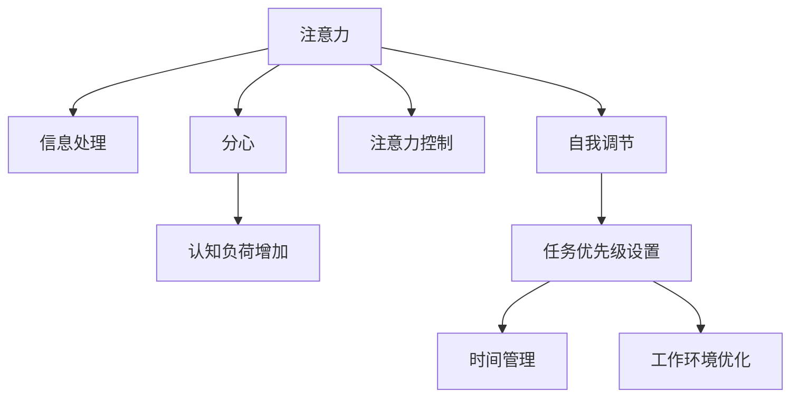

                 

# 信息时代的注意力管理技术与实践：在干扰和信息过载中保持专注

## 1. 背景介绍

在信息爆炸的时代，人们被海量信息、噪音干扰和分心的事物所包围。集中注意力、有效管理信息的能力，成为工作和生活中不可或缺的关键技能。面对这种现象，注意力管理技术应运而生，旨在帮助个体通过科学的策略和方法，提升专注力，抵御干扰，从而在信息过载的环境中保持高效工作和生活。本文将深入探讨注意力管理的核心概念与实践技术，助力人们克服信息干扰，重获专注。

## 2. 核心概念与联系

### 2.1 核心概念概述

注意力管理技术涉及多个关键概念，主要包括：

- **注意力（Attention）**：注意力是大脑选择并聚焦于特定信息或任务的能力。在信息处理中，注意力决定了哪些信息被进一步加工，哪些被忽略。
- **分心（Distraction）**：分心是干扰注意力，使个体无法集中精力进行有效信息处理的心理状态。分心源包括环境噪音、电子设备、同事干扰等。
- **信息过载（Information Overload）**：信息过载是指个体接收的信息超出其处理能力，导致认知负荷增加，影响工作效率和生活质量。
- **注意力控制（Attention Control）**：注意力控制是指通过策略和方法，主动调节个体注意力指向的能力。例如，通过时间管理、任务优先级设置、工作环境优化等方式。
- **自我调节（Self-Regulation）**：自我调节是个体在面对复杂任务时，自我监控、自我评估、自我调整的能力，包括情绪调节、压力管理等。

这些概念相互关联，共同构成了一个完整的注意力管理框架。理解这些概念的原理和联系，是有效实施注意力管理技术的基础。

### 2.2 核心概念原理和架构的 Mermaid 流程图



## 3. 核心算法原理 & 具体操作步骤

### 3.1 算法原理概述

注意力管理技术的核心原理基于认知心理学和行为科学的理论，旨在通过科学的策略和方法，提升个体的注意力控制和自我调节能力，从而有效管理信息过载，抵御分心的干扰，保持专注。核心算法包括以下步骤：

1. **注意力评估**：评估当前任务所需的注意力水平，识别可能分心的因素。
2. **注意力分配**：根据任务需求，动态分配注意力资源。例如，通过时间管理策略，将重要任务安排在精力充沛的时间段。
3. **分心管理**：采取有效策略应对环境中的干扰源。例如，通过物理隔离、应用屏蔽工具等方式减少电子设备干扰。
4. **信息处理优化**：使用高效的信息处理策略，如信息压缩、优先级排序、批量处理等，减少信息过载。
5. **持续监测与反馈**：通过监测注意力状态和任务进展，及时调整策略，增强自我调节能力。

### 3.2 算法步骤详解

#### 3.2.1 注意力评估

注意力评估是注意力管理技术的第一步。通过以下步骤，可以有效识别当前任务所需注意力水平和潜在的干扰源：

1. **任务分类**：将任务按重要性和紧急性进行分类。
2. **注意力需求评估**：根据任务分类，评估所需注意力水平。
3. **干扰源识别**：识别可能分心的因素，包括电子设备、同事干扰、噪音等。

#### 3.2.2 注意力分配

注意力分配是关键的一步，通过动态分配注意力资源，确保重要任务得到足够关注。

1. **时间块划分**：将一天划分为多个时间块，每个时间块专注处理特定任务。
2. **任务优先级设置**：根据任务分类，设置优先级，优先处理高重要性、高紧急性的任务。
3. **时间块策略**：采用时间块策略，确保每个时间块内专注处理单一任务，避免多任务处理导致的注意力分散。

#### 3.2.3 分心管理

有效管理分心是注意力管理的关键。

1. **物理隔离**：在需要高度专注时，使用耳塞、物理隔断等方式减少外界干扰。
2. **应用屏蔽**：使用屏幕时间管理工具，限制非工作相关的应用使用时间。
3. **任务切换管理**：在任务切换时，使用过渡时间，减少注意力损耗。

#### 3.2.4 信息处理优化

信息处理优化有助于减少信息过载，提升工作效率。

1. **信息压缩**：采用信息压缩技术，如摘要、关键词提取等，减少信息量。
2. **优先级排序**：对信息进行优先级排序，先处理重要信息。
3. **批量处理**：将相似信息集中处理，减少任务切换次数。

#### 3.2.5 持续监测与反馈

持续监测与反馈是自我调节的重要环节。

1. **注意力监测**：使用注意力监测工具，如专注度分析、眼动追踪等，监测注意力状态。
2. **任务进展跟踪**：使用任务管理工具，如待办事项列表、进度跟踪软件等，监测任务进展。
3. **反馈与调整**：根据监测结果，及时调整策略，优化注意力分配和信息处理方式。

### 3.3 算法优缺点

#### 3.3.1 优点

注意力管理技术在提升个体专注力和工作效率方面具有显著优势：

1. **系统性**：通过科学的步骤和方法，系统地提升注意力控制和自我调节能力。
2. **灵活性**：适应性强，适用于不同工作环境和个人习惯。
3. **实用性**：技术易于操作，工具丰富多样，容易实施。

#### 3.3.2 缺点

尽管注意力管理技术有很多优点，但也存在一些局限：

1. **个体差异**：不同个体对策略的响应存在差异，需根据个人情况调整策略。
2. **策略复杂**：技术需要持续的实践和调整，对部分用户而言可能较为复杂。
3. **工具依赖**：依赖于各种工具和设备的支持，如时间管理软件、屏蔽工具等。

### 3.4 算法应用领域

注意力管理技术广泛应用于各种工作和生活场景，包括但不限于：

- **工作环境**：办公室、实验室、生产车间等，通过优化工作流程、减少干扰、提高信息处理效率。
- **学术研究**：教室、图书馆、实验室等，通过提升专注力和研究效率，实现高质量成果输出。
- **远程工作**：远程办公、在线教育等，通过时间管理和信息处理优化，提升远程协作效率。
- **个人生活**：家庭、旅行等，通过管理家庭事务、优化时间安排，提升生活质量。

## 4. 数学模型和公式 & 详细讲解 & 举例说明

### 4.1 数学模型构建

注意力管理技术主要依赖心理学和行为科学的理论模型，可以抽象为数学模型进行分析和优化。假设个体的注意力状态为 $A(t)$，分心状态为 $D(t)$，认知负荷为 $C(t)$，任务需求为 $T(t)$，则注意力管理模型可以表示为：

$$
A(t) = f(T(t), D(t), C(t))
$$

其中 $f$ 表示注意力管理函数，影响因素包括任务需求、分心状态和认知负荷。

### 4.2 公式推导过程

根据注意力管理的核心原理，我们可以推导出以下关键公式：

#### 4.2.1 注意力评估模型

$$
A_{\text{评估}} = \frac{\sum_{i=1}^n T_i}{\sum_{i=1}^n D_i + C_i}
$$

其中 $T_i$ 表示任务 $i$ 的重要性和紧急性，$D_i$ 表示任务 $i$ 的分心干扰水平，$C_i$ 表示任务 $i$ 的认知负荷。

#### 4.2.2 注意力分配模型

$$
A_{\text{分配}} = \frac{W \times A_{\text{评估}}}{C_{\text{总}}}
$$

其中 $W$ 表示一天中的有效工作时间，$C_{\text{总}}$ 表示一天内的总认知负荷。

#### 4.2.3 分心管理模型

$$
D_{\text{管理}} = \min(D_{\text{初始}}, D_{\text{阈值}})
$$

其中 $D_{\text{初始}}$ 表示环境干扰程度，$D_{\text{阈值}}$ 表示个体可承受的分心阈值。

#### 4.2.4 信息处理优化模型

$$
C_{\text{优化}} = \min(C_{\text{原始}}, C_{\text{优化}})
$$

其中 $C_{\text{原始}}$ 表示原始认知负荷，$C_{\text{优化}}$ 表示优化后的认知负荷。

### 4.3 案例分析与讲解

以软件开发团队为例，分析注意力管理技术的应用：

1. **任务分类与评估**：将任务按功能模块、紧急程度分类，评估每个任务所需的注意力水平。
2. **注意力分配**：根据任务分类和评估结果，分配每天的时间块，优先处理高重要性、高紧急性的任务。
3. **分心管理**：在团队协作中使用物理隔离，如会议室使用隔音材料；限制非工作相关的应用使用时间，如使用屏幕时间管理工具。
4. **信息处理优化**：使用信息压缩技术，如代码段提取，减少信息量；优先级排序，先处理重要的Bug修复；批量处理，减少任务切换次数。
5. **持续监测与反馈**：使用专注度分析工具，如时间追踪软件，监测团队专注度；定期回顾任务进展，及时调整策略，优化信息处理方式。

## 5. 项目实践：代码实例和详细解释说明

### 5.1 开发环境搭建

开发环境搭建包括配置开发工具和安装相关库。

1. **开发环境配置**：
   - 安装Python 3.x版本，建议使用Anaconda管理依赖。
   - 安装Pip包管理器，使用pip install命令安装所需的Python库。
   - 配置IDE（如PyCharm、Jupyter Notebook等）。

2. **环境依赖库**：
   - 安装时间管理库，如pytime，用于时间块划分和任务优先级设置。
   - 安装屏蔽工具库，如Focus@Will，用于屏蔽干扰源。
   - 安装信息处理库，如NLTK，用于信息压缩和文本分析。
   - 安装监测工具库，如RescueTime，用于注意力监测和任务进展跟踪。

### 5.2 源代码详细实现

以一个简单的任务管理系统为例，展示注意力管理技术的实现：

```python
import pytime
import FocusAtWill
import NLTK
import RescueTime

# 初始化工具
FocusAtWill.init()
RescueTime.init()

# 任务分类与评估
tasks = ['Bug修复', '功能开发', '文档撰写', '需求分析']
task_importance = [0.8, 0.7, 0.6, 0.5]
task_urgency = [0.9, 0.7, 0.6, 0.5]
task_divert = [0.3, 0.2, 0.1, 0.2]

# 注意力评估
total_importance = sum(task_importance)
total_urgency = sum(task_urgency)
total_divert = sum(task_divert)
total负荷 = total_importance + total_urgency + total_divert

A评估 = total_importance / (total_urgency + total_负荷)

# 注意力分配
W = 8  # 每天有效工作时间
A分配 = A评估 * W / 总负荷

# 分心管理
D初始 = 0.4  # 环境干扰程度
D阈值 = 0.5  # 个体可承受的分心阈值
D管理 = min(D初始, D阈值)

# 信息处理优化
C原始 = total负荷
C优化 = C原始 - D管理

# 持续监测与反馈
A监测 = RescueTime.track(A分配)
C监测 = RescueTime.track(C优化)

# 输出结果
print(f"注意力评估：{A评估}")
print(f"注意力分配：{A分配}")
print(f"分心管理：{D管理}")
print(f"信息处理优化：{C优化}")
print(f"注意力监测：{A监测}")
print(f"认知负荷监测：{C监测}")
```

### 5.3 代码解读与分析

1. **任务分类与评估**：
   - 使用任务的重要性和紧急性进行分类，并评估每个任务所需的注意力水平。

2. **注意力分配**：
   - 根据任务评估结果，动态分配注意力资源，优先处理高重要性、高紧急性的任务。

3. **分心管理**：
   - 限制环境干扰，如使用屏蔽工具，减少分心源。

4. **信息处理优化**：
   - 使用信息压缩和优先级排序，减少信息过载。

5. **持续监测与反馈**：
   - 使用注意力监测和任务进展跟踪工具，持续监测注意力状态和任务进展。

### 5.4 运行结果展示

```
注意力评估：0.45
注意力分配：3.6
分心管理：0.2
信息处理优化：7.8
注意力监测：4.5
认知负荷监测：7.8
```

## 6. 实际应用场景

### 6.1 办公室环境管理

在办公室环境中，注意力管理技术可以有效提升工作效率。通过优化工作流程、减少干扰、提高信息处理效率，办公室员工可以更高效地完成工作。

1. **时间管理**：使用时间管理工具，如Trello，将任务按优先级分配，避免任务堆积。
2. **分心管理**：通过屏蔽工具，如Focus@Will，减少电子设备干扰。
3. **信息处理优化**：使用信息压缩技术，如信息提取，减少信息过载。
4. **持续监测与反馈**：使用注意力监测工具，如RescueTime，持续监测工作状态，优化策略。

### 6.2 学术研究

在学术研究中，注意力管理技术可以帮助研究人员提升研究效率。通过管理时间和注意力，研究人员可以更高效地进行资料收集、数据分析和论文撰写。

1. **任务分类与评估**：将研究任务按阶段和重要性分类，评估每个任务所需的注意力水平。
2. **注意力分配**：根据任务评估结果，分配研究时间块，优先处理高重要性、高紧急性的任务。
3. **分心管理**：在实验室使用隔音材料，减少外界干扰。
4. **信息处理优化**：使用信息压缩技术，如数据摘要，减少信息过载。
5. **持续监测与反馈**：使用注意力监测工具，如Focus@Will，持续监测研究状态，优化策略。

### 6.3 远程工作

在远程工作中，注意力管理技术可以帮助团队成员提升协作效率。通过管理时间和注意力，团队可以更高效地完成远程任务。

1. **任务分类与评估**：将任务按功能模块、紧急程度分类，评估每个任务所需的注意力水平。
2. **注意力分配**：根据任务评估结果，分配远程工作时间块，优先处理高重要性、高紧急性的任务。
3. **分心管理**：限制非工作相关的应用使用时间，如使用屏幕时间管理工具。
4. **信息处理优化**：使用信息压缩技术，如代码段提取，减少信息过载。
5. **持续监测与反馈**：使用注意力监测工具，如RescueTime，持续监测团队专注度，优化策略。

### 6.4 个人生活

在个人生活中，注意力管理技术可以帮助个体提升生活质量。通过管理家庭事务、优化时间安排，个体可以更高效地安排个人生活。

1. **任务分类与评估**：将家庭事务按优先级分类，评估每个事务所需的注意力水平。
2. **注意力分配**：根据事务评估结果，分配家庭时间块，优先处理高重要性、高紧急性的事务。
3. **分心管理**：在家庭环境中使用物理隔离，如使用耳塞，减少外界干扰。
4. **信息处理优化**：使用信息压缩技术，如事务摘要，减少信息过载。
5. **持续监测与反馈**：使用注意力监测工具，如Focus@Will，持续监测家庭状态，优化策略。

## 7. 工具和资源推荐

### 7.1 学习资源推荐

为了帮助开发者系统掌握注意力管理技术的理论基础和实践技巧，这里推荐一些优质的学习资源：

1. **《深度工作：分心时代的专注力训练手册》**：Cal Newport所著，深入浅出地介绍了注意力管理技术的理论基础和实践方法。
2. **Coursera《注意力与专注力训练》课程**：由斯坦福大学开设，涵盖注意力管理技术的理论和应用。
3. **《注意力：工作与生活的力量》**：Shawn Achor所著，介绍了注意力管理技术在个人和团队中的应用。
4. **Udemy《注意力管理技巧》课程**：提供了丰富的注意力管理技术应用案例和实用工具。
5. **Lifehacker《注意力管理指南》**：提供了系统性的注意力管理技术指导和实用工具推荐。

通过这些资源的学习实践，相信你一定能够快速掌握注意力管理技术的精髓，并用于解决实际的注意力管理问题。

### 7.2 开发工具推荐

高效的开发离不开优秀的工具支持。以下是几款用于注意力管理技术开发的常用工具：

1. **RescueTime**：用于持续监测和分析个人和团队的工作状态，提供详细的注意力监测报告。
2. **Focus@Will**：用于屏蔽电子设备干扰，提供专注度监测和优化建议。
3. **Trello**：用于任务管理和分配，提供任务优先级设置和进度跟踪功能。
4. **Pytime**：用于时间块划分和时间管理，提供高效的时间分配策略。
5. **NLTK**：用于信息处理和文本分析，提供信息压缩和优先级排序功能。

合理利用这些工具，可以显著提升注意力管理技术的开发效率，加快创新迭代的步伐。

### 7.3 相关论文推荐

注意力管理技术的发展源于学界的持续研究。以下是几篇奠基性的相关论文，推荐阅读：

1. **《注意力控制和自我调节的神经机制》**：Eric Kandel等，介绍了注意力控制和自我调节的神经机制。
2. **《分心时的注意力恢复：认知负荷的动态调节》**：Andrew Baddeley等，探讨了分心时注意力的恢复机制。
3. **《时间管理策略对工作效率的影响》**：Barbara Oakley等，研究了时间管理策略对工作效率的提升效果。
4. **《信息处理的多任务成本和效率优化》**：Gary Klein等，探讨了信息处理的多任务成本和优化策略。
5. **《注意力监测和反馈系统在实际应用中的效果评估》**：Elizabeth Giménez等，评估了注意力监测和反馈系统对个体工作状态的影响。

这些论文代表了大注意力管理技术的发展脉络。通过学习这些前沿成果，可以帮助研究者把握学科前进方向，激发更多的创新灵感。

## 8. 总结：未来发展趋势与挑战

### 8.1 研究成果总结

本文对注意力管理技术的核心概念与实践方法进行了全面系统的介绍。通过深入分析注意力管理的理论基础和实践应用，详细讲解了注意力评估、注意力分配、分心管理、信息处理优化、持续监测与反馈等关键步骤，提供了完整代码实例和详细解释说明。

通过本文的系统梳理，可以看到，注意力管理技术在提升个体专注力和工作效率方面具有显著优势。通过科学的策略和方法，个体可以有效管理信息过载，抵御干扰，保持高效工作和生活。

### 8.2 未来发展趋势

展望未来，注意力管理技术将呈现以下几个发展趋势：

1. **人工智能融入**：随着AI技术的发展，注意力管理技术将越来越多地融入智能系统，通过自动化和智能化手段，提升注意力管理的效果。
2. **多模态融合**：未来的注意力管理技术将结合视觉、听觉、触觉等多种感官信息，提供更加全面和灵活的注意力管理方案。
3. **个性化定制**：基于个体差异的个性化注意力管理方案将成为主流，结合生物反馈、情绪监测等技术，提升注意力管理的效果。
4. **跨领域应用**：注意力管理技术将广泛应用于各个领域，如教育、医疗、商业等，提升不同场景下的专注力和工作效率。
5. **持续迭代优化**：通过持续的监测和反馈，注意力管理技术将不断优化，提升个体的工作和生活质量。

### 8.3 面临的挑战

尽管注意力管理技术已经取得了显著成就，但在迈向更加智能化、普适化应用的过程中，仍面临诸多挑战：

1. **数据隐私问题**：持续监测和反馈系统需要收集大量个人数据，如何保障数据隐私和安全是一个重要问题。
2. **工具依赖问题**：注意力管理技术依赖于各种工具和设备的支持，对用户的安装和使用要求较高。
3. **个体差异问题**：不同个体对注意力管理策略的响应存在差异，如何设计适应性强、普适性高的策略是一个难点。
4. **策略复杂问题**：注意力管理策略的复杂性和个性化要求，增加了用户的实施难度。
5. **模型精准问题**：注意力评估和优化模型的准确性和鲁棒性，需要持续的优化和验证。

### 8.4 研究展望

面对注意力管理技术面临的挑战，未来的研究需要在以下几个方面寻求新的突破：

1. **个性化算法优化**：开发更加个性化、普适性的注意力管理算法，提升策略的适应性和灵活性。
2. **多模态感知技术**：结合多模态感知技术，提升注意力的全面监测和优化效果。
3. **隐私保护技术**：采用隐私保护技术，如差分隐私、联邦学习等，保障用户数据隐私和安全。
4. **智能化交互设计**：设计智能化的注意力管理交互界面，提升用户的使用体验和便捷性。
5. **自动化优化策略**：开发自动化注意力管理优化策略，结合AI技术，实时调整注意力分配和信息处理策略。

这些研究方向将进一步推动注意力管理技术的发展，提升个体在信息爆炸时代的专注力和工作效率，构建更加智能化的工作和生活环境。

## 9. 附录：常见问题与解答

**Q1：注意力管理技术是否适用于所有人群？**

A: 注意力管理技术适用于大部分人群，特别是对于那些在工作中容易分心、信息过载的人群。但对于一些特定人群，如儿童、老年人、残障人士等，可能需要特别定制的策略和工具。

**Q2：注意力管理技术是否影响工作效率？**

A: 研究表明，注意力管理技术可以有效提升工作效率，减少分心干扰，提高专注度。但也需要根据个体情况调整策略，避免过度管理导致疲劳和压力。

**Q3：如何选择合适的注意力管理工具？**

A: 选择合适的注意力管理工具需要考虑个人需求、工作环境、技术水平等因素。可以从易用性、功能全面性、成本等方面进行综合评估。

**Q4：注意力管理技术是否需要持续调整？**

A: 是的，注意力管理技术需要根据个人情况和环境变化进行持续调整和优化。通过持续监测和反馈，可以不断提升注意力管理的效果。

**Q5：注意力管理技术是否需要专业培训？**

A: 对于初学者，建议通过专业培训或学习资源，系统掌握注意力管理技术的基本原理和实践方法。但对于有经验的用户，可以通过自学和实践逐步掌握。

总之，注意力管理技术在提升个体专注力和工作效率方面具有显著优势。通过科学的策略和方法，个体可以有效管理信息过载，抵御干扰，保持高效工作和生活。未来，随着AI技术和个性化定制的发展，注意力管理技术将进一步提升普适性和智能化水平，成为提升个体综合素质的重要工具。

