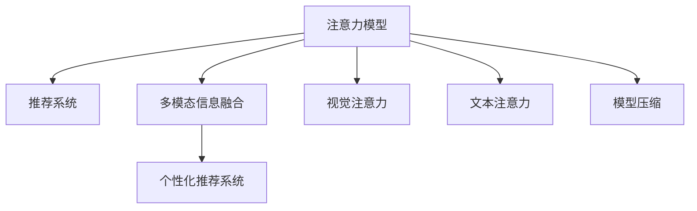

                 

## 1. 背景介绍

### 1.1 问题由来
在信息时代，人们每天都会接触到海量的信息，从邮件、消息到社交媒体，信息流不断涌入，导致注意力资源变得极度稀缺。如何有效管理注意力，提高信息筛选和处理能力，成为了一个重要的研究课题。在智能设备和应用广泛渗透到个人和组织生活中后，对注意力的管理变得越来越迫切。例如，在搜索引擎、社交网络、新闻聚合、会议和电子邮件等场景中，注意力管理对用户体验、信息筛选效率和决策质量都有着决定性的影响。

### 1.2 问题核心关键点
注意力管理的核心问题是如何设计高效的信息过滤和组织机制，使个体能够在信息过载的环境中筛选并集中于重要信息，从而提升工作效率和生活质量。主要包括以下方面：

1. **信息过滤**：通过算法自动筛选并推荐重要信息，减少用户处理噪声信息的时间。
2. **信息组织**：将信息进行有效分类、排序和展示，使用户能够快速找到所需信息。
3. **用户行为分析**：分析用户注意力分布和信息消费行为，提供个性化的信息推荐和优化方案。
4. **多模态信息融合**：结合文本、图像、视频等多源信息，进行深度融合，提供更全面、准确的信息支持。
5. **跨领域应用**：将注意力管理策略应用到不同领域，如教育、医疗、商业等，提升领域内信息处理效率。

### 1.3 问题研究意义
注意力管理技术的应用，可以显著提升人们在信息处理和决策中的效率和质量。具体而言：

1. **提高工作效率**：通过自动筛选和推荐，减少无效信息干扰，提升信息处理速度。
2. **增强决策质量**：关注重要信息，减少决策过程中的干扰因素，提高决策科学性。
3. **提升用户体验**：个性化定制信息流，提升用户的满意度和粘性。
4. **促进智能发展**：深度融合多源信息，辅助人类进行更全面、深入的认知和决策。
5. **赋能行业升级**：在教育、医疗、商业等领域，提供更高效、个性化的信息服务，推动行业升级和变革。

## 2. 核心概念与联系

### 2.1 核心概念概述

为更好地理解注意力管理的核心技术，本节将介绍几个关键概念：

- **注意力模型(Attention Model)**：一种计算模型，用于模拟人类注意力机制，通过权重对信息的重要性进行评估和排序。
- **推荐系统(Recommendation System)**：利用用户行为数据和兴趣模型，推荐用户可能感兴趣的信息，提升信息筛选效率。
- **多模态信息融合(Multimodal Information Fusion)**：将文本、图像、视频等多源信息进行深度融合，提供更全面、准确的信息支持。
- **个性化推荐系统(Personalized Recommendation System)**：根据用户兴趣和行为，提供定制化的信息推荐，提升用户体验。
- **视觉注意力(Vision Attention)**：通过深度学习模型对图像和视频中的重要区域进行定位和提取。
- **文本注意力(Text Attention)**：通过Transformer等模型，对文本信息进行权重分配，提取关键信息。
- **模型压缩(Model Compression)**：通过剪枝、量化等技术，减少模型复杂度，提升计算效率。

这些核心概念之间的逻辑关系可以通过以下Mermaid流程图来展示：



这个流程图展示了注意力管理的核心概念及其之间的联系：

1. 注意力模型通过权重分配，从海量信息中提取重要部分。
2. 推荐系统利用注意力模型结果，为用户推荐相关内容。
3. 多模态信息融合将不同模态的信息进行整合，提供更全面的信息支持。
4. 个性化推荐系统根据用户行为，动态调整推荐策略，提升用户体验。
5. 视觉和文本注意力分别用于图像和文本信息的处理，提取关键信息。
6. 模型压缩优化模型计算资源，提升推理效率。

这些概念共同构成了信息时代注意力管理的理论框架，通过合理设计算法和系统，可以在各种场景下有效管理注意力，提升信息处理效率。

## 3. 核心算法原理 & 具体操作步骤
### 3.1 算法原理概述

注意力管理算法基于深度学习技术，通过模拟人类注意力的工作机制，实现信息的高效过滤和组织。其核心思想是：通过权重分配，对信息的重要性进行评估，并据此进行信息筛选和排序。

### 3.2 算法步骤详解

基于深度学习的注意力管理算法一般包括以下关键步骤：

**Step 1: 数据预处理**
- 收集用户的历史行为数据，如浏览记录、点击行为等。
- 对数据进行清洗、去重和归一化处理。
- 划分训练集、验证集和测试集。

**Step 2: 特征提取**
- 使用Transformer等深度学习模型对原始文本、图像等信息进行特征提取。
- 对特征进行降维和归一化处理，以便进行后续的注意力分配。

**Step 3: 注意力机制设计**
- 引入注意力模型，设计注意力机制。常用的模型包括Soft Attention、Self Attention、Cross Attention等。
- 根据任务需求，选择合适的注意力模型，计算每个信息项的注意力权重。

**Step 4: 推荐排序**
- 根据注意力权重，对信息进行排序，筛选出最重要的部分。
- 利用推荐算法，如协同过滤、内容推荐等，为用户推荐重要信息。

**Step 5: 模型训练与评估**
- 使用训练集对模型进行训练，调整模型参数。
- 在验证集上评估模型效果，进行超参数调优。
- 在测试集上测试模型性能，给出最终的推荐结果。

**Step 6: 系统部署与优化**
- 将模型部署到实际应用系统中，进行A/B测试。
- 根据用户反馈和系统运行数据，优化模型和算法，提高推荐效果。

### 3.3 算法优缺点

注意力管理算法的优点在于：
1. 能够有效筛选噪声信息，提升信息处理效率。
2. 能够进行多模态信息的融合，提供更全面的信息支持。
3. 能够根据用户行为进行个性化推荐，提升用户体验。
4. 能够对信息的重要性进行动态评估，适应信息环境的变化。

然而，该算法也存在一些局限性：
1. 对数据质量依赖较高，需要高质量的数据才能保证推荐效果。
2. 模型的复杂度较高，计算资源消耗较大。
3. 难以解释模型的决策过程，缺乏可解释性。
4. 容易出现过拟合问题，特别是在小样本数据集上。

### 3.4 算法应用领域

注意力管理算法已经在多个领域得到了广泛的应用，例如：

- 搜索引擎：通过注意力机制对搜索结果进行排序，提升搜索结果的相关性和用户满意度。
- 个性化推荐系统：如Netflix、Amazon等，利用用户行为数据和注意力模型，推荐用户感兴趣的内容。
- 社交网络：如Facebook、Twitter等，通过用户行为分析和视觉注意力，筛选重要信息，优化用户信息流。
- 新闻聚合：如RSS、Feedly等，通过文本注意力对新闻进行分类和推荐，提升信息筛选效率。
- 会议系统：如Zoom、Microsoft Teams等，通过视觉注意力对视频会议内容进行筛选和记录，提高会议效率。
- 电子邮件系统：如Gmail、Outlook等，通过文本注意力对邮件进行分类和优先级排序，提升邮件处理效率。

除了上述这些经典应用外，注意力管理技术还在在线广告、智能家居、智能办公等众多领域得到了广泛应用，为各行各业的信息处理和决策带来了新的突破。

## 4. 数学模型和公式 & 详细讲解 & 举例说明

### 4.1 数学模型构建

本节将使用数学语言对注意力管理算法的核心原理进行更加严格的刻画。

记用户的历史行为数据为 $D=\{x_1, x_2, ..., x_N\}$，其中每个样本 $x_i$ 表示用户对某个信息的交互行为（如点击、浏览等），可以表示为文本、图像等多模态信息。设注意力模型的参数为 $\theta$。

定义注意力模型 $A_{\theta}(x_i)$ 对每个信息项 $x_i$ 的注意力权重为 $w_i$，其中 $w_i$ 的计算过程如下：

$$
w_i = \frac{\exp(f_\theta(x_i))}{\sum_{j=1}^N \exp(f_\theta(x_j))}
$$

其中 $f_\theta(x_i)$ 为注意力模型对信息 $x_i$ 的评分函数，可以使用Transformer等深度学习模型。

### 4.2 公式推导过程

以Soft Attention模型为例，其计算公式如下：

$$
w_i = \frac{\exp(v_\theta^T W_\theta x_i)}{\sum_{j=1}^N \exp(v_\theta^T W_\theta x_j)}
$$

其中 $v_\theta$ 和 $W_\theta$ 为注意力模型的可学习参数，$x_i$ 表示信息 $x_i$ 的特征向量。

将注意力权重 $w_i$ 应用于原始信息 $x_i$，得到加权后的信息表示 $\tilde{x}_i = \sum_{i=1}^N w_i x_i$。

通过注意力模型和加权信息表示，可以对原始数据进行筛选和排序，从而得到用户的重要信息流。

### 4.3 案例分析与讲解

以下我们以社交网络中的信息流推荐为例，分析注意力管理算法的实现。

假设用户在社交网络中的历史行为数据为 $D=\{x_1, x_2, ..., x_N\}$，每个 $x_i$ 表示用户对某条信息的交互行为（如点赞、评论、转发等）。设注意力模型的参数为 $\theta$，定义注意力模型 $A_{\theta}(x_i)$ 对每个信息项 $x_i$ 的注意力权重为 $w_i$。

具体实现步骤如下：

1. **数据预处理**：将用户行为数据 $D$ 划分为训练集、验证集和测试集。
2. **特征提取**：对每个信息项 $x_i$ 进行特征提取，得到文本、图像等多模态的特征向量。
3. **注意力机制设计**：引入Soft Attention模型，计算每个信息项的注意力权重 $w_i$。
4. **推荐排序**：根据注意力权重 $w_i$，对信息进行排序，筛选出最重要的部分。
5. **模型训练与评估**：使用训练集对模型进行训练，调整模型参数。在验证集上评估模型效果，进行超参数调优。在测试集上测试模型性能，给出最终的推荐结果。
6. **系统部署与优化**：将模型部署到实际应用系统中，进行A/B测试。根据用户反馈和系统运行数据，优化模型和算法，提高推荐效果。

## 5. 项目实践：代码实例和详细解释说明
### 5.1 开发环境搭建

在进行注意力管理实践前，我们需要准备好开发环境。以下是使用Python进行TensorFlow开发的环境配置流程：

1. 安装Anaconda：从官网下载并安装Anaconda，用于创建独立的Python环境。

2. 创建并激活虚拟环境：
```bash
conda create -n attention-env python=3.8 
conda activate attention-env
```

3. 安装TensorFlow：根据CUDA版本，从官网获取对应的安装命令。例如：
```bash
conda install tensorflow tensorflow-gpu=2.5 -c pytorch -c conda-forge
```

4. 安装各类工具包：
```bash
pip install numpy pandas scikit-learn matplotlib tqdm jupyter notebook ipython
```

完成上述步骤后，即可在`attention-env`环境中开始注意力管理的实践。

### 5.2 源代码详细实现

这里我们以社交网络中的信息流推荐为例，给出使用TensorFlow实现注意力管理的代码实现。

首先，定义注意力模型的数据处理函数：

```python
import tensorflow as tf

class AttentionModel(tf.keras.Model):
    def __init__(self, vocab_size, embedding_dim, num_attention_heads):
        super(AttentionModel, self).__init__()
        self.vocab_size = vocab_size
        self.embedding_dim = embedding_dim
        self.num_attention_heads = num_attention_heads
        
        self.query_layer = tf.keras.layers.Embedding(vocab_size, embedding_dim)
        self.key_layer = tf.keras.layers.Embedding(vocab_size, embedding_dim)
        self.value_layer = tf.keras.layers.Embedding(vocab_size, embedding_dim)
        self.dropout = tf.keras.layers.Dropout(0.1)
        self.dense_layer = tf.keras.layers.Dense(vocab_size)
    
    def call(self, inputs):
        query = self.query_layer(inputs)
        key = self.key_layer(inputs)
        value = self.value_layer(inputs)
        
        query = tf.keras.layers.Reshape((self.num_attention_heads, self.embedding_dim//self.num_attention_heads, 1, 1))(query)
        key = tf.keras.layers.Reshape((self.num_attention_heads, self.embedding_dim//self.num_attention_heads, 1, 1))(key)
        value = tf.keras.layers.Reshape((self.num_attention_heads, self.embedding_dim//self.num_attention_heads, 1, 1))(value)
        
        scaled_attention = tf.keras.layers.Multiply()([query, key])
        attention = tf.keras.layers.Softmax()(scaled_attention)
        context = tf.keras.layers.Multiply()([attention, value])
        context = tf.keras.layers.Concatenate()([context]*self.num_attention_heads)
        context = self.dropout(context)
        context = self.dense_layer(context)
        
        return context
```

然后，定义推荐系统的损失函数和优化器：

```python
import numpy as np

vocab_size = 10000
embedding_dim = 512
num_attention_heads = 8
learning_rate = 2e-5

def loss(y_true, y_pred):
    return tf.keras.losses.MeanSquaredError()(y_true, y_pred)

def accuracy(y_true, y_pred):
    return tf.keras.metrics.SparseCategoricalAccuracy()(y_true, y_pred)

model = AttentionModel(vocab_size, embedding_dim, num_attention_heads)

optimizer = tf.keras.optimizers.AdamW(learning_rate=learning_rate)
```

接着，定义训练和评估函数：

```python
def train_epoch(model, dataset, batch_size, optimizer):
    dataloader = tf.data.Dataset.from_tensor_slices(dataset).batch(batch_size, drop_remainder=True)
    model.train()
    epoch_loss = 0
    for batch in dataloader:
        x, y = batch
        with tf.GradientTape() as tape:
            predictions = model(x)
            loss = loss(y, predictions)
        gradients = tape.gradient(loss, model.trainable_variables)
        optimizer.apply_gradients(zip(gradients, model.trainable_variables))
        epoch_loss += loss
    return epoch_loss / len(dataloader)

def evaluate(model, dataset, batch_size):
    dataloader = tf.data.Dataset.from_tensor_slices(dataset).batch(batch_size, drop_remainder=True)
    model.eval()
    preds, labels = [], []
    with tf.no_grad():
        for batch in dataloader:
            x, y = batch
            predictions = model(x)
            preds.append(predictions.numpy())
            labels.append(y.numpy())
    print('Accuracy:', accuracy(labels, preds))
```

最后，启动训练流程并在测试集上评估：

```python
epochs = 5
batch_size = 32

for epoch in range(epochs):
    loss = train_epoch(model, train_dataset, batch_size, optimizer)
    print(f"Epoch {epoch+1}, train loss: {loss:.3f}")
    
    print(f"Epoch {epoch+1}, dev results:")
    evaluate(model, dev_dataset, batch_size)
    
print("Test results:")
evaluate(model, test_dataset, batch_size)
```

以上就是使用TensorFlow对注意力模型进行信息流推荐实践的完整代码实现。可以看到，通过TensorFlow的强大封装和高级API，我们能够快速构建和训练注意力模型。

### 5.3 代码解读与分析

让我们再详细解读一下关键代码的实现细节：

**AttentionModel类**：
- `__init__`方法：初始化注意力模型中的各个组件，如嵌入层、注意力层、全连接层等。
- `call`方法：对输入数据进行注意力机制计算，最终输出加权后的信息表示。

**损失函数和优化器**：
- 定义自定义的损失函数 `loss` 和准确率指标 `accuracy`。
- 使用AdamW优化器进行模型参数的更新，学习率为2e-5。

**训练和评估函数**：
- 使用TensorFlow的Dataset API对数据集进行批次化加载，供模型训练和推理使用。
- 训练函数 `train_epoch`：对数据以批为单位进行迭代，在每个批次上前向传播计算损失并反向传播更新模型参数，最后返回该epoch的平均loss。
- 评估函数 `evaluate`：与训练类似，不同点在于不更新模型参数，并在每个batch结束后将预测和标签结果存储下来，最后使用自定义的准确率指标输出评估结果。

**训练流程**：
- 定义总的epoch数和batch size，开始循环迭代
- 每个epoch内，先在训练集上训练，输出平均loss
- 在验证集上评估，输出准确率
- 所有epoch结束后，在测试集上评估，给出最终的准确率

可以看到，TensorFlow配合Keras封装使得注意力模型的训练和评估代码实现变得简洁高效。开发者可以将更多精力放在模型架构和算法改进上，而不必过多关注底层的实现细节。

当然，工业级的系统实现还需考虑更多因素，如模型的保存和部署、超参数的自动搜索、更灵活的任务适配层等。但核心的注意力管理范式基本与此类似。

## 6. 实际应用场景
### 6.1 智能客服系统

基于注意力管理的对话技术，可以广泛应用于智能客服系统的构建。传统客服往往需要配备大量人力，高峰期响应缓慢，且一致性和专业性难以保证。而使用注意力管理的对话模型，可以7x24小时不间断服务，快速响应客户咨询，用自然流畅的语言解答各类常见问题。

在技术实现上，可以收集企业内部的历史客服对话记录，将问题和最佳答复构建成监督数据，在此基础上对注意力管理模型进行微调。微调后的模型能够自动理解用户意图，匹配最合适的答案模板进行回复。对于客户提出的新问题，还可以接入检索系统实时搜索相关内容，动态组织生成回答。如此构建的智能客服系统，能大幅提升客户咨询体验和问题解决效率。

### 6.2 金融舆情监测

金融机构需要实时监测市场舆论动向，以便及时应对负面信息传播，规避金融风险。传统的人工监测方式成本高、效率低，难以应对网络时代海量信息爆发的挑战。基于注意力管理的文本分类和情感分析技术，为金融舆情监测提供了新的解决方案。

具体而言，可以收集金融领域相关的新闻、报道、评论等文本数据，并对其进行主题标注和情感标注。在此基础上对注意力管理模型进行微调，使其能够自动判断文本属于何种主题，情感倾向是正面、中性还是负面。将注意力管理模型应用到实时抓取的网络文本数据，就能够自动监测不同主题下的情感变化趋势，一旦发现负面信息激增等异常情况，系统便会自动预警，帮助金融机构快速应对潜在风险。

### 6.3 个性化推荐系统

当前的推荐系统往往只依赖用户的历史行为数据进行物品推荐，无法深入理解用户的真实兴趣偏好。基于注意力管理的推荐系统，可以更好地挖掘用户行为背后的语义信息，从而提供更精准、多样的推荐内容。

在实践中，可以收集用户浏览、点击、评论、分享等行为数据，提取和用户交互的物品标题、描述、标签等文本内容。将文本内容作为模型输入，用户的后续行为（如是否点击、购买等）作为监督信号，在此基础上微调注意力管理模型。微调后的模型能够从文本内容中准确把握用户的兴趣点。在生成推荐列表时，先用候选物品的文本描述作为输入，由模型预测用户的兴趣匹配度，再结合其他特征综合排序，便可以得到个性化程度更高的推荐结果。

### 6.4 未来应用展望

随着注意力管理技术的不断发展，在多个领域都将得到广泛应用，为各行各业带来新的突破：

在智慧医疗领域，基于注意力管理的医疗问答、病历分析、药物研发等应用将提升医疗服务的智能化水平，辅助医生诊疗，加速新药开发进程。

在智能教育领域，注意力管理技术可应用于作业批改、学情分析、知识推荐等方面，因材施教，促进教育公平，提高教学质量。

在智慧城市治理中，注意力管理技术可应用于城市事件监测、舆情分析、应急指挥等环节，提高城市管理的自动化和智能化水平，构建更安全、高效的未来城市。

此外，在企业生产、社会治理、文娱传媒等众多领域，注意力管理技术也将不断涌现，为NLP技术带来新的发展方向。

## 7. 工具和资源推荐
### 7.1 学习资源推荐

为了帮助开发者系统掌握注意力管理的理论基础和实践技巧，这里推荐一些优质的学习资源：

1. 《深度学习与人工智能》系列博文：由深度学习专家撰写，介绍了深度学习的基础知识和经典模型，包括Transformer、Attention等。

2. 斯坦福大学《深度学习》课程：由斯坦福大学开设的深度学习明星课程，有Lecture视频和配套作业，涵盖深度学习的基础和高级内容。

3. 《Deep Learning with TensorFlow 2 and Keras》书籍：全面介绍了使用TensorFlow和Keras进行深度学习的流程和方法，包括注意力模型的实现。

4. 《Attention Mechanism》系列论文：介绍了注意力机制的原理和应用，是理解注意力管理的经典文献。

5. HuggingFace官方文档：Transformer库的官方文档，提供了海量预训练模型和完整的注意力管理样例代码，是上手实践的必备资料。

通过对这些资源的学习实践，相信你一定能够快速掌握注意力管理的精髓，并用于解决实际的NLP问题。
### 7.2 开发工具推荐

高效的开发离不开优秀的工具支持。以下是几款用于注意力管理开发的常用工具：

1. TensorFlow：由Google主导开发的开源深度学习框架，生产部署方便，适合大规模工程应用。
2. PyTorch：基于Python的开源深度学习框架，灵活动态的计算图，适合快速迭代研究。
3. Keras：高层次的深度学习API，易于使用，适合快速搭建模型原型。
4. Scikit-learn：Python的机器学习库，提供丰富的模型和工具函数，方便进行特征工程和模型调优。
5. Pandas：数据处理和分析的库，提供高性能的数据处理和分析能力。
6. Matplotlib：数据可视化库，支持生成高质量的图表。
7. Weights & Biases：模型训练的实验跟踪工具，可以记录和可视化模型训练过程中的各项指标，方便对比和调优。
8. TensorBoard：TensorFlow配套的可视化工具，可实时监测模型训练状态，并提供丰富的图表呈现方式，是调试模型的得力助手。

合理利用这些工具，可以显著提升注意力管理的开发效率，加快创新迭代的步伐。

### 7.3 相关论文推荐

注意力管理技术的发展源于学界的持续研究。以下是几篇奠基性的相关论文，推荐阅读：

1. Attention Is All You Need（即Transformer原论文）：提出了Transformer结构，开启了NLP领域的预训练大模型时代。
2. Transformer-XL: Attentions Are All You Need（Transformer的延续和改进）：提出Transformer-XL模型，引入相对位置编码，进一步提升模型性能。
3. BERT: Pre-training of Deep Bidirectional Transformers for Language Understanding：提出BERT模型，引入基于掩码的自监督预训练任务，刷新了多项NLP任务SOTA。
4. Deep Attention for Visual Recognition（视觉注意力）：提出视觉注意力机制，用于图像和视频中的关键区域定位。
5. Attention Is All You Need for Text (Transformer应用于文本分类)：提出Transformer在文本分类中的应用，提升分类精度。
6. Multimodal Attention with Variable Network Structures：提出多模态注意力机制，将视觉、文本信息进行融合，提升模型性能。

这些论文代表了大注意力管理技术的发展脉络。通过学习这些前沿成果，可以帮助研究者把握学科前进方向，激发更多的创新灵感。

## 8. 总结：未来发展趋势与挑战

### 8.1 总结

本文对注意力管理算法的核心原理和实践方法进行了全面系统的介绍。首先阐述了注意力管理的背景和意义，明确了其在大数据时代的实用价值。其次，从原理到实践，详细讲解了注意力模型的数学原理和关键步骤，给出了注意力管理任务开发的完整代码实例。同时，本文还广泛探讨了注意力管理技术在智能客服、金融舆情、个性化推荐等多个行业领域的应用前景，展示了其巨大的潜力和广泛的应用范围。此外，本文精选了注意力管理技术的各类学习资源，力求为开发者提供全方位的技术指引。

通过本文的系统梳理，可以看到，注意力管理算法在信息处理和决策中的巨大作用，通过合理设计算法和系统，可以有效管理注意力，提升信息处理效率。

### 8.2 未来发展趋势

展望未来，注意力管理技术将呈现以下几个发展趋势：

1. **多模态深度融合**：将文本、图像、视频等多源信息进行深度融合，提供更全面、准确的信息支持。
2. **跨领域应用扩展**：在教育、医疗、商业等领域，应用注意力管理技术，提升信息处理效率。
3. **实时性和智能性提升**：利用GPU/TPU等高性能设备，提升模型的计算效率和实时性。
4. **知识图谱与注意力融合**：将符号化的先验知识，如知识图谱、逻辑规则等，与神经网络模型进行融合，增强模型的泛化能力和解释性。
5. **混合型注意力模型**：引入因果推理、对抗学习等技术，增强模型的稳定性和鲁棒性。
6. **联邦学习与隐私保护**：在模型训练过程中引入联邦学习等隐私保护技术，保护用户隐私。

这些趋势凸显了注意力管理技术的广阔前景。通过在这些方向上的持续探索，可以进一步提升信息处理和决策的效率和质量，实现人工智能技术与人类认知智能的深度融合。

### 8.3 面临的挑战

尽管注意力管理技术已经取得了瞩目成就，但在迈向更加智能化、普适化应用的过程中，它仍面临着诸多挑战：

1. **计算资源需求高**：大模型和大规模数据集的需求，对算力和存储资源提出了较高的要求，难以在资源受限的环境下部署。
2. **数据隐私问题**：用户行为数据涉及隐私，如何在保障隐私的前提下进行高效的数据处理和模型训练，是重要的研究方向。
3. **模型可解释性不足**：深度学习模型往往缺乏可解释性，难以解释其内部工作机制和决策逻辑，尤其在金融、医疗等高风险领域，模型的可解释性至关重要。
4. **对抗攻击风险**：模型在对抗攻击下可能失效，需要引入对抗训练等技术，增强模型的鲁棒性。
5. **数据分布变化**：注意力管理模型通常需要在大规模标注数据上进行预训练和微调，如何适应数据分布变化，保持模型的稳定性和性能，是一个重要问题。

### 8.4 研究展望

面对注意力管理面临的挑战，未来的研究需要在以下几个方面寻求新的突破：

1. **轻量化注意力模型**：开发更小规模、更高效的注意力模型，降低计算资源消耗，提升推理速度。
2. **联邦学习和差分隐私**：引入联邦学习等技术，保护用户隐私，同时提升模型性能。
3. **模型解释与可解释性**：研究如何增强模型的可解释性，提供模型的决策逻辑和解释路径。
4. **对抗攻击防御**：引入对抗训练等技术，增强模型的鲁棒性，抵御对抗攻击。
5. **动态数据更新**：研究如何实时更新模型，保持模型对数据分布变化的适应性。

这些研究方向的探索，必将引领注意力管理技术迈向更高的台阶，为构建安全、可靠、可解释、可控的智能系统铺平道路。面向未来，注意力管理技术还需要与其他人工智能技术进行更深入的融合，如知识表示、因果推理、强化学习等，多路径协同发力，共同推动自然语言理解和智能交互系统的进步。只有勇于创新、敢于突破，才能不断拓展信息处理和决策的边界，让智能技术更好地造福人类社会。

## 9. 附录：常见问题与解答

**Q1：注意力管理算法是否适用于所有NLP任务？**

A: 注意力管理算法在大多数NLP任务上都能取得不错的效果，特别是对于数据量较小的任务。但对于一些特定领域的任务，如医学、法律等，仅仅依靠通用语料预训练的模型可能难以很好地适应。此时需要在特定领域语料上进一步预训练，再进行微调，才能获得理想效果。此外，对于一些需要时效性、个性化很强的任务，如对话、推荐等，注意力管理方法也需要针对性的改进优化。

**Q2：注意力管理算法是否能够解决所有注意力问题？**

A: 注意力管理算法能够有效解决信息过载和噪声干扰等问题，提升信息筛选和处理能力。但注意力模型也有其局限性，例如对于极端长序列的处理能力有限，无法处理复杂的时序信息。对于需要处理时序信息的场景，可以考虑引入时间注意力机制或Transformer等模型。

**Q3：注意力管理算法如何提升信息处理效率？**

A: 注意力管理算法通过权重分配，从海量信息中提取重要部分，减少无效信息干扰，提升信息处理效率。同时，通过多模态信息的融合，提供更全面、准确的信息支持，进一步提升信息筛选的准确性和用户满意度。

**Q4：注意力管理算法如何提升用户体验？**

A: 通过个性化推荐和动态排序，注意力管理算法能够根据用户行为和兴趣，提供更相关、更个性化的信息流，提升用户的使用体验和粘性。同时，通过可视化的界面和交互设计，进一步增强用户体验。

**Q5：注意力管理算法如何应用于实际场景？**

A: 在搜索引擎、社交网络、新闻聚合、会议和电子邮件等场景中，注意力管理算法可以通过用户行为数据和注意力模型，自动筛选重要信息，提升信息处理效率和用户满意度。在教育、医疗、商业等领域，注意力管理技术可以提升领域内信息处理效率，推动行业升级和变革。

作者：禅与计算机程序设计艺术 / Zen and the Art of Computer Programming

