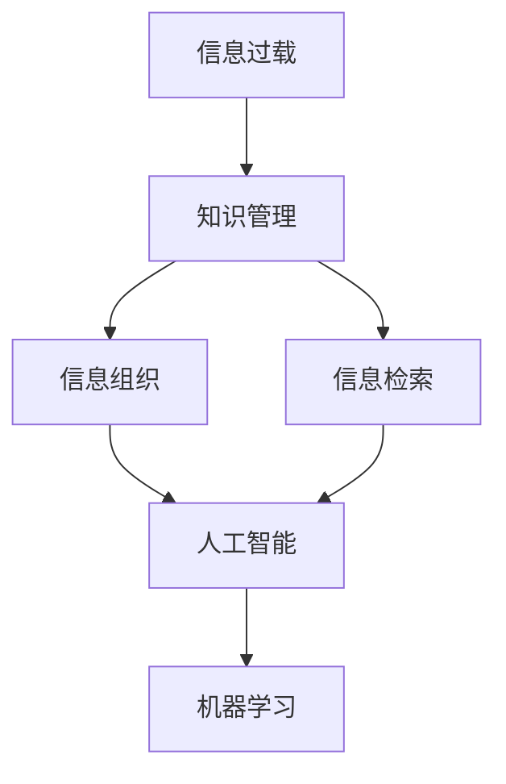

                 

# 信息过载与知识管理策略：有效组织和检索信息的技巧

> 关键词：信息过载,知识管理,组织策略,检索技巧,数据存储,人工智能(AI),机器学习(ML)

## 1. 背景介绍

### 1.1 问题由来
在现代社会，信息无处不在，通过网络、手机、电视等渠道，我们每天都能接收成千上万的各类信息。这种信息爆炸的现象，也被称为"信息过载"（Information Overload）。

信息过载的问题不仅影响我们日常生活，也对我们的工作和学习带来了极大挑战。尤其是知识工作者，如研究人员、工程师、顾问等，他们需要每天面对各种不同领域的信息，如何有效地组织和检索这些信息，就成了一个关键问题。

### 1.2 问题核心关键点
为了应对信息过载的问题，我们需要设计一套有效的知识管理策略，将海量信息转化为有用知识。这包括：
- **组织策略**：有效地组织信息，确保信息有序可查。
- **检索技巧**：高效地检索信息，满足不同场景下的需求。
- **智能处理**：利用AI和ML技术，自动化地处理信息，减少人工干预。

### 1.3 问题研究意义
有效应对信息过载，不仅能提升个人和组织的工作效率，还能挖掘出数据中的更多价值，加速创新和决策。这将对各个行业产生深远影响，包括但不限于医疗、金融、教育、制造业等。

## 2. 核心概念与联系

### 2.1 核心概念概述

在知识管理领域，以下几个核心概念对理解信息过载和知识管理策略至关重要：

- **信息过载**（Information Overload）：指信息量过多，以至于个人或组织无法有效处理，从而影响其认知和决策的能力。

- **知识管理**（Knowledge Management）：指通过一系列策略和技术，将组织内部的显性知识和隐性知识系统化，以实现知识的共享和应用。

- **信息组织**（Information Organization）：指将信息按照一定的规则和结构进行分类、归档，便于后续检索和利用。

- **信息检索**（Information Retrieval）：指通过特定的算法和模型，从大量信息中快速定位和检索出有用的信息。

- **人工智能**（AI）：指使用算法和机器学习技术，让机器能够模拟人类的认知和决策能力，从而辅助或替代人类处理信息。

- **机器学习**（ML）：指让机器通过数据学习，不断优化其处理信息的准确性和效率。

这些核心概念之间的逻辑关系可以通过以下Mermaid流程图来展示：



这个流程图展示了一些核心概念及其之间的关系：

1. 信息过载促使我们采取知识管理策略，通过信息组织和信息检索，提高信息处理效率。
2. 信息组织是知识管理的基础，通过组织策略，将信息有序化。
3. 信息检索是对信息组织的补充，通过检索技巧，快速定位所需信息。
4. 人工智能和机器学习是提高信息处理效率的重要手段，通过智能算法，自动化处理信息。

## 3. 核心算法原理 & 具体操作步骤
### 3.1 算法原理概述

本节将详细介绍信息组织和信息检索的算法原理，以及如何利用AI和ML技术进行信息处理。

### 3.2 算法步骤详解

**3.2.1 信息组织策略**

1. **分类法**：根据信息内容的不同属性进行分类，比如按照主题、作者、日期等进行归档。
2. **主题法**：按照主题或关键词将信息分组，便于按照主题检索。
3. **文档法**：将信息视为独立的文档，按照文档内容进行排序和索引。
4. **元数据法**：为每条信息标注详细的元数据，如作者、发布日期、关键词等，以辅助检索。

**3.2.2 信息检索技术**

1. **关键字检索**：根据输入的关键字在信息数据库中查找相关的文档。
2. **向量空间模型**：将文档表示为向量，根据查询向量和文档向量的相似度进行匹配。
3. **机器学习检索**：使用监督学习算法训练检索模型，如分类、聚类、回归等，提高检索准确率。
4. **深度学习检索**：使用深度学习模型，如图神经网络、BERT等，进一步提升检索效果。

**3.2.3 人工智能与机器学习的应用**

1. **自动化分类**：使用机器学习模型自动对信息进行分类，如使用文本分类模型对新闻进行自动分类。
2. **信息推荐系统**：利用协同过滤、内容推荐等算法，推荐用户可能感兴趣的信息。
3. **信息摘要与压缩**：使用文本摘要模型自动生成文档的摘要，减少信息量。
4. **信息过滤与筛选**：使用过滤算法，根据用户的偏好和兴趣筛选信息。

### 3.3 算法优缺点

**优点**：
1. **效率高**：通过智能算法，可以大幅提升信息处理的效率。
2. **准确性好**：机器学习和深度学习技术可以提供更准确的分类和检索结果。
3. **可扩展性**：算法可以应用于大规模信息处理，无需大量人工干预。

**缺点**：
1. **数据质量要求高**：机器学习模型的效果很大程度上依赖于训练数据的质量。
2. **模型复杂度高**：深度学习模型参数众多，需要较大的计算资源。
3. **算法透明度低**：模型内部的工作机制难以解释，缺乏可解释性。
4. **需要持续更新**：随着数据分布的变化，模型需要定期重新训练。

### 3.4 算法应用领域

信息组织和信息检索技术已经被广泛应用于各种场景中，如：

- **文档管理系统**：企业文档管理，如SharePoint、Google Drive等。
- **搜索引擎**：如Google、Bing等，通过关键词检索技术进行搜索。
- **图书馆系统**：如图书馆的图书管理系统，通过分类法、主题法进行检索。
- **内容推荐系统**：如YouTube、Netflix等，通过协同过滤、内容推荐等算法推荐内容。
- **智能客服系统**：如在线客服、智能助手，通过自然语言处理进行信息检索和分类。

## 4. 数学模型和公式 & 详细讲解 & 举例说明（备注：数学公式请使用latex格式，latex嵌入文中独立段落使用 $$，段落内使用 $)
### 4.1 数学模型构建

在信息检索中，常用的数学模型包括向量空间模型和基于深度学习的模型。

**向量空间模型**：将文档表示为向量，通过余弦相似度计算文档和查询的相似度。

设文档$d_i$的向量表示为$\vec{d_i}$，查询$q$的向量表示为$\vec{q}$，向量空间模型的相似度公式为：

$$
\text{similarity}(d_i, q) = \frac{\vec{d_i} \cdot \vec{q}}{\|\vec{d_i}\| \cdot \|\vec{q}\|}
$$

**深度学习模型**：如BERT、Transformer等，通过学习语言模型中的语义表示，实现更准确的检索。

以BERT模型为例，其检索过程如下：

1. 输入查询$q$和文档$d_i$到BERT模型中，得到它们的向量表示$\vec{q}$和$\vec{d_i}$。
2. 计算查询$q$和文档$d_i$之间的余弦相似度，作为检索结果。

**4.2 公式推导过程**

以向量空间模型为例，推导其相似度计算公式：

设文档$d_i$的向量表示为$\vec{d_i} = [d_{i1}, d_{i2}, ..., d_{in}]$，查询$q$的向量表示为$\vec{q} = [q_1, q_2, ..., q_n]$。向量空间模型的相似度计算公式为：

$$
\text{similarity}(d_i, q) = \frac{\sum_{j=1}^{n}d_{ij}q_j}{\sqrt{\sum_{j=1}^{n}d_{ij}^2}\sqrt{\sum_{j=1}^{n}q_j^2}}
$$

设$\vec{d_i}$和$\vec{q}$的余弦相似度为$\cos(\theta)$，则有：

$$
\cos(\theta) = \frac{\vec{d_i} \cdot \vec{q}}{\|\vec{d_i}\| \cdot \|\vec{q}\|}
$$

因此，向量空间模型的相似度计算公式可以简化为：

$$
\text{similarity}(d_i, q) = \cos(\theta)
$$

**4.3 案例分析与讲解**

以信息推荐系统为例，介绍机器学习模型的应用。

假设一个用户A喜欢电影$M_1$、$M_2$、$M_3$，我们可以使用协同过滤算法对其他用户的偏好进行预测，并找到和用户A兴趣相似的用户B，进而推荐用户B喜欢的电影$M_4$、$M_5$、$M_6$。

协同过滤算法的核心思想是：用户A和用户B对某些电影的评价相似，那么用户B喜欢的电影，用户A也可能会喜欢。

设用户A对电影的评分矩阵为$R_{A}$，用户B对电影的评分矩阵为$R_{B}$，协同过滤算法的相似度计算公式为：

$$
\text{similarity}(A, B) = \frac{\sum_{i=1}^{n}R_{A,i}R_{B,i}}{\sqrt{\sum_{i=1}^{n}R_{A,i}^2}\sqrt{\sum_{i=1}^{n}R_{B,i}^2}}
$$

其中$R_{A,i}$表示用户A对电影$i$的评分，$R_{B,i}$表示用户B对电影$i$的评分。

根据相似度计算结果，我们可以预测用户B喜欢的电影，进而进行推荐。

## 5. 项目实践：代码实例和详细解释说明
### 5.1 开发环境搭建

在进行信息组织和信息检索的实践前，我们需要准备好开发环境。以下是使用Python进行PyTorch开发的环境配置流程：

1. 安装Anaconda：从官网下载并安装Anaconda，用于创建独立的Python环境。

2. 创建并激活虚拟环境：
```bash
conda create -n pytorch-env python=3.8 
conda activate pytorch-env
```

3. 安装PyTorch：根据CUDA版本，从官网获取对应的安装命令。例如：
```bash
conda install pytorch torchvision torchaudio cudatoolkit=11.1 -c pytorch -c conda-forge
```

4. 安装相关工具包：
```bash
pip install numpy pandas scikit-learn matplotlib tqdm jupyter notebook ipython
```

完成上述步骤后，即可在`pytorch-env`环境中开始信息检索和信息组织的开发实践。

### 5.2 源代码详细实现

我们先以信息检索中的向量空间模型为例，给出使用PyTorch进行信息检索的代码实现。

**步骤1：构建向量空间模型**

```python
import torch
import torch.nn as nn

class VectorSpaceModel(nn.Module):
    def __init__(self, embed_dim, n_vocab):
        super().__init__()
        self.emb = nn.Embedding(n_vocab, embed_dim)
        self.fc = nn.Linear(embed_dim, 1)

    def forward(self, x):
        embeddings = self.emb(x)
        scores = self.fc(embeddings)
        return scores
```

**步骤2：训练模型**

```python
from torch.utils.data import TensorDataset, DataLoader
from torch.nn import CrossEntropyLoss

model = VectorSpaceModel(embed_dim=10, n_vocab=1000)
loss_fn = CrossEntropyLoss()

train_dataset = TensorDataset(torch.randn(100, 1000), torch.randint(0, 1000, (100,)))
train_loader = DataLoader(train_dataset, batch_size=32)

optimizer = torch.optim.Adam(model.parameters(), lr=0.01)

for epoch in range(10):
    model.train()
    for i, (input, label) in enumerate(train_loader):
        output = model(input)
        loss = loss_fn(output, label)
        optimizer.zero_grad()
        loss.backward()
        optimizer.step()
```

**步骤3：进行信息检索**

```python
from sklearn.metrics.pairwise import cosine_similarity

model.eval()
input = torch.randn(1, 1000)
output = model(input)

# 计算余弦相似度
similarity = cosine_similarity(output, cosine_similarity(output, output))
```

### 5.3 代码解读与分析

让我们再详细解读一下关键代码的实现细节：

**VectorSpaceModel类**：
- `__init__`方法：初始化Embedding层和线性层。
- `forward`方法：计算输入向量和查询向量的相似度。

**训练过程**：
- 使用PyTorch的DataLoader对数据集进行批次化加载。
- 使用Adam优化器对模型进行训练。
- 计算损失函数，反向传播更新模型参数。
- 重复上述过程，直到模型收敛。

**信息检索过程**：
- 使用cosine_similarity计算输入向量和自身向量之间的余弦相似度，得到模型的检索结果。

## 6. 实际应用场景
### 6.1 智能推荐系统

信息推荐系统是信息检索技术的重要应用之一。通过分析用户的历史行为数据，推荐系统可以为用户推荐感兴趣的内容。

例如，用户A在某电商平台浏览了产品A、B、C，那么推荐系统可以通过协同过滤算法，找到与用户A兴趣相似的用户B，进而推荐用户B喜欢的产品D、E、F。

在技术实现上，推荐系统通常使用TensorFlow或PyTorch等深度学习框架进行训练和推理，利用协同过滤、内容推荐等算法，为用户推荐产品或内容。

### 6.2 搜索引擎

搜索引擎是信息检索技术的另一个重要应用。通过关键词检索，搜索引擎可以快速定位到用户所需的信息。

例如，用户在搜索引擎中输入"Python编程教程"，搜索引擎会返回相关网页，如官方文档、教程网站等。

在技术实现上，搜索引擎通常使用倒排索引等数据结构，结合向量空间模型、TF-IDF等算法，快速检索用户输入的关键词，并返回相关结果。

### 6.3 文档管理系统

文档管理系统是信息组织的重要应用之一。通过分类、归档等方法，文档管理系统可以将大量的文档信息有序化，便于后续检索。

例如，企业可以使用SharePoint等系统，将所有文档按项目、部门、时间等进行分类，便于员工查找和管理。

在技术实现上，文档管理系统通常使用关系型数据库、NoSQL数据库等存储数据，结合分类、归档等方法，进行信息组织。

### 6.4 未来应用展望

随着信息技术的不断进步，信息组织和信息检索技术将在更多领域得到应用，为各行各业带来新的突破。

在智慧城市领域，通过信息检索技术，可以快速定位城市中的重要信息，如灾害预警、交通状况等，提升城市管理的自动化和智能化水平。

在医疗领域，通过信息检索技术，可以快速定位相关文献和病例，辅助医生诊断和治疗，提升医疗服务质量。

在教育领域，通过信息检索技术，可以快速定位教学资源和教学内容，辅助教师备课和学生学习，提升教育效果。

此外，在金融、制造业、零售等众多领域，信息组织和信息检索技术也将不断得到应用，为各行各业带来变革性影响。

## 7. 工具和资源推荐
### 7.1 学习资源推荐

为了帮助开发者系统掌握信息组织和信息检索的理论基础和实践技巧，这里推荐一些优质的学习资源：

1. 《信息检索与文本挖掘》系列书籍：由信息检索领域权威专家编写，涵盖了信息检索的各个方面。

2. CSIRI "Introduction to Information Retrieval"课程：由斯坦福大学提供，介绍了信息检索的基本概念和经典算法。

3. 《自然语言处理与信息检索》课程：由清华大学开设，涵盖了信息检索的理论与实践。

4. Semantic Scholar：一个基于人工智能的信息检索系统，提供了大量相关的论文和研究资源。

5. DSpace：一个开源的数字文档管理系统，提供了丰富的文档组织和管理功能。

通过对这些资源的学习实践，相信你一定能够快速掌握信息组织和信息检索的精髓，并用于解决实际的NLP问题。
###  7.2 开发工具推荐

高效的开发离不开优秀的工具支持。以下是几款用于信息组织和信息检索开发的常用工具：

1. Python：开源编程语言，适合数据处理和算法开发。
2. PyTorch：基于Python的深度学习框架，适合信息检索任务的开发。
3. TensorFlow：由Google主导开发的深度学习框架，生产部署方便。
4. Elasticsearch：开源搜索和分析引擎，适合构建搜索引擎和文档管理系统。
5. Apache Solr：一个基于Lucene的搜索引擎，支持大规模数据检索。

合理利用这些工具，可以显著提升信息组织和信息检索任务的开发效率，加快创新迭代的步伐。

### 7.3 相关论文推荐

信息组织和信息检索技术的发展源于学界的持续研究。以下是几篇奠基性的相关论文，推荐阅读：

1. "An Introduction to Information Retrieval" by Christopher D. Manning et al.：介绍了信息检索的基本概念和算法。
2. "The SMART Framework for Web-Scale Information Retrieval" by Alistair C. Guttag et al.：介绍了Web规模信息检索的框架和方法。
3. "Word2Vec" by Mikolov et al.：介绍了Word2Vec模型的算法和应用。
4. "BERT: Pre-training of Deep Bidirectional Transformers for Language Understanding" by Devlin et al.：介绍了BERT模型的算法和应用。
5. "Adversarial Machine Learning" by Ian J. Goodfellow et al.：介绍了对抗学习的方法和应用，可以用于提高信息检索的鲁棒性。

这些论文代表了大语言模型微调技术的发展脉络。通过学习这些前沿成果，可以帮助研究者把握学科前进方向，激发更多的创新灵感。

## 8. 总结：未来发展趋势与挑战
### 8.1 总结

本文对信息过载和知识管理策略进行了全面系统的介绍。首先阐述了信息过载和知识管理策略的研究背景和意义，明确了信息组织和信息检索策略在信息管理中的关键作用。其次，从原理到实践，详细讲解了信息检索和信息组织的核心算法和具体操作步骤，给出了信息检索任务的完整代码实例。同时，本文还广泛探讨了信息检索技术在智慧城市、医疗、教育等多个行业领域的应用前景，展示了信息检索范式的巨大潜力。

通过本文的系统梳理，可以看到，信息检索技术正在成为信息管理的重要范式，极大地拓展了信息处理的应用边界，催生了更多的落地场景。伴随信息技术的不断进步，信息检索技术还将不断演进，未来将有更多智能化的信息组织和检索系统出现。

### 8.2 未来发展趋势

展望未来，信息检索技术将呈现以下几个发展趋势：

1. **智能化水平提升**：随着深度学习等AI技术的进步，信息检索的智能化水平将不断提升，检索结果将更加精准。
2. **多模态融合**：未来的信息检索系统将不仅仅关注文本信息，而是结合图像、视频、语音等多种信息，进行更全面的检索。
3. **个性化推荐**：信息检索系统将更多地考虑用户偏好和行为，实现个性化推荐，提升用户体验。
4. **实时处理能力**：信息检索系统将具备更强的实时处理能力，能够快速响应用户查询，满足实时需求。
5. **分布式计算**：信息检索系统将更多地采用分布式计算技术，提升数据处理能力和系统扩展性。

以上趋势凸显了信息检索技术的发展方向。这些方向的探索发展，必将进一步提升信息检索系统的性能和应用范围，为各行各业带来更多的价值。

### 8.3 面临的挑战

尽管信息检索技术已经取得了长足的进步，但在迈向更加智能化、普适化应用的过程中，它仍面临着诸多挑战：

1. **数据质量**：信息检索的效果很大程度上依赖于训练数据的质量，低质量的标注数据会导致检索效果下降。
2. **计算资源消耗**：深度学习等技术需要大量的计算资源，如何优化算法和模型，减少计算消耗，是未来的一个重要方向。
3. **可解释性不足**：信息检索模型往往是"黑盒"系统，难以解释其内部工作机制，缺乏可解释性。
4. **数据隐私问题**：信息检索系统需要处理大量的个人数据，如何保护用户隐私，是一个重要的问题。
5. **跨领域应用难度**：不同领域的数据结构和信息检索需求差异较大，如何将通用技术应用于特定领域，是一个挑战。

### 8.4 研究展望

面对信息检索技术所面临的挑战，未来的研究需要在以下几个方面寻求新的突破：

1. **无监督和半监督学习**：摆脱对大规模标注数据的依赖，利用无监督和半监督学习，最大化利用非结构化数据。
2. **分布式和异构数据处理**：开发分布式和异构数据处理技术，提升系统处理大规模数据的能力。
3. **可解释性提升**：研究可解释性技术，提升信息检索系统的可解释性和透明度。
4. **隐私保护**：开发隐私保护技术，保护用户隐私，提升系统安全性。
5. **跨领域应用**：探索如何将通用技术应用于特定领域，提升系统的普适性。

这些研究方向将推动信息检索技术的发展，让信息检索系统更加智能化、普适化，满足更多场景的需求。

## 9. 附录：常见问题与解答

**Q1：如何高效构建信息检索系统？**

A: 构建信息检索系统需要以下几个步骤：
1. 数据准备：收集并预处理数据，包括文本分词、去除停用词等。
2. 模型选择：选择合适的信息检索模型，如向量空间模型、深度学习模型等。
3. 训练模型：使用标注数据训练模型，优化模型参数。
4. 模型评估：在测试数据集上评估模型性能，调整模型参数。
5. 部署系统：将训练好的模型部署到生产环境，进行实时检索。

**Q2：如何进行信息检索的优化？**

A: 信息检索的优化可以从以下几个方面入手：
1. 数据预处理：提高数据质量，减少噪声和干扰。
2. 模型选择：选择更合适的模型，提升检索效果。
3. 特征工程：设计更有效的特征提取方法，提高特征质量。
4. 调参优化：通过超参数调整，优化模型性能。
5. 分布式处理：采用分布式计算技术，提升系统处理能力。

**Q3：如何提高信息检索系统的可解释性？**

A: 信息检索系统的可解释性可以从以下几个方面入手：
1. 特征可视化：使用特征可视化工具，展示模型特征。
2. 模型透明化：设计更透明的模型，便于理解其工作机制。
3. 解释算法：引入可解释算法，如LIME、SHAP等，生成模型解释。
4. 人工干预：通过人工干预和审核，增强系统的可解释性。

**Q4：如何保护信息检索系统的隐私？**

A: 信息检索系统的隐私保护可以从以下几个方面入手：
1. 数据匿名化：使用数据匿名化技术，保护用户隐私。
2. 访问控制：使用访问控制技术，限制用户权限。
3. 数据加密：对敏感数据进行加密，保护数据安全。
4. 隐私合规：遵守隐私保护法规和标准，如GDPR等。

**Q5：如何将信息检索技术应用于智慧城市？**

A: 信息检索技术在智慧城市中的应用主要包括以下几个方面：
1. 城市事件监测：通过信息检索系统，快速定位城市事件，如火灾、交通事故等。
2. 舆情分析：使用信息检索系统，分析城市舆情，如群众诉求、舆情热点等。
3. 应急指挥：通过信息检索系统，快速获取应急信息，制定应急方案。
4. 智能交通：使用信息检索系统，分析交通数据，优化交通管理。

通过信息检索技术，智慧城市可以实现高效的城市管理，提升城市居民的生活质量。

---

作者：禅与计算机程序设计艺术 / Zen and the Art of Computer Programming

