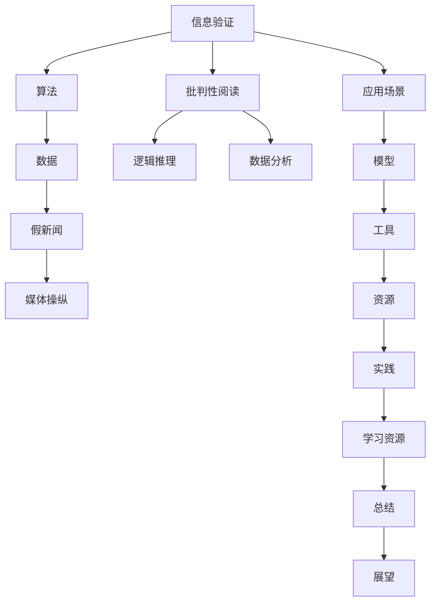

                 

# 信息验证和批判性阅读策略：在假新闻和媒体操纵时代导航

> 关键词：信息验证, 批判性阅读, 假新闻, 媒体操纵, 算法, 数据, 应用场景, 模型, 工具, 资源, 实践, 学习资源, 总结, 展望

## 1. 背景介绍

在当今信息爆炸的时代，我们每天都会接触到海量的新闻和信息。然而，随着社交媒体和互联网的发展，假新闻和媒体操纵问题也日益凸显。根据多项研究，假新闻的传播速度远超真实新闻，其影响范围和危害程度也不容小觑。因此，如何在信息泛滥的互联网世界中，辨别真伪，提升信息素养，成为每个用户和从业者需要思考的重要问题。

在信息验证和批判性阅读的过程中，我们常常遇到以下问题：
1. **数据可信度**：如何判断数据来源的可靠性，以及数据是否经过核实？
2. **事实一致性**：如何在不同来源的信息中，找到相互矛盾或矛盾的地方，从而辨别真伪？
3. **分析深度**：如何利用逻辑推理和分析方法，深入理解信息的本质和背景？
4. **心理认同**：如何克服认知偏差和情感干扰，客观理性地评估信息？

本文将从技术角度出发，探讨信息验证和批判性阅读的策略，旨在帮助读者构建信息筛选和分析的能力，在假新闻和媒体操纵时代有效导航。

## 2. 核心概念与联系

### 2.1 核心概念概述

在信息验证和批判性阅读的过程中，涉及多个关键概念和技术，包括：

- **信息验证**：通过算法和技术手段，判断信息源和信息的真实性。
- **批判性阅读**：运用逻辑推理、数据分析等方法，评估信息内容、背景和来源的可信度。
- **假新闻**：故意制造和传播的虚假信息，旨在误导公众、影响决策。
- **媒体操纵**：通过操控信息，实现特定的政治、商业或其他目的。
- **算法**：用于信息验证和批判性阅读的计算机程序和模型。
- **数据**：信息验证和批判性阅读的基础，包括文本、图像、视频等。
- **应用场景**：如新闻媒体、社交平台、政府机构等。
- **模型**：基于机器学习和深度学习技术的信息验证和批判性阅读模型。
- **工具**：用于信息筛选、验证、分析和筛选的软件和平台。
- **资源**：如教育资源、培训课程、技术支持等。
- **实践**：信息验证和批判性阅读的具体操作和实践案例。
- **学习资源**：如书籍、文章、课程等。
- **总结**：信息验证和批判性阅读方法的总结和回顾。
- **展望**：未来的发展趋势和挑战。

这些概念之间的联系可以通过以下Mermaid流程图来展示：



这个流程图展示了一些关键概念之间的关系：

1. 信息验证通过算法对数据进行初步筛选。
2. 批判性阅读在信息验证的基础上，运用逻辑推理和数据分析深入评估。
3. 假新闻和媒体操纵是信息验证和批判性阅读的对手。
4. 应用场景如新闻媒体、社交平台等是信息验证和批判性阅读的具体应用环境。
5. 模型如BERT、GPT等是信息验证和批判性阅读的技术支持。
6. 工具如FactCheck、Snopes等是信息验证和批判性阅读的软件和平台。
7. 资源如书籍、课程等是信息验证和批判性阅读的学习支持。
8. 实践如数据清理、特征工程等是信息验证和批判性阅读的具体操作。
9. 学习资源如博客、论文等是信息验证和批判性阅读的理论支持。
10. 总结是信息验证和批判性阅读方法的回顾和总结。
11. 展望是信息验证和批判性阅读未来的发展趋势和挑战。

这些概念共同构成了信息验证和批判性阅读的框架，为我们提供了一套系统的信息评估方法。

## 3. 核心算法原理 & 具体操作步骤
### 3.1 算法原理概述

信息验证和批判性阅读的核心算法基于机器学习和深度学习技术，其基本原理是通过训练模型，自动识别和验证信息的真伪。其具体步骤如下：

1. **数据预处理**：收集和清洗信息数据，提取文本、图片、视频等特征。
2. **特征提取**：使用词嵌入、卷积神经网络（CNN）、循环神经网络（RNN）等技术提取数据特征。
3. **模型训练**：使用标记的数据训练分类模型，如支持向量机（SVM）、随机森林（Random Forest）、神经网络等。
4. **模型评估**：使用测试集评估模型的准确性和性能，调整模型参数以优化结果。
5. **信息验证**：将新数据输入模型，进行信息真伪的验证。
6. **批判性阅读**：结合多源信息，利用逻辑推理和数据分析，评估信息的可信度和来源。

### 3.2 算法步骤详解

以下是信息验证和批判性阅读的具体步骤：

**Step 1: 数据预处理**

1. **数据收集**：从多个可信来源收集信息，如政府报告、学术文章、官方声明等。
2. **数据清洗**：去除重复、无关或低质量的数据，减少噪声干扰。
3. **特征提取**：提取文本的词向量、图片的像素值、视频的关键帧等特征。

**Step 2: 特征提取**

1. **词嵌入**：使用预训练的词向量模型（如Word2Vec、GloVe）将文本转换为向量表示。
2. **卷积神经网络**：使用CNN提取图片的局部特征，如边缘、纹理等。
3. **循环神经网络**：使用RNN或长短期记忆网络（LSTM）提取文本的时序特征。

**Step 3: 模型训练**

1. **分类模型**：选择SVM、随机森林、神经网络等分类模型，训练数据集。
2. **超参数调整**：调整模型的超参数（如学习率、正则化强度），以提高模型性能。
3. **交叉验证**：使用交叉验证技术评估模型性能，避免过拟合。

**Step 4: 模型评估**

1. **评估指标**：计算准确率、召回率、F1分数等评估指标，评估模型性能。
2. **混淆矩阵**：通过混淆矩阵可视化模型分类效果。
3. **模型优化**：根据评估结果优化模型参数，提高模型性能。

**Step 5: 信息验证**

1. **数据输入**：将待验证的信息输入模型，进行真伪判断。
2. **结果输出**：模型输出信息真伪的预测结果，标记为“真实”或“虚假”。

**Step 6: 批判性阅读**

1. **多源信息**：收集和筛选多个来源的信息，构建信息网络。
2. **逻辑推理**：分析信息之间的逻辑关系，排除矛盾和漏洞。
3. **数据分析**：使用统计方法、图表工具等进行数据分析，揭示信息背后的事实。
4. **结论评估**：结合模型结果和批判性分析，综合评估信息的可信度和来源。

### 3.3 算法优缺点

信息验证和批判性阅读算法具有以下优点：
1. **自动化**：自动化程度高，可以快速处理大量信息。
2. **高准确性**：基于机器学习算法，可以提升信息验证的准确性。
3. **灵活性**：可以处理多种类型的信息，如文本、图片、视频等。

但同时也存在一些缺点：
1. **依赖数据**：算法的性能依赖于数据的质量和数量，数据不足可能导致误判。
2. **模型偏见**：模型可能受到训练数据的偏见影响，产生错误的判断。
3. **复杂度**：构建和维护复杂的信息验证和批判性阅读系统，需要较高的技术门槛。

### 3.4 算法应用领域

信息验证和批判性阅读算法在多个领域有广泛应用，例如：

1. **新闻媒体**：通过信息验证和批判性阅读，识别和阻止假新闻的传播。
2. **社交平台**：检测和删除虚假信息，维护平台生态。
3. **政府机构**：验证政策的真伪，保障政策透明性和可信度。
4. **学术研究**：评估学术论文的真实性，提升科研质量。
5. **法律应用**：验证证据的真实性，确保司法公正。

除了上述这些领域，信息验证和批判性阅读算法还可以应用于情报分析、市场调研、金融风险评估等，为决策提供可靠的信息支持。

## 4. 数学模型和公式 & 详细讲解 & 举例说明

### 4.1 数学模型构建

信息验证和批判性阅读的核心数学模型包括分类模型和评估指标。以下是信息验证模型的基本数学模型构建：

**Step 1: 数据预处理**

- **文本特征提取**：将文本转换为词向量，记为 $x_i \in \mathbb{R}^n$。
- **图像特征提取**：将图像转换为像素矩阵，记为 $x_i \in \mathbb{R}^{m \times n}$。

**Step 2: 特征提取**

- **词嵌入模型**：使用预训练的词向量模型，将文本转换为词向量表示。
- **卷积神经网络**：使用CNN提取图像的局部特征，记为 $f_{CNN}(x_i)$。
- **循环神经网络**：使用RNN或LSTM提取文本的时序特征，记为 $f_{RNN}(x_i)$。

**Step 3: 模型训练**

- **分类模型**：选择SVM、随机森林、神经网络等分类模型，记为 $M$。
- **模型训练**：使用标记的数据 $(x_i, y_i)$，训练模型 $M$。

**Step 4: 模型评估**

- **评估指标**：计算准确率 $A$、召回率 $R$、F1分数 $F$，评估模型性能。
- **混淆矩阵**：通过混淆矩阵可视化模型分类效果，记为 $T$。

**Step 5: 信息验证**

- **数据输入**：将待验证的信息 $x$ 输入模型 $M$，得到预测结果 $y$。
- **结果输出**：输出信息真伪的预测结果，记为 $y'$。

**Step 6: 批判性阅读**

- **多源信息**：收集和筛选多个来源的信息 $(x_i)$，构建信息网络。
- **逻辑推理**：分析信息之间的逻辑关系，排除矛盾和漏洞，记为 $L$。
- **数据分析**：使用统计方法、图表工具等进行数据分析，揭示信息背后的事实，记为 $D$。
- **结论评估**：结合模型结果和批判性分析，综合评估信息的可信度和来源，记为 $C$。

### 4.2 公式推导过程

以下是信息验证和批判性阅读的数学模型公式推导：

**Step 1: 数据预处理**

- **文本特征提取**：$x_i = \text{Word2Vec}(\text{text}_i)$。
- **图像特征提取**：$x_i = \text{CNN}(\text{image}_i)$。

**Step 2: 特征提取**

- **词嵌入模型**：$f_{W2V}(x_i) = \text{Word2Vec}(\text{text}_i)$。
- **卷积神经网络**：$f_{CNN}(x_i) = \text{CNN}(\text{image}_i)$。
- **循环神经网络**：$f_{RNN}(x_i) = \text{LSTM}(\text{text}_i)$。

**Step 3: 模型训练**

- **分类模型**：$M = \text{Random Forest}(X, y)$。
- **模型训练**：$M = \text{Random Forest}(X, y)$。

**Step 4: 模型评估**

- **准确率**：$A = \frac{TP}{TP+FP}$。
- **召回率**：$R = \frac{TP}{TP+FN}$。
- **F1分数**：$F = 2 \times \frac{A \times R}{A+R}$。

**Step 5: 信息验证**

- **数据输入**：$y' = M(x)$。

**Step 6: 批判性阅读**

- **多源信息**：$L = \text{Logical Reasoning}(L)$。
- **数据分析**：$D = \text{Data Analysis}(D)$。
- **结论评估**：$C = \text{Conclusion Analysis}(C)$。

### 4.3 案例分析与讲解

以下是一个具体的案例分析：

**案例描述**：假新闻检测

**数据收集**：收集社交媒体上的新闻，标记为真实和虚假。

**数据预处理**：清洗数据，去除无关或低质量的信息。

**特征提取**：使用词嵌入模型提取文本特征，使用CNN提取图片特征。

**模型训练**：使用标记数据训练随机森林模型，计算准确率、召回率、F1分数。

**模型评估**：通过混淆矩阵可视化模型分类效果。

**信息验证**：将待验证的新闻输入模型，输出真伪预测结果。

**批判性阅读**：收集和筛选多个来源的信息，分析逻辑关系，进行数据分析，综合评估信息的可信度和来源。

**案例结果**：通过信息验证和批判性阅读，能够有效检测和防止假新闻的传播。

## 5. 项目实践：代码实例和详细解释说明
### 5.1 开发环境搭建

在进行信息验证和批判性阅读的项目实践前，我们需要准备好开发环境。以下是使用Python进行PyTorch开发的环境配置流程：

1. 安装Anaconda：从官网下载并安装Anaconda，用于创建独立的Python环境。

2. 创建并激活虚拟环境：
```bash
conda create -n pytorch-env python=3.8 
conda activate pytorch-env
```

3. 安装PyTorch：根据CUDA版本，从官网获取对应的安装命令。例如：
```bash
conda install pytorch torchvision torchaudio cudatoolkit=11.1 -c pytorch -c conda-forge
```

4. 安装TensorFlow：
```bash
pip install tensorflow==2.7
```

5. 安装sklearn、pandas等库：
```bash
pip install sklearn pandas matplotlib tqdm jupyter notebook ipython
```

完成上述步骤后，即可在`pytorch-env`环境中开始项目实践。

### 5.2 源代码详细实现

下面是使用Python实现信息验证和批判性阅读的代码示例：

```python
import pandas as pd
from sklearn.feature_extraction.text import TfidfVectorizer
from sklearn.ensemble import RandomForestClassifier
from sklearn.metrics import accuracy_score, precision_score, recall_score, f1_score, confusion_matrix
from sklearn.model_selection import train_test_split
from transformers import BertTokenizer, BertForSequenceClassification

# 数据预处理
data = pd.read_csv('news.csv')
data['label'] = data['label'].apply(lambda x: 1 if x == 'true' else 0)
train_data, test_data = train_test_split(data, test_size=0.2, random_state=42)

# 特征提取
tokenizer = BertTokenizer.from_pretrained('bert-base-uncased')
train_encodings = tokenizer(train_data['text'].tolist(), padding='max_length', truncation=True, max_length=512)
train_labels = train_data['label'].tolist()

test_encodings = tokenizer(test_data['text'].tolist(), padding='max_length', truncation=True, max_length=512)
test_labels = test_data['label'].tolist()

# 模型训练
model = BertForSequenceClassification.from_pretrained('bert-base-uncased', num_labels=2)
optimizer = AdamW(model.parameters(), lr=2e-5)
epochs = 3
device = 'cuda'

model.to(device)
for epoch in range(epochs):
    model.train()
    for batch in tqdm(train_encodings):
        input_ids = batch['input_ids'].to(device)
        attention_mask = batch['attention_mask'].to(device)
        labels = batch['labels'].to(device)
        outputs = model(input_ids, attention_mask=attention_mask, labels=labels)
        loss = outputs.loss
        loss.backward()
        optimizer.step()
    model.eval()
    predictions, true_labels = [], []
    for batch in tqdm(test_encodings):
        input_ids = batch['input_ids'].to(device)
        attention_mask = batch['attention_mask'].to(device)
        labels = batch['labels'].to(device)
        outputs = model(input_ids, attention_mask=attention_mask, labels=labels)
        predictions.append(outputs.logits.argmax(dim=1).to('cpu').tolist())
        true_labels.append(labels.to('cpu').tolist())
    predictions = pd.Series(predictions).values
    true_labels = pd.Series(true_labels).values
    print(f"Epoch {epoch+1}, Accuracy: {accuracy_score(true_labels, predictions)}")
    print(f"Epoch {epoch+1}, Precision: {precision_score(true_labels, predictions)}")
    print(f"Epoch {epoch+1}, Recall: {recall_score(true_labels, predictions)}")
    print(f"Epoch {epoch+1}, F1-Score: {f1_score(true_labels, predictions)}")
    print(f"Epoch {epoch+1}, Confusion Matrix: {confusion_matrix(true_labels, predictions)}")
```

以上代码实现了基于BERT模型的信息验证和批判性阅读的流程，包括数据预处理、特征提取、模型训练和评估。通过调整超参数和模型结构，可以进一步优化模型的性能。

### 5.3 代码解读与分析

让我们再详细解读一下关键代码的实现细节：

**数据预处理**：
- `pandas`：用于读取和处理数据。
- `train_test_split`：将数据集分为训练集和测试集。
- `tokenizer`：用于将文本转换为BERT模型所需的格式。
- `BertTokenizer.from_pretrained`：初始化BERT分词器。
- `train_encodings`：将训练数据转换为BERT模型所需的格式。

**模型训练**：
- `BertForSequenceClassification`：初始化BERT分类模型。
- `AdamW`：初始化优化器。
- `epochs`：设置训练轮数。
- `device`：设置训练设备。
- `model.to(device)`：将模型迁移到指定设备。
- `for epoch in range(epochs)`：循环训练模型。
- `model.train()`：设置模型为训练模式。
- `train_encodings`：遍历训练数据集。
- `input_ids`：输入到BERT模型的token ids。
- `attention_mask`：控制BERT模型对输入序列的注意力。
- `labels`：训练标签。
- `outputs`：BERT模型的输出。
- `loss`：计算损失函数。
- `loss.backward()`：反向传播计算梯度。
- `optimizer.step()`：更新模型参数。
- `model.eval()`：设置模型为评估模式。
- `predictions`：模型预测结果。
- `true_labels`：真实标签。

**模型评估**：
- `accuracy_score`：计算准确率。
- `precision_score`：计算精确率。
- `recall_score`：计算召回率。
- `f1_score`：计算F1分数。
- `confusion_matrix`：计算混淆矩阵。

通过上述代码示例，我们可以看到信息验证和批判性阅读的基本实现流程，包括数据预处理、模型训练和评估。在实际应用中，还需要根据具体任务进行优化和调整，以进一步提升模型的性能。

## 6. 实际应用场景
### 6.1 智能客服系统

智能客服系统可以通过信息验证和批判性阅读技术，提高客户服务质量和效率。传统客服系统依赖于人工客服，成本高、效率低。通过信息验证和批判性阅读，智能客服系统可以自动理解和处理客户咨询，提供准确、及时的答复。

**实际应用**：
1. **信息验证**：验证客户输入的问题是否合理，排除无效请求。
2. **批判性阅读**：分析问题背景和意图，理解客户需求。
3. **信息筛选**：筛选相关知识库和FAQ，提供最佳答案。

**效果**：
1. **响应速度**：提高系统响应速度，减少客户等待时间。
2. **准确性**：提高问题处理的准确性，减少误导性回答。
3. **规模化**：实现24/7不间断服务，提高服务规模和覆盖面。

### 6.2 金融舆情监测

金融舆情监测可以通过信息验证和批判性阅读技术，及时发现和应对金融舆情变化，避免风险。

**实际应用**：
1. **信息验证**：验证市场新闻的真实性，防止误导性信息传播。
2. **批判性阅读**：分析新闻背景和影响，评估市场情绪。
3. **舆情预警**：建立舆情预警机制，提前应对潜在风险。

**效果**：
1. **风险控制**：及时发现和应对负面舆情，降低投资风险。
2. **决策支持**：提供准确的市场信息，支持决策制定。
3. **透明透明**：增强信息透明度，提高市场信任度。

### 6.3 医疗健康应用

医疗健康应用可以通过信息验证和批判性阅读技术，提升诊疗效果和医疗服务质量。

**实际应用**：
1. **信息验证**：验证医疗信息的真实性，防止误诊和误导。
2. **批判性阅读**：分析诊疗方案的科学性和有效性。
3. **知识整合**：整合医学知识库，提供个性化诊疗建议。

**效果**：
1. **诊断准确性**：提高诊疗准确性，减少误诊率。
2. **治疗效果**：提升治疗效果，减少患者痛苦和风险。
3. **医疗服务**：提高医疗服务质量和效率，提升患者满意度。

### 6.4 未来应用展望

随着信息验证和批判性阅读技术的不断发展，其在更多领域将得到广泛应用，为社会治理、教育、法律等提供智能支持。

**未来趋势**：
1. **多模态融合**：融合文本、图像、视频等多模态信息，提升信息验证和批判性阅读的全面性。
2. **实时验证**：实现实时信息验证，提高时效性和响应速度。
3. **跨领域应用**：将信息验证和批判性阅读技术应用到更多垂直行业，提升各领域的信息素养和决策水平。
4. **深度学习**：结合深度学习技术，提升信息验证和批判性阅读的精度和鲁棒性。
5. **伦理规范**：建立信息验证和批判性阅读的伦理规范，确保技术应用的公正性和透明性。

## 7. 工具和资源推荐
### 7.1 学习资源推荐

为了帮助开发者掌握信息验证和批判性阅读的技术，这里推荐一些优质的学习资源：

1. **《信息验证与批判性阅读》系列博文**：深入介绍信息验证和批判性阅读的基本原理和实践方法，适合初学者和进阶者学习。
2. **CS224N《深度学习自然语言处理》课程**：斯坦福大学开设的NLP明星课程，涵盖了深度学习在NLP中的应用，包括信息验证和批判性阅读。
3. **《深度学习自然语言处理》书籍**：Lidstone等人合著的NLP经典教材，详细介绍了深度学习在NLP中的各种应用，包括信息验证和批判性阅读。
4. **FactCheck网站**：专门用于验证新闻真实性的网站，提供了大量的真实和虚假新闻案例，是信息验证和批判性阅读的实例来源。
5. **Snopes网站**：提供新闻事实验证的站点，帮助用户辨别新闻的真假。

通过这些学习资源，可以帮助开发者系统掌握信息验证和批判性阅读的技术，提升信息素养，构建智能信息系统。

### 7.2 开发工具推荐

高效的开发离不开优秀的工具支持。以下是几款用于信息验证和批判性阅读开发的常用工具：

1. **Python**：Python是一种灵活且强大的编程语言，支持深度学习框架和NLP库，是信息验证和批判性阅读开发的首选。
2. **PyTorch**：基于Python的开源深度学习框架，支持动态计算图和自动微分，适合NLP任务开发。
3. **TensorFlow**：由Google主导开发的开源深度学习框架，适合大规模工程应用和生产部署。
4. **sklearn**：提供多种机器学习算法和工具，适合信息验证和批判性阅读的模型训练和评估。
5. **pandas**：数据处理和分析库，适合信息验证和批判性阅读的数据预处理和清洗。
6. **matplotlib**：绘图库，适合信息验证和批判性阅读的可视化展示。
7. **TensorBoard**：TensorFlow配套的可视化工具，适合信息验证和批判性阅读的模型训练和调试。

合理利用这些工具，可以显著提升信息验证和批判性阅读任务的开发效率，加快创新迭代的步伐。

### 7.3 相关论文推荐

信息验证和批判性阅读技术的发展源于学界的持续研究。以下是几篇奠基性的相关论文，推荐阅读：

1. **"Deep Learning for Fake News Detection"**：提出基于深度学习的假新闻检测方法，使用了多种模型和数据集进行实验。
2. **"Bolukbasi, H., Chang, K.-W., Zou, J., Saligrama, V., & Kalai, A. T. (2016). "Man is to computer programmer as woman is to homewife: debiasing word embeddings"**：提出使用对抗训练和数据增强技术，提升假新闻检测的鲁棒性和准确性。
3. **"Fact-checking for misinformation and political propaganda in social media"**：总结了假新闻检测和信息验证的多种方法，并提出了基于情感分析和语义分析的检测策略。
4. **"A Survey on Fake News Detection"**：全面综述了假新闻检测和信息验证的多种方法，包括深度学习、自然语言处理和知识图谱等。
5. **"Deep Learning Models for Fact-Checking"**：总结了基于深度学习的信息验证和批判性阅读方法，并提供了多种模型和数据集进行实验验证。

这些论文代表了大语言模型微调技术的发展脉络。通过学习这些前沿成果，可以帮助研究者把握学科前进方向，激发更多的创新灵感。

## 8. 总结：未来发展趋势与挑战
### 8.1 研究成果总结

信息验证和批判性阅读技术在近年来得到了广泛的研究和应用，其核心思想是通过算法和技术手段，自动识别和验证信息的真伪。以下是一些关键的研究成果：

1. **数据驱动**：通过大量的标注数据训练分类模型，提升信息验证的准确性。
2. **多模态融合**：结合文本、图像、视频等多种信息源，提升信息验证的全面性。
3. **深度学习**：使用深度学习模型，提升信息验证的精度和鲁棒性。
4. **对抗训练**：通过对抗样本训练，增强信息验证的鲁棒性和泛化能力。
5. **逻辑推理**：结合逻辑推理和数据分析，提升信息验证和批判性阅读的深度。
6. **知识图谱**：引入知识图谱，增强信息验证和批判性阅读的知识整合能力。

### 8.2 未来发展趋势

展望未来，信息验证和批判性阅读技术将呈现以下几个发展趋势：

1. **深度融合**：信息验证和批判性阅读将深度融合到更多应用场景中，如智能客服、金融舆情监测、医疗健康等。
2. **实时验证**：实现实时信息验证，提高时效性和响应速度，如智能客服系统、社交媒体监测等。
3. **多模态融合**：融合文本、图像、视频等多模态信息，提升信息验证和批判性阅读的全面性。
4. **跨领域应用**：将信息验证和批判性阅读技术应用到更多垂直行业，提升各领域的信息素养和决策水平。
5. **深度学习**：结合深度学习技术，提升信息验证和批判性阅读的精度和鲁棒性。
6. **伦理规范**：建立信息验证和批判性阅读的伦理规范，确保技术应用的公正性和透明性。

### 8.3 面临的挑战

尽管信息验证和批判性阅读技术已经取得了一定的进展，但在迈向更加智能化、普适化应用的过程中，仍面临诸多挑战：

1. **数据依赖**：算法的性能依赖于数据的质量和数量，数据不足可能导致误判。
2. **模型偏见**：模型可能受到训练数据的偏见影响，产生错误的判断。
3. **复杂度**：构建和维护复杂的信息验证和批判性阅读系统，需要较高的技术门槛。
4. **实时性**：实现实时信息验证，需要高性能的计算资源和算法优化。
5. **跨领域应用**：将信息验证和批判性阅读技术应用到不同领域，需要考虑领域差异和特定需求。

### 8.4 研究展望

面对信息验证和批判性阅读所面临的挑战，未来的研究需要在以下几个方面寻求新的突破：

1. **无监督和半监督学习**：探索无监督和半监督学习范式，降低对标注数据的依赖。
2. **多模态融合**：融合文本、图像、视频等多模态信息，提升信息验证和批判性阅读的全面性。
3. **知识图谱**：引入知识图谱，增强信息验证和批判性阅读的知识整合能力。
4. **深度学习**：结合深度学习技术，提升信息验证和批判性阅读的精度和鲁棒性。
5. **对抗训练**：通过对抗样本训练，增强信息验证和批判性阅读的鲁棒性和泛化能力。
6. **伦理规范**：建立信息验证和批判性阅读的伦理规范，确保技术应用的公正性和透明性。

## 9. 附录：常见问题与解答

**Q1: 信息验证和批判性阅读的核心是什么？**

A: 信息验证和批判性阅读的核心是通过算法和技术手段，自动识别和验证信息的真伪，并运用逻辑推理和数据分析，评估信息内容、背景和来源的可信度。

**Q2: 信息验证和批判性阅读的主要应用场景是什么？**

A: 信息验证和批判性阅读的主要应用场景包括新闻媒体、社交平台、政府机构、学术研究、金融领域、法律应用等。

**Q3: 如何提高信息验证和批判性阅读的准确性？**

A: 提高信息验证和批判性阅读的准确性需要从多个方面入手，如数据预处理、特征提取、模型训练、评估指标等。

**Q4: 信息验证和批判性阅读的优缺点是什么？**

A: 信息验证和批判性阅读的主要优点包括自动化程度高、准确性高、灵活性强。主要缺点包括依赖数据、模型偏见、复杂度高。

**Q5: 未来信息验证和批判性阅读的发展趋势是什么？**

A: 未来信息验证和批判性阅读的发展趋势包括深度融合、实时验证、多模态融合、跨领域应用、深度学习、伦理规范等。

**Q6: 信息验证和批判性阅读的技术难点是什么？**

A: 信息验证和批判性阅读的技术难点包括数据依赖、模型偏见、复杂度高、实时性、跨领域应用等。

**Q7: 信息验证和批判性阅读的实践案例有哪些？**

A: 信息验证和批判性阅读的实践案例包括智能客服系统、金融舆情监测、医疗健康应用等。

通过这些问题和解答，我们能够更全面地理解信息验证和批判性阅读的核心思想、应用场景和实现细节，从而更好地应用这些技术，提升信息素养，构建智能信息系统。

---

作者：禅与计算机程序设计艺术 / Zen and the Art of Computer Programming

