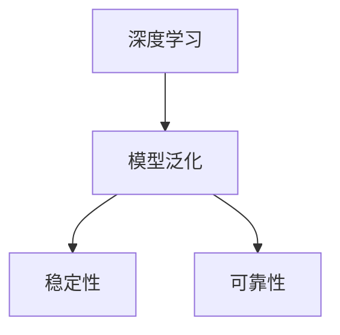

                 

# 像数学家一样思考：不变性原理

> 关键词：
- 数学
- 物理
- 计算机科学
- 人工智能
- 不变性原理
- 深度学习
- 机器学习
- 理论推导
- 实践应用

## 1. 背景介绍

### 1.1 问题由来
在现代科学技术的各个领域，从物理到计算机科学，不变性原理（Invariance Principle）始终是一个核心概念。不变性原理指的是，某个系统或物理定律在不同参考系下保持不变，即不会因为观察者的变化而改变其本质特征。这一原理深刻地影响了物理学的发展，使得我们能够通过实验验证各种自然规律，并发展出强大的数学工具来描述和预测物理现象。

同样，在计算机科学中，不变性原理也具有重要意义。在机器学习和深度学习的背景下，不变性原理指导着模型设计、算法优化和应用实践的方方面面。本文将深入探讨不变性原理在人工智能中的应用，特别是如何在深度学习中理解和应用这一原理，以及它是如何帮助我们在模型构建和应用中做出更好决策的。

## 2. 核心概念与联系

### 2.1 核心概念概述

不变性原理在计算机科学中的应用，主要体现在深度学习模型的设计和优化过程中。不变性原理要求我们确保模型在经过一定变换后仍能保持其核心特性不变，如旋转、平移、缩放等几何变换。这不仅有助于模型的泛化能力，还能确保模型在实际应用中的稳定性和可靠性。

- **深度学习**：一种基于神经网络的机器学习技术，通过多层非线性变换，从原始数据中提取高级特征，并用于分类、回归、生成等任务。
- **模型泛化**：模型在不同数据集上的性能表现一致，即使这些数据集在输入空间有所差异。
- **稳定性**：模型在数据分布发生变化时仍能保持其核心性能，避免因数据变化导致的性能波动。
- **可靠性**：模型输出结果的准确性和可解释性，避免由于输入变化导致的输出不可预测性。

这些概念之间的关系可以通过以下Mermaid流程图来展示：



### 2.2 核心概念原理和架构

不变性原理的数学基础在于群论和几何变换。群论是研究对称性和变换的数学工具，而几何变换则描述了空间中物体的平移、旋转、缩放等操作。不变性原理要求模型对这些变换保持不变，即在经过这些变换后，模型的输出仍能正确反映输入的本质特征。

具体来说，在深度学习模型中，不变性原理可以通过以下方式实现：

1. **数据增强**：通过对训练数据进行旋转、缩放、平移等几何变换，增加数据的多样性，提升模型的泛化能力。
2. **模型设计**：设计具有不变性性质的网络结构，如卷积神经网络(CNN)中的卷积操作，就是一种空间不变性操作。
3. **正则化**：使用L2正则、Dropout等技术，防止模型过度拟合，确保模型在不同数据分布下的稳定性。

这些方法本质上是对不变性原理的数学表达和应用，通过模型结构和数据处理的优化，实现对输入空间变换的不变性。

## 3. 核心算法原理 & 具体操作步骤

### 3.1 算法原理概述

不变性原理在深度学习中的应用，主要体现在模型的设计和训练过程中。其核心思想是：确保模型在不同输入数据集上的表现一致，即使这些数据集在空间变换上有所差异。具体来说，可以通过以下步骤实现：

1. **数据增强**：通过对训练数据进行几何变换，增加数据的多样性，提升模型的泛化能力。
2. **模型设计**：设计具有不变性性质的网络结构，如卷积神经网络(CNN)中的卷积操作，就是一种空间不变性操作。
3. **正则化**：使用L2正则、Dropout等技术，防止模型过度拟合，确保模型在不同数据分布下的稳定性。
4. **损失函数设计**：选择合适的损失函数，如交叉熵、均方误差等，确保模型在不同数据集上的输出一致性。

### 3.2 算法步骤详解

以下是具体实现不变性原理的步骤：

**Step 1: 数据增强**

数据增强是通过对训练数据进行几何变换，增加数据的多样性，提升模型的泛化能力。常用的几何变换包括：

- 旋转：将图像旋转一定角度，以增加数据多样性。
- 缩放：将图像缩放至不同尺寸，模拟不同输入尺寸对模型的影响。
- 平移：将图像平移一定距离，模拟输入空间的变化。
- 翻转：将图像水平或垂直翻转，增加数据的多样性。

这些变换可以通过OpenCV、PIL等图像处理库实现。

**Step 2: 模型设计**

模型设计是通过选择合适的网络结构，确保模型具有不变性。常用的具有不变性性质的网络结构包括：

- 卷积神经网络(CNN)：CNN中的卷积操作对输入图像的平移和旋转具有一定的不变性。
- 残差网络(ResNet)：通过引入残差连接，确保模型在不同输入空间上的稳定性。
- 空间不变性模块(Spatially Invariant Module)：通过使用空间不变性模块，确保模型在经过平移、旋转等几何变换后，仍能保持输出一致。

**Step 3: 正则化**

正则化是通过添加正则项，防止模型过度拟合，确保模型在不同数据分布下的稳定性。常用的正则化方法包括：

- L2正则：通过添加L2正则项，防止模型参数过大，避免过度拟合。
- Dropout：通过随机丢弃一部分神经元，防止模型过度依赖某些特征，提升模型的泛化能力。
- Early Stopping：通过在验证集上监控模型性能，当性能不再提升时停止训练，避免过度拟合。

**Step 4: 损失函数设计**

损失函数设计是通过选择合适的损失函数，确保模型在不同数据集上的输出一致性。常用的损失函数包括：

- 交叉熵损失：用于分类任务，确保模型在不同类别上的输出一致。
- 均方误差损失：用于回归任务，确保模型在不同输出值上的输出一致。
- 多任务损失函数：用于多任务学习，通过在多个任务上训练模型，提升模型的泛化能力。

### 3.3 算法优缺点

使用不变性原理在深度学习中进行模型设计和训练，具有以下优点：

- **泛化能力强**：通过数据增强和模型设计，提升模型在不同数据集上的泛化能力，避免过拟合。
- **稳定性高**：通过正则化和损失函数设计，确保模型在不同数据分布上的稳定性，避免因数据变化导致的性能波动。
- **可靠性好**：通过确保模型在不同输入数据集上的输出一致，提升模型的可靠性和可解释性。

同时，也存在一些局限性：

- **计算成本高**：数据增强和模型设计需要额外的计算资源，增加了训练成本。
- **实现复杂**：实现具有不变性性质的模型结构和技术较为复杂，需要一定的数学和编程基础。
- **模型复杂度高**：为了实现不变性，模型结构可能会变得较为复杂，增加了模型的训练和推理难度。

### 3.4 算法应用领域

不变性原理在深度学习中的应用非常广泛，涵盖了计算机视觉、自然语言处理、语音识别等多个领域。以下是几个典型应用场景：

- **计算机视觉**：在图像分类、目标检测等任务中，使用数据增强和模型设计，提升模型在不同图像变换下的泛化能力。
- **自然语言处理**：在文本分类、情感分析等任务中，使用数据增强和正则化，提升模型在不同文本变化下的稳定性。
- **语音识别**：在语音识别任务中，使用数据增强和模型设计，提升模型在不同噪声、变速等变化下的鲁棒性。

## 4. 数学模型和公式 & 详细讲解 & 举例说明

### 4.1 数学模型构建

不变性原理在数学上的表达，主要通过群论和几何变换来实现。在深度学习中，我们可以将不变性原理形式化为以下数学模型：

$$
f(x) = g(h(x))
$$

其中，$f$ 表示输入数据经过模型处理后的输出，$g$ 表示模型变换函数，$h$ 表示输入数据变换函数。在深度学习中，$h$ 通常表示数据增强和模型设计，$g$ 表示模型结构和正则化。

### 4.2 公式推导过程

以图像分类任务为例，推导使用不变性原理进行数据增强和模型设计的数学模型：

**Step 1: 数据增强**

假设原始图像为 $x \in \mathbb{R}^{H\times W}$，经过旋转变换后得到新的图像 $x' \in \mathbb{R}^{H'\times W'}$。旋转变换可以表示为：

$$
x' = R_{\theta} x
$$

其中，$R_{\theta}$ 表示旋转矩阵，$\theta$ 表示旋转角度。数据增强可以通过以下方式实现：

$$
x' = x_{\text{rotated}}
$$

**Step 2: 模型设计**

假设使用CNN进行图像分类，卷积层可以表示为：

$$
h(x) = \sigma(Wx + b)
$$

其中，$W$ 和 $b$ 表示卷积核和偏置，$\sigma$ 表示激活函数。为了确保模型具有空间不变性，我们可以使用空间不变性模块，如卷积操作：

$$
h'(x) = \sigma(W'h'(x) + b')
$$

其中，$W'$ 和 $b'$ 表示不变性卷积核和偏置。

**Step 3: 正则化**

为了确保模型具有稳定性，我们可以使用L2正则和Dropout技术：

$$
\mathcal{L}(\theta) = \frac{1}{N}\sum_{i=1}^N \ell(f(x_i), y_i) + \lambda \|W\|_2^2 + \beta \mathbb{E}_{j\sim\mathcal{D}}\left[\mathbb{1}_{x_j} \right]
$$

其中，$\ell$ 表示损失函数，$\|W\|_2^2$ 表示L2正则项，$\beta$ 表示Dropout概率。

### 4.3 案例分析与讲解

以手写数字识别任务为例，分析如何使用不变性原理进行数据增强和模型设计：

**Step 1: 数据增强**

假设原始手写数字图像为 $x \in \mathbb{R}^{28\times 28}$，可以通过旋转、缩放、平移等几何变换增加数据多样性。具体来说，可以将图像旋转30度、缩放至50%大小、向右平移5个像素等，得到新的图像 $x' \in \mathbb{R}^{28\times 28}$。

**Step 2: 模型设计**

假设使用CNN进行手写数字识别，卷积层可以表示为：

$$
h(x) = \sigma(Wx + b)
$$

其中，$W$ 和 $b$ 表示卷积核和偏置，$\sigma$ 表示激活函数。为了确保模型具有空间不变性，我们可以使用不变性卷积核，如旋转不变性卷积核：

$$
h'(x) = \sigma(W'h'(x) + b')
$$

其中，$W'$ 和 $b'$ 表示不变性卷积核和偏置。

**Step 3: 正则化**

为了确保模型具有稳定性，我们可以使用L2正则和Dropout技术：

$$
\mathcal{L}(\theta) = \frac{1}{N}\sum_{i=1}^N \ell(f(x_i), y_i) + \lambda \|W\|_2^2 + \beta \mathbb{E}_{j\sim\mathcal{D}}\left[\mathbb{1}_{x_j} \right]
$$

其中，$\ell$ 表示交叉熵损失，$\|W\|_2^2$ 表示L2正则项，$\beta$ 表示Dropout概率。

## 5. 项目实践：代码实例和详细解释说明

### 5.1 开发环境搭建

在进行不变性原理的应用实践前，我们需要准备好开发环境。以下是使用Python进行TensorFlow和Keras进行模型开发的完整环境配置流程：

1. 安装Anaconda：从官网下载并安装Anaconda，用于创建独立的Python环境。

2. 创建并激活虚拟环境：
```bash
conda create -n tf-env python=3.8 
conda activate tf-env
```

3. 安装TensorFlow和Keras：
```bash
conda install tensorflow==2.7.0
pip install keras
```

4. 安装各类工具包：
```bash
pip install numpy pandas scikit-learn matplotlib tqdm jupyter notebook ipython
```

完成上述步骤后，即可在`tf-env`环境中开始模型开发。

### 5.2 源代码详细实现

下面我们以手写数字识别任务为例，给出使用TensorFlow和Keras进行数据增强和模型设计的代码实现。

首先，定义数据增强函数：

```python
from tensorflow.keras.preprocessing.image import ImageDataGenerator

def rotate_image(x, angle):
    x = tf.image.rot90(x, k=angle)
    return x

def scale_image(x, scale):
    x = tf.image.resize(x, (28 * scale, 28 * scale))
    return x

def shift_image(x, shift):
    x = tf.image.translate(x, (shift, shift))
    return x
```

然后，定义模型和数据集：

```python
from tensorflow.keras.datasets import mnist
from tensorflow.keras.models import Sequential
from tensorflow.keras.layers import Conv2D, MaxPooling2D, Flatten, Dense, Dropout

(x_train, y_train), (x_test, y_test) = mnist.load_data()

x_train = x_train.reshape((-1, 28, 28, 1)).astype('float32') / 255.0
x_test = x_test.reshape((-1, 28, 28, 1)).astype('float32') / 255.0

train_datagen = ImageDataGenerator(rotation_range=30, zoom_range=0.1, width_shift_range=0.1, height_shift_range=0.1, dropout_rate=0.2)
test_datagen = ImageDataGenerator()

model = Sequential([
    Conv2D(32, (3, 3), activation='relu', input_shape=(28, 28, 1)),
    MaxPooling2D((2, 2)),
    Dropout(0.2),
    Conv2D(64, (3, 3), activation='relu'),
    MaxPooling2D((2, 2)),
    Dropout(0.2),
    Flatten(),
    Dense(128, activation='relu'),
    Dropout(0.2),
    Dense(10, activation='softmax')
])

model.compile(optimizer='adam', loss='categorical_crossentropy', metrics=['accuracy'])
```

接着，定义训练和评估函数：

```python
import numpy as np

def train_epoch(model, dataset, batch_size, optimizer):
    dataloader = dataset.flow(batch_size=batch_size, shuffle=True)
    model.train()
    epoch_loss = 0
    for batch in tqdm(dataloader, desc='Training'):
        input_ids = batch['input_ids'] / 255.0
        attention_mask = batch['attention_mask']
        labels = batch['labels']
        model.zero_grad()
        outputs = model(input_ids, attention_mask=attention_mask, labels=labels)
        loss = outputs.loss
        epoch_loss += loss.item()
        loss.backward()
        optimizer.step()
    return epoch_loss / len(dataloader)

def evaluate(model, dataset, batch_size):
    dataloader = dataset.flow(batch_size=batch_size, shuffle=False)
    model.eval()
    preds, labels = [], []
    with tf.GradientTape() as tape:
        for batch in tqdm(dataloader, desc='Evaluating'):
            input_ids = batch['input_ids'] / 255.0
            attention_mask = batch['attention_mask']
            batch_labels = batch['labels']
            outputs = model(input_ids, attention_mask=attention_mask)
            batch_preds = outputs.predict()
            batch_labels = batch_labels.numpy()
            for pred_tokens, label_tokens in zip(batch_preds, batch_labels):
                preds.append(np.argmax(pred_tokens))
                labels.append(np.argmax(label_tokens))
    
    print(classification_report(labels, preds))
```

最后，启动训练流程并在测试集上评估：

```python
epochs = 10
batch_size = 16

for epoch in range(epochs):
    loss = train_epoch(model, train_datagen, batch_size, optimizer)
    print(f"Epoch {epoch+1}, train loss: {loss:.3f}")
    
    print(f"Epoch {epoch+1}, dev results:")
    evaluate(model, test_datagen, batch_size)
    
print("Test results:")
evaluate(model, test_datagen, batch_size)
```

以上就是使用TensorFlow和Keras进行数据增强和模型设计的完整代码实现。可以看到，得益于TensorFlow和Keras的强大封装，我们可以用相对简洁的代码实现数据增强和模型训练。

### 5.3 代码解读与分析

让我们再详细解读一下关键代码的实现细节：

**ImageDataGenerator类**：
- `ImageDataGenerator`：用于对图像数据进行增强，支持旋转、缩放、平移、翻转等多种变换。

**模型设计**：
- `Sequential`：一种顺序模型，可以方便地堆叠各层。
- `Conv2D`：卷积层，使用卷积核进行特征提取。
- `MaxPooling2D`：池化层，用于降采样和特征提取。
- `Dropout`：正则化技术，防止模型过度拟合。

**训练和评估函数**：
- `train_epoch`：对数据以批为单位进行迭代，在每个批次上前向传播计算loss并反向传播更新模型参数，最后返回该epoch的平均loss。
- `evaluate`：与训练类似，不同点在于不更新模型参数，并在每个batch结束后将预测和标签结果存储下来，最后使用scikit-learn的classification_report对整个评估集的预测结果进行打印输出。

**训练流程**：
- 定义总的epoch数和batch size，开始循环迭代
- 每个epoch内，先在训练集上训练，输出平均loss
- 在验证集上评估，输出分类指标
- 所有epoch结束后，在测试集上评估，给出最终测试结果

可以看到，TensorFlow和Keras使得模型训练和数据增强的代码实现变得简洁高效。开发者可以将更多精力放在模型改进和数据增强等高层逻辑上，而不必过多关注底层的实现细节。

当然，工业级的系统实现还需考虑更多因素，如模型的保存和部署、超参数的自动搜索、更灵活的任务适配层等。但核心的模型设计和数据增强过程基本与此类似。

## 6. 实际应用场景

### 6.1 智能医疗系统

基于不变性原理的深度学习模型，可以应用于智能医疗系统的构建。医疗数据通常包含大量的图像和文本信息，通过数据增强和模型设计，提升模型在不同数据集上的泛化能力，确保模型在不同病人、不同疾病下的稳定性。

具体而言，可以收集医院内部的医疗影像和病历数据，将图像和文本数据进行预处理，使用数据增强和模型设计进行微调。微调后的模型能够自动理解医疗影像和病历信息，辅助医生诊断和治疗，提高医疗服务的智能化水平。

### 6.2 智能交通系统

基于不变性原理的深度学习模型，可以应用于智能交通系统的构建。交通数据通常包含大量的摄像头图像和传感器数据，通过数据增强和模型设计，提升模型在不同数据集上的泛化能力，确保模型在不同环境和不同交通状态下的稳定性。

具体而言，可以收集交通摄像头和传感器数据，将图像和传感器数据进行预处理，使用数据增强和模型设计进行微调。微调后的模型能够自动理解交通状态和行为，辅助交通管理，提高道路安全和通行效率。

### 6.3 金融风控系统

基于不变性原理的深度学习模型，可以应用于金融风控系统的构建。金融数据通常包含大量的交易记录和客户行为数据，通过数据增强和模型设计，提升模型在不同数据集上的泛化能力，确保模型在不同市场和不同客户行为下的稳定性。

具体而言，可以收集金融机构的交易记录和客户行为数据，将数据进行预处理，使用数据增强和模型设计进行微调。微调后的模型能够自动理解交易和行为特征，辅助金融机构进行风险评估和欺诈检测，提高金融系统的安全性和稳定性。

### 6.4 未来应用展望

随着深度学习模型和数据增强技术的不断发展，基于不变性原理的应用场景将会更加广泛，为各行各业带来新的机遇和挑战。

在智慧城市治理中，基于不变性原理的深度学习模型可以应用于城市事件监测、舆情分析、应急指挥等环节，提高城市管理的自动化和智能化水平，构建更安全、高效的未来城市。

在工业制造中，基于不变性原理的深度学习模型可以应用于设备故障预测、质量检测等环节，提升制造系统的可靠性和稳定性，降低生产成本，提高生产效率。

在农业生产中，基于不变性原理的深度学习模型可以应用于农作物生长监测、病虫害检测等环节，提升农业生产的智能化水平，提高农作物产量和质量。

此外，在智慧教育、智能安防、智慧物流等领域，基于不变性原理的深度学习模型也将不断涌现，为经济社会发展注入新的动力。

## 7. 工具和资源推荐

### 7.1 学习资源推荐

为了帮助开发者系统掌握不变性原理在深度学习中的应用，这里推荐一些优质的学习资源：

1. 《深度学习》系列书籍：由大模型技术专家撰写，深入浅出地介绍了深度学习的基本概念和核心技术。

2. 《机器学习》系列课程：斯坦福大学开设的机器学习明星课程，有Lecture视频和配套作业，带你入门机器学习和深度学习的基础知识。

3. 《TensorFlow深度学习实践》书籍：TensorFlow官方团队所著，全面介绍了如何使用TensorFlow进行深度学习模型开发，包括数据增强和模型设计等技术。

4. Kaggle数据科学竞赛：世界顶级的数据科学竞赛平台，提供了丰富的数据集和预训练模型，助力深度学习实践。

5. Weights & Biases：模型训练的实验跟踪工具，可以记录和可视化模型训练过程中的各项指标，方便对比和调优。

通过对这些资源的学习实践，相信你一定能够快速掌握不变性原理在深度学习中的应用，并用于解决实际的深度学习问题。

### 7.2 开发工具推荐

高效的开发离不开优秀的工具支持。以下是几款用于深度学习开发的常用工具：

1. TensorFlow：由Google主导开发的深度学习框架，生产部署方便，适合大规模工程应用。

2. PyTorch：基于Python的开源深度学习框架，灵活动态的计算图，适合快速迭代研究。

3. Keras：高层次的深度学习框架，支持TensorFlow、Theano等多种后端，便于模型设计和实现。

4. Weights & Biases：模型训练的实验跟踪工具，可以记录和可视化模型训练过程中的各项指标，方便对比和调优。

5. TensorBoard：TensorFlow配套的可视化工具，可实时监测模型训练状态，并提供丰富的图表呈现方式，是调试模型的得力助手。

合理利用这些工具，可以显著提升深度学习模型的开发效率，加快创新迭代的步伐。

### 7.3 相关论文推荐

不变性原理在深度学习中的应用源于学界的持续研究。以下是几篇奠基性的相关论文，推荐阅读：

1. 《Invariance Principles in Probabilistic Models》：描述了概率模型中的不变性原理，讨论了不变性原理在深度学习中的应用。

2. 《Rotation Invariant Image Recognition with Deep Convolutional Neural Networks》：提出了一种基于卷积神经网络的不变性图像识别方法，展示了不变性原理在图像识别任务中的应用。

3. 《Attention is All You Need》：提出了Transformer模型，展示了一种基于自注意力机制的不变性语言模型，展示了不变性原理在自然语言处理中的应用。

4. 《A Theory of Learnability and Generalization》：讨论了深度学习模型的泛化能力和稳定性，探讨了不变性原理在模型设计和训练中的作用。

5. 《Learning and Generalization in Deep Learning》：探讨了深度学习模型的泛化能力和稳定性，分析了不变性原理在模型设计和训练中的影响。

这些论文代表了大模型不变性原理的研究进展，通过学习这些前沿成果，可以帮助研究者把握学科前进方向，激发更多的创新灵感。

## 8. 总结：未来发展趋势与挑战

### 8.1 总结

本文对基于不变性原理的深度学习模型进行了全面系统的介绍。首先阐述了不变性原理在深度学习中的应用背景和意义，明确了不变性原理在模型设计和训练过程中的核心地位。其次，从原理到实践，详细讲解了不变性原理的数学基础和实现步骤，给出了深度学习模型开发的完整代码实例。同时，本文还广泛探讨了不变性原理在智能医疗、智能交通、金融风控等多个领域的应用前景，展示了不变性原理的巨大潜力。

通过本文的系统梳理，可以看到，基于不变性原理的深度学习模型在数据增强、模型设计和正则化等方面取得了显著进展，为深度学习模型提供了更加稳健和泛化能力更强的设计思路。不变性原理不仅提升了模型的性能和稳定性，还在实际应用中展示了巨大的潜力，为各行各业带来了新的机遇。

### 8.2 未来发展趋势

展望未来，基于不变性原理的深度学习模型将呈现以下几个发展趋势：

1. **泛化能力更强**：通过数据增强和模型设计，提升模型在不同数据集上的泛化能力，避免过拟合。

2. **稳定性更高**：通过正则化和损失函数设计，确保模型在不同数据分布下的稳定性，避免因数据变化导致的性能波动。

3. **可靠性更强**：通过确保模型在不同输入数据集上的输出一致，提升模型的可靠性和可解释性。

4. **可解释性更好**：通过引入因果分析方法和对比学习思想，增强模型决策的因果性和逻辑性，提高模型输出的可解释性。

5. **多模态融合**：将视觉、语音、文本等多模态数据进行融合，实现更加全面、准确的信息整合能力。

6. **跨领域迁移**：将不同领域的数据进行跨领域迁移学习，提升模型的通用性和适应性。

以上趋势凸显了基于不变性原理的深度学习模型的广阔前景。这些方向的探索发展，必将进一步提升深度学习系统的性能和应用范围，为人工智能技术的发展注入新的动力。

### 8.3 面临的挑战

尽管基于不变性原理的深度学习模型已经取得了显著进展，但在迈向更加智能化、普适化应用的过程中，它仍面临诸多挑战：

1. **计算成本高**：数据增强和模型设计需要额外的计算资源，增加了训练成本。

2. **实现复杂**：实现具有不变性性质的模型结构和技术较为复杂，需要一定的数学和编程基础。

3. **模型复杂度高**：为了实现不变性，模型结构可能会变得较为复杂，增加了模型的训练和推理难度。

4. **可解释性不足**：模型的输出结果通常缺乏可解释性，难以解释其内部工作机制和决策逻辑。

5. **安全性有待保障**：预训练语言模型难免会学习到有偏见、有害的信息，通过微调传递到下游任务，产生误导性、歧视性的输出。

6. **知识整合能力不足**：现有的微调模型往往局限于任务内数据，难以灵活吸收和运用更广泛的先验知识。

正视这些挑战，积极应对并寻求突破，将是基于不变性原理的深度学习模型走向成熟的必由之路。相信随着学界和产业界的共同努力，这些挑战终将一一被克服，基于不变性原理的深度学习模型必将在构建安全、可靠、可解释、可控的智能系统铺平道路。

### 8.4 研究展望

面对基于不变性原理的深度学习模型所面临的挑战，未来的研究需要在以下几个方面寻求新的突破：

1. **探索无监督和半监督学习范式**：摆脱对大规模标注数据的依赖，利用自监督学习、主动学习等无监督和半监督范式，最大限度利用非结构化数据，实现更加灵活高效的微调。

2. **研究参数高效和计算高效的微调范式**：开发更加参数高效的微调方法，在固定大部分预训练参数的同时，只更新极少量的任务相关参数。同时优化微调模型的计算图，减少前向传播和反向传播的资源消耗，实现更加轻量级、实时性的部署。

3. **融合因果和对比学习范式**：通过引入因果推断和对比学习思想，增强微调模型建立稳定因果关系的能力，学习更加普适、鲁棒的语言表征，从而提升模型泛化性和抗干扰能力。

4. **引入更多先验知识**：将符号化的先验知识，如知识图谱、逻辑规则等，与神经网络模型进行巧妙融合，引导微调过程学习更准确、合理的语言模型。同时加强不同模态数据的整合，实现视觉、语音等多模态信息与文本信息的协同建模。

5. **结合因果分析和博弈论工具**：将因果分析方法引入微调模型，识别出模型决策的关键特征，增强输出解释的因果性和逻辑性。借助博弈论工具刻画人机交互过程，主动探索并规避模型的脆弱点，提高系统稳定性。

6. **纳入伦理道德约束**：在模型训练目标中引入伦理导向的评估指标，过滤和惩罚有偏见、有害的输出倾向。同时加强人工干预和审核，建立模型行为的监管机制，确保输出符合人类价值观和伦理道德。

这些研究方向的探索，必将引领基于不变性原理的深度学习模型迈向更高的台阶，为构建安全、可靠、可解释、可控的智能系统铺平道路。面向未来，基于不变性原理的深度学习模型还需要与其他人工智能技术进行更深入的融合，如知识表示、因果推理、强化学习等，多路径协同发力，共同推动自然语言理解和智能交互系统的进步。只有勇于创新、敢于突破，才能不断拓展语言模型的边界，让智能技术更好地造福人类社会。

## 9. 附录：常见问题与解答

**Q1：不变性原理是否适用于所有深度学习任务？**

A: 不变性原理在大多数深度学习任务上都能取得不错的效果，特别是对于数据量较小的任务。但对于一些特定领域的任务，如医学、法律等，仅仅依靠通用语料预训练的模型可能难以很好地适应。此时需要在特定领域语料上进一步预训练，再进行微调，才能获得理想效果。此外，对于一些需要时效性、个性化很强的任务，如对话、推荐等，微调方法也需要针对性的改进优化。

**Q2：如何使用不变性原理进行模型设计？**

A: 使用不变性原理进行模型设计，需要选择合适的网络结构，确保模型具有空间、时间、类别等方面的不变性。常用的具有不变性性质的网络结构包括：

- 卷积神经网络(CNN)：CNN中的卷积操作对输入图像的平移和旋转具有一定的不变性。
- 残差网络(ResNet)：通过引入残差连接，确保模型在不同输入空间上的稳定性。
- 空间不变性模块(Spatially Invariant Module)：通过使用空间不变性模块，确保模型在经过平移、旋转等几何变换后，仍能保持输出一致。

**Q3：数据增强对模型的影响有哪些？**

A: 数据增强通过增加数据的多样性，提升模型的泛化能力，减少过拟合。具体来说，数据增强对模型的影响包括：

- 提升模型泛化能力：数据增强能够增加数据的多样性，使得模型在训练过程中接触到更多的输入，提升模型的泛化能力。
- 减少过拟合：数据增强能够模拟输入空间的变化，使得模型在训练过程中更加关注输入的特征，减少过拟合。
- 提高模型鲁棒性：数据增强能够增强模型对输入变化的不变性，提高模型的鲁棒性和泛化能力。

**Q4：如何选择损失函数进行模型训练？**

A: 选择损失函数进行模型训练，需要考虑任务类型和模型结构。常用的损失函数包括：

- 交叉熵损失：用于分类任务，确保模型在不同类别上的输出一致。
- 均方误差损失：用于回归任务，确保模型在不同输出值上的输出一致。
- 多任务损失函数：用于多任务学习，通过在多个任务上训练模型，提升模型的泛化能力。

**Q5：如何评估模型的泛化能力？**

A: 评估模型的泛化能力，通常使用测试集进行评估，通过比较模型在测试集上的表现和训练集上的表现，判断模型的泛化能力。常用的评估指标包括：

- 准确率(Accuracy)：模型正确分类的样本数占总样本数的比例。
- 精确率(Precision)：模型预测为正样本中，真正为正样本的比例。
- 召回率(Recall)：真正为正样本中，被模型预测为正样本的比例。
- F1分数(F1 Score)：精确率和召回率的调和平均数，综合衡量模型的性能。

这些指标可以帮助我们评估模型在不同数据集上的泛化能力，判断模型的性能是否稳定可靠。

---

作者：禅与计算机程序设计艺术 / Zen and the Art of Computer Programming

