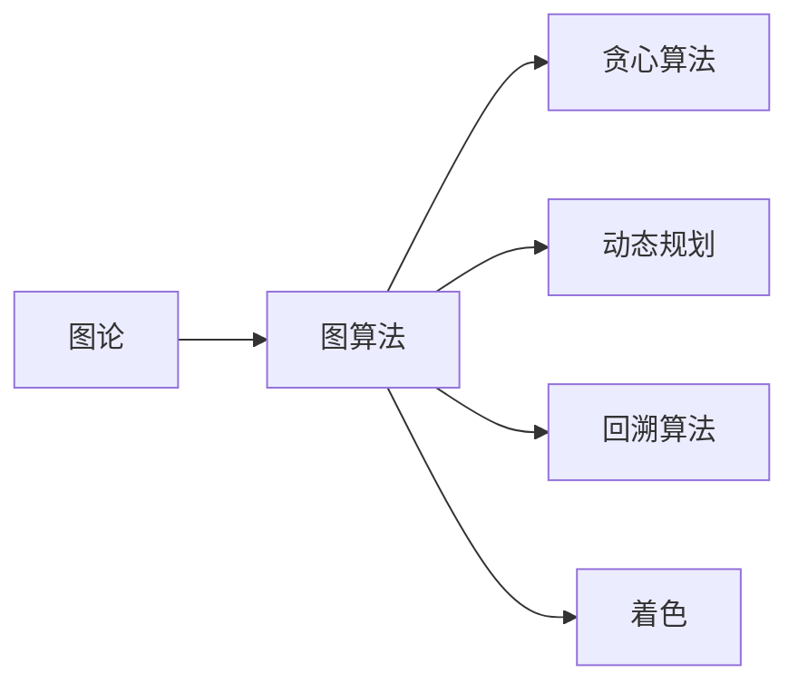

                 

# 像数学家一样思考：着色原理

> 关键词：着色原理,图论,数学建模,算法设计与优化,应用案例,未来展望

## 1. 背景介绍

### 1.1 问题由来

着色问题是图论中的一个经典问题，它指的是在一张图中，对每个节点着色，使得相邻节点的颜色不同。在计算机科学、网络分析、图像处理等领域中，着色问题都有广泛的应用。

着色问题可以追溯到古希腊时期，当时人们就对地图着色问题感兴趣。直到今天，它依然是图论研究中的热门话题。着色问题不仅是数学家研究的课题，也是计算机科学家、工程师们关注的焦点。

### 1.2 问题核心关键点

着色问题涉及的核心关键点包括：
- 图论中的基本概念和原理
- 不同着色算法的实现及其优缺点
- 着色问题在不同领域中的应用
- 未来研究方向与挑战

## 2. 核心概念与联系

### 2.1 核心概念概述

1. **图论(Graph Theory)**：研究由节点和边构成的图形结构的性质和算法的一门学科。

2. **着色(Vertex Coloring)**：指在图中，对每个节点着色，使得相邻节点的颜色不同。

3. **图算法**：用于解决图论问题的算法，如最短路径、最小生成树、最小割等。

4. **贪心算法(Greedy Algorithm)**：一种通过每一步选择最优解来得到全局最优解的算法。

5. **动态规划(Dynamic Programming)**：一种通过将原问题分解为多个子问题来解决复杂问题的方法。

6. **回溯算法(Backtracking)**：一种尝试所有可能的解决方案来找到最优解的算法。

### 2.2 核心概念原理和架构的 Mermaid 流程图



这个流程图展示了图论与图算法、贪心算法、动态规划和回溯算法之间的联系，以及它们在着色问题中的应用。

## 3. 核心算法原理 & 具体操作步骤

### 3.1 算法原理概述

着色问题可以通过贪心算法、动态规划和回溯算法来解决。其中，贪心算法通过每次选择局部最优解来达到全局最优解，而动态规划和回溯算法则通过分解问题来寻找最优解。

具体来说，着色问题可以表示为一个图G(V, E)，其中V是节点集，E是边集。着色问题要求在V中每个节点u分配一种颜色c(u)，满足：
- 相邻节点颜色不同：如果(u, v)∈E，则c(u)≠c(v)
- 最小颜色数：使用尽可能少的颜色

### 3.2 算法步骤详解

#### 贪心算法
1. **初始化**：给定一个未着色的图G(V, E)，选择一个未着色的节点u。
2. **选择颜色**：从一组预定义的颜色中选择一个颜色c(u)，并赋予节点u。
3. **迭代**：重复步骤1和2，直到所有节点都被着色。
4. **输出**：输出颜色分配结果。

#### 动态规划
1. **定义状态**：设dp[i][j]表示节点i可以使用的颜色j的最小着色数。
2. **状态转移**：对于每个节点i，对于每个颜色j，有状态转移方程dp[i][j] = min(dp[k][c]) + 1，其中k是i的邻居，c是k的颜色。
3. **初始化**：dp[i][c] = 0，其中c是节点i的颜色。
4. **求解**：使用动态规划求解最小着色数。
5. **输出**：输出最小着色数。

#### 回溯算法
1. **初始化**：给定一个未着色的图G(V, E)，选择一个未着色的节点u。
2. **尝试颜色**：对于每个颜色c，尝试将c赋予节点u。
3. **递归**：如果u的所有邻居都被着色，则递归到下一个未着色的节点。
4. **回溯**：如果找不到合法的着色方案，则回溯到上一步。
5. **输出**：输出颜色分配结果。

### 3.3 算法优缺点

#### 贪心算法
- **优点**：
  - 实现简单，易于理解。
  - 对于某些特殊图，贪心算法可以找到最优解。
- **缺点**：
  - 不一定能得到全局最优解。
  - 依赖于初始选择，可能会导致次优解。

#### 动态规划
- **优点**：
  - 可以找到最优解。
  - 适用于多种图结构。
- **缺点**：
  - 时间复杂度高。
  - 需要大量内存。

#### 回溯算法
- **优点**：
  - 可以找到所有合法解。
  - 适用于多种图结构。
- **缺点**：
  - 时间复杂度高。
  - 可能找到次优解。

### 3.4 算法应用领域

着色问题在计算机科学、网络分析、图像处理等领域都有广泛的应用。

- **计算机科学**：着色算法可以用于解决图着色问题、路由算法等。
- **网络分析**：着色问题可以用于社交网络分析、路由算法等。
- **图像处理**：着色问题可以用于图像分割、对象识别等。

## 4. 数学模型和公式 & 详细讲解 & 举例说明

### 4.1 数学模型构建

着色问题可以表示为一个图G(V, E)，其中V是节点集，E是边集。每个节点u的颜色表示为c(u)，满足：
- 相邻节点颜色不同：如果(u, v)∈E，则c(u)≠c(v)
- 最小颜色数：使用尽可能少的颜色

### 4.2 公式推导过程

着色问题可以表示为一个整数线性规划问题。假设节点集为V，边集为E，颜色集合为C，目标是最小化颜色数。则有以下整数线性规划公式：

$$
\begin{aligned}
\min & \sum_{i \in V} x_i \\
\text{s.t.} & \sum_{c \in C} x_{(i, c)} = 1, \quad \forall i \in V \\
& x_{(i, c)} \leq 1, \quad \forall i \in V, \forall c \in C \\
& x_{(i, c)} \geq 0, \quad \forall i \in V, \forall c \in C
\end{aligned}
$$

其中，$x_{(i, c)}$表示节点i使用颜色c的计数器。

### 4.3 案例分析与讲解

以König's Problem为例，它是一个经典着色问题，要求在二部图中对每个节点着色，使得每条边的两端颜色不同。

假设二部图G(V, E)的节点集V可以表示为V = {A, B}，边集E表示为E = {(u, v) | (u, v)∈E}。着色问题的目标是最小化颜色数，使得每条边的两端颜色不同。

对于König's Problem，可以使用回溯算法来求解。回溯算法的基本思路是：对于每个节点，尝试所有可能的着色方案，然后递归到下一个未着色的节点，直到所有节点都被着色。

## 5. 项目实践：代码实例和详细解释说明

### 5.1 开发环境搭建

在开发环境搭建之前，需要先安装Python和必要的库，如NumPy、Pandas、Matplotlib等。

```bash
pip install numpy pandas matplotlib
```

### 5.2 源代码详细实现

以下是使用Python实现贪心算法的示例代码：

```python
import networkx as nx
import matplotlib.pyplot as plt

def greedy_coloring(G):
    colors = {}
    used_colors = []
    for u in G.nodes():
        available_colors = [c for c in range(1, len(G.nodes()) + 1) if c not in used_colors]
        colors[u] = available_colors[0]
        used_colors.append(colors[u])
    return colors

G = nx.karate_club_graph()
colors = greedy_coloring(G)
pos = nx.spring_layout(G)

nx.draw(G, pos, with_labels=True, node_color=[colors[u] for u in G.nodes()])
plt.show()
```

这段代码实现了对Karate Club图的贪心着色。

### 5.3 代码解读与分析

**代码解释**：
- 首先，导入了必要的库，包括网络x和matplotlib。
- 然后，定义了一个函数greedy_coloring，用于实现贪心算法。
- 在函数中，遍历每个节点u，找到可用颜色，并将其分配给节点u。
- 最后，使用networkx库绘制着色结果。

**代码分析**：
- 贪心算法的实现相对简单，通过遍历每个节点，找到可用颜色并分配给节点，从而实现着色。
- 贪心算法的优点是实现简单，易于理解，但不一定能得到全局最优解。

## 6. 实际应用场景

### 6.1 着色问题在计算机科学中的应用

着色问题在计算机科学中有广泛的应用，例如：
- 网络路由算法：在计算机网络中，节点表示路由器，边表示连接。通过着色算法，可以为每个路由器分配不同的颜色，以避免冲突。
- 路由图着色：在路由图中，节点表示路由器，边表示连接。通过着色算法，可以为每个路由器分配不同的颜色，以避免冲突。

### 6.2 着色问题在网络分析中的应用

着色问题在网络分析中有广泛的应用，例如：
- 社交网络分析：在社交网络中，节点表示用户，边表示连接。通过着色算法，可以为每个用户分配不同的颜色，以避免信息传播的冲突。
- 广告网络：在广告网络中，节点表示广告主，边表示广告投放。通过着色算法，可以为每个广告主分配不同的颜色，以避免广告投放的冲突。

### 6.3 着色问题在图像处理中的应用

着色问题在图像处理中有广泛的应用，例如：
- 图像分割：在图像分割中，节点表示像素，边表示相邻像素。通过着色算法，可以为每个像素分配不同的颜色，以避免颜色冲突。
- 对象识别：在对象识别中，节点表示像素，边表示相邻像素。通过着色算法，可以为每个像素分配不同的颜色，以避免颜色冲突。

### 6.4 未来应用展望

未来的着色问题将在更多领域得到应用，例如：
- 物联网：在物联网中，节点表示设备，边表示连接。通过着色算法，可以为每个设备分配不同的颜色，以避免信息传播的冲突。
- 生物信息学：在生物信息学中，节点表示基因，边表示连接。通过着色算法，可以为每个基因分配不同的颜色，以避免基因表达的冲突。

## 7. 工具和资源推荐

### 7.1 学习资源推荐

1. **《图论与算法》**：这是一本介绍图论和算法的经典教材，涵盖了图论的基本概念和算法。
2. **Coursera上的《图论与网络分析》课程**：由斯坦福大学开设，涵盖了图论的基本概念和算法，以及其在计算机科学中的应用。
3. **Khan Academy上的《离散数学》课程**：涵盖了图论的基本概念和算法，适合初学者入门。

### 7.2 开发工具推荐

1. **Python**：Python是实现图论算法的最佳语言之一，具有丰富的库和工具支持。
2. **NetworkX**：网络x是一个用于创建和分析复杂网络的库，可以用于实现各种图论算法。
3. **Matplotlib**：matplotlib是一个用于绘制图形的库，可以用于可视化着色结果。

### 7.3 相关论文推荐

1. **"Graph Coloring: A Survey" by A. T. White**：介绍了图着色的基本概念和算法。
2. **"Greedy Algorithms for Image Coloration" by F. F. Blockson and R. M. Gatland**：介绍了一种用于图像着色的贪心算法。
3. **"Optimal Bound for the König's Problem" by László Lovász**：介绍了König's问题的最优解。

## 8. 总结：未来发展趋势与挑战

### 8.1 研究成果总结

着色问题是一个经典的图论问题，已经得到了广泛的研究和应用。贪心算法、动态规划和回溯算法是解决着色问题的主要方法。

### 8.2 未来发展趋势

未来的着色问题将在更多领域得到应用，例如物联网、生物信息学等。着色算法也将不断改进，以提高效率和准确性。

### 8.3 面临的挑战

着色问题面临的挑战包括：
- 时间复杂度高：着色问题的求解通常需要高复杂度的算法。
- 空间复杂度高：着色问题的求解通常需要大量的内存空间。
- 泛化能力差：着色算法通常只能应用于特定的图结构。

### 8.4 研究展望

未来的研究可以从以下几个方面展开：
- 开发更高效的算法：改进贪心算法、动态规划和回溯算法，以提高着色算法的效率和准确性。
- 扩展应用领域：将着色算法应用于更多的领域，例如物联网、生物信息学等。
- 融合其他技术：将着色算法与其他技术结合，例如机器学习、人工智能等，以提高着色算法的性能和应用效果。

## 9. 附录：常见问题与解答

### 9.1 问题与解答

**Q1：着色问题可以应用于哪些领域？**

A: 着色问题可以应用于计算机科学、网络分析、图像处理等多个领域。例如，在计算机网络中，可以用于路由算法和路由图着色；在社交网络中，可以用于社交网络分析和广告网络；在图像处理中，可以用于图像分割和对象识别。

**Q2：着色问题的算法有哪些？**

A: 着色问题的主要算法包括贪心算法、动态规划和回溯算法。贪心算法通过每次选择局部最优解来达到全局最优解；动态规划通过分解问题来寻找最优解；回溯算法通过尝试所有可能的解决方案来找到最优解。

**Q3：着色算法的优点和缺点是什么？**

A: 着色算法的优点包括实现简单、易于理解。贪心算法适用于某些特殊图，可以找到最优解；动态规划可以找到最优解，适用于多种图结构；回溯算法可以找到所有合法解，适用于多种图结构。着色算法的缺点包括时间复杂度高、空间复杂度高、泛化能力差。

**Q4：如何使用Python实现贪心算法？**

A: 可以使用Python中的NetworkX库和Matplotlib库实现贪心算法。首先，定义一个函数，遍历每个节点，找到可用颜色，并将其分配给节点。然后，使用NetworkX库绘制着色结果。

---

作者：禅与计算机程序设计艺术 / Zen and the Art of Computer Programming

