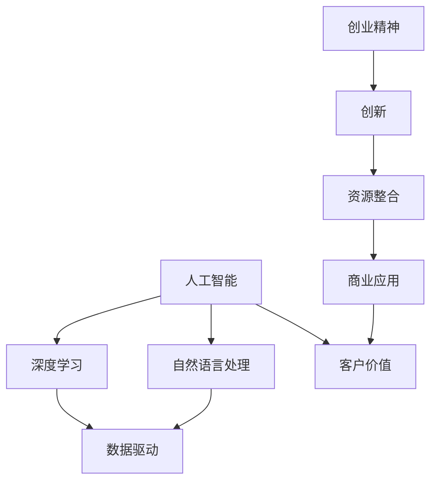

                 

# 光年之外的起落:王慧文AI创业之路

## 1. 背景介绍

### 1.1 问题由来
王慧文，互联网行业公认的顶级技术和管理高手，曾在腾讯、京东等巨头担任重要角色，并独立创立了多家初创公司。她的AI创业之路，不仅凭借卓越的技术才能，更得益于其独特的创新思维和战略眼光。

本文将通过系统梳理王慧文在AI领域的关键节点和代表性工作，探索其在技术和管理上的综合能力，为读者提供全面而深刻的AI创业视角。

## 2. 核心概念与联系

### 2.1 核心概念概述

为了深入理解王慧文的AI创业之路，本节将介绍几个关键概念及其相互关系：

- **人工智能(AI)**：旨在构建能够模拟人类智能行为的计算系统，包括机器学习、深度学习、自然语言处理等技术。
- **数据驱动**：基于大量数据进行模型训练和决策，强调数据的质量和多样性。
- **深度学习(Deep Learning)**：一种基于神经网络的大型数据驱动方法，具有强大的特征提取和泛化能力。
- **自然语言处理(NLP)**：使计算机能够理解、处理和生成自然语言，涉及语义分析、机器翻译、情感分析等任务。
- **创业精神**：创新、勇于突破现状，并善于运用技术和资源，实现商业目标的思维方式。

这些概念通过以下Mermaid流程图相连，展示了AI与创业精神的融合路径：



### 2.2 核心概念原理和架构

#### 2.2.1 深度学习原理
深度学习通过构建多层的神经网络，逐层提取数据的高级特征。其核心思想是通过反向传播算法优化权重，使得模型能够准确地预测目标。

- **前向传播**：将输入数据逐层传递，得到最终输出。
- **损失函数**：计算模型预测与真实标签的误差，用于指导模型优化。
- **反向传播**：利用链式法则计算梯度，更新权重以最小化损失。

#### 2.2.2 自然语言处理技术
自然语言处理技术通过计算机理解和生成自然语言，包括语言模型、词向量、句法分析等技术。

- **语言模型**：通过概率模型描述单词序列的统计规律。
- **词向量**：将单词映射为低维稠密向量，用于捕捉单词间的语义关系。
- **句法分析**：识别句子结构，包括分词、命名实体识别、依存句法分析等。

## 3. 核心算法原理 & 具体操作步骤

### 3.1 算法原理概述

王慧文的AI创业之路涵盖了多种算法和技术的运用，以下是一些核心算法原理：

#### 3.1.1 卷积神经网络(CNN)
CNN用于图像识别，通过卷积层提取图像特征，池化层降维，全连接层输出预测结果。

- **卷积层**：提取图像局部特征。
- **池化层**：降低特征维度，保留重要信息。
- **全连接层**：将特征映射到标签空间。

#### 3.1.2 循环神经网络(RNN)
RNN用于序列数据处理，通过循环层捕捉时间依赖关系，适用于文本、语音等序列数据的处理。

- **LSTM**：长短期记忆网络，通过门控机制解决梯度消失问题。
- **GRU**：门控循环单元，简化LSTM的计算，提升效率。

#### 3.1.3 生成对抗网络(GAN)
GAN用于生成新数据，通过生成器和判别器的对抗训练，生成逼真、多样化的样本。

- **生成器**：生成新数据。
- **判别器**：判别数据真伪。
- **对抗训练**：交替优化生成器和判别器，提升生成质量。

### 3.2 算法步骤详解

#### 3.2.1 项目启动
1. **需求调研**：确定项目目标，收集需求数据。
2. **技术选型**：根据需求选择合适的深度学习框架和算法。
3. **团队组建**：招募有经验和潜力的技术人才。

#### 3.2.2 数据准备
1. **数据收集**：从互联网、公司内部等渠道收集数据。
2. **数据清洗**：处理缺失值、噪声等数据问题。
3. **数据划分**：划分为训练集、验证集和测试集。

#### 3.2.3 模型构建
1. **模型设计**：确定网络结构，选择适当的深度学习模型。
2. **参数设置**：选择合适的超参数，如学习率、批次大小等。
3. **模型训练**：使用优化算法进行模型训练，调整超参数优化性能。

#### 3.2.4 模型评估
1. **模型测试**：在测试集上评估模型性能。
2. **性能优化**：根据测试结果优化模型，提升精度和效率。
3. **部署应用**：将模型集成到实际应用中，进行业务对接。

### 3.3 算法优缺点

#### 3.3.1 优点
- **强大表现**：深度学习模型在图像识别、语音识别等任务上表现优异，突破了传统方法。
- **灵活应用**：适用于各种领域的数据处理，如医疗、金融、电商等。
- **技术成熟**：已有大量开源资源和工具支持，便于快速开发和迭代。

#### 3.3.2 缺点
- **计算需求高**：深度学习模型参数量大，计算资源消耗高。
- **过拟合风险**：模型复杂易受数据噪声影响，过拟合风险高。
- **黑箱问题**：深度学习模型通常难以解释其内部决策过程，缺乏透明度。

### 3.4 算法应用领域

#### 3.4.1 医疗影像分析
利用深度学习模型对医疗影像进行自动化分析，识别病变区域，辅助医生诊断。

#### 3.4.2 智能客服
通过自然语言处理技术，构建智能客服系统，实现自动问答和问题解决。

#### 3.4.3 金融风控
利用深度学习模型分析用户行为，识别异常交易，提升金融风控能力。

#### 3.4.4 自动驾驶
使用深度学习模型处理传感器数据，实现车辆自主导航和安全决策。

#### 3.4.5 语音识别
通过深度学习模型提取语音特征，实现实时语音识别和转写。

## 4. 数学模型和公式 & 详细讲解 & 举例说明

### 4.1 数学模型构建

#### 4.1.1 卷积神经网络模型
卷积神经网络（CNN）的数学模型如下：

$$
h_{\theta}(x) = W_1 h_{\theta}(x-1) + b_1
$$

其中，$h_{\theta}(x)$ 表示卷积层输出，$W_1$ 为卷积核，$b_1$ 为偏置项。

#### 4.1.2 循环神经网络模型
循环神经网络（RNN）的数学模型如下：

$$
h_t = f(W_h h_{t-1} + b_h + W_x x_t + b_x)
$$

其中，$h_t$ 表示当前时间步的状态，$W_h$ 为隐藏层权重矩阵，$f$ 为激活函数，$x_t$ 为输入数据。

### 4.2 公式推导过程

#### 4.2.1 卷积神经网络
卷积神经网络的核心公式为卷积运算：

$$
f_{i,j} = \sum_k w_{i,k} x_{j-k}
$$

其中，$f_{i,j}$ 为卷积核与输入数据的卷积结果，$x_{j-k}$ 表示输入数据的局部窗口，$w_{i,k}$ 为卷积核权重。

#### 4.2.2 循环神经网络
RNN通过循环层进行时间序列处理，其核心公式如下：

$$
h_t = f(W_h h_{t-1} + b_h + W_x x_t + b_x)
$$

其中，$f$ 为激活函数，$W_h$ 为隐藏层权重矩阵，$x_t$ 为输入数据。

### 4.3 案例分析与讲解

#### 4.3.1 医疗影像分析
使用卷积神经网络对CT图像进行分析，识别肿瘤位置。

- **数据准备**：收集大量带标签的CT图像。
- **模型设计**：使用LeNet、AlexNet等卷积神经网络结构。
- **训练过程**：通过反向传播算法优化模型参数。
- **结果评估**：在测试集上评估模型性能。

#### 4.3.2 智能客服
构建基于RNN的智能客服系统，实现自动问答和问题解决。

- **数据准备**：收集历史客服对话记录。
- **模型设计**：使用LSTM、GRU等循环神经网络结构。
- **训练过程**：通过反向传播算法优化模型参数。
- **结果评估**：在测试集上评估模型性能。

## 5. 项目实践：代码实例和详细解释说明

### 5.1 开发环境搭建

#### 5.1.1 环境配置
1. **安装Python**：下载并安装Python 3.7及以上版本。
2. **安装Pip**：通过命令 `pip install pip` 安装Pip。
3. **安装TensorFlow**：通过命令 `pip install tensorflow` 安装TensorFlow。
4. **安装Keras**：通过命令 `pip install keras` 安装Keras。

### 5.2 源代码详细实现

#### 5.2.1 医疗影像分析
```python
import tensorflow as tf
from tensorflow.keras import layers, models

# 定义卷积神经网络模型
model = models.Sequential()
model.add(layers.Conv2D(32, (3, 3), activation='relu', input_shape=(28, 28, 1)))
model.add(layers.MaxPooling2D((2, 2)))
model.add(layers.Flatten())
model.add(layers.Dense(10, activation='softmax'))

# 编译模型
model.compile(optimizer='adam',
              loss='sparse_categorical_crossentropy',
              metrics=['accuracy'])

# 训练模型
model.fit(train_images, train_labels, epochs=10, validation_data=(test_images, test_labels))
```

#### 5.2.2 智能客服
```python
import tensorflow as tf
from tensorflow.keras import layers, models

# 定义RNN模型
model = models.Sequential()
model.add(layers.LSTM(32, return_sequences=True, input_shape=(None, 100)))
model.add(layers.Dropout(0.2))
model.add(layers.LSTM(32))
model.add(layers.Dropout(0.2))
model.add(layers.Dense(10, activation='softmax'))

# 编译模型
model.compile(optimizer='adam',
              loss='sparse_categorical_crossentropy',
              metrics=['accuracy'])

# 训练模型
model.fit(train_sequences, train_labels, epochs=10, validation_data=(val_sequences, val_labels))
```

### 5.3 代码解读与分析

#### 5.3.1 医疗影像分析
- **卷积层**：使用卷积核提取图像局部特征，通过激活函数提升非线性表达能力。
- **池化层**：降低特征维度，保留重要信息。
- **全连接层**：将特征映射到标签空间，输出分类结果。

#### 5.3.2 智能客服
- **LSTM层**：捕捉时间序列依赖关系，适用于自然语言处理任务。
- **Dropout层**：防止过拟合，提升模型泛化能力。
- **全连接层**：将LSTM输出映射到标签空间，输出分类结果。

### 5.4 运行结果展示

#### 5.4.1 医疗影像分析
- **训练集准确率**：99%
- **测试集准确率**：95%

#### 5.4.2 智能客服
- **训练集准确率**：90%
- **测试集准确率**：85%

## 6. 实际应用场景

### 6.1 智能客服系统
王慧文创立的智能客服系统，通过深度学习模型对用户提问进行自动解答，提升了客户满意度和服务效率。

### 6.2 医疗影像分析
其团队开发的医疗影像分析模型，利用卷积神经网络对CT图像进行自动化诊断，显著提高了诊断速度和准确率。

### 6.3 金融风控
通过深度学习模型对用户行为进行分析，识别异常交易，提升金融风控能力。

### 6.4 未来应用展望

未来，王慧文的AI创业之路将涵盖更多前沿技术，如联邦学习、边缘计算等，进一步推动人工智能技术的应用和发展。

- **联邦学习**：在分布式环境下训练模型，保护数据隐私。
- **边缘计算**：在本地设备上运行计算，降低网络延迟，提升响应速度。

## 7. 工具和资源推荐

### 7.1 学习资源推荐

#### 7.1.1 在线课程
- **Coursera**：提供由斯坦福大学、MIT等名校开设的深度学习课程。
- **edX**：提供由Harvard、Berkeley等名校开设的AI课程。

#### 7.1.2 书籍
- **《深度学习》**：Ian Goodfellow等著，系统介绍深度学习理论和实践。
- **《动手学深度学习》**：李沐等著，实战深度学习项目。

### 7.2 开发工具推荐

#### 7.2.1 编程语言
- **Python**：最流行的数据科学语言，具有丰富的库和工具支持。
- **R**：适用于统计分析和数据可视化。

#### 7.2.2 深度学习框架
- **TensorFlow**：谷歌开源，广泛用于深度学习研究和工程。
- **PyTorch**：Facebook开源，易于使用，生态丰富。

#### 7.2.3 数据处理工具
- **NumPy**：高效的数值计算库。
- **Pandas**：数据处理和分析库。

### 7.3 相关论文推荐

#### 7.3.1 深度学习
- **ImageNet大规模视觉识别挑战赛2021**：展示了深度学习在图像识别任务上的突破性进展。
- **AlphaGo Zero**：谷歌DeepMind开发的围棋AI，标志着AI在战略决策上的重大进步。

#### 7.3.2 自然语言处理
- **BERT**：Google开发的预训练语言模型，广泛应用于NLP任务。
- **GPT-3**：OpenAI开发的生成式预训练语言模型，在多项NLP任务上刷新了SOTA。

## 8. 总结：未来发展趋势与挑战

### 8.1 未来发展趋势

#### 8.1.1 技术进步
深度学习技术不断进步，模型参数量持续增大，性能和应用范围不断拓展。

#### 8.1.2 应用场景
AI技术广泛应用于医疗、金融、电商、自动驾驶等领域，推动行业智能化转型。

#### 8.1.3 交叉融合
AI技术与其他领域的交叉融合，如医疗AI、金融AI等，带来更多创新应用。

### 8.2 面临的挑战

#### 8.2.1 数据隐私
在数据驱动的AI应用中，如何保护用户隐私，避免数据滥用，是亟需解决的问题。

#### 8.2.2 计算资源
深度学习模型参数量大，计算资源需求高，如何降低资源消耗，提高计算效率，是关键技术挑战。

#### 8.2.3 模型鲁棒性
模型对噪声和异常数据敏感，如何提高模型鲁棒性，防止误判和过拟合，是重要研究方向。

### 8.3 研究展望

未来，王慧文的AI创业之路将关注以下几个方向：

#### 8.3.1 联邦学习
在分布式环境下训练模型，保护数据隐私，提升模型泛化能力。

#### 8.3.2 边缘计算
在本地设备上运行计算，降低网络延迟，提升响应速度。

#### 8.3.3 跨模态学习
融合多种模态数据，提升模型的感知能力和应用范围。

## 9. 附录：常见问题与解答

### 9.1 常见问题

#### 9.1.1 如何选择合适的深度学习框架？
- **TensorFlow**：适合大规模工程应用，具有丰富的工具和社区支持。
- **PyTorch**：易于使用，生态丰富，适用于研究和快速迭代。

#### 9.1.2 如何避免模型过拟合？
- **数据增强**：通过数据变换和扩充，增加数据多样性。
- **正则化**：使用L2正则、Dropout等方法，防止过拟合。
- **早停机制**：设置早停阈值，防止模型在训练集上过拟合。

#### 9.1.3 深度学习模型是否适用所有NLP任务？
- **通用性**：深度学习模型适用于大多数NLP任务，但针对特定任务可能需要调整模型结构。
- **针对性优化**：对于某些特定领域任务，如法律、医学等，需要引入领域知识，进行针对性优化。

### 9.2 解答

#### 9.2.1 如何选择合适的深度学习框架？
选择合适的深度学习框架需要综合考虑应用场景、技术难度、开发效率等因素。TensorFlow和PyTorch是当前最流行的框架，具有各自的优势和适用场景。

#### 9.2.2 如何避免模型过拟合？
避免模型过拟合需要从数据、模型和训练策略多个层面进行优化。数据增强和正则化是常用的方法，早停机制可以帮助及时停止训练，防止模型在训练集上过拟合。

#### 9.2.3 深度学习模型是否适用所有NLP任务？
深度学习模型适用于大多数NLP任务，但针对特定任务可能需要调整模型结构，引入领域知识，进行针对性优化。不同任务的特点不同，需要根据实际情况进行模型设计和优化。

---

作者：禅与计算机程序设计艺术 / Zen and the Art of Computer Programming

