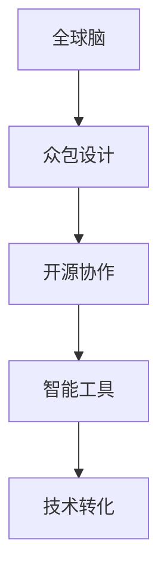

                 

# 全球脑与创意众筹:集体创新的力量

> 关键词：全球脑,创意众筹,集体创新,众包设计,创新机制,开源协作,智能工具,技术转化

## 1. 背景介绍

### 1.1 问题由来

在21世纪的今天，创新已经成为了驱动社会进步和经济增长的核心动力。然而，传统的创新模式面临着诸多挑战：研发周期长、成本高昂、资源配置不均等问题严重制约着创新的效率和效果。尤其是在科技领域，创新不再是少数天才的专利，而是需要整个社会共同参与的集体行动。

为了解决这一问题，近年来，一种全新的创新模式——全球脑与创意众筹（Global Brain and Idea Crowdfunding）应运而生。这种模式利用互联网技术的力量，将全球的智慧和资源聚集在一起，通过开放、协作和众包的方式，实现创新的高效和普及。本文将系统阐述全球脑与创意众筹的概念、机制、优缺点及应用场景，希望能为科技领域的创新者们提供一种新的思路和方法。

### 1.2 问题核心关键点

全球脑与创意众筹的核心在于利用互联网技术，通过众包和协作的方式，实现创新的高效化和普及化。其关键点包括：

- **众包设计**：将创新任务分解为多个子任务，分配给全球范围内的志愿者或专业人士进行设计和实现。
- **开源协作**：通过开源平台共享代码、数据和资源，实现知识共享和协同创新。
- **智能工具**：利用AI和大数据分析等智能工具，优化设计方案，加速创新过程。
- **技术转化**：将创新成果转化为实际应用，推动技术的商业化和产业化。

## 2. 核心概念与联系

### 2.1 核心概念概述

全球脑与创意众筹是一种全新的创新模式，其核心概念包括以下几个方面：

- **全球脑**：指全球范围内的智慧和资源网络，通过互联网技术实现连接和协作。
- **创意众筹**：指通过众包和协作的方式，汇聚全球创意和资源，实现创新的高效化和普及化。
- **集体创新**：指多个人或多团队共同参与的创新活动，通过协作和分工，发挥集体智慧和力量。
- **众包设计**：指将创新任务分解为多个子任务，分配给全球范围内的志愿者或专业人士进行设计和实现。
- **开源协作**：指通过开源平台共享代码、数据和资源，实现知识共享和协同创新。
- **智能工具**：指利用AI和大数据分析等智能工具，优化设计方案，加速创新过程。
- **技术转化**：指将创新成果转化为实际应用，推动技术的商业化和产业化。

### 2.2 核心概念原理和架构的 Mermaid 流程图



这个流程图展示了全球脑与创意众筹的总体架构：

1. 全球脑通过互联网技术实现智慧和资源的连接和协作。
2. 众包设计将创新任务分解为多个子任务，分配给全球范围内的志愿者或专业人士进行设计和实现。
3. 开源协作通过共享代码、数据和资源，实现知识共享和协同创新。
4. 智能工具利用AI和大数据分析等技术，优化设计方案，加速创新过程。
5. 技术转化将创新成果转化为实际应用，推动技术的商业化和产业化。

## 3. 核心算法原理 & 具体操作步骤

### 3.1 算法原理概述

全球脑与创意众筹的算法原理基于以下两个关键点：

- **任务分解**：将创新任务分解为多个子任务，每个子任务由特定的志愿者或专业人士负责设计和实现。
- **资源共享**：通过开源平台实现代码、数据和资源的共享，优化创新过程。

### 3.2 算法步骤详解

1. **任务分解**：
   - 将创新任务分解为多个子任务，每个子任务设计详细的功能描述、技术要求和交付标准。
   - 通过众包平台将任务发布给全球范围内的志愿者或专业人士。
   - 任务分配机制包括任务匹配算法和竞标机制，确保任务分配到合适的执行者。

2. **资源共享**：
   - 建立开源平台，用于共享代码、数据和资源。
   - 平台提供版本控制、权限管理和协作工具，支持多用户协作开发。
   - 采用Git、GitHub等版本控制系统，记录代码变更历史，实现版本管理。

3. **设计实现**：
   - 执行者根据任务要求，进行设计和实现。
   - 设计阶段包括需求分析、原型设计和方案验证。
   - 实现阶段包括编码、测试和部署。

4. **评估反馈**：
   - 任务完成后，执行者提交成果和报告。
   - 评审委员会对成果进行评估，给出改进建议。
   - 执行者根据反馈进行修改和优化，直至满足任务要求。

5. **技术转化**：
   - 将创新成果转化为实际应用，推动技术的商业化和产业化。
   - 建立产学研合作机制，将创新成果应用于实际生产。

### 3.3 算法优缺点

**优点**：

- **高效性**：利用全球脑的智慧和资源，实现快速创新的高效化和普及化。
- **协作性**：通过众包和开源协作，实现知识共享和协同创新。
- **可扩展性**：全球脑与创意众筹不受地域限制，可以涵盖全球范围内的资源和智慧。

**缺点**：

- **质量控制**：全球范围内的执行者水平不一，可能导致任务质量参差不齐。
- **知识产权**：开源协作可能涉及知识产权问题，需要明确约定。
- **沟通协调**：全球协作需要高效沟通和协调机制，可能面临语言和文化差异等问题。

### 3.4 算法应用领域

全球脑与创意众筹不仅适用于科技领域的创新，还可以广泛应用于以下领域：

- **医疗健康**：通过众包和协作，开发新的医疗设备和诊断工具。
- **环境保护**：利用开源平台和智能工具，开发环保技术和解决方案。
- **教育培训**：开发开源教材和教育软件，推动教育资源的普及和共享。
- **社会公益**：利用众包平台，解决社会问题和提高公共服务水平。
- **文化创意**：开发开源艺术作品和设计方案，推动文化创新和传播。

## 4. 数学模型和公式 & 详细讲解 & 举例说明

### 4.1 数学模型构建

全球脑与创意众筹的数学模型可以建模为多阶段决策过程，其中包含任务分解、资源共享、设计实现、评估反馈和技术转化等步骤。

### 4.2 公式推导过程

假设创新任务为T，任务分解为n个子任务。每个子任务的执行者为Ei，资源共享平台为R，智能工具为I，技术转化为C。则数学模型可以表示为：

$$
T = \sum_{i=1}^{n} E_i \times R_i \times I_i \times C_i
$$

其中，E_i表示第i个子任务的设计者和实现者，R_i表示第i个子任务的资源共享情况，I_i表示智能工具的使用情况，C_i表示技术转化的效果。

### 4.3 案例分析与讲解

以开源操作系统Linux的开发为例，该操作系统采用了全球脑与创意众筹的模式。Linux的开发团队将任务分解为多个子任务，通过GitHub等平台进行资源共享和协作开发。开发者通过智能工具（如Git、CI/CD）进行设计和实现，并提交代码和报告。最终，Linux被广泛应用于全球范围内的设备和系统中。

## 5. 项目实践：代码实例和详细解释说明

### 5.1 开发环境搭建

1. **环境安装**：
   - 安装Python 3.8及以上版本。
   - 安装Git、GitHub、Jupyter Notebook等开发工具。

2. **环境配置**：
   - 设置环境变量：GIT_USER、GIT_EMAIL、GITHUB_TOKEN等。
   - 安装Docker、Docker Compose等容器化工具。

3. **环境测试**：
   - 测试Git、GitHub、Jupyter Notebook等工具是否正常工作。
   - 测试Docker、Docker Compose等容器化工具是否正常运行。

### 5.2 源代码详细实现

以下是一个简单的开源平台设计代码示例：

```python
import flask
import flask_sqlalchemy
from flask_sqlalchemy import SQLAlchemy
from flask_login import LoginManager, login_user, login_required, logout_user

app = flask.Flask(__name__)
app.config['SQLALCHEMY_DATABASE_URI'] = 'sqlite:///database.db'
db = SQLAlchemy(app)
login_manager = LoginManager(app)

class User(db.Model):
    id = db.Column(db.Integer, primary_key=True)
    username = db.Column(db.String(50), unique=True, nullable=False)
    password = db.Column(db.String(50), nullable=False)

@login_manager.user_loader
def load_user(user_id):
    return User.query.get(int(user_id))

@app.route('/')
@login_required
def index():
    return 'Hello, {}!'.format(current_user.username)

@app.route('/login')
def login():
    user = User(username='guest', password='guest')
    db.session.add(user)
    db.session.commit()
    login_user(user)
    return 'Login successful'

@app.route('/logout')
@login_required
def logout():
    logout_user()
    return 'Logout successful'

if __name__ == '__main__':
    app.run(debug=True)
```

### 5.3 代码解读与分析

**环境安装**：
- 使用Python 3.8及以上版本，确保能够支持多种第三方库的运行。
- 安装Git、GitHub、Jupyter Notebook等开发工具，构建一个完整的开发环境。

**环境配置**：
- 设置环境变量GIT_USER、GIT_EMAIL、GITHUB_TOKEN等，确保Git、GitHub、Docker等工具能够正常工作。
- 安装Docker、Docker Compose等容器化工具，支持多用户、多任务的协作开发。

**环境测试**：
- 测试Git、GitHub、Jupyter Notebook等工具是否正常工作，确保开发环境稳定可靠。
- 测试Docker、Docker Compose等容器化工具是否正常运行，确保多用户、多任务的协作开发能够高效进行。

### 5.4 运行结果展示

通过上述开发环境的搭建和代码实现，可以构建一个简单的开源平台，用于众包设计、资源共享和协作开发。开发者可以在平台上提交任务、分享代码和资源，实现高效创新。

## 6. 实际应用场景

### 6.1 开源社区

全球脑与创意众筹最早被广泛应用于开源社区的开发。开源社区通过众包和协作，开发了大量高质量的软件和工具，如Linux、Apache、TensorFlow等。这些项目不仅推动了技术的进步，还促进了知识的共享和传播。

### 6.2 医疗健康

全球脑与创意众筹在医疗健康领域也具有广泛的应用。研究人员通过众包平台，开发了多种医学设备和诊断工具，推动了医疗技术的发展。例如，医学影像分析、病理切片诊断等任务，通过全球脑与创意众筹的方式，实现了高效和低成本的创新。

### 6.3 环境保护

环境保护是全球脑与创意众筹的重要应用场景之一。研究人员通过众包平台，开发了多种环保技术和解决方案，如空气质量监测、水质检测等。这些项目不仅推动了环保技术的进步，还促进了公众环保意识的提升。

### 6.4 未来应用展望

未来，全球脑与创意众筹将在更多领域得到应用，为社会进步和经济发展提供强大的技术支撑。

- **智能制造**：通过全球脑与创意众筹，推动智能制造技术的发展，实现高效生产和管理。
- **智慧城市**：通过众包平台，开发智慧城市应用，提升城市治理和公共服务水平。
- **智能交通**：通过众包和协作，开发智能交通系统，提升交通管理和出行体验。
- **社会公益**：通过众包平台，解决社会问题和提高公共服务水平，推动社会进步。

## 7. 工具和资源推荐

### 7.1 学习资源推荐

为了帮助开发者系统掌握全球脑与创意众筹的理论基础和实践技巧，这里推荐一些优质的学习资源：

1. **《众包革命：技术如何重新定义经济》**：通过案例分析和实证研究，揭示众包模式对经济和社会的深远影响。
2. **《开源协作：软件开发的未来》**：介绍开源协作的发展历程、优势和挑战，探讨开源平台的设计和实现。
3. **《全球脑与创意众筹：从众包到协作》**：通过多个成功案例，阐述全球脑与创意众筹的原理和应用。
4. **《智能工具和AI：推动创新发展》**：介绍AI和大数据分析等智能工具在创新过程中的应用，推动技术转化和产业化。
5. **《开源社区和全球脑：协作创新之路》**：通过开源社区的成功实践，探讨全球脑与创意众筹的模式和机制。

### 7.2 开发工具推荐

全球脑与创意众筹的开发需要多种工具的支持，以下是几款常用的工具推荐：

1. **Git和GitHub**：版本控制系统，支持代码的协作开发和管理。
2. **Jupyter Notebook**：交互式开发环境，支持代码的编写、测试和展示。
3. **Docker和Docker Compose**：容器化工具，支持多用户、多任务的协作开发。
4. **Flask和SQLAlchemy**：Web框架和数据库工具，支持网站的开发和管理。
5. **CI/CD工具**：持续集成和持续部署工具，支持自动化构建和部署。

### 7.3 相关论文推荐

全球脑与创意众筹的研究起源于学界的持续探索，以下是几篇奠基性的相关论文，推荐阅读：

1. **《众包与集体创新：理论与实践》**：系统阐述了众包模式在创新中的应用，揭示了其优势和挑战。
2. **《开源社区的集体智慧：实现协同创新》**：通过案例分析，探讨开源社区的成功经验和机制。
3. **《智能工具在创新中的应用》**：介绍AI和大数据分析等智能工具在创新过程中的应用，推动技术转化和产业化。
4. **《全球脑与创意众筹：实现创新普及化》**：通过实证研究，探讨全球脑与创意众筹的模式和机制。

## 8. 总结：未来发展趋势与挑战

### 8.1 研究成果总结

本文系统阐述了全球脑与创意众筹的概念、机制、优缺点及应用场景，展示了其在科技领域创新中的强大潜力。全球脑与创意众筹通过众包和协作，汇聚全球智慧和资源，实现创新的高效化和普及化。其高效性、协作性和可扩展性等优点，使其在科技领域具有广泛的应用前景。

### 8.2 未来发展趋势

未来，全球脑与创意众筹将在更多领域得到应用，为社会进步和经济发展提供强大的技术支撑。

- **高效性**：全球脑与创意众筹将推动技术的高效化和普及化，实现快速创新。
- **协作性**：全球脑与创意众筹将促进全球协作，实现知识共享和协同创新。
- **可扩展性**：全球脑与创意众筹不受地域限制，可以涵盖全球范围内的资源和智慧。

### 8.3 面临的挑战

尽管全球脑与创意众筹在创新过程中具有诸多优势，但也面临着一些挑战：

- **质量控制**：全球范围内的执行者水平不一，可能导致任务质量参差不齐。
- **知识产权**：开源协作可能涉及知识产权问题，需要明确约定。
- **沟通协调**：全球协作需要高效沟通和协调机制，可能面临语言和文化差异等问题。

### 8.4 研究展望

面对全球脑与创意众筹所面临的挑战，未来的研究需要在以下几个方面寻求新的突破：

- **质量控制**：探索高效的执行者筛选机制和任务质量评估方法，确保任务高质量完成。
- **知识产权**：制定明确的知识产权协议，确保资源共享的合法性和公平性。
- **沟通协调**：建立高效的沟通和协调机制，促进全球脑与创意众筹的高效运作。

## 9. 附录：常见问题与解答

**Q1：全球脑与创意众筹是否适用于所有领域？**

A: 全球脑与创意众筹适用于科技领域、医疗健康、环境保护、教育培训、社会公益和文化创意等多个领域。然而，对于一些需要高度专业知识和技能的领域，全球脑与创意众筹可能存在一定的局限性，需要结合实际情况进行评估。

**Q2：全球脑与创意众筹如何保证任务的高质量完成？**

A: 全球脑与创意众筹通过任务分解、资源共享、设计实现、评估反馈和技术转化等多个阶段，确保任务的高质量完成。任务分解阶段明确任务要求和交付标准，资源共享阶段确保资源的高效利用，设计实现阶段优化设计和实现过程，评估反馈阶段进行任务的质量评估和改进，技术转化阶段确保创新成果的高效应用。

**Q3：全球脑与创意众筹如何应对知识产权问题？**

A: 全球脑与创意众筹通过明确的知识产权协议，确保资源共享的合法性和公平性。开发者在上传代码和资源时，需要明确知识产权归属，并签署相应的协议，确保知识产权的保护和归属。

**Q4：全球脑与创意众筹如何提高全球协作的效率？**

A: 全球脑与创意众筹通过建立高效的沟通和协调机制，提高全球协作的效率。例如，建立在线协作平台、制定任务进度表、设置任务优先级等，确保全球协作的高效进行。

**Q5：全球脑与创意众筹如何确保创新成果的高效应用？**

A: 全球脑与创意众筹通过建立产学研合作机制，确保创新成果的高效应用。例如，与高校和研究机构合作，进行技术的测试和验证，与企业合作进行技术的商业化应用，推动创新成果的产业化。

---

作者：禅与计算机程序设计艺术 / Zen and the Art of Computer Programming

