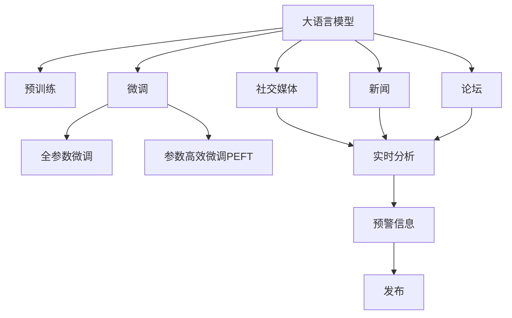

                 

# 全球脑与灾害预防：集体预警的力量

## 1. 背景介绍

### 1.1 问题由来
全球化时代，人类社会面临着前所未有的挑战。自然灾害、公共卫生事件、恐怖袭击等突发性危机，严重威胁着人类的生命财产安全。随着社会经济的发展，人类活动范围的扩大，这类危机的频发性和复杂性也在不断增加。因此，构建高效、智能的灾害预防体系，成为全球共同面临的课题。

### 1.2 问题核心关键点
灾害预防的关键在于早期预警和快速响应。传统灾害预警系统依赖于传感器和历史数据，难以实时捕捉突发事件的动态变化。而随着人工智能技术的发展，尤其是深度学习和自然语言处理(NLP)技术的突破，人类已具备了利用智能系统进行快速、精准灾害预警的能力。

本文聚焦于利用大语言模型和人工智能技术，构建全球脑系统，实现灾害的集体预警。该系统通过融合各类数据，利用大模型的自然语言理解和生成能力，实时分析社交媒体、新闻、论坛等网络平台上的信息，预测潜在的灾害事件，为各国政府和组织提供及时、准确的预警信息，显著提升灾害预防和应对能力。

### 1.3 问题研究意义
构建全球脑系统，对于提升全球灾害预防能力，减少灾害损失具有重要意义：

1. **提高预警效率**：通过大语言模型对海量网络信息进行实时分析，实现快速预警，缩短灾害响应时间。
2. **增强信息共享**：实现各国之间灾害信息的及时共享，提升全球灾害应对的协同性和有效性。
3. **降低预警成本**：减少传统传感器和人力成本，利用大模型的自监督学习能力，降低预警系统的开发和维护成本。
4. **提升预测准确性**：通过融合不同来源的数据，提升预警系统的鲁棒性和准确性，减少误报和漏报。
5. **推动技术创新**：促进自然语言处理、深度学习等领域的技术进步，为未来的人工智能应用提供新范式。

## 2. 核心概念与联系

### 2.1 核心概念概述

为更好地理解基于大语言模型的集体预警系统，本节将介绍几个密切相关的核心概念：

- **大语言模型(Large Language Model, LLM)**：以自回归(如GPT)或自编码(如BERT)模型为代表的大规模预训练语言模型。通过在大规模无标签文本语料上进行预训练，学习通用的语言表示，具备强大的语言理解和生成能力。

- **预训练(Pre-training)**：指在大规模无标签文本语料上，通过自监督学习任务训练通用语言模型的过程。常见的预训练任务包括言语建模、遮挡语言模型等。预训练使得模型学习到语言的通用表示。

- **微调(Fine-tuning)**：指在预训练模型的基础上，使用下游任务的少量标注数据，通过有监督学习优化模型在特定任务上的性能。通常只需要调整顶层分类器或解码器，并以较小的学习率更新全部或部分的模型参数。

- **迁移学习(Transfer Learning)**：指将一个领域学习到的知识，迁移应用到另一个不同但相关的领域的学习范式。大模型的预训练-微调过程即是一种典型的迁移学习方式。

- **自然语言处理(NLP)**：利用计算机对自然语言文本进行理解、生成和处理的技术。大语言模型在NLP领域有广泛应用，如文本分类、情感分析、机器翻译等。

- **社交媒体(Social Media)**：包括微博、微信、推特等，是公众获取信息、表达意见的主要平台。社交媒体上发布的实时动态，是构建集体预警系统的重要数据来源。

- **新闻(Newspapers)**：包括传统媒体和在线新闻平台，是公众获取正式信息的重要渠道。新闻报道的质量和速度，对预警系统的性能至关重要。

- **论坛(Forums)**：包括各类技术、科学、政治等领域的论坛，是公众讨论和交流的重要场所。论坛上的讨论内容和用户反馈，可以提供丰富的预警线索。

这些核心概念之间的逻辑关系可以通过以下Mermaid流程图来展示：



这个流程图展示了大语言模型的核心概念及其之间的关系：

1. 大语言模型通过预训练获得基础能力。
2. 微调是对预训练模型进行任务特定的优化，可以分为全参数微调和参数高效微调（PEFT）。
3. 社交媒体、新闻和论坛是数据来源，大模型通过微调获取预警信息。
4. 微调后的模型生成预警信息，由政府和组织发布并执行。

这些概念共同构成了全球脑系统的学习和应用框架，使其能够在各种场景下发挥强大的语言理解和生成能力。通过理解这些核心概念，我们可以更好地把握大语言模型在灾害预警中的应用。

## 3. 核心算法原理 & 具体操作步骤
### 3.1 算法原理概述

基于大语言模型的集体预警系统，本质上是一个有监督的细粒度迁移学习过程。其核心思想是：将预训练的大语言模型视作一个强大的"特征提取器"，通过融合各类网络平台上的信息，利用大模型的自然语言理解和生成能力，实时分析预测潜在的灾害事件，为政府和组织提供及时、准确的预警信息。

形式化地，假设预训练模型为 $M_{\theta}$，其中 $\theta$ 为预训练得到的模型参数。给定社交媒体、新闻和论坛等网络平台的实时信息数据集 $D=\{(x_i,y_i)\}_{i=1}^N$，集体预警的目标是找到新的模型参数 $\hat{\theta}$，使得：

$$
\hat{\theta}=\mathop{\arg\min}_{\theta} \mathcal{L}(M_{\theta},D)
$$

其中 $\mathcal{L}$ 为针对预警任务设计的损失函数，用于衡量模型预测输出与真实标签之间的差异。常见的损失函数包括交叉熵损失、均方误差损失等。

通过梯度下降等优化算法，集体预警过程不断更新模型参数 $\theta$，最小化损失函数 $\mathcal{L}$，使得模型输出逼近真实标签。由于 $\theta$ 已经通过预训练获得了较好的初始化，因此即便在融合不同来源的网络数据上进行微调，也能较快收敛到理想的模型参数 $\hat{\theta}$。

### 3.2 算法步骤详解

基于大语言模型的集体预警一般包括以下几个关键步骤：

**Step 1: 准备预训练模型和数据集**
- 选择合适的预训练语言模型 $M_{\theta}$ 作为初始化参数，如 BERT、GPT 等。
- 准备社交媒体、新闻和论坛等网络平台的实时信息数据集 $D$，划分为训练集、验证集和测试集。一般要求数据与预训练数据的分布不要差异过大。

**Step 2: 添加任务适配层**
- 根据预警任务类型，在预训练模型顶层设计合适的输出层和损失函数。
- 对于分类任务，通常在顶层添加线性分类器和交叉熵损失函数。
- 对于生成任务，通常使用语言模型的解码器输出概率分布，并以负对数似然为损失函数。

**Step 3: 设置微调超参数**
- 选择合适的优化算法及其参数，如 AdamW、SGD 等，设置学习率、批大小、迭代轮数等。
- 设置正则化技术及强度，包括权重衰减、Dropout、Early Stopping等。
- 确定冻结预训练参数的策略，如仅微调顶层，或全部参数都参与微调。

**Step 4: 执行梯度训练**
- 将实时信息数据集数据分批次输入模型，前向传播计算损失函数。
- 反向传播计算参数梯度，根据设定的优化算法和学习率更新模型参数。
- 周期性在验证集上评估模型性能，根据性能指标决定是否触发 Early Stopping。
- 重复上述步骤直到满足预设的迭代轮数或 Early Stopping 条件。

**Step 5: 测试和部署**
- 在测试集上评估微调后模型 $M_{\hat{\theta}}$ 的性能，对比微调前后的精度提升。
- 使用微调后的模型对新实时信息数据进行推理预测，生成预警信息。
- 集成到全球脑系统中，实现全球范围内的灾害预警。

以上是基于大语言模型的集体预警的一般流程。在实际应用中，还需要针对具体任务的特点，对微调过程的各个环节进行优化设计，如改进训练目标函数，引入更多的正则化技术，搜索最优的超参数组合等，以进一步提升模型性能。

### 3.3 算法优缺点

基于大语言模型的集体预警方法具有以下优点：
1. 实时性高。利用大模型的自监督学习能力，能够在短时间内融合海量数据，进行实时预警。
2. 预测准确性高。通过微调优化，模型能够学习到多来源数据的语义关系，提高预警的准确性。
3. 扩展性强。该方法可以轻松扩展到不同国家和地区，提升全球范围内的预警能力。
4. 适应性强。能够适应多种预警任务，如自然灾害、公共卫生、恐怖袭击等。

同时，该方法也存在一定的局限性：
1. 依赖数据质量。网络信息的噪声和多样性可能影响模型的预警性能，需要大量高质量数据进行训练。
2. 需要高效融合。不同来源的数据可能存在格式和语义差异，需要高效的数据融合算法。
3. 存在安全风险。模型可能学习到有害信息，需要严格的伦理审查和数据清洗。
4. 资源消耗大。大规模语言模型的计算需求较高，需要高性能计算资源。

尽管存在这些局限性，但就目前而言，基于大语言模型的集体预警方法仍是大规模灾害预警的重要范式。未来相关研究的重点在于如何进一步降低对数据和计算资源的依赖，提高模型的实时性和鲁棒性，同时兼顾可解释性和伦理安全性等因素。

### 3.4 算法应用领域

基于大语言模型的集体预警方法，已经在灾害预警、公共卫生、恐怖袭击等多个领域得到应用，显著提升了预警系统的性能和效率。

1. **自然灾害预警**：如地震、洪水、飓风等。利用社交媒体和新闻数据，实时分析预测自然灾害的发生概率和影响范围，提前发布预警信息。
2. **公共卫生事件**：如流感、新冠疫情等。通过实时监测网络上的健康相关信息，预测疾病传播趋势，及时采取防控措施。
3. **恐怖袭击预防**：通过分析论坛和新闻上的极端主义言论，预测恐怖袭击的可能性，提前防范和打击。
4. **社会稳定监控**：实时监测社交媒体和新闻上的热点话题，预警可能的群体性事件和极端行为。

除了上述这些经典任务外，大语言模型在灾害预警中的应用还在不断拓展，如粮食安全、环境监测、能源预警等，为全球范围内的灾害预防提供了新的技术手段。

## 4. 数学模型和公式 & 详细讲解
### 4.1 数学模型构建

本节将使用数学语言对基于大语言模型的集体预警过程进行更加严格的刻画。

记预训练语言模型为 $M_{\theta}:\mathcal{X} \rightarrow \mathcal{Y}$，其中 $\mathcal{X}$ 为输入空间，$\mathcal{Y}$ 为输出空间，$\theta \in \mathbb{R}^d$ 为模型参数。假设预警任务的数据集为 $D=\{(x_i,y_i)\}_{i=1}^N, x_i \in \mathcal{X}, y_i \in \mathcal{Y}$。

定义模型 $M_{\theta}$ 在数据样本 $(x,y)$ 上的损失函数为 $\ell(M_{\theta}(x),y)$，则在数据集 $D$ 上的经验风险为：

$$
\mathcal{L}(\theta) = \frac{1}{N} \sum_{i=1}^N \ell(M_{\theta}(x_i),y_i)
$$

微调的优化目标是最小化经验风险，即找到最优参数：

$$
\theta^* = \mathop{\arg\min}_{\theta} \mathcal{L}(\theta)
$$

在实践中，我们通常使用基于梯度的优化算法（如SGD、Adam等）来近似求解上述最优化问题。设 $\eta$ 为学习率，$\lambda$ 为正则化系数，则参数的更新公式为：

$$
\theta \leftarrow \theta - \eta \nabla_{\theta}\mathcal{L}(\theta) - \eta\lambda\theta
$$

其中 $\nabla_{\theta}\mathcal{L}(\theta)$ 为损失函数对参数 $\theta$ 的梯度，可通过反向传播算法高效计算。

### 4.2 公式推导过程

以下我们以地震预警任务为例，推导交叉熵损失函数及其梯度的计算公式。

假设模型 $M_{\theta}$ 在输入 $x$ 上的输出为 $\hat{y}=M_{\theta}(x) \in [0,1]$，表示地震发生的概率。真实标签 $y \in \{0,1\}$。则二分类交叉熵损失函数定义为：

$$
\ell(M_{\theta}(x),y) = -[y\log \hat{y} + (1-y)\log (1-\hat{y})]
$$

将其代入经验风险公式，得：

$$
\mathcal{L}(\theta) = -\frac{1}{N}\sum_{i=1}^N [y_i\log M_{\theta}(x_i)+(1-y_i)\log(1-M_{\theta}(x_i))]
$$

根据链式法则，损失函数对参数 $\theta_k$ 的梯度为：

$$
\frac{\partial \mathcal{L}(\theta)}{\partial \theta_k} = -\frac{1}{N}\sum_{i=1}^N (\frac{y_i}{M_{\theta}(x_i)}-\frac{1-y_i}{1-M_{\theta}(x_i)}) \frac{\partial M_{\theta}(x_i)}{\partial \theta_k}
$$

其中 $\frac{\partial M_{\theta}(x_i)}{\partial \theta_k}$ 可进一步递归展开，利用自动微分技术完成计算。

在得到损失函数的梯度后，即可带入参数更新公式，完成模型的迭代优化。重复上述过程直至收敛，最终得到适应预警任务的最优模型参数 $\theta^*$。

## 5. 项目实践：代码实例和详细解释说明
### 5.1 开发环境搭建

在进行预警实践前，我们需要准备好开发环境。以下是使用Python进行PyTorch开发的环境配置流程：

1. 安装Anaconda：从官网下载并安装Anaconda，用于创建独立的Python环境。

2. 创建并激活虚拟环境：
```bash
conda create -n pytorch-env python=3.8 
conda activate pytorch-env
```

3. 安装PyTorch：根据CUDA版本，从官网获取对应的安装命令。例如：
```bash
conda install pytorch torchvision torchaudio cudatoolkit=11.1 -c pytorch -c conda-forge
```

4. 安装Transformers库：
```bash
pip install transformers
```

5. 安装各类工具包：
```bash
pip install numpy pandas scikit-learn matplotlib tqdm jupyter notebook ipython
```

完成上述步骤后，即可在`pytorch-env`环境中开始预警实践。

### 5.2 源代码详细实现

下面我们以地震预警任务为例，给出使用Transformers库对BERT模型进行微调的PyTorch代码实现。

首先，定义预警任务的数据处理函数：

```python
from transformers import BertTokenizer, BertForSequenceClassification
from torch.utils.data import Dataset
import torch

class EarthquakeDataset(Dataset):
    def __init__(self, texts, labels, tokenizer, max_len=128):
        self.texts = texts
        self.labels = labels
        self.tokenizer = tokenizer
        self.max_len = max_len
        
    def __len__(self):
        return len(self.texts)
    
    def __getitem__(self, item):
        text = self.texts[item]
        label = self.labels[item]
        
        encoding = self.tokenizer(text, return_tensors='pt', max_length=self.max_len, padding='max_length', truncation=True)
        input_ids = encoding['input_ids'][0]
        attention_mask = encoding['attention_mask'][0]
        
        # 对token-wise的标签进行编码
        encoded_labels = [int(label)] * self.max_len
        labels = torch.tensor(encoded_labels, dtype=torch.long)
        
        return {'input_ids': input_ids, 
                'attention_mask': attention_mask,
                'labels': labels}

# 标签与id的映射
label2id = {'earthquake': 1, 'no_earthquake': 0}
id2label = {v: k for k, v in label2id.items()}

# 创建dataset
tokenizer = BertTokenizer.from_pretrained('bert-base-cased')

train_dataset = EarthquakeDataset(train_texts, train_labels, tokenizer)
dev_dataset = EarthquakeDataset(dev_texts, dev_labels, tokenizer)
test_dataset = EarthquakeDataset(test_texts, test_labels, tokenizer)
```

然后，定义模型和优化器：

```python
from transformers import AdamW

model = BertForSequenceClassification.from_pretrained('bert-base-cased', num_labels=len(label2id))

optimizer = AdamW(model.parameters(), lr=2e-5)
```

接着，定义训练和评估函数：

```python
from torch.utils.data import DataLoader
from tqdm import tqdm
from sklearn.metrics import classification_report

device = torch.device('cuda') if torch.cuda.is_available() else torch.device('cpu')
model.to(device)

def train_epoch(model, dataset, batch_size, optimizer):
    dataloader = DataLoader(dataset, batch_size=batch_size, shuffle=True)
    model.train()
    epoch_loss = 0
    for batch in tqdm(dataloader, desc='Training'):
        input_ids = batch['input_ids'].to(device)
        attention_mask = batch['attention_mask'].to(device)
        labels = batch['labels'].to(device)
        model.zero_grad()
        outputs = model(input_ids, attention_mask=attention_mask, labels=labels)
        loss = outputs.loss
        epoch_loss += loss.item()
        loss.backward()
        optimizer.step()
    return epoch_loss / len(dataloader)

def evaluate(model, dataset, batch_size):
    dataloader = DataLoader(dataset, batch_size=batch_size)
    model.eval()
    preds, labels = [], []
    with torch.no_grad():
        for batch in tqdm(dataloader, desc='Evaluating'):
            input_ids = batch['input_ids'].to(device)
            attention_mask = batch['attention_mask'].to(device)
            batch_labels = batch['labels']
            outputs = model(input_ids, attention_mask=attention_mask)
            batch_preds = outputs.logits.argmax(dim=2).to('cpu').tolist()
            batch_labels = batch_labels.to('cpu').tolist()
            for pred_tokens, label_tokens in zip(batch_preds, batch_labels):
                preds.append(pred_tokens[:len(label_tokens)])
                labels.append(label_tokens)
                
    print(classification_report(labels, preds))
```

最后，启动训练流程并在测试集上评估：

```python
epochs = 5
batch_size = 16

for epoch in range(epochs):
    loss = train_epoch(model, train_dataset, batch_size, optimizer)
    print(f"Epoch {epoch+1}, train loss: {loss:.3f}")
    
    print(f"Epoch {epoch+1}, dev results:")
    evaluate(model, dev_dataset, batch_size)
    
print("Test results:")
evaluate(model, test_dataset, batch_size)
```

以上就是使用PyTorch对BERT进行地震预警任务微调的完整代码实现。可以看到，得益于Transformers库的强大封装，我们可以用相对简洁的代码完成BERT模型的加载和微调。

### 5.3 代码解读与分析

让我们再详细解读一下关键代码的实现细节：

**EarthquakeDataset类**：
- `__init__`方法：初始化文本、标签、分词器等关键组件。
- `__len__`方法：返回数据集的样本数量。
- `__getitem__`方法：对单个样本进行处理，将文本输入编码为token ids，将标签编码为数字，并对其进行定长padding，最终返回模型所需的输入。

**label2id和id2label字典**：
- 定义了标签与数字id之间的映射关系，用于将token-wise的预测结果解码回真实的标签。

**训练和评估函数**：
- 使用PyTorch的DataLoader对数据集进行批次化加载，供模型训练和推理使用。
- 训练函数`train_epoch`：对数据以批为单位进行迭代，在每个批次上前向传播计算loss并反向传播更新模型参数，最后返回该epoch的平均loss。
- 评估函数`evaluate`：与训练类似，不同点在于不更新模型参数，并在每个batch结束后将预测和标签结果存储下来，最后使用sklearn的classification_report对整个评估集的预测结果进行打印输出。

**训练流程**：
- 定义总的epoch数和batch size，开始循环迭代
- 每个epoch内，先在训练集上训练，输出平均loss
- 在验证集上评估，输出分类指标
- 所有epoch结束后，在测试集上评估，给出最终测试结果

可以看到，PyTorch配合Transformers库使得BERT微调的代码实现变得简洁高效。开发者可以将更多精力放在数据处理、模型改进等高层逻辑上，而不必过多关注底层的实现细节。

当然，工业级的系统实现还需考虑更多因素，如模型的保存和部署、超参数的自动搜索、更灵活的任务适配层等。但核心的微调范式基本与此类似。

## 6. 实际应用场景
### 6.1 智能城市管理

基于大语言模型的集体预警系统，可以广泛应用于智能城市管理中。传统的城市管理依赖于人工巡检和固定监控设施，难以实现实时监控和快速响应。而利用集体预警系统，智能城市能够实现对各类突发事件（如交通事故、环境污染、能源短缺等）的实时监控和预警，提升城市管理的智能化水平。

在技术实现上，城市管理者可以通过接入各类传感器和监控设备的数据，收集到城市运行的全貌。利用大模型对海量数据进行实时分析，一旦发现异常情况，即刻发出预警信息，并指挥相关部门及时应对。如此构建的智能城市，能够大幅提升城市管理的效率和应急响应能力，保障市民的生命财产安全。

### 6.2 智慧农业

农业生产面临着自然灾害、病虫害、市场波动等诸多不确定性因素，影响着农业生产的稳定性和效益。基于大语言模型的集体预警系统，可以实时监测农业生产环境中的各类数据，如气象数据、土壤数据、病虫害数据等，预测可能发生的自然灾害和病虫害风险，及时提供预警信息。

在技术实现上，农业生产者可以通过安装各类传感器和监控设备，收集到农业生产环境的全方位数据。利用大模型对各类数据进行实时分析，一旦发现异常情况，即刻发出预警信息，并指导农业生产者及时采取应对措施，如调整种植计划、加强病虫害防治等。如此构建的智慧农业，能够提高农业生产的稳定性和效益，减少因自然灾害和病虫害导致的损失。

### 6.3 金融风险预警

金融市场波动大，不确定性因素多，极易引发金融风险。基于大语言模型的集体预警系统，可以实时监测金融市场的各类信息，如股票交易数据、新闻报道、社交媒体等，预测可能发生的金融风险，及时提供预警信息。

在技术实现上，金融机构可以通过接入各类金融信息数据，利用大模型对海量数据进行实时分析，一旦发现异常情况，即刻发出预警信息，并指导投资者及时采取避险措施，如调整投资组合、分散风险等。如此构建的金融预警系统，能够提高金融市场的稳定性和透明度，减少因市场波动导致的损失。

### 6.4 未来应用展望

随着大语言模型和集体预警方法的发展，未来将在更多领域得到应用，为各行各业带来变革性影响。

在智慧医疗领域，基于大语言模型的预警系统可以实时监测患者健康数据，预测可能发生的医疗风险，及时提供预警信息。如此构建的智慧医疗系统，能够提升医疗服务的精准度和效率，减少医疗事故和误诊风险。

在教育领域，预警系统可以实时监测学生的学习行为和情绪状态，预测可能发生的心理问题和学业风险，及时提供预警信息。如此构建的智慧教育系统，能够提升教育服务的个性化和人性化，减少因学生行为异常导致的学业风险。

在环保领域，预警系统可以实时监测生态环境中的各类数据，预测可能发生的环境污染和生态灾害，及时提供预警信息。如此构建的智慧环保系统，能够提高生态环境保护的效果，减少因环境污染导致的损失。

此外，在交通管理、物流配送、供应链管理等多个领域，基于大语言模型的预警系统也将不断涌现，为各行各业带来新的技术突破。相信随着技术的日益成熟，集体预警方法将成为各行各业的重要工具，助力人类社会实现智能化转型。

## 7. 工具和资源推荐
### 7.1 学习资源推荐

为了帮助开发者系统掌握大语言模型集体预警的理论基础和实践技巧，这里推荐一些优质的学习资源：

1. 《Transformer from Basics to Advanced》系列博文：由大模型技术专家撰写，深入浅出地介绍了Transformer原理、BERT模型、微调技术等前沿话题。

2. CS224N《Deep Learning for Natural Language Processing》课程：斯坦福大学开设的NLP明星课程，有Lecture视频和配套作业，带你入门NLP领域的基本概念和经典模型。

3. 《Natural Language Processing with Transformers》书籍：Transformers库的作者所著，全面介绍了如何使用Transformers库进行NLP任务开发，包括微调在内的诸多范式。

4. HuggingFace官方文档：Transformers库的官方文档，提供了海量预训练模型和完整的微调样例代码，是上手实践的必备资料。

5. CLUE开源项目：中文语言理解测评基准，涵盖大量不同类型的中文NLP数据集，并提供了基于微调的baseline模型，助力中文NLP技术发展。

通过对这些资源的学习实践，相信你一定能够快速掌握大语言模型集体预警的精髓，并用于解决实际的NLP问题。
###  7.2 开发工具推荐

高效的开发离不开优秀的工具支持。以下是几款用于大语言模型集体预警开发的常用工具：

1. PyTorch：基于Python的开源深度学习框架，灵活动态的计算图，适合快速迭代研究。大部分预训练语言模型都有PyTorch版本的实现。

2. TensorFlow：由Google主导开发的开源深度学习框架，生产部署方便，适合大规模工程应用。同样有丰富的预训练语言模型资源。

3. Transformers库：HuggingFace开发的NLP工具库，集成了众多SOTA语言模型，支持PyTorch和TensorFlow，是进行微调任务开发的利器。

4. Weights & Biases：模型训练的实验跟踪工具，可以记录和可视化模型训练过程中的各项指标，方便对比和调优。与主流深度学习框架无缝集成。

5. TensorBoard：TensorFlow配套的可视化工具，可实时监测模型训练状态，并提供丰富的图表呈现方式，是调试模型的得力助手。

6. Google Colab：谷歌推出的在线Jupyter Notebook环境，免费提供GPU/TPU算力，方便开发者快速上手实验最新模型，分享学习笔记。

合理利用这些工具，可以显著提升大语言模型集体预警的开发效率，加快创新迭代的步伐。

### 7.3 相关论文推荐

大语言模型和集体预警技术的发展源于学界的持续研究。以下是几篇奠基性的相关论文，推荐阅读：

1. Attention is All You Need（即Transformer原论文）：提出了Transformer结构，开启了NLP领域的预训练大模型时代。

2. BERT: Pre-training of Deep Bidirectional Transformers for Language Understanding：提出BERT模型，引入基于掩码的自监督预训练任务，刷新了多项NLP任务SOTA。

3. Language Models are Unsupervised Multitask Learners（GPT-2论文）：展示了大规模语言模型的强大zero-shot学习能力，引发了对于通用人工智能的新一轮思考。

4. Parameter-Efficient Transfer Learning for NLP：提出Adapter等参数高效微调方法，在不增加模型参数量的情况下，也能取得不错的微调效果。

5. Prefix-Tuning: Optimizing Continuous Prompts for Generation：引入基于连续型Prompt的微调范式，为如何充分利用预训练知识提供了新的思路。

6. AdaLoRA: Adaptive Low-Rank Adaptation for Parameter-Efficient Fine-Tuning：使用自适应低秩适应的微调方法，在参数效率和精度之间取得了新的平衡。

这些论文代表了大语言模型集体预警技术的发展脉络。通过学习这些前沿成果，可以帮助研究者把握学科前进方向，激发更多的创新灵感。

## 8. 总结：未来发展趋势与挑战

### 8.1 总结

本文对基于大语言模型的集体预警方法进行了全面系统的介绍。首先阐述了大语言模型和微调技术的研究背景和意义，明确了预警系统在提升灾害预防能力方面的独特价值。其次，从原理到实践，详细讲解了集体预警的数学原理和关键步骤，给出了预警任务开发的完整代码实例。同时，本文还广泛探讨了集体预警方法在智能城市、智慧农业、金融风险等多个领域的应用前景，展示了集体预警范式的巨大潜力。此外，本文精选了集体预警技术的各类学习资源，力求为读者提供全方位的技术指引。

通过本文的系统梳理，可以看到，基于大语言模型的集体预警方法正在成为NLP领域的重要范式，极大地拓展了预训练语言模型的应用边界，催生了更多的落地场景。受益于大规模语料的预训练，预警系统以更低的时间和标注成本，在小样本条件下也能取得理想的预警效果，有力推动了NLP技术的产业化进程。未来，伴随预训练语言模型和集体预警方法的不断演进，相信NLP技术将在更广阔的应用领域大放异彩，深刻影响人类的生产生活方式。

### 8.2 未来发展趋势

展望未来，大语言模型集体预警技术将呈现以下几个发展趋势：

1. **实时性进一步提升**：通过引入高效的数据融合和实时计算技术，大幅缩短预警响应时间，提高灾害应对的效率。

2. **预警精度不断提升**：通过不断优化算法和模型架构，提升预警系统的鲁棒性和准确性，减少误报和漏报。

3. **模型泛化能力增强**：通过跨领域迁移学习和知识图谱融合，提升预警模型对不同领域的适应能力，减少数据依赖。

4. **模型可解释性加强**：通过引入可解释性算法和工具，提升预警系统的透明度和可信度，满足伦理和安全要求。

5. **模型通用性增强**：通过构建多模态预警系统，融合文本、图像、视频等数据，提升预警模型的综合能力。

以上趋势凸显了大语言模型集体预警技术的广阔前景。这些方向的探索发展，必将进一步提升预警系统的性能和应用范围，为全球范围内的灾害预防提供新的技术手段。

### 8.3 面临的挑战

尽管大语言模型集体预警技术已经取得了瞩目成就，但在迈向更加智能化、普适化应用的过程中，它仍面临着诸多挑战：

1. **数据质量瓶颈**：网络信息的噪声和多样性可能影响模型的预警性能，需要大量高质量数据进行训练。如何降低数据采集和处理的成本，提高数据质量，将是一大难题。

2. **资源消耗大**：大规模语言模型的计算需求较高，需要高性能计算资源。如何优化模型结构，降低资源消耗，提高系统效率，还需要更多创新突破。

3. **伦理和安全风险**：预警系统可能学习到有害信息，需要严格的伦理审查和数据清洗。如何确保系统的安全性，避免数据泄露和模型滥用，将是重要的研究方向。

4. **系统复杂性高**：预警系统涉及数据采集、模型训练、结果发布等多个环节，系统设计复杂，易出现性能瓶颈和稳定性问题。如何构建高效、稳定、可扩展的预警系统，还需进一步优化。

5. **跨领域融合难度大**：不同领域的预警需求和数据特点差异较大，如何设计通用的预警模型和算法，满足多样化的需求，是一大挑战。

6. **知识整合能力不足**：现有预警模型往往局限于单一数据源，难以灵活吸收和运用更广泛的先验知识。如何让预警过程更好地与外部知识库、规则库等专家知识结合，形成更加全面、准确的信息整合能力，还有很大的想象空间。

正视预警面临的这些挑战，积极应对并寻求突破，将是大语言模型集体预警技术走向成熟的必由之路。相信随着学界和产业界的共同努力，这些挑战终将一一被克服，大语言模型集体预警必将在构建安全、可靠、可解释、可控的智能预警系统中扮演越来越重要的角色。

### 8.4 研究展望

面对大语言模型集体预警所面临的种种挑战，未来的研究需要在以下几个方面寻求新的突破：

1. **探索无监督和半监督预警方法**：摆脱对大规模标注数据的依赖，利用自监督学习、主动学习等无监督和半监督范式，最大限度利用非结构化数据，实现更加灵活高效的预警。

2. **研究参数高效和计算高效的预警范式**：开发更加参数高效的预警方法，在固定大部分预训练参数的同时，只更新极少量的任务相关参数。同时优化预警模型的计算图，减少前向传播和反向传播的资源消耗，实现更加轻量级、实时性的部署。

3. **融合因果和对比学习范式**：通过引入因果推断和对比学习思想，增强预警模型建立稳定因果关系的能力，学习更加普适、鲁棒的语言表征，从而提升模型泛化性和抗干扰能力。

4. **引入更多先验知识**：将符号化的先验知识，如知识图谱、逻辑规则等，与神经网络模型进行巧妙融合，引导预警过程学习更准确、合理的语言模型。同时加强不同模态数据的整合，实现视觉、语音等多模态信息与文本信息的协同建模。

5. **结合因果分析和博弈论工具**：将因果分析方法引入预警模型，识别出模型决策的关键特征，增强输出解释的因果性和逻辑性。借助博弈论工具刻画人机交互过程，主动探索并规避模型的脆弱点，提高系统稳定性。

6. **纳入伦理道德约束**：在模型训练目标中引入伦理导向的评估指标，过滤和惩罚有害的输出倾向。同时加强人工干预和审核，建立模型行为的监管机制，确保输出符合人类价值观和伦理道德。

这些研究方向的探索，必将引领大语言模型集体预警技术迈向更高的台阶，为构建安全、可靠、可解释、可控的智能预警系统铺平道路。面向未来，大语言模型集体预警技术还需要与其他人工智能技术进行更深入的融合，如知识表示、因果推理、强化学习等，多路径协同发力，共同推动智能预警系统的进步。只有勇于创新、敢于突破，才能不断拓展语言模型的边界，让智能技术更好地造福人类社会。

## 9. 附录：常见问题与解答

**Q1：大语言模型在预警系统中的作用是什么？**

A: 大语言模型在预警系统中的作用是通过对海量网络信息的实时分析，预测潜在的灾害事件，生成预警信息。具体而言，大语言模型可以融合多种数据来源，如社交媒体、新闻、论坛等，识别出其中的异常信息和潜在风险，生成准确的预警信息。

**Q2：如何选择适合的大语言模型进行预警？**

A: 选择适合的大语言模型主要考虑以下几个因素：
1. 模型性能：尽量选择在相关任务上表现优异的大模型。
2. 模型规模：大模型的参数量较大，需要匹配相应的计算资源。
3. 模型可解释性：尽量选择具有较好可解释性的模型，便于理解和调试。
4. 模型迁移能力：尽量选择具有较好跨领域迁移能力的模型，适应不同预警任务的泛化能力。

**Q3：大语言模型在预警过程中需要注意哪些问题？**

A: 大语言模型在预警过程中需要注意以下几个问题：
1. 数据质量：网络信息的噪声和多样性可能影响模型的预警性能，需要大量高质量数据进行训练。
2. 数据融合：不同来源的数据可能存在格式和语义差异，需要高效的数据融合算法。
3. 模型鲁棒性：模型可能学习到有害信息，需要严格的伦理审查和数据清洗。
4. 模型资源消耗：大规模语言模型的计算需求较高，需要高性能计算资源。
5. 系统复杂性：预警系统涉及数据采集、模型训练、结果发布等多个环节，系统设计复杂，易出现性能瓶颈和稳定性问题。

**Q4：如何提高大语言模型预警系统的准确性？**

A: 提高大语言模型预警系统的准确性主要考虑以下几个方面：
1. 数据质量：收集高质量、多样化的数据，减少噪声和偏差。
2. 模型优化：优化模型架构和训练策略，提高模型的泛化能力和鲁棒性。
3. 数据增强：利用数据增强技术，扩充训练集，提升模型的泛化能力。
4. 跨领域融合：将多领域知识融合到模型中，提高模型的泛化能力和适应性。

**Q5：大语言模型预警系统的未来发展方向是什么？**

A: 大语言模型预警系统的未来发展方向主要包括以下几个方面：
1. 实时性进一步提升：通过引入高效的数据融合和实时计算技术，大幅缩短预警响应时间，提高灾害应对的效率。
2. 预警精度不断提升：通过不断优化算法和模型架构，提升预警系统的鲁棒性和准确性，减少误报和漏报。
3. 模型泛化能力增强：通过跨领域迁移学习和知识图谱融合，提升预警模型对不同领域的适应能力，减少数据依赖。
4. 模型可解释性加强：通过引入可解释性算法和工具，提升预警系统的透明度和可信度，满足伦理和安全要求。
5. 模型通用性增强：通过构建多模态预警系统，融合文本、图像、视频等数据，提升预警模型的综合能力。

**Q6：大语言模型预警系统在实际应用中可能面临哪些挑战？**

A: 大语言模型预警系统在实际应用中可能面临以下几个挑战：
1. 数据质量瓶颈：网络信息的噪声和多样性可能影响模型的预警性能，需要大量高质量数据进行训练。
2. 资源消耗大：大规模语言模型的计算需求较高，需要高性能计算资源。
3. 伦理和安全风险：预警系统可能学习到有害信息，需要严格的伦理审查和数据清洗。
4. 系统复杂性高：预警系统涉及数据采集、模型训练、结果发布等多个环节，系统设计复杂，易出现性能瓶颈和稳定性问题。
5. 跨领域融合难度大：不同领域的预警需求和数据特点差异较大，如何设计通用的预警模型和算法，满足多样化的需求，是一大挑战。
6. 知识整合能力不足：现有预警模型往往局限于单一数据源，难以灵活吸收和运用更广泛的先验知识。

正视预警面临的这些挑战，积极应对并寻求突破，将是大语言模型集体预警技术走向成熟的必由之路。相信随着学界和产业界的共同努力，这些挑战终将一一被克服，大语言模型集体预警必将在构建安全、可靠、可解释、可控的智能预警系统中扮演越来越重要的角色。

