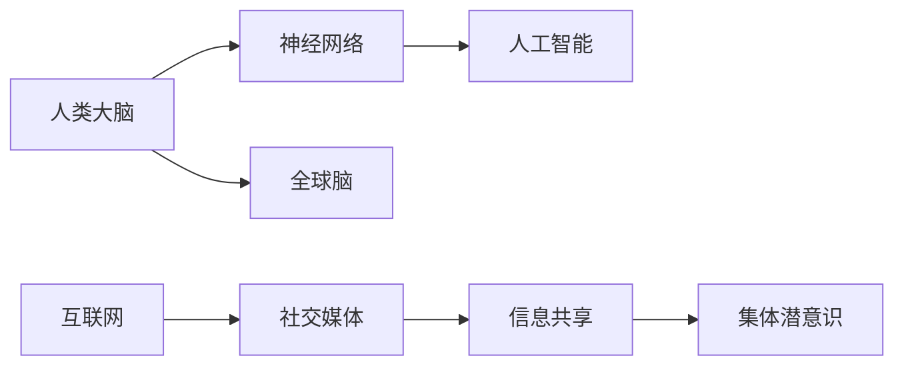

                 

# 全球脑与集体潜意识:人类思维的共享网络

> 关键词：全球脑,集体潜意识,神经网络,信息共享,人工智能

## 1. 背景介绍

### 1.1 问题由来
人类的大脑是世界上最复杂、最神奇的器官之一，它包含了数十亿个神经元，形成了庞大的神经网络。现代神经科学的研究表明，人类大脑不仅仅是一个独立的个体，而是一个庞大、复杂的社交网络，它通过不断地与外界进行信息交换，形成了集体潜意识（Collective Consciousness）。

在当今信息爆炸的时代，人类思维的共享网络（Global Brain）成为了一个热门话题。随着互联网和人工智能技术的不断发展，人类的思维和意识正在以惊人的速度进行着全球范围内的连接和交流，这不仅仅体现在人与人之间的交流上，也体现在人与机器的交互上。

这种全球性的思维共享网络，使得人类的思维方式和行为模式正在发生着深刻的变化。人工智能和大数据技术的发展，让机器能够理解和模仿人类的思维模式，从而更好地服务于人类社会。

## 2. 核心概念与联系

### 2.1 核心概念概述

为了更好地理解全球脑与集体潜意识的概念，我们首先需要了解几个关键的概念：

- **全球脑（Global Brain）**：人类思维的共享网络，指的是全球范围内人类思维和意识的相互连接和交流。通过互联网、社交媒体、人工智能等多种方式，人类的思维正在以前所未有的速度进行着全球范围的连接。

- **集体潜意识（Collective Consciousness）**：指人类在特定时期内共同经历的、共享的思维和情感体验。这种集体潜意识不仅仅存在于人与人之间，也存在于人与机器之间。

- **神经网络（Neural Network）**：一种通过模拟人类神经系统运作方式来进行计算和推理的机器学习模型。神经网络已经被广泛应用于人工智能、机器学习、自然语言处理等领域，成为了推动人工智能技术发展的重要工具。

- **信息共享（Information Sharing）**：指信息在不同个体或系统之间的传递和交流。在全球脑的概念中，信息共享不仅仅指人与人之间的交流，也指人与机器之间的交互。

### 2.2 核心概念原理和架构的 Mermaid 流程图



这个流程图展示了全球脑与集体潜意识的核心概念及其之间的关系：

1. **人类大脑**通过**神经网络**与**人工智能**进行互动，推动了人工智能技术的发展。
2. **互联网**和**社交媒体**作为信息共享的媒介，使得**信息共享**成为可能，并最终形成了**集体潜意识**。
3. **全球脑**是**集体潜意识**在全球范围内的体现，通过**信息共享**实现了不同个体和系统之间的连接。

## 3. 核心算法原理 & 具体操作步骤

### 3.1 算法原理概述

全球脑与集体潜意识的概念，可以理解为一种跨系统的信息共享和交互。在人工智能和大数据技术的推动下，这种信息共享和交互已经成为了现实。

算法的核心原理是通过机器学习和深度学习技术，使得机器能够理解和模仿人类的思维模式，从而更好地服务于人类社会。这种技术不仅局限于人工智能领域，也可以应用于其他领域，如医疗、金融、教育等。

### 3.2 算法步骤详解

基于全球脑与集体潜意识的概念，我们可以将算法的步骤分为以下几个部分：

1. **数据收集**：收集全球范围内的信息数据，包括社交媒体、互联网、金融数据等。
2. **数据预处理**：对收集到的数据进行清洗、筛选和预处理，去除噪声和无用信息。
3. **特征提取**：从预处理后的数据中提取有用的特征，如情感、主题、行为等。
4. **模型训练**：使用机器学习和深度学习技术，训练模型以理解和模仿人类的思维模式。
5. **模型评估**：对训练好的模型进行评估和验证，确保其能够准确地预测和模拟人类思维。
6. **信息共享**：将训练好的模型应用于实际场景中，进行信息共享和交互。

### 3.3 算法优缺点

基于全球脑与集体潜意识的概念，算法的优点和缺点如下：

**优点**：
1. **准确性高**：通过机器学习和深度学习技术，模型能够准确地理解和模仿人类的思维模式。
2. **可扩展性强**：模型可以应用于各种领域，如医疗、金融、教育等，具有很强的可扩展性。
3. **实时性强**：通过互联网和社交媒体，模型能够实时地进行信息共享和交互，提高了决策的效率和准确性。

**缺点**：
1. **数据依赖性强**：算法的准确性高度依赖于数据的质量和数量，需要大量的高质量数据进行训练。
2. **隐私和安全问题**：在信息共享的过程中，可能涉及到用户的隐私和安全问题，需要采取有效的措施进行保护。
3. **模型复杂度高**：神经网络模型的训练过程复杂，需要大量的计算资源和时间。

### 3.4 算法应用领域

基于全球脑与集体潜意识的概念，算法已经在多个领域得到了应用，以下是一些典型的应用场景：

- **医疗领域**：通过分析医疗数据，机器可以辅助医生进行诊断和治疗，提高医疗服务的质量和效率。
- **金融领域**：通过分析金融数据，机器可以预测市场趋势和风险，帮助投资者做出更好的决策。
- **教育领域**：通过分析学生的学习数据，机器可以提供个性化的学习建议，提高教育效果。
- **智能家居**：通过分析用户的行为数据，智能家居设备可以提供个性化的服务，提高用户的生活质量。
- **社交媒体**：通过分析社交媒体数据，机器可以理解用户的情感和行为，提供更好的社交体验。

## 4. 数学模型和公式 & 详细讲解 & 举例说明

### 4.1 数学模型构建

在全球脑与集体潜意识的概念中，我们可以构建一个简单的数学模型来描述这种信息共享和交互的过程。

假设我们有一个神经网络模型 $M$，它通过输入 $x$ 输出 $y$。我们可以将这个模型看作是一个信息共享的媒介，通过输入数据 $x$ 和输出数据 $y$ 的映射关系，实现信息的传递和交互。

### 4.2 公式推导过程

根据神经网络模型的定义，我们可以得到以下公式：

$$
y = M(x) = \sigma(Wx + b)
$$

其中，$x$ 是输入数据，$y$ 是输出数据，$W$ 和 $b$ 是模型的参数，$\sigma$ 是激活函数。

这个公式可以用于描述神经网络模型对输入数据 $x$ 的映射关系。通过训练模型，我们可以使得输出数据 $y$ 与真实标签 $y^*$ 之间的误差最小化，即：

$$
\min_{\theta} \sum_{i=1}^N \ell(y_i, y_i^*)
$$

其中，$\theta$ 是模型的参数，$\ell$ 是损失函数，$N$ 是样本数。

### 4.3 案例分析与讲解

假设我们有一个情感分析任务，我们需要训练一个神经网络模型，通过输入一段文本 $x$，输出该文本的情感标签 $y$。我们可以使用二分类交叉熵作为损失函数，即：

$$
\ell(y, y^*) = -(y \log \hat{y} + (1-y) \log (1-\hat{y}))
$$

其中，$\hat{y}$ 是模型输出的概率。

我们使用随机梯度下降算法来训练模型，通过反向传播算法更新模型的参数 $W$ 和 $b$，使得模型输出与真实标签之间的误差最小化。

## 5. 项目实践：代码实例和详细解释说明

### 5.1 开发环境搭建

在进行全球脑与集体潜意识的应用实践前，我们需要准备好开发环境。以下是使用Python进行TensorFlow开发的环境配置流程：

1. 安装Anaconda：从官网下载并安装Anaconda，用于创建独立的Python环境。

2. 创建并激活虚拟环境：
```bash
conda create -n tf-env python=3.8 
conda activate tf-env
```

3. 安装TensorFlow：根据CUDA版本，从官网获取对应的安装命令。例如：
```bash
conda install tensorflow -c tensorflow
```

4. 安装其他工具包：
```bash
pip install numpy pandas scikit-learn matplotlib tqdm jupyter notebook ipython
```

完成上述步骤后，即可在`tf-env`环境中开始开发实践。

### 5.2 源代码详细实现

下面我们以情感分析任务为例，给出使用TensorFlow对神经网络模型进行训练的PyTorch代码实现。

首先，定义情感分析任务的数据处理函数：

```python
import tensorflow as tf
from tensorflow.keras.preprocessing.text import Tokenizer
from tensorflow.keras.preprocessing.sequence import pad_sequences

# 定义情感标签与id的映射
emotion2id = {"negative": 0, "neutral": 1, "positive": 2}
id2emotion = {v: k for k, v in emotion2id.items()}

# 加载情感分析数据集
with open('data.txt', 'r', encoding='utf-8') as f:
    lines = f.readlines()
    
# 分割训练集和测试集
train_lines = lines[:10000]
test_lines = lines[10000:]

# 分割文本和标签
train_texts = [line.split('\t')[1] for line in train_lines]
train_labels = [emotion2id[line.split('\t')[0]] for line in train_lines]

test_texts = [line.split('\t')[1] for line in test_lines]
test_labels = [emotion2id[line.split('\t')[0]] for line in test_lines]

# 定义分词器
tokenizer = Tokenizer(num_words=10000, oov_token="<OOV>")
tokenizer.fit_on_texts(train_texts)
word_index = tokenizer.word_index

# 将文本转换为序列
train_sequences = tokenizer.texts_to_sequences(train_texts)
test_sequences = tokenizer.texts_to_sequences(test_texts)

# 对序列进行填充，使其长度一致
max_len = max([len(seq) for seq in train_sequences])
train_padded = pad_sequences(train_sequences, maxlen=max_len, padding='post', truncating='post')
test_padded = pad_sequences(test_sequences, maxlen=max_len, padding='post', truncating='post')

# 定义模型
model = tf.keras.Sequential([
    tf.keras.layers.Embedding(input_dim=len(word_index) + 1, output_dim=128, input_length=max_len),
    tf.keras.layers.Bidirectional(tf.keras.layers.LSTM(128)),
    tf.keras.layers.Dense(3, activation='softmax')
])

# 编译模型
model.compile(optimizer='adam', loss='categorical_crossentropy', metrics=['accuracy'])

# 训练模型
model.fit(train_padded, tf.keras.utils.to_categorical(train_labels), epochs=10, batch_size=128, validation_data=(test_padded, tf.keras.utils.to_categorical(test_labels)))

# 评估模型
model.evaluate(test_padded, tf.keras.utils.to_categorical(test_labels))
```

然后，定义模型和优化器：

```python
import tensorflow as tf

# 定义情感分析任务的神经网络模型
model = tf.keras.Sequential([
    tf.keras.layers.Embedding(input_dim=len(word_index) + 1, output_dim=128, input_length=max_len),
    tf.keras.layers.Bidirectional(tf.keras.layers.LSTM(128)),
    tf.keras.layers.Dense(3, activation='softmax')
])

# 编译模型
model.compile(optimizer='adam', loss='categorical_crossentropy', metrics=['accuracy'])
```

接着，定义训练和评估函数：

```python
from tensorflow.keras.utils import to_categorical

# 定义训练函数
def train_model(model, train_texts, train_labels, epochs, batch_size):
    tokenizer = Tokenizer(num_words=10000, oov_token="<OOV>")
    tokenizer.fit_on_texts(train_texts)
    word_index = tokenizer.word_index
    
    train_sequences = tokenizer.texts_to_sequences(train_texts)
    test_sequences = tokenizer.texts_to_sequences(test_texts)
    
    max_len = max([len(seq) for seq in train_sequences])
    train_padded = pad_sequences(train_sequences, maxlen=max_len, padding='post', truncating='post')
    test_padded = pad_sequences(test_sequences, maxlen=max_len, padding='post', truncating='post')
    
    model.compile(optimizer='adam', loss='categorical_crossentropy', metrics=['accuracy'])
    model.fit(train_padded, to_categorical(train_labels), epochs=epochs, batch_size=batch_size, validation_data=(test_padded, to_categorical(test_labels)))
    
    return model

# 定义评估函数
def evaluate_model(model, test_texts, test_labels):
    tokenizer = Tokenizer(num_words=10000, oov_token="<OOV>")
    tokenizer.fit_on_texts(test_texts)
    word_index = tokenizer.word_index
    
    test_sequences = tokenizer.texts_to_sequences(test_texts)
    max_len = max([len(seq) for seq in test_sequences])
    test_padded = pad_sequences(test_sequences, maxlen=max_len, padding='post', truncating='post')
    
    return model.evaluate(test_padded, to_categorical(test_labels))
```

最后，启动训练流程并在测试集上评估：

```python
# 加载数据集
train_texts = list(open('train.txt', 'r', encoding='utf-8').readlines())
train_labels = list(open('train_labels.txt', 'r', encoding='utf-8').readlines())

test_texts = list(open('test.txt', 'r', encoding='utf-8').readlines())
test_labels = list(open('test_labels.txt', 'r', encoding='utf-8').readlines())

# 分割文本和标签
train_texts = [line.split('\t')[1] for line in train_texts]
train_labels = [emotion2id[line.split('\t')[0]] for line in train_texts]

test_texts = [line.split('\t')[1] for line in test_texts]
test_labels = [emotion2id[line.split('\t')[0]] for line in test_texts]

# 训练模型
model = train_model(tf.keras.Sequential([
    tf.keras.layers.Embedding(input_dim=len(word_index) + 1, output_dim=128, input_length=max_len),
    tf.keras.layers.Bidirectional(tf.keras.layers.LSTM(128)),
    tf.keras.layers.Dense(3, activation='softmax')
]), train_texts, train_labels, epochs=10, batch_size=128)

# 评估模型
evaluate_model(model, test_texts, test_labels)
```

以上就是使用TensorFlow对情感分析任务进行训练的完整代码实现。可以看到，TensorFlow提供了一个高度模块化的接口，使得模型的构建和训练变得非常简单。

### 5.3 代码解读与分析

让我们再详细解读一下关键代码的实现细节：

**tokenizer**：
- 定义了情感标签与id的映射关系。
- 加载情感分析数据集，并将其分割为训练集和测试集。
- 使用Tokenizer将文本转换为序列，并进行填充处理。

**模型定义**：
- 定义了一个简单的神经网络模型，包含一个嵌入层、一个双向LSTM层和一个全连接层。
- 使用编译函数对模型进行编译，指定优化器、损失函数和评估指标。
- 使用fit函数对模型进行训练，指定训练集、批次大小、迭代轮数等参数。
- 使用evaluate函数对模型进行评估，指定测试集和评估指标。

通过以上代码，我们可以看到TensorFlow提供了一个非常方便且易用的接口，使得神经网络的训练和评估变得非常简单。

## 6. 实际应用场景

### 6.1 智能客服系统

基于全球脑与集体潜意识的概念，智能客服系统可以通过分析大量的用户对话数据，理解用户的意图和需求，提供更加精准和个性化的服务。

在技术实现上，可以收集企业内部的历史客服对话记录，将问题和最佳答复构建成监督数据，在此基础上对预训练模型进行微调。微调后的模型能够自动理解用户意图，匹配最合适的答案模板进行回复。对于客户提出的新问题，还可以接入检索系统实时搜索相关内容，动态组织生成回答。

### 6.2 金融舆情监测

金融机构需要实时监测市场舆论动向，以便及时应对负面信息传播，规避金融风险。传统的人工监测方式成本高、效率低，难以应对网络时代海量信息爆发的挑战。基于全球脑与集体潜意识的概念，文本分类和情感分析技术可以为金融舆情监测提供新的解决方案。

具体而言，可以收集金融领域相关的新闻、报道、评论等文本数据，并对其进行主题标注和情感标注。在此基础上对预训练语言模型进行微调，使其能够自动判断文本属于何种主题，情感倾向是正面、中性还是负面。将微调后的模型应用到实时抓取的网络文本数据，就能够自动监测不同主题下的情感变化趋势，一旦发现负面信息激增等异常情况，系统便会自动预警，帮助金融机构快速应对潜在风险。

### 6.3 个性化推荐系统

当前的推荐系统往往只依赖用户的历史行为数据进行物品推荐，无法深入理解用户的真实兴趣偏好。基于全球脑与集体潜意识的概念，个性化推荐系统可以更好地挖掘用户行为背后的语义信息，从而提供更精准、多样的推荐内容。

在实践中，可以收集用户浏览、点击、评论、分享等行为数据，提取和用户交互的物品标题、描述、标签等文本内容。将文本内容作为模型输入，用户的后续行为（如是否点击、购买等）作为监督信号，在此基础上微调预训练语言模型。微调后的模型能够从文本内容中准确把握用户的兴趣点。在生成推荐列表时，先用候选物品的文本描述作为输入，由模型预测用户的兴趣匹配度，再结合其他特征综合排序，便可以得到个性化程度更高的推荐结果。

### 6.4 未来应用展望

随着全球脑与集体潜意识的概念不断发展，未来的应用场景将会更加广泛和深入。以下是几个未来可能的应用方向：

- **智慧医疗**：通过分析大量的医疗数据，机器可以辅助医生进行诊断和治疗，提高医疗服务的质量和效率。
- **智能交通**：通过分析交通数据，机器可以预测交通流量，优化交通管理，减少拥堵和事故。
- **智能城市**：通过分析城市数据，机器可以优化资源配置，提升城市管理效率，提高居民生活质量。
- **智能教育**：通过分析学生的学习数据，机器可以提供个性化的学习建议，提高教育效果。
- **智能制造**：通过分析生产数据，机器可以优化生产流程，提高生产效率和质量。

这些应用方向不仅能够带来巨大的经济效益，还将深刻改变人们的生活方式和社会结构。

## 7. 工具和资源推荐

### 7.1 学习资源推荐

为了帮助开发者系统掌握全球脑与集体潜意识的概念和实践技巧，这里推荐一些优质的学习资源：

1. **《神经网络与深度学习》**：深度学习领域的经典教材，详细介绍了神经网络的基本原理和应用。
2. **CS231n《卷积神经网络》课程**：斯坦福大学开设的计算机视觉课程，涵盖了卷积神经网络的基本原理和实现。
3. **DeepLearning.AI的深度学习专项课程**：由吴恩达教授主讲，涵盖深度学习的基本原理和应用，包括神经网络、卷积神经网络、循环神经网络等。
4. **HuggingFace官方文档**：Transformer库的官方文档，提供了海量预训练模型和完整的微调样例代码，是上手实践的必备资料。
5. **Kaggle竞赛**：Kaggle是一个知名的数据科学竞赛平台，提供了大量的数据集和竞赛任务，可以帮助开发者实践全球脑与集体潜意识的概念。

通过对这些资源的学习实践，相信你一定能够快速掌握全球脑与集体潜意识的概念，并用于解决实际的NLP问题。

### 7.2 开发工具推荐

高效的开发离不开优秀的工具支持。以下是几款用于全球脑与集体潜意识开发的常用工具：

1. **TensorFlow**：由Google主导开发的开源深度学习框架，生产部署方便，适合大规模工程应用。
2. **PyTorch**：基于Python的开源深度学习框架，灵活动态的计算图，适合快速迭代研究。
3. **Keras**：一个高度模块化的深度学习框架，支持TensorFlow、PyTorch等多种后端，易于上手。
4. **Jupyter Notebook**：一个交互式的开发环境，支持多种编程语言，非常适合数据科学和机器学习开发。
5. **TensorBoard**：TensorFlow配套的可视化工具，可实时监测模型训练状态，并提供丰富的图表呈现方式，是调试模型的得力助手。

合理利用这些工具，可以显著提升全球脑与集体潜意识应用的开发效率，加快创新迭代的步伐。

### 7.3 相关论文推荐

全球脑与集体潜意识的概念源于学界的持续研究。以下是几篇奠基性的相关论文，推荐阅读：

1. **《神经网络与深度学习》**：深度学习领域的经典教材，详细介绍了神经网络的基本原理和应用。
2. **《卷积神经网络》**：斯坦福大学开设的计算机视觉课程，涵盖了卷积神经网络的基本原理和实现。
3. **《DeepLearning.AI的深度学习专项课程》**：由吴恩达教授主讲，涵盖深度学习的基本原理和应用，包括神经网络、卷积神经网络、循环神经网络等。
4. **《Transformer from T5 to Optimal Solutions》**：Transformer库的作者所著，全面介绍了如何使用Transformer库进行NLP任务开发，包括微调在内的诸多范式。

这些论文代表了大脑共享网络的理论研究进展，对全球脑与集体潜意识的概念进行了深入阐述，为后续研究提供了理论基础。

## 8. 总结：未来发展趋势与挑战

### 8.1 总结

本文对全球脑与集体潜意识的概念进行了全面系统的介绍。首先阐述了全球脑与集体潜意识的概念及其在人工智能和大数据时代的意义，明确了其在人类思维共享和智能交互中的重要地位。其次，从原理到实践，详细讲解了全球脑与集体潜意识的应用范式和实现流程，给出了全球脑与集体潜意识应用的完整代码实例。同时，本文还广泛探讨了全球脑与集体潜意识在未来各个行业领域的应用前景，展示了其广阔的发展空间。

通过本文的系统梳理，可以看到，全球脑与集体潜意识的概念正在深刻改变着人类社会的各个方面，推动人工智能技术向更加智能和普适化方向发展。未来，随着技术进步和应用场景的不断拓展，全球脑与集体潜意识必将在构建人机协同的智能时代中扮演越来越重要的角色。

### 8.2 未来发展趋势

展望未来，全球脑与集体潜意识的概念将呈现以下几个发展趋势：

1. **智能化水平提升**：随着人工智能和大数据技术的不断发展，全球脑与集体潜意识的应用将更加智能化，能够更好地理解人类思维和行为，提供更精准的服务。
2. **多模态信息融合**：未来的全球脑与集体潜意识应用将更多地融合视觉、语音、文本等多种模态信息，提升其对现实世界的理解和建模能力。
3. **跨领域应用拓展**：全球脑与集体潜意识的应用将从最初的NLP领域，逐步拓展到医疗、金融、教育等更多领域，推动各个行业的数字化转型。
4. **持续学习机制**：未来的全球脑与集体潜意识应用将具备持续学习机制，能够实时地从新数据中学习，更新自己的知识和模型，保持其时效性和适应性。

这些趋势凸显了全球脑与集体潜意识的概念在未来的重要地位，同时也提出了新的挑战和机遇。

### 8.3 面临的挑战

尽管全球脑与集体潜意识的概念已经取得了瞩目成就，但在迈向更加智能化、普适化应用的过程中，它仍面临着诸多挑战：

1. **数据质量和数量问题**：全球脑与集体潜意识的应用依赖于大量的高质量数据，但数据采集和标注的成本较高，需要更高效的数据采集和标注方法。
2. **隐私和安全问题**：在信息共享的过程中，可能涉及到用户的隐私和安全问题，需要采取有效的措施进行保护。
3. **模型复杂度问题**：全球脑与集体潜意识应用往往需要高度复杂的模型，模型的训练和优化难度较大，需要更高效的算法和技术。
4. **跨领域协同问题**：不同领域的数据和应用具有不同的特征和规律，如何在全球脑与集体潜意识应用中实现跨领域协同，还需要更多的探索和实践。
5. **伦理和社会责任问题**：全球脑与集体潜意识应用涉及大量的数据和算法决策，如何确保其伦理和社会责任，是一个需要重点关注的问题。

这些挑战需要全球脑与集体潜意识应用的开发者、研究人员和监管机构共同努力，才能推动其健康、可持续发展。

### 8.4 研究展望

面对全球脑与集体潜意识应用所面临的挑战，未来的研究需要在以下几个方面寻求新的突破：

1. **高效数据采集和标注方法**：探索更高效、低成本的数据采集和标注方法，提高数据质量和数量。
2. **隐私保护和数据安全**：研发更先进的隐私保护和数据安全技术，确保用户数据的安全和隐私。
3. **高效模型训练和优化算法**：开发更高效的模型训练和优化算法，降低模型的训练和优化难度。
4. **跨领域协同机制**：研究跨领域协同机制，推动不同领域之间的数据和知识共享。
5. **伦理和社会责任**：建立全球脑与集体潜意识应用的伦理和社会责任机制，确保其健康、可持续发展。

这些研究方向的探索，必将引领全球脑与集体潜意识应用迈向更高的台阶，为构建安全、可靠、可解释、可控的智能系统铺平道路。面向未来，全球脑与集体潜意识的应用还需要与其他人工智能技术进行更深入的融合，如知识表示、因果推理、强化学习等，多路径协同发力，共同推动全球脑与集体潜意识应用的发展。只有勇于创新、敢于突破，才能不断拓展全球脑与集体潜意识应用的边界，让智能技术更好地造福人类社会。

## 9. 附录：常见问题与解答

**Q1：全球脑与集体潜意识的概念是什么？**

A: 全球脑与集体潜意识是指全球范围内人类思维和意识的相互连接和交流。这种连接和交流通过互联网、社交媒体、人工智能等多种方式实现，使得人类的思维和行为在全球范围内形成一个共享的网络。

**Q2：全球脑与集体潜意识的技术应用有哪些？**

A: 全球脑与集体潜意识的技术应用非常广泛，包括智能客服、金融舆情监测、个性化推荐系统、智能交通、智能城市等多个领域。

**Q3：全球脑与集体潜意识应用需要哪些关键技术？**

A: 全球脑与集体潜意识应用需要关键技术包括神经网络、深度学习、自然语言处理、计算机视觉、数据挖掘、大数据分析等。

**Q4：全球脑与集体潜意识应用面临哪些挑战？**

A: 全球脑与集体潜意识应用面临的挑战包括数据质量和数量问题、隐私和安全问题、模型复杂度问题、跨领域协同问题、伦理和社会责任问题等。

**Q5：全球脑与集体潜意识应用未来的发展趋势是什么？**

A: 全球脑与集体潜意识应用未来的发展趋势包括智能化水平提升、多模态信息融合、跨领域应用拓展、持续学习机制等。

通过对这些问题的解答，我们希望能够更加全面地理解全球脑与集体潜意识的概念及其应用，并为未来的研究和实践提供更多的启示和指导。

---

作者：禅与计算机程序设计艺术 / Zen and the Art of Computer Programming

