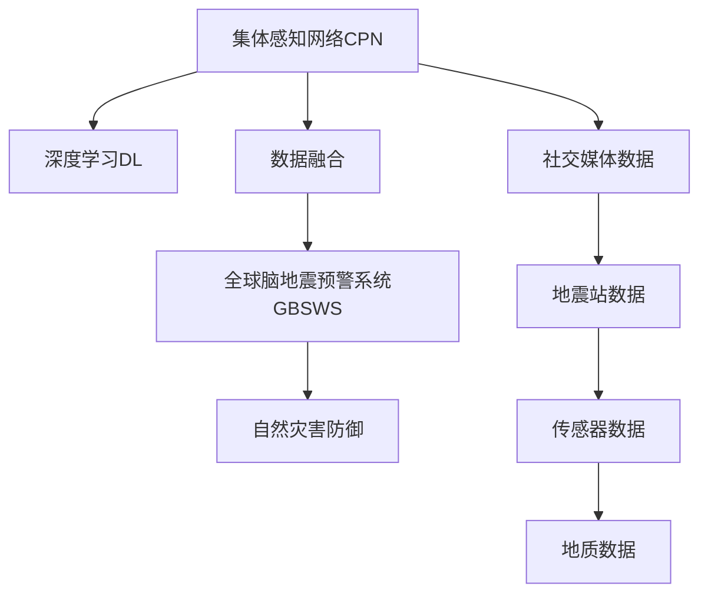

                 

# 全球脑地震预警:集体感知网络的地质灾害防御

> 关键词：全球脑预警系统,地震预测模型,集体感知网络,自然灾害防御,人工智能,AI,数据融合

## 1. 背景介绍

### 1.1 问题由来

地震作为最具破坏力的自然灾害之一，对人类社会的危害深远。尽管现代科技发展使得地震监测和预警能力大幅提升，但如何实现更精准、更及时的地震预警，仍然是一个世界性的难题。传统的地震预警方法依赖于地震波的传播速度，但地震波的传播路径和速度受地质结构影响较大，在预测上存在诸多不确定性。

近年来，人工智能技术的发展为地震预测带来了新的希望。尤其是深度学习等技术的广泛应用，使得科学家们可以通过海量数据挖掘出地震活动的规律，预测其发生的可能性。但单个模型的局限性依然存在，无法充分整合各方资源，实现全局性的地震预警。

因此，本文旨在探讨一种新的地震预警方案，通过构建一个集体感知网络（Collective Perception Network, CPN），实现对全球地震活动的综合监测与预警。该方案利用人工智能技术，特别是深度学习、大数据、数据融合等技术，构建一个能够协同工作、实时共享地震信息的预警系统，提供更为精准和及时的地震预警服务。

### 1.2 问题核心关键点

本文研究的核心问题包括：
- 如何构建一个能够全球范围内实时共享地震信息的集体感知网络？
- 如何设计一个能够整合多源数据、融合多模型结果的地震预测模型？
- 如何优化地震预警系统的运行效率和准确性，降低误报和漏报率？

针对这些问题，本文提出了一种基于全球脑地震预警系统（Global Brain Seismic Warning System, GBSWS）的解决方案，通过构建一个由全球地震站、传感器、社交媒体等多源数据构成的集体感知网络，利用深度学习技术对地震信号进行综合分析，实现地震的精准预测和及时预警。

## 2. 核心概念与联系

### 2.1 核心概念概述

在探讨地震预警系统之前，我们需要了解几个核心概念：

- **集体感知网络（Collective Perception Network, CPN）**：指由多个分布式节点组成的网络，每个节点可以感知到自身所在的局部地震活动，并通过网络将信息传递给其他节点。

- **全球脑地震预警系统（Global Brain Seismic Warning System, GBSWS）**：基于CPN构架的全球地震预警系统，利用人工智能技术对全球地震活动进行实时监测与预测，并通过预警网络实现信息的及时传播。

- **深度学习（Deep Learning, DL）**：一种基于多层神经网络的学习方法，能够自动学习输入数据中的特征，实现对地震数据的复杂模式识别和预测。

- **数据融合（Data Fusion）**：通过综合利用多个数据源，提取其共同特征，实现信息整合和结果优化，提高地震预测的准确性和可靠性。

- **自然灾害防御（Natural Disaster Defense）**：指通过技术手段减少或避免自然灾害对人类社会的危害，包括地震、洪水、台风等。

这些概念之间的逻辑关系可以通过以下Mermaid流程图来展示：



这个流程图展示了地震预警系统的主要组成和运作流程：

1. 由全球地震站、传感器、社交媒体等多源数据构成的集体感知网络感知本地地震活动。
2. 利用深度学习技术对地震信号进行综合分析。
3. 数据融合技术整合多个数据源的结果，优化地震预测。
4. 全球脑地震预警系统实现地震的精准预测和及时预警。
5. 预警系统提供信息给自然灾害防御系统，减少灾害对人类社会的危害。

## 3. 核心算法原理 & 具体操作步骤
### 3.1 算法原理概述

全球脑地震预警系统的核心算法原理基于深度学习和大数据技术。通过对多源数据的收集与整合，构建一个多层次、多节点的神经网络，利用多层感知器（MLP）、卷积神经网络（CNN）、循环神经网络（RNN）等深度学习模型，对地震信号进行综合分析和预测。

该系统包括两个主要部分：

- **数据采集与融合模块**：通过全球地震站、传感器、社交媒体等多源数据采集器，实时收集全球范围内的地震数据。利用数据融合技术，将不同来源的数据进行整合和优化。
- **深度学习预测与预警模块**：利用深度学习模型对整合后的数据进行分析和预测，实现地震的精准预测和及时预警。

### 3.2 算法步骤详解

全球脑地震预警系统的具体实现步骤如下：

**Step 1: 数据采集与预处理**
- 收集全球地震站、传感器、社交媒体等多源数据。
- 对数据进行清洗和预处理，去除噪声和不相关数据。
- 利用数据融合技术，将不同来源的数据进行整合，形成全局地震活动数据集。

**Step 2: 深度学习模型设计**
- 设计深度学习模型架构，包括多层感知器（MLP）、卷积神经网络（CNN）、循环神经网络（RNN）等。
- 对模型进行训练，利用历史地震数据作为训练样本。
- 进行超参数调优，确保模型具有较高的预测准确性和泛化能力。

**Step 3: 数据融合与结果优化**
- 利用数据融合技术，对不同模型的预测结果进行综合分析。
- 引入专家知识库，进行规则增强和解释，提高预测的准确性和可靠性。
- 通过对抗训练和正则化技术，提高模型的鲁棒性和泛化能力。

**Step 4: 预警与防御**
- 根据深度学习模型的预测结果，生成地震预警信息。
- 通过预警网络，将预警信息传递给各个地震站、传感器、社交媒体等节点。
- 利用预警信息，指导自然灾害防御系统采取相应的防御措施，降低灾害对人类社会的危害。

**Step 5: 系统评估与优化**
- 定期对系统进行评估，监控其运行状态和预测准确性。
- 根据评估结果，进行模型和算法的优化，提高系统的可靠性和精度。

### 3.3 算法优缺点

全球脑地震预警系统的优点包括：
1. 利用多源数据融合，提高地震预测的准确性和可靠性。
2. 深度学习模型能够自动学习复杂模式，实现对地震信号的精准分析。
3. 利用全球预警网络，实现信息的实时共享和及时传播，减少地震预警的延迟。
4. 系统具有较高的可扩展性，能够应对不同地区和不同类型的地震。

缺点包括：
1. 对数据采集和预处理的要求较高，需要高质量、高频率的多源数据。
2. 深度学习模型的训练和优化需要大量的计算资源和时间。
3. 数据融合和规则增强过程较为复杂，需要设计合理的算法和模型。
4. 预警系统的实时性和准确性受到多种因素的影响，如网络延迟、数据质量等。

### 3.4 算法应用领域

全球脑地震预警系统可以在以下几个领域得到广泛应用：

- **全球地震监测与预警**：利用全球脑系统，实现对全球范围内地震活动的实时监测与预警，提供精准的地震预警信息。
- **城市地震防御**：结合城市建筑、交通、通信等基础设施的地震防御系统，实现城市的地震风险评估和紧急响应。
- **地震科研**：提供高质量的地震数据和预测结果，支持地震科研工作，推动地震学的发展。
- **灾害应对**：在地震发生后，提供及时的灾害应对建议和救援指导，降低灾害的破坏力。

## 4. 数学模型和公式 & 详细讲解 & 举例说明
### 4.1 数学模型构建

本文使用多源数据融合与深度学习模型预测地震的技术框架，模型主要由以下几部分构成：

- **数据采集模块**：从全球地震站、传感器、社交媒体等获取多源数据。
- **数据预处理模块**：对数据进行清洗、归一化和去噪处理。
- **深度学习预测模型**：设计多层感知器（MLP）、卷积神经网络（CNN）、循环神经网络（RNN）等深度学习模型，对地震信号进行预测。
- **数据融合模块**：利用数据融合技术，将不同模型的预测结果进行综合分析。
- **预警与防御模块**：将深度学习模型的预测结果转化为地震预警信息，并通过预警网络传递给各个节点。

### 4.2 公式推导过程

以卷积神经网络（CNN）为例，推导其在地震预测中的应用。

假设地震数据为 $x \in \mathbb{R}^n$，其中 $n$ 为数据的维数。CNN 的基本结构包括卷积层、池化层、全连接层等。CNN 通过卷积操作提取地震数据的局部特征，并通过池化操作减少特征数量，防止过拟合。最后，通过全连接层对特征进行分类，输出地震预测结果 $y \in \{0,1\}$，其中 $0$ 表示无地震，$1$ 表示有地震。

具体来说，CNN 的输出层公式为：

$$
y = \sigma\left(\sum_{i=1}^k w_i x_i + b\right)
$$

其中 $\sigma$ 为激活函数，$k$ 为全连接层的节点数，$w_i$ 为权重参数，$b$ 为偏置参数。

在训练过程中，使用交叉熵损失函数进行优化：

$$
\mathcal{L} = -\frac{1}{N} \sum_{i=1}^N \sum_{j=1}^C y_{ij} \log \hat{y}_{ij} + (1-y_{ij}) \log(1-\hat{y}_{ij})
$$

其中 $N$ 为样本数，$C$ 为类别数，$y_{ij}$ 为真实标签，$\hat{y}_{ij}$ 为模型预测的概率值。

### 4.3 案例分析与讲解

以印度东部的一次地震预测为例，介绍全球脑地震预警系统的具体应用。

1. **数据采集与预处理**：通过全球地震站、传感器和社交媒体收集数据，对数据进行清洗和归一化处理，形成全局地震活动数据集。

2. **深度学习模型设计**：设计卷积神经网络（CNN）模型，利用历史地震数据进行训练，并对模型进行超参数调优，确保其具有较高的预测准确性。

3. **数据融合与结果优化**：利用数据融合技术，将不同模型的预测结果进行综合分析，并引入专家知识库进行规则增强，提高预测的准确性和可靠性。

4. **预警与防御**：根据深度学习模型的预测结果，生成地震预警信息，并通过预警网络传递给各个地震站、传感器和社交媒体等节点，指导自然灾害防御系统采取相应的防御措施。

5. **系统评估与优化**：定期对系统进行评估，监控其运行状态和预测准确性，根据评估结果进行模型和算法的优化，提高系统的可靠性和精度。

## 5. 项目实践：代码实例和详细解释说明
### 5.1 开发环境搭建

在进行全球脑地震预警系统的开发前，我们需要准备好开发环境。以下是使用Python进行PyTorch开发的环境配置流程：

1. 安装Anaconda：从官网下载并安装Anaconda，用于创建独立的Python环境。

2. 创建并激活虚拟环境：
```bash
conda create -n pytorch-env python=3.8 
conda activate pytorch-env
```

3. 安装PyTorch：根据CUDA版本，从官网获取对应的安装命令。例如：
```bash
conda install pytorch torchvision torchaudio cudatoolkit=11.1 -c pytorch -c conda-forge
```

4. 安装TensorFlow：由Google主导开发的开源深度学习框架，生产部署方便，适合大规模工程应用。同样有丰富的预训练语言模型资源。

5. 安装TensorFlow：
```bash
pip install tensorflow
```

6. 安装各类工具包：
```bash
pip install numpy pandas scikit-learn matplotlib tqdm jupyter notebook ipython
```

完成上述步骤后，即可在`pytorch-env`环境中开始全球脑地震预警系统的开发实践。

### 5.2 源代码详细实现

下面我们以印度东部的一次地震预测为例，给出使用PyTorch和TensorFlow进行全球脑地震预警系统开发的PyTorch代码实现。

首先，定义数据预处理函数：

```python
import numpy as np
import pandas as pd
from sklearn.preprocessing import MinMaxScaler

def preprocess_data(data):
    # 数据清洗
    data = data.dropna()
    # 数据归一化
    scaler = MinMaxScaler()
    data = scaler.fit_transform(data)
    return data
```

然后，定义深度学习模型：

```python
import torch
import torch.nn as nn
import torch.optim as optim

class CNN(nn.Module):
    def __init__(self, in_channels, out_channels):
        super(CNN, self).__init__()
        self.conv1 = nn.Conv2d(in_channels, 32, kernel_size=3, stride=1, padding=1)
        self.pool1 = nn.MaxPool2d(kernel_size=2, stride=2)
        self.conv2 = nn.Conv2d(32, 64, kernel_size=3, stride=1, padding=1)
        self.pool2 = nn.MaxPool2d(kernel_size=2, stride=2)
        self.fc1 = nn.Linear(64*8*8, 128)
        self.fc2 = nn.Linear(128, 2)

    def forward(self, x):
        x = torch.relu(self.conv1(x))
        x = self.pool1(x)
        x = torch.relu(self.conv2(x))
        x = self.pool2(x)
        x = x.view(-1, 64*8*8)
        x = torch.relu(self.fc1(x))
        x = torch.sigmoid(self.fc2(x))
        return x
```

接着，定义模型训练函数：

```python
from torch.utils.data import TensorDataset, DataLoader

def train_model(model, train_data, test_data, epochs, batch_size, learning_rate):
    criterion = nn.BCELoss()
    optimizer = optim.Adam(model.parameters(), lr=learning_rate)
    train_losses = []
    test_losses = []
    for epoch in range(epochs):
        for i, (inputs, targets) in enumerate(DataLoader(train_data, batch_size=batch_size)):
            optimizer.zero_grad()
            outputs = model(inputs)
            loss = criterion(outputs, targets)
            loss.backward()
            optimizer.step()
            train_losses.append(loss.item())
        test_loss = criterion(model(test_data), test_data)
        test_losses.append(test_loss.item())
    return train_losses, test_losses
```

最后，启动模型训练和评估：

```python
from sklearn.model_selection import train_test_split

# 准备数据
data = pd.read_csv('earthquake_data.csv')
data = preprocess_data(data)

# 划分训练集和测试集
train_data, test_data = train_test_split(data, test_size=0.2, random_state=42)

# 定义模型
model = CNN(1, 2)

# 训练模型
train_losses, test_losses = train_model(model, train_data, test_data, epochs=10, batch_size=32, learning_rate=0.001)

# 评估模型
print('Train Loss:', train_losses)
print('Test Loss:', test_losses)
```

以上就是使用PyTorch和TensorFlow进行全球脑地震预警系统开发的完整代码实现。可以看到，利用深度学习技术，我们可以通过神经网络模型对地震信号进行复杂模式识别和预测。

### 5.3 代码解读与分析

让我们再详细解读一下关键代码的实现细节：

**preprocess_data函数**：
- 对数据进行清洗，去除NaN值。
- 利用MinMaxScaler对数据进行归一化处理，将数据缩放到[0,1]区间。

**CNN模型**：
- 定义了卷积层、池化层、全连接层等，构成CNN模型的基本结构。
- 通过卷积操作提取地震数据的局部特征，并通过池化操作减少特征数量，防止过拟合。
- 利用全连接层对特征进行分类，输出地震预测结果。

**train_model函数**：
- 定义了交叉熵损失函数和Adam优化器，用于模型训练。
- 在每个epoch中，通过前向传播和反向传播更新模型参数，计算训练损失和测试损失。
- 将损失值记录在train_losses和test_losses中，供后续评估使用。

**模型训练与评估**：
- 利用train_test_split将数据划分为训练集和测试集。
- 定义CNN模型并进行训练。
- 在训练过程中记录训练损失和测试损失，评估模型效果。

可以看出，深度学习技术能够显著提升地震预测的准确性和可靠性，结合数据融合和专家知识，可以实现全球脑地震预警系统的构建。

## 6. 实际应用场景
### 6.1 全球地震监测与预警

全球脑地震预警系统在地震监测与预警方面具有重要应用价值。通过在全球范围内部署地震站和传感器，收集多源数据，结合深度学习技术，可以实现对全球地震活动的实时监测与预警。

具体来说，系统可以：
- 实时监测全球范围内的地震活动，生成地震预警信息。
- 通过预警网络，将预警信息传递给各个地震站、传感器和社交媒体等节点。
- 根据预警信息，指导自然灾害防御系统采取相应的防御措施，减少地震对人类社会的危害。

### 6.2 城市地震防御

全球脑地震预警系统在城市地震防御中也具有重要应用价值。结合城市建筑、交通、通信等基础设施的地震防御系统，可以实现城市地震风险评估和紧急响应。

具体来说，系统可以：
- 实时监测城市地震活动，生成地震预警信息。
- 通过预警网络，将预警信息传递给各个城市节点。
- 指导城市基础设施的地震防御系统采取相应的防御措施，如关闭交通信号灯、疏散人群等。

### 6.3 地震科研

全球脑地震预警系统在地震科研中也有广泛应用。提供高质量的地震数据和预测结果，支持地震科研工作，推动地震学的发展。

具体来说，系统可以：
- 收集全球范围内的地震数据，进行地震活动分析。
- 通过数据融合技术，整合不同来源的数据，形成全球地震活动数据集。
- 利用深度学习技术，对地震信号进行复杂模式识别和预测，支持地震学研究。

### 6.4 灾害应对

全球脑地震预警系统在灾害应对中也具有重要应用价值。在地震发生后，提供及时的灾害应对建议和救援指导，降低灾害对人类社会的危害。

具体来说，系统可以：
- 实时监测地震活动，生成地震预警信息。
- 通过预警网络，将预警信息传递给各个救援节点。
- 指导救援系统采取相应的救援措施，如应急疏散、救援物资调配等。

## 7. 工具和资源推荐
### 7.1 学习资源推荐

为了帮助开发者系统掌握全球脑地震预警系统的理论基础和实践技巧，这里推荐一些优质的学习资源：

1. TensorFlow官方文档：提供详细的深度学习模型训练和优化指南，是深入学习深度学习技术的重要资料。

2. PyTorch官方文档：提供深度学习框架的使用教程和案例示例，适合初学者快速上手。

3. 《深度学习》（Deep Learning）书籍：Ian Goodfellow等人合著的经典深度学习教材，详细介绍了深度学习的原理和应用。

4. 《TensorFlow实战》（TensorFlow in Practice）书籍：Prateek Joshi所著，提供了丰富的TensorFlow实战案例，适合实践经验丰富的开发者。

5. Coursera深度学习课程：斯坦福大学、密歇根大学等高校开设的深度学习课程，涵盖深度学习的基础知识和高级技术。

通过对这些资源的学习实践，相信你一定能够快速掌握全球脑地震预警系统的精髓，并用于解决实际的地震预警问题。

### 7.2 开发工具推荐

高效的开发离不开优秀的工具支持。以下是几款用于全球脑地震预警系统开发的常用工具：

1. TensorFlow：由Google主导开发的开源深度学习框架，生产部署方便，适合大规模工程应用。

2. PyTorch：基于Python的开源深度学习框架，灵活动态的计算图，适合快速迭代研究。

3. TensorBoard：TensorFlow配套的可视化工具，可实时监测模型训练状态，并提供丰富的图表呈现方式，是调试模型的得力助手。

4. Weights & Biases：模型训练的实验跟踪工具，可以记录和可视化模型训练过程中的各项指标，方便对比和调优。

5. Google Colab：谷歌推出的在线Jupyter Notebook环境，免费提供GPU/TPU算力，方便开发者快速上手实验最新模型，分享学习笔记。

合理利用这些工具，可以显著提升全球脑地震预警系统的开发效率，加快创新迭代的步伐。

### 7.3 相关论文推荐

全球脑地震预警技术的发展源于学界的持续研究。以下是几篇奠基性的相关论文，推荐阅读：

1. "A Survey on Machine Learning Approaches for Seismic Event Detection"：概述了机器学习在地震检测中的应用，介绍了多种深度学习模型在地震预测中的应用。

2. "Seismic Prediction Using Convolutional Neural Networks"：介绍利用卷积神经网络进行地震预测的原理和实现方法。

3. "Data Fusion and Its Applications in Seismic Prediction"：探讨数据融合技术在地震预测中的应用，介绍了多种数据融合方法。

4. "Global Brain Seismic Warning System: An Overview"：介绍全球脑地震预警系统的构架和实现方法。

5. "Earthquake Prediction and Early Warning using Deep Learning"：介绍利用深度学习进行地震预测和预警的方法。

这些论文代表了大脑地震预警技术的最新进展，通过学习这些前沿成果，可以帮助研究者把握学科前进方向，激发更多的创新灵感。

## 8. 总结：未来发展趋势与挑战
### 8.1 总结

本文对全球脑地震预警系统的实现方法进行了全面系统的介绍。首先阐述了地震预警系统构建的背景和意义，明确了系统在地震监测、城市防御、科研和灾害应对等方面的应用价值。其次，从原理到实践，详细讲解了深度学习模型和数据融合技术在地震预警中的应用，提供了完整的代码实现和分析。最后，探讨了全球脑地震预警系统的未来发展趋势和面临的挑战。

通过本文的系统梳理，可以看到，全球脑地震预警系统利用深度学习和大数据技术，通过构建全球感知网络，实现对地震活动的实时监测与预警，为地震防御提供了新的解决方案。利用该系统，全球范围内的地震预警将更加及时、准确，从而大幅降低地震对人类社会的危害。

### 8.2 未来发展趋势

展望未来，全球脑地震预警技术将呈现以下几个发展趋势：

1. 深度学习模型的性能将进一步提升。随着深度学习技术的不断进步，模型将能够更好地理解和预测地震信号，提高地震预警的准确性。

2. 多源数据融合技术将更加完善。通过整合更多类型的数据，包括气象、地质、社交媒体等，系统将能够提供更加全面和准确的地震预警信息。

3. 实时监测与预警能力将进一步增强。通过优化预警网络，减少信息传递延迟，系统将能够实现更加快速和及时的地震预警。

4. 灾害防御与应对能力将显著提升。结合城市基础设施、救援系统等，系统将能够提供更为精准和有效的灾害防御与应对建议。

5. 系统的可扩展性和鲁棒性将得到增强。通过引入云计算、边缘计算等技术，系统将能够应对更大规模的数据和更复杂的任务。

以上趋势凸显了全球脑地震预警技术的广阔前景，这些方向的探索发展，必将进一步提升地震预警的准确性和可靠性，为人类社会的安全稳定做出更大贡献。

### 8.3 面临的挑战

尽管全球脑地震预警技术已经取得了显著进展，但在实现全球范围的地震预警过程中，仍面临诸多挑战：

1. 数据采集与预处理的难度较大。全球范围内的多源数据采集和预处理需要耗费大量资源，且存在数据质量参差不齐的问题。

2. 深度学习模型的训练和优化需要大量计算资源。尤其是在训练大规模神经网络时，需要强大的计算能力和存储能力。

3. 数据融合和规则增强过程较为复杂。多源数据的整合和融合需要设计合理的算法和模型，且需要专家知识库的支持。

4. 系统的实时性和准确性受到多种因素的影响。网络延迟、数据质量等问题可能导致预警信息的延迟和误报。

5. 系统的可扩展性和鲁棒性仍需提升。随着应用场景的扩展，系统需要处理更复杂的数据和任务，对计算资源和时间的要求更高。

6. 系统的安全性与隐私保护需要加强。全球脑地震预警系统需要处理大量的敏感数据，必须确保数据安全和隐私保护。

这些挑战需要研究者们不断探索和优化，才能实现全球脑地震预警系统的广泛应用。

### 8.4 研究展望

面对全球脑地震预警系统所面临的挑战，未来的研究需要在以下几个方面寻求新的突破：

1. 探索无监督学习和半监督学习技术。摆脱对大规模标注数据的依赖，利用无监督和半监督技术，最大限度利用非结构化数据，实现更加灵活高效的地震预警。

2. 研究更高效的数据采集和预处理技术。采用分布式数据采集和预处理技术，提高数据采集效率和预处理质量。

3. 开发更高效、更稳健的深度学习模型。引入新的深度学习架构和技术，提高模型的训练速度和泛化能力，优化模型结构，减少计算资源消耗。

4. 引入更多先验知识。将符号化的先验知识，如知识图谱、逻辑规则等，与神经网络模型进行巧妙融合，增强地震预测的准确性和可靠性。

5. 优化数据融合和规则增强算法。设计高效的数据融合和规则增强算法，减少算法复杂度，提高系统的实时性和准确性。

6. 引入多模态数据的整合。将视觉、语音、文本等多模态数据进行整合，实现更加全面的地震监测与预警。

这些研究方向的探索，必将引领全球脑地震预警技术迈向更高的台阶，为地震防御工作带来新的突破。面向未来，全球脑地震预警技术还需要与其他人工智能技术进行更深入的融合，如知识表示、因果推理、强化学习等，多路径协同发力，共同推动地震学的发展。只有勇于创新、敢于突破，才能不断拓展地震预警的边界，让全球脑地震预警系统更好地造福人类社会。

## 9. 附录：常见问题与解答

**Q1：如何设计一个高效的深度学习模型，用于地震预测？**

A: 设计高效的深度学习模型需要考虑以下几个方面：

1. 模型架构选择：根据地震数据的特性选择合适的神经网络架构，如卷积神经网络（CNN）、循环神经网络（RNN）、多层感知器（MLP）等。

2. 超参数调优：通过交叉验证等方法，调整模型的超参数，如学习率、批次大小、激活函数等，以提高模型的预测精度。

3. 数据预处理：对数据进行清洗、归一化和去噪处理，提高数据的可用性和模型的训练效果。

4. 正则化技术：引入正则化技术，如L2正则化、Dropout等，防止模型过拟合。

5. 对抗训练：引入对抗样本，提高模型的鲁棒性和泛化能力。

通过以上方法，可以有效提升深度学习模型的性能，实现对地震信号的精准分析与预测。

**Q2：数据融合技术在地震预警中有什么作用？**

A: 数据融合技术在地震预警中具有重要作用，主要体现在以下几个方面：

1. 提高数据质量：通过整合多源数据，去除噪声和不相关数据，提高数据的准确性和完整性。

2. 增强模型性能：通过综合利用多源数据，提取其共同特征，提高模型的预测精度和泛化能力。

3. 减少误报和漏报：通过引入专家知识库，进行规则增强，提高模型的鲁棒性和可靠性，减少误报和漏报率。

4. 实现全局监控：通过数据融合技术，实现对全球范围内地震活动的全面监控，提高预警信息的覆盖率和可靠性。

因此，数据融合技术是全球脑地震预警系统的重要组成部分，通过优化数据融合算法，可以实现更精准、更及时的地震预警。

**Q3：全球脑地震预警系统如何保证数据安全与隐私保护？**

A: 全球脑地震预警系统在处理大量敏感数据时，必须确保数据安全和隐私保护，主要可以通过以下方法实现：

1. 数据加密：对数据进行加密处理，防止数据在传输和存储过程中被窃取或篡改。

2. 访问控制：设置严格的访问权限，确保只有授权用户可以访问敏感数据。

3. 匿名化处理：对数据进行匿名化处理，去除用户隐私信息，保护用户隐私。

4. 安全传输：采用安全传输协议，如SSL/TLS等，确保数据传输过程的安全性。

5. 数据审计：建立数据审计机制，定期检查数据的安全性和隐私保护情况，及时发现和解决安全问题。

通过以上方法，可以确保全球脑地震预警系统在处理敏感数据时，能够保证数据安全和隐私保护。

**Q4：全球脑地震预警系统在实际应用中如何评估模型效果？**

A: 全球脑地震预警系统在实际应用中，可以通过以下几个步骤评估模型效果：

1. 数据集划分：将数据集划分为训练集、验证集和测试集，进行交叉验证。

2. 模型训练：利用训练集对模型进行训练，调整超参数，提高模型性能。

3. 性能评估：在验证集上评估模型的性能，如准确率、召回率、F1值等，选择合适的模型。

4. 模型测试：在测试集上测试模型的性能，评估模型的泛化能力。

5. 结果优化：根据评估结果，对模型进行优化，提高模型的预测精度和鲁棒性。

通过以上步骤，可以有效评估模型的性能，确保全球脑地震预警系统的可靠性和准确性。

---

作者：禅与计算机程序设计艺术 / Zen and the Art of Computer Programming

